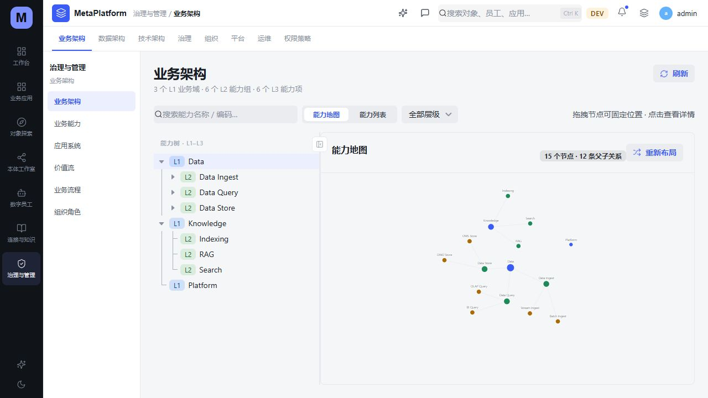
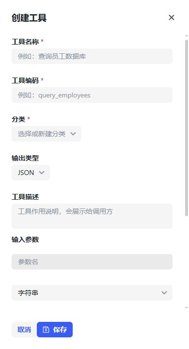

# UI 渲染与后端加载检查

2026-10-09，本地工作树 `codex/metaplatform-builder-v2`。本轮修复的基线为提交 `1e9bf1dafa808d244be0e52cdb5e65cc56e04cf5`，本报告记录本地验证结果。预览入口为 <http://127.0.0.1:59260/gov/business>。

## 检查结果

从当前源码采集 151 个路由模式，其中 129 个静态入口、22 个带资源上下文的入口，另检查 10 个通过查询参数切换的 AppHub 视图。每个入口分别以 1440 px、390 px 检查，共 322 次最终页面状态观察。最终观察中，页面或前景抽屉均已结束加载，没有全局“页面渲染出错”、文档横向溢出或滚动容器之外的越界控件。

动态入口中，14 个使用真实记录或基础探索入口；8 个明确验证不存在或未支持状态。后者不能视为成功加载记录的覆盖。表单、流程设计器验证了真实模块元数据和界面，页面设计器验证了不存在状态，未创建或发布应用。

完整清单见 [page-coverage.md](page-coverage.md)，机器可读的最终观察见 [coverage.json](coverage.json)，来源见 [source-route-inventory.json](source-route-inventory.json)。清单按路由、宽度选取时间最新的记录，保留原始 JSONL 中的失败、重试和登录过期过程。

检查使用实际浏览器 DOM、可访问性树、接口响应与关键页面截图；不是全页面像素差异测试。部分观察器等待曾超时，随后实际 DOM 已结束加载，等待错误仍保留。抽屉前景与底层页面分开记录：390 px 的一条服务器编辑记录有底层加载指示，前景已稳定；底层列表另有静态页面检查。局部表格横向滚动保留。`api: []` 仅表示本次响应缓冲没有捕获接口，不能解释为所有接口成功。

## 本轮修复

| 问题 | 修复后的行为 |
| --- | --- |
| 标题操作区、分栏、通知列表、表单和设计器在窄屏挤压或越界 | 共用页面骨架按容器宽度调整；导航收起为覆盖层；按钮换行、抽屉限制到视口宽度、设计器面板纵向排列；通过组件公开属性及自有样式实现 |
| 审计统计页日期组件触发 `RangeError`，进入整页错误边界 | Semi DatePicker 使用 `yyyy-MM-dd HH:mm`；保留实际请求的 ISO 日期值，日期与统计请求有回归用例 |
| 前端假定服务返回的 DTO 含有并不存在的字段 | 对齐待办、架构别名、员工提取/会话/观测、应用模块与 MCP 规则契约；保留未提供状态，不推断虚假发布时间、数量、所有者或运行状态 |
| 知识库、配置、设计器及详情请求失败后显示空数据、默认配置，或旧请求覆盖新资源 | 保留读取失败提示和重试入口；阻止读取未完成时写入；补充请求代次与卸载保护；知识文档与分块错误独立显示 |
| 员工学习页只使用首批员工记录 | 读取完整分页，保留选中员工上下文并处理分页失败和竞态 |
| MCP 权限规则编辑字段与当前契约不一致 | 使用 `subjectId/resourceIds/action/conditionExpression`，保存时保留多个资源 ID 和已有条件；资源类型切换清理不匹配选项 |
| MCP Server/Resource 目录缺少管理字段，旧界面却提供不支持的写操作 | 明确呈现目录数据及未提供字段；对应保存、启停、删除操作禁用且处理函数有保护；Client 读取失败时禁用保存与连接测试 |
| 模板预览和高级应用设计显示固定演示数据，或写入没有相应后端契约 | 模板预览读取实际快照；缺失数据明确提示；安装要求实际注册资源 ID；高级表单/流程写入及未支持模块操作禁用 |
| API 错误钩子因回调引用改变重复请求 | 固定实际依赖，错误能够稳定留在页面；403 显示权限不足提示 |
| 401 后无限刷新和重放 | 每个原始请求最多刷新并重放一次，刷新失败按既有行为清理会话并转到登录 |
| 正常登录和刷新签发的 JWT 缺少 `sub`，员工会话返回 `missing user context` | 为 Keycloak 的 `metaplatform-backend` 客户端补充官方 `oidc-sub-mapper`；登录、刷新均通过真实签名、issuer、audience 校验，取得一致的 subject |

## 后端加载恢复与真实读取

本轮保留原 Vite 59260、认证 58111、本体 58017，以及已有 Keycloak、PostgreSQL、Redis、数据库和所有工作树。确认原网关属于该预览后，更新 58110 网关的本地服务地址；其余 19 个服务使用当前仓库应用入口及独立端口 58200–58218。修复本地启动依赖、网关目标、Windows 服务进程环境和 Agent Team 的 asyncio 事件循环设置。后端 Python 源码及 OpenAPI 契约没有修改。

运行配置和启动辅助文件位于本工作树 `.superpowers/runtime/ui-render-audit-2026-10-09/`，原环境保持完整。新建独立 Python 3.12 环境，按后端锁文件准备 141 个依赖；前端使用既有工作树安装与锁文件，实际验证使用 Node 22.23.3、pnpm 11.15.1。未运行删除锁文件的安装命令。

Agent Team 使用独立 `codex_ui_audit_team_20261009` 数据库和 `ui_audit_team_api` 非特权角色，按源码启用 RLS。其他新增领域服务使用本地内存或独立 SQLite 存储及当前源码的开发样例。这些是真实应用入口的响应，不代表生产业务数据、外部 LLM 调用或生产环境验收。

Keycloak 配置同时保存在 [realm-mate.json](../../../../infra/keycloak/realm-mate.json)。运行时修改前核对预览容器的 goal/scope 标签和 55389 端口，仅增加 Subject mapper，原 5 个 mapper、账户、角色及权限保持原配置。证据见 [keycloak-subject-mapper.json](keycloak-subject-mapper.json)。没有使用跳过签名或兼容登录方式。

| 实际验证 | 结果与证据 |
| --- | --- |
| 最终 19 个服务健康读取，2026-10-09 11:07:52 北京时间 | 19 个 HTTP 200，[runtime-health-final.json](runtime-health-final.json) |
| 正常登录、刷新，以及两枚令牌的严格验证 | HTTP 200，subject 与 UserInfo/登录令牌一致，[subject-conversations.json](subject-conversations.json) |
| 员工会话，登录/刷新令牌分别经源服务、网关、Vite | 6 次真实 GET 均 200，同上 |
| 本体对象类型、值类型经源服务、网关、Vite | 6 次 GET 均 200，[ontology-reads.json](ontology-reads.json) |
| MCP tools/resources/prompts 经源服务、网关、Vite | 9 次 GET 均 200，[mcp-runtime-probe.json](mcp-runtime-probe.json) |
| Agent Team profiles、架构目录、员工提取和 traces | 真实读取 200，[native-services.json](native-services.json) |
| 浏览器重新登录后的员工详情与消息读取 | 1440/390 px 均稳定，实际 GET 200，见最终页面清单 |

旧浏览器令牌签发于 mapper 修复之前，末轮详情检查中曾遇到 401、刷新 400 后跳转登录；按正常表单重新登录后已验证恢复。使用旧会话时应重新登录一次。

管理接口的 403、未建立编排会话的 404、未提供流程/不存在资源的 404 保留为真实状态，具体响应列在页面清单中。本轮没有给当前账户增加管理权限，也没有为缺少契约的功能返回成功。检查中还出现过 Keycloak/Docker 响应超时；后续读取已恢复，现有证据不足以说明其长期稳定性问题已根治。

## 前端验证

以下命令从 `metaplatform-frontend` 工作区执行。完整测试在最后一轮类型适配及布局微调前通过，随后对受影响的应用读取、资源列表、权限规则和审计日期组件复测 18 项；最终构建包含最后的服务器按钮换行修改。

| 命令 | 结果 |
| --- | --- |
| `pnpm --filter @mate/web test:unit` | 48 个文件、389 项通过，36.32 s |
| `pnpm --filter @mate/web test:unit src/api/apphub/apps.test.ts src/pages/mcp/ResourceListPage.test.tsx src/pages/mcp/PermissionRulePage.test.tsx src/pages/mcp/AuditStatisticsPage.test.tsx` | 4 个文件、18 项通过，16.32 s |
| `pnpm --filter @mate/web typecheck` | 退出码 0 |
| `pnpm --filter @mate/web build` | 退出码 0，24.59 s；仍有现有大于 500 kB 的产物提示 |

命令结果、日志摘要哈希和证据范围见 [verification.json](verification.json)。本轮没有执行完整六组本体 PostgreSQL 回归、PR/主干 CI、部署或 GA 业务验收，不能据此更新 R1 或发布验收状态。

## 修复后截图

治理页使用恢复默认视口后的浏览器实际截图；工具抽屉使用 390 × 720 的实际截图区域。临时审查标签页已关闭，用户原有标签页及本地预览服务保留。

