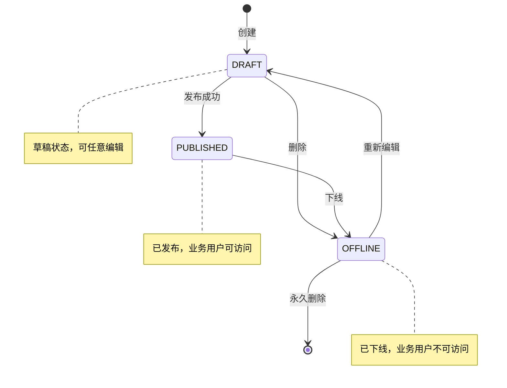
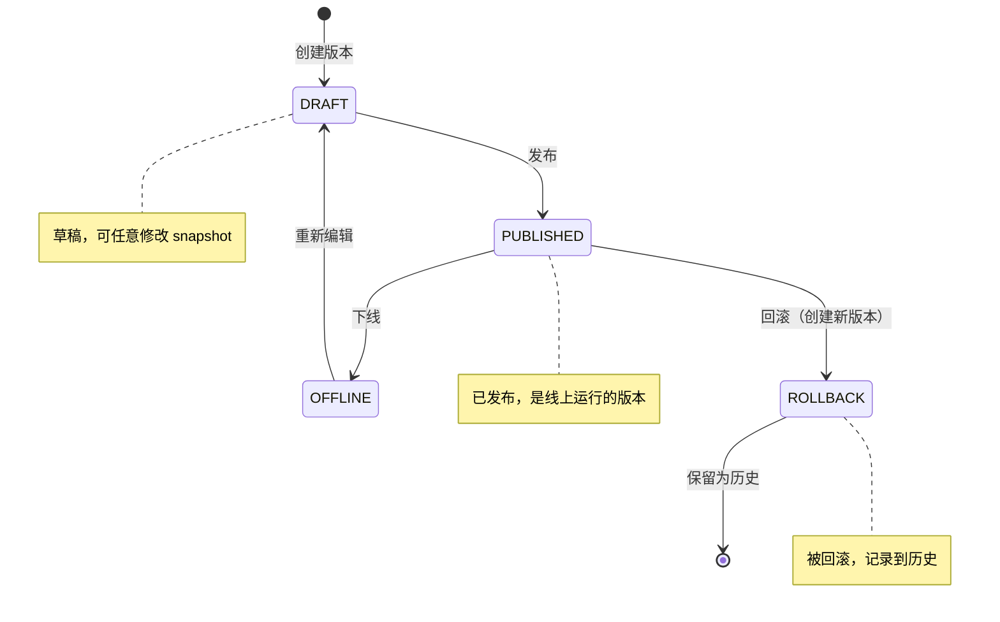
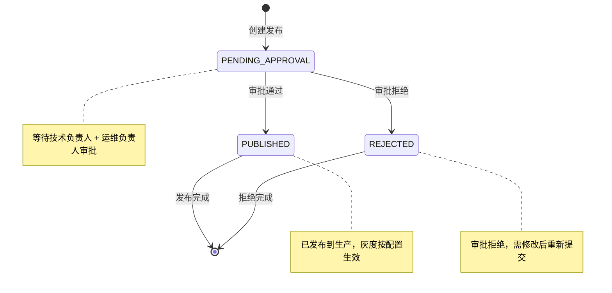
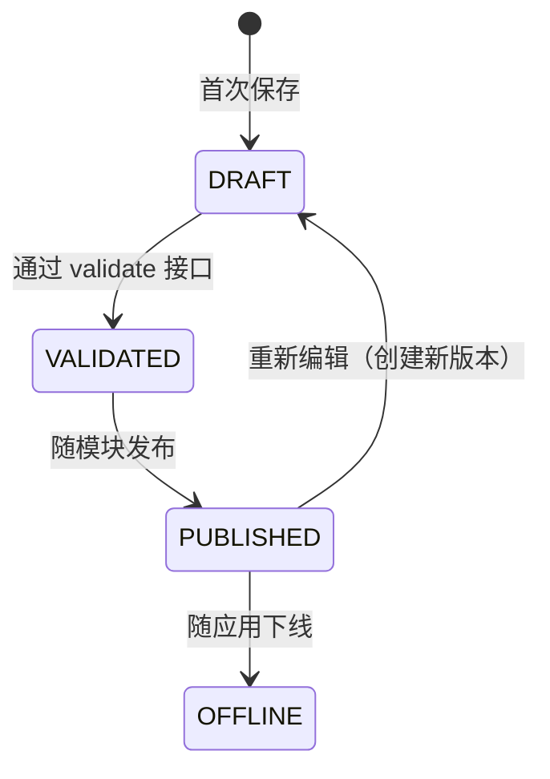
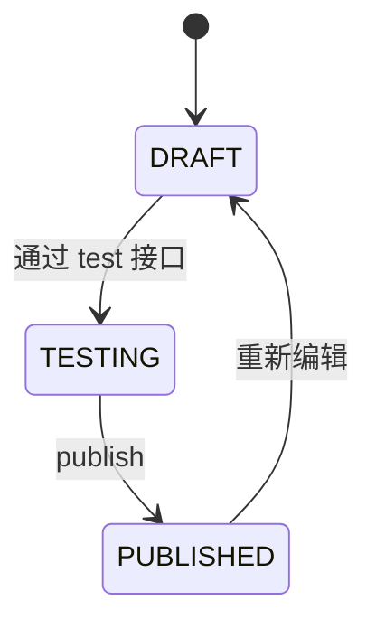

# APP-APPHUB 详细规范

> **版本**: v1.0 | **日期**: 2026-07-27
> **模块**: APP-APPHUB（应用中心）
> **关联主 PRD**: `PRD-APP-APPHUB-应用中心_v2.2-20260727.md`
> **关联 API 契约**: `API-CONTRACT-前端接口契约清单_v1.0-20260727.md` §3.2, §3.3
> **归属后端服务**: TECH-EA（应用管理）+ TECH-WFE（流程）

---

## 1. 完整数据模型

### 1.1 实体清单

| # | 实体名 | 中文 | 表名 | 关联 |
|---|---|---|---|---|
| 1 | App | 应用 | apphub_app | 1:N → Module, AppVersion, ReleaseRecord |
| 2 | Module | 模块 | apphub_module | N:1 → App, 1:1 → FormDefinition / FlowConfig / PageDesignerConfig |
| 3 | FormDefinition | 表单定义 | wfe_form_definition | 1:1 → Module, 1:N → FormField, 1:1 → FormGlobalSettings, 1:N → LinkageRule, 1:1 → FormScripts |
| 4 | FormField | 表单字段 | wfe_form_field | N:1 → FormDefinition |
| 5 | FormGlobalSettings | 表单全局设置 | wfe_form_global_settings | 1:1 → FormDefinition |
| 6 | LinkageRule | 联动规则 | wfe_form_linkage_rule | N:1 → FormDefinition |
| 7 | FormScripts | 表单脚本 | wfe_form_scripts | 1:1 → FormDefinition |
| 8 | FlowConfig | 流程配置 | wfe_flow_config | 1:1 → Module, 1:N → FlowNode, 1:N → FlowEdge |
| 9 | FlowNode | 流程节点 | wfe_flow_node | N:1 → FlowConfig |
| 10 | FlowEdge | 流程边 | wfe_flow_edge | N:1 → FlowConfig |
| 11 | PageDesignerConfig | 页面设计器配置 | apphub_page_config | 1:1 → Module, JSON 字段存 widgets |
| 12 | AppVersion | 应用版本 | apphub_app_version | N:1 → App, JSON 字段存 snapshot |
| 13 | ReleaseRecord | 发布记录 | apphub_release | N:1 → App |
| 14 | ReleaseLog | 发布日志 | apphub_release_log | N:1 → ReleaseRecord |
| 15 | ReleaseTask | 发布审批任务 | wfe_release_task | 通过 processInstanceId 关联到 Flowable |
| 16 | Template | 应用市场模板 | apphub_template | 1:N → TemplateComment |
| 17 | TemplateComment | 模板评论 | apphub_template_comment | N:1 → Template |

### 1.2 实体字段定义

#### App（应用）
| 字段 | 类型 | 必填 | 默认 | 说明 |
|---|---|---|---|---|
| appId | string(36) | 是 | uuid | 主键 |
| tenantId | string(36) | 是 | - | 租户 ID |
| name | string(64) | 是 | - | 应用名 |
| code | string(64) | 是 | - | 应用编码（系统内唯一，英文数字下划线） |
| group | string(32) | 否 | "default" | 应用分组 |
| description | string(512) | 否 | - | 应用描述 |
| icon | string(256) | 否 | - | 应用图标 URL |
| status | enum | 是 | DRAFT | DRAFT/PUBLISHED/OFFLINE |
| version | string(16) | 是 | "1.0.0" | 当前版本号 |
| ownerId | string(36) | 是 | - | 应用负责人 userId |
| techLeadId | string(36) | 否 | - | 技术负责人 userId |
| opsOwnerId | string(36) | 否 | - | 运维负责人 userId |
| tags | string[] | 否 | [] | 标签 |
| createdBy | string(36) | 是 | - | 创建人 |
| createdAt | timestamp | 是 | now | 创建时间 |
| updatedBy | string(36) | 是 | - | 更新人 |
| updatedAt | timestamp | 是 | now | 更新时间 |
| isDeleted | boolean | 是 | false | 软删除 |

#### Module（模块）
| 字段 | 类型 | 必填 | 默认 | 说明 |
|---|---|---|---|---|
| moduleId | string(36) | 是 | uuid | 主键 |
| appId | string(36) | 是 | - | 所属应用 ID |
| name | string(64) | 是 | - | 模块名 |
| type | enum | 是 | - | FORM/FLOW/PAGE |
| description | string(512) | 否 | - | 模块描述 |
| configId | string(36) | 否 | - | 关联的 FormDefinition/FlowConfig/PageDesignerConfig ID |
| order | integer | 是 | 0 | 排序 |
| status | enum | 是 | DRAFT | DRAFT/PUBLISHED/OFFLINE |
| createdBy/At/updatedBy/At/isDeleted | | | | 同 App |

#### FormField（表单字段）
| 字段 | 类型 | 必填 | 默认 | 说明 |
|---|---|---|---|---|
| fieldId | string(36) | 是 | uuid | 主键 |
| formId | string(36) | 是 | - | 所属表单 ID |
| fieldKey | string(64) | 是 | - | 字段 Key（系统内唯一，英文数字下划线） |
| label | string(128) | 是 | - | 字段标签 |
| type | enum | 是 | - | Input/TextArea/Select/DatePicker/Number/Radio/Checkbox/Upload/RichText/Cascade/UserPicker/OrgPicker/Formula |
| required | boolean | 是 | false | 是否必填 |
| defaultValue | any | 否 | - | 默认值 |
| placeholder | string(128) | 否 | - | 占位符 |
| helpText | string(256) | 否 | - | 帮助文本 |
| validationRules | json | 否 | {} | 校验规则 { minLength, maxLength, pattern, min, max } |
| options | json | 否 | [] | 下拉/单选/多选项 |
| visible | boolean | 是 | true | 是否可见 |
| disabled | boolean | 是 | false | 是否禁用 |
| order | integer | 是 | 0 | 字段顺序 |
| width | enum | 否 | FULL | HALF/FULL/CUSTOM |
| span | integer | 否 | 24 | 栅格占位（1-24） |

#### FormGlobalSettings（表单全局设置）
| 字段 | 类型 | 必填 | 默认 | 说明 |
|---|---|---|---|---|
| settingsId | string(36) | 是 | uuid | 主键 |
| formId | string(36) | 是 | - | 所属表单 |
| title | string(128) | 是 | - | 表单标题 |
| description | string(512) | 否 | - | 表单描述 |
| layout | enum | 是 | VERTICAL | VERTICAL/HORIZONTAL/INLINE |
| labelPosition | enum | 是 | RIGHT | TOP/LEFT/RIGHT |
| labelWidth | integer | 否 | 120 | 标签宽度（px） |
| submitButton | json | 否 | {text:"提交",visible:true} | 提交按钮配置 |
| resetButton | json | 否 | {text:"重置",visible:false} | 重置按钮配置 |
| cancelButton | json | 否 | {text:"取消",visible:true} | 取消按钮配置 |
| successMessage | string(256) | 否 | "提交成功" | 提交成功提示 |
| failureMessage | string(256) | 否 | "提交失败" | 提交失败提示 |
| draftEnabled | boolean | 是 | true | 是否启用草稿 |
| attachmentEnabled | boolean | 是 | false | 是否支持附件 |

#### LinkageRule（联动规则）
| 字段 | 类型 | 必填 | 默认 | 说明 |
|---|---|---|---|---|
| ruleId | string(36) | 是 | uuid | 主键 |
| formId | string(36) | 是 | - | 所属表单 |
| name | string(64) | 是 | - | 规则名 |
| triggerField | string(64) | 是 | - | 触发字段 key |
| condition | string | 是 | - | 触发条件表达式 |
| actions | json | 是 | [] | 动作列表 [{type: SHOW/HIDE/ENABLE/DISABLE/SET_VALUE, targetField, value}] |
| enabled | boolean | 是 | true | 是否启用 |
| order | integer | 是 | 0 | 规则顺序 |

#### FormScripts（表单脚本）
| 字段 | 类型 | 必填 | 默认 | 说明 |
|---|---|---|---|---|
| scriptId | string(36) | 是 | uuid | 主键 |
| formId | string(36) | 是 | - | 所属表单 |
| onMount | text | 否 | - | 加载时执行（JavaScript） |
| onChange | text | 否 | - | 字段变化时执行 |
| beforeSubmit | text | 否 | - | 提交前校验 |
| afterSubmit | text | 否 | - | 提交后回调 |

#### FlowNode（流程节点）
| 字段 | 类型 | 必填 | 默认 | 说明 |
|---|---|---|---|---|
| nodeId | string(36) | 是 | uuid | 主键 |
| flowId | string(36) | 是 | - | 所属流程 |
| type | enum | 是 | - | START/APPROVAL/CONDITION/CARBON_COPY/END |
| name | string(64) | 是 | - | 节点名 |
| position | json | 是 | {x:0,y:0} | 节点位置 |
| assigneeType | enum | 否 | - | USER/ROLE/DEPT/INITIATOR/LEADER/FORM_FIELD |
| assigneeValue | string | 否 | - | 审批人/角色/部门 |
| approvalRule | json | 否 | - | 审批规则 {type: ANY/ALL, count, order, delegate} |
| condition | string | 否 | - | 条件表达式（CONDITION 节点） |
| formBindings | json | 否 | [] | 表单字段绑定 [{fieldKey, mode: READONLY/EDITABLE/REQUIRED/HIDDEN}] |
| timeout | json | 否 | - | 超时 {duration, action: AUTO_PASS/AUTO_REJECT/NOTIFY} |
| description | string(512) | 否 | - | 节点说明 |

#### FlowEdge（流程边）
| 字段 | 类型 | 必填 | 默认 | 说明 |
|---|---|---|---|---|
| edgeId | string(36) | 是 | uuid | 主键 |
| flowId | string(36) | 是 | - | 所属流程 |
| source | string(36) | 是 | - | 源节点 ID |
| target | string(36) | 是 | - | 目标节点 ID |
| label | string(64) | 否 | - | 边标签（用于条件分支） |
| condition | string | 否 | - | 边触发条件 |

#### PageDesignerConfig（页面设计器配置）
| 字段 | 类型 | 必填 | 默认 | 说明 |
|---|---|---|---|---|
| configId | string(36) | 是 | uuid | 主键 |
| moduleId | string(36) | 是 | - | 所属模块 |
| name | string(64) | 是 | - | 页面名 |
| description | string(512) | 否 | - | 页面描述 |
| layout | enum | 是 | GRID | GRID/FLOW/FLEX |
| widgets | json | 是 | [] | 组件列表 [{id, type: TABLE/CHART/FORM/FILTER/STAT/RICH_TEXT, position, props, dataSource}] |
| dataSources | json | 否 | [] | 数据源配置 [{id, type: API/MODEL/SQL, config}] |
| version | integer | 是 | 1 | 配置版本号 |
| createdBy/At/updatedBy/At/isDeleted | | | | 同 App |

#### AppVersion（应用版本）
| 字段 | 类型 | 必填 | 默认 | 说明 |
|---|---|---|---|---|
| versionId | string(36) | 是 | uuid | 主键 |
| appId | string(36) | 是 | - | 所属应用 |
| version | string(16) | 是 | - | 版本号（SemVer 1.0.0） |
| status | enum | 是 | DRAFT | DRAFT/PUBLISHED/OFFLINE/ROLLBACK |
| changeLog | string(1024) | 否 | - | 变更日志 |
| snapshot | json | 是 | - | 版本快照（完整应用配置） |
| publishedAt | timestamp | 否 | - | 发布时间 |
| rolledBackAt | timestamp | 否 | - | 回滚时间 |
| publishedBy | string(36) | 否 | - | 发布人 |
| rolledBackBy | string(36) | 否 | - | 回滚人 |

#### ReleaseRecord（发布记录）
| 字段 | 类型 | 必填 | 默认 | 说明 |
|---|---|---|---|---|
| releaseId | string(36) | 是 | uuid | 主键 |
| appId | string(36) | 是 | - | 所属应用 |
| version | string(16) | 是 | - | 版本号 |
| releaseNotes | string(1024) | 否 | - | 发布说明 |
| strategy | enum | 是 | FULL | FULL/GRAYSCALE |
| grayPercent | integer | 是 | 0 | 灰度百分比（0-100） |
| grayUsers | string[] | 否 | [] | 灰度用户 ID 列表 |
| grayDepts | string[] | 否 | [] | 灰度部门 ID 列表 |
| status | enum | 是 | PENDING_APPROVAL | PENDING_APPROVAL/PUBLISHED/REJECTED |
| approvalStatus | enum | 是 | PENDING | PENDING/APPROVED/REJECTED |
| processInstanceId | string(36) | 否 | - | 审批流实例 ID |
| techLeadId | string(36) | 是 | - | 技术负责人 |
| opsOwnerId | string(36) | 是 | - | 运维负责人 |
| createdBy/At | | | | 同 App |

#### Template（应用市场模板）
| 字段 | 类型 | 必填 | 默认 | 说明 |
|---|---|---|---|---|
| templateId | string(36) | 是 | uuid | 主键 |
| name | string(64) | 是 | - | 模板名 |
| category | enum | 是 | - | OA/CRM/HR/Finance/Project/Other |
| description | string(512) | 否 | - | 模板描述 |
| icon | string(256) | 否 | - | 模板图标 URL |
| tags | string[] | 否 | [] | 标签 |
| downloadCount | integer | 是 | 0 | 下载次数 |
| rating | decimal(2,1) | 是 | 0 | 评分（0-5） |
| ratingCount | integer | 是 | 0 | 评分次数 |
| preview | string(1024) | 否 | - | 预览图 URL |
| configSnapshot | json | 是 | - | 配置快照 |
| authorId | string(36) | 是 | - | 作者 ID |
| isOfficial | boolean | 是 | false | 是否官方 |
| status | enum | 是 | PUBLISHED | DRAFT/PUBLISHED/REJECTED |

---

## 2. 完整 API Schema（JSON Schema 2020-12）

> **说明**: 仅列出本模块最关键的 10 个端点的完整 Schema，其他端点请参考 API-CONTRACT.md §3.2, §3.3

### 2.1 端点关键清单

| # | 方法 | 路径 | 优先级 |
|---|---|---|---|
| 1 | GET | /v1/apphub/apps | P0 |
| 2 | POST | /v1/apphub/apps | P0 |
| 3 | GET | /v1/apphub/apps/{id} | P0 |
| 4 | PUT | /v1/apphub/apps/{id} | P0 |
| 5 | POST | /v1/apphub/apps/{id}/versions | P0 |
| 6 | POST | /v1/apphub/versions/{id}/publish | P0 |
| 7 | POST | /v1/apphub/versions/{id}/rollback | P0 |
| 8 | POST | /v1/apphub/apps/{id}/releases | P0 |
| 9 | GET | /v1/wfe/forms/{id} | P0 |
| 10 | PUT | /v1/wfe/forms/{id}/settings | P0 |
| 11 | GET | /v1/wfe/flows/{moduleId} | P0 |
| 12 | PUT | /v1/wfe/flows/{moduleId} | P0 |

### 2.2 完整 Schema

#### 端点 1: GET /v1/apphub/apps

**用途**: 分页查询应用列表

**Query 参数**:
```json
{
  "$schema": "https://json-schema.org/draft/2020-12/schema",
  "type": "object",
  "properties": {
    "keyword": { "type": "string", "maxLength": 64, "description": "搜索关键字（name/code）" },
    "group": { "type": "string", "maxLength": 32, "description": "应用分组" },
    "status": { "type": "string", "enum": ["DRAFT", "PUBLISHED", "OFFLINE"], "description": "应用状态" },
    "page": { "type": "integer", "minimum": 1, "default": 1 },
    "size": { "type": "integer", "minimum": 1, "maximum": 100, "default": 20 },
    "sortBy": { "type": "string", "enum": ["createdAt", "updatedAt", "name"], "default": "updatedAt" },
    "sortOrder": { "type": "string", "enum": ["asc", "desc"], "default": "desc" }
  },
  "additionalProperties": false
}
```

**Response 200 Schema**:
```json
{
  "type": "object",
  "properties": {
    "code": { "const": 0 },
    "message": { "type": "string" },
    "data": {
      "type": "object",
      "properties": {
        "items": {
          "type": "array",
          "items": { "$ref": "#/definitions/App" }
        },
        "total": { "type": "integer", "minimum": 0 },
        "page": { "type": "integer", "minimum": 1 },
        "size": { "type": "integer", "minimum": 1 },
        "pages": { "type": "integer", "minimum": 0 }
      },
      "required": ["items", "total", "page", "size", "pages"]
    }
  },
  "required": ["code", "message", "data"]
}
```

**App 定义**:
```json
{
  "definitions": {
    "App": {
      "type": "object",
      "properties": {
        "appId": { "type": "string", "format": "uuid" },
        "tenantId": { "type": "string", "format": "uuid" },
        "name": { "type": "string", "maxLength": 64 },
        "code": { "type": "string", "pattern": "^[a-zA-Z][a-zA-Z0-9_]{0,63}$" },
        "group": { "type": "string" },
        "description": { "type": "string" },
        "icon": { "type": "string", "format": "uri" },
        "status": { "type": "string", "enum": ["DRAFT", "PUBLISHED", "OFFLINE"] },
        "version": { "type": "string", "pattern": "^\\d+\\.\\d+\\.\\d+$" },
        "ownerId": { "type": "string" },
        "techLeadId": { "type": "string" },
        "opsOwnerId": { "type": "string" },
        "tags": { "type": "array", "items": { "type": "string" } },
        "createdBy": { "type": "string" },
        "createdAt": { "type": "string", "format": "date-time" },
        "updatedBy": { "type": "string" },
        "updatedAt": { "type": "string", "format": "date-time" }
      },
      "required": ["appId", "tenantId", "name", "code", "status", "version", "createdAt", "updatedAt"]
    }
  }
}
```

**错误码**:
- `1001`: keyword 格式错误
- `2001`: 应用不存在
- `3001`: 无权限访问该租户

---

#### 端点 2: POST /v1/apphub/apps

**用途**: 创建应用

**Request Body**:
```json
{
  "type": "object",
  "properties": {
    "name": { "type": "string", "minLength": 1, "maxLength": 64, "description": "应用名" },
    "code": { "type": "string", "pattern": "^[a-zA-Z][a-zA-Z0-9_]{0,63}$", "description": "应用编码" },
    "group": { "type": "string", "maxLength": 32, "default": "default" },
    "description": { "type": "string", "maxLength": 512 },
    "icon": { "type": "string", "format": "uri" },
    "techLeadId": { "type": "string", "format": "uuid" },
    "opsOwnerId": { "type": "string", "format": "uuid" },
    "tags": { "type": "array", "items": { "type": "string", "maxLength": 32 }, "maxItems": 10 },
    "templateId": { "type": "string", "format": "uuid", "description": "从模板创建时传入" }
  },
  "required": ["name", "code"],
  "additionalProperties": false
}
```

**Response 201 Schema**:
```json
{
  "type": "object",
  "properties": {
    "code": { "const": 0 },
    "message": { "type": "string", "example": "创建成功" },
    "data": { "$ref": "#/definitions/App" }
  }
}
```

**错误码**:
- `1001`: 参数错误（name 空、code 格式错）
- `2002`: 应用编码已存在（同一 group 内）
- `3001`: 无应用管理权限
- `5001`: 业务规则违反（如 name 含敏感词）

---

#### 端点 6: POST /v1/apphub/versions/{id}/publish

**用途**: 发布应用版本

**Request Body**: 无

**Response 200 Schema**:
```json
{
  "type": "object",
  "properties": {
    "code": { "const": 0 },
    "message": { "type": "string" },
    "data": { "$ref": "#/definitions/AppVersion" }
  }
}
```

**错误码**:
- `2001`: 版本不存在
- `5001`: 当前状态不允许发布（如已发布的版本不能再次发布）
- `5002`: 应用下存在未发布的模块

**状态机约束**:
- 仅 DRAFT 状态可发布
- 发布后变为 PUBLISHED

---

#### 端点 8: POST /v1/apphub/apps/{id}/releases

**用途**: 创建发布申请（含灰度配置）

**Request Body**:
```json
{
  "type": "object",
  "properties": {
    "version": { "type": "string", "pattern": "^\\d+\\.\\d+\\.\\d+$" },
    "releaseNotes": { "type": "string", "maxLength": 1024 },
    "strategy": { "type": "string", "enum": ["FULL", "GRAYSCALE"] },
    "grayPercent": { "type": "integer", "minimum": 0, "maximum": 100, "default": 0 },
    "grayUsers": { "type": "array", "items": { "type": "string", "format": "uuid" } },
    "grayDepts": { "type": "array", "items": { "type": "string", "format": "uuid" } },
    "techLeadId": { "type": "string", "format": "uuid" },
    "opsOwnerId": { "type": "string", "format": "uuid" }
  },
  "required": ["version", "strategy", "techLeadId", "opsOwnerId"],
  "if": { "properties": { "strategy": { "const": "GRAYSCALE" } } },
  "then": {
    "anyOf": [
      { "required": ["grayPercent"], "not": { "properties": { "grayPercent": { "const": 0 } } } },
      { "required": ["grayUsers"], "minProperties": 1 },
      { "required": ["grayDepts"], "minProperties": 1 }
    ]
  }
}
```

**错误码**:
- `1001`: 参数错误（如 GRAYSCALE 但 grayPercent=0 且无 grayUsers/grayDepts）
- `2001`: 应用或版本不存在
- `3001`: 无发布权限

---

#### 端点 10: PUT /v1/wfe/forms/{id}/settings

**用途**: 更新表单全局设置

**Request Body**:
```json
{
  "type": "object",
  "properties": {
    "title": { "type": "string", "minLength": 1, "maxLength": 128 },
    "description": { "type": "string", "maxLength": 512 },
    "layout": { "type": "string", "enum": ["VERTICAL", "HORIZONTAL", "INLINE"] },
    "labelPosition": { "type": "string", "enum": ["TOP", "LEFT", "RIGHT"] },
    "labelWidth": { "type": "integer", "minimum": 80, "maximum": 200 },
    "submitButton": {
      "type": "object",
      "properties": {
        "text": { "type": "string", "maxLength": 32 },
        "visible": { "type": "boolean" }
      }
    },
    "resetButton": {
      "type": "object",
      "properties": {
        "text": { "type": "string", "maxLength": 32 },
        "visible": { "type": "boolean" }
      }
    },
    "cancelButton": {
      "type": "object",
      "properties": {
        "text": { "type": "string", "maxLength": 32 },
        "visible": { "type": "boolean" }
      }
    },
    "successMessage": { "type": "string", "maxLength": 256 },
    "failureMessage": { "type": "string", "maxLength": 256 },
    "draftEnabled": { "type": "boolean" },
    "attachmentEnabled": { "type": "boolean" }
  },
  "required": ["title"],
  "additionalProperties": false
}
```

---

### 2.3 通用错误响应

```json
{
  "type": "object",
  "properties": {
    "code": { "type": "integer", "description": "非 0 表示错误" },
    "message": { "type": "string" },
    "traceId": { "type": "string" }
  },
  "required": ["code", "message"]
}
```

**错误码字典**:
| code | 含义 | HTTP |
|---|---|---|
| 0 | 成功 | 200 |
| 1001 | 参数错误 | 200 |
| 2001 | 资源不存在 | 200 |
| 2002 | 资源冲突 | 200 |
| 2003 | 资源已删除 | 200 |
| 3001 | 无权限 | 200 |
| 3002 | 租户隔离冲突 | 200 |
| 4001 | LLM 调用失败 | 200 |
| 5001 | 业务规则违反 | 200 |
| 5002 | 状态机不允许 | 200 |

---

## 3. 状态机

### 3.1 App 状态机



**状态转移规则**:
- DRAFT → PUBLISHED: 需要有已发布的版本（AppVersion.status = PUBLISHED）
- PUBLISHED → OFFLINE: 自动级联下线所有已发布版本
- OFFLINE → DRAFT: 仅应用 owner 可执行
- 任何状态 → 删除: 软删除（isDeleted = true），不允许物理删除

### 3.2 AppVersion 状态机



**状态转移规则**:
- DRAFT → PUBLISHED: 仅当对应 App.status = DRAFT 或 PUBLISHED
- PUBLISHED → OFFLINE: 自动级联对应的 ReleaseRecord 状态
- PUBLISHED → ROLLBACK: 创建新版本（继承前一个 PUBLISHED 版本的 snapshot）

### 3.3 ReleaseRecord 状态机



**审批流**:
- techLeadId 必须审批通过
- opsOwnerId 必须审批通过
- 两人均通过 → status=PUBLISHED
- 任一拒绝 → status=REJECTED

### 3.4 FormDefinition 状态机（隐式）



### 3.5 FlowConfig 状态机（隐式）



---

## 4. 业务规则

### 4.1 应用管理

- **BR-001**: 应用编码在同一 group 内必须唯一
- **BR-002**: 应用名长度 1-64 字符
- **BR-003**: 应用编码必须以字母开头，只能包含字母数字下划线
- **BR-004**: 删除应用需先下线（status = OFFLINE）
- **BR-005**: 应用至少需要 1 个模块才能发布

### 4.2 版本管理

- **BR-010**: 版本号遵循 SemVer 规范（X.Y.Z）
- **BR-011**: 同一应用下版本号不能重复
- **BR-012**: 已发布的版本不允许修改 snapshot，只能创建新版本
- **BR-013**: 回滚操作会创建一个新版本（status = ROLLBACK），而不是直接修改
- **BR-014**: 一个应用同一时间最多只有 1 个 PUBLISHED 版本

### 4.3 发布与灰度

- **BR-020**: GRAYSCALE 策略必须指定灰度比例（1-100）或具体用户/部门
- **BR-021**: 灰度比例 + grayUsers + grayDepts 至少有一项非空
- **BR-022**: 发布需要 techLeadId 和 opsOwnerId 两个审批人
- **BR-023**: 灰度发布可一键升级为全量发布
- **BR-024**: 全量发布失败时自动回滚到上一个 PUBLISHED 版本

### 4.4 表单设计

- **BR-030**: 表单必须有 title
- **BR-031**: fieldKey 在同一表单内必须唯一
- **BR-032**: 联动规则引用字段必须存在
- **BR-033**: 脚本长度不超过 64KB
- **BR-034**: submit/reset/cancel 按钮的 text 长度不超过 32 字符

### 4.5 流程设计

- **BR-040**: 流程必须有且仅有 1 个 START 节点和至少 1 个 END 节点
- **BR-041**: CONDITION 节点的每条出边必须有 condition
- **BR-042**: 节点位置必须在画布范围内（默认 0-4000 × 0-3000）
- **BR-043**: 流程不允许出现孤立节点
- **BR-044**: 节点审批人配置必须明确（不能空）

### 4.6 应用市场

- **BR-050**: 模板评分范围 0-5（一位小数）
- **BR-051**: 模板评论文本长度不超过 2000 字符
- **BR-052**: 同一用户对同一模板只能评论一次（可修改）
- **BR-053**: 官方模板不可删除

---

## 5. 权限矩阵

### 5.1 角色定义

| 角色 | 代码 | 说明 |
|---|---|---|
| 应用管理员 | app_admin | 创建/管理应用 |
| 表单设计者 | form_designer | 设计表单 |
| 流程设计者 | flow_designer | 设计流程 |
| 业务用户 | biz_user | 使用应用 |
| 应用查看者 | app_viewer | 只读访问 |

### 5.2 资源 × 角色 × 操作矩阵

| 资源 | app_admin | form_designer | flow_designer | biz_user | app_viewer |
|---|---|---|---|---|---|
| **App** | CRUD | R | R | R | R |
| **Module** | CRUD | R | R | R | R |
| **FormDefinition** | CRUD | R/W | R | R | R |
| **FormField** | CRUD | R/W | R | R | R |
| **FlowConfig** | CRUD | R | R/W | R | R |
| **PageDesignerConfig** | CRUD | R | R | R | R |
| **AppVersion** | CRUD | R | R | R | R |
| **ReleaseRecord** | CRUD | R | R | - | R |
| **Template** | CRUD | R | R | R/U | R |
| **TemplateComment** | CRUD | R/W | R/W | R/W | R |

> 标记说明: C=Create, R=Read, U=Update, D=Delete, - = 无权限

### 5.3 数据隔离规则

- **租户隔离**: 所有资源必须按 tenantId 过滤
- **个人隔离**: 用户只能看到自己 owner 的资源（除非是 admin）
- **部门隔离**: 部门管理员可看到本部门及子部门资源

---

## 6. 性能要求

| 操作 | P50 | P99 | QPS |
|---|---|---|---|
| 列表查询 | < 100ms | < 500ms | 100 |
| 详情查询 | < 50ms | < 200ms | 500 |
| 创建应用 | < 300ms | < 1000ms | 50 |
| 更新应用 | < 300ms | < 1000ms | 50 |
| 发布应用（含审批） | < 1s | < 3s | 10 |
| 表单保存 | < 200ms | < 500ms | 100 |
| 流程保存 | < 200ms | < 500ms | 100 |

---

## 7. 安全要求

- **认证**: 所有 API 必须携带 Bearer Token（除非明确公开）
- **授权**: 必须按权限矩阵校验
- **审计**: 所有写操作（Create/Update/Delete）记录审计日志
- **数据加密**: 敏感字段（如描述、API Key）加密存储
- **XSS 防护**: 用户输入内容渲染时转义
- **CSRF 防护**: 跨域请求需 CSRF Token

---

## 8. 国际化

- 所有用户可见字符串需 i18n key
- 支持 zh-CN, en-US
- 文案 key 命名规范：`apphub.{module}.{key}`（如 `apphub.app.create.success`）

---

## 9. 测试要求

### 9.1 单元测试
- 覆盖率 ≥ 80%
- 每个 Service 方法覆盖正常 + 异常路径
- 状态机转移覆盖所有状态

### 9.2 集成测试
- 每个 Controller 覆盖 CRUD 全流程
- 权限校验测试
- 租户隔离测试

### 9.3 契约测试
- 与前端 API-CONTRACT.md 一致
- 响应 schema 验证

### 9.4 E2E 测试
- 完整业务流程：创建应用 → 创建模块 → 设计表单 → 设计流程 → 发布 → 业务用户使用
- 灰度发布流程
- 回滚流程
