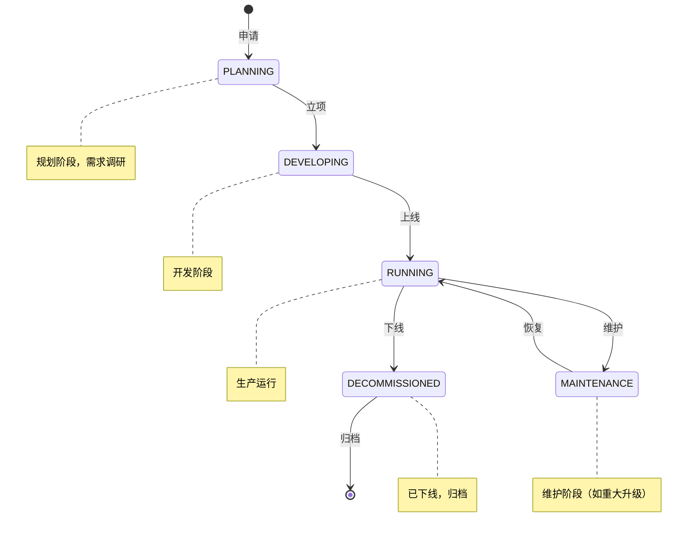
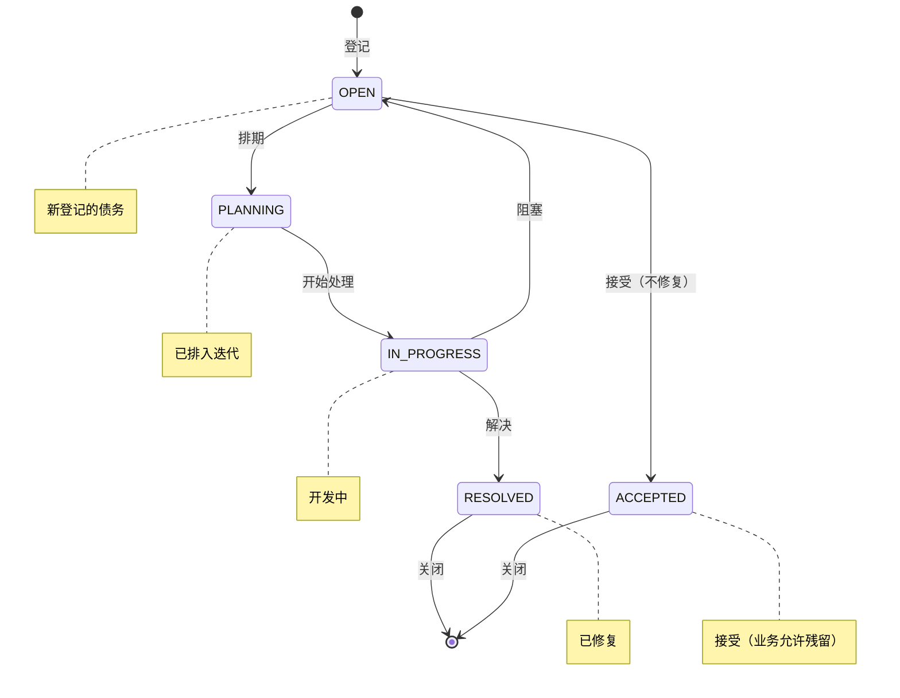
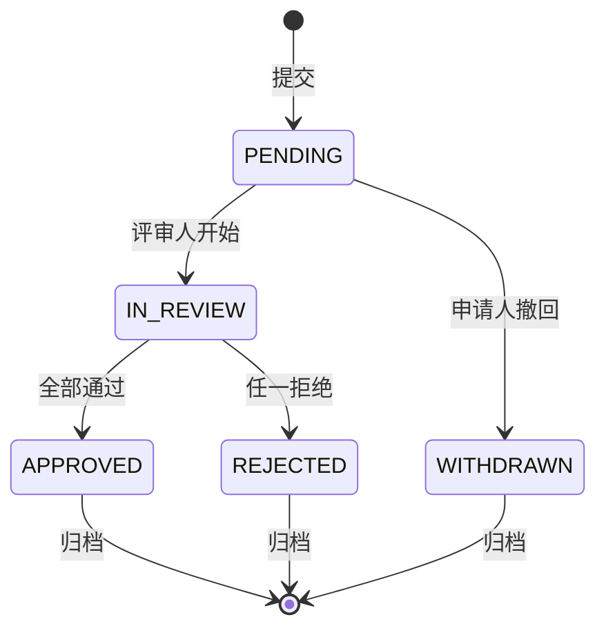
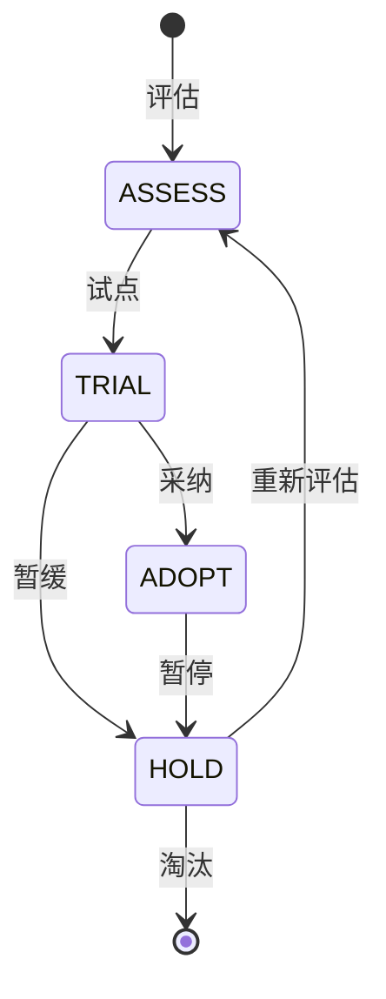

# APP-ARCH 详细规范

> **版本**: v1.0 | **日期**: 2026-07-27
> **模块**: APP-ARCH（架构中心）
> **关联主 PRD**: `PRD-APP-ARCH-架构中心_v2.2-20260727.md`
> **关联 API 契约**: `API-CONTRACT-前端接口契约清单_v1.0-20260727.md` §3.9
> **归属后端服务**: TECH-EA

---

## 1. 完整数据模型

### 1.1 实体清单

| # | 实体 | 中文 | 表名 | 关联 |
|---|---|---|---|---|
| 1 | Capability | 业务能力 | ea_capability | N:1 → parent, 1:N → Application |
| 2 | ValueStream | 价值流 | ea_value_stream | 1:N → ValueStreamStage |
| 3 | ValueStreamStage | 价值流阶段 | ea_value_stream_stage | N:1 → ValueStream |
| 4 | BusinessProcess | 业务流程 | ea_business_process | N:1 → Capability |
| 5 | OrgUnit | 组织单元 | ea_org_unit | N:1 → parent, 1:N → User |
| 6 | Role | 角色 | ea_role | N:M → OrgUnit, 1:N → Permission |
| 7 | Application | 应用系统 | ea_application | 1:N → Capability (via capabilityMapping) |
| 8 | DataDomain | 数据主题域 | ea_data_domain | 1:N → DataEntity |
| 9 | DataEntity | 数据实体 | ea_data_entity | N:1 → DataDomain |
| 10 | DataFlow | 数据流转 | ea_data_flow | N:M → DataEntity |
| 11 | DataStandard | 数据标准 | ea_data_standard | 1:N → DataEntityField |
| 12 | DataAsset | 数据资产 | ea_data_asset | N:1 → DataEntity |
| 13 | TechStack | 技术栈 | ea_tech_stack | 1:N → TechnologyComponent |
| 14 | TechnologyComponent | 技术组件 | ea_technology_component | N:1 → TechStack |
| 15 | Infrastructure | 基础设施 | ea_infrastructure | N:1 → parent |
| 16 | Deployment | 部署 | ea_deployment | N:1 → Application, N:1 → Infrastructure |
| 17 | Principle | 架构原则 | ea_principle | N:1 → PrincipleCategory |
| 18 | PrincipleCategory | 原则分类 | ea_principle_category | 1:N → Principle |
| 19 | ReviewTemplate | 评审模板 | ea_review_template | 1:N → ReviewTicket |
| 20 | ReviewTicket | 评审工单 | ea_review_ticket | N:1 → ReviewTemplate |
| 21 | TechDebt | 技术债务 | ea_tech_debt | N:1 → Application |
| 22 | OntologyMapping | 映射规则 | ea_ontology_mapping | N:1 → Capability/Application/DataEntity, 1:N → Concept/Entity |

### 1.2 关键实体字段

#### Capability（业务能力）
| 字段 | 类型 | 必填 | 说明 |
|---|---|---|---|
| capabilityId | string(36) | 是 | 主键 |
| tenantId | string(36) | 是 | 租户 |
| parentId | string(36) | 否 | 父能力 ID（层级树） |
| name | string(64) | 是 | 能力名 |
| code | string(64) | 是 | 能力编码 |
| level | enum | 是 | L1/L2/L3/L4 |
| maturityLevel | enum | 是 | INITIAL/DEFINED/MANAGED/MEASURED/OPTIMIZING |
| description | string(1024) | 否 | 描述 |
| ownerOrgId | string(36) | 是 | 负责组织 |
| ownerUserId | string(36) | 是 | 负责人 |
| tags | string[] | 否 | 标签 |
| metadata | json | 否 | 扩展元数据 |

#### ValueStream（价值流）
| 字段 | 类型 | 必填 | 说明 |
|---|---|---|---|
| valueStreamId | string(36) | 是 | 主键 |
| name | string(64) | 是 | 价值流名 |
| type | enum | 是 | OPERATIONAL/DEVELOPMENT/MANAGEMENT |
| fromStage | string(32) | 是 | 起点阶段 |
| toStage | string(32) | 是 | 终点阶段 |
| description | string(1024) | 否 | 描述 |
| leadTime | integer | 否 | 交付周期（小时） |
| cycleTime | integer | 否 | 处理周期（小时） |
| efficiency | decimal(5,2) | 否 | 效率（%） |

#### ValueStreamStage
| 字段 | 类型 | 必填 | 说明 |
|---|---|---|---|
| stageId | string(36) | 是 | 主键 |
| valueStreamId | string(36) | 是 | 所属价值流 |
| name | string(64) | 是 | 阶段名 |
| order | integer | 是 | 顺序 |
| type | enum | 是 | VALUE_ADD/NECESSARY/EXTRA |
| duration | integer | 否 | 阶段时长（小时） |
| ownerOrgId | string(36) | 是 | 负责组织 |

#### BusinessProcess（业务流程）
| 字段 | 类型 | 必填 | 说明 |
|---|---|---|---|
| processId | string(36) | 是 | 主键 |
| capabilityId | string(36) | 是 | 关联能力 |
| name | string(64) | 是 | 流程名 |
| version | string(16) | 是 | 版本号 |
| bpmnXml | text | 是 | BPMN 2.0 XML |
| status | enum | 是 | DRAFT/PUBLISHED/DEPRECATED |
| triggerEvent | string(128) | 否 | 触发事件 |
| outputValue | string(512) | 否 | 输出价值 |

#### Application（应用系统）
| 字段 | 类型 | 必填 | 说明 |
|---|---|---|---|
| appId | string(36) | 是 | 主键 |
| name | string(64) | 是 | 应用名 |
| code | string(64) | 是 | 应用编码 |
| type | enum | 是 | BUSINESS/PLATFORM/INFRA/MIDDLEWARE |
| status | enum | 是 | PLANNING/DEVELOPING/RUNNING/MAINTENANCE/DECOMMISSIONED |
| criticality | enum | 是 | CORE/IMPORTANT/GENERAL/MARGINAL |
| techStack | json | 否 | 技术栈快照 |
| deployedAt | timestamp | 否 | 首次部署时间 |
| ownerOrgId | string(36) | 是 | 负责组织 |

#### DataEntity（数据实体）
| 字段 | 类型 | 必填 | 说明 |
|---|---|---|---|
| entityId | string(36) | 是 | 主键 |
| domainId | string(36) | 是 | 所属主题域 |
| name | string(64) | 是 | 实体名 |
| code | string(64) | 是 | 实体编码 |
| description | string(1024) | 否 | 描述 |
| fields | json | 是 | 字段列表 [{name, type, required, description, standardId?}] |
| sourceSystems | string[] | 否 | 来源系统 |
| storageType | enum | 是 | RDBMS/NOSQL/FILE/STREAM |
| tableName | string(64) | 否 | 物理表名 |
| retentionDays | integer | 否 | 保留天数 |

#### TechStack（技术栈）
| 字段 | 类型 | 必填 | 说明 |
|---|---|---|---|
| stackId | string(36) | 是 | 主键 |
| name | string(64) | 是 | 技术栈名 |
| category | enum | 是 | LANGUAGE/FRAMEWORK/DATABASE/MIDDLEWARE/TOOL/PLATFORM |
| version | string(64) | 是 | 版本号 |
| vendor | string(64) | 否 | 厂商 |
| license | enum | 是 | APACHE/MIT/GPL/PROPRIETARY/COMMERCIAL |
| status | enum | 是 | ADOPT/TRIAL/ASSESS/HOLD |
| adoptionRate | decimal(5,2) | 否 | 采用率（%） |
| communityScore | decimal(3,1) | 否 | 社区评分 |
| description | string(1024) | 否 | 描述 |

#### ReviewTicket（评审工单）
| 字段 | 类型 | 必填 | 说明 |
|---|---|---|---|
| ticketId | string(36) | 是 | 主键 |
| templateId | string(36) | 是 | 评审模板 |
| title | string(128) | 是 | 工单标题 |
| applicant | string(36) | 是 | 申请人 |
| reviewers | string[] | 是 | 评审人列表 |
| status | enum | 是 | PENDING/IN_REVIEW/APPROVED/REJECTED/WITHDRAWN |
| targetType | enum | 是 | APPLICATION/CAPABILITY/DATA_ENTITY/TECH_STACK |
| targetId | string(36) | 是 | 评审对象 ID |
| context | json | 是 | 评审上下文 |
| decisions | json | 否 | 评审决议 [{reviewer, decision, comment, decidedAt}] |

#### TechDebt（技术债务）
| 字段 | 类型 | 必填 | 说明 |
|---|---|---|---|
| debtId | string(36) | 是 | 主键 |
| appId | string(36) | 否 | 关联应用 |
| title | string(128) | 是 | 债务标题 |
| description | string(2048) | 是 | 描述 |
| category | enum | 是 | CODE/ARCHITECTURE/SECURITY/PERFORMANCE/DOCUMENTATION/DEPENDENCY |
| severity | enum | 是 | CRITICAL/HIGH/MEDIUM/LOW |
| status | enum | 是 | OPEN/PLANNING/IN_PROGRESS/RESOLVED/ACCEPTED |
| estimatedHours | integer | 否 | 预计修复工时 |
| dueDate | date | 否 | 计划完成日期 |
| ownerUserId | string(36) | 是 | 负责人 |

#### OntologyMapping（Ontology 映射）
| 字段 | 类型 | 必填 | 说明 |
|---|---|---|---|
| mappingId | string(36) | 是 | 主键 |
| sourceType | enum | 是 | CAPABILITY/APPLICATION/DATA_ENTITY |
| sourceId | string(36) | 是 | 源对象 ID |
| targetType | enum | 是 | CONCEPT/ENTITY |
| targetId | string(36) | 是 | 目标对象 ID |
| mappingRule | text | 否 | 映射规则（DSL） |
| confidence | decimal(3,2) | 否 | 自动映射置信度（0-1） |
| status | enum | 是 | ACTIVE/DEPRECATED/PENDING_REVIEW |
| lastSyncedAt | timestamp | 否 | 最近同步时间 |

---

## 2. 完整 API Schema

### 2.1 关键端点

| # | 方法 | 路径 | 优先级 |
|---|---|---|---|
| 1 | GET | /v1/ea/capabilities | P0 |
| 2 | GET | /v1/ea/capabilities/tree | P0 |
| 3 | GET | /v1/ea/applications | P0 |
| 4 | GET | /v1/ea/data-entities | P0 |
| 5 | GET | /v1/ea/tech-stacks | P0 |
| 6 | GET | /v1/ea/governance/review-tickets | P0 |
| 7 | GET | /v1/ea/impact-analysis | P1 |

### 2.2 GET /v1/ea/capabilities/tree Schema

**用途**: 获取能力树（树形结构）

**Query 参数**:
```json
{
  "type": "object",
  "properties": {
    "level": { "type": "string", "enum": ["L1", "L2", "L3", "L4"] },
    "maxDepth": { "type": "integer", "minimum": 1, "maximum": 4, "default": 4 },
    "includeApps": { "type": "boolean", "default": false }
  }
}
```

**Response Schema**:
```json
{
  "type": "object",
  "properties": {
    "code": { "const": 0 },
    "data": {
      "type": "array",
      "items": {
        "type": "object",
        "properties": {
          "capabilityId": { "type": "string" },
          "name": { "type": "string" },
          "code": { "type": "string" },
          "level": { "type": "string" },
          "maturityLevel": { "type": "string" },
          "childCount": { "type": "integer" },
          "appCount": { "type": "integer" },
          "children": {
            "type": "array",
            "items": { "$ref": "#" }
          }
        }
      }
    }
  }
}
```

### 2.3 GET /v1/ea/impact-analysis Schema

**用途**: 变更影响分析

**Query 参数**:
```json
{
  "type": "object",
  "properties": {
    "targetType": { "type": "string", "enum": ["CAPABILITY", "APPLICATION", "DATA_ENTITY", "TECH_STACK"] },
    "targetId": { "type": "string", "format": "uuid" },
    "depth": { "type": "integer", "minimum": 1, "maximum": 5, "default": 3 }
  },
  "required": ["targetType", "targetId"]
}
```

**Response Schema**:
```json
{
  "type": "object",
  "properties": {
    "code": { "const": 0 },
    "data": {
      "type": "object",
      "properties": {
        "target": { "$ref": "#/definitions/TargetObject" },
        "impactedApps": {
          "type": "array",
          "items": {
            "type": "object",
            "properties": {
              "appId": { "type": "string" },
              "name": { "type": "string" },
              "impactLevel": { "type": "string", "enum": ["DIRECT", "INDIRECT", "POTENTIAL"] },
              "path": { "type": "array", "items": { "type": "string" } }
            }
          }
        },
        "impactedDataEntities": { "type": "array" },
        "impactedProcesses": { "type": "array" },
        "riskScore": { "type": "integer", "minimum": 0, "maximum": 100 }
      }
    }
  }
}
```

---

## 3. 状态机

### 3.1 Application 状态机



### 3.2 TechDebt 状态机



### 3.3 ReviewTicket 状态机



### 3.4 TechStack 状态机（生命周期）



---

## 4. 业务规则

### 4.1 能力管理
- **BR-001**: 能力层级最多 4 级（L1-L4）
- **BR-002**: 子能力的 level 必须 = parent.level + 1
- **BR-003**: 能力编码在同一层级内必须唯一
- **BR-004**: 删除能力前需先迁移子能力到其他父节点
- **BR-005**: 能力成熟度只能向上调整（评审通过）

### 4.2 价值流
- **BR-010**: 价值流至少包含 2 个阶段
- **BR-011**: 价值流必须指定起止阶段
- **BR-012**: 阶段类型为 VALUE_ADD 的累计时长不应超过总时长 80%

### 4.3 应用系统
- **BR-020**: 应用编码全局唯一
- **BR-021**: 关键性为 CORE 的应用必须关联到至少 1 个 L1 能力
- **BR-022**: 应用下线前需评估影响（impact-analysis）
- **BR-023**: 应用状态变更需记录审计日志

### 4.4 数据实体
- **BR-030**: 数据实体编码在同一主题域内必须唯一
- **BR-031**: 字段类型必须符合数据标准（如果引用）
- **BR-032**: 物理表名在同一存储类型下必须唯一
- **BR-033**: 保留天数必须 ≥ 30 天

### 4.5 评审
- **BR-040**: 评审工单必须指定评审人（≥ 1 人）
- **BR-041**: 全部评审人通过才视为 APPROVED
- **BR-042**: 任一评审人拒绝即 REJECTED
- **BR-043**: 评审通过后 30 天内有效

### 4.6 技术债务
- **BR-050**: 严重度为 CRITICAL 的债务必须 7 天内处理或标记 ACCEPTED
- **BR-051**: 预计工时必须为正整数
- **BR-052**: 接受债务需业务方确认（不能仅技术决定）

---

## 5. 权限矩阵

| 资源 | 架构师 | 业务架构师 | 技术架构师 | 数据架构师 | 开发者 | 业务方 | 查看者 |
|---|---|---|---|---|---|---|---|
| Capability | CRUD | CRUD | R | R | R | R | R |
| ValueStream | CRUD | CRUD | R | R | R | R | R |
| BusinessProcess | CRUD | CRUD | R | R | R | R | R |
| OrgUnit | CRUD | R | R | R | R | R | R |
| Role | CRUD | R | R | R | R | R | R |
| Application | CRUD | R | CRUD | R | R | R | R |
| DataDomain | CRUD | R | R | CRUD | R | R | R |
| DataEntity | CRUD | R | R | CRUD | R | R | R |
| DataFlow | CRUD | R | R | CRUD | R | R | R |
| DataStandard | CRUD | R | R | CRUD | R | R | R |
| TechStack | CRUD | R | CRUD | R | R | R | R |
| TechnologyComponent | CRUD | R | CRUD | R | R | R | R |
| Infrastructure | CRUD | R | CRUD | R | R | R | R |
| Deployment | CRUD | R | CRUD | R | R | R | R |
| Principle | CRUD | R | CRUD | R | R | R | R |
| ReviewTemplate | CRUD | R | R | R | R | R | R |
| ReviewTicket | CRUD | CR | CR | CR | CR | CR | R |
| TechDebt | CRUD | R | CRUD | R | CR | R | R |
| OntologyMapping | CRUD | CR | CR | CR | R | R | R |

> CR = Create + Read（不能修改/删除）

---

## 6. 性能要求

| 操作 | P99 | QPS |
|---|---|---|
| 能力树查询 | < 500ms | 100 |
| 应用列表 | < 300ms | 200 |
| 实体列表 | < 300ms | 200 |
| 影响分析 | < 2s | 10 |
| 评审工单列表 | < 300ms | 100 |

---

## 7. 安全与审计

- 所有 CRUD 操作记录审计日志
- 影响分析 API 需 RBAC + ABAC（仅架构师及以上可调用）
- 能力/应用/数据实体删除为软删除
- 状态机非法转移返回 5002 错误

---

## 8. 国际化

- i18n key 命名：`arch.{domain}.{key}`
- 支持 zh-CN, en-US
