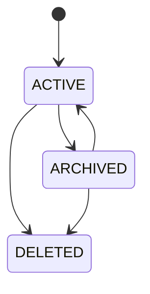
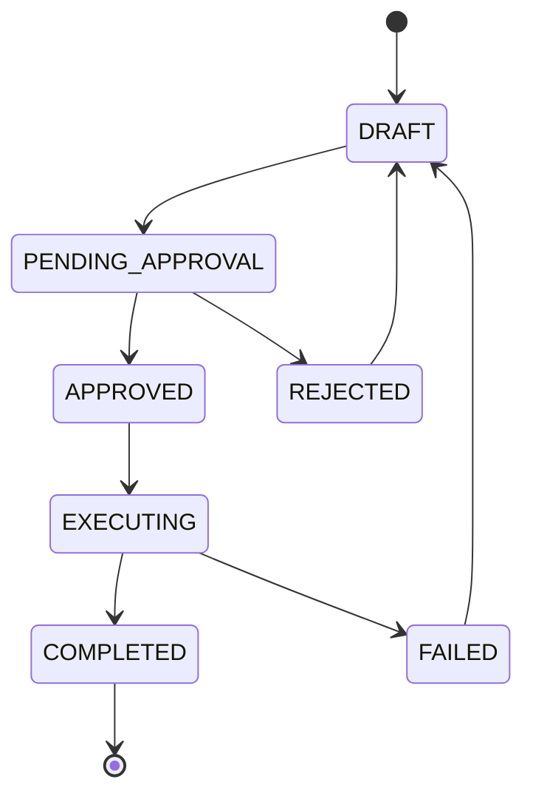
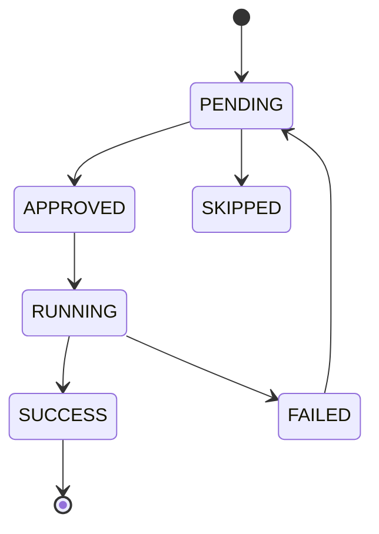
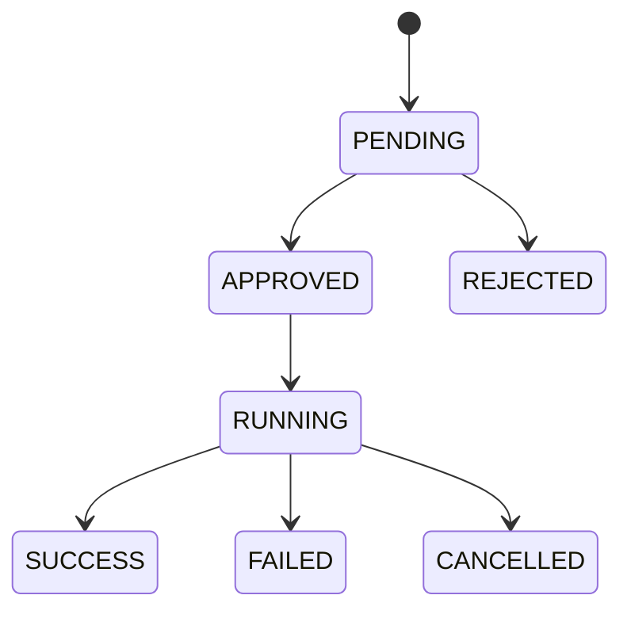
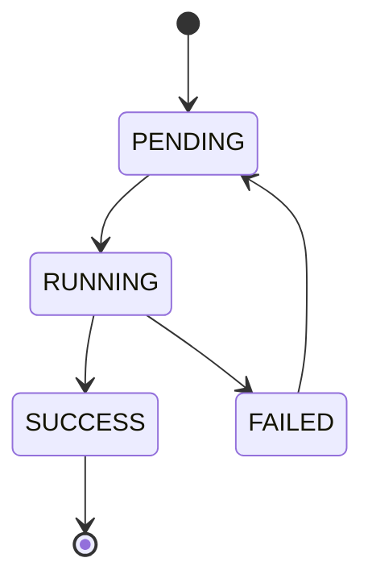
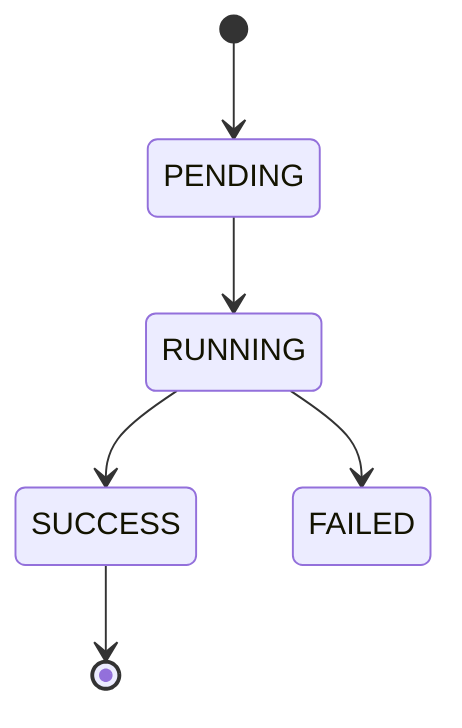

# APP-COPILOT 详细规范

> **版本**: v1.0 | **日期**: 2026-07-27
> **模块**: APP-COPILOT（SuperAI / Copilot）
> **关联主 PRD**: PRD-APP-COPILOT_v2.3-20260727.md
> **关联子 PRD**: PRD-APP-COPILOT-超级AI对话_v2.2-20260727.md、PRD-APP-COPILOT-调度与总结_v1.1-20260727.md
> **关联 API 契约**: API-CONTRACT §3.4, §3.5, §3.13, §3.14
> **归属后端服务**: MATE-AGENT（核心）+ TECH-LLMGW（LLM 调用）+ MATE-A2A（外部协作）

---

## 1. 完整数据模型

### 1.1 实体清单

| # | 实体 | 中文 | 表名 | 关联 |
|---|---|---|---|---|
| 1 | Conversation | 会话 | copilot_conversation | N:1 -> User, 1:N -> Message |
| 2 | Message | 消息 | copilot_message | N:1 -> Conversation |
| 3 | DataSource | 数据源 | copilot_data_source | 1:N -> QueryHistory |
| 4 | Query | 查询 | copilot_query | N:1 -> DataSource, N:1 -> User |
| 5 | Action | 动作 | copilot_action | 1:N -> ActionExecution |
| 6 | ActionExecution | 动作执行 | copilot_action_execution | N:1 -> Action |
| 7 | Plan | 计划 | copilot_plan | 1:N -> PlanStep |
| 8 | PlanStep | 计划步骤 | copilot_plan_step | N:1 -> Plan |
| 9 | ScheduleIntent | 调度意图 | copilot_intent | 1:N -> IntentMatch |
| 10 | IntentMatch | 意图匹配 | copilot_intent_match | N:1 -> Intent, N:1 -> Employee |
| 11 | ExecutionPlan | 执行计划 | copilot_execution_plan | N:1 -> Intent, 1:N -> PlanStep |
| 12 | ScheduleExecution | 调度执行 | copilot_schedule_execution | N:1 -> Plan, 1:N -> StepResult |
| 13 | StepResult | 步骤结果 | copilot_step_result | N:1 -> Execution |
| 14 | CodeTemplate | 代码模板 | copilot_code_template | 1:N -> CodeSnippet |
| 15 | CodeSnippet | 代码片段 | copilot_code_snippet | N:1 -> Template, 1:N -> Version |
| 16 | CodeSnippetVersion | 片段版本 | copilot_code_version | N:1 -> Snippet |
| 17 | CodeShare | 代码分享 | copilot_code_share | N:1 -> User |
| 18 | MultimodalModel | 多模态模型 | copilot_multimodal_model | - |
| 19 | KnowledgeGraph | 知识图谱查询结果 | copilot_kg_result | - |

### 1.2 Conversation
| 字段 | 类型 | 必填 | 说明 |
|---|---|---|---|
| conversationId | string(36) | 是 | 主键 |
| tenantId | string(36) | 是 | 租户 |
| userId | string(36) | 是 | 用户 |
| title | string(256) | 是 | 会话标题 |
| mode | enum | 是 | CHAT/ANALYSIS/ACTION/CODE/PLAN/ONTOLOGY |
| status | enum | 是 | ACTIVE | ACTIVE/ARCHIVED/DELETED |
| systemPrompt | text | 否 | 系统提示词 |
| context | json | 否 | 上下文 |
| messageCount | integer | 是 | 0 | 消息数 |
| tokenUsage | json | 是 | {prompt, completion, total} |
| cost | decimal(10,4) | 是 | 0 | 费用 |
| lastMessageAt | timestamp | 否 | - |
| isPinned | boolean | 是 | false | 置顶 |
| tags | string[] | 否 | - |
| createdAt/updatedAt | - | - | - | 通用 |

### 1.3 Message
| 字段 | 类型 | 必填 | 说明 |
|---|---|---|---|
| messageId | string(36) | 是 | 主键 |
| conversationId | string(36) | 是 | 会话 |
| role | enum | 是 | USER/ASSISTANT/SYSTEM/TOOL |
| content | text | 是 | 消息内容（Markdown）|
| contentType | enum | 是 | TEXT | TEXT/MARKDOWN/JSON/IMAGE/FILE |
| attachments | json | 否 | 附件列表 |
| references | json | 否 | 引用（知识库/Action/工具调用）|
| toolCalls | json | 否 | 工具调用列表 |
| promptTokens | integer | 是 | 0 | 输入 |
| completionTokens | integer | 是 | 0 | 输出 |
| totalTokens | integer | 是 | 0 | 总 |
| model | string(64) | 否 | - |
| finishReason | string(32) | 否 | stop/length/tool_calls |
| feedbackScore | integer | 否 | 1-5 评分 |
| feedbackComment | string(1024) | 否 | - |
| parentMessageId | string(36) | 否 | 父消息 |
| createdAt | timestamp | 是 | - |

### 1.4 DataSource
| 字段 | 类型 | 必填 | 说明 |
|---|---|---|---|
| dataSourceId | string(36) | 是 | 主键 |
| name | string(64) | 是 | 数据源名 |
| type | enum | 是 | MYSQL/POSTGRES/CLICKHOUSE/DORIS/HIVE/S3/API |
| connectionConfig | json | 是 | 连接配置（加密）|
| schema | json | 否 | 表结构缓存 |
| status | enum | 是 | ACTIVE | ACTIVE/INACTIVE/ERROR |
| enabled | boolean | 是 | true | 启用 |
| permissions | string[] | 是 | 访问权限（白名单用户/角色）|
| lastTestedAt | timestamp | 否 | - |
| lastErrorMessage | string(1024) | 否 | - |

### 1.5 Query
| 字段 | 类型 | 必填 | 说明 |
|---|---|---|---|
| queryId | string(36) | 是 | 主键 |
| dataSourceId | string(36) | 是 | 数据源 |
| userId | string(36) | 是 | 用户 |
| naturalLanguage | text | 否 | 自然语言查询 |
| generatedSql | text | 否 | 生成的 SQL |
| executedSql | text | 否 | 实际执行的 SQL |
| status | enum | 是 | PENDING | PENDING/RUNNING/SUCCESS/FAILED |
| result | json | 否 | 查询结果 |
| rowCount | integer | 否 | 行数 |
| duration | integer | 是 | 0 | 耗时（毫秒）|
| auditResult | json | 否 | 审计结果 |
| errorMessage | string(2048) | 否 | - |
| createdAt | timestamp | 是 | - |

### 1.6 Action
| 字段 | 类型 | 必填 | 说明 |
|---|---|---|---|
| actionId | string(36) | 是 | 主键 |
| name | string(64) | 是 | 动作名 |
| code | string(64) | 是 | 编码 |
| description | string(2048) | 是 | 描述 |
| category | string(32) | 是 | 分类 |
| inputSchema | json | 是 | 输入参数 |
| outputSchema | json | 否 | 输出参数 |
| riskLevel | enum | 是 | LOW | LOW/MEDIUM/HIGH/CRITICAL |
| requiresApproval | boolean | 是 | false | 需审批 |
| requiresConfirm | boolean | 是 | false | 需二次确认 |
| enabled | boolean | 是 | true | 启用 |
| tags | string[] | 否 | - |

### 1.7 ActionExecution
| 字段 | 类型 | 必填 | 说明 |
|---|---|---|---|
| executionId | string(36) | 是 | 主键 |
| actionId | string(36) | 是 | 动作 |
| conversationId | string(36) | 否 | 关联会话 |
| userId | string(36) | 是 | 执行人 |
| input | json | 是 | 输入 |
| output | json | 否 | 输出 |
| status | enum | 是 | PENDING | PENDING/APPROVED/RUNNING/SUCCESS/FAILED/CANCELLED |
| approvedBy | string(36) | 否 | 审批人 |
| duration | integer | 是 | 0 | 耗时 |
| errorMessage | string(2048) | 否 | - |
| createdAt/finishedAt | - | - | - | 通用 |

### 1.8 Plan
| 字段 | 类型 | 必填 | 说明 |
|---|---|---|---|
| planId | string(36) | 是 | 主键 |
| userId | string(36) | 是 | 用户 |
| title | string(256) | 是 | 计划标题 |
| description | text | 是 | 详细描述 |
| goal | text | 是 | 目标 |
| steps | json | 是 | 步骤列表 |
| status | enum | 是 | DRAFT | DRAFT/PENDING_APPROVAL/APPROVED/REJECTED/EXECUTING/COMPLETED/FAILED |
| currentStepId | string(36) | 否 | - |
| stepResults | json | 否 | - |
| finalResult | text | 否 | - |
| totalDuration | integer | 否 | 耗时 |
| totalCost | decimal(10,4) | 是 | 0 | 费用 |
| createdAt/approvedAt/startedAt/finishedAt | - | - | - | 通用 |

### 1.9 PlanStep
| 字段 | 类型 | 必填 | 说明 |
|---|---|---|---|
| stepId | string(36) | 是 | 主键 |
| planId | string(36) | 是 | 计划 |
| order | integer | 是 | 序号 |
| type | enum | 是 | EMPLOYEE/ACTION/RULE/QUERY/MANUAL |
| targetId | string(36) | 否 | 目标 ID |
| name | string(128) | 是 | 步骤名 |
| description | text | 是 | 描述 |
| input | json | 否 | 输入 |
| dependencies | string[] | 否 | 依赖步骤 |
| status | enum | 是 | PENDING | PENDING/APPROVED/SKIPPED/RUNNING/SUCCESS/FAILED |
| output | json | 否 | 输出 |
| duration | integer | 是 | 0 | 耗时 |

### 1.10 ScheduleIntent
| 字段 | 类型 | 必填 | 说明 |
|---|---|---|---|
| intentId | string(36) | 是 | 主键 |
| userId | string(36) | 是 | 用户 |
| text | text | 是 | 原始文本 |
| detectedType | enum | 是 | CONVERSATION/TASK/RESEARCH/ANALYSIS/AUTOMATION/UNKNOWN |
| entities | json | 否 | 提取的实体 |
| requiredSkills | string[] | 否 | 所需技能 |
| confidence | decimal(3,2) | 是 | 0 | 置信度 |
| createdAt | timestamp | 是 | - |

### 1.11 IntentMatch
| 字段 | 类型 | 必填 | 说明 |
|---|---|---|---|
| matchId | string(36) | 是 | 主键 |
| intentId | string(36) | 是 | 意图 |
| employeeId | string(36) | 是 | 匹配员工 |
| score | decimal(3,2) | 是 | 匹配分 |
| reason | string(512) | 否 | 匹配理由 |
| isSelected | boolean | 是 | false | 是否选中 |
| rank | integer | 是 | 0 | 排名 |

### 1.12 ExecutionPlan
| 字段 | 类型 | 必填 | 说明 |
|---|---|---|---|
| executionPlanId | string(36) | 是 | 主键 |
| intentId | string(36) | 是 | 意图 |
| matchedEmployeeIds | string[] | 是 | 匹配员工 |
| plan | json | 是 | 计划详情 |
| estimatedDuration | integer | 是 | 0 | 预计耗时 |
| estimatedCost | decimal(10,4) | 是 | 0 | 预计费用 |
| createdAt | timestamp | 是 | - |

### 1.13 ScheduleExecution
| 字段 | 类型 | 必填 | 说明 |
|---|---|---|---|
| executionId | string(36) | 是 | 主键 |
| planId | string(36) | 是 | 执行计划 |
| userId | string(36) | 是 | 用户 |
| status | enum | 是 | PENDING | PENDING/RUNNING/SUCCESS/FAILED/CANCELLED |
| progress | integer | 是 | 0 | 进度 |
| currentEmployeeId | string(36) | 否 | - |
| stepResults | json | 否 | - |
| aggregatedReport | text | 否 | 汇总报告 |
| startedAt/finishedAt | - | - | - | 通用 |

### 1.14 CodeTemplate / CodeSnippet / CodeSnippetVersion
| 实体 | 字段 | 类型 | 必填 | 说明 |
|---|---|---|---|---|
| CodeTemplate | templateId | string(36) | 是 | 主键 |
| CodeTemplate | name | string(128) | 是 | 模板名 |
| CodeTemplate | language | enum | 是 | PYTHON/JS/TS/JAVA/GO/SHELL/SQL |
| CodeTemplate | framework | string(64) | 否 | 框架 |
| CodeTemplate | description | string(2048) | 是 | 描述 |
| CodeTemplate | tags | string[] | 否 | - |
| CodeTemplate | category | string(32) | 否 | - |
| CodeSnippet | snippetId | string(36) | 是 | 主键 |
| CodeSnippet | templateId | string(36) | 否 | 模板 |
| CodeSnippet | name | string(128) | 是 | 名称 |
| CodeSnippet | code | text | 是 | 代码 |
| CodeSnippet | language | enum | 是 | - |
| CodeSnippet | variables | json | 否 | 变量定义 |
| CodeSnippet | isPublic | boolean | 是 | false | 公开 |
| CodeSnippet | usageCount | integer | 是 | 0 | 使用次数 |
| CodeSnippetVersion | versionId | string(36) | 是 | - |
| CodeSnippetVersion | snippetId | string(36) | 是 | - |
| CodeSnippetVersion | version | string(16) | 是 | - |
| CodeSnippetVersion | code | text | 是 | - |
| CodeSnippetVersion | changeLog | text | 否 | - |
| CodeSnippetVersion | status | enum | 是 | DRAFT/PUBLISHED |

### 1.15 CodeShare
| 字段 | 类型 | 必填 | 说明 |
|---|---|---|---|
| shareId | string(36) | 是 | 主键 |
| userId | string(36) | 是 | 分享人 |
| snippetId | string(36) | 是 | 片段 |
| shareToken | string(64) | 是 | 分享 Token |
| expiresAt | timestamp | 否 | 过期 |
| visitCount | integer | 是 | 0 | 访问次数 |
| password | string(64) | 否 | 访问密码（哈希）|
| allowCopy | boolean | 是 | true | 允许复制 |
| allowEdit | boolean | 是 | false | 允许编辑 |

---

## 2. 完整 API Schema

### 2.1 关键端点
| # | 方法 | 路径 | 优先级 |
|---|---|---|---|
| 1 | POST | /v1/copilot/chat/multimodal/upload | P0 |
| 2 | POST | /v1/copilot/analysis/generate-sql | P0 |
| 3 | POST | /v1/copilot/analysis/explain-sql | P0 |
| 4 | POST | /v1/copilot/analysis/audit-sql | P0 |
| 5 | POST | /v1/copilot/analysis/execute-sql | P0 |
| 6 | GET | /v1/copilot/datasources | P0 |
| 7 | POST | /v1/copilot/actions/execute | P0 |
| 8 | POST | /v1/copilot/generate/form | P0 |
| 9 | POST | /v1/copilot/plans | P0 |
| 10 | POST | /v1/copilot/scheduling/intent/detect | P0 |
| 11 | POST | /v1/copilot/scheduling/employees/match | P0 |
| 12 | POST | /v1/copilot/scheduling/execution/start | P0 |
| 13 | GET | /v1/copilot/ontology/graph/query | P0 |
| 14 | POST | /v1/copilot/code/execute | P1 |
| 15 | POST | /v1/copilot/a2a/delegate | P1 |

### 2.2 POST /v1/copilot/analysis/generate-sql
**Request Body**:
```json
{
  "type": "object",
  "properties": {
    "naturalLanguage": { "type": "string", "minLength": 1, "maxLength": 4096 },
    "dataSourceId": { "type": "string" },
    "schema": { "type": "object", "description": "可选 schema 覆盖" },
    "options": {
      "type": "object",
      "properties": {
        "maxRows": { "type": "integer", "default": 1000 },
        "timeout": { "type": "integer", "default": 30 },
        "dialect": { "type": "string", "enum": ["MYSQL", "POSTGRES", "CLICKHOUSE", "DORIS", "HIVE"] }
      }
    }
  },
  "required": ["naturalLanguage", "dataSourceId"]
}
```

**Response Schema**:
```json
{
  "type": "object",
  "properties": {
    "code": { "const": 0 },
    "data": {
      "type": "object",
      "properties": {
        "sql": { "type": "string" },
        "explanation": { "type": "string" },
        "estimatedCost": { "type": "number" },
        "warnings": { "type": "array", "items": { "type": "string" } }
      }
    }
  }
}
```

### 2.3 POST /v1/copilot/actions/execute
**Request Body**:
```json
{
  "type": "object",
  "properties": {
    "actionId": { "type": "string" },
    "actionCode": { "type": "string" },
    "input": { "type": "object" },
    "conversationId": { "type": "string" },
    "options": {
      "type": "object",
      "properties": {
        "skipApproval": { "type": "boolean", "default": false },
        "timeout": { "type": "integer", "default": 60 }
      }
    }
  },
  "required": ["input"]
}
```

### 2.4 POST /v1/copilot/plans
**Request Body**:
```json
{
  "type": "object",
  "properties": {
    "title": { "type": "string", "minLength": 1, "maxLength": 256 },
    "description": { "type": "string", "minLength": 1, "maxLength": 4096 },
    "goal": { "type": "string", "minLength": 1, "maxLength": 1024 },
    "context": { "type": "object" },
    "constraints": {
      "type": "object",
      "properties": {
        "maxDuration": { "type": "integer" },
        "maxCost": { "type": "number" },
        "allowedActions": { "type": "array", "items": { "type": "string" } }
      }
    }
  },
  "required": ["title", "description", "goal"]
}
```

### 2.5 POST /v1/copilot/scheduling/intent/detect
**Request Body**:
```json
{
  "type": "object",
  "properties": {
    "text": { "type": "string", "minLength": 1, "maxLength": 4096 },
    "context": { "type": "object" }
  },
  "required": ["text"]
}
```

**Response Schema**:
```json
{
  "type": "object",
  "properties": {
    "code": { "const": 0 },
    "data": {
      "type": "object",
      "properties": {
        "intentId": { "type": "string" },
        "type": { "type": "string", "enum": ["CONVERSATION", "TASK", "RESEARCH", "ANALYSIS", "AUTOMATION", "UNKNOWN"] },
        "entities": { "type": "array", "items": { "type": "object" } },
        "requiredSkills": { "type": "array", "items": { "type": "string" } },
        "confidence": { "type": "number" }
      }
    }
  }
}
```

### 2.6 POST /v1/copilot/ontology/graph/query
**Request Body**:
```json
{
  "type": "object",
  "properties": {
    "query": { "type": "string", "minLength": 1, "maxLength": 4096 },
    "depth": { "type": "integer", "minimum": 1, "maximum": 5, "default": 2 },
    "filters": { "type": "object" },
    "limit": { "type": "integer", "minimum": 1, "maximum": 1000, "default": 100 }
  },
  "required": ["query"]
}
```

**Response Schema**:
```json
{
  "type": "object",
  "properties": {
    "code": { "const": 0 },
    "data": {
      "type": "object",
      "properties": {
        "nodes": {
          "type": "array",
          "items": {
            "type": "object",
            "properties": {
              "id": { "type": "string" },
              "label": { "type": "string" },
              "type": { "type": "string" },
              "properties": { "type": "object" }
            }
          }
        },
        "edges": {
          "type": "array",
          "items": {
            "type": "object",
            "properties": {
              "id": { "type": "string" },
              "source": { "type": "string" },
              "target": { "type": "string" },
              "label": { "type": "string" },
              "properties": { "type": "object" }
            }
          }
        },
        "stats": {
          "type": "object",
          "properties": {
            "nodeCount": { "type": "integer" },
            "edgeCount": { "type": "integer" },
            "queryTime": { "type": "integer" }
          }
        }
      }
    }
  }
}
```

### 2.7 POST /v1/copilot/code/execute
**Request Body**:
```json
{
  "type": "object",
  "properties": {
    "language": { "type": "string", "enum": ["PYTHON", "JS", "TS", "JAVA", "GO", "SHELL", "SQL"] },
    "code": { "type": "string", "minLength": 1, "maxLength": 100000 },
    "variables": { "type": "object" },
    "options": {
      "type": "object",
      "properties": {
        "timeout": { "type": "integer", "default": 30 },
        "memoryLimit": { "type": "integer", "default": 256 },
        "networkAccess": { "type": "boolean", "default": false }
      }
    }
  },
  "required": ["language", "code"]
}
```

---

## 3. 状态机

### 3.1 Conversation 状态机


### 3.2 Plan 状态机


### 3.3 PlanStep 状态机


### 3.4 ActionExecution 状态机


### 3.5 ScheduleExecution 状态机


### 3.6 Query 状态机


---

## 4. 业务规则

### 4.1 对话
- **BR-001**: 会话标题自动从首条消息生成（前 30 字）
- **BR-002**: 同一会话内消息上下文保持
- **BR-003**: 长会话自动摘要（> 20 条消息）
- **BR-004**: Token 用量超过预算 80% 提示
- **BR-005**: 已删除会话 30 天后清理

### 4.2 消息
- **BR-010**: 消息内容最大 100KB
- **BR-011**: 附件大小限制（图片 10MB，文件 50MB）
- **BR-012**: 工具调用结果自动格式化
- **BR-013**: 用户反馈用于优化
- **BR-014**: 引用来源可点击跳转

### 4.3 SQL 分析
- **BR-020**: 生成 SQL 必须通过 audit
- **BR-021**: 危险操作（DELETE/DROP/UPDATE 全表）需二次确认
- **BR-022**: 查询超时默认 30s
- **BR-023**: 单次查询最多 10000 行
- **BR-024**: 查询历史保留 90 天

### 4.4 Action
- **BR-030**: HIGH/CRITICAL 风险需审批
- **BR-031**: 审批人需有权限
- **BR-032**: 执行超时默认 60s
- **BR-033**: 执行失败可重试 3 次
- **BR-034**: 执行记录保留 1 年

### 4.5 计划
- **BR-040**: 计划必须经过审批才能执行
- **BR-041**: 步骤依赖关系检查
- **BR-042**: 失败可重试单个步骤
- **BR-043**: 整体超时默认 30 分钟
- **BR-044**: 总体费用限制

### 4.6 调度
- **BR-050**: 意图识别准确率监控
- **BR-051**: 员工匹配按评分降序
- **BR-052**: 多员工按计划类型执行（SEQUENTIAL/PARALLEL）
- **BR-053**: 调度报告含详细步骤
- **BR-054**: 失败可重试整个调度

### 4.7 代码执行
- **BR-060**: 沙箱隔离执行
- **BR-061**: 默认无网络访问
- **BR-062**: 内存限制默认 256MB
- **BR-063**: 执行超时默认 30s
- **BR-064**: 输出限制 1MB

### 4.8 多模态
- **BR-070**: 支持图片（jpg/png/webp）、音频（mp3/wav）
- **BR-071**: 文件大小限制
- **BR-072**: 多模态模型按能力选择
- **BR-073**: 输入自动 OCR/ASR

---

## 5. 权限矩阵

| 资源 | 平台超管 | 租户超管 | 业务负责人 | 开发者 | 业务用户 |
|---|---|---|---|---|---|
| Conversation | CRUD | CRUD | CRUD | CRUD | CRUD（自己）|
| Message | CRUD | CRUD | CRUD | CRUD | CRUD（自己）|
| DataSource | CRUD | CRUD | CRUD | CRUD | R |
| Query | R | R | R | R | CRUD（自己）|
| Action | CRUD | CRUD | CRU | CRU | R |
| ActionExecution | R | R | R | R | R（自己）|
| Plan | CRUD | CRUD | CRUD | CRUD | CRUD（自己）|
| PlanStep | CRUD | CRUD | CRUD | CRUD | CRUD（自己）|
| ScheduleIntent | R | R | R | R | CRUD（自己）|
| IntentMatch | R | R | R | R | R（自己）|
| ExecutionPlan | R | R | R | R | CRUD（自己）|
| ScheduleExecution | R | R | R | R | R（自己）|
| CodeTemplate | CRUD | CRUD | CRUD | CRU | R |
| CodeSnippet | CRUD | CRUD | CRUD | CRU | CRUD（自己）|
| CodeShare | R | R | R | R | CRUD（自己）|

---

## 6. 性能要求

| 操作 | P99 | QPS |
|---|---|---|
| 消息发送（普通）| < 3s | 100 |
| 消息发送（含 RAG）| < 5s | 50 |
| 多模态识别 | < 10s | 20 |
| SQL 生成 | < 5s | 30 |
| SQL 执行 | < 30s | 50 |
| Action 执行（普通）| < 10s | 50 |
| Action 执行（复杂）| < 60s | 10 |
| 计划生成 | < 10s | 20 |
| 计划执行 | < 5min | 5 |
| 调度意图识别 | < 3s | 50 |
| 员工匹配 | < 3s | 50 |
| 调度执行 | < 60s | 10 |
| 代码执行 | < 30s | 20 |
| 图谱查询 | < 5s | 30 |
| 多模态生成 | < 30s | 10 |

---

## 7. 安全要求

- 对话内容加密存储
- 附件病毒扫描
- LLM 调用限流（按用户/租户）
- 危险操作二次确认
- 数据脱敏（日志/分享）
- 代码沙箱隔离
- 跨租户访问严格隔离
- 审计：所有调用记录
- 用户反馈用于质量提升
