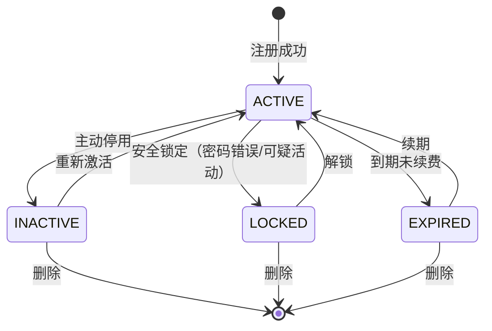
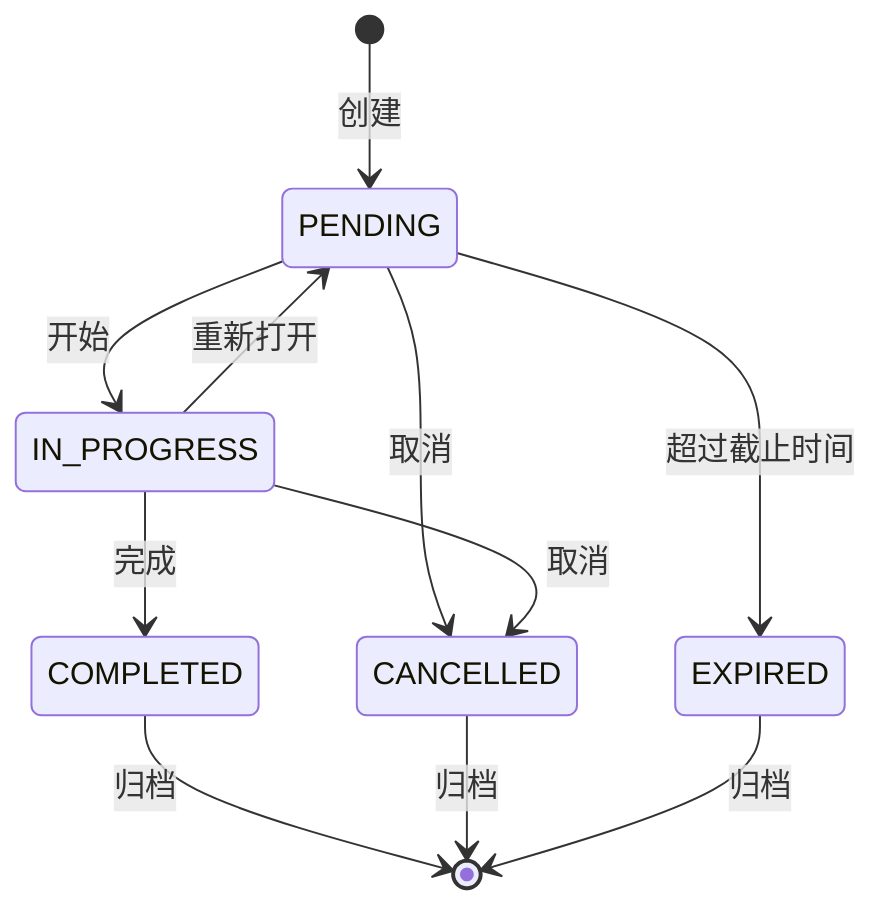
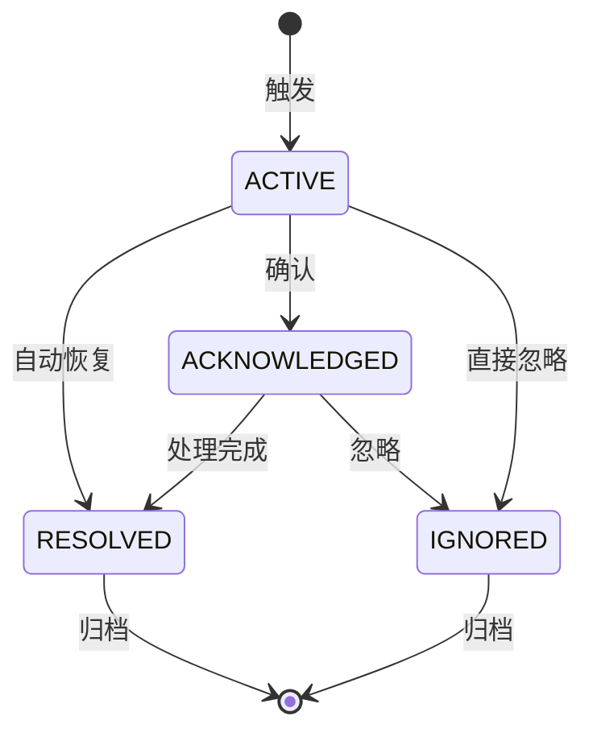
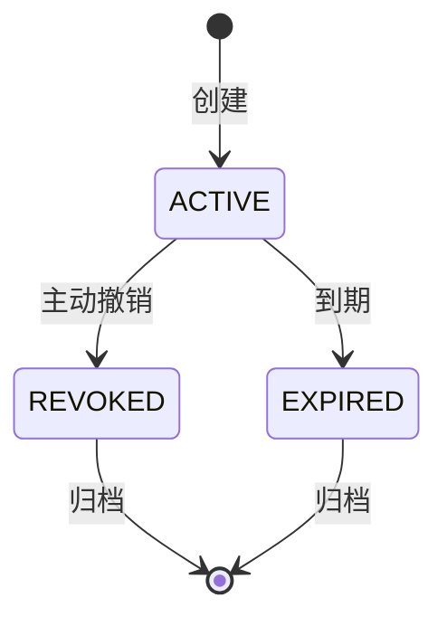
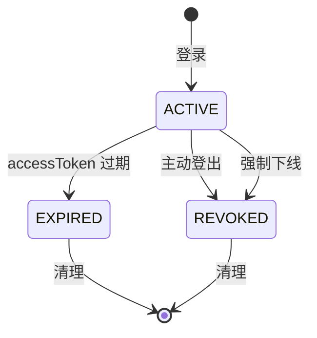

# APP-DASHBOARD 详细规范

> **版本**: v1.0 | **日期**: 2026-07-27
> **模块**: APP-DASHBOARD（工作台 + 后台管理）
> **关联主 PRD**: `PRD-APP-DASHBOARD-仪表盘_v2.3-20260727.md`、`PRD-APP-DASHBOARD-后台管理_v1.1-20260727.md`
> **关联 API 契约**: `API-CONTRACT-前端接口契约清单_v1.0-20260727.md` §3.6
> **归属后端服务**: TECH-IAM（核心）+ TECH-MSG（通知）+ MATE-AGENT（员工状态）+ TECH-OBS（异常）

---

## 1. 完整数据模型

### 1.1 实体清单

| # | 实体 | 中文 | 表名 | 关联 |
|---|---|---|---|---|
| 1 | User | 用户 | iam_user | N:1 → Tenant, N:M → Role |
| 2 | Tenant | 租户 | iam_tenant | 1:N → User, App |
| 3 | Role | 角色 | iam_role | N:M → Permission, N:M → User |
| 4 | Permission | 权限 | iam_permission | N:1 → Resource |
| 5 | Notification | 通知 | msg_notification | N:1 → User |
| 6 | NotificationSetting | 通知设置 | msg_notification_setting | 1:1 → User |
| 7 | Todo | 待办 | iam_todo | N:1 → User, N:1 → Resource |
| 8 | Deliverable | 交付材料 | data_deliverable | N:1 → User, N:1 → Project |
| 9 | Metric | 指标 | obs_metric | 独立 |
| 10 | MetricRecord | 指标记录 | obs_metric_record | N:1 → Metric |
| 11 | ApiKey | API Token | iam_api_key | N:1 → User |
| 12 | Session | 会话 | iam_session | N:1 → User |
| 13 | Anomaly | 异常 | obs_anomaly | N:1 → Metric |
| 14 | AnomalyRule | 异常规则 | obs_anomaly_rule | 独立 |
| 15 | PortalItem | 门户项 | dashboard_portal | N:1 → Tenant |
| 16 | ApprovalItem | 审批项 | wfe_approval | N:1 → User (assignee) |
| 17 | AuditLog | 审计日志 | obs_audit_log | N:1 → User, N:1 → Resource |

### 1.2 关键实体字段

#### User（用户）
| 字段 | 类型 | 必填 | 说明 |
|---|---|---|---|
| userId | string(36) | 是 | 主键 |
| tenantId | string(36) | 是 | 租户 |
| username | string(64) | 是 | 用户名（系统内唯一） |
| email | string(128) | 是 | 邮箱 |
| realName | string(64) | 否 | 真实姓名 |
| phone | string(20) | 否 | 手机号 |
| avatar | string(256) | 否 | 头像 URL |
| status | enum | 是 | ACTIVE/INACTIVE/LOCKED/EXPIRED |
| orgId | string(36) | 否 | 所属组织 |
| roles | string[] | 是 | 角色代码列表 |
| lastLoginAt | timestamp | 否 | 最近登录 |
| lastLoginIp | string(64) | 否 | 最近登录 IP |
| mfaEnabled | boolean | 否 | 是否启用 MFA |
| mfaSecret | string(128) | 否 | MFA 密钥（加密） |
| preferences | json | 否 | 个人偏好 {language, theme, timezone, dateFormat} |

#### Tenant（租户）
| 字段 | 类型 | 必填 | 说明 |
|---|---|---|---|
| tenantId | string(36) | 是 | 主键 |
| code | string(32) | 是 | 租户编码（全局唯一） |
| name | string(128) | 是 | 租户名 |
| status | enum | 是 | ACTIVE/SUSPENDED/EXPIRED |
| plan | enum | 是 | FREE/PRO/ENTERPRISE/CUSTOM |
| expireAt | timestamp | 否 | 到期时间 |
| settings | json | 否 | 租户级设置 |
| ssoConfig | json | 否 | SSO 配置（OIDC/SAML） |

#### Notification（通知）
| 字段 | 类型 | 必填 | 说明 |
|---|---|---|---|
| notificationId | string(36) | 是 | 主键 |
| tenantId | string(36) | 是 | 租户 |
| userId | string(36) | 是 | 接收人 |
| type | enum | 是 | SYSTEM/TASK/APPROVAL/MENTION/ALERT |
| category | string(32) | 是 | 分类（细粒度） |
| title | string(256) | 是 | 标题 |
| content | text | 是 | 内容（Markdown） |
| link | string(512) | 否 | 跳转链接 |
| priority | enum | 是 | LOW/NORMAL/HIGH/URGENT |
| status | enum | 是 | UNREAD/READ/ARCHIVED |
| readAt | timestamp | 否 | 已读时间 |
| expiresAt | timestamp | 否 | 过期时间 |
| createdBy | string(36) | 否 | 发送人 |
| createdAt | timestamp | 是 | 发送时间 |

#### NotificationSetting
| 字段 | 类型 | 必填 | 说明 |
|---|---|---|---|
| settingId | string(36) | 是 | 主键 |
| userId | string(36) | 是 | 用户 |
| type | enum | 是 | 通知类型 |
| channels | json | 是 | {site: true, email: false, sms: false, im: false, webhook: false} |
| muteStartTime | time | 否 | 勿扰开始时间 |
| muteEndTime | time | 否 | 勿扰结束时间 |
| enabled | boolean | 是 | 是否启用 |

#### Todo（待办）
| 字段 | 类型 | 必填 | 说明 |
|---|---|---|---|
| todoId | string(36) | 是 | 主键 |
| userId | string(36) | 是 | 接收人 |
| title | string(256) | 是 | 标题 |
| description | text | 否 | 描述 |
| type | enum | 是 | TASK/APPROVAL/REVIEW/OTHER |
| priority | enum | 是 | LOW/NORMAL/HIGH/URGENT |
| status | enum | 是 | PENDING/IN_PROGRESS/COMPLETED/CANCELLED/EXPIRED |
| dueDate | timestamp | 否 | 截止时间 |
| completedAt | timestamp | 否 | 完成时间 |
| resourceType | string(32) | 否 | 关联资源类型 |
| resourceId | string(36) | 否 | 关联资源 ID |
| link | string(512) | 否 | 跳转链接 |

#### Deliverable（交付材料）
| 字段 | 类型 | 必填 | 说明 |
|---|---|---|---|
| deliverableId | string(36) | 是 | 主键 |
| tenantId | string(36) | 是 | 租户 |
| title | string(256) | 是 | 标题 |
| type | enum | 是 | REPORT/CODE/DOCUMENT/DATA/OTHER |
| format | enum | 是 | PDF/DOCX/XLSX/PPTX/ZIP/HTML/JSON/CSV |
| size | long | 是 | 文件大小（字节） |
| url | string(1024) | 是 | 下载链接 |
| thumbnail | string(1024) | 否 | 缩略图 |
| sourceType | string(32) | 是 | 来源（AGENT/TASK/MANUAL/API） |
| sourceId | string(36) | 否 | 来源 ID |
| producerId | string(36) | 是 | 生产者 |
| projectId | string(36) | 否 | 项目 ID |
| visibility | enum | 是 | PRIVATE/ORG/TENANT/PUBLIC |
| tags | string[] | 否 | 标签 |
| downloadCount | integer | 是 | 下载次数 |
| expiresAt | timestamp | 否 | 过期时间 |

#### Metric（指标）
| 字段 | 类型 | 必填 | 说明 |
|---|---|---|---|
| metricId | string(36) | 是 | 主键 |
| code | string(64) | 是 | 指标编码（系统内唯一） |
| name | string(128) | 是 | 指标名 |
| category | enum | 是 | USER/APP/AGENT/TASK/SYSTEM/BUSINESS |
| unit | string(16) | 否 | 单位（%、个、ms、MB 等） |
| valueType | enum | 是 | COUNTER/GAUGE/HISTOGRAM |
| aggregation | enum | 是 | SUM/AVG/MAX/MIN/COUNT/LAST |
| refreshInterval | integer | 是 | 刷新间隔（秒） |
| dataSource | json | 是 | 数据源配置 {type: API/SQL/QUERY, config} |
| displayConfig | json | 否 | 展示配置 {chart, color, threshold} |

#### MetricRecord
| 字段 | 类型 | 必填 | 说明 |
|---|---|---|---|
| recordId | string(36) | 是 | 主键 |
| metricId | string(36) | 是 | 指标 |
| value | decimal(20,4) | 是 | 值 |
| dimensions | json | 否 | 维度 {tenantId, appId, ...} |
| timestamp | timestamp | 是 | 时间 |

#### ApiKey
| 字段 | 类型 | 必填 | 说明 |
|---|---|---|---|
| apiKeyId | string(36) | 是 | 主键 |
| userId | string(36) | 是 | 用户 |
| name | string(64) | 是 | Token 名 |
| keyPrefix | string(16) | 是 | Key 前缀（用于标识） |
| keyHash | string(128) | 是 | Key 哈希（仅存哈希，不存明文） |
| scopes | string[] | 是 | 权限范围 |
| expiresAt | timestamp | 否 | 过期时间 |
| lastUsedAt | timestamp | 否 | 最近使用 |
| status | enum | 是 | ACTIVE/REVOKED/EXPIRED |
| createdAt | timestamp | 是 | 创建时间 |

#### Session（会话）
| 字段 | 类型 | 必填 | 说明 |
|---|---|---|---|
| sessionId | string(36) | 是 | 主键 |
| userId | string(36) | 是 | 用户 |
| ip | string(64) | 是 | IP 地址 |
| userAgent | string(512) | 是 | User-Agent |
| device | string(128) | 否 | 设备（手机/PC/平板） |
| os | string(64) | 否 | 操作系统 |
| browser | string(64) | 否 | 浏览器 |
| location | string(128) | 否 | 登录地点（IP 解析） |
| loginAt | timestamp | 是 | 登录时间 |
| lastActiveAt | timestamp | 是 | 最近活跃 |
| expiresAt | timestamp | 是 | 过期时间 |
| status | enum | 是 | ACTIVE/EXPIRED/REVOKED |

#### Anomaly（异常）
| 字段 | 类型 | 必填 | 说明 |
|---|---|---|---|
| anomalyId | string(36) | 是 | 主键 |
| ruleId | string(36) | 是 | 触发规则 |
| metricCode | string(64) | 是 | 指标编码 |
| actualValue | decimal(20,4) | 是 | 实际值 |
| expectedValue | decimal(20,4) | 是 | 期望值 |
| severity | enum | 是 | LOW/MEDIUM/HIGH/CRITICAL |
| status | enum | 是 | ACTIVE/ACKNOWLEDGED/RESOLVED/IGNORED |
| triggeredAt | timestamp | 是 | 触发时间 |
| acknowledgedBy | string(36) | 否 | 确认人 |
| resolvedAt | timestamp | 否 | 解决时间 |
| context | json | 否 | 异常上下文 |

#### AnomalyRule
| 字段 | 类型 | 必填 | 说明 |
|---|---|---|---|
| ruleId | string(36) | 是 | 主键 |
| name | string(128) | 是 | 规则名 |
| metricCode | string(64) | 是 | 监控指标 |
| condition | string | 是 | 触发条件 DSL |
| severity | enum | 是 | 严重度 |
| notifyChannels | string[] | 是 | 通知渠道 |
| notifyTargets | string[] | 是 | 通知对象 |
| enabled | boolean | 是 | 是否启用 |
| cooldown | integer | 是 | 冷却时间（秒） |

#### PortalItem（门户项）
| 字段 | 类型 | 必填 | 说明 |
|---|---|---|---|
| portalId | string(36) | 是 | 主键 |
| tenantId | string(36) | 是 | 租户 |
| name | string(64) | 是 | 门户名 |
| kind | enum | 是 | INTERNAL/EXTERNAL |
| description | string(512) | 否 | 描述 |
| icon | string(64) | 是 | 图标（lucide-react 名称） |
| url | string(1024) | 是 | URL |
| visits | integer | 是 | 访问次数 |
| lastVisit | timestamp | 否 | 最近访问 |
| order | integer | 是 | 排序 |
| enabled | boolean | 是 | 是否启用 |

#### AuditLog
| 字段 | 类型 | 必填 | 说明 |
|---|---|---|---|
| logId | string(36) | 是 | 主键 |
| tenantId | string(36) | 是 | 租户 |
| userId | string(36) | 是 | 操作人 |
| action | string(32) | 是 | 操作（CREATE/UPDATE/DELETE/READ/LOGIN/LOGOUT） |
| resourceType | string(32) | 是 | 资源类型 |
| resourceId | string(36) | 是 | 资源 ID |
| beforeValue | json | 否 | 修改前值 |
| afterValue | json | 否 | 修改后值 |
| ip | string(64) | 否 | IP |
| userAgent | string(512) | 否 | User-Agent |
| traceId | string(64) | 否 | 链路追踪 |
| status | enum | 是 | SUCCESS/FAILED |
| errorMessage | string(1024) | 否 | 错误信息 |
| timestamp | timestamp | 是 | 时间 |

---

## 2. 完整 API Schema

### 2.1 关键端点

| # | 方法 | 路径 | 优先级 |
|---|---|---|---|
| 1 | GET | /v1/dashboard/profile | P0 |
| 2 | GET | /v1/dashboard/metrics | P0 |
| 3 | GET | /v1/dashboard/notifications | P0 |
| 4 | GET | /v1/dashboard/todos | P0 |
| 5 | GET | /v1/dashboard/workers | P0 |
| 6 | PUT | /v1/dashboard/settings | P0 |
| 7 | GET | /v1/dashboard/api-keys | P1 |
| 8 | POST | /v1/dashboard/api-keys | P1 |
| 9 | GET | /v1/dashboard/sessions | P1 |
| 10 | GET | /v1/dashboard/anomalies | P2 |

### 2.2 GET /v1/dashboard/metrics Schema

**用途**: 获取工作台指标卡

**Query 参数**:
```json
{
  "type": "object",
  "properties": {
    "category": { "type": "string", "enum": ["USER", "APP", "AGENT", "TASK", "SYSTEM", "BUSINESS"] },
    "scope": { "type": "string", "enum": ["MINE", "TENANT", "GLOBAL"], "default": "MINE" },
    "includeTrend": { "type": "boolean", "default": true }
  }
}
```

**Response Schema**:
```json
{
  "type": "object",
  "properties": {
    "code": { "const": 0 },
    "data": {
      "type": "array",
      "items": {
        "type": "object",
        "properties": {
          "metricId": { "type": "string" },
          "code": { "type": "string" },
          "name": { "type": "string" },
          "value": { "type": "number" },
          "displayValue": { "type": "string" },
          "unit": { "type": "string" },
          "trendLabel": { "type": "string" },
          "trendValue": { "type": "string" },
          "trendUp": { "type": "boolean" },
          "icon": { "type": "string" },
          "color": { "type": "string" },
          "sparkline": { "type": "array", "items": { "type": "number" } }
        }
      }
    }
  }
}
```

### 2.3 POST /v1/dashboard/api-keys Schema

**用途**: 创建 API Token

**Request Body**:
```json
{
  "type": "object",
  "properties": {
    "name": { "type": "string", "minLength": 1, "maxLength": 64 },
    "scopes": {
      "type": "array",
      "items": { "type": "string" },
      "minItems": 1
    },
    "expiresAt": { "type": "string", "format": "date-time" }
  },
  "required": ["name", "scopes"]
}
```

**Response Schema**:
```json
{
  "type": "object",
  "properties": {
    "code": { "const": 0 },
    "data": {
      "type": "object",
      "properties": {
        "apiKeyId": { "type": "string" },
        "name": { "type": "string" },
        "key": { "type": "string", "description": "完整 Key（仅创建时返回一次）" },
        "keyPrefix": { "type": "string" },
        "scopes": { "type": "array" },
        "expiresAt": { "type": "string" },
        "createdAt": { "type": "string" }
      }
    }
  }
}
```

---

## 3. 状态机

### 3.1 User 状态机



### 3.2 Todo 状态机



### 3.3 Anomaly 状态机



### 3.4 ApiKey 状态机



### 3.5 Session 状态机



---

## 4. 业务规则

### 4.1 用户管理

- **BR-001**: 用户名在同一租户内唯一
- **BR-002**: 邮箱格式必须合法
- **BR-003**: 密码至少 8 位，包含大小写字母+数字+特殊字符
- **BR-004**: 连续 5 次密码错误锁定账户 30 分钟
- **BR-005**: 删除用户为软删除（isDeleted = true），保留 90 天后清理

### 4.2 通知

- **BR-010**: 通知发送遵循用户的 NotificationSetting
- **BR-011**: 勿扰时段不发送（除非 priority = URGENT）
- **BR-012**: URGENT 通知强制推送所有渠道
- **BR-013**: 通知超过 expiresAt 自动归档
- **BR-014**: 用户可批量归档/已读/删除

### 4.3 待办

- **BR-020**: 截止时间小于当前时间且未完成 → EXPIRED
- **BR-021**: URGENT 待办显示在工作台顶部
- **BR-022**: 已完成待办 30 天后自动归档

### 4.4 API Token

- **BR-030**: Key 明文仅在创建时返回一次
- **BR-031**: Key 哈希使用 bcrypt（cost=10）
- **BR-032**: Key 格式：`mkp_{prefix}_{32字符base62}`（总长 40 字符）
- **BR-033**: 过期后 Key 自动失效
- **BR-034**: 撤销操作不可逆

### 4.5 异常

- **BR-040**: 异常触发后进入冷却期，避免重复告警
- **BR-041**: CRITICAL 异常自动通知到 on-call
- **BR-042**: 自动恢复（actualValue 回到正常范围）→ 标记 RESOLVED
- **BR-043**: 手动忽略的异常 30 天后清理

---

## 5. 权限矩阵

| 资源 | 平台超管 | 租户超管 | 部门管理员 | 普通用户 | 查看者 |
|---|---|---|---|---|---|
| User（本人） | R | R | R | RU（自己） | R |
| User（他人） | CRUD | CRUD（本租户） | R（本部门） | R（公开信息） | R |
| Tenant | R | RU（自己） | R | R | R |
| Role | CRUD | CRUD（本租户） | R | R | R |
| Permission | CRUD | R | R | R | R |
| Notification | CRUD | CRUD（本租户） | R（本部门） | RU（自己） | R |
| NotificationSetting | CRUD | CRUD（本租户） | R（本部门） | RU（自己） | R |
| Todo | CRUD | CRUD（本租户） | CRUD（本部门） | RU（自己） | R |
| Deliverable | CRUD | CRUD（本租户） | CRUD（本部门） | RU（自己） | R |
| Metric | CRUD | CRUD（本租户） | R | R | R |
| ApiKey | R | R | R | CRUD（自己） | - |
| Session | R | R | R | RUD（自己） | - |
| Anomaly | CRUD | CRUD（本租户） | R | R | R |
| AnomalyRule | CRUD | CRUD（本租户） | R | R | R |
| PortalItem | CRUD | CRUD（本租户） | R | R | R |
| AuditLog | R | R（本租户） | R（本部门） | R（自己） | - |

---

## 6. 性能要求

| 操作 | P99 | QPS |
|---|---|---|
| 用户登录 | < 1s | 100 |
| 个人信息查询 | < 100ms | 500 |
| 指标查询 | < 300ms | 200 |
| 通知列表 | < 200ms | 300 |
| 待办列表 | < 200ms | 300 |
| 交付材料列表 | < 300ms | 200 |
| 异常列表 | < 300ms | 100 |
| API Key 创建 | < 500ms | 20 |

---

## 7. 安全要求

- 密码使用 bcrypt 哈希（cost ≥ 10）
- 敏感字段（MFA 密钥、API Key）使用 AES-256 加密
- Session Token 使用 httpOnly cookie 或 Authorization header
- CSRF Token 用于跨域请求
- XSS 防护：用户输入内容渲染时转义
- 限流：登录接口 5 次/分钟/IP，API Key 1000 次/小时/Key
- 审计：所有写操作记录 AuditLog
- 通知推送需支持推送渠道加密（IM/邮件）
