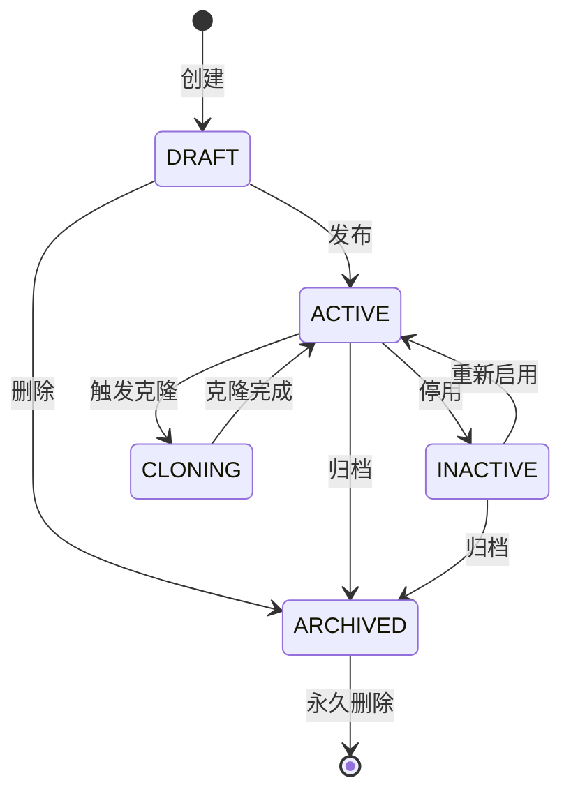
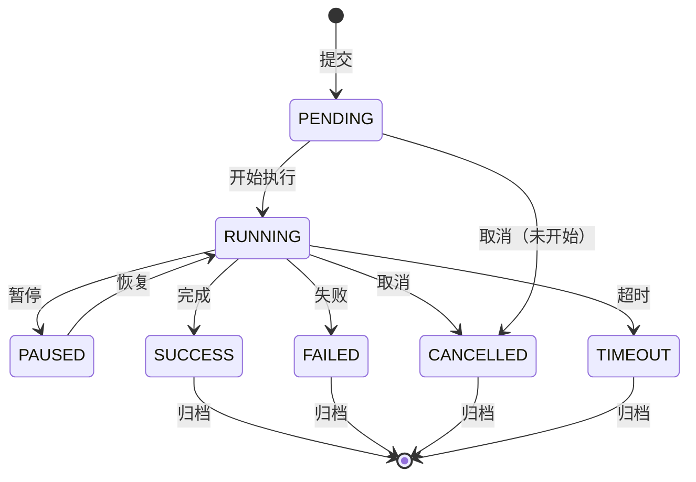
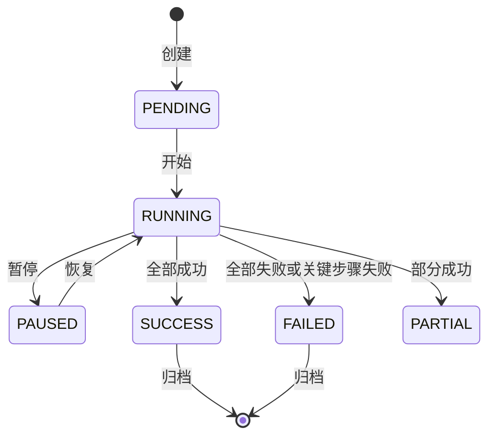
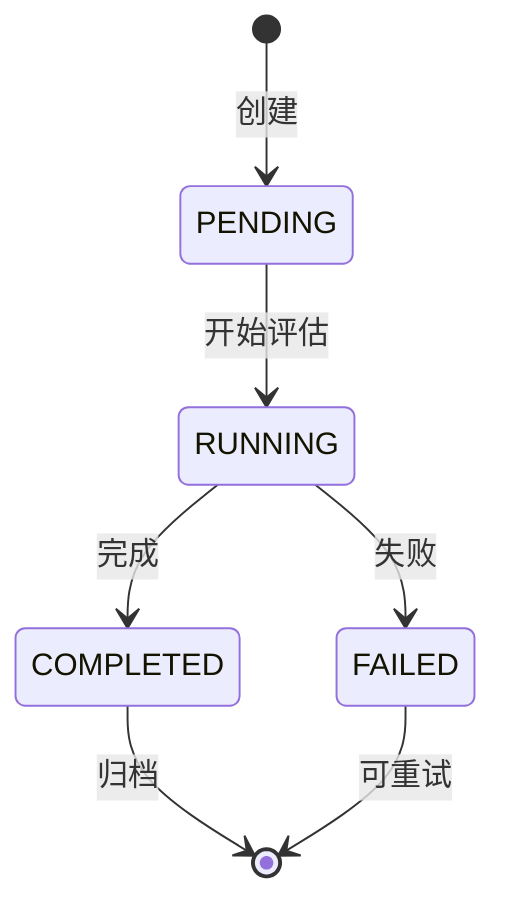
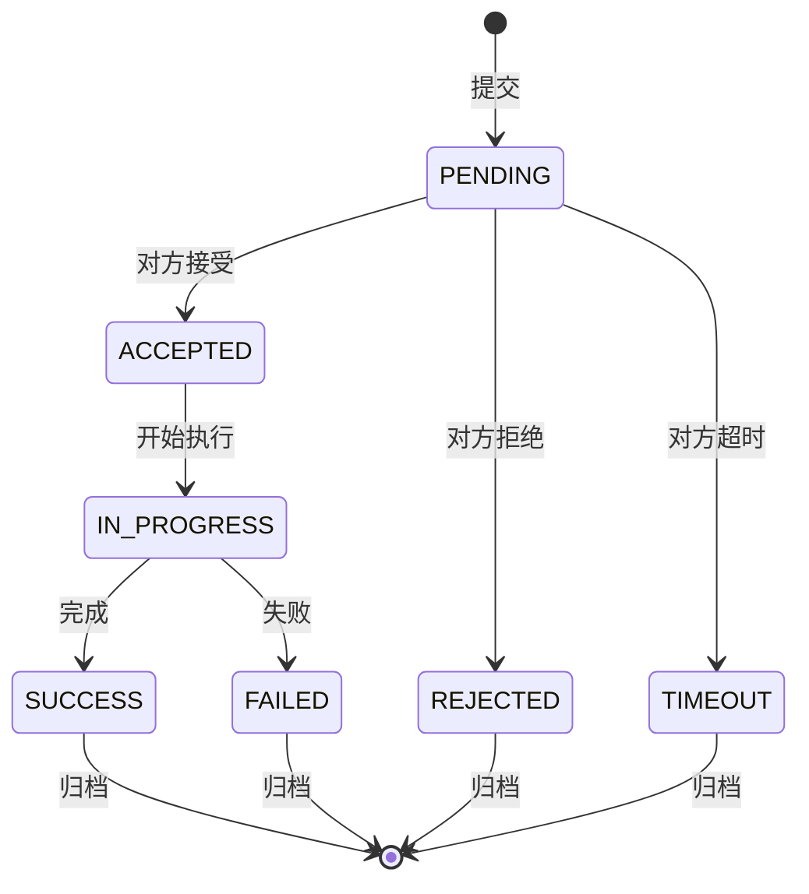

# APP-DW 详细规范

> **版本**: v1.0 | **日期**: 2026-07-27
> **模块**: APP-DW（数字员工 + 业务 RAG Agent + 页面专属 Agent）
> **关联主 PRD**: `PRD-APP-DW-数字员工_v2.4-20260727.md`
> **关联子 PRD**: `PRD-APP-DW-业务RAG知识库Agent_v1.1-20260727.md`、`PRD-APP-DW-页面专属Agent_v1.1-20260727.md`
> **关联 API 契约**: `API-CONTRACT-前端接口契约清单_v1.0-20260727.md` §3.7
> **归属后端服务**: MATE-AGENT + TECH-OBS（trace）+ MATE-A2A（外部协作）

---

## 1. 完整数据模型

### 1.1 实体清单

| # | 实体 | 中文 | 表名 | 关联 |
|---|---|---|---|---|
| 1 | Employee | 数字员工 | dw_employee | 1:N → Capability, 1:N → Task, 1:N → Document |
| 2 | Capability | 员工能力 | dw_capability | N:1 → Employee, 1:1 → Tool |
| 3 | Task | 任务 | dw_task | N:1 → Employee, N:1 → Collaboration |
| 4 | TaskStep | 任务步骤 | dw_task_step | N:1 → Task |
| 5 | Collaboration | 多员工协作 | dw_collaboration | N:M → Employee, 1:N → Task |
| 6 | Evaluation | 效果评估 | dw_evaluation | N:1 → Employee, 1:N → EvaluationItem |
| 7 | EvaluationItem | 评估项 | dw_evaluation_item | N:1 → Evaluation |
| 8 | Document | 文档 | dw_document | N:1 → Employee, 1:N → Chunk |
| 9 | Chunk | 文档切片 | dw_chunk | N:1 → Document |
| 10 | Extraction | 知识提炼 | dw_extraction | N:1 → Employee, 1:N → ExtractionItem |
| 11 | ExtractionItem | 提炼项 | dw_extraction_item | N:1 → Extraction |
| 12 | LearningRecord | 学习记录 | dw_learning_record | N:1 → Employee |
| 13 | FeedbackRecord | 反馈记录 | dw_feedback | N:1 → Employee, N:1 → Task |
| 14 | EmployeeVersion | 员工版本 | dw_employee_version | N:1 → Employee |
| 15 | OperationLog | 操作日志 | dw_operation_log | N:1 → Employee, N:1 → User |
| 16 | ExternalAgent | 外部 Agent | dw_external_agent | N:1 → Tenant |
| 17 | A2ADelegation | A2A 委派 | a2a_delegation | N:1 → Employee, N:1 → ExternalAgent |
| 18 | Trace | 执行轨迹 | obs_trace | N:1 → Task |
| 19 | ReplaySession | 回放会话 | dw_replay_session | N:1 → Task |

### 1.2 关键实体字段

#### Employee（数字员工）
| 字段 | 类型 | 必填 | 说明 |
|---|---|---|---|
| employeeId | string(36) | 是 | 主键 |
| tenantId | string(36) | 是 | 租户 |
| name | string(64) | 是 | 员工名 |
| code | string(64) | 是 | 员工编码（系统内唯一） |
| avatar | string(256) | 否 | 头像 URL |
| type | enum | 是 | DIALOGUE/TASK/AUDIT/GENERATION/ANALYSIS/RAG/CUSTOM |
| status | enum | 是 | DRAFT/ACTIVE/INACTIVE/ARCHIVED/CLONING |
| description | string(1024) | 否 | 描述 |
| systemPrompt | text | 是 | 系统提示词 |
| welcomeMessage | string(1024) | 否 | 欢迎语 |
| modelConfig | json | 是 | 模型配置 {model, temperature, maxTokens, topP} |
| capabilities | json | 否 | 能力配置 |
| knowledgeBaseIds | string[] | 否 | 关联知识库 |
| tools | string[] | 否 | 关联工具 |
| triggers | json | 否 | 触发器配置 |
| ownerOrgId | string(36) | 是 | 负责组织 |
| ownerUserId | string(36) | 是 | 负责人 |
| tags | string[] | 否 | 标签 |
| version | string(16) | 是 | 当前版本号 |
| parentVersionId | string(36) | 否 | 父版本 ID（克隆时） |
| publishedAt | timestamp | 否 | 发布时间 |
| statistics | json | 否 | 统计 {totalTasks, successRate, avgDuration} |
| cloneCount | integer | 是 | 克隆次数 |
| isTemplate | boolean | 是 | 是否模板 |
| templateCategory | string(32) | 否 | 模板分类 |

#### Capability（员工能力）
| 字段 | 类型 | 必填 | 说明 |
|---|---|---|---|
| capabilityId | string(36) | 是 | 主键 |
| employeeId | string(36) | 是 | 所属员工 |
| name | string(64) | 是 | 能力名 |
| type | enum | 是 | TOOL/KNOWLEDGE/SKILL/CONVERSATION |
| configId | string(36) | 是 | 关联的 Tool/KnowledgeBase/Skill ID |
| enabled | boolean | 是 | 是否启用 |
| priority | integer | 是 | 优先级 |
| conditions | json | 否 | 启用条件 |
| timeout | integer | 否 | 超时（秒） |
| retryPolicy | json | 否 | 重试策略 |

#### Task（任务）
| 字段 | 类型 | 必填 | 说明 |
|---|---|---|---|
| taskId | string(36) | 是 | 主键 |
| tenantId | string(36) | 是 | 租户 |
| employeeId | string(36) | 是 | 执行员工 |
| title | string(256) | 是 | 任务标题 |
| type | enum | 是 | DIALOGUE/SINGLE/MULTI_AGENT/SCHEDULED/TRIGGER |
| status | enum | 是 | PENDING/RUNNING/PAUSED/SUCCESS/FAILED/CANCELLED/TIMEOUT |
| priority | enum | 是 | LOW/NORMAL/HIGH/URGENT |
| input | json | 是 | 任务输入 |
| output | json | 否 | 任务输出 |
| plan | json | 否 | 任务计划（步骤列表） |
| context | json | 否 | 上下文 |
| conversationId | string(36) | 否 | 关联对话 |
| collaborationId | string(36) | 否 | 关联协作 |
| parentTaskId | string(36) | 否 | 父任务 |
| progress | integer | 是 | 进度（0-100） |
| currentStepId | string(36) | 否 | 当前步骤 |
| steps | json | 否 | 步骤执行详情 |
| errorMessage | string(2048) | 否 | 错误信息 |
| startedAt | timestamp | 否 | 开始时间 |
| finishedAt | timestamp | 否 | 完成时间 |
| duration | integer | 否 | 耗时（毫秒） |
| tokenUsage | json | 否 | Token 消耗 {prompt, completion, total} |
| cost | decimal(10,4) | 否 | 费用（元） |
| feedbackScore | integer | 否 | 用户评分（1-5） |
| feedbackComment | string(1024) | 否 | 反馈评论 |

#### Collaboration（多员工协作）
| 字段 | 类型 | 必填 | 说明 |
|---|---|---|---|
| collaborationId | string(36) | 是 | 主键 |
| tenantId | string(36) | 是 | 租户 |
| name | string(128) | 是 | 协作名 |
| type | enum | 是 | SEQUENTIAL/PARALLEL/HIERARCHICAL/DEBATE |
| employeeIds | string[] | 是 | 参与的员工 |
| coordinatorId | string(36) | 否 | 协调者（SEQUENTIAL 时为下一棒） |
| plan | json | 是 | 协作计划 |
| status | enum | 是 | PENDING/RUNNING/PAUSED/SUCCESS/FAILED |
| currentEmployeeId | string(36) | 否 | 当前执行员工 |
| aggregatedResult | json | 否 | 聚合结果 |
| aggregationStrategy | enum | 否 | CONCAT/SUMMARIZE/VOTE/BEST_OF/CHAIN |
| taskIds | string[] | 是 | 关联子任务 |
| startedAt | timestamp | 否 | |
| finishedAt | timestamp | 否 | |

#### Evaluation（效果评估）
| 字段 | 类型 | 必填 | 说明 |
|---|---|---|---|
| evaluationId | string(36) | 是 | 主键 |
| tenantId | string(36) | 是 | 租户 |
| name | string(128) | 是 | 评估名 |
| employeeId | string(36) | 是 | 评估对象员工 |
| type | enum | 是 | AUTO/MANUAL/HYBRID |
| dimensions | json | 是 | 评估维度 [{code, name, weight, scoreMethod}] |
| testCases | json | 否 | 测试用例 |
| results | json | 是 | 评估结果 {totalScore, dimensionScores, comments} |
| status | enum | 是 | PENDING/RUNNING/COMPLETED/FAILED |
| triggeredBy | enum | 是 | MANUAL/SCHEDULED/CHANGE |
| startedAt | timestamp | 否 | |
| finishedAt | timestamp | 否 | |
| reportUrl | string(1024) | 否 | 报告 URL |

#### Document（文档）
| 字段 | 类型 | 必填 | 说明 |
|---|---|---|---|
| documentId | string(36) | 是 | 主键 |
| employeeId | string(36) | 否 | 所属员工 |
| knowledgeBaseId | string(36) | 是 | 所属知识库 |
| title | string(256) | 是 | 文档标题 |
| fileName | string(256) | 是 | 文件名 |
| fileType | enum | 是 | PDF/DOCX/XLSX/PPTX/TXT/MD/HTML/CSV/JSON |
| fileSize | long | 是 | 文件大小（字节） |
| fileUrl | string(1024) | 是 | 文件 URL |
| status | enum | 是 | UPLOADING/PARSING/CHUNKING/INDEXING/READY/FAILED |
| chunkCount | integer | 是 | 切片数 |
| tokenCount | integer | 是 | Token 数 |
| errorMessage | string(1024) | 否 | 解析错误 |
| metadata | json | 否 | 元数据 |
| tags | string[] | 否 | 标签 |

#### Extraction（知识提炼）
| 字段 | 类型 | 必填 | 说明 |
|---|---|---|---|
| extractionId | string(36) | 是 | 主键 |
| employeeId | string(36) | 是 | 员工 |
| source | json | 是 | 源（conversation/document/manual） |
| type | enum | 是 | CONCEPT/RELATION/FAQ/SKILL/CONVERSATION |
| status | enum | 是 | PENDING/PROCESSING/PENDING_REVIEW/APPROVED/REJECTED |
| items | json | 是 | 提炼项列表 |
| reviewedBy | string(36) | 否 | 审核人 |
| reviewedAt | timestamp | 否 | 审核时间 |
| appliedAt | timestamp | 否 | 应用时间（入知识库） |

#### ExternalAgent（外部 Agent）
| 字段 | 类型 | 必填 | 说明 |
|---|---|---|---|
| externalAgentId | string(36) | 是 | 主键 |
| tenantId | string(36) | 是 | 租户 |
| name | string(128) | 是 | 名称 |
| provider | string(64) | 是 | 提供方 |
| protocol | enum | 是 | A2A/MCP/OPENAI/CUSTOM |
| endpoint | string(1024) | 是 | 端点 URL |
| authConfig | json | 否 | 认证配置（加密存储） |
| capabilities | json | 否 | 能力列表 |
| trustLevel | enum | 是 | TRUSTED/VERIFIED/UNVERIFIED/BLOCKED |
| lastHeartbeatAt | timestamp | 否 | 最近心跳 |
| status | enum | 是 | ACTIVE/INACTIVE/ERROR |

#### A2ADelegation（A2A 委派）
| 字段 | 类型 | 必填 | 说明 |
|---|---|---|---|
| delegationId | string(36) | 是 | 主键 |
| tenantId | string(36) | 是 | 租户 |
| fromEmployeeId | string(36) | 是 | 委派方员工 |
| toExternalAgentId | string(36) | 是 | 被委派外部 Agent |
| taskDescription | text | 是 | 任务描述 |
| input | json | 是 | 任务输入 |
| status | enum | 是 | PENDING/ACCEPTED/IN_PROGRESS/SUCCESS/FAILED/REJECTED |
| output | json | 否 | 结果输出 |
| callbackUrl | string(1024) | 否 | 回调 URL |
| acceptedAt | timestamp | 否 | 接受时间 |
| finishedAt | timestamp | 否 | 完成时间 |
| traceId | string(64) | 否 | 链路追踪 |

#### Trace（执行轨迹）
| 字段 | 类型 | 必填 | 说明 |
|---|---|---|---|
| traceId | string(64) | 是 | 链路 ID |
| taskId | string(36) | 是 | 关联任务 |
| employeeId | string(36) | 是 | 员工 |
| spans | json | 是 | Span 列表 [{spanId, parentSpanId, name, startTime, endTime, tags, logs}] |
| duration | integer | 是 | 总耗时（毫秒） |
| tokenUsage | json | 是 | Token 消耗 |
| cost | decimal(10,4) | 是 | 费用 |
| status | enum | 是 | SUCCESS/FAILED/PARTIAL |

#### FeedbackRecord
| 字段 | 类型 | 必填 | 说明 |
|---|---|---|---|
| feedbackId | string(36) | 是 | 主键 |
| tenantId | string(36) | 是 | 租户 |
| employeeId | string(36) | 是 | 员工 |
| taskId | string(36) | 否 | 任务 |
| userId | string(36) | 是 | 反馈人 |
| type | enum | 是 | THUMBS_UP/THUMBS_DOWN/RATING/COMMENT/REPORT |
| score | integer | 否 | 评分（1-5） |
| comment | text | 否 | 评论 |
| tags | string[] | 否 | 反馈标签（如"答非所问"、"准确"） |
| sentiment | enum | 否 | POSITIVE/NEUTRAL/NEGATIVE |
| createdAt | timestamp | 是 | |

#### EmployeeVersion（员工版本）
| 字段 | 类型 | 必填 | 说明 |
|---|---|---|---|
| versionId | string(36) | 是 | 主键 |
| employeeId | string(36) | 是 | 员工 |
| version | string(16) | 是 | 版本号（SemVer） |
| changeLog | text | 否 | 变更日志 |
| snapshot | json | 是 | 完整快照（systemPrompt + modelConfig + capabilities） |
| status | enum | 是 | DRAFT/PUBLISHED/DEPRECATED/ROLLBACK |
| publishedBy | string(36) | 否 | |
| publishedAt | timestamp | 否 | |
| diffFromParent | json | 否 | 与父版本的差异 |

---

## 2. 完整 API Schema

### 2.1 关键端点

| # | 方法 | 路径 | 优先级 |
|---|---|---|---|
| 1 | GET | /v1/dw/employees | P0 |
| 2 | POST | /v1/dw/employees | P0 |
| 3 | GET | /v1/dw/employees/{id} | P0 |
| 4 | POST | /v1/dw/employees/{id}/clone | P0 |
| 5 | GET | /v1/dw/tasks | P0 |
| 6 | POST | /v1/dw/tasks | P0 |
| 7 | GET | /v1/dw/evaluations | P0 |
| 8 | GET | /v1/dw/collaborations | P0 |
| 9 | POST | /v1/dw/collaborations | P0 |
| 10 | GET | /v1/dw/traces/{traceId} | P1 |

### 2.2 POST /v1/dw/employees Schema

**用途**: 创建数字员工

**Request Body**:
```json
{
  "type": "object",
  "properties": {
    "name": { "type": "string", "minLength": 1, "maxLength": 64 },
    "code": { "type": "string", "pattern": "^[a-zA-Z][a-zA-Z0-9_]{0,63}$" },
    "type": { "type": "string", "enum": ["DIALOGUE", "TASK", "AUDIT", "GENERATION", "ANALYSIS", "RAG", "CUSTOM"] },
    "description": { "type": "string", "maxLength": 1024 },
    "systemPrompt": { "type": "string", "minLength": 1, "maxLength": 10000 },
    "welcomeMessage": { "type": "string", "maxLength": 1024 },
    "modelConfig": {
      "type": "object",
      "properties": {
        "model": { "type": "string" },
        "temperature": { "type": "number", "minimum": 0, "maximum": 2, "default": 0.7 },
        "maxTokens": { "type": "integer", "minimum": 1, "maximum": 32000 },
        "topP": { "type": "number", "minimum": 0, "maximum": 1, "default": 1.0 },
        "frequencyPenalty": { "type": "number", "minimum": -2, "maximum": 2, "default": 0 },
        "presencePenalty": { "type": "number", "minimum": -2, "maximum": 2, "default": 0 }
      },
      "required": ["model"]
    },
    "capabilities": {
      "type": "array",
      "items": {
        "type": "object",
        "properties": {
          "type": { "type": "string", "enum": ["TOOL", "KNOWLEDGE", "SKILL", "CONVERSATION"] },
          "configId": { "type": "string" },
          "enabled": { "type": "boolean", "default": true },
          "priority": { "type": "integer", "default": 0 }
        }
      }
    },
    "knowledgeBaseIds": { "type": "array", "items": { "type": "string" } },
    "tools": { "type": "array", "items": { "type": "string" } },
    "triggers": {
      "type": "array",
      "items": {
        "type": "object",
        "properties": {
          "type": { "type": "string", "enum": ["CRON", "WEBHOOK", "EVENT", "MANUAL"] },
          "config": { "type": "object" }
        }
      }
    },
    "tags": { "type": "array", "items": { "type": "string" }, "maxItems": 10 },
    "isTemplate": { "type": "boolean", "default": false }
  },
  "required": ["name", "code", "type", "systemPrompt", "modelConfig"]
}
```

### 2.3 POST /v1/dw/employees/{id}/clone Schema

**用途**: 克隆员工

**Request Body**:
```json
{
  "type": "object",
  "properties": {
    "name": { "type": "string", "minLength": 1, "maxLength": 64, "description": "新员工名" },
    "code": { "type": "string", "pattern": "^[a-zA-Z][a-zA-Z0-9_]{0,63}$" },
    "cloneCapabilities": { "type": "boolean", "default": true },
    "cloneKnowledgeBases": { "type": "boolean", "default": true },
    "cloneTools": { "type": "boolean", "default": true },
    "cloneConversationHistory": { "type": "boolean", "default": false }
  },
  "required": ["name", "code"]
}
```

**Response Schema**:
```json
{
  "type": "object",
  "properties": {
    "code": { "const": 0 },
    "data": { "$ref": "#/definitions/Employee" }
  }
}
```

### 2.4 POST /v1/dw/collaborations Schema

**用途**: 创建多员工协作

**Request Body**:
```json
{
  "type": "object",
  "properties": {
    "name": { "type": "string", "minLength": 1, "maxLength": 128 },
    "type": { "type": "string", "enum": ["SEQUENTIAL", "PARALLEL", "HIERARCHICAL", "DEBATE"] },
    "employeeIds": { "type": "array", "items": { "type": "string" }, "minItems": 2, "maxItems": 10 },
    "coordinatorId": { "type": "string", "description": "HIERARCHICAL 模式必填" },
    "input": { "type": "object" },
    "plan": {
      "type": "array",
      "description": "执行计划，按 type 而定",
      "items": { "type": "object" }
    },
    "aggregationStrategy": { "type": "string", "enum": ["CONCAT", "SUMMARIZE", "VOTE", "BEST_OF", "CHAIN"] }
  },
  "required": ["name", "type", "employeeIds", "input"]
}
```

---

## 3. 状态机

### 3.1 Employee 状态机



### 3.2 Task 状态机



### 3.3 Collaboration 状态机



### 3.4 Evaluation 状态机



### 3.5 A2ADelegation 状态机



---

## 4. 业务规则

### 4.1 员工管理

- **BR-001**: 员工编码在同一租户内唯一
- **BR-002**: systemPrompt 长度 1-10000 字符
- **BR-003**: 模型必须存在且启用
- **BR-004**: 已激活员工不允许直接修改 systemPrompt（需创建新版本）
- **BR-005**: 克隆员工自动继承 90% 配置（除名称、编码、负责人）
- **BR-006**: 删除员工需先停用 7 天

### 4.2 任务执行

- **BR-010**: 任务超时默认 30 分钟（可配置）
- **BR-011**: 失败任务可重试最多 3 次
- **BR-012**: 同一员工并行任务数 ≤ 5
- **BR-013**: 任务完成后 90 天归档
- **BR-014**: URGENT 任务优先调度
- **BR-015**: Token 消耗达到预算 80% 告警

### 4.3 协作

- **BR-020**: SEQUENTIAL 模式：员工按顺序执行
- **BR-021**: PARALLEL 模式：员工并行执行
- **BR-022**: HIERARCHICAL 模式：coordinator 协调，工人执行
- **BR-023**: DEBATE 模式：员工多轮辩论，VOTE 聚合
- **BR-024**: 关键员工失败 → 整个协作 FAILED

### 4.4 评估

- **BR-030**: 评估维度权重之和 = 100
- **BR-031**: 综合得分 = Σ(维度得分 × 权重) / 100
- **BR-032**: 测试用例至少 5 个
- **BR-033**: 评估完成后自动生成报告

### 4.5 知识提炼

- **BR-040**: 提炼项必须人工审核通过才能入知识库
- **BR-041**: 同一对话可多次提炼
- **BR-042**: 提炼失败可重试
- **BR-043**: 已应用的提炼项不可修改

### 4.6 A2A 委派

- **BR-050**: 外部 Agent 必须先注册并验证
- **BR-051**: 委派超时默认 60 分钟
- **BR-052**: 失败委派自动重试 2 次
- **BR-053**: 委派结果通过回调 URL 通知

---

## 5. 权限矩阵

| 资源 | 平台超管 | 租户超管 | 业务负责人 | 普通用户 | 查看者 |
|---|---|---|---|---|---|
| Employee | CRUD | CRUD | CRUD（自己负责） | R（公开） | R |
| Capability | CRUD | CRUD | CRUD（自己员工） | R | R |
| Task | CRUD | CRUD | R | RU（自己） | R |
| Collaboration | CRUD | CRUD | CRUD（自己） | R | R |
| Evaluation | CRUD | CRUD | CRUD（自己员工） | R | R |
| Document | CRUD | CRUD | CRUD（自己员工） | R | R |
| Extraction | CRUD | CRUD | CRUD（自己员工） | R | R |
| LearningRecord | CRUD | CRUD | R | R | R |
| FeedbackRecord | CRUD | CRUD | R | CRUD（自己） | R |
| EmployeeVersion | R | R | R | R | R |
| ExternalAgent | CRUD | CRUD | CR | R | R |
| A2ADelegation | CRUD | CRUD | CR | R | R |

---

## 6. 性能要求

| 操作 | P99 | QPS |
|---|---|---|
| 员工列表 | < 300ms | 200 |
| 员工详情 | < 200ms | 500 |
| 任务列表 | < 300ms | 300 |
| 任务执行（普通对话） | < 5s | 50 |
| 任务执行（含工具调用） | < 30s | 20 |
| 协作执行（2-5 员工） | < 60s | 5 |
| 评估完成 | < 5min | 10 |
| Trace 查询 | < 1s | 50 |

---

## 7. 安全与合规

- systemPrompt 中的敏感信息（API Key、密码）需脱敏存储
- 反馈内容审核（敏感词过滤）
- A2A 委派的 input/output 加密传输（TLS 1.3）
- 委派结果需通过数字签名验证来源
- 用户输入内容 XSS 防护
- LLM 调用限流（按 employee + user 维度）
- 审计：所有员工 CRUD、任务执行、协作创建记录
