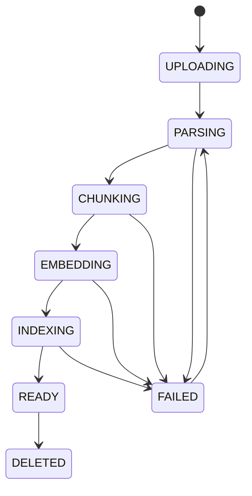
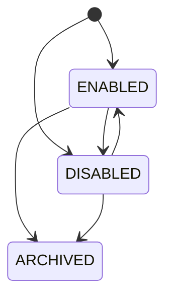

# APP-KB 详细规范

> **版本**: v1.0 | **日期**: 2026-07-27
> **模块**: APP-KB（知识库）
> **关联主 PRD**: PRD-APP-KB-知识库_v1.2-20260727.md
> **关联 API 契约**: API-CONTRACT §3.8, §3.12
> **归属后端服务**: TECH-RAG

---

## 1. 完整数据模型

### 1.1 实体清单

| # | 实体 | 中文 | 表名 | 关联 |
|---|---|---|---|---|
| 1 | KnowledgeBase | 知识库 | kb_knowledge_base | 1:N -> Document |
| 2 | ChunkStrategy | 切片策略 | kb_chunk_strategy | 1:N -> KnowledgeBase |
| 3 | Document | 文档 | kb_document | N:1 -> KnowledgeBase |
| 4 | Chunk | 切片 | kb_chunk | N:1 -> Document |
| 5 | Embedding | 向量 | rag_embedding | 1:1 -> Chunk |
| 6 | Evidence | 检索证据 | rag_evidence | - |
| 7 | KbVersion | 知识库版本 | kb_version | N:1 -> KnowledgeBase |
| 8 | SearchLog | 检索日志 | rag_search_log | - |

### 1.2 KnowledgeBase
| 字段 | 类型 | 必填 | 默认 | 说明 |
|---|---|---|---|---|
| knowledgeBaseId | string(36) | 是 | uuid | 主键 |
| tenantId | string(36) | 是 | - | 租户 |
| kbCode | string(64) | 是 | - | 编码 |
| displayName | string(128) | 是 | - | 名称 |
| kbKind | enum | 是 | - | QA/FAQ/DOCUMENT/WEB |
| enabled | boolean | 是 | true | 启用 |
| chunkStrategyId | string(36) | 否 | - | 切片策略 |
| embeddingModel | string(64) | 是 | - | 向量模型 |
| documentCount | integer | 是 | 0 | 文档数 |
| chunkCount | integer | 是 | 0 | 切片数 |
| totalTokens | long | 是 | 0 | Token |
| language | enum | 是 | ZH_CN | 语言 |
| visibility | enum | 是 | PRIVATE | PRIVATE/ORG/TENANT/PUBLIC |
| ownerOrgId | string(36) | 是 | - | 组织 |
| ownerUserId | string(36) | 是 | - | 负责人 |
| consumerEmployeeIds | string[] | 否 | [] | 消费方员工 |
| createdBy/At/updatedBy/At/isDeleted | - | - | - | 通用字段 |

### 1.3 Document
| 字段 | 类型 | 必填 | 说明 |
|---|---|---|---|
| documentId | string(36) | 是 | 主键 |
| knowledgeBaseId | string(36) | 是 | 知识库 |
| title | string(256) | 是 | 标题 |
| fileName | string(256) | 是 | 文件名 |
| fileType | enum | 是 | PDF/DOCX/XLSX/TXT/MD/HTML/CSV |
| fileSize | long | 是 | 字节 |
| fileUrl | string(1024) | 是 | URL |
| fileHash | string(64) | 是 | SHA-256 |
| status | enum | 是 | UPLOADING/PARSING/CHUNKING/EMBEDDING/INDEXING/READY/FAILED |
| chunkCount | integer | 是 | 0 |
| tokenCount | integer | 是 | 0 |
| errorMessage | string(2048) | 否 | - |
| sourceType | enum | 是 | MANUAL/UPLOAD/API |
| uploaderId | string(36) | 是 | - |
| processedAt | timestamp | 否 | - |
| expiredAt | timestamp | 否 | - |

### 1.4 Chunk
| 字段 | 类型 | 必填 | 说明 |
|---|---|---|---|
| chunkId | string(36) | 是 | 主键 |
| documentId | string(36) | 是 | 文档 |
| knowledgeBaseId | string(36) | 是 | 知识库 |
| sequence | integer | 是 | 序号 |
| content | text | 是 | 内容 |
| contentHash | string(64) | 是 | SHA-256 |
| tokenCount | integer | 是 | 0 |
| startOffset | integer | 否 | - |
| endOffset | integer | 否 | - |
| pageNumber | integer | 否 | - |
| sectionTitle | string(256) | 否 | - |
| status | enum | 是 | PENDING/EMBEDDING/READY/FAILED |
| qualityScore | decimal(3,2) | 否 | - |
| isValid | boolean | 是 | true |
| reviewedBy | string(36) | 否 | - |
| reviewedAt | timestamp | 否 | - |

---

## 2. 完整 API Schema

### 2.1 关键端点

| # | 方法 | 路径 | 优先级 |
|---|---|---|---|
| 1 | GET | /v1/kb/knowledge-bases | P0 |
| 2 | POST | /v1/kb/knowledge-bases | P0 |
| 3 | GET | /v1/kb/documents | P0 |
| 4 | POST | /v1/kb/documents | P0 |
| 5 | POST | /v1/kb/documents/{id}/process | P0 |
| 6 | POST | /v1/rag/search | P0 |

### 2.2 POST /v1/kb/knowledge-bases
**Request Body**:
```json
{
  "type": "object",
  "properties": {
    "kbCode": { "type": "string", "pattern": "^[a-zA-Z][a-zA-Z0-9_]{0,63}$" },
    "displayName": { "type": "string", "minLength": 1, "maxLength": 128 },
    "kbKind": { "type": "string", "enum": ["QA", "FAQ", "DOCUMENT", "WEB", "PRODUCT", "MANUAL", "CUSTOM"] },
    "chunkStrategyId": { "type": "string" },
    "embeddingModel": { "type": "string" },
    "language": { "type": "string", "enum": ["ZH_CN", "EN_US", "MULTI"] },
    "tags": { "type": "array", "items": { "type": "string" } },
    "visibility": { "type": "string", "enum": ["PRIVATE", "ORG", "TENANT", "PUBLIC"] }
  },
  "required": ["kbCode", "displayName", "kbKind"]
}
```

### 2.3 POST /v1/rag/search
**Request Body**:
```json
{
  "type": "object",
  "properties": {
    "query": { "type": "string", "minLength": 1, "maxLength": 1024 },
    "knowledgeBaseIds": { "type": "array", "items": { "type": "string" }, "minItems": 1 },
    "topK": { "type": "integer", "minimum": 1, "maximum": 50, "default": 5 },
    "scoreThreshold": { "type": "number", "minimum": 0, "maximum": 1, "default": 0.6 },
    "rerank": { "type": "boolean", "default": false },
    "filters": {
      "type": "object",
      "properties": {
        "fileType": { "type": "string" },
        "tags": { "type": "array", "items": { "type": "string" } },
        "dateRange": { "type": "object" }
      }
    }
  },
  "required": ["query", "knowledgeBaseIds"]
}
```

---

## 3. 状态机

### 3.1 Document 状态机


### 3.2 KnowledgeBase 状态机


---

## 4. 业务规则

- **BR-001**: 知识库编码同一租户内唯一
- **BR-002**: PUBLIC 知识库需 admin 审核
- **BR-003**: 删除知识库为软删除，保留 30 天
- **BR-004**: 单文档不超过 100MB
- **BR-005**: 同一文件 SHA-256 同一知识库内去重
- **BR-006**: 文档处理失败可重试 3 次
- **BR-007**: chunkSize 范围 100-4000
- **BR-008**: chunkOverlap 必须 < chunkSize
- **BR-009**: 跨知识库检索按 score 降序
- **BR-010**: scoreThreshold 低于阈值不返回
- **BR-011**: PRIVATE KB 仅 owner + 显式授权
- **BR-012**: 文档权限可覆盖 KB 权限

---

## 5. 权限矩阵

| 资源 | 平台超管 | 租户超管 | KB owner | KB 编辑者 | 检索者 | 访客 |
|---|---|---|---|---|---|---|
| KnowledgeBase | CRUD | CRUD | CRUD | RU | R | R（公开）|
| Document | CRUD | CRUD | CRUD | CRUD | R | R（公开）|
| Chunk | CRUD | R | RUD | R | R | R（公开）|
| Embedding | CRUD | R | R | R | - | - |
| KbVersion | R | R | CRUD | R | R | R |
| SearchLog | R | R | R | R | RUD（自己）| - |

---

## 6. 性能要求

| 操作 | P99 | QPS |
|---|---|---|
| KB 列表 | < 200ms | 500 |
| 文档上传 | < 5s | 50 |
| 文档切片（100页PDF）| < 30s | 20 |
| 文档 Embedding | < 60s | 10 |
| 检索（单KB）| < 500ms | 200 |
| 检索（多KB）| < 1s | 100 |
| 检索（带Rerank）| < 2s | 50 |

---

## 7. 安全要求

- 文档加密存储（AES-256）
- 文档 URL 短期签名（<= 1 小时）
- 向量数据脱敏
- 上传文件病毒扫描
- 文件类型白名单
- 大文件流式处理
