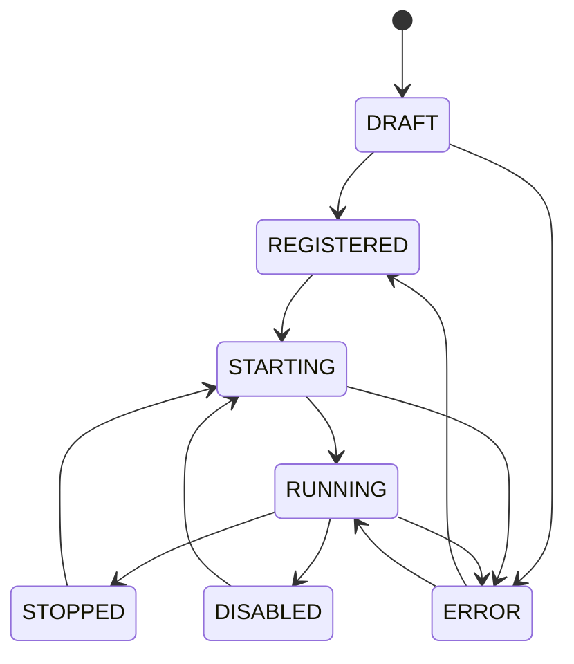
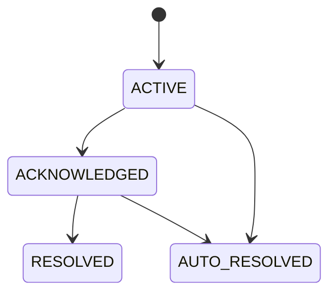
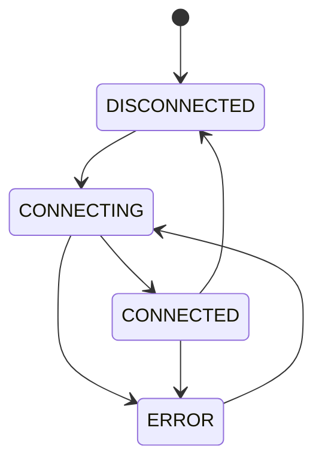

# APP-MCPHUB 详细规范

> **版本**: v1.0 | **日期**: 2026-07-27
> **模块**: APP-MCPHUB（MCP 服务中心）
> **关联主 PRD**: PRD-APP-MCPHUB-MCP服务中心_v2.2-20260727.md
> **关联 API 契约**: API-CONTRACT §3.10
> **归属后端服务**: TECH-MCP + TECH-IAM（ABAC 策略）

---

## 1. 完整数据模型

### 1.1 实体清单

| # | 实体 | 中文 | 表名 | 关联 |
|---|---|---|---|---|
| 1 | McpServer | MCP Server | mcp_server | 1:N -> Tool/Resource/Prompt |
| 2 | McpTool | MCP 工具 | mcp_tool | N:1 -> Server, 1:N -> Version |
| 3 | ToolVersion | 工具版本 | mcp_tool_version | N:1 -> Tool |
| 4 | ToolCategory | 工具分类 | mcp_tool_category | 1:N -> Tool |
| 5 | McpResource | MCP 资源 | mcp_resource | N:1 -> Server |
| 6 | McpPrompt | MCP Prompt | mcp_prompt | N:1 -> Server |
| 7 | McpClient | MCP Client | mcp_client | - |
| 8 | PermissionRule | 权限规则 | mcp_permission_rule | - |
| 9 | Policy | ABAC 策略 | iam_policy | - |
| 10 | TrustDomain | 信任域 | mcp_trust_domain | - |
| 11 | ExternalAgent | 外部 Agent | mcp_external_agent | - |
| 12 | Integration | 外部集成 | mcp_integration | - |
| 13 | AlertRule | 告警规则 | mcp_alert_rule | 1:N -> AlertRecord |
| 14 | AlertRecord | 告警记录 | mcp_alert_record | N:1 -> AlertRule |
| 15 | ApiKey | API Key | mcp_api_key | N:1 -> User |
| 16 | CallAudit | 调用审计 | mcp_call_audit | - |
| 17 | ConnectionStatus | 连接状态 | mcp_connection_status | - |
| 18 | DebugSession | 调试会话 | mcp_debug_session | 1:N -> DebugExecution |
| 19 | DebugExecution | 调试执行 | mcp_debug_execution | N:1 -> Session |

### 1.2 McpServer
| 字段 | 类型 | 必填 | 默认 | 说明 |
|---|---|---|---|---|
| serverId | string(36) | 是 | uuid | 主键 |
| tenantId | string(36) | 是 | - | 租户 |
| name | string(64) | 是 | - | 名称 |
| code | string(64) | 是 | - | 编码 |
| transport | enum | 是 | - | STDIO/SSE/WEBSOCKET/HTTP |
| endpoint | string(1024) | 是 | - | URL |
| command | string(512) | 否 | - | STDIO 命令 |
| args | string[] | 否 | - | 启动参数 |
| env | json | 否 | - | 环境变量（加密） |
| authType | enum | 是 | NONE | NONE/API_KEY/OAUTH2/CUSTOM |
| authConfig | json | 否 | - | 认证配置（加密） |
| protocolVersion | string(16) | 是 | 2024-11-05 | MCP 协议版本 |
| capabilities | json | 是 | - | 能力 |
| status | enum | 是 | DRAFT | DRAFT/REGISTERED/STARTING/RUNNING/STOPPED/ERROR/DISABLED |
| healthCheckUrl | string(1024) | 否 | - | 健康检查 URL |
| healthCheckInterval | integer | 是 | 60 | 间隔（秒）|
| timeout | integer | 是 | 30 | 超时（秒）|
| maxConnections | integer | 是 | 100 | 最大连接 |
| currentConnections | integer | 是 | 0 | 当前连接 |
| totalCalls | integer | 是 | 0 | 累计调用 |
| tags | string[] | 否 | - | 标签 |
| version | string(16) | 是 | 1.0.0 | 版本 |
| isPublic | boolean | 是 | false | 是否公开 |

### 1.3 McpTool
| 字段 | 类型 | 必填 | 说明 |
|---|---|---|---|
| toolId | string(36) | 是 | 主键 |
| serverId | string(36) | 是 | Server |
| name | string(64) | 是 | 工具名 |
| code | string(64) | 是 | 编码 |
| description | string(2048) | 是 | 描述 |
| inputSchema | json | 是 | 输入 JSON Schema |
| outputSchema | json | 否 | 输出 JSON Schema |
| examples | json | 否 | 示例 |
| tags | string[] | 否 | 标签 |
| categoryId | string(36) | 否 | 分类 |
| isEnabled | boolean | 是 | true | 启用 |
| requiresApproval | boolean | 是 | false | 需审批 |
| timeout | integer | 是 | 30 | 超时 |
| rateLimit | json | 否 | 限流 |
| costPerCall | decimal(10,4) | 否 | 单次费用 |
| version | string(16) | 是 | 1.0.0 | 版本 |
| callCount | integer | 是 | 0 | 调用次数 |
| successCount | integer | 是 | 0 | 成功次数 |
| failureCount | integer | 是 | 0 | 失败次数 |
| avgDuration | integer | 是 | 0 | 平均耗时 |

### 1.4 PermissionRule
| 字段 | 类型 | 必填 | 说明 |
|---|---|---|---|
| ruleId | string(36) | 是 | 主键 |
| name | string(128) | 是 | 规则名 |
| subjectType | enum | 是 | USER/ROLE/DEPT/EMPLOYEE/CLIENT |
| subjectId | string(36) | 是 | 主体 |
| resourceType | enum | 是 | TOOL/SERVER/RESOURCE/PROMPT |
| resourceId | string(36) | 是 | 资源（* 表示全部）|
| actions | string[] | 是 | CALL/READ/WRITE/ADMIN |
| effect | enum | 是 | ALLOW/DENY |
| conditions | json | 否 | 条件 |
| priority | integer | 是 | 0 | 优先级 |
| enabled | boolean | 是 | true | 启用 |
| expiresAt | timestamp | 否 | 过期 |

### 1.5 AlertRule
| 字段 | 类型 | 必填 | 说明 |
|---|---|---|---|
| ruleId | string(36) | 是 | 主键 |
| name | string(128) | 是 | 名称 |
| metric | enum | 是 | ERROR_RATE/LATENCY/CALL_VOLUME/TOKEN_USAGE/COST/CONNECTION_COUNT |
| targetType | enum | 是 | TOOL/SERVER |
| targetId | string(36) | 是 | 目标 |
| condition | string | 是 | 条件 DSL |
| severity | enum | 是 | LOW/MEDIUM/HIGH/CRITICAL |
| notifyChannels | string[] | 是 | 渠道 |
| notifyTargets | string[] | 是 | 对象 |
| cooldown | integer | 是 | 300 | 冷却（秒）|
| enabled | boolean | 是 | true | 启用 |

### 1.6 CallAudit
| 字段 | 类型 | 必填 | 说明 |
|---|---|---|---|
| auditId | string(36) | 是 | 主键 |
| userId | string(36) | 否 | 调用人 |
| apiKeyId | string(36) | 否 | API Key |
| serverId | string(36) | 是 | Server |
| toolId | string(36) | 是 | Tool |
| request | json | 是 | 请求 |
| response | json | 否 | 响应 |
| errorCode | integer | 否 | 错误码 |
| errorMessage | string(2048) | 否 | 错误 |
| status | enum | 是 | SUCCESS/FAILED/TIMEOUT |
| duration | integer | 是 | 耗时（毫秒）|
| promptTokens | integer | 是 | 0 | 输入 |
| completionTokens | integer | 是 | 0 | 输出 |
| totalTokens | integer | 是 | 0 | 总 |
| cost | decimal(10,4) | 是 | 0 | 费用 |
| ip | string(64) | 否 | - |
| userAgent | string(512) | 否 | - |
| traceId | string(64) | 否 | - |
| timestamp | timestamp | 是 | - |

### 1.7 DebugSession / DebugExecution
| 字段 | 类型 | 必填 | 说明 |
|---|---|---|---|
| sessionId | string(36) | 是 | 主键 |
| userId | string(36) | 是 | 调试人 |
| toolId | string(36) | 是 | 工具 |
| status | enum | 是 | ACTIVE/CLOSED |
| executionCount | integer | 是 | 0 | 执行次数 |
| executionId | string(36) | 是 | 执行 |
| sessionId | string(36) | 是 | 会话 |
| input | json | 是 | 输入 |
| output | json | 否 | 输出 |
| status | enum | 是 | SUCCESS/FAILED/RUNNING |
| duration | integer | 是 | 耗时 |
| tokenUsage | json | 是 | - |
| trace | text | 否 | 调用链 |
| executedAt | timestamp | 是 | - |

---

## 2. 完整 API Schema

### 2.1 关键端点
| # | 方法 | 路径 | 优先级 |
|---|---|---|---|
| 1 | GET | /v1/mcp/servers | P0 |
| 2 | POST | /v1/mcp/servers | P0 |
| 3 | GET | /v1/mcp/tools | P0 |
| 4 | POST | /v1/mcp/tools | P0 |
| 5 | POST | /v1/mcp/debug/execute | P0 |
| 6 | GET | /v1/mcp/audit/logs | P0 |
| 7 | GET | /v1/mcp/permissions | P0 |
| 8 | POST | /v1/mcp/permissions | P0 |
| 9 | GET | /v1/mcp/alert-rules | P1 |
| 10 | GET | /v1/mcp/connection-monitor | P1 |

### 2.2 POST /v1/mcp/servers
```json
{
  "type": "object",
  "properties": {
    "name": { "type": "string", "minLength": 1, "maxLength": 64 },
    "code": { "type": "string", "pattern": "^[a-zA-Z][a-zA-Z0-9_]{0,63}$" },
    "transport": { "type": "string", "enum": ["STDIO", "SSE", "WEBSOCKET", "HTTP"] },
    "endpoint": { "type": "string", "format": "uri" },
    "command": { "type": "string" },
    "args": { "type": "array", "items": { "type": "string" } },
    "env": { "type": "object" },
    "authType": { "type": "string", "enum": ["NONE", "API_KEY", "OAUTH2", "CUSTOM"] },
    "authConfig": { "type": "object" },
    "protocolVersion": { "type": "string", "default": "2024-11-05" },
    "capabilities": { "type": "object" },
    "healthCheckInterval": { "type": "integer", "default": 60 },
    "timeout": { "type": "integer", "default": 30 },
    "maxConnections": { "type": "integer", "default": 100 }
  },
  "required": ["name", "code", "transport", "endpoint", "protocolVersion"]
}
```

### 2.3 POST /v1/mcp/tools
```json
{
  "type": "object",
  "properties": {
    "serverId": { "type": "string" },
    "name": { "type": "string", "minLength": 1, "maxLength": 64 },
    "code": { "type": "string", "pattern": "^[a-zA-Z][a-zA-Z0-9_]{0,63}$" },
    "description": { "type": "string", "minLength": 1, "maxLength": 2048 },
    "inputSchema": { "type": "object" },
    "outputSchema": { "type": "object" },
    "isEnabled": { "type": "boolean", "default": true },
    "requiresApproval": { "type": "boolean", "default": false },
    "timeout": { "type": "integer", "default": 30 },
    "rateLimit": { "type": "object" }
  },
  "required": ["serverId", "name", "code", "description", "inputSchema"]
}
```

### 2.4 POST /v1/mcp/debug/execute
```json
{
  "type": "object",
  "properties": {
    "sessionId": { "type": "string" },
    "toolId": { "type": "string" },
    "toolCode": { "type": "string" },
    "input": { "type": "object" },
    "options": {
      "type": "object",
      "properties": {
        "timeout": { "type": "integer" },
        "dryRun": { "type": "boolean", "default": false },
        "captureTrace": { "type": "boolean", "default": true }
      }
    }
  },
  "required": ["input"]
}
```

---

## 3. 状态机

### 3.1 McpServer 状态机


### 3.2 AlertRecord 状态机


### 3.3 ConnectionStatus 状态机


---

## 4. 业务规则

- **BR-001**: Server 编码同一租户内唯一
- **BR-002**: 启动后自动 health check
- **BR-003**: 连续 3 次 health check 失败 -> ERROR
- **BR-004**: ERROR 后 1 分钟自动重试
- **BR-005**: 达到 maxConnections 拒绝新连接
- **BR-006**: Tool 编码同一 Server 内唯一
- **BR-007**: inputSchema 必须符合 JSON Schema 2020-12
- **BR-008**: requiresApproval 调用需二次确认
- **BR-009**: rateLimit 超限返回 429
- **BR-010**: Tool 失败 5 分钟内 10 次 -> 临时禁用
- **BR-011**: 权限检查顺序：DENY > ALLOW > 默认 DENY
- **BR-012**: 策略按 priority 倒序匹配
- **BR-013**: 跨租户访问被拒绝
- **BR-014**: ERROR_RATE > 5% 持续 5min -> 告警
- **BR-015**: LATENCY P99 > 5s 持续 5min -> 告警
- **BR-016**: 告警冷却期内不重复触发
- **BR-017**: 所有 Tool 调用记录 CallAudit
- **BR-018**: 敏感参数记录时脱敏
- **BR-019**: 审计日志保留 1 年
- **BR-020**: 调试 dryRun 模式不实际执行

---

## 5. 权限矩阵

| 资源 | 平台超管 | 租户超管 | MCP 管理员 | 开发者 | 业务用户 | 访客 |
|---|---|---|---|---|---|---|
| McpServer | CRUD | CRUD | CRUD | CR | R | - |
| McpTool | CRUD | CRUD | CRUD | CRU | R | - |
| McpResource | CRUD | CRUD | CRUD | CRU | R | - |
| McpPrompt | CRUD | CRUD | CRUD | CRU | R | - |
| McpClient | CRUD | CRUD | CRUD | CR | R | - |
| ToolCategory | CRUD | CRUD | CRUD | CR | R | - |
| ToolVersion | R | R | R | R | R | - |
| PermissionRule | CRUD | CRUD | CRUD | R | R | - |
| Policy | CRUD | CRUD | CRUD | R | R | - |
| TrustDomain | CRUD | CRUD | CRUD | R | R | - |
| ExternalAgent | CRUD | CRUD | CRUD | CR | R | - |
| AlertRule | CRUD | CRUD | CRUD | R | R | - |
| ApiKey | CRUD | CRUD | CRUD | CRUD | - | - |
| CallAudit | R | R | R | R | R（自己）| - |
| DebugSession | CRUD | CRUD | CRUD | CRUD | R | - |

---

## 6. 性能要求

| 操作 | P99 | QPS |
|---|---|---|
| Server 列表 | < 200ms | 500 |
| Tool 列表 | < 200ms | 500 |
| Tool 调用（普通）| < 1s | 1000 |
| Tool 调用（复杂）| < 30s | 100 |
| 权限检查 | < 10ms | 10000 |
| 审计写入 | < 50ms | 5000 |
| 调试执行 | < 30s | 50 |
| 健康检查 | < 500ms | 100 |

---

## 7. 安全要求

- 所有 API 必须鉴权
- API Key 仅创建时返回明文
- 敏感配置（env, authConfig）加密存储
- 跨租户访问严格隔离
- 外部 Agent mTLS 双向认证
- 输入参数验证
- 默认 100 QPS/Key 限流
- 审计日志不可篡改（append-only）
