# APP-ONTSTUDIO 详细规范

> **版本**: v1.0 | **日期**: 2026-07-27
> **模块**: APP-ONTSTUDIO（本体论引擎）
> **关联主 PRD**: PRD-APP-ONTSTUDIO-本体论引擎_v2.2-20260727.md
> **关联 API 契约**: API-CONTRACT §3.11
> **归属后端服务**: TECH-ONT（核心）+ TECH-EA（映射）+ TECH-RULE（规则）+ TECH-ACTION（Action）

---

## 1. 完整数据模型

### 1.1 实体清单

| # | 实体 | 中文 | 表名 | 关联 |
|---|---|---|---|---|
| 1 | Concept | 概念 | ont_concept | N:1 -> parent, 1:N -> Attribute |
| 2 | Attribute | 属性 | ont_attribute | N:1 -> Concept |
| 3 | Entity | 实体（实例）| ont_entity | N:1 -> Concept, 1:N -> AttributeValue |
| 4 | AttributeValue | 属性值 | ont_attribute_value | N:1 -> Entity, N:1 -> Attribute |
| 5 | RelationType | 关系类型 | ont_relation_type | 1:N -> RelationInstance |
| 6 | RelationInstance | 关系实例 | ont_relation_instance | N:M -> Entity |
| 7 | Rule | 业务规则 | rule_rule | 1:1 -> Condition/Action |
| 8 | RuleSet | 规则集 | rule_rule_set | 1:N -> Rule |
| 9 | RuleExecution | 规则执行 | rule_execution | N:1 -> Rule |
| 10 | DecisionTable | 决策表 | rule_decision_table | 1:N -> DecisionRule |
| 11 | DataSource | 数据源 | data_source | - |
| 12 | DataMapping | 数据映射 | data_mapping | N:1 -> DataSource, N:1 -> Entity |
| 13 | SyncTask | 同步任务 | data_sync_task | N:1 -> DataSource |
| 14 | DataQualityRule | 数据质量规则 | data_quality_rule | - |
| 15 | DataLineage | 数据血缘 | data_lineage | N:1 -> Entity |
| 16 | Action | 动作 | action_action | 1:N -> ActionStep |
| 17 | ActionStep | 动作步骤 | action_step | N:1 -> Action |
| 18 | Orchestration | 服务编排 | action_orchestration | 1:N -> ActionStep |
| 19 | TriggerRule | 触发规则 | action_trigger_rule | - |
| 20 | Execution | 执行 | action_execution | N:1 -> Orchestration/Action |
| 21 | Version | 版本 | ont_version | N:1 -> Concept/Entity/Rule |

### 1.2 Concept（概念）
| 字段 | 类型 | 必填 | 说明 |
|---|---|---|---|
| conceptId | string(36) | 是 | 主键 |
| tenantId | string(36) | 是 | 租户 |
| name | string(64) | 是 | 概念名 |
| code | string(64) | 是 | 编码（系统内唯一）|
| parentId | string(36) | 否 | 父概念（层级树）|
| namespace | string(128) | 是 | 命名空间（默认 http://metaplatform.io/ont/）|
| description | string(2048) | 否 | 描述 |
| synonyms | string[] | 否 | 同义词（用于自然语言匹配）|
| attributes | json | 否 | 属性定义 [{name, type, required, defaultValue, constraints}] |
| metadata | json | 否 | 扩展元数据 |
| isAbstract | boolean | 是 | false | 是否抽象 |
| status | enum | 是 | DRAFT | DRAFT/PUBLISHED/DEPRECATED |
| version | string(16) | 是 | 1.0.0 | 版本号 |
| tags | string[] | 否 | 标签 |
| createdBy/At/updatedBy/At/isDeleted | - | - | 通用 |

### 1.3 Entity（实体）
| 字段 | 类型 | 必填 | 说明 |
|---|---|---|---|
| entityId | string(36) | 是 | 主键 |
| conceptId | string(36) | 是 | 所属概念 |
| name | string(128) | 是 | 实体名 |
| code | string(64) | 是 | 编码 |
| attributeValues | json | 是 | 属性值 {attrName: value} |
| status | enum | 是 | ACTIVE | ACTIVE/INACTIVE/DEPRECATED |
| sourceSystem | string(64) | 否 | 来源系统 |
| sourceId | string(128) | 否 | 来源 ID |
| confidence | decimal(3,2) | 否 | 置信度（0-1）|
| createdBy/At/updatedBy/At | - | - | - | 通用 |

### 1.4 RelationType（关系类型）
| 字段 | 类型 | 必填 | 说明 |
|---|---|---|---|
| relationTypeId | string(36) | 是 | 主键 |
| name | string(64) | 是 | 关系名（如 "isPartOf"）|
| code | string(64) | 是 | 编码 |
| fromConceptId | string(36) | 是 | 源概念 |
| toConceptId | string(36) | 是 | 目标概念 |
| cardinality | enum | 是 | ONE_TO_ONE/ONE_TO_MANY/MANY_TO_ONE/MANY_TO_MANY |
| direction | enum | 是 | UNIDIRECTIONAL/BIDIRECTIONAL |
| description | string(1024) | 否 | 描述 |
| inverseName | string(64) | 否 | 反向关系名 |
| properties | json | 否 | 关系属性 |

### 1.5 RelationInstance（关系实例）
| 字段 | 类型 | 必填 | 说明 |
|---|---|---|---|
| relationInstanceId | string(36) | 是 | 主键 |
| relationTypeId | string(36) | 是 | 关系类型 |
| fromEntityId | string(36) | 是 | 源实体 |
| toEntityId | string(36) | 是 | 目标实体 |
| properties | json | 否 | 关系属性 |
| weight | decimal(5,2) | 否 | 权重 |
| status | enum | 是 | ACTIVE | ACTIVE/INACTIVE |
| createdAt | timestamp | 是 | - |

### 1.6 Rule（业务规则）
| 字段 | 类型 | 必填 | 说明 |
|---|---|---|---|
| ruleId | string(36) | 是 | 主键 |
| ruleSetId | string(36) | 否 | 规则集 |
| name | string(128) | 是 | 规则名 |
| code | string(64) | 是 | 编码 |
| description | string(2048) | 是 | 描述 |
| priority | integer | 是 | 0 | 优先级 |
| condition | text | 是 | 条件（DSL）|
| action | text | 是 | 动作（DSL）|
| type | enum | 是 | WHEN/IF/THEN/ELSE |
| scope | json | 否 | 适用范围 |
| enabled | boolean | 是 | true | 启用 |
| version | string(16) | 是 | 1.0.0 | 版本 |

### 1.7 Action（动作）
| 字段 | 类型 | 必填 | 说明 |
|---|---|---|---|
| actionId | string(36) | 是 | 主键 |
| name | string(64) | 是 | 动作名 |
| code | string(64) | 是 | 编码 |
| description | string(1024) | 是 | 描述 |
| inputSchema | json | 是 | 输入参数 |
| outputSchema | json | 否 | 输出参数 |
| steps | json | 是 | 步骤列表 |
| compensation | text | 否 | 补偿事务 |
| timeout | integer | 是 | 60 | 超时（秒）|
| retryPolicy | json | 否 | 重试策略 |
| tags | string[] | 否 | 标签 |
| version | string(16) | 是 | 1.0.0 | 版本 |
| callCount | integer | 是 | 0 | 调用次数 |

### 1.8 Orchestration（服务编排）
| 字段 | 类型 | 必填 | 说明 |
|---|---|---|---|
| orchestrationId | string(36) | 是 | 主键 |
| name | string(128) | 是 | 编排名 |
| description | string(2048) | 否 | - |
| bpmnXml | text | 否 | BPMN 2.0 XML |
| nodes | json | 是 | 节点列表 |
| edges | json | 是 | 边列表 |
| triggers | json | 否 | 触发配置 |
| compensation | text | 否 | 补偿 |
| status | enum | 是 | DRAFT | DRAFT/PUBLISHED/DEPRECATED |
| version | string(16) | 是 | 1.0.0 | 版本 |

### 1.9 DataSource（数据源）
| 字段 | 类型 | 必填 | 说明 |
|---|---|---|---|
| dataSourceId | string(36) | 是 | 主键 |
| name | string(64) | 是 | 数据源名 |
| type | enum | 是 | MYSQL/POSTGRES/ORACLE/SQLSERVER/MONGODB/KAFKA/REST_API/CSV/JSON |
| connectionConfig | json | 是 | 连接配置（加密）|
| status | enum | 是 | ACTIVE | ACTIVE/INACTIVE/ERROR |
| lastTestedAt | timestamp | 否 | - |
| lastErrorMessage | string(1024) | 否 | - |

### 1.10 DataMapping（数据映射）
| 字段 | 类型 | 必填 | 说明 |
|---|---|---|---|
| mappingId | string(36) | 是 | 主键 |
| dataSourceId | string(36) | 是 | 数据源 |
| targetEntityId | string(36) | 是 | 目标实体 |
| fieldMappings | json | 是 | 字段映射 [{sourceField, targetAttribute, transform}] |
| schedule | string | 否 | Cron 表达式 |
| enabled | boolean | 是 | true | 启用 |
| lastSyncAt | timestamp | 否 | - |
| lastErrorMessage | string(1024) | 否 | - |

### 1.11 Execution（执行）
| 字段 | 类型 | 必填 | 说明 |
|---|---|---|---|
| executionId | string(36) | 是 | 主键 |
| orchestrationId | string(36) | 否 | 编排 |
| actionId | string(36) | 否 | 动作 |
| input | json | 是 | 输入 |
| output | json | 否 | 输出 |
| status | enum | 是 | PENDING | PENDING/RUNNING/SUCCESS/FAILED/TIMEOUT/CANCELLED |
| currentStepId | string(36) | 否 | 当前步骤 |
| stepExecutions | json | 否 | 步骤执行详情 |
| errorMessage | string(2048) | 否 | - |
| startedAt | timestamp | 否 | - |
| finishedAt | timestamp | 否 | - |
| duration | integer | 否 | 耗时（毫秒）|
| triggeredBy | enum | 是 | MANUAL | MANUAL/SCHEDULE/TRIGGER/API |

---

## 2. 完整 API Schema

### 2.1 关键端点
| # | 方法 | 路径 | 优先级 |
|---|---|---|---|
| 1 | GET | /v1/ont/concepts/search | P0 |
| 2 | POST | /v1/ea/ontology-mappings/rules | P0 |
| 3 | GET | /v1/ea/ontology-mappings/changes | P1 |
| 4 | GET | /v1/copilot/ontology/concepts/search | P0（已重映射到 /v1/ont/）|
| 5 | GET | /v1/copilot/ontology/graph/query | P0 |

### 2.2 GET /v1/ont/concepts/search
**Query**:
```json
{
  "type": "object",
  "properties": {
    "keyword": { "type": "string", "maxLength": 64 },
    "namespace": { "type": "string" },
    "status": { "type": "string", "enum": ["DRAFT", "PUBLISHED", "DEPRECATED"] },
    "parentId": { "type": "string" },
    "tags": { "type": "array", "items": { "type": "string" } },
    "includeAttributes": { "type": "boolean", "default": false },
    "page": { "type": "integer", "minimum": 1, "default": 1 },
    "size": { "type": "integer", "minimum": 1, "maximum": 100, "default": 20 }
  }
}
```

### 2.3 POST /v1/ea/ontology-mappings/rules
**Request Body**:
```json
{
  "type": "object",
  "properties": {
    "sourceType": { "type": "string", "enum": ["CAPABILITY", "APPLICATION", "DATA_ENTITY"] },
    "sourceId": { "type": "string" },
    "targetType": { "type": "string", "enum": ["CONCEPT", "ENTITY"] },
    "targetId": { "type": "string" },
    "mappingRule": { "type": "string" },
    "confidence": { "type": "number", "minimum": 0, "maximum": 1 }
  },
  "required": ["sourceType", "sourceId", "targetType", "targetId"]
}
```

---

## 3. 状态机

### 3.1 Concept 状态机
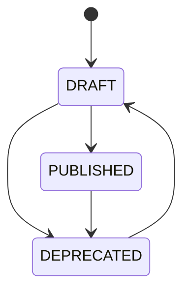

### 3.2 Action 状态机
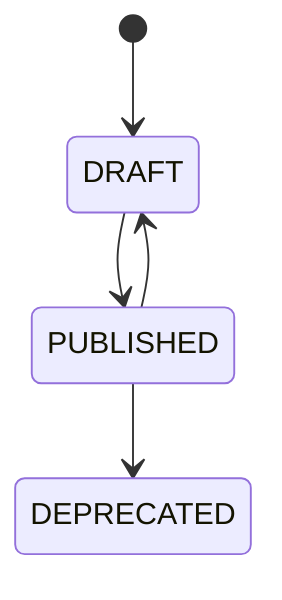

### 3.3 Orchestration 状态机
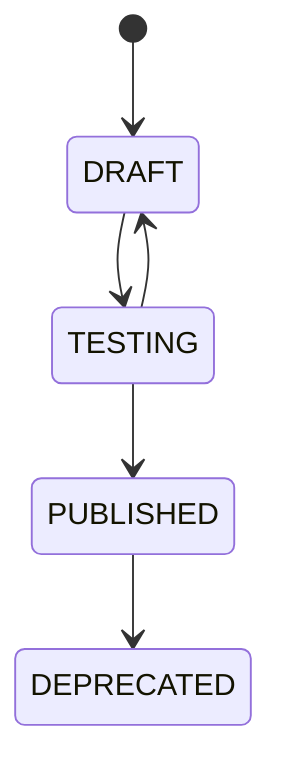

### 3.4 Execution 状态机
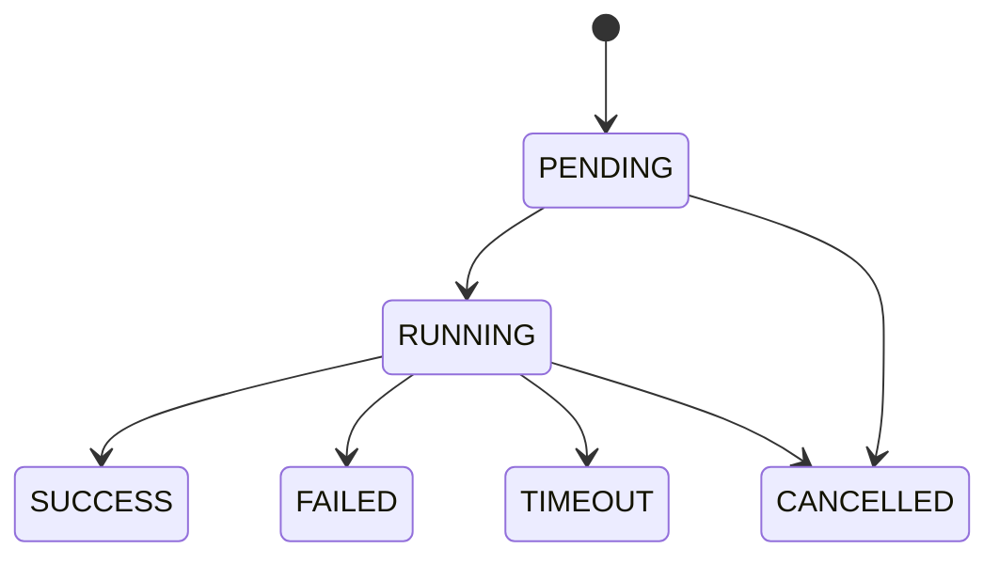

### 3.5 SyncTask 状态机
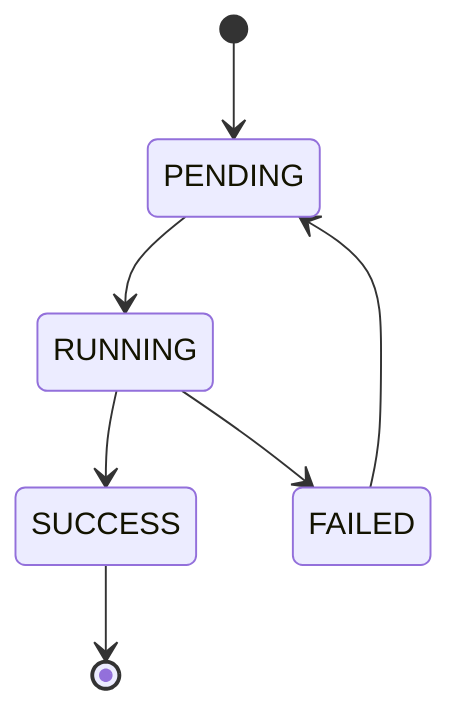

### 3.6 DataMapping 状态机
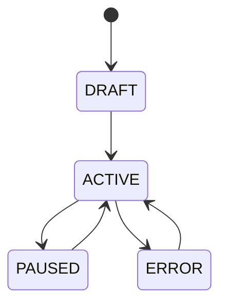

---

## 4. 业务规则

### 4.1 概念管理
- **BR-001**: 概念编码在命名空间内唯一
- **BR-002**: 抽象概念不能有实体
- **BR-003**: 删除概念需先迁移子概念
- **BR-004**: 已发布概念不能直接修改（需创建新版本）
- **BR-005**: 同义词用于自然语言匹配

### 4.2 实体管理
- **BR-010**: 实体必须属于已发布概念
- **BR-011**: 必填属性必须有值
- **BR-012**: 实体可跨数据源合并（按 sourceId 去重）
- **BR-013**: 删除实体为软删除

### 4.3 关系管理
- **BR-020**: 关系类型必须指定源/目标概念
- **BR-021**: 多对多关系需双向
- **BR-022**: 关系实例必须基于已发布关系类型
- **BR-023**: 自引用关系允许（如 父子）

### 4.4 规则
- **BR-030**: 规则必须有 condition 和 action
- **BR-031**: 规则集内规则按 priority 排序
- **BR-032**: 规则执行失败可重试
- **BR-033**: 决策表规则有命中/未命中/默认三档
- **BR-034**: 规则版本一旦发布不可修改

### 4.5 Action
- **BR-040**: Action 必须定义 inputSchema
- **BR-041**: 补偿事务（compensation）可选
- **BR-042**: 超时后自动取消
- **BR-043**: 重试策略可配置（次数、间隔、退避）

### 4.6 编排
- **BR-050**: 编排必须有开始/结束节点
- **BR-051**: 触发规则可手动/定时/事件
- **BR-052**: 并行节点需同步条件
- **BR-053**: 失败处理（停止/继续/重试）
- **BR-054**: 长时间运行支持 Saga 模式

### 4.7 数据源
- **BR-060**: 连接信息加密存储
- **BR-061**: 定期测试连接（默认 1 小时）
- **BR-062**: 数据源类型白名单
- **BR-063**: 凭证定期轮换

### 4.8 数据同步
- **BR-070**: 同步前先备份
- **BR-071**: 同步失败自动重试 3 次
- **BR-072**: 同步日志保留 90 天
- **BR-073**: 同步可暂停/恢复

---

## 5. 权限矩阵

| 资源 | 平台超管 | 租户超管 | 本体专家 | 数据工程师 | 开发者 | 业务方 |
|---|---|---|---|---|---|---|
| Concept | CRUD | CRUD | CRUD | R | R | R |
| Attribute | CRUD | CRUD | CRUD | R | R | R |
| Entity | CRUD | CRUD | CRUD | CRUD | R | R |
| AttributeValue | CRUD | CRUD | CRUD | CRUD | R | R |
| RelationType | CRUD | CRUD | CRUD | R | R | R |
| RelationInstance | CRUD | CRUD | CRUD | CRUD | R | R |
| Rule | CRUD | CRUD | CRUD | R | R | R |
| RuleSet | CRUD | CRUD | CRUD | R | R | R |
| DecisionTable | CRUD | CRUD | CRUD | R | R | R |
| DataSource | CRUD | CRUD | R | CRUD | R | R |
| DataMapping | CRUD | CRUD | R | CRUD | R | R |
| SyncTask | CRUD | CRUD | R | CRUD | R | R |
| DataQualityRule | CRUD | CRUD | R | CRUD | R | R |
| DataLineage | R | R | R | R | R | R |
| Action | CRUD | CRUD | CRUD | R | CRU | R |
| ActionStep | CRUD | CRUD | CRUD | R | CRU | R |
| Orchestration | CRUD | CRUD | CRUD | R | CRU | R |
| TriggerRule | CRUD | CRUD | CRUD | R | CRU | R |
| Execution | R | R | R | R | R | R |
| Version | R | R | R | R | R | R |

---

## 6. 性能要求

| 操作 | P99 | QPS |
|---|---|---|
| 概念搜索 | < 200ms | 200 |
| 实体查询 | < 200ms | 300 |
| 关系查询 | < 300ms | 200 |
| 规则执行（简单）| < 50ms | 1000 |
| 规则执行（复杂）| < 500ms | 100 |
| Action 执行 | < 5s | 200 |
| 编排执行 | < 30s | 50 |
| 数据同步（1000 行）| < 60s | 10 |
| 图谱查询 | < 1s | 50 |

---

## 7. 安全要求

- 概念命名空间隔离
- 实体数据脱敏
- 关系访问审计
- 规则执行可追溯
- Action 输入/输出加密
- 编排执行 traceId 记录
- 数据源连接信息加密
- 数据传输 TLS 1.3


## 9. 大数据相关实体与状态机（v1.1 新增）

> **触发决策**: 2026-07-28 增加大数据相关技术后补充
> **关联主 PRD**: §12 大数据相关页面
> **关联技术栈**: Hive / HBase / ClickHouse / Doris / StarRocks / Iceberg / Hudi / Delta / Flink / Spark / Debezium / Kafka

---

### 9.1 实体清单（大数据相关）

| # | 实体 | 中文 | 表名 | 关联 |
|---|---|---|---|---|
| 1 | BigDataSource | 大数据源 | ont_bigdata_source | 独立 |
| 2 | CDCTask | CDC 同步任务 | ont_cdc_task | N:1 → BigDataSource |
| 3 | ETLTask | ETL 任务 | ont_etl_task | N:1 → BigDataSource(s) |
| 4 | ETLStep | ETL 步骤 | ont_etl_step | N:1 → ETLTask |
| 5 | SchedulerTask | 调度任务 | ont_scheduler_task | N:1 → ETLTask/CDCTask |
| 6 | SchedulerExecution | 调度执行记录 | ont_scheduler_execution | N:1 → SchedulerTask |
| 7 | Metric | 数据指标 | ont_metric | N:1 → BigDataSource |
| 8 | MetricValue | 指标值 | ont_metric_value | N:1 → Metric |
| 9 | MetricLineage | 指标血缘 | ont_metric_lineage | N:M → Metric/Field |

---

### 9.2 关键实体字段

#### BigDataSource（大数据源）
| 字段 | 类型 | 必填 | 默认 | 校验 | 说明 |
|---|---|---|---|---|---|
| sourceId | string(36) | 是 | uuid | - | 主键 |
| tenantId | string(36) | 是 | - | - | 租户 |
| name | string(64) | 是 | - | 1-64 字符，租户内唯一 | |
| sourceType | enum | 是 | - | HIVE/HBASE/CLICKHOUSE/DORIS/STARROCKS/ICEBERG/HUDI/DELTA/PRESTO/TRINO/KAFKA/PULSAR/HDFS | 12 种类型 |
| description | string(512) | 否 | - | - | |
| host | string(256) | 是 | - | URL/IP | |
| port | number | 是 | - | 1-65535 | |
| database | string(64) | 条件 | - | - | Hive/CK/Doris 必填 |
| schema | string(64) | 条件 | - | - | Iceberg/Hive 必填 |
| authType | enum | 是 | NONE | NONE/USER_PASSWORD/KERBERY/LDAP | |
| authConfig | json | 条件 | - | 加密 | |
| sslEnabled | boolean | 是 | false | - | |
| extraParams | json | 否 | - | - | JDBC URL 参数 |
| poolSize | number | 是 | 10 | 1-100 | |
| queryTimeout | number | 是 | 60 | 1-3600 | 秒 |
| batchSize | number | 是 | 1000 | 1-100000 | |
| sampleRate | decimal(3,2) | 是 | 0.10 | 0-1 | |
| status | enum | 是 | DRAFT | DRAFT/ACTIVE/INACTIVE/ERROR/DELETED | |
| lastTestedAt | timestamp | 否 | - | - | |
| lastErrorMessage | string(1024) | 否 | - | - | |
| tags | array | 否 | [] | - | |
| businessDomain | string(32) | 否 | - | - | |
| ownerOrgId | string(36) | 是 | - | - | |
| ownerUserId | string(36) | 是 | - | - | |
| createdBy/At/updatedBy/At/isDeleted | - | - | - | - | 通用 |

#### CDCTask（CDC 同步任务）
| 字段 | 类型 | 必填 | 默认 | 校验 | 说明 |
|---|---|---|---|---|---|
| taskId | string(36) | 是 | uuid | - | 主键 |
| tenantId | string(36) | 是 | - | - | 租户 |
| name | string(128) | 是 | - | 1-128 字符 | |
| sourceId | string(36) | 是 | - | 已有数据源 | 源数据库 |
| syncMode | enum | 是 | FULL_INCREMENTAL | FULL_INCREMENTAL/INCREMENTAL_ONLY/SNAPSHOT_ONLY | |
| startPosition | enum | 是 | LATEST | LATEST/CURRENT_TIMESTAMP/CUSTOM | |
| customPosition | string | 条件 | - | binlog 格式 | CUSTOM 必填 |
| targetType | enum | 是 | KAFKA | KAFKA/CLICKHOUSE/HUDI/ICEBERG | 目标存储 |
| targetName | string(128) | 是 | - | - | Topic/Table 名 |
| schemaEvolution | enum | 是 | ADD_NEW_COLUMNS | IGNORE/ADD_NEW_COLUMNS/RESTRICT | |
| tables | json | 是 | [] | - | [{tableName, filter, excludedFields}] |
| concurrency | number | 是 | 1 | 1-16 | |
| batchSize | number | 是 | 1000 | 1-10000 | |
| retryCount | number | 是 | 3 | 0-10 | |
| retryInterval | number | 是 | 60 | 1-3600 | 秒 |
| deadLetterQueue | string | 否 | - | - | DLQ 名称 |
| status | enum | 是 | PENDING | PENDING/SNAPSHOTTING/RUNNING/PAUSED/FAILED/STOPPED | |
| currentPhase | string | 否 | - | - | 当前阶段 |
| totalRecords | long | 是 | 0 | - | 累计同步 |
| currentBinlog | string | 否 | - | - | 当前位点 |
| lagMs | number | 是 | 0 | - | 同步延迟（ms） |
| lastSyncAt | timestamp | 否 | - | - | |
| errorMessage | string(2048) | 否 | - | - | |
| ownerUserId | string(36) | 是 | - | - | |
| createdBy/At/updatedBy/At | - | - | - | - | 通用 |

#### ETLTask（ETL 任务）
| 字段 | 类型 | 必填 | 默认 | 校验 | 说明 |
|---|---|---|---|---|---|
| taskId | string(36) | 是 | uuid | - | 主键 |
| tenantId | string(36) | 是 | - | - | |
| name | string(128) | 是 | - | 1-128 字符 | |
| description | string(2048) | 否 | - | - | |
| mode | enum | 是 | - | BATCH_SPARK/BATCH_FLINK/STREAMING_FLINK/STREAMING_SPARK/SQL_TRANSFORM | 5 种模式 |
| priority | enum | 是 | NORMAL | LOW/NORMAL/HIGH/URGENT | |
| status | enum | 是 | DRAFT | DRAFT/READY/RUNNING/SUCCESS/FAILED/CANCELLED/TIMEOUT | |
| sourceIds | array | 是 | [] | - | 源数据源 |
| sourceTables | array | 是 | [] | - | 源表 |
| transformDag | json | 否 | - | - | 可视化 DAG（节点+边） |
| transformSql | text | 否 | - | - | SQL 转换（与 DAG 二选一） |
| incrementalField | string | 否 | - | - | 增量字段 |
| targetType | enum | 是 | - | HIVE/CLICKHOUSE/ICEBERG/HUDI/DELTA/DORIS | |
| targetSourceId | string(36) | 是 | - | - | 目标数据源 |
| targetTable | string(128) | 是 | - | - | 目标表 |
| writeMode | enum | 是 | APPEND | OVERWRITE/APPEND/UPSERT/MERGE | |
| triggerType | enum | 是 | MANUAL | MANUAL/SCHEDULED/EVENT | |
| cron | string | 条件 | - | 5 段标准 | SCHEDULED 必填 |
| retryCount | number | 是 | 3 | 0-10 | |
| timeout | number | 是 | 3600 | 1-86400 | 秒 |
| alertOnFailure | boolean | 是 | true | - | |
| executorNum | number | 是 | 2 | 1-100 | |
| executorMemory | number | 是 | 4 | 1-64 | GB |
| driverMemory | number | 是 | 2 | 1-16 | GB |
| queue | string | 是 | "default" | - | YARN/K8s 队列 |
| lastRunAt | timestamp | 否 | - | - | |
| lastRunStatus | enum | 否 | - | - | |
| lastRunDuration | integer | 否 | - | 毫秒 | |
| totalProcessed | long | 是 | 0 | - | 累计处理 |
| createdBy/At/updatedBy/At | - | - | - | - | 通用 |

#### ETLStep（ETL 步骤）
| 字段 | 类型 | 必填 | 说明 |
|---|---|---|---|
| stepId | string(36) | 是 | 主键 |
| taskId | string(36) | 是 | 所属任务 |
| order | integer | 是 | 步骤顺序 |
| type | enum | 是 | SOURCE/TRANSFORM/SINK |
| name | string(64) | 是 | 步骤名 |
| config | json | 是 | 步骤配置 |
| inputStepIds | array | 否 | 上游步骤 |
| outputSchema | json | 否 | 输出 schema |

#### SchedulerTask（调度任务）
| 字段 | 类型 | 必填 | 默认 | 校验 | 说明 |
|---|---|---|---|---|---|
| schedulerId | string(36) | 是 | uuid | - | 主键 |
| name | string(128) | 是 | - | 1-128 字符 | |
| taskType | enum | 是 | - | ETL_TASK/CDC_TASK/QUALITY_CHECK/CUSTOM_ACTION | |
| taskId | string(36) | 是 | - | 关联任务 ID | |
| triggerType | enum | 是 | CRON | CRON/EVENT/MANUAL/DEPENDENCY | |
| cron | string | 条件 | - | 5 段标准 | CRON 必填 |
| dependsOn | array | 条件 | [] | - | DEPENDENCY 必填 |
| startTime | timestamp | 是 | - | - | |
| endTime | timestamp | 否 | - | - | |
| retryCount | number | 是 | 3 | 0-10 | |
| retryInterval | number | 是 | 60 | 1-3600 | 秒 |
| timeout | number | 是 | 3600 | 1-86400 | 秒 |
| status | enum | 是 | ACTIVE | ACTIVE/PAUSED/EXPIRED/DELETED | |
| alertOnFailure | boolean | 是 | true | - | |
| alertOnTimeout | boolean | 是 | true | - | |
| alertOnSuccess | boolean | 是 | false | - | |
| notifyChannels | array | 是 | [] | - | 渠道 |
| notifyTargets | array | 是 | [] | - | 对象 |
| lastTriggerAt | timestamp | 否 | - | - | |
| nextTriggerAt | timestamp | 否 | - | - | |
| totalTriggers | integer | 是 | 0 | - | 累计触发 |
| totalSuccess | integer | 是 | 0 | - | 累计成功 |
| totalFailure | integer | 是 | 0 | - | 累计失败 |
| createdBy/At/updatedBy/At | - | - | - | - | 通用 |

#### SchedulerExecution（调度执行记录）
| 字段 | 类型 | 必填 | 默认 | 校验 | 说明 |
|---|---|---|---|---|---|
| executionId | string(36) | 是 | uuid | - | 主键 |
| schedulerId | string(36) | 是 | - | 关联调度 | |
| taskId | string(36) | 是 | - | 实际任务 | |
| status | enum | 是 | PENDING | PENDING/RUNNING/SUCCESS/FAILED/TIMEOUT/SKIPPED | |
| triggerType | enum | 是 | CRON | CRON/EVENT/MANUAL/DEPENDENCY | 触发方式 |
| triggeredBy | string(36) | 否 | - | - | 触发人（手动时） |
| startedAt | timestamp | 否 | - | - | |
| finishedAt | timestamp | 否 | - | - | |
| duration | integer | 否 | - | 毫秒 | |
| errorMessage | text | 否 | - | - | |
| retryCount | integer | 是 | 0 | - | 重试次数 |
| logs | text | 否 | - | - | 执行日志 |
| traceId | string(64) | 否 | - | - | 链路追踪 |

#### Metric（数据指标）
| 字段 | 类型 | 必填 | 默认 | 校验 | 说明 |
|---|---|---|---|---|---|
| metricId | string(36) | 是 | uuid | - | 主键 |
| tenantId | string(36) | 是 | - | - | |
| name | string(64) | 是 | - | 1-64 字符 | |
| code | string(64) | 是 | - | 正则 + 租户内唯一 | |
| type | enum | 是 | - | ATOMIC/DERIVED/COMPOSITE/REALTIME | |
| description | string(512) | 否 | - | - | |
| sourceId | string(36) | 是 | - | 数据源 | |
| sourceTable | string(128) | 是 | - | 表/视图 | |
| sourceField | string(128) | 是 | - | 字段 | |
| aggregation | enum | 是 | SUM | SUM/AVG/COUNT/MAX/MIN/LAST | |
| filter | string | 否 | - | WHERE | |
| dimensions | array | 否 | [] | - | 下钻维度 |
| formula | string | 否 | - | - | DERIVED/COMPOSITE 公式 |
| calculationFrequency | enum | 是 | HOURLY | REALTIME/MINUTELY/HOURLY/DAILY | |
| alertMin | decimal | 否 | - | - | 下限告警 |
| alertMax | decimal | 否 | - | - | 上限告警 |
| alertChangeRate | decimal | 否 | - | 0-1 | 变化率告警 |
| alertTargets | array | 否 | [] | - | 通知对象 |
| alertChannels | array | 否 | [] | - | 通知渠道 |
| tags | array | 否 | [] | - | |
| businessDomain | string(32) | 是 | - | - | |
| status | enum | 是 | DRAFT | DRAFT/ACTIVE/INACTIVE/ERROR | |
| lastComputedAt | timestamp | 否 | - | - | |
| lastValue | decimal | 否 | - | - | 最新值 |
| ownerOrgId | string(36) | 是 | - | - | |
| ownerUserId | string(36) | 是 | - | - | |
| createdBy/At/updatedBy/At/isDeleted | - | - | - | - | 通用 |

#### MetricValue（指标值）
| 字段 | 类型 | 必填 | 说明 |
|---|---|---|---|
| valueId | string(36) | 是 | 主键 |
| metricId | string(36) | 是 | 指标 |
| value | decimal(20,4) | 是 | 值 |
| dimensions | json | 否 | 维度值 |
| timestamp | timestamp | 是 | 时间戳 |
| source | string | 否 | 计算来源 |

#### MetricLineage（指标血缘）
| 字段 | 类型 | 必填 | 说明 |
|---|---|---|---|
| lineageId | string(36) | 是 | 主键 |
| metricId | string(36) | 是 | 指标 |
| fieldPath | string | 是 | 字段路径 |
| fieldType | enum | 是 | TABLE/COLUMN/ACTION/METRIC |
| sourceType | enum | 是 | SOURCE_SYSTEM/TABLE/COLUMN/ETL/METRIC |
| depth | integer | 是 | 血缘深度 |
| path | json | 是 | 完整路径 |

---

### 9.3 状态机

#### 9.3.1 BigDataSource 状态机

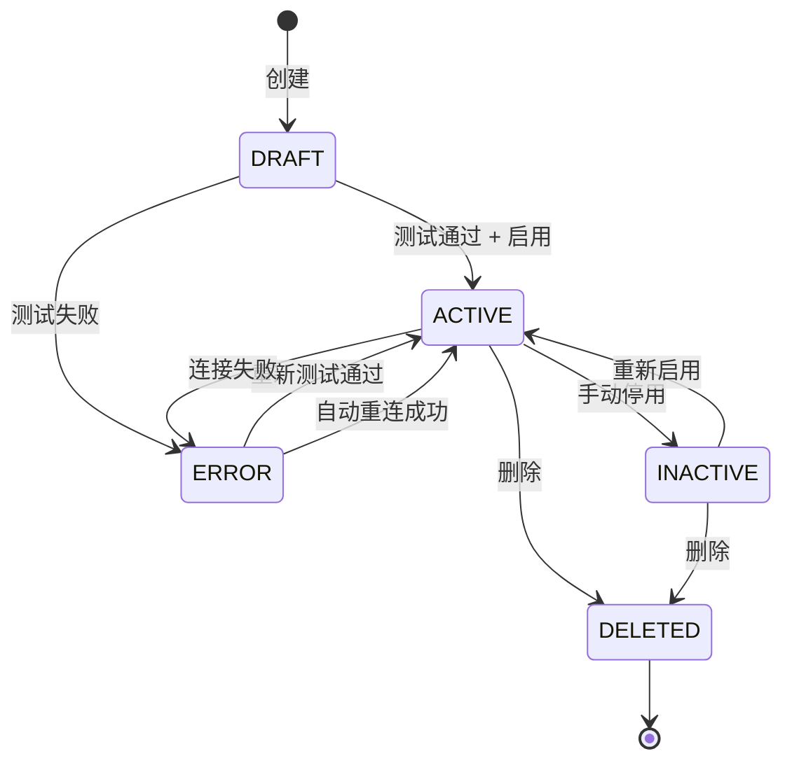

**状态转移规则**:
- DRAFT → ACTIVE：连接测试通过 + 用户手动启用
- ACTIVE → ERROR：连续 3 次查询失败
- ERROR → ACTIVE：自动重试成功（5 分钟间隔）
- ACTIVE → INACTIVE：用户主动停用

#### 9.3.2 CDCTask 状态机

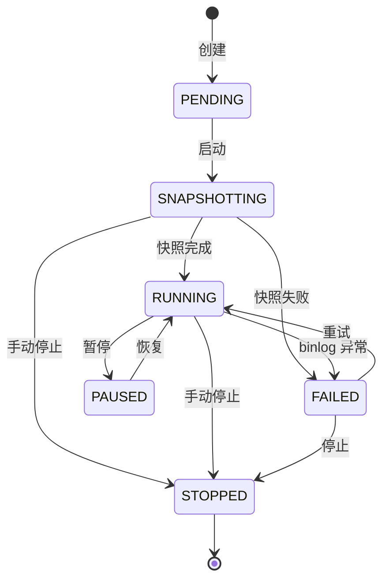

**关键转移**:
- PENDING → SNAPSHOTTING：部署 Debezium Connector
- SNAPSHOTTING → RUNNING：全量快照完成，进入 binlog 监听
- 任何状态 → STOPPED：用户主动停止
- FAILED → RUNNING：自动重试

#### 9.3.3 ETLTask 状态机

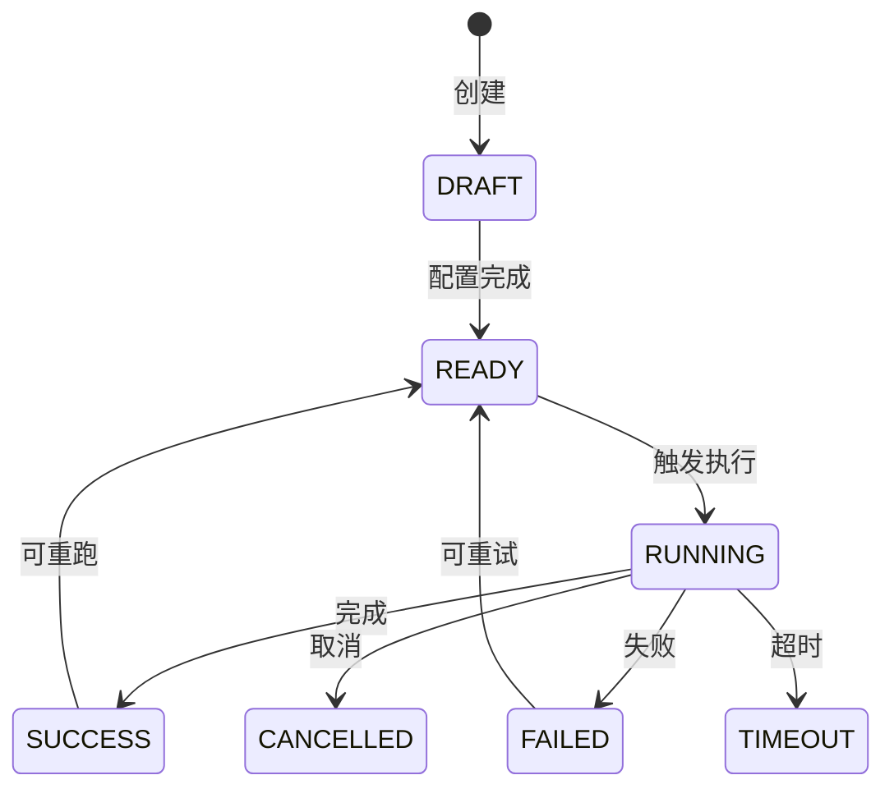

**状态转移规则**:
- DRAFT → READY：所有必填字段完整
- READY → RUNNING：触发（手动/调度/事件）
- RUNNING → SUCCESS：所有步骤完成
- RUNNING → FAILED：步骤失败且重试已用尽
- RUNNING → TIMEOUT：超过 timeout 配置
- FAILED → READY：用户手动重置后可重试

#### 9.3.4 SchedulerTask 状态机

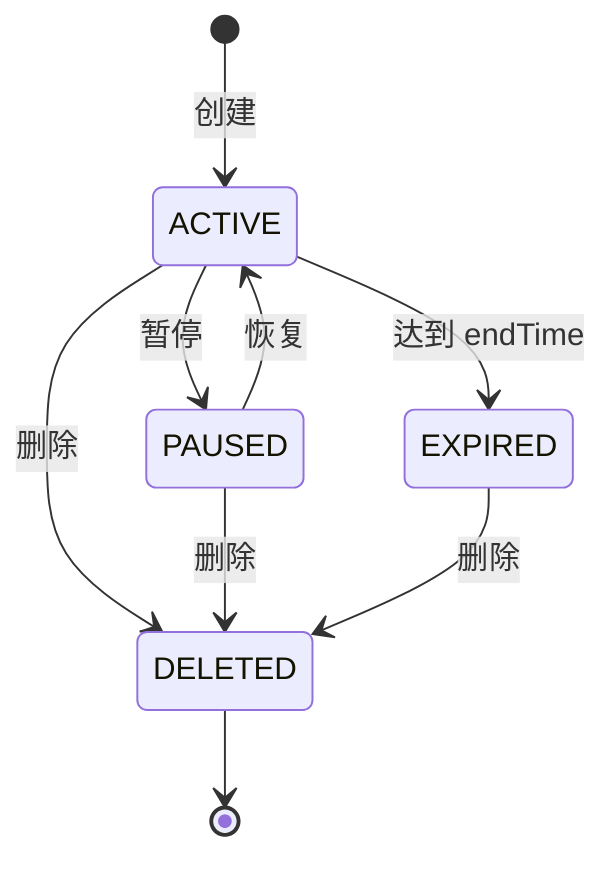

#### 9.3.5 SchedulerExecution 状态机

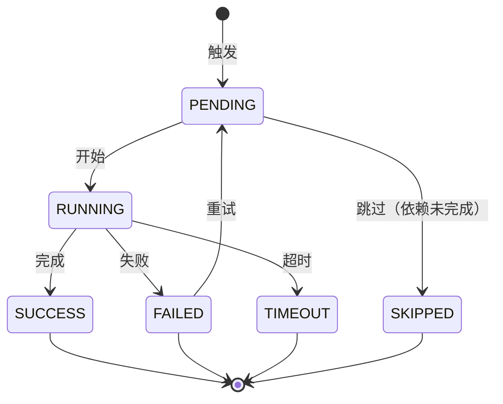

#### 9.3.6 Metric 状态机

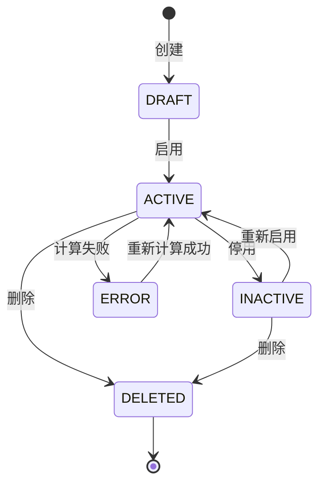

---

### 9.4 业务规则

#### 9.4.1 大数据源
- **BR-BD-001**: 大数据源编码在同一租户内唯一
- **BR-BD-002**: HIVE/HBASE 必须配置 Metastore
- **BR-BD-003**: KAFKA/PULSAR 必须配置 SASL 或 ACL
- **BR-BD-004**: HDFS 必须配置 Namenode + HA
- **BR-BD-005**: SSL 启用时证书必须有效
- **BR-BD-006**: 连接池大小不超过 100
- **BR-BD-007**: 删除数据源需先停用且无活跃查询

#### 9.4.2 CDC 任务
- **BR-CDC-001**: 源数据库必须启用 binlog/WAL
- **BR-CDC-002**: 源数据库用户必须具备 REPLICATION 权限
- **BR-CDC-003**: 目标存储必须先创建
- **BR-CDC-004**: 单任务最多 1000 张表
- **BR-CDC-005**: 表过滤条件必须是有效 SQL WHERE
- **BR-CDC-006**: SNAPSHOT_ONLY 不需要 binlog
- **BR-CDC-007**: 失败重试最多 3 次，超过后任务失败

#### 9.4.3 ETL 任务
- **BR-ETL-001**: 至少 1 个源 + 1 个目标
- **BR-ETL-002**: SQL_TRANSFORM 模式必须有 transformSql
- **BR-ETL-003**: BATCH/STREAMING 模式必须有 transformDag
- **BR-ETL-004**: 增量字段必须存在于源表
- **BR-ETL-005**: 目标表必须存在或任务自动创建
- **BR-ETL-006**: UPSERT 模式必须配置主键
- **BR-ETL-007**: 优先级 URGENT 抢占其他任务
- **BR-ETL-008**: 资源超限自动排队

#### 9.4.4 调度
- **BR-SCH-001**: Cron 必须是合法 5 段或 6 段
- **BR-SCH-002**: DEPENDENCY 不能形成环
- **BR-SCH-003**: 同一任务同时只能运行 1 个实例（除非配置并发）
- **BR-SCH-004**: 失败重试最多 3 次（可在任务级覆盖）
- **BR-SCH-005**: 调度永久失败 5 次后自动 PAUSED
- **BR-SCH-006**: endTime 过期后状态自动 EXPIRED

#### 9.4.5 指标
- **BR-MET-001**: 指标编码在同一租户内唯一
- **BR-MET-002**: 计算字段必须是有效 SQL
- **BR-MET-003**: REALTIME 指标必须使用 Redis
- **BR-MET-004**: 阈值告警去重（5 分钟内不重复）
- **BR-MET-005**: 派生指标依赖至少 1 个原子指标
- **BR-MET-006**: 复合指标最多 5 个组成指标
- **BR-MET-007**: 指标删除会清除所有历史值

---

### 9.5 权限矩阵

| 资源 | 平台超管 | 租户超管 | 数据工程师 | 数据分析师 | 业务方 | 访客 |
|---|---|---|---|---|---|---|
| BigDataSource | CRUD | CRUD | CRUD | R | R | R |
| CDCTask | CRUD | CRUD | CRUD | R | R | R |
| ETLTask | CRUD | CRUD | CRUD | CRU | R | R |
| ETLStep | CRUD | CRUD | CRUD | R | R | R |
| SchedulerTask | CRUD | CRUD | CRUD | CRU | R | R |
| SchedulerExecution | R | R | R | R | R | R |
| Metric | CRUD | CRUD | CRUD | CRU | R | R |
| MetricValue | R | R | R | R | R | R |
| MetricLineage | R | R | R | R | R | R |

---

### 9.6 性能要求

| 操作 | P99 | QPS | 备注 |
|---|---|---|---|
| 大数据源列表 | < 300ms | 100 | |
| 大数据源测试连接 | < 5s | 10 | 真实连接 |
| CDC 启动 | < 30s | 5 | 部署 Connector |
| CDC 同步延迟 | < 1s | - | 实时场景 |
| ETL 启动 | < 10s | 10 | 提交集群 |
| ETL 完成时间 | < 1h | 5 | 批量场景 |
| 调度触发 | < 1s | 50 | |
| 指标计算 | < 30s | 20 | 含 SQL 执行 |
| 指标血缘查询 | < 500ms | 100 | |
| 指标值查询 | < 200ms | 500 | 含时间过滤 |

---

### 9.7 安全要求

- 所有大数据源连接信息加密存储（AES-256）
- CDC 凭据使用专用 Vault
- ETL SQL 注入防护（参数化）
- 调度任务执行隔离（沙箱/K8s namespace）
- 指标计算权限校验
- 死信队列加密
- 审计日志：所有 CRUD + 执行
- 资源配额：每租户最多 N 个并发 ETL/CDC

---

### 9.8 API 端点速查（详细 schema 见 API-CONTRACT §3.11）

| 端点 | 方法 | 优先级 |
|---|---|---|
| /v1/data/sources | GET/POST | P0 |
| /v1/data/sources/{id} | GET/PUT/DELETE | P0 |
| /v1/data/sources/{id}/test | POST | P0 |
| /v1/data/sources/{id}/schema | GET | P1 |
| /v1/data/cdc-tasks | GET/POST | P0 |
| /v1/data/cdc-tasks/{id} | GET/PUT/DELETE | P0 |
| /v1/data/cdc-tasks/{id}/pause | POST | P1 |
| /v1/data/cdc-tasks/{id}/resume | POST | P1 |
| /v1/etl/tasks | GET/POST | P0 |
| /v1/etl/tasks/{id} | GET/PUT/DELETE | P0 |
| /v1/etl/tasks/{id}/run | POST | P0 |
| /v1/etl/tasks/{id}/stop | POST | P1 |
| /v1/etl/tasks/{id}/status | GET | P0 |
| /v1/etl/tasks/{id}/logs | GET | P1 |
| /v1/scheduler/tasks | GET/POST | P0 |
| /v1/scheduler/tasks/{id} | GET/PUT/DELETE | P0 |
| /v1/scheduler/tasks/{id}/trigger | POST | P0 |
| /v1/scheduler/tasks/{id}/pause | POST | P1 |
| /v1/scheduler/dag | GET | P1 |
| /v1/metrics | GET/POST | P0 |
| /v1/metrics/{id} | GET/PUT/DELETE | P0 |
| /v1/metrics/{id}/values | GET | P0 |
| /v1/metrics/{id}/lineage | GET | P1 |
| /v1/metrics/{id}/compute | POST | P1 |
