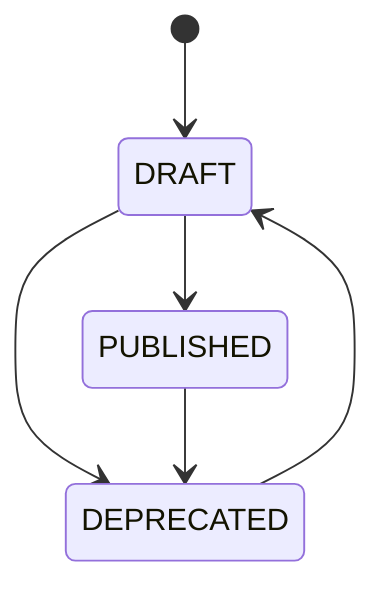
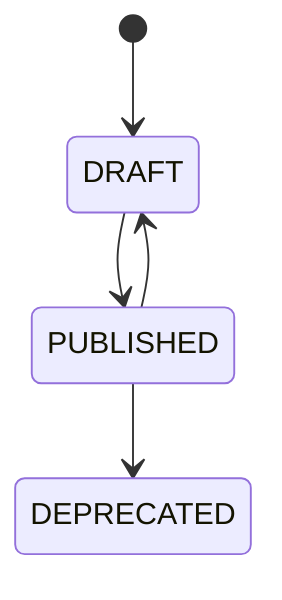
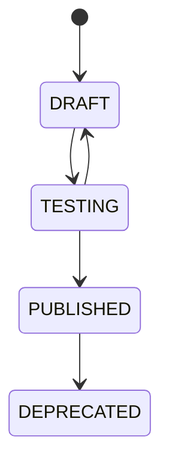
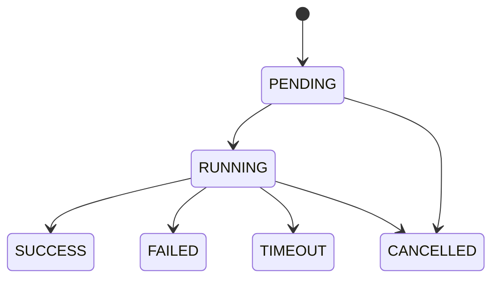
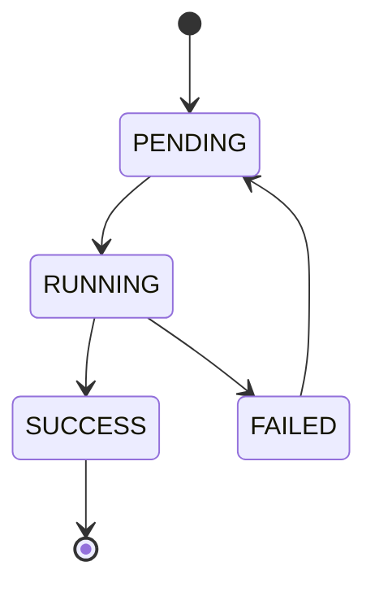
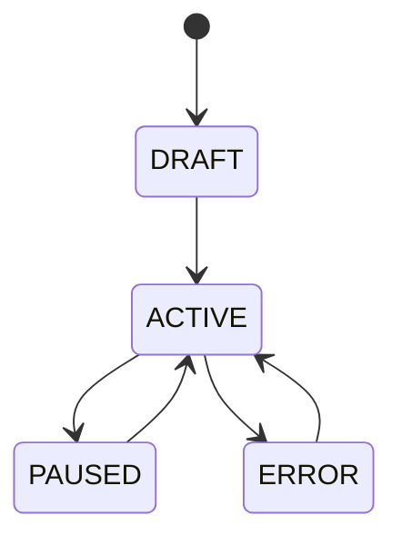

# APP-ONTSTUDIO 详细规范

> **版本**: v1.0 | **日期**: 2026-07-27
> **模块**: APP-ONTSTUDIO（本体论引擎）
> **关联主 PRD**: PRD-APP-ONTSTUDIO-本体论引擎_v2.2-20260727.md
> **关联 API 契约**: API-CONTRACT §3.11
> **归属后端服务**: TECH-ONT（核心）+ TECH-EA（映射）+ TECH-RULE（规则）+ TECH-ACTION（Action）

---

## 1. 完整数据模型

### 1.1 实体清单

| # | 实体 | 中文 | 表名 | 关联 |
|---|---|---|---|---|
| 1 | Concept | 概念 | ont_concept | N:1 -> parent, 1:N -> Attribute |
| 2 | Attribute | 属性 | ont_attribute | N:1 -> Concept |
| 3 | Entity | 实体（实例）| ont_entity | N:1 -> Concept, 1:N -> AttributeValue |
| 4 | AttributeValue | 属性值 | ont_attribute_value | N:1 -> Entity, N:1 -> Attribute |
| 5 | RelationType | 关系类型 | ont_relation_type | 1:N -> RelationInstance |
| 6 | RelationInstance | 关系实例 | ont_relation_instance | N:M -> Entity |
| 7 | Rule | 业务规则 | rule_rule | 1:1 -> Condition/Action |
| 8 | RuleSet | 规则集 | rule_rule_set | 1:N -> Rule |
| 9 | RuleExecution | 规则执行 | rule_execution | N:1 -> Rule |
| 10 | DecisionTable | 决策表 | rule_decision_table | 1:N -> DecisionRule |
| 11 | DataSource | 数据源 | data_source | - |
| 12 | DataMapping | 数据映射 | data_mapping | N:1 -> DataSource, N:1 -> Entity |
| 13 | SyncTask | 同步任务 | data_sync_task | N:1 -> DataSource |
| 14 | DataQualityRule | 数据质量规则 | data_quality_rule | - |
| 15 | DataLineage | 数据血缘 | data_lineage | N:1 -> Entity |
| 16 | Action | 动作 | action_action | 1:N -> ActionStep |
| 17 | ActionStep | 动作步骤 | action_step | N:1 -> Action |
| 18 | Orchestration | 服务编排 | action_orchestration | 1:N -> ActionStep |
| 19 | TriggerRule | 触发规则 | action_trigger_rule | - |
| 20 | Execution | 执行 | action_execution | N:1 -> Orchestration/Action |
| 21 | Version | 版本 | ont_version | N:1 -> Concept/Entity/Rule |

### 1.2 Concept（概念）
| 字段 | 类型 | 必填 | 说明 |
|---|---|---|---|
| conceptId | string(36) | 是 | 主键 |
| tenantId | string(36) | 是 | 租户 |
| name | string(64) | 是 | 概念名 |
| code | string(64) | 是 | 编码（系统内唯一）|
| parentId | string(36) | 否 | 父概念（层级树）|
| namespace | string(128) | 是 | 命名空间（默认 http://metaplatform.io/ont/）|
| description | string(2048) | 否 | 描述 |
| synonyms | string[] | 否 | 同义词（用于自然语言匹配）|
| attributes | json | 否 | 属性定义 [{name, type, required, defaultValue, constraints}] |
| metadata | json | 否 | 扩展元数据 |
| isAbstract | boolean | 是 | false | 是否抽象 |
| status | enum | 是 | DRAFT | DRAFT/PUBLISHED/DEPRECATED |
| version | string(16) | 是 | 1.0.0 | 版本号 |
| tags | string[] | 否 | 标签 |
| createdBy/At/updatedBy/At/isDeleted | - | - | 通用 |

### 1.3 Entity（实体）
| 字段 | 类型 | 必填 | 说明 |
|---|---|---|---|
| entityId | string(36) | 是 | 主键 |
| conceptId | string(36) | 是 | 所属概念 |
| name | string(128) | 是 | 实体名 |
| code | string(64) | 是 | 编码 |
| attributeValues | json | 是 | 属性值 {attrName: value} |
| status | enum | 是 | ACTIVE | ACTIVE/INACTIVE/DEPRECATED |
| sourceSystem | string(64) | 否 | 来源系统 |
| sourceId | string(128) | 否 | 来源 ID |
| confidence | decimal(3,2) | 否 | 置信度（0-1）|
| createdBy/At/updatedBy/At | - | - | - | 通用 |

### 1.4 RelationType（关系类型）
| 字段 | 类型 | 必填 | 说明 |
|---|---|---|---|
| relationTypeId | string(36) | 是 | 主键 |
| name | string(64) | 是 | 关系名（如 "isPartOf"）|
| code | string(64) | 是 | 编码 |
| fromConceptId | string(36) | 是 | 源概念 |
| toConceptId | string(36) | 是 | 目标概念 |
| cardinality | enum | 是 | ONE_TO_ONE/ONE_TO_MANY/MANY_TO_ONE/MANY_TO_MANY |
| direction | enum | 是 | UNIDIRECTIONAL/BIDIRECTIONAL |
| description | string(1024) | 否 | 描述 |
| inverseName | string(64) | 否 | 反向关系名 |
| properties | json | 否 | 关系属性 |

### 1.5 RelationInstance（关系实例）
| 字段 | 类型 | 必填 | 说明 |
|---|---|---|---|
| relationInstanceId | string(36) | 是 | 主键 |
| relationTypeId | string(36) | 是 | 关系类型 |
| fromEntityId | string(36) | 是 | 源实体 |
| toEntityId | string(36) | 是 | 目标实体 |
| properties | json | 否 | 关系属性 |
| weight | decimal(5,2) | 否 | 权重 |
| status | enum | 是 | ACTIVE | ACTIVE/INACTIVE |
| createdAt | timestamp | 是 | - |

### 1.6 Rule（业务规则）
| 字段 | 类型 | 必填 | 说明 |
|---|---|---|---|
| ruleId | string(36) | 是 | 主键 |
| ruleSetId | string(36) | 否 | 规则集 |
| name | string(128) | 是 | 规则名 |
| code | string(64) | 是 | 编码 |
| description | string(2048) | 是 | 描述 |
| priority | integer | 是 | 0 | 优先级 |
| condition | text | 是 | 条件（DSL）|
| action | text | 是 | 动作（DSL）|
| type | enum | 是 | WHEN/IF/THEN/ELSE |
| scope | json | 否 | 适用范围 |
| enabled | boolean | 是 | true | 启用 |
| version | string(16) | 是 | 1.0.0 | 版本 |

### 1.7 Action（动作）
| 字段 | 类型 | 必填 | 说明 |
|---|---|---|---|
| actionId | string(36) | 是 | 主键 |
| name | string(64) | 是 | 动作名 |
| code | string(64) | 是 | 编码 |
| description | string(1024) | 是 | 描述 |
| inputSchema | json | 是 | 输入参数 |
| outputSchema | json | 否 | 输出参数 |
| steps | json | 是 | 步骤列表 |
| compensation | text | 否 | 补偿事务 |
| timeout | integer | 是 | 60 | 超时（秒）|
| retryPolicy | json | 否 | 重试策略 |
| tags | string[] | 否 | 标签 |
| version | string(16) | 是 | 1.0.0 | 版本 |
| callCount | integer | 是 | 0 | 调用次数 |

### 1.8 Orchestration（服务编排）
| 字段 | 类型 | 必填 | 说明 |
|---|---|---|---|
| orchestrationId | string(36) | 是 | 主键 |
| name | string(128) | 是 | 编排名 |
| description | string(2048) | 否 | - |
| bpmnXml | text | 否 | BPMN 2.0 XML |
| nodes | json | 是 | 节点列表 |
| edges | json | 是 | 边列表 |
| triggers | json | 否 | 触发配置 |
| compensation | text | 否 | 补偿 |
| status | enum | 是 | DRAFT | DRAFT/PUBLISHED/DEPRECATED |
| version | string(16) | 是 | 1.0.0 | 版本 |

### 1.9 DataSource（数据源）
| 字段 | 类型 | 必填 | 说明 |
|---|---|---|---|
| dataSourceId | string(36) | 是 | 主键 |
| name | string(64) | 是 | 数据源名 |
| type | enum | 是 | MYSQL/POSTGRES/ORACLE/SQLSERVER/MONGODB/KAFKA/REST_API/CSV/JSON |
| connectionConfig | json | 是 | 连接配置（加密）|
| status | enum | 是 | ACTIVE | ACTIVE/INACTIVE/ERROR |
| lastTestedAt | timestamp | 否 | - |
| lastErrorMessage | string(1024) | 否 | - |

### 1.10 DataMapping（数据映射）
| 字段 | 类型 | 必填 | 说明 |
|---|---|---|---|
| mappingId | string(36) | 是 | 主键 |
| dataSourceId | string(36) | 是 | 数据源 |
| targetEntityId | string(36) | 是 | 目标实体 |
| fieldMappings | json | 是 | 字段映射 [{sourceField, targetAttribute, transform}] |
| schedule | string | 否 | Cron 表达式 |
| enabled | boolean | 是 | true | 启用 |
| lastSyncAt | timestamp | 否 | - |
| lastErrorMessage | string(1024) | 否 | - |

### 1.11 Execution（执行）
| 字段 | 类型 | 必填 | 说明 |
|---|---|---|---|
| executionId | string(36) | 是 | 主键 |
| orchestrationId | string(36) | 否 | 编排 |
| actionId | string(36) | 否 | 动作 |
| input | json | 是 | 输入 |
| output | json | 否 | 输出 |
| status | enum | 是 | PENDING | PENDING/RUNNING/SUCCESS/FAILED/TIMEOUT/CANCELLED |
| currentStepId | string(36) | 否 | 当前步骤 |
| stepExecutions | json | 否 | 步骤执行详情 |
| errorMessage | string(2048) | 否 | - |
| startedAt | timestamp | 否 | - |
| finishedAt | timestamp | 否 | - |
| duration | integer | 否 | 耗时（毫秒）|
| triggeredBy | enum | 是 | MANUAL | MANUAL/SCHEDULE/TRIGGER/API |

---

## 2. 完整 API Schema

### 2.1 关键端点
| # | 方法 | 路径 | 优先级 |
|---|---|---|---|
| 1 | GET | /v1/ont/concepts/search | P0 |
| 2 | POST | /v1/ea/ontology-mappings/rules | P0 |
| 3 | GET | /v1/ea/ontology-mappings/changes | P1 |
| 4 | GET | /v1/copilot/ontology/concepts/search | P0（已重映射到 /v1/ont/）|
| 5 | GET | /v1/copilot/ontology/graph/query | P0 |

### 2.2 GET /v1/ont/concepts/search
**Query**:
```json
{
  "type": "object",
  "properties": {
    "keyword": { "type": "string", "maxLength": 64 },
    "namespace": { "type": "string" },
    "status": { "type": "string", "enum": ["DRAFT", "PUBLISHED", "DEPRECATED"] },
    "parentId": { "type": "string" },
    "tags": { "type": "array", "items": { "type": "string" } },
    "includeAttributes": { "type": "boolean", "default": false },
    "page": { "type": "integer", "minimum": 1, "default": 1 },
    "size": { "type": "integer", "minimum": 1, "maximum": 100, "default": 20 }
  }
}
```

### 2.3 POST /v1/ea/ontology-mappings/rules
**Request Body**:
```json
{
  "type": "object",
  "properties": {
    "sourceType": { "type": "string", "enum": ["CAPABILITY", "APPLICATION", "DATA_ENTITY"] },
    "sourceId": { "type": "string" },
    "targetType": { "type": "string", "enum": ["CONCEPT", "ENTITY"] },
    "targetId": { "type": "string" },
    "mappingRule": { "type": "string" },
    "confidence": { "type": "number", "minimum": 0, "maximum": 1 }
  },
  "required": ["sourceType", "sourceId", "targetType", "targetId"]
}
```

---

## 3. 状态机

### 3.1 Concept 状态机


### 3.2 Action 状态机


### 3.3 Orchestration 状态机


### 3.4 Execution 状态机


### 3.5 SyncTask 状态机


### 3.6 DataMapping 状态机


---

## 4. 业务规则

### 4.1 概念管理
- **BR-001**: 概念编码在命名空间内唯一
- **BR-002**: 抽象概念不能有实体
- **BR-003**: 删除概念需先迁移子概念
- **BR-004**: 已发布概念不能直接修改（需创建新版本）
- **BR-005**: 同义词用于自然语言匹配

### 4.2 实体管理
- **BR-010**: 实体必须属于已发布概念
- **BR-011**: 必填属性必须有值
- **BR-012**: 实体可跨数据源合并（按 sourceId 去重）
- **BR-013**: 删除实体为软删除

### 4.3 关系管理
- **BR-020**: 关系类型必须指定源/目标概念
- **BR-021**: 多对多关系需双向
- **BR-022**: 关系实例必须基于已发布关系类型
- **BR-023**: 自引用关系允许（如 父子）

### 4.4 规则
- **BR-030**: 规则必须有 condition 和 action
- **BR-031**: 规则集内规则按 priority 排序
- **BR-032**: 规则执行失败可重试
- **BR-033**: 决策表规则有命中/未命中/默认三档
- **BR-034**: 规则版本一旦发布不可修改

### 4.5 Action
- **BR-040**: Action 必须定义 inputSchema
- **BR-041**: 补偿事务（compensation）可选
- **BR-042**: 超时后自动取消
- **BR-043**: 重试策略可配置（次数、间隔、退避）

### 4.6 编排
- **BR-050**: 编排必须有开始/结束节点
- **BR-051**: 触发规则可手动/定时/事件
- **BR-052**: 并行节点需同步条件
- **BR-053**: 失败处理（停止/继续/重试）
- **BR-054**: 长时间运行支持 Saga 模式

### 4.7 数据源
- **BR-060**: 连接信息加密存储
- **BR-061**: 定期测试连接（默认 1 小时）
- **BR-062**: 数据源类型白名单
- **BR-063**: 凭证定期轮换

### 4.8 数据同步
- **BR-070**: 同步前先备份
- **BR-071**: 同步失败自动重试 3 次
- **BR-072**: 同步日志保留 90 天
- **BR-073**: 同步可暂停/恢复

---

## 5. 权限矩阵

| 资源 | 平台超管 | 租户超管 | 本体专家 | 数据工程师 | 开发者 | 业务方 |
|---|---|---|---|---|---|---|
| Concept | CRUD | CRUD | CRUD | R | R | R |
| Attribute | CRUD | CRUD | CRUD | R | R | R |
| Entity | CRUD | CRUD | CRUD | CRUD | R | R |
| AttributeValue | CRUD | CRUD | CRUD | CRUD | R | R |
| RelationType | CRUD | CRUD | CRUD | R | R | R |
| RelationInstance | CRUD | CRUD | CRUD | CRUD | R | R |
| Rule | CRUD | CRUD | CRUD | R | R | R |
| RuleSet | CRUD | CRUD | CRUD | R | R | R |
| DecisionTable | CRUD | CRUD | CRUD | R | R | R |
| DataSource | CRUD | CRUD | R | CRUD | R | R |
| DataMapping | CRUD | CRUD | R | CRUD | R | R |
| SyncTask | CRUD | CRUD | R | CRUD | R | R |
| DataQualityRule | CRUD | CRUD | R | CRUD | R | R |
| DataLineage | R | R | R | R | R | R |
| Action | CRUD | CRUD | CRUD | R | CRU | R |
| ActionStep | CRUD | CRUD | CRUD | R | CRU | R |
| Orchestration | CRUD | CRUD | CRUD | R | CRU | R |
| TriggerRule | CRUD | CRUD | CRUD | R | CRU | R |
| Execution | R | R | R | R | R | R |
| Version | R | R | R | R | R | R |

---

## 6. 性能要求

| 操作 | P99 | QPS |
|---|---|---|
| 概念搜索 | < 200ms | 200 |
| 实体查询 | < 200ms | 300 |
| 关系查询 | < 300ms | 200 |
| 规则执行（简单）| < 50ms | 1000 |
| 规则执行（复杂）| < 500ms | 100 |
| Action 执行 | < 5s | 200 |
| 编排执行 | < 30s | 50 |
| 数据同步（1000 行）| < 60s | 10 |
| 图谱查询 | < 1s | 50 |

---

## 7. 安全要求

- 概念命名空间隔离
- 实体数据脱敏
- 关系访问审计
- 规则执行可追溯
- Action 输入/输出加密
- 编排执行 traceId 记录
- 数据源连接信息加密
- 数据传输 TLS 1.3
