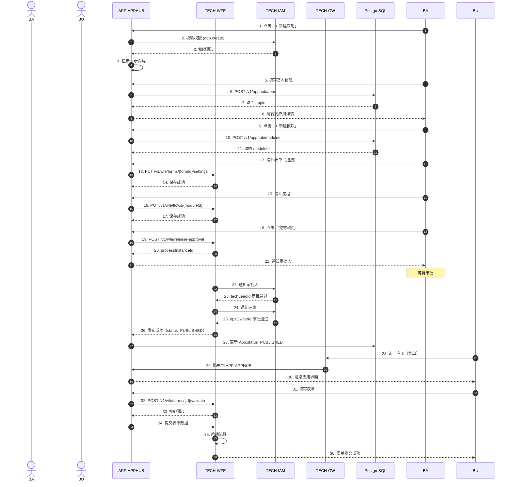
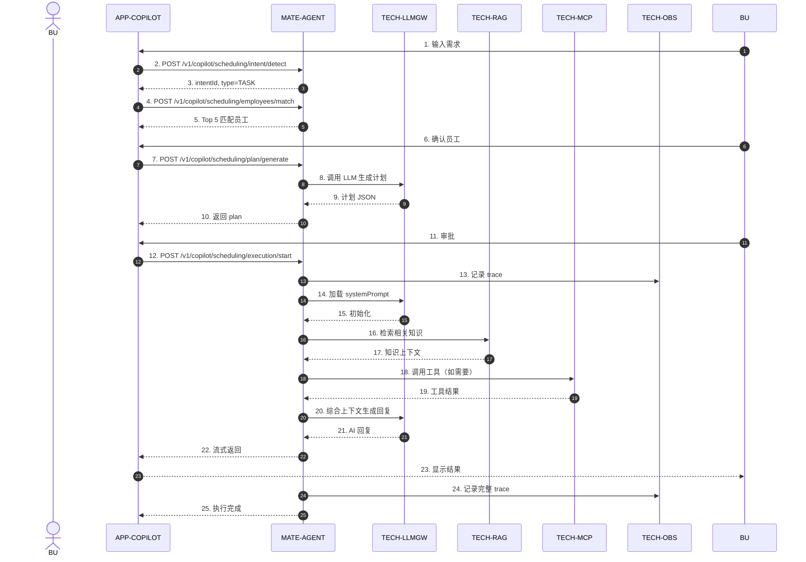
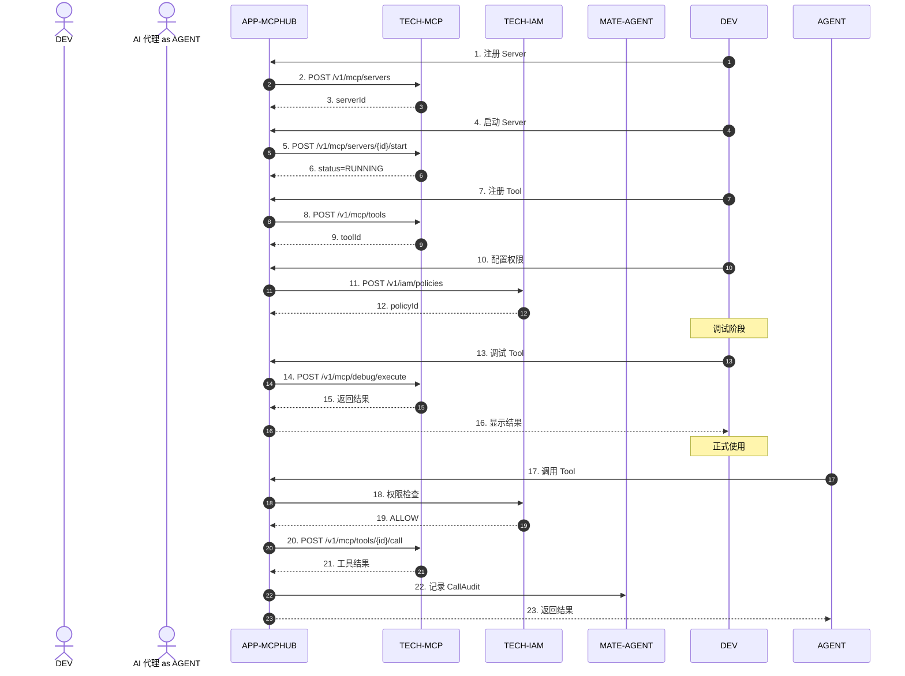
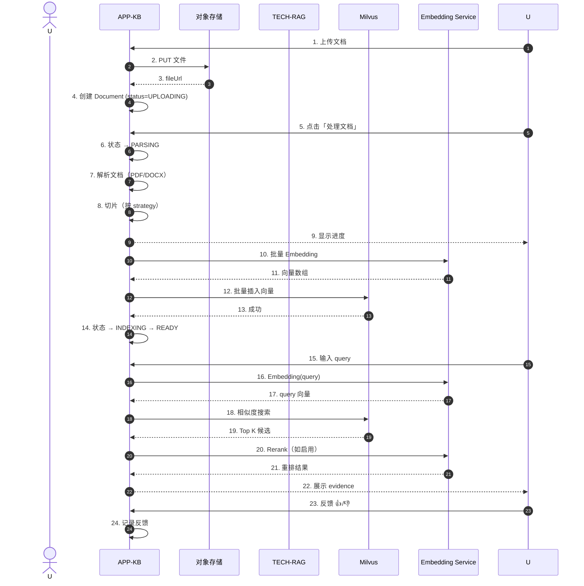
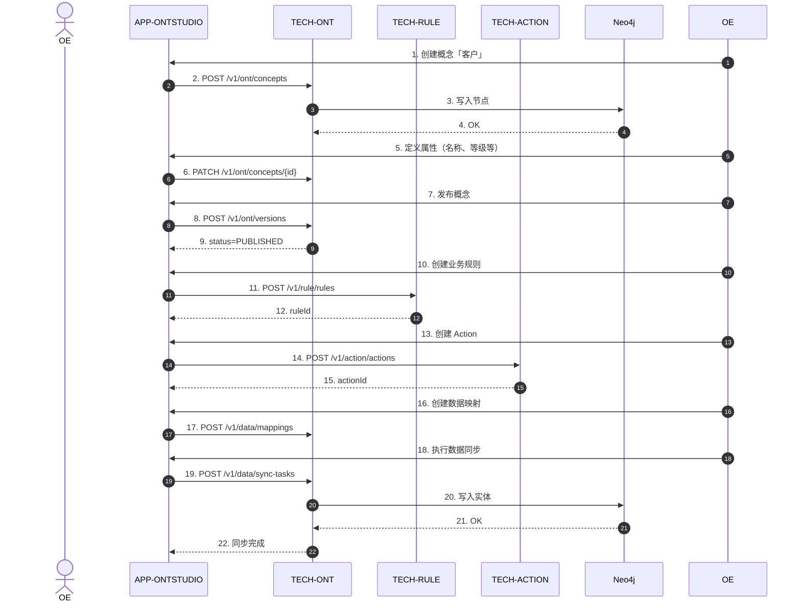
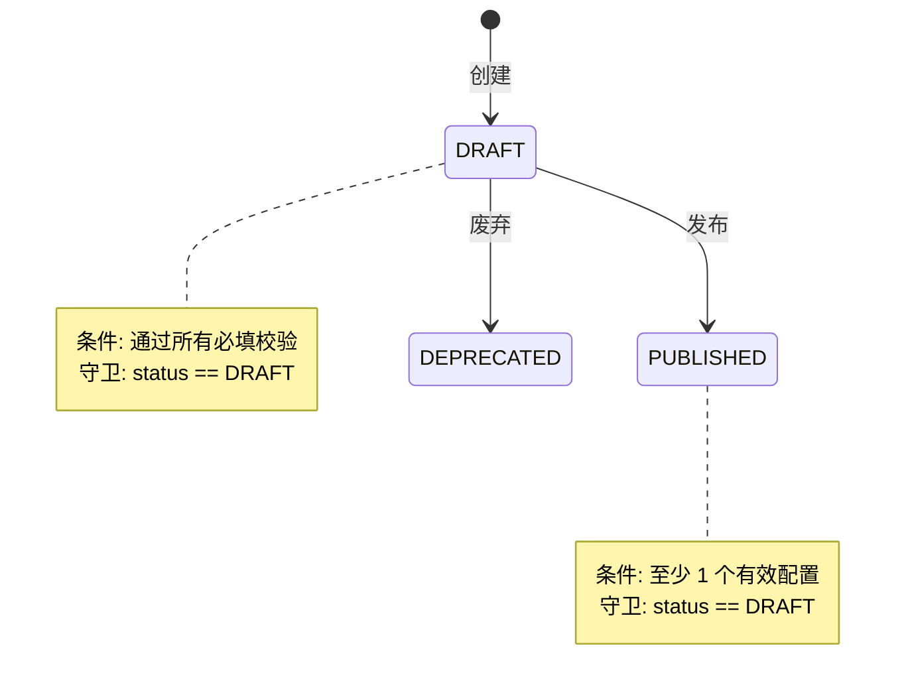

# P2 通用规范（端到端流程、异常场景、状态机条件）

> **版本**: v1.0 | **日期**: 2026-07-27
> **触发决策**: P0+P1 完成后补全 P2 通用规范
> **适用**: 全部 8 大模块
> **关联文档**: 各模块主 PRD、详细规范

---

## 1. 端到端关键业务流程图

> **格式**: mermaid sequenceDiagram
> **目的**: 跨多个服务/前端页面/数据库的完整业务流，作为开发对齐依据

### 1.1 流程 A：创建应用到业务用户使用



### 1.2 流程 B：创建数字员工并执行任务



### 1.3 流程 C：MCP 工具注册到被使用



### 1.4 流程 D：知识库文档上传到检索



### 1.5 流程 E：本体论管理（概念 → 实体 → 规则 → Action）



---

## 2. 异常场景处理统一规范

> **目的**: 统一 8 大模块的异常处理规范，避免每个模块各自为政

### 2.1 异常分类

| 类别 | HTTP | code | 处理 | 用户提示 |
|---|---|---|---|---|
| **网络异常** | 0 | - | 自动重试 3 次 + 提示 | "网络异常，请检查连接" |
| **超时** | 408/504 | 4001 | 提示用户重试 | "请求超时，请稍后重试" |
| **客户端错误** | 400 | 1001-1999 | 表单回填 + 红框 | "参数错误：[字段名] [错误]" |
| **认证失败** | 401 | 3001 | 跳转登录 | "登录已过期" |
| **权限不足** | 403 | 3002 | 隐藏功能 | "您没有权限" |
| **资源不存在** | 404 | 2001 | 返回列表 | "资源不存在" |
| **资源冲突** | 409 | 2002 | 弹窗确认 | "资源冲突，是否覆盖？" |
| **业务规则违反** | 200 | 5001-5999 | toast 提示 | 业务自定义 message |
| **服务器错误** | 500 | 5000 | 记录 traceId | "服务异常，请联系管理员" |

### 2.2 错误处理 SOP

#### 前端处理
```typescript
// 统一 axios 拦截器（已实现在 packages/shared/src/api/client.ts）
apiClient.interceptors.response.use(
  (resp) => {
    const data = resp.data;
    if (data && 'code' in data) {
      if (data.code === 0) return resp; // 成功
      // 业务错误
      const err = new BizError(data.code, data.message, data.traceId);
      switch (data.code) {
        case 3001: // 无权限
          message.error('您没有权限访问此资源');
          break;
        case 1001: // 参数错误
          message.error('参数错误：' + data.message);
          break;
        default:
          message.error(data.message || '操作失败');
      }
      throw err;
    }
    return resp;
  },
  (error) => {
    // HTTP 错误
    if (error.response?.status === 401) {
      // 401 自动 refresh + 重放
    }
    throw error;
  }
);
```

#### 后端处理（Java Spring Boot）
```java
@RestControllerAdvice
public class GlobalExceptionHandler {
    
    @ExceptionHandler(BizException.class)
    public ResponseEntity<ApiResponse<?>> handleBiz(BizException e) {
        return ResponseEntity.ok(ApiResponse.error(e.getCode(), e.getMessage()));
    }
    
    @ExceptionHandler(ValidationException.class)
    public ResponseEntity<ApiResponse<?>> handleValidation(ValidationException e) {
        return ResponseEntity.ok(ApiResponse.error(1001, e.getMessage()));
    }
    
    @ExceptionHandler(AccessDeniedException.class)
    public ResponseEntity<ApiResponse<?>> handleAccess(AccessDeniedException e) {
        return ResponseEntity.ok(ApiResponse.error(3001, "您没有权限"));
    }
    
    @ExceptionHandler(Exception.class)
    public ResponseEntity<ApiResponse<?>> handleAll(Exception e, HttpServletRequest req) {
        String traceId = (String) req.getAttribute("traceId");
        log.error("Internal error [traceId={}]", traceId, e);
        return ResponseEntity.ok(ApiResponse.error(5000, "服务异常"));
    }
}
```

### 2.3 重试策略

| 场景 | 重试次数 | 重试间隔 | 备注 |
|---|---|---|---|
| 网络异常 | 3 | 指数退避（1s/2s/4s） | 仅 GET 请求 |
| 401 token 过期 | 1 | 立即 | refresh + 重放 |
| 5xx 服务器错误 | 2 | 固定 2s | 仅幂等请求 |
| 4xx 客户端错误 | 0 | - | 直接报错 |
| 业务错误（code != 0） | 0 | - | 直接展示 |

### 2.4 离线场景

| 场景 | 处理 |
|---|---|
| 弱网/无网 | 显示「当前离线，部分功能不可用」Banner |
| 关键操作离线 | 阻止操作 + 提示「请联网后重试」 |
| 非关键操作离线 | 加入本地队列，恢复后自动同步 |
| 数据展示离线 | 展示本地缓存（如有） + 标注「可能已过期」 |

### 2.5 错误信息规范

| 原则 | 示例 |
|---|---|
| 简洁清晰 | ❌ "Internal Server Error" → ✅ "服务异常，请稍后重试" |
| 可操作 | ❌ "失败" → ✅ "上传失败：文件超过 10MB 限制" |
| 有上下文 | ❌ "权限不足" → ✅ "您没有删除应用的权限，请联系管理员" |
| 中文优先 | 所有用户可见字符串用中文 |
| 含 traceId | toast 显示时附 traceId 便于工单追踪 |

---

## 3. 状态机转移条件详细化

> **目的**: 补充各模块主 PRD 中状态机 mermaid 图的转移条件、守卫、业务规则

### 3.1 通用状态机模式



### 3.2 跨模块状态机一致性

| 实体 | 创建 | 草稿 | 发布 | 停用 | 废弃 | 删除 |
|---|---|---|---|---|---|---|
| App | DRAFT | DRAFT | PUBLISHED | OFFLINE | - | DELETE |
| Module | DRAFT | DRAFT | PUBLISHED | OFFLINE | - | DELETE |
| AppVersion | DRAFT | DRAFT | PUBLISHED | OFFLINE | ROLLBACK | DELETE |
| ReleaseRecord | - | PENDING_APPROVAL | PUBLISHED | - | REJECTED | - |
| Employee | DRAFT | DRAFT | ACTIVE | INACTIVE | ARCHIVED | CLONING |
| Task | - | PENDING | RUNNING | PAUSED | SUCCESS/FAILED | - |
| KnowledgeBase | DRAFT | DRAFT | ENABLED | DISABLED | ARCHIVED | - |
| Document | UPLOADING | PARSING | CHUNKING/EMBEDDING/INDEXING | READY | FAILED | - |
| Concept | DRAFT | DRAFT | PUBLISHED | DEPRECATED | - | - |
| McpServer | DRAFT | DRAFT | REGISTERED/RUNNING | DISABLED/STOPPED | DEPRECATED | - |
| McpTool | DRAFT | DRAFT | PUBLISHED | DEPRECATED | - | - |
| Template | DRAFT | DRAFT | PUBLISHED | REJECTED | - | - |

### 3.3 状态转移守卫（Guard）规则

#### App 状态转移
```
DRAFT → PUBLISHED:
  - 守卫: app.versions[any(status=PUBLISHED)] exists
  - 守卫: app.modules not empty
  - 守卫: app.techLeadId, opsOwnerId not null

PUBLISHED → OFFLINE:
  - 守卫: 所有 PUBLISHED 版本自动级联 OFFLINE
  - 守卫: 所有运行中的发布审批自动结束

OFFLINE → DRAFT:
  - 守卫: 当前用户是 app.owner
  - 守卫: 没有进行中的审批流程
```

#### Employee 状态转移
```
DRAFT → ACTIVE:
  - 守卫: systemPrompt not null and length 1-10000
  - 守卫: modelConfig.model 已存在且 enabled
  - 守卫: 至少 1 个 capability 或 knowledgeBase

ACTIVE → INACTIVE:
  - 守卫: 没有 RUNNING 中的 task
  - 守卫: 没有 PENDING 的协作

INACTIVE → ACTIVE:
  - 守卫: 所有之前的配置仍然有效

ACTIVE → CLONING:
  - 守卫: 触发克隆操作时自动进入
  - 守卫: 不能并发克隆

CLONING → ACTIVE:
  - 守卫: 克隆完成后自动恢复
  - 守卫: 最多 5 分钟
```

#### KnowledgeBase 状态转移
```
DRAFT → ENABLED:
  - 守卫: kb.embeddingModel configured
  - 守卫: 至少 1 个 document processed

ENABLED → DISABLED:
  - 守卫: 现有检索立即失败
  - 守卫: 不影响历史数据

DISABLED → ARCHIVED:
  - 守卫: 必须先禁用
  - 守卫: 30 天后自动清理
```

#### McpServer 状态转移
```
DRAFT → REGISTERED:
  - 守卫: 必填字段全部填写
  - 守卫: 健康检查 URL 可达（如配置）

REGISTERED → STARTING:
  - 守卫: 调用 start 端点

STARTING → RUNNING:
  - 守卫: 启动后 30 秒内 health check 成功
  - 失败 → ERROR

RUNNING → STOPPED:
  - 守卫: 主动调用 stop

RUNNING → ERROR:
  - 守卫: 连续 3 次 health check 失败
  - 守卫: 启动后超时无响应

ERROR → RUNNING:
  - 守卫: 自动重试成功
```

---

## 4. 性能与可扩展性规范

### 4.1 性能基线（已对齐各模块详细规范 §6）

| 操作类型 | P50 | P99 | QPS |
|---|---|---|---|
| 简单查询（单条/列表 ≤ 20） | < 50ms | < 200ms | 500 |
| 复杂查询（搜索/聚合） | < 200ms | < 500ms | 200 |
| 写操作 | < 200ms | < 500ms | 100 |
| LLM 调用 | < 2s | < 5s | 50 |
| 长任务（> 1min） | 异步 | - | 10 |

### 4.2 容量规划

| 指标 | 当前 | 1 年目标 | 3 年目标 |
|---|---|---|---|
| 用户数 | 100 | 10,000 | 100,000 |
| 应用数 | 50 | 5,000 | 50,000 |
| 员工数 | 20 | 2,000 | 20,000 |
| 知识库文档数 | 10,000 | 1,000,000 | 10,000,000 |
| 日活 | 50 | 5,000 | 50,000 |
| 月活 | 200 | 50,000 | 500,000 |

### 4.3 扩展性策略

| 维度 | 策略 |
|---|---|
| **读扩展** | 读写分离 + Redis 缓存 + CDN |
| **写扩展** | 分库分表（按 tenantId） |
| **搜索扩展** | Elasticsearch 集群（向量+全文） |
| **任务扩展** | Kafka 队列 + 多消费者 |
| **LLM 扩展** | 多模型 + 负载均衡 + 缓存 |
| **存储扩展** | 对象存储（MinIO/S3） |

---

## 5. 安全与合规规范

### 5.1 数据安全

| 数据类型 | 存储加密 | 传输加密 | 脱敏显示 |
|---|---|---|---|
| 密码 | bcrypt(cost=10) | TLS 1.3 | 全隐藏 |
| API Key | bcrypt + prefix 索引 | TLS 1.3 | 仅前缀（mkp_xxxx****） |
| 个人敏感信息（PII） | AES-256 | TLS 1.3 | 部分（手机号中间四位） |
| 业务敏感信息 | AES-256 | TLS 1.3 | 按角色 |
| LLM prompt 内容 | 加密存储 | TLS 1.3 | 仅 owner |
| 审计日志 | 不可变存储（append-only） | TLS 1.3 | 不脱敏 |

### 5.2 访问控制（RBAC + ABAC）

| 维度 | 策略 |
|---|---|
| 角色（RBAC） | 平台超管 / 租户超管 / 部门管理员 / 业务用户 / 访客 |
| 属性（ABAC） | 租户 / 组织 / 用户属性 / 时间 / IP / 设备 |
| 资源 | 8 大模块的所有实体 |
| 操作 | CRUD + 特殊操作（审批/发布/调试等） |

### 5.3 审计日志

| 记录 | 保留期 | 存储 |
|---|---|---|
| 登录日志 | 90 天 | PostgreSQL |
| 操作日志（CRUD） | 1 年 | PostgreSQL + S3 |
| 敏感操作（审批/发布/删除） | 3 年 | S3 冷存储 |
| API Token 使用 | 90 天 | PostgreSQL |
| LLM 调用 | 90 天 | PostgreSQL + S3 |
| 异常错误 | 30 天 | Elasticsearch |

### 5.4 合规要求

| 合规项 | 实施 |
|---|---|
| **GDPR** | 数据导出 / 删除 / 匿名化 |
| **等保 2.0** | 三级等保：身份鉴别、访问控制、安全审计 |
| **数据出境** | 海外部署需单独评估 |
| **隐私政策** | 用户协议 + Cookie 政策 |

---

## 6. 国际化（i18n）规范

### 6.1 支持语言

| 语言 | 优先级 | 完成度 |
|---|---|---|
| zh-CN（简体中文） | P0 | 100% |
| en-US（英语） | P0 | 80% |
| zh-TW（繁体） | P1 | 50% |
| ja-JP（日语） | P2 | 0% |

### 6.2 i18n Key 命名规范

```
{module}.{domain}.{feature}.{key}

示例:
- apphub.app.create.success
- apphub.app.create.error.duplicate
- dashboard.notification.mark_all_read.success
- copilot.chat.send.error.network
```

### 6.3 文案规范

| 原则 | 示例 |
|---|---|
| 简洁 | ❌ "请输入您的用户名和密码以登录" → ✅ "登录" |
| 一致 | 用「删除」不用「移除/清除」 |
| 上下文 | 表单按钮用「创建」「保存」不用「确定」 |
| 主动语态 | "创建应用" 不用 "应用被创建" |
| 不翻译占位符 | `{count} 项已删除` 而不是 `已删除 {count} 项` |

---

## 7. 可观测性规范

### 7.1 监控指标

| 指标类型 | 指标 | 用途 |
|---|---|---|
| 业务指标 | DAU/MAU/应用创建数/任务执行数/检索次数 | 业务健康度 |
| 系统指标 | CPU/内存/磁盘/网络/DB 连接池 | 系统健康度 |
| 应用指标 | QPS/P99/错误率/慢请求 | 应用健康度 |
| 业务告警 | 配额耗尽/审批超时/同步失败 | 业务异常 |

### 7.2 日志规范

#### 格式
```json
{
  "timestamp": "2026-07-27T10:00:00.000Z",
  "level": "INFO",
  "traceId": "a1b2c3d4e5f67890",
  "userId": "uuid",
  "tenantId": "uuid",
  "module": "apphub",
  "action": "create_app",
  "resourceId": "uuid",
  "message": "App created successfully",
  "duration": 234,
  "metadata": {}
}
```

#### 级别
- ERROR：必须有人介入
- WARN：潜在问题，自动恢复失败
- INFO：关键业务事件
- DEBUG：调试信息（生产环境关闭）

### 7.3 Trace 链路

| 字段 | 说明 |
|---|---|
| traceId | 整个调用链路的唯一 ID |
| spanId | 当前 span ID |
| parentSpanId | 父 span ID |
| service | 服务名 |
| operation | 操作名（如"查询员工"） |
| startTime/endTime | 起始/结束时间 |
| tags | 自定义标签 |
| logs | 关键事件 |

---

## 8. 部署与运维规范

### 8.1 部署架构

```
                  [CDN/WAF]
                      ↓
                  [TECH-GW 网关]
                      ↓
        ┌─────────────┼─────────────┐
        ↓             ↓             ↓
   [APP-前端]    [APP-后端集群]   [AI 服务]
        ↓             ↓             ↓
                  [PostgreSQL 主从]
                  [Redis 集群]
                  [Kafka 集群]
                  [Milvus / Neo4j]
                  [对象存储 MinIO]
                  [TECH-OBS 监控]
                  [TECH-MSG 消息]
```

### 8.2 灰度发布

| 阶段 | 范围 | 持续时间 | 验证 |
|---|---|---|---|
| 内部灰度 | 5% 用户（内部员工） | 1 天 | 错误率 < 0.1% |
| 金丝雀 | 10% 用户 | 2 天 | P99 < 500ms |
| 半量 | 50% 用户 | 3 天 | 业务指标正常 |
| 全量 | 100% 用户 | - | 持续监控 |

### 8.3 灾备

| 场景 | RTO | RPO | 措施 |
|---|---|---|---|
| 单实例故障 | < 1 min | 0 | K8s 自动重启 |
| 服务故障 | < 5 min | 0 | 集群 + LB |
| 数据库故障 | < 30 min | < 5 min | 主从切换 |
| 机房故障 | < 1 hour | < 15 min | 多 AZ 部署 |
| 灾难 | < 4 hour | < 1 hour | 跨地域备份 |

---

## 9. 后续工作建议

1. **每模块 P2 深化**：基于本规范在各主 PRD 中补全
2. **跨模块一致性检查**：用脚本验证所有状态机、错误码、性能指标的一致性
3. **CI 校验**：在 CI 中加入规范校验（如 OpenAPI lint、Spectral）
4. **定期 Review**：每季度回顾一次规范有效性
