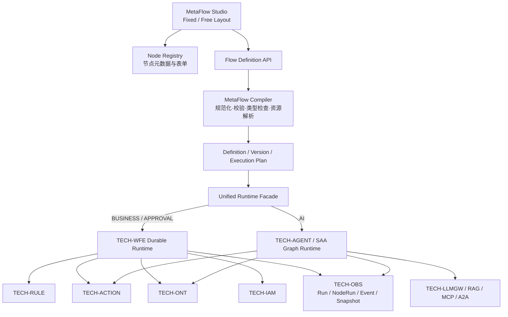
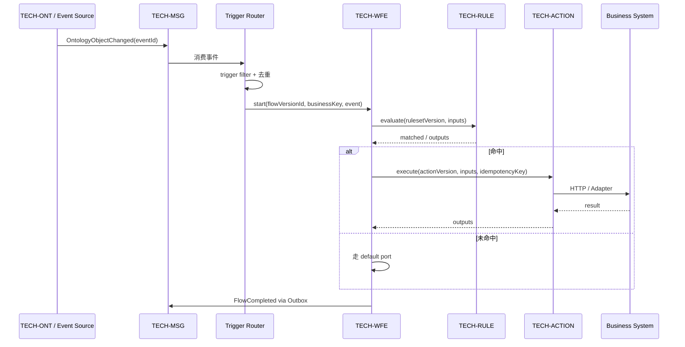
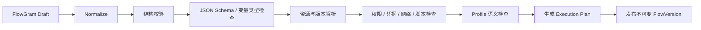

# MetaPlatform 三类流程编排实现方案（基于 FlowGram.AI）

> 日期：2026-07-25  
> 状态：架构探索 / 建议方案  
> FlowGram.AI 研究基线：[`5afd287`](https://github.com/bytedance/flowgram.ai/commit/5afd287a989ac71d5ae9625cc4e0e015744b23f1)（2026-07-07）  
> 本地依赖基线：`@flowgram.ai/* 1.0.12`

## 1. 结论

FlowGram.AI 适合承担 MetaPlatform 的**统一编排设计器、节点表单、变量作用域、流程 Schema 和调试展示层**，但不适合直接作为生产级统一执行引擎。

建议采用“**一个 Studio、一套 Canonical DSL、两个运行时、一个统一观测模型**”的架构：

- **一个 Studio**：统一 `MetaFlow Studio`，按三种 Profile 提供不同布局、节点库、属性面板和发布策略。
- **一套 Canonical DSL**：持久化与 FlowGram 兼容的图结构，但将布局信息和可执行语义分离。
- **两个运行时**：
  - `TECH-WFE`：业务自动化与审批的持久化、长事务、等待/恢复运行时。
  - `TECH-AGENT + Spring AI Alibaba Graph`：AI 协作 DAG、LLM、RAG、Agent、MCP/Action 的流式运行时。
- **一个统一观测模型**：三类实例都输出统一的 `FlowRun / NodeRun / Event / Snapshot`，前端使用同一套调试、回放和审计界面。

不要做以下两种极端设计：

1. 不要把 FlowGram 的 JS Runtime 直接当成企业工作流引擎；它目前主要是 AI 工作流示例运行时。
2. 不要强行让一个执行器同时处理审批长事务、业务事件自动化和低延迟 AI DAG；三者对等待、持久化、并发和流式输出的要求不同。

## 2. FlowGram.AI 能提供什么

FlowGram 官方明确将自身定位为工作流开发框架和工具集，而不是开箱即用的完整工作流平台。核心能力包括：

| 能力 | 可复用程度 | MetaPlatform 用法 |
|---|---:|---|
| Fixed Layout | 高 | 审批、规则驱动业务流程、可读性优先的结构化流程 |
| Free Layout | 高 | AI 协作、工具链、复杂数据流、n8n/Dify 风格自由编排 |
| Node Registry / Materials | 高 | MetaPlatform 节点插件协议和节点市场 |
| Form Engine | 高 | 节点配置、联动、校验、副作用、错误展示 |
| Variable Engine | 高（设计态） | 变量选择器、作用域、类型推断、引用检查 |
| Workflow Schema | 高 | Canonical DSL 的图结构基础 |
| Runtime JS | 中低（生产） | 参考实现、浏览器测试运行、语义一致性测试，不作为持久化生产引擎 |
| Export / History / Minimap / Shortcuts | 高 | 设计器通用功能 |

### 2.1 官方 Workflow Schema

官方运行时 Schema 的核心是：

```ts
interface WorkflowSchema {
  nodes: WorkflowNodeSchema[];
  edges: WorkflowEdgeSchema[];
}

interface WorkflowNodeSchema {
  id: string;
  type: string;
  meta: { position: { x: number; y: number } };
  data: {
    title?: string;
    inputsValues?: Record<string, FlowValue>;
    inputs?: JsonSchema;
    outputs?: JsonSchema;
    [key: string]: unknown;
  };
  blocks?: WorkflowNodeSchema[];
  edges?: WorkflowEdgeSchema[];
}
```

`FlowValue` 支持 `constant / ref / expression / template`；输入输出声明使用 JSON Schema。这套模型很适合作为 MetaPlatform DSL 的基础。

### 2.2 官方 JS Runtime 的实现方式

官方 `@flowgram.ai/runtime-js` 采用：

- `WorkflowApplication → Engine → Context → Executor` 分层；
- Document 将节点、边、端口扁平化为运行时对象；
- 节点完成后通过边寻找后继节点；
- 分支通过输出端口选择；
- 多后继通过 `Promise.all` 并行；
- Context 内含变量、状态、快照、消息、报告、IO 和状态中心；
- 内置 Start、End、LLM、Condition、Loop、HTTP、Code、Break、Continue 等执行器；
- Code 节点使用 QuickJS WASM，设置内存、栈和执行超时。

这些设计值得复用到 Java 侧的运行时抽象和观测模型中。

### 2.3 为什么不能直接作为生产运行时

当前官方 JS Runtime 有以下边界：

- `WorkflowApplication.tasks` 是进程内 `Map`，服务重启后任务丢失；
- 没有审批、人机协同、消息等待、定时器持久化与恢复；
- 没有数据库 checkpoint、集群领取、租约、幂等键；
- 没有 Saga 补偿、死信、人工重试、版本迁移；
- 执行模型以单次内存 DAG 运行为主；
- Node Server 主要是 tRPC 包装的示例服务；
- LLM 节点直接携带 API Key/Host，不符合 MetaPlatform 必须经 `TECH-LLMGW` 的约束。

因此它可以作为“语义参考 + 本地测试运行器”，不能替代 `TECH-WFE` 或 `TECH-AGENT`。

## 3. MetaPlatform 当前基线与缺口

### 3.1 已有基础

当前仓库已有较好的分层基础：

- 前端 `@mate/shared/flow` 已封装 FlowGram fixed-layout、主题、背景、导出、快捷键、对齐线和节点注册。
- 已定义 `bpmn / agent / business` 三种模式及节点库。
- `TECH-WFE` 已有流程定义、实例、任务、历史、活动日志、变量、Outbox 和基础状态机。
- `TECH-ACTION` 已有 Action 定义、输入输出 JSON Schema、本体绑定、版本和同步 HTTP 执行。
- `TECH-RULE` 已支持规则条件与 `TRIGGER_WORKFLOW / CALL_ACTION`。
- `TECH-AGENT` 已确定 Spring AI Alibaba Agent/Graph 为 AI 编排底座。

### 3.2 当前关键断点

| 断点 | 当前表现 | 后果 |
|---|---|---|
| 编辑器仍是 fixed-only | `FlowDesigner` 三种 mode 最终都渲染同一个 fixed editor | AI 模式并不是真正的自由编排 |
| APPHUB 重复造画布 | `FlowDesignerPage.tsx` 仍使用手写 SVG | 与共享 FlowGram 节点、表单、变量能力割裂 |
| API 不一致 | 前端调用 `/v1/wfe/flows/*`，后端只有 `/api/v1/wfe/process-definitions/*` | 保存、校验、测试、发布无法形成真实闭环 |
| 发布契约不一致 | 后端 `DeployRequest` 强制要求 `bpmnXml`，没有直接接收 FlowGram/MetaFlow DSL | FlowGram 被迫绕回 BPMN，信息损失 |
| 后端图模型丢边 | `FlowDocument` 只有 `nodes`，没有 `edges` | free-layout DAG 无法正确执行 |
| 推进逻辑按扁平顺序 | `findNextSibling` 基于 DFS 展开顺序 | 分支、汇聚、并行语义不可靠 |
| 条件引擎过于简化 | WFE 只把布尔值或字符串 `true` 判为真 | 无法实现实际业务条件 |
| 未知节点默认跳过 | `DefaultNodeExecutor` 记录后继续 | 发布后可能静默漏执行关键动作 |
| 无持久 Token/Wait | 只有任务和变量，没有执行令牌、等待订阅、定时器 job | 无法可靠恢复并行、延时、事件等待 |
| 缺 Action/AI 执行器 | WFE 只有 approval/if/switch/loop 等基础执行器 | 三类场景尚未打通 TECH-ACTION / TECH-AGENT |
| 定义快照重复 | 每个实例用变量 `__flowgram_json__` 保存完整定义 | 存储冗余，版本与实例快照边界不清晰 |
| 缺运行时专项测试 | WFE 测试未覆盖图执行器核心 | 分支、循环、恢复和并发容易回归 |

### 3.3 需要立即纠正的方向

1. **FlowGram JSON 应是一等公民**，BPMN 仅作为导入/导出格式，不应是发布必经路径。
2. **语义图必须包含 edges/ports**，不能依赖节点数组顺序。
3. **未知节点发布时必须失败**，运行时不得默认跳过。
4. **设计稿、草稿、发布版本、执行计划必须分层**，不能让画布 JSON 直接驱动生产执行。

## 4. 目标架构



### 4.1 “统一”与“不统一”的边界

统一：

- 设计器壳、节点插件协议；
- Canonical DSL；
- 定义、版本、发布、权限 API；
- 输入输出 JSON Schema 与 FlowValue；
- Run/NodeRun/Event/Snapshot 观测模型；
- Action、Ontology、IAM 等资源引用格式；
- 校验与安全策略。

不统一：

- 审批和业务长流程的持久化调度由 WFE 负责；
- AI DAG 的模型流式调用、Agent 状态图由 TECH-AGENT 负责；
- 三种 Profile 的节点库和发布校验规则不同。

## 5. Canonical DSL：MetaFlow Definition

建议在 FlowGram Schema 外增加 MetaPlatform 元数据，并把视觉布局和执行语义分开：

```json
{
  "apiVersion": "meta.platform/flow/v1",
  "kind": "BUSINESS_AUTOMATION",
  "metadata": {
    "key": "order-risk-control",
    "name": "订单风控与履约",
    "tenantId": "t-001",
    "revision": 12
  },
  "spec": {
    "trigger": {
      "type": "ONTOLOGY_EVENT",
      "resource": { "type": "ONTOLOGY_OBJECT", "id": "Order" },
      "event": "updated",
      "filter": "event.after.status == 'PAID'"
    },
    "inputs": { "type": "object", "properties": {} },
    "outputs": { "type": "object", "properties": {} },
    "nodes": [
      {
        "id": "risk-rule",
        "type": "meta.rule.evaluate",
        "data": {
          "title": "判断订单风险",
          "resource": { "type": "RULESET", "id": "order-risk", "version": 3 },
          "inputsValues": {
            "order": { "type": "ref", "content": ["trigger", "order"] }
          },
          "inputs": { "type": "object", "properties": {} },
          "outputs": { "type": "object", "properties": {} }
        }
      }
    ],
    "edges": [],
    "policies": {
      "timeoutSeconds": 3600,
      "maxConcurrency": 20,
      "failureMode": "FAIL_FAST"
    }
  },
  "layout": {
    "engine": "flowgram-fixed",
    "nodes": { "risk-rule": { "x": 320, "y": 160 } },
    "viewport": { "zoom": 1 }
  }
}
```

### 5.1 必须保留的字段

- `kind`：`BUSINESS_AUTOMATION | AI_WORKFLOW | APPROVAL_PROCESS`。
- `nodes/edges/ports`：执行语义必须显式依赖边和端口。
- `inputsValues`：沿用 FlowGram 的 constant/ref/expression/template。
- `inputs/outputs`：JSON Schema，发布时做静态类型检查。
- `resource`：引用 Action、Ruleset、Ontology、Agent、Prompt、Knowledge Base 等已发布资源和版本。
- `layout`：仅供编辑器使用，编译执行计划时剥离。
- `policies`：超时、重试、并发、错误策略、补偿和幂等。

### 5.2 资源引用不能只存 code

统一采用：

```json
{
  "type": "ACTION",
  "id": "uuid-or-stable-key",
  "version": 7,
  "bindingMode": "PINNED"
}
```

发布时默认 `PINNED` 到不可变版本，避免 Action、规则或 Agent 更新后改变历史流程行为。只有明确的 `LATEST_COMPATIBLE` 才在运行时解析最新版。

## 6. 场景一：业务流程与本体 Action 编排

### 6.1 目标场景

- 当订单、客户、设备等本体对象发生事件时触发流程；
- 当规则命中时启动流程或调用 Action；
- 编排一个或多个本体 Action；
- 支持条件、并行、延时、重试、补偿和人工干预；
- 支持 Webhook、定时任务、消息和手工启动。

### 6.2 推荐布局

- 默认 **fixed-layout**：适合“触发 → 条件 → 动作 → 结果”的业务人员视角。
- 高级集成自动化可切换 **free-layout**，但仍编译到同一业务运行时计划。
- 布局不应决定运行时；`kind` 和编译目标才决定运行时。

### 6.3 节点集

触发器：

- `meta.trigger.manual`
- `meta.trigger.webhook`
- `meta.trigger.schedule`
- `meta.trigger.ontology-event`
- `meta.trigger.rule-hit`
- `meta.trigger.message`

控制流：

- `meta.condition`
- `meta.switch`
- `meta.parallel`
- `meta.join`
- `meta.loop`
- `meta.delay`
- `meta.wait-event`
- `meta.subflow`

业务能力：

- `meta.ontology.query`
- `meta.ontology.mutate`
- `meta.action.invoke`
- `meta.rule.evaluate`
- `meta.notify`
- `meta.http`（受网络策略约束）

可靠性：

- `meta.retry-boundary`
- `meta.compensation`
- `meta.error-handler`
- `meta.manual-intervention`

### 6.4 运行链路



### 6.5 Action 节点契约

每个 Action 节点必须包含：

- 固定的 `actionId + version`；
- input mapping 与 output mapping；
- timeout、retry、backoff；
- `idempotencyKeyExpression`；
- 可选 compensation Action；
- 调用身份（流程服务身份、发起人代理、指定服务账号）；
- 数据权限校验策略；
- 审计敏感字段脱敏配置。

`TECH-ACTION` 需要从“同步 HTTP 调用器”扩展为 Action SPI：HTTP、Ontology Mutation、MCP、消息、脚本/函数等实现统一 `ActionExecutor`。

## 7. 场景二：AI 协作编排

### 7.1 推荐布局与运行时

- 使用 **free-layout-editor**；
- 编译为 `TECH-AGENT` 内的 Spring AI Alibaba `StateGraph`；
- 短流程在 TECH-AGENT 内直接运行并 SSE 输出；
- 涉及小时/天级等待、审批或定时恢复时，由 WFE 作为外层 durable shell，AI Flow 作为一个可重试节点运行。

### 7.2 节点集

- `ai.input / ai.output`
- `ai.prompt`
- `ai.llm`
- `ai.structured-output`
- `ai.rag`
- `ai.ontology-context`
- `ai.action-tool`
- `ai.mcp-tool`
- `ai.agent`
- `ai.a2a-agent`
- `ai.router`
- `ai.condition`
- `ai.loop`
- `ai.map-reduce`
- `ai.memory.read / ai.memory.write`
- `ai.guardrail`
- `ai.human-review`
- `ai.subflow`

### 7.3 与 Dify/n8n 类产品相比需要补齐的产品能力

- 节点级 Run/Retry；
- 实时 token/stream 展示；
- Prompt、模型、工具调用输入输出检查器；
- 节点执行快照与从指定节点重放；
- 测试数据集与批量评估；
- 凭据中心，禁止 API Key 写入流程 JSON；
- 模型成本、Token、延迟预算；
- Guardrail 与敏感数据策略；
- Agent 循环最大步数、工具白名单和超时；
- 发布前 dry-run 与兼容性检查。

### 7.4 编译到 SAA Graph

```text
MetaFlow node ai.llm          -> SAA NodeAction(LLMGWClient)
MetaFlow node ai.rag          -> SAA NodeAction(RAGClient)
MetaFlow node ai.action-tool  -> SAA NodeAction(ActionClient)
MetaFlow node ai.agent        -> SubGraph / Agent Framework
MetaFlow conditional edge     -> ConditionalEdge
MetaFlow parallel branches    -> fan-out/fan-in state reducers
MetaFlow FlowValue refs       -> OverAllState key / scoped state
```

编译器必须生成稳定的 state key，避免直接使用可变标题。建议 key 采用 `nodeId.outputName`，与 FlowGram `ref: [nodeId, outputName]` 一致。

### 7.5 AI 与审批交叉

`ai.human-review` 不应在 TECH-AGENT 进程里阻塞线程：

1. TECH-AGENT 生成 interrupt/checkpoint；
2. 通过统一 Runtime Facade 请求 TECH-WFE 创建 human task；
3. Run 状态变为 `WAITING_HUMAN`；
4. 审批完成事件触发 TECH-AGENT 从 checkpoint 恢复。

## 8. 场景三：业务审批流程

### 8.1 推荐布局与运行时

- 使用 **fixed-layout-editor**；
- 编译到 TECH-WFE durable runtime；
- BPMN 2.0 作为可选导入/导出格式，不作为内部唯一真相源。

### 8.2 节点集

- 开始、结束、表单提交；
- 审批、办理、抄送、阅示；
- 条件、排他/并行/包容网关；
- 会签、或签、依次审批、多实例；
- 加签、减签、转交、委托；
- 撤回、驳回到指定节点、退回发起人；
- 定时器、超时升级、催办；
- Action 服务任务；
- 子流程、事件等待、异常结束。

### 8.3 审批人解析

审批人配置统一为 `AssigneePolicy`，而不是简单字符串：

```json
{
  "strategy": "ROLE",
  "resourceIds": ["finance-manager"],
  "scope": "APPLICANT_DEPARTMENT",
  "fallback": "ESCALATE_TO_ADMIN",
  "multiInstance": {
    "mode": "PARALLEL",
    "completion": "approvedCount / totalCount >= 0.67"
  }
}
```

解析器通过 `TECH-IAM` 获取用户、角色、部门、岗位、上级链，并将“解析时结果”写入任务快照，保证组织变化后历史审批可解释。

### 8.4 审批运行时要求

- 每个等待节点必须有持久 `wait_subscription`；
- 每次任务操作都带 expected version，避免重复审批；
- 会签使用 token/join counter，不能依赖数组顺序；
- 操作、评论、表单和审批人解析结果全部审计；
- 驳回/撤回是显式命令和状态转换，不是任意改表；
- 超时任务由持久 scheduler 领取并通过 Outbox 发事件；
- 表单定义和流程版本必须固定绑定。

## 9. 设计器实现

### 9.1 统一壳，三套 Profile

```ts
interface FlowProfile {
  kind: 'BUSINESS_AUTOMATION' | 'AI_WORKFLOW' | 'APPROVAL_PROCESS';
  layout: 'fixed' | 'free';
  nodeRegistries: FlowNodeRegistry[];
  formMaterials: Record<string, React.ComponentType>;
  validators: FlowValidator[];
  compilerTarget: 'WFE' | 'SAA_GRAPH';
}
```

建议组件结构：

```text
@mate/shared/flow
├── MetaFlowStudio.tsx
├── editors/
│   ├── FixedFlowEditor.tsx
│   └── FreeFlowEditor.tsx
├── profiles/
│   ├── approval-profile.ts
│   ├── business-profile.ts
│   └── ai-profile.ts
├── registry/
│   ├── node-manifest.ts
│   ├── node-renderers.tsx
│   └── node-forms.tsx
├── schema/
│   ├── metaflow-schema.ts
│   ├── flowgram-adapter.ts
│   └── migrations/
└── debug/
    ├── RunPanel.tsx
    ├── NodeInspector.tsx
    └── ReplayPanel.tsx
```

### 9.2 节点 Manifest

将画布注册、表单、执行类型和权限元数据放到同一 Manifest：

```ts
interface MetaNodeManifest {
  type: string;
  profile: FlowKind[];
  version: number;
  title: string;
  category: string;
  icon: React.ComponentType;
  renderer: React.ComponentType;
  formMeta: FormMeta;
  inputSchema: JsonSchema;
  outputSchema: JsonSchema;
  runtime: {
    target: 'WFE' | 'SAA_GRAPH';
    executorType: string;
  };
  capabilities: {
    canWait?: boolean;
    canRetry?: boolean;
    canStream?: boolean;
    hasSideEffects?: boolean;
  };
  requiredPermissions?: string[];
}
```

后端维护对应的 Node Type Catalog。发布时以后端 Catalog 为准，不能相信前端传来的 executor 配置。

### 9.3 APPHUB 收敛

`apps/apphub/src/pages/FlowDesignerPage.tsx` 的手写 SVG 应删除，改为 `MetaFlowStudio`。APPHUB 只保留：

- 模块上下文；
- 保存/发布/测试命令；
- Profile 选择；
- 业务属性扩展面板。

画布、节点拖拽、连线、历史、变量和导出全部下沉到共享包。

## 10. 编译与发布流水线



### 10.1 校验层次

1. **Schema**：字段格式、节点类型、唯一 ID。
2. **Graph**：Start/End、悬空边、不可达节点、非法环、端口兼容。
3. **Type**：上游输出 JSON Schema 与下游输入匹配。
4. **Resource**：Action/Rule/Agent/Form/Prompt 版本存在且已发布。
5. **Security**：权限、Secret 引用、网络域名、代码节点策略。
6. **Profile**：审批必须可结束；AI loop 有最大步数；副作用 Action 有幂等策略。
7. **Runtime**：目标运行时是否有对应 executor。

### 10.2 发布产物

发布时保存三个不可变对象：

- `source_document`：规范化后的 MetaFlow DSL；
- `layout_document`：FlowGram 布局和 UI 信息；
- `execution_plan`：面向 WFE 或 SAA Graph 的编译产物。

运行实例只引用 `flow_version_id`，不再给每个实例复制完整 FlowGram JSON。

## 11. Durable Runtime 数据模型

建议在现有 WFE 表基础上补齐：

| 表 | 用途 |
|---|---|
| `flow_definition` | 稳定逻辑身份、kind、owner、权限 |
| `flow_draft` | 可编辑草稿、revision、乐观锁 |
| `flow_version` | 不可变发布版本、source/layout/plan、hash |
| `flow_trigger` | 事件、规则、Webhook、Schedule 订阅 |
| `flow_instance` | 运行实例与业务键 |
| `flow_token` | 当前执行令牌、scope、join group、状态 |
| `flow_node_run` | 每次节点尝试、输入输出、状态、耗时、错误 |
| `flow_wait_subscription` | human/event/timer 等待条件和恢复键 |
| `flow_variable` | 运行变量或 checkpoint 引用 |
| `flow_job` | 定时器、重试、异步节点领取 |
| `flow_event` | append-only 运行事件/审计 |
| `human_task` | 审批任务及多实例信息 |
| `flow_outbox` | 事务消息 |

现有 `wfe_process_definition / instance / task / activity_log / process_variable / outbox` 可以迁移或复用，不需要推倒重来。

### 11.1 状态建议

Flow Instance：

```text
CREATED -> RUNNING -> WAITING -> RUNNING -> COMPLETED
                    |           |
                    +-> FAILED <-+
                    +-> CANCELED
```

Node Run：

```text
PENDING -> READY -> RUNNING -> SUCCEEDED
                    |  |
                    |  +-> WAITING -> RUNNING
                    +-> RETRY_WAIT -> READY
                    +-> FAILED / CANCELED / SKIPPED
```

## 12. 统一 API

不要继续按前端临时 `/flows/{moduleId}` 契约扩展。建议统一为：

```http
POST   /api/v1/flows
GET    /api/v1/flows/{flowId}
PUT    /api/v1/flows/{flowId}/draft
POST   /api/v1/flows/{flowId}/validate
POST   /api/v1/flows/{flowId}/test-runs
POST   /api/v1/flows/{flowId}/publish
GET    /api/v1/flows/{flowId}/versions

POST   /api/v1/flow-versions/{versionId}/instances
GET    /api/v1/flow-instances/{instanceId}
POST   /api/v1/flow-instances/{instanceId}/cancel
POST   /api/v1/flow-instances/{instanceId}/retry
GET    /api/v1/flow-instances/{instanceId}/events
GET    /api/v1/flow-instances/{instanceId}/stream

POST   /api/v1/human-tasks/{taskId}/complete
POST   /api/v1/human-tasks/{taskId}/reject
POST   /api/v1/human-tasks/{taskId}/transfer
```

`APPHUB moduleId` 是资源绑定，不应成为 Flow 的主键。可以在模块配置中保存 `flowId`。

## 13. 可靠性与安全基线

### 13.1 Exactly-once 的现实处理

跨服务无法简单保证 exactly-once，采用：

- at-least-once 消息；
- Inbox 去重 `eventId`；
- Action 幂等键：`instanceId:nodeId:attempt/businessKey`；
- 数据库状态迁移与 Outbox 同事务；
- NodeRun 乐观锁/租约，避免重复领取；
- 外部不可幂等动作必须配置查询确认或补偿动作。

### 13.2 表达式安全

当前 TECH-RULE 使用 `StandardEvaluationContext` 的 SpEL。面向低代码用户时不应开放完整 SpEL 能力。建议：

- Canonical DSL 声明 `expressionLanguage: META_CEL_V1`；
- 首选 CEL 或受限表达式 AST；
- 若短期继续 SpEL，改用只读 `SimpleEvaluationContext`、禁用类型/构造器/Bean/任意方法访问；
- 表达式发布时编译和静态校验；
- 不允许表达式直接读取 Secret。

### 13.3 凭据与代码

- LLM/API Key 只保存 Credential Reference；
- HTTP 节点经域名 allowlist、DNS 重绑定防护和出网代理；
- Code 节点默认仅 AI Profile 可用；
- 服务端不能直接执行浏览器传来的 JavaScript；
- 如需脚本，使用独立 sandbox worker，设置 CPU、内存、超时和网络权限；
- 敏感输入输出在 NodeRun 中按 Schema 标注脱敏。

## 14. 分阶段落地路线

### Phase 0：先统一契约（1 个迭代）

目标：让前端设计器与后端形成真实闭环。

- 定义 `MetaFlowDefinition v1` 和 JSON Schema；
- 新增统一 Definition/Draft/Validate/Publish API；
- `DeployRequest` 支持 MetaFlow DSL，BPMN 降为可选导入；
- APPHUB 删除手写 SVG，接入共享 Studio；
- 明确草稿、发布版本、运行实例三层；
- 未知节点 fail closed；
- 建立后端 Node Type Catalog。

### Phase 1：业务流程 MVP（1～2 个迭代）

- fixed-layout business profile；
- Manual/Webhook/Ontology Event/Rule Hit 触发器；
- Condition、Action、Rule、Ontology Query/Mutation、Notify、Delay；
- 补 `edges/ports/token/node_run/wait/job`；
- Outbox + Inbox + 幂等 + 重试；
- 运行详情与节点级日志。

首个验收流程：

```text
Order.paid -> 风控规则 -> [高风险] 冻结订单 Action + 通知
                          [低风险] 创建履约单 Action
```

### Phase 2：审批 MVP（1～2 个迭代）

- fixed-layout approval profile；
- 审批、条件、会签、Action、抄送、超时；
- IAM 审批人解析；
- 表单版本绑定；
- 待办、已办、撤回、驳回、转交；
- 审计和流程图运行态高亮。

首个验收流程：采购申请金额分级审批。

### Phase 3：AI Workflow MVP（2 个迭代）

- 真正接入 free-layout editor；
- Input/LLM/RAG/Action Tool/MCP/Condition/Loop/Output；
- MetaFlow → SAA StateGraph Compiler；
- SSE、快照、单节点重试、测试运行；
- Credential、Token/成本/时延观测；
- AI Flow 作为 WFE 节点调用。

首个验收流程：

```text
用户问题 -> 本体上下文 + RAG -> LLM Router -> Action/MCP -> LLM 总结 -> 输出
```

### Phase 4：高级能力

- 子流程、模板/市场、分组、自动布局；
- Saga 补偿、事件等待、流程迁移；
- AI 人工审核恢复；
- 批量评估与版本对比；
- 可视化回放、从节点重跑、运维控制台。

## 15. 验收指标

### 设计态

- 三种 Profile 共享 Studio，但节点库和布局正确隔离；
- 保存后刷新无损；
- 发布前能发现悬空边、不可达节点、类型不匹配和资源版本失效；
- 设计器 JSON 与后端 normalize 后 round-trip 无语义损失。

### 运行态

- 服务重启后等待中流程可恢复；
- 同一事件重复投递不会重复执行 Action；
- 并行分支只在全部必需 token 到达后汇聚；
- 每个 NodeRun 可查看输入、输出、耗时、错误和重试；
- 流程版本发布后不可变，历史实例可精确回放；
- 审批任务重复提交只成功一次；
- AI 流可以流式显示并统计模型成本。

### 测试基线

- 编译器 golden tests；
- Graph property tests（随机 DAG、分支、汇聚、循环边界）；
- 运行时重启恢复测试；
- Outbox/Inbox 重复消息测试；
- Action 幂等和超时重试测试；
- 审批会签并发测试；
- AI checkpoint/恢复与 SSE 断线重连测试。

## 16. 建议的近期技术决策

| 决策 | 建议 |
|---|---|
| FlowGram 定位 | 设计器和 DSL 基础，不是生产统一运行时 |
| 内部主格式 | MetaFlow DSL（FlowGram-compatible），不是 BPMN XML |
| BPMN | 仅审批场景的导入/导出兼容格式 |
| 业务与审批运行时 | TECH-WFE durable token engine |
| AI 运行时 | TECH-AGENT + SAA Graph |
| AI 长等待 | WFE 外壳 + TECH-AGENT checkpoint |
| 条件语言 | 受限 CEL/AST；不要开放完整 SpEL |
| 资源绑定 | 发布时固定不可变版本 |
| 未知节点 | 发布失败、运行失败；禁止静默跳过 |
| APPHUB 画布 | 删除手写 SVG，统一复用 `@mate/shared/flow` |
| FlowGram JS Runtime | 本地测试/语义参考，不进入核心生产链路 |

## 17. 研究来源

FlowGram.AI：

- [仓库 README](https://github.com/bytedance/flowgram.ai/blob/5afd287a989ac71d5ae9625cc4e0e015744b23f1/README.md)
- [Runtime Introduction](https://github.com/bytedance/flowgram.ai/blob/5afd287a989ac71d5ae9625cc4e0e015744b23f1/apps/docs/src/zh/guide/runtime/introduction.mdx)
- [Workflow Schema](https://github.com/bytedance/flowgram.ai/blob/5afd287a989ac71d5ae9625cc4e0e015744b23f1/apps/docs/src/zh/guide/runtime/schema.mdx)
- [Runtime Engine](https://github.com/bytedance/flowgram.ai/blob/5afd287a989ac71d5ae9625cc4e0e015744b23f1/packages/runtime/js-core/src/domain/engine/index.ts)
- [Runtime Application](https://github.com/bytedance/flowgram.ai/blob/5afd287a989ac71d5ae9625cc4e0e015744b23f1/packages/runtime/js-core/src/application/workflow.ts)
- [Built-in Node Executors](https://github.com/bytedance/flowgram.ai/tree/5afd287a989ac71d5ae9625cc4e0e015744b23f1/packages/runtime/js-core/src/nodes)
- [Variable Concepts](https://github.com/bytedance/flowgram.ai/blob/5afd287a989ac71d5ae9625cc4e0e015744b23f1/apps/docs/src/zh/guide/variable/concept.mdx)

MetaPlatform 当前实现：

- `metaplatform-frontend/packages/shared/src/components/flow/FlowDesigner.tsx`
- `metaplatform-frontend/packages/shared/src/components/flow/flow-adapter.ts`
- `metaplatform-frontend/apps/apphub/src/pages/FlowDesignerPage.tsx`
- `metaplatform-frontend/apps/apphub/src/api/flows.ts`
- `TECH-WFE/src/main/java/com/metaplatform/wfe/engine/WfeStateMachineEngine.java`
- `TECH-WFE/src/main/java/com/metaplatform/wfe/engine/parser/FlowGramParser.java`
- `TECH-WFE/src/main/java/com/metaplatform/wfe/engine/variable/VariableEngine.java`
- `TECH-ACTION/src/main/java/com/metaplatform/action/definition/entity/ActionDefinitionEntity.java`
- `TECH-RULE/src/main/java/com/metaplatform/rule/service/RuleEngineService.java`
- `TECH-AGENT/README.md`
