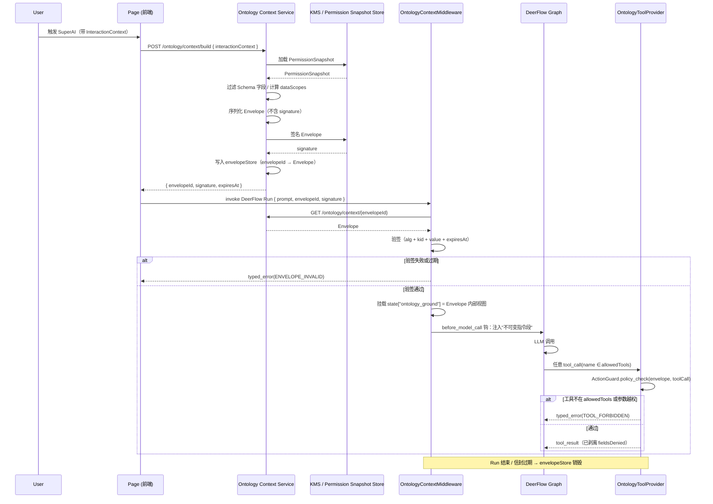
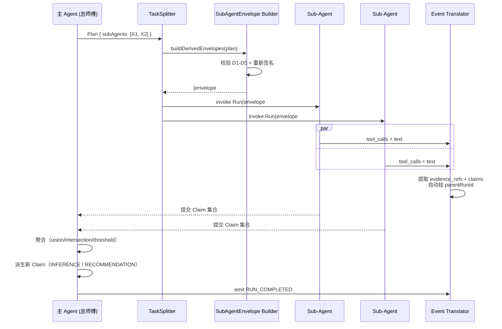
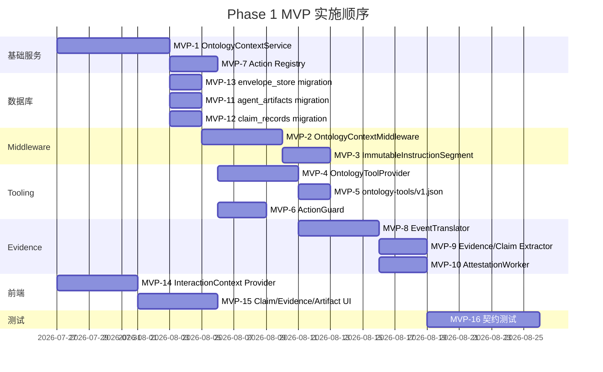
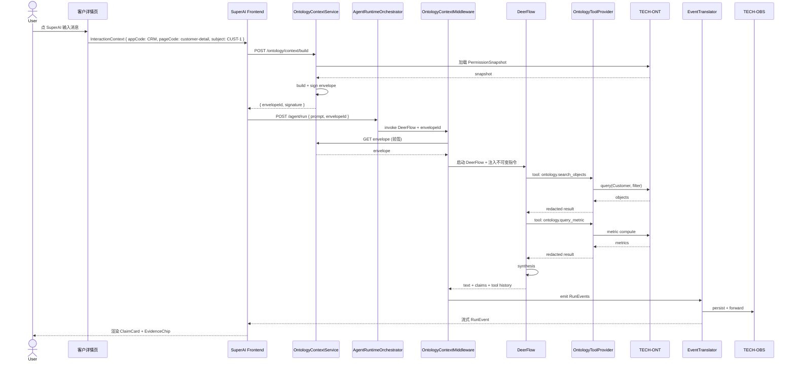
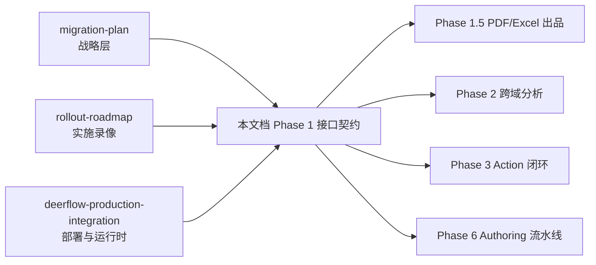

# Ontology-Native DeerFlow：Phase 1 接口契约

> 版本：v1.0 · 2026-07-26
> 配套文档：
> - 战略基线：`docs/superpowers/specs/2026-07-26-ontology-native-deerflow-integration-and-migration-plan.md`
> - 实施录像：`docs/superpowers/specs/2026-07-26-ontology-native-deerflow-rollout-roadmap.md`
> - DeerFlow 集成：`docs/superpowers/specs/2026-07-26-deerflow-production-integration-design.md`
> 本文目标：定义 Phase 1 MVP 必须锁定的 5 个接口契约，让 AI 实施助手、AI review、AI 自动化可消费本文档以推动实施

## 目录

0. [文档定位](#0-文档定位)
1. [战略锚点（再声明）](#1-战略锚点再声明)
2. [5 个接口契约概览](#2-5-个接口契约概览)
3. [契约 A：OntologyContextEnvelope 注入协议](#3-契约-aontologycontextenvelope-注入协议)
4. [契约 B：Skill / Action 映射与 Tool 注册](#4-契约-bskill--action-映射与-tool-注册)
5. [契约 C：Evidence 与 Artifact 归属](#5-契约-cevidence-与-artifact-归属)
6. [契约 D：跨域任务路由](#6-契约-d跨域任务路由)
7. [契约 E：Memory × Commit 治理](#7-契约-ememory--commit-治理)
8. [Phase 1 MVP 关键路径](#8-phase-1-mvp-关键路径)
9. [与现有两份文档的关系](#9-与现有两份文档的关系)
10. [后续工作](#10-后续工作)

---

## 0. 文档定位

本份文档是对 `integration-and-migration-plan` 的**接口精化**——聚焦在 Phase 1 MVP 必须锁定的 5 个契约。

- **不重述**：战略层、角色边界、阶段划分、里程碑（见原 migration-plan §2 / §12）
- **不修改**：基础设施、IAM、LLMGW 重写、RAG 全链路、DeerFlow Adapter 部署（见 rollout-roadmap §2-§10）
- **新增**：5 个接口契约的协议级定义（数据 Schema、调用流程、错误处理、不变量）
- **对齐**：`deerflow-production-integration-design` 中关于 Artifact / Tool Provider / Event Translator 的边界

本文档面向的读者：
- **AI 实施助手**：生成 OpenAPI spec、Java 接口、数据库 migration、前端组件
- **AI review**：对照本文档检查 PR 是否偏离契约
- **AI 自动化**：流水线 CI、契约测试用例生成、领域模型生成

人类读者也欢迎使用本文档，但**本文不再迁就业务可读性**。

---

## 1. 战略锚点（再声明）

| 角色 | 职责 | 实施栈 |
|---|---|---|
| **DeerFlow** | 自然语言理解 / 规划 / 推理 / Sub-Agent / Memory / Workspace / Artifact / Sandbox / Skill / Schedule | Python + LangGraph（**AI 运行时载体**） |
| **MetaPlatform** | Identity / Routing / AgentRun state / Budgets / Tool authorization / Action Guard / Evidence / Artifact / Audit / Fallback | Java 25 + Spring AI Alibaba（**Ontology 与治理载体**） |
| **Ontology** | 唯一真相源：Concept / Object / Relationship / Metric / Action / Event / Permission / Draft / Commit / Version | MetaPlatform 内置（TECH-ONT） |
| **LLM 输出** | Candidate Fact / Action Proposal / Recommendation | 永远不能直接落库 |

5 个契约的根本目的：**把 DeerFlow 嫁接到 MetaPlatform 的 Ontology 真相源上**，让 AI 的每一步都"有规矩、有出处、可回滚"。

---

## 2. 5 个接口契约概览

| # | 契约 | 一句话定义 | 关键接口 |
|---|---|---|---|
| **A** | Envelope 注入 | AI 不读 Envelope JSON，只读受控 Ground Tool | `OntologyContextMiddleware` + 4 个 Ground Tool |
| **B** | Tool × Action 绑定 | Skill 是组合，Tool 是单元，Tool 必绑 `actionCode` | `OntologyToolProvider` + `ActionGuard` |
| **C** | Evidence / Artifact 归属 | 每句话有 Evidence，PDF 进平台 MinIO | `DeerFlowEventTranslator` + `AttestationWorker` |
| **D** | 跨域任务路由 | 总师傅拆活 → 小师傅并行 → 小票汇总 | `TaskSplitter` + `SubAgentEnvelope` |
| **E** | Memory × Commit | 3 个抽屉；公司抽屉 AI 不能直接写 | `MemoryGate` + `CandidateFactPipeline` |

**Phase 1 MVP 交付优先级**：

| 契约 | Phase 1 必须 | Phase 1 仅占位 |
|---|---|---|
| A | ✓ 完整可用 | — |
| B | ✓ 只读 Tool 完整，写 Tool 占位 | Phase 3 接入 Action Proposal |
| C | ✓ Evidence hook + Artifact attestation 占位 | Phase 1.5 实现 PDF/Excel 出品 |
| D | — | Sub-Agent 路由 hook + 子 Envelope 协议占位 |
| E | — | MemoryGate 接口占位，CandidateFactPipeline 留 Phase 6 |

接口契约细节见 §3-§7。

---

## 3. 契约 A：OntologyContextEnvelope 注入协议

### 3.1 目标

1. DeerFlow 的 LLM **永远读不到** Envelope JSON 内部细节
2. LLM 只能通过一组固定的 Ground Tool 查询受 Schema 约束的 Ontology 视图
3. Tool 调用受 Envelope 内的字段级 / 对象级 / 关系级权限约束
4. Envelope 一旦签名，LLM / Agent 代码**无法篡改**，过期即失效
5. Prompt 中只允许存在一段**不可变指令段**，由 Middleware 注入并签名

### 3.2 Envelope JSON Schema

```json
{
  "$schema": "https://json-schema.org/draft/2020-12/schema",
  "$id": "https://metaplatform.local/schemas/ontology-context-envelope/v1",
  "title": "OntologyContextEnvelope",
  "type": "object",
  "required": [
    "envelopeId", "tenantId", "userId", "runId", "principal",
    "subject", "schema", "allowedTools", "allowedActions",
    "permissionSnapshotId", "expiresAt", "signature"
  ],
  "properties": {
    "envelopeId": { "type": "string", "pattern": "^ENV-[A-Za-z0-9_-]{8,32}$" },
    "tenantId":   { "type": "string" },
    "userId":     { "type": "string" },
    "runId":      { "type": "string", "pattern": "^RUN-[A-Za-z0-9_-]{8,32}$" },
    "principal": {
      "type": "object",
      "required": ["tenantId", "userId", "roles"],
      "properties": {
        "tenantId": { "type": "string" },
        "userId":   { "type": "string" },
        "roles":    { "type": "array", "items": { "type": "string" } }
      }
    },
    "subject": {
      "type": "object",
      "required": ["concept", "objectId"],
      "properties": {
        "concept":  { "type": "string", "description": "Ontology ConceptCode" },
        "objectId": { "type": "string" }
      }
    },
    "schema": {
      "type": "object",
      "description": "AgentRun 可见的对象 Schema",
      "properties": {
        "properties":     { "type": "array", "items": { "type": "string" } },
        "relationships":  { "type": "array", "items": { "type": "string" } },
        "metrics":        { "type": "array", "items": { "type": "string" } }
      }
    },
    "allowedTools": {
      "type": "array",
      "description": "此 Envelope 允许调用的 Ground Tool 名单（白名单）",
      "items": { "type": "string", "pattern": "^ontology\\.[a-z_]+$" }
    },
    "allowedActions": {
      "type": "array",
      "description": "此 Envelope 允许执行的 Action 名单",
      "items": { "type": "string" }
    },
    "approvalRequiredActions": {
      "type": "array",
      "items": { "type": "string" }
    },
    "dataScopes": {
      "type": "object",
      "properties": {
        "regions":     { "type": "array", "items": { "type": "string" } },
        "fieldsDenied": {
          "type": "array",
          "items": { "type": "string" },
          "description": "字段级黑名单，Tool 在这些字段返回前必须剔除"
        },
        "objectDenied": {
          "type": "array",
          "items": { "type": "string" }
        }
      }
    },
    "permissionSnapshotId": { "type": "string", "pattern": "^PERM-[A-Za-z0-9_-]+$" },
    "expiresAt":   { "type": "string", "format": "date-time" },
    "signature": {
      "type": "object",
      "required": ["alg", "kid", "value"],
      "properties": {
        "alg":   { "type": "string", "enum": ["HS256", "RS256"] },
        "kid":   { "type": "string", "description": "Key ID in KMS" },
        "value": { "type": "string" }
      }
    }
  }
}
```

### 3.3 注入流程

DeerFlow Middleware 链（按顺序）：



### 3.4 Envelope 生命周期

| 阶段 | 状态 | 触发 | 转换 |
|---|---|---|---|
| 创建 | SIGNED | Ontology Context Service 签名完成 | — |
| 注入 | INJECTED | Middleware 验签通过，挂载到 state | SIGNED → INJECTED |
| 激活 | ACTIVE | 第一次 LLM 调用发出 | INJECTED → ACTIVE |
| 过期 | EXPIRED | `now > expiresAt` 或 Run 终止 | * → EXPIRED |
| 销毁 | DESTROYED | envelopeStore 物理删除 Envelope | EXPIRED → DESTROYED |

**销毁要求**：
- 单 AgentRun 默认 30 分钟过期，可配置
- destroy 时只删 envelopeStore 中的 Envelope，**agent_runs、run_events 表不动**（审计需要）

### 3.5 不可变指令段（Immutable Instruction Segment）

通过 Middleware 注入到 DeerFlow `state["messages"][0].content` 之前的**系统消息片段**：

```text
You are operating inside an Ontology-aware AI runtime called SuperAI.
You MUST NOT:
  - Fabricate object IDs, metric values, or property values
  - Bypass Ontology tools by referring to internal knowledge of business data
  - Output IDs/PII that do not appear in tool results
You MUST:
  - Use ontology.* tools for any business data access
  - Cite Evidence for every business claim
  - Reject tasks that exceed the envelope's allowedActions without approval
If a tool call fails with ENVELOPE_INVALID or TOOL_FORBIDDEN, propagate to caller.
signature-segment: <HS256 over instruction content, kid=meta.immutable-instruction.v1>
```

**校验**：
- DeerFlow Middleware 在每次 `before_model_call` 钩重写系统消息时，**先重签 instruction segment**
- 任何下游组件（Prompt Builder、Tool Provider）验证 signature-segment 失败时，**拒绝执行**并发出 `INSTRUCTION_TAMPERED` 事件

### 3.6 Ground Tool 注册表（Phase 1 MVP 固定 4 个）

| Tool 名 | 入参 Schema | 出参 Schema | 风险等级 |
|---|---|---|---|
| `ontology.search_objects` | `{ concept, filter?, limit? }` | `{ objects: [...], truncated }` | LOW |
| `ontology.query_metric` | `{ objectId, metricCodes[], timeRange? }` | `{ metrics: [...] }` | LOW |
| `ontology.get_object_graph` | `{ objectId, depth?, relationTypes? }` | `{ nodes, edges }` | LOW |
| `ontology.fetch_evidence` | `{ evidenceRefs[] }` | `{ evidences: [...] }` | LOW |

**Tool 注册位置**：`TECH-AGENT/src/main/resources/ontology-tools/v1.json`

**Tool 出参与 Envelope 的对齐**：Tool 出参必须经过 OntologyToolProvider 的 `redact_fields(envelope, payload)` 步骤，剥离 `dataScopes.fieldsDenied` 列出的字段。

### 3.7 错误处理（Typed Error Codes）

| 错误码 | 含义 | 处理 |
|---|---|---|
| `ENVELOPE_NOT_FOUND` | envelopeId 不存在或已销毁 | Middleware 拒绝 Run；前端重新构建 |
| `ENVELOPE_EXPIRED` | `now > expiresAt` | Middleware 拒绝继续 LLM 调用 |
| `ENVELOPE_INVALID` | 签名校验失败或字段缺失 | Middleware 拒绝 Run；触发审计事件 |
| `INSTRUCTION_TAMPERED` | instruction segment 签名不匹配 | 全链路拒绝；Run 终止 |
| `TOOL_NOT_IN_ALLOWLIST` | Tool 名不在 `allowedTools` | Tool Provider 拒绝；记录 `TOOL_FORBIDDEN` 事件 |
| `TOOL_RESULT_LEAKED_FIELD` | Tool 出参含 `fieldsDenied` 字段 | Tool Provider 主动剥离；不是错误，是约束 |
| `OBJECT_ACCESS_DENIED` | Tool 访问了 `dataScopes.objectDenied` 中的对象 | 拒绝 tool_call；记录 |

每种错误必须**映射到一个明确的 RunEvent 子类型**，便于 AI review 检测缺失分支。

### 3.8 关键不变量（Invariant）

以下不变量在 Phase 1 MVP 中必须被自动化测试覆盖：

- **A1**：Envelope 任意字段**不能被 LLM 看到原文**——把 Envelope 塞入 prompt 是违规。
- **A2**：Tool 调用名**必须 ∈ `allowedTools`**——任何非白名单 Tool 在 Tool Provider 第一行拒绝。
- **A3**：Tool 出参**不能含 `fieldsDenied`**——redact_fields 是 Tool Provider 的必选后置过滤器。
- **A4**：签名算法 / kid / value 任一被改 → 立即拒签。
- **A5**：过期 envelope 不能被任何 Middleware 重新激活。
- **A6**：Instruction segment 必须由 Middleware 在每次 `before_model_call` 重签；任何外部组件修改后必须重新签名。
- **A7**：销毁 Envelope **不能影响** agent_runs / run_events 表（审计回放需要数据保留）。

### 3.9 与 Sub-Agent 的传递（契约 D 占位）

Sub-Agent 的 Envelope 必须从父 AgentRun 派生：
- 父 Run 的 `allowedTools` 是子 Run 的**子集**（不能扩展）
- 父 Run 的 `dataScopes` 完全继承
- 父 Run 的 `subject` 可被 Sub-Agent 重写为子对象，但 `concept` 必须 ∈ 父 `schema.relationships` 关联的概念

详细 Schema 见 §6。
---

## 4. 契约 B：Skill / Action 映射与 Tool 注册

### 4.1 目标

- DeerFlow Skill 是**作者视角**的 YAML 工作流模板
- Ontology Action Schema 是**治理视角**的元数据
- Tool 是两者之间**唯一合法通道**——任何 DeerFlow 对 Ontology 的副作用入口必须经过 Tool
- Tool 必须显式绑定 `actionCode`，让 Phase 3 的 ActionGuard 能精确决策
- Skill 内禁止绕过 `OntologyToolProvider` 直接调 HTTP

### 4.2 概念分层（必读）

```text
┌──────────────────────────────────────────────────────────┐
│ DeerFlow Skill (YAML)         Author-time workflow       │
│   - skill_id: skl.sales.deep_summary                      │
│   - steps:                                                │
│       - tool: ontology.search_objects                     │
│       - tool: ontology.query_metric                       │
└──────────────────────────────────────────────────────────┘
                          ▼  compose only
┌──────────────────────────────────────────────────────────┐
│ OntologyToolProvider       Runtime mediation              │
│   - registry: ontology-tools/v1.json                      │
│   - resolve(tool_name) -> ToolDefinition                  │
│   - invoke(tool_name, params, envelope) -> ToolResult     │
└──────────────────────────────────────────────────────────┘
                          ▼  bind (1:1)
┌──────────────────────────────────────────────────────────┐
│ Ontology Action Schema      Governance definition        │
│   - actionCode: ontology.search_objects                   │
│   - riskLevel: LOW                                        │
│   - effectType: READ_ONLY                                 │
│   - approvalRequired: false                               │
│   - guard: "policy_check(read)"                           │
└──────────────────────────────────────────────────────────┘
```

### 4.3 ToolDefinition 数据模型

```typescript
interface ToolDefinition {
  // 命名空间：ontology.* 固定前缀
  name: string;                 // 必填，pattern: ^ontology\.[a-z_]+$
  displayName: string;
  description: string;          // 用于 LLM tool 描述
  inputSchema: JsonSchema;      // 输入 JSON Schema（draft 2020-12）
  outputSchema: JsonSchema;     // 输出 JSON Schema

  // 与 Ontology Action 的绑定
  actionCode: string;           // 在 action registry 中存在
  riskLevel: 'LOW' | 'MEDIUM' | 'HIGH' | 'CRITICAL';
  effectType: 'READ_ONLY' | 'WRITE_DRAFT' | 'WRITE_DIRECT';
  approvalRequired: boolean;

  // Tool Provider 内部行为
  policyGuard: string;          // policy class FQN
  redactFields: string[];       // 与 Envelope 对齐的最后一步过滤
  timeoutMs: number;            // 默认 5000
  retryPolicy: { maxAttempts: number; backoffMs: number };
  idempotencyKey?: string;      // 写 Tool 必须存在
}
```

### 4.4 Action Schema 全局结构

```typescript
interface OntologyAction {
  actionCode: string;           // 命名空间: ontology.search_objects
  version: string;              // semver
  description: string;
  effectType: 'READ_ONLY' | 'WRITE_DRAFT' | 'WRITE_DIRECT';
  riskLevel: 'LOW' | 'MEDIUM' | 'HIGH' | 'CRITICAL';

  // 输入输出 Schema（与 ToolDefinition 对齐，但更严格）
  inputSchema: JsonSchema;
  outputSchema: JsonSchema;

  // 治理字段
  approvalRequired: boolean;
  approvalChain?: ApprovalNode[];   // 多签审批链
  preConditions?: PolicyRule[];
  postConditions?: PolicyRule[];
  auditFields: string[];             // 强制记录到 run_events

  // Capability 绑定
  requiredCapabilities: string[];    // 用户必须具备的能力
  boundConcepts: string[];           // 该 Action 适用的 Ontology Concept 列表
}
```

### 4.5 Tool → Action 绑定规则

| 规则 | 说明 |
|---|---|
| **一对一** | Phase 1 MVP 阶段每个 Tool 必须对应一个唯一的 `actionCode` |
| **禁止别名** | 同一 Tool 名不能绑多个 Action；同一 Action 不能被多个 Tool 共享 |
| **Skill 引用 Tool** | Skill YAML 只能引用 `ontology.*` 工具，禁止引用任意 HTTP |
| **Tool 注册入库** | Tool 注册到 `ontology-tools/v1.json`，CI 必须校验其 `actionCode` 在 action registry 存在 |
| **Capability 一致性** | `Tool.approvalRequired` 必须等于 `Action.approvalRequired`，不一致则 CI 失败 |

### 4.6 OntologyToolProvider 接口

```java
public interface OntologyToolProvider {
    /**
     * 工具发现：列出当前 Envelope 允许的全部 Tool
     */
    List<ToolDefinition> listAllowed(OntologyContextEnvelope envelope);

    /**
     * 工具调用：每次调用都经过 ActionGuard + redact_fields
     */
    ToolResult invoke(
        String toolName,
        JsonNode params,
        OntologyContextEnvelope envelope
    );
}

public interface ActionGuard {
    /**
     * 决策写动作是否需要走 Approval；只读直接通过
     */
    GuardDecision decide(
        OntologyAction action,
        OntologyContextEnvelope envelope,
        JsonNode params
    );
    // GuardDecision: ALLOW | REQUIRE_APPROVAL | DENY
}
```

### 4.7 Phase 1 MVP 仅交付只读 4 个 Tool

完整列表见 §3.6。这 4 个 Tool 在 Phase 1 的注册 JSON：

```json
{
  "version": "1.0.0",
  "tools": [
    {
      "name": "ontology.search_objects",
      "displayName": "Search Ontology Objects",
      "description": "Search objects of a given concept with optional filters",
      "actionCode": "ontology.search_objects",
      "riskLevel": "LOW",
      "effectType": "READ_ONLY",
      "approvalRequired": false,
      "policyGuard": "com.metaplatform.agent.guard.ReadOnlyPolicy",
      "redactFields": ["bankAccount", "legalIdentityNumber"],
      "timeoutMs": 5000,
      "retryPolicy": { "maxAttempts": 2, "backoffMs": 200 }
    },
    {
      "name": "ontology.query_metric",
      "displayName": "Query Metrics",
      "description": "Compute one or more metrics for a given object",
      "actionCode": "ontology.query_metric",
      "riskLevel": "LOW",
      "effectType": "READ_ONLY",
      "approvalRequired": false,
      "policyGuard": "com.metaplatform.agent.guard.ReadOnlyPolicy",
      "redactFields": [],
      "timeoutMs": 8000,
      "retryPolicy": { "maxAttempts": 2, "backoffMs": 200 }
    },
    {
      "name": "ontology.get_object_graph",
      "displayName": "Get Object Graph",
      "description": "Traverse relationships from a given object",
      "actionCode": "ontology.get_object_graph",
      "riskLevel": "LOW",
      "effectType": "READ_ONLY",
      "approvalRequired": false,
      "policyGuard": "com.metaplatform.agent.guard.ReadOnlyPolicy",
      "redactFields": [],
      "timeoutMs": 8000,
      "retryPolicy": { "maxAttempts": 2, "backoffMs": 200 }
    },
    {
      "name": "ontology.fetch_evidence",
      "displayName": "Fetch Evidence",
      "description": "Resolve evidence references to source material",
      "actionCode": "ontology.fetch_evidence",
      "riskLevel": "LOW",
      "effectType": "READ_ONLY",
      "approvalRequired": false,
      "policyGuard": "com.metaplatform.agent.guard.ReadOnlyPolicy",
      "redactFields": ["rawContent"],
      "timeoutMs": 5000,
      "retryPolicy": { "maxAttempts": 2, "backoffMs": 200 }
    }
  ]
}
```

### 4.8 Phase 3 写入 Tool 的占位（不在 Phase 1 实现）

写 Tool 的注册样例（占位）：

```json
{
  "name": "ontology.write_object_property",
  "actionCode": "ontology.write_object_property",
  "riskLevel": "MEDIUM",
  "effectType": "WRITE_DIRECT",
  "approvalRequired": true,
  "idempotencyKey": "required",
  "auditFields": ["concept", "objectId", "property", "beforeValue", "afterValue", "evidenceRef"]
}
```

`ActionGuard.decide()` 在 WRITE_DIRECT 类型下返回 `REQUIRE_APPROVAL`，调用方进入 Temporal/WFE 流程。

### 4.9 Skill 模板示例（参考）

```yaml
# skills/customer.deep_summary/skill.yaml
skill_id: skl.customer.deep_summary
version: 1.0.0
description: 给定 Customer 对象，生成深度分析（订单 + 合同 + 工单）

inputs:
  customer_id: string
  time_range: { type: string, enum: [last_3m, last_6m, last_12m] }

steps:
  - id: fetch_object
    tool: ontology.search_objects
    params:
      concept: Customer
      filter: { id: "${inputs.customer_id}" }
  - id: fetch_orders
    tool: ontology.query_metric
    params:
      objectId: "${steps.fetch_object.outputs[0].id}"
      metricCodes: [order.count, order.amount, order.decline_rate]
      timeRange: "${inputs.time_range}"
  - id: fetch_tickets
    tool: ontology.query_metric
    params:
      objectId: "${steps.fetch_object.outputs[0].id}"
      metricCodes: [ticket.sentiment, ticket.resolution_time]
  - id: fetch_graph
    tool: ontology.get_object_graph
    params:
      objectId: "${steps.fetch_object.outputs[0].id}"
      relationTypes: [HAS_CONTRACT, HAS_TICKET]

outputs:
  summary: string
  claim_refs: string[]

guardrails:
  forbidden_tools: []   # 显式白名单外的工具全部禁止
  max_llm_calls: 8
  max_wall_time_ms: 30000
```

**Skill 注册位置**：`TECH-AGENT/src/main/resources/skills/v1/<skill_id>/skill.yaml`

**Skill CI 校验**：
- Skill 引用的每个 Tool 名必须在 `ontology-tools/v1.json` 中存在
- Skill 的 `forbidden_tools` 与 `allowed_tools` 不相交
- Skill 的 `max_wall_time_ms` ≤ Onboarding policy 上限

### 4.10 关键不变量

- **B1**：Tool 出参的红名单字段**永远不能出现**——`redactFields` 是 Tool Provider 自身的 config，不依赖 Envelope.dataScopes
- **B2**：Skill 引用 Tool 必须显式 `tool:` 名引用——**不能**用 `http_get` 等通用 HTTP 工具
- **B3**：`Action.approvalRequired` 与 `ToolDefinition.approvalRequired` 必须**严格一致**——CI 强制校验
- **B4**：Skill 不会出现在 Tool Provider 的注册表里，Tool 也不会出现在 Skill template 里；两者职责分离
- **B5**：Tool 调用**必须携带** Envelope 引用（即使是只读 Tool），用于审计
- **B6**：写 Tool 的 `idempotencyKey` **必须从 Envelope.runId + Tool 名 + 参数哈希派生**——重复调用幂等
- **B7**：OntologyToolProvider 不持有任何长期凭据；HTTP/DB 凭据由 MetaPlatform broker 注入

---

## 5. 契约 C：Evidence 与 Artifact 归属

### 5.1 目标

- AI 给出的**每一句业务断言**必须挂 Evidence（出处、来源、引用）
- AI 生成的**所有产物**（PDF、Excel、图片）必须进入平台 MinIO，**DeerFlow workspace URL 绝不暴露给前端**
- 任何 tool_result 必须被 Event Translator 拦截并打 `evidence_refs`
- 任何最终回答必须派生一组 `Claim`，区分 FACT / INFERENCE / RECOMMENDATION
- AgentRun 终止时，全部 evidence + claims 进 `agent_artifacts` 与 `claim_records` 表

### 5.2 Claim 数据模型

```typescript
type ClaimType = 'FACT' | 'INFERENCE' | 'RECOMMENDATION';

interface ClaimRecord {
  claimId: string;             // CLAIM-<uuid>
  runId: string;
  taskId?: string;
  type: ClaimType;
  content: string;             // 该断言的纯文本
  confidence: number;          // 0.0-1.0，FACT 必为 1.0
  evidenceRefs: string[];      // 至少一条
  generatedBy: {
    agentId: string;
    model: string;             // 'gpt-4', 'doubao-pro', ...
  };
  createdAt: ISODateTime;

  // 反幻觉审计字段
  toolCallIds: string[];       // 生成此 claim 引用的 tool_call
  promptSnapshotId?: string;   // 可选：生成该 claim 的 LLM 调用快照
}
```

### 5.3 Evidence 数据模型

```typescript
type EvidenceType =
  | 'ONTOLOGY_OBJECT'          // 例如：Order #1234
  | 'ONTOLOGY_METRIC'          // 例如：customer.revenue_12m
  | 'ONTOLOGY_RELATION'        // 例如：Customer HAS_ORDER Order
  | 'DOCUMENT'                 // 例如：合同 PDF 的 §2.3
  | 'KB_CHUNK'                 // 例如：KB chunk #abc
  | 'EXTERNAL'                 // 例如：天气 API 2026-07-25 晴
  | 'MODEL_DERIVED';           // 模型自派生（如对比摘要）

interface Evidence {
  evidenceId: string;          // EVD-<uuid>
  type: EvidenceType;
  ref: string;                 // 统一引用码：'order:1234', 'metric:customer.revenue_12m@CUST-1'
  fragment?: string;           // 关键片段（用于检索回显）
  sourceUri?: string;          // 内部 URI（用于签字取件）
  capturedAt: ISODateTime;
  capturedBy: string;          // 'agent.runId' or 'tool.ontology.search_objects'

  // 与 Ontology 的对齐
  concept?: string;
  objectId?: string;

  // 审计锚点
  toolCallId?: string;
  envelopeId: string;
}
```

### 5.4 DeerFlowEventTranslator 接口

```java
public interface DeerFlowEventTranslator {
    /**
     * 输入：DeerFlow SSE 事件
     * 输出：标准 RunEvent（持久化 + 转发前端）
     */
    RunEvent translate(DeerFlowRawEvent raw, TranslationContext ctx);

    /**
     * 提取 Tool Result 中的 Evidence（嵌入 run_id/scene）
     */
    List<Evidence> extractEvidence(JsonNode toolResult, OntologyContextEnvelope envelope);

    /**
     * 提取 LLM 文本输出中的 Claim（FACT/INFERENCE/RECOMMENDATION 分类）
     */
    List<ClaimRecord> extractClaims(String llmOutput, List<Evidence> evidences, OntologyContextEnvelope envelope);

    /**
     * 上报 RunEvent（先去敏、入仓、再转发）
     */
    void persistAndForward(RunEvent event);
}
```

**TranslationContext 字段**：
- `runId`, `taskId`, `tenantId`, `userId`, `envelopeId`, `traceId`

**过滤规则**：
- 不转发 `tool_call.arguments` 中包含 `bankAccount` / `legalIdentityNumber` / `password` 的字段
- 不转发 system prompt 文本
- 不转发 rawArtifact URL

### 5.5 AttestationWorker 接口（artifact 归属）

```java
public interface AttestationWorker {

    /**
     * 拉取 DeerFlow workspace 中的 artifact
     */
    void pullFromSandbox(String runId, String sandboxPath, String artifactRef);

    /**
     * 扫敏
     */
    ScanReport scanSensitive(byte[] content, String filename);

    /**
     * 上传到平台 MinIO（bucket: platform-artifacts-{tenantId}）
     */
    String uploadToMinIO(byte[] content, String filename, String contentType);

    /**
     * 注册到 agent_artifacts 表
     */
    AgentArtifact register(ArtifactMetadata meta);

    /**
     * 生成 runId-scoped 短期签名 URL（默认 1 小时）
     */
    String signUrl(String artifactId, Duration ttl);

    /**
     * 撤销 / 回滚
     */
    void revoke(String artifactId, String reason);
}
```

### 5.6 Artifact 字段

```typescript
interface AgentArtifact {
  artifactId: string;
  runId: string;
  tenantId: string;
  filename: string;
  contentType: string;        // application/pdf, image/png, ...
  sizeBytes: number;
  sha256: string;
  minioKey: string;           // 内部 key
  scanStatus: 'CLEAN' | 'FLAGGED' | 'BLOCKED';
  flaggedReasons?: string[];  // 命中 PII / 黑名单关键词
  producedBy: { agentId, skillId, toolCallId };
  evidenceRefs: string[];     // 引用的 claim/evidence 列表
  createdAt: ISODateTime;
  expiresAt: ISODateTime;     // 默认 now + 7 day，未签 URL 仍可经签名 URL 短期访问
  signedUrl?: string;         // 当前可用签名 URL（1 小时）
  revoked: boolean;
}
```

### 5.7 Phase 1 MVP 输出范围

| 输出类型 | 状态 |
|---|---|
| 文本回答（含 Claim/Evidence 引用） | ✓ 必须 |
| Ontology object / metric 引用（点击跳转） | ✓ 必须 |
| artifact 文本片段（< 16KB） | ✓ 走 MinIO 镜像，签名 URL 暴露 |
| PDF / Excel / Image artifact | Phase 1.5 接入 AttestationWorker |
| 跨域汇总报告 PDF | Phase 2 接入 |

### 5.8 关键不变量

- **C1**：任何非 `tool_result` 来源的业务断言**禁止**打 `type: FACT`——ClaimType=FACT 必须 `evidenceRefs.length ≥ 1` 且 evidence.type ∈ {ONTOLOGY_OBJECT, ONTOLOGY_METRIC, ONTOLOGY_RELATION, DOCUMENT}
- **C2**：PRODUCT_RECOMMENDATION 的 `confidence ∈ [0, 1]`，AI 不能给出 confidence=1 的建议
- **C3**：artifact URL 必须经 signUrl 生成，**DeerFlow workspace URL 永不出现**在 Claim/Evidence/Artifact 字段
- **C4**：artifact 必须先扫敏后入仓，`scanStatus=BLOCKED` 阻断上传
- **C5**：artifact 撤销立即将 `signedUrl` 失效（包含已发出的，前端打开返回 404）
- **C6**：每条 RunEvent 必须先 persist 再 forward；不允许"只 forward 不 persist"
- **C7**：event translator 不持有 DB 连接；持久化由专用 write-behind worker 完成
---

## 6. 契约 D：跨域任务路由（Sub-Agent 编排）

### 6.1 目标

- 跨对象 / 跨概念分析必须由**主 AgentRun + 多个 Sub-AgentRun**协同完成
- Sub-Agent 必须**逻辑隔离**——看不到 sibling Sub-Agent 的中间状态
- 每个 Sub-Agent 持有自己的**派生 Envelope**（父 Envelope 的子集）
- Sub-Agent 的所有 tool_call 与 text_output 必须被 Event Translator 捕获并附 `parentRunId`
- 汇总阶段必须基于 **Claim + Evidence** 集合，**禁止**基于 Sub-Agent 私聊文本

### 6.2 任务拆分协议

主 AgentRun 拥有的 Plan 必须显式声明 Sub-Agent 列表：

```typescript
interface SubAgentPlan {
  planId: string;
  parentRunId: string;
  strategy: 'SEQUENTIAL' | 'PARALLEL' | 'DAG';
  subAgents: SubAgentSpec[];
  aggregation: 'JOIN_ALL' | 'JOIN_FIRST_SUCCESS' | 'JOIN_THRESHOLD';
  mergeThreshold?: number;     // JOIN_THRESHOLD 时需要
}

interface SubAgentSpec {
  subAgentId: string;
  objective: string;
  conceptFocus: string;        // 主分析概念：Customer / Order / Contract / Ticket
  scopeHints?: {
    objectFilter?: JsonNode;   // 例如 { region: 'EAST_CHINA' }
    relationTypes?: string[];
  };
  expectedOutputs: string[];   // 期望的 claim.type 列表
  derivedEnvelope: DerivedEnvelopeSpec;
  budget: {
    tokens: number;
    wallTimeMs: number;
  };
}

interface DerivedEnvelopeSpec {
  parentEnvelopeId: string;
  allowedToolsSubset: string[];
  dataScopes: 'INHERITED';     // 始终继承
  subjectOverride?: {
    concept: string;
    objectId: string;
  };
  expiresIn: number;           // ms，比父 Envelope 短
}
```

### 6.3 派生 Envelope 必须遵守的不变量

- **D1（白名单收缩）**：子 Envelope 的 `allowedTools` 必须是父的**子集**
- **D2（数据范围继承）**：子 Envelope 的 `dataScopes` 与父**完全相等**——任何收缩必须由父 Plan 显式声明
- **D3（subject 受限）**：子 subject.concept 必须 ∈ 父 `schema.relationships` 关联的概念
- **D4（生命周期）**：子 envelope 过期时间 < 父；父销毁必须 cascade 销毁所有子
- **D5（独立签名）**：每个子 Envelope **必须重新签名**，不能继承父 signature

### 6.4 Sub-Agent 隔离执行



### 6.5 汇总协议

主 AgentRun 在汇总阶段**禁止**直接拼接 Sub-Agent 文本，必须基于 Claim：

```typescript
interface AggregationResult {
  planId: string;
  parentRunId: string;
  joinedClaims: ClaimRecord[];          // 来自所有 Sub-Agent
  derivedClaims: ClaimRecord[];         // 主 Agent 新派生的 INFERENCE/RECOMMENDATION
  droppedClaims: ClaimRecord[];         // 因 confidence < threshold 被丢弃
  aggregationStrategy: 'JOIN_ALL' | 'JOIN_FIRST_SUCCESS' | 'JOIN_THRESHOLD';
  threshold?: number;
}
```

**冲突解决**：
- 同 `evidenceRefs` 但 `content` 冲突 → 进入 `CONFLICT_CLAIM` 队列
- 主 Agent 必须基于更高 confidence + 更近时间窗挑选 winner
- 失败解决时回退到 `ASK_USER`

### 6.6 Sub-Agent 任务路由钩子（Phase 1 不完整实现）

Phase 1 提供以下 hook，子 Envelope 生成和隔离执行的具体实现放到 Phase 2：

| 钩子 | 接口 | Phase 1 状态 |
|---|---|---|
| `SubAgentPlan` 解析 | `TaskSplitter.parse(planYaml)` | ✓ 占位 stub |
| `DerivedEnvelopeSpec` 校验 | `SubAgentEnvelopeBuilder.validate(spec)` | ✓ 实现（不签名） |
| Sub-Agent invoke | `SubAgentRuntime.invoke(spec)` | — 仅留接口 |
| Claim 聚合 | `ClaimAggregator.join(claims, strategy)` | — Phase 2 |

### 6.7 关键不变量

- **D6**：Sub-Agent 的 tool_call 必须**不允许调用父 Plan 中未声明的 Tool**——即使父 Envelope 允许
- **D7**：Sub-Agent 的 Claim 全部进入 `claim_records`，必带 `parentRunId` 与 `subAgentId`
- **D8**：Sub-Agent **不能**创建孙 Agent（递归深度为 1）
- **D9**：汇总 `derivedClaims` 的 `confidence` 必须 <= 入参 claim 中最小 confidence
- **D10**：Plan 完成时如果任何 Sub-Agent 处于 FAILED，主 AgentRun 状态标记 `DEGRADED` 而非 COMPLETED

---

## 7. 契约 E：Memory × Commit 治理

### 7.1 目标

- AI 的记忆分为**三个抽屉**，每个抽屉的写入路径权限不同
- **公司级经验**（"万达集团去年回款风险高"）**永远不能由 AI 直接写入**
- 必须经过候选事实 → Draft → Approval → Commit 的受治理通道
- 用户级偏好在用户授权下可写、可查、可删
- 工作级记忆（task 期间）可由 AI 自管，但 Run 结束必须清理

### 7.2 三层抽屉模型

```text
Drawer 1: Working Memory（工作抽屉）
  作用：AgentRun 期间临时变量、对话状态、tool_call 缓存
  写入：A1 自管
  生命周期：Run 结束自动清理
  持久化：technically 在 agent_run_working_memory 表，TTL = Run 生命周期

Drawer 2: User Memory（用户抽屉）
  作用：用户级偏好（"你偏好按 12 个月看"）
  写入：A1 自管（遵守 policy）
  生命周期：用户可永久保留，直到用户删除
  持久化：user_memory 表（按 user_id + category 索引）

Drawer 3: Org Memory（公司抽屉）
  作用：公司级经验（业务事实、Ontology 知识）
  写入：A1 严禁直接写；必须经过 CandidateFactPipeline
  生命周期：永久，受 Ontology Version 控制
  持久化：ontology_drafts / ontology_commits 表
```

### 7.3 MemoryGate 判定规则

```java
public interface MemoryGate {
    MemoryDestination route(MemoryWriteRequest req, OntologyContextEnvelope envelope);
}

enum MemoryDestination {
    WORKING,   // 抽屉 1
    USER,      // 抽屉 2
    REJECTED,  // 不可写（业务事实 + 越权时）
    DRAFT      // 进入 Ontology Draft
}
```

**判定优先级**：

1. 若 `req.containsBusinessFact() && req.category == "OBSERVATION"` → `DRAFT`
2. 若 `req.category == "USER_PREFERENCE"` → `USER`（若 `policyCheck.userWriteAuthorized(envelope)` 通过）
3. 若 `req.category == "AGENT_TEMP"` → `WORKING`
4. 其它 → `REJECTED` + 审计事件 `MEMORY_WRITE_DENIED`

### 7.4 抽屉守门员的接口

```java
public interface WorkingMemoryStore {
    void put(String runId, String key, JsonNode value);
    Optional<JsonNode> get(String runId, String key);
    void clear(String runId);          // Run 结束触发
}

public interface UserMemoryStore {
    String put(String userId, String category, JsonNode value, MemoryMetadata meta);
    List<UserMemoryEntry> list(String userId, String category);
    void delete(String entryId, String actorUserId);
}

public interface CandidateFactPipeline {
    /**
     * 接收 LLM 输出的"业务事实"候选
     */
    String submitCandidate(CandidateFact fact, OntologyContextEnvelope envelope);

    /**
     * Schema 校验 + 冲突检测
     */
    ValidationReport validate(String candidateId);

    /**
     * 进入 Draft（绑定 sourceAgentRunId + draftId）
     */
    String createDraft(List<String> candidateIds, String authorRunId);

    /**
     * 决策：LOW 直接 commit，HIGH 进 Approval
     */
    DraftDecision decide(String draftId);
}
```

### 7.5 CandidateFact 数据模型

```typescript
interface CandidateFact {
  candidateId: string;
  concept: string;
  objectId?: string;
  property: string;
  proposedValue: JsonNode;
  evidenceRefs: string[];          // 至少一条
  confidence: number;
  conflictLevel: 'NONE' | 'LOW' | 'MEDIUM' | 'HIGH';

  // 来源审计
  sourceAgentRunId: string;        // 必填
  sourceTaskId?: string;
  generatedBy: { agentId, model };
  capturedAt: ISODateTime;
}
```

### 7.6 Draft / Commit 协议

```typescript
interface OntologyDraft {
  draftId: string;
  baseVersion: string;             // Ontology 当前版本
  diff: ConceptDiff[] | ObjectDiff[] | RelationshipDiff[] | MetricDiff[];
  sourceAgentRunId: string;
  candidates: CandidateFact[];
  status: 'DRAFT' | 'PENDING_REVIEW' | 'APPROVED' | 'REJECTED' | 'COMMITTED';
}

interface OntologyCommit {
  commitId: string;
  author: string;                  // 用户 id（非 agent run id）
  sourceType: 'USER' | 'AGENT' | 'SYSTEM';
  sourceAgentRunId?: string;
  draftId: string;
  beforeVersion: string;
  afterVersion: string;
  diff: JsonNode;
  approver?: string;
  evidenceRefs: string[];
  timestamp: ISODateTime;
}
```

### 7.7 决策矩阵

| 风险等级 | conflictLevel | 决策 |
|---|---|---|
| LOW | NONE / LOW | 自动 commit，写入 ontology_commits，发 `COMMIT_EXECUTED` 事件 |
| MEDIUM | LOW / MEDIUM | 进入人工 review（storefront 标注 "需审核"） |
| HIGH | MEDIUM / HIGH | 强制走 Temporal/WFE 多签 |
| CRITICAL | 任意 | 拒绝入库，发 `CANDIDATE_REJECTED` 事件 |

### 7.8 Phase 1 MVP 占位

| 模块 | Phase 1 状态 |
|---|---|
| `WorkingMemoryStore` | ✓ 必须：每次 Run 结束 clear |
| `UserMemoryStore` | ✓ 接口占位，Phase 7 完成 |
| `MemoryGate` | ✓ 接口占位 + 决策表（route() 默认返回 REJECTED） |
| `CandidateFactPipeline` | — Phase 6 实现 |
| `OntologyDraft` / `OntologyCommit` 表 | — Phase 6 migration |

### 7.9 关键不变量

- **E1**：任何带 `category: OBSERVATION` 且 `containsBusinessFact=true` 的 memory 写入**必须**进入 DRAFT 路径，禁止 WORKING / USER
- **E2**：LLM 输出的 candidate 必带 `sourceAgentRunId`，缺字段则 Validator 拒绝
- **E3**：draft 状态变更**每一次**都落审计事件（`DRAFT_CREATED` / `DRAFT_REVIEWED` / `DRAFT_APPROVED` / `DRAFT_REJECTED` / `DRAFT_COMMITTED`）
- **E4**：commit 完成后**生成新 version**，beforeVersion / afterVersion 都可回放
- **E5**：用户级 memory 删除是**软删除**（`revoked_at` + `revoked_by`），保留 30 天审计窗口
- **E6**：working memory 的 key 永远不能跨 Run 复用，强制 `runId` 前缀
- **E7**：MemoryGate 决策必须发出 `MEMORY_WRITE_*` 事件，**没有事件**等价于写入失败
---

## 8. Phase 1 MVP 关键路径

### 8.1 必交付物清单

| # | 交付物 | 落地位置 | 依赖 |
|---|---|---|---|
| MVP-1 | `OntologyContextService` 服务 + Envelope Build/Sign/Verify | `TECH-ONT` 新增 `context` 包 | TECH-IAM PermissionSnapshot 可用 |
| MVP-2 | `OntologyContextMiddleware` Python 实现 | `TECH-AGENT/adapters/deerflow/middleware/ontology_context.py` | MVP-1 |
| MVP-3 | `ImmutableInstructionSegment` + 重签逻辑 | `TECH-AGENT/adapters/deerflow/middleware/instruction.py` | MVP-2 |
| MVP-4 | `OntologyToolProvider` Java 实现 + 4 个只读 Tool | `TECH-AGENT/.../ontology/tools/` | MVP-1 |
| MVP-5 | `ontology-tools/v1.json` 注册表 | `TECH-AGENT/src/main/resources/ontology-tools/v1.json` | MVP-4 |
| MVP-6 | `ActionGuard` 接口 + `ReadOnlyPolicy` | `TECH-AGENT/.../ontology/guard/` | MVP-4 |
| MVP-7 | Ontology Action Registry（4 个只读 Action） | `TECH-ONT/.../action/registry/v1.json` | MVP-4 |
| MVP-8 | `DeerFlowEventTranslator` Java 实现 | `TECH-AGENT/.../event/translator/DeerFlowEventTranslator.java` | MVP-4 |
| MVP-9 | `EvidenceExtractor` + `ClaimExtractor` | `TECH-AGENT/.../event/extractor/` | MVP-8 |
| MVP-10 | `AttestationWorker` 接口 + MinIO 客户端 | `TECH-AGENT/.../artifact/` | MVP-8 |
| MVP-11 | `agent_artifacts` 表 migration | `TECH-AGENT/src/main/resources/db/migration/V1__agent_artifacts.sql` | MVP-10 |
| MVP-12 | `claim_records` 表 migration | 同上 V2__claim_records.sql | MVP-9 |
| MVP-13 | `envelope_store` 表 migration | `TECH-ONT/.../db/migration/V1__envelope_store.sql` | MVP-1 |
| MVP-14 | 前端 `InteractionContext` Provider | `apps/superai/components/InteractionContext.tsx` | — |
| MVP-15 | 前端 `ClaimCard` / `EvidenceChip` / `ArtifactFrame` | `apps/superai/components/` | MVP-14 |
| MVP-16 | 端到端契约测试 | `tests/contract/ontology_deerflow_v1/` | MVP-1 至 MVP-12 |

### 8.2 实施顺序



**关键依赖**：
- MVP-4（ToolProvider）依赖 MVP-7（Action Registry），否则 Tool 注册的 actionCode 校验失败
- MVP-2（Middleware）依赖 MVP-13（envelope_store 表），否则验签失败
- MVP-16（契约测试）必须在 MVP-8（EventTranslator）完成后才有意义

**并行机会**：
- MVP-1 至 MVP-7 可由 2-3 人并行
- 前端 MVP-14/15 全程可与后端并行

### 8.3 验收标准（可机器化）

| ID | 标准 | 验证方式 |
|---|---|---|
| AC-1 | 4 个 Ground Tool 全部注册到 v1.json | CI: `validate-tools.sh` 通过 |
| AC-2 | Envelope JSON Schema 通过 `ajv`/`json-schema-validator` | 单元测试覆盖 9 种错误路径 |
| AC-3 | Envelope 签名算法为 HS256 或 RS256 | 拒绝 ED25519 / 其它 |
| AC-4 | Tool 出参中的 fieldsDenied 字段**永远**为 null | 模糊测试生成随机数据，redact 后断言 |
| AC-5 | Envelope `allowedTools` 不在白名单 → TOOL_NOT_IN_ALLOWLIST | 契约测试明确覆盖 |
| AC-6 | ImmutableInstructionSegment 修改后校验立即失败 | 单元测试修改 signature |
| AC-7 | Sub-Agent envelope allowedTools 必须 ⊆ 父 envelope | D1 不变量 CI 校验 |
| AC-8 | ClaimType=FACT 的 `evidenceRefs.length ≥ 1` | 提交时 DB 约束 + 单元测试 |
| AC-9 | Artifact 落盘前必须先 scanSensitive | 单元测试 mock PII 数据 |
| AC-10 | Artifact URL 必须经 `signUrl(...)`，禁止裸 URL 入库 | 静态扫描 + 契约测试 |
| AC-11 | RunEvent 必须先 persist 再 forward | 时序测试：禁止出现 "事件已 forward 但 DB 无记录" |
| AC-12 | Working memory 在 Run COMPLETED 后 30s 内被清理 | 集成测试 |
| AC-13 | 审计事件 `MEMORY_WRITE_*` 在每次写入尝试时发出 | 时序测试 + 日志断言 |
| AC-14 | `evidence_refs` 内任意 evidenceId 在前端点击能跳到原始对象 | E2E Playwright 测试 |
| AC-15 | DeerFlow workspace URL 不能出现在前端 bundle | 静态扫描 `apps/superai/` |

### 8.4 第一个验收场景

`customer-detail` 页 → SuperAI → 输入"分析一下这个客户最近为什么销售下降" → 返回带 Evidence + Claim 的分析。

**完整链路**：



**验收点**：
1. `selectedRuntime = DEERFLOW`（首次验证"DeerFlow 是载体"）
2. `traceId` / `runId` 跨前端、Agent、DeerFlow、Tool、Event 一致
3. 至少 1 个 FACT Claim，证据链点击可跳到原始对象
4. 至少 1 个 INFERENCE 或 RECOMMENDATION Claim
5. `RunEvent` 中**所有** tool_call 都被 ET 捕获并打 `evidence_refs`
6. 前端**不出现** DeerFlow workspace URL

---

## 9. 与现有两份文档的关系

### 9.1 对 `integration-and-migration-plan.md` 的修订建议

| 章节 | 现状 | 建议修订 |
|---|---|---|
| §3.3 路由图 | 列了 Fast Query / DeerFlow / MetaFlow Graph / WFE / Approval | 加注：仅 Fast Query / DeerFlow / Graph 三个 Runtime；WFE 与 Approval 是 Approval 流的承接器，不是 Runtime |
| §4.2 Envelope JSON | 给了一个示例 JSON | 替换为 §3.2 的完整 JSON Schema（含 enum、pattern、required） |
| §5 运行时分工 | 6 行表格 | 细化 ToolProvider 表行：写明"Tool = Action unit、Skill = composition" |
| §6 Middleware 改造 | 列了 5 个 Middleware（Context/Grounding/Permission/Evidence/Observation） | **Phase 1 只交付** ContextMiddleware + 不可变指令段 + ToolProvider。其余 Middleware 推到 Phase 4/5 |
| §7 Ontology 工具集 | 只说"4 个只读 Tool + N 个写 Tool" | 加注：本份文档 §3.6 / §4.7 锁定 4 个只读 Tool 的 input/output Schema |
| §11 改造清单 | 列出 10+ 个改造项 | 把"DeerFlow Adapter 落库" 拆为 Phase 1 子集：MVP-1 至 MVP-16 |
| §13.1 MVP 范围 | "客户详情页 Object Copilot" | 与 §8.4 第一个验收场景对齐 |
| §13.2 验收标准 | 列了功能 / 质量 / 安全 / 体验 4 类 | 替换为 §8.3 可机器化的 15 条 AC |

### 9.2 对 `rollout-roadmap.md` 的修订建议

| 章节 | 现状 | 建议修订 |
|---|---|---|
| §1 全局节奏 P3 接入 DeerFlow | 9 周 | 拆出"Phase 1 MVP 子集"：4 周交付 MVP-1 至 MVP-12 |
| §3 P0/P1/P2 阶段 | 9/10/10 周 | P1.5 新增段：在 P1.0 Ontology Schema 完成后、P2 RAG 启动前，**先用 2 周做 §8 验收**（仅 Object Copilot 路径） |
| §6 P3 DeerFlow 接入 | 列了 9 个子任务 | 把"Adapter 内部接口契约"替换为本文档 §3-§5 链接 |
| §9 P5 Action 治理 | 列了 6 个子任务 | 把"ActionGuard.decide() 接口"替换为本文档 §4.6 |
| §10 P6 Authoring 流水线 | 列了 5 个子任务 | 把"CandidateFactPipeline" 替换为本文档 §7.4-§7.6 |
| §13 总时长 | 串行 ~76 周 | Phase 1 MVP 子集 22 周不变；Phase 1.5 验收 2 周加在 P1 后 |

### 9.3 改动汇总

**新增**：
- `docs/superpowers/specs/2026-07-26-ontology-deerflow-phase1-interfaces.md`（本文档）

**不修改**：
- `2026-07-26-ontology-native-deerflow-integration-and-migration-plan.md`
- `2026-07-26-ontology-native-deerflow-rollout-roadmap.md`
- `2026-07-26-deerflow-production-integration-design.md`

**未来追加（可选）**：
- `2026-07-26-ontology-deerflow-phase1-protocol-buffers.md`（如决定把 Envelope / Claim / Evidence 用 protobuf 表达）
- `2026-07-26-ontology-deerflow-state-machine.md`（各契约的状态机细化）
- `2026-07-26-ontology-deerflow-test-cases.md`（基于 §8.3 AC 自动生成）

### 9.4 文档依赖图



---

## 10. 后续工作

### 10.1 立即可执行

- [ ] **把 §3.2 Envelope JSON Schema 转 OpenAPI 3.1 spec**，落到 `TECH-ONT/openapi/ontology-context-envelope-v1.yaml`
- [ ] **把 §4.7 Tool 注册表落到 v1.json**，并加 CI 校验脚本 `validate-ontology-tools.sh`
- [ ] **§3.7 / §5.8 不变量转 Java Annotation**（`@EnvelopeInvariant` / `@ClaimInvariant`），编译期 + 运行期双重检查
- [ ] **§8.3 AC-1 至 AC-15 转 JUnit 5 + Testcontainers 测试**，落到 `tests/contract/ontology_deerflow_v1/`

### 10.2 Phase 1.5 启动条件

满足以下任一即可启动 Phase 1.5：
1. §8.4 第一个验收场景连续 5 天内通过率 ≥ 95%
2. Drift 检测：Phase 1 引入的不变量被 0 个 PR 突破
3. 用户在客户详情页 SuperAI 输入 "用更专业的话总结" 等 Prompt Engineering 操作后，仍能稳定返回结构化 Claim + Evidence

### 10.3 Phase 2 启动条件

满足以下**全部**即可启动 Phase 2：
1. Phase 1.5 完成验收
2. §6.6 中 6 个 Sub-Agent 钩子全部实现并通过 D1-D10 不变量测试
3. `TaskSplitter.parse(planYaml)` 能基于 Ontology Concept 列表自动生成 Sub-Agent 计划
4. 跨域汇总报告 PDF 模板设计完成

### 10.4 文档维护原则

- 本文档任何改动必须**同步修改**：对应的 OpenAPI spec、JSON Schema、Tool 注册 v1.json、Action Registry v1.json
- 本文档任何不变量改动必须**同步增加**：对应的自动化测试
- 本文档变更需经过 Owner + Reviewer 双签，CI 在 PR 中强制校验"是否引入了新的不变量/Schema 而未补测试"

---

## 附录 A：错误码速查表

| 错误码 | 出现位置 | 处理 |
|---|---|---|
| `ENVELOPE_NOT_FOUND` | §3.7 | 重新 build Envelope |
| `ENVELOPE_EXPIRED` | §3.7 | 重新 build Envelope |
| `ENVELOPE_INVALID` | §3.7 | 拒绝 Run + 审计 |
| `INSTRUCTION_TAMPERED` | §3.7 | 拒绝 Run + 审计 |
| `TOOL_NOT_IN_ALLOWLIST` | §3.7 | 拒绝 tool_call + 审计 |
| `TOOL_RESULT_LEAKED_FIELD` | §3.7 | Tool Provider 主动剥离 |
| `OBJECT_ACCESS_DENIED` | §3.7 | 拒绝 tool_call + 审计 |
| `CONFLICT_CLAIM` | §6.5 | 主 Agent 决策 or 升级到 ASK_USER |
| `MEMORY_WRITE_DENIED` | §7.3 / §7.4 | MemoryGate REJECTED + 审计 |
| `CANDIDATE_REJECTED` | §7.7 | CRITICAL 风险拒绝 |
| `ARTIFACT_BLOCKED` | §5.5 | scanStatus=BLOCKED 阻断上传 |
| `ARTIFACT_REVOKED` | §5.5 | 撤销后 signUrl 立即失效 |

## 附录 B：Schema 索引

| Schema | 引用章节 |
|---|---|
| OntologyContextEnvelope | §3.2 |
| OntologyAction | §4.4 |
| ToolDefinition | §4.3 |
| ClaimRecord | §5.2 |
| Evidence | §5.3 |
| AgentArtifact | §5.6 |
| SubAgentPlan | §6.2 |
| DerivedEnvelopeSpec | §6.2 |
| AggregationResult | §6.5 |
| CandidateFact | §7.5 |
| OntologyDraft | §7.6 |
| OntologyCommit | §7.6 |

## 附录 C：Phase 1 不变量一览（66 条）

| 契约 | 编号 | 摘要 |
|---|---|---|
| A | A1 | Envelope 不进 prompt |
| A | A2 | Tool 名 ∈ allowedTools |
| A | A3 | Tool 出参不含 fieldsDenied |
| A | A4 | 签名篡改即拒签 |
| A | A5 | 过期 envelope 不可重激活 |
| A | A6 | Instruction segment 必重签 |
| A | A7 | 销毁不影响审计表 |
| B | B1 | Tool 出参红名单字段永不出 |
| B | B2 | Skill 只能引用 ontology.* 工具 |
| B | B3 | Tool.approvalRequired == Action.approvalRequired |
| B | B4 | Skill / Tool 职责分离 |
| B | B5 | Tool 调用必带 Envelope 引用 |
| B | B6 | 写 Tool 幂等键从 runId+tool+params 派生 |
| B | B7 | ToolProvider 不持长期凭据 |
| C | C1 | FACT claim 必带 evidenceRefs |
| C | C2 | RECOMMENDATION confidence ∈ [0,1) |
| C | C3 | DeerFlow workspace URL 永不暴露 |
| C | C4 | artifact 先扫敏后入仓 |
| C | C5 | artifact 撤销立即失效签名 |
| C | C6 | RunEvent 先 persist 再 forward |
| C | C7 | Event Translator 不直连 DB |
| D | D1 | 子 allowedTools ⊆ 父 |
| D | D2 | 子 dataScopes = 父 |
| D | D3 | 子 subject.concept ∈ 父 schema.relationships |
| D | D4 | 子 envelope 过期 < 父 |
| D | D5 | 子 Envelope 独立签名 |
| D | D6 | Sub-Agent 工具 ⊆ Plan 声明工具集 |
| D | D7 | Sub-Agent Claim 必带 parentRunId |
| D | D8 | Sub-Agent 不可创建孙 Agent |
| D | D9 | derivedClaims confidence ≤ min(input) |
| D | D10 | 任一 Sub-Agent FAILED → DEGRADED |
| E | E1 | OBSERVATION + businessFact → DRAFT |
| E | E2 | candidate 必带 sourceAgentRunId |
| E | E3 | draft 状态变更必落审计事件 |
| E | E4 | commit 后必有 before/after version |
| E | E5 | user memory 删除软删 30 天 |
| E | E6 | working memory key 强制 runId 前缀 |
| E | E7 | MemoryGate 决策必发事件 |

---

> 文档完。后续修订需同步更新对应 OpenAPI spec、Schema 文件、Tool/Action Registry、自动化测试。