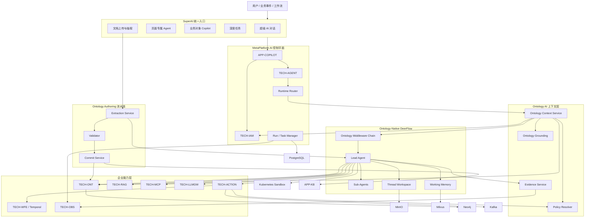
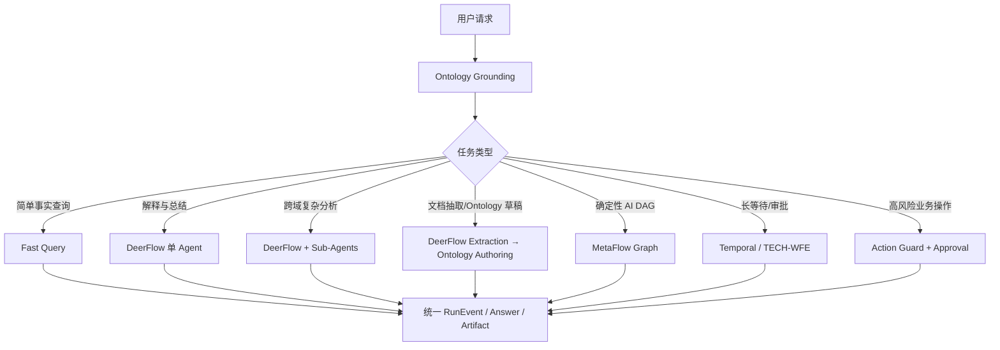
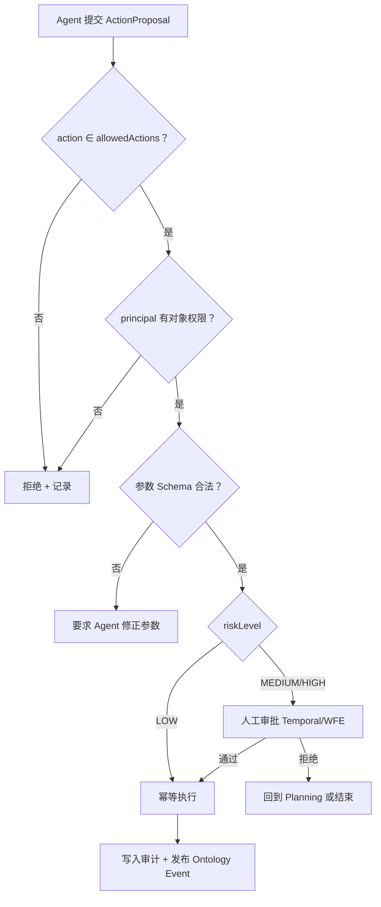
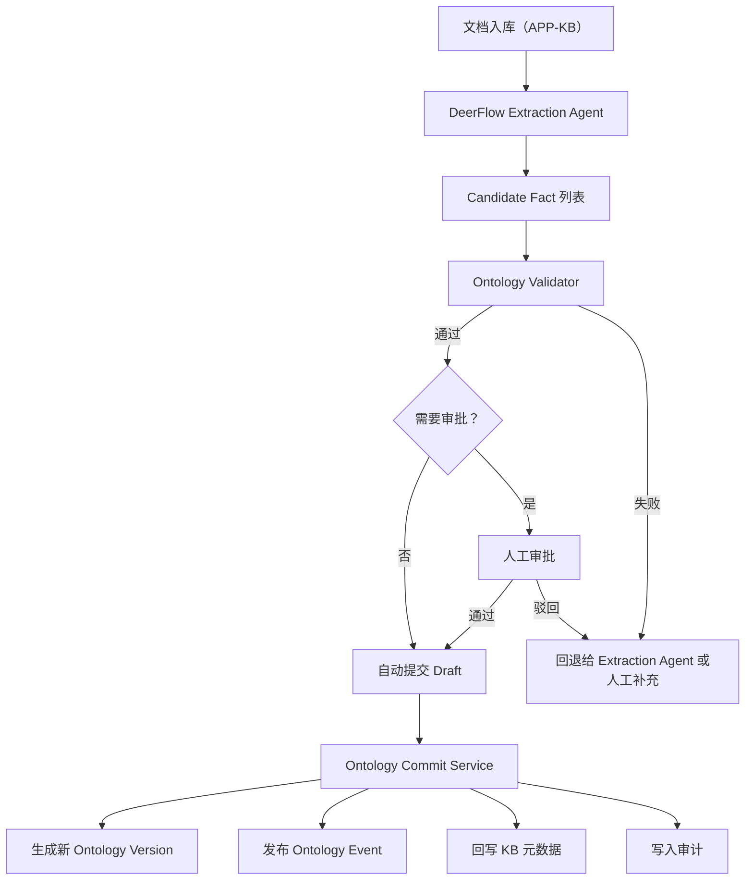
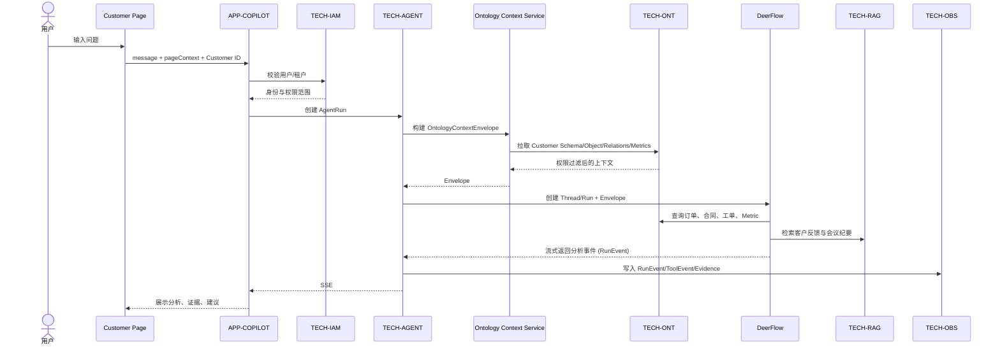
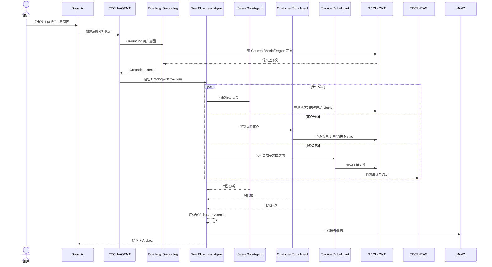
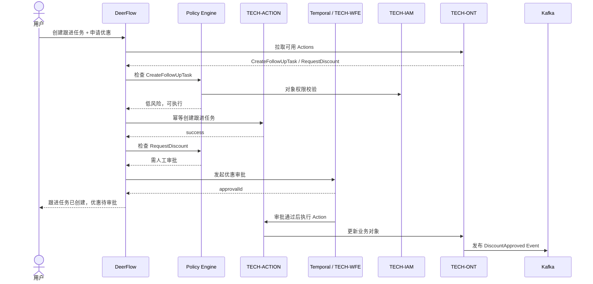
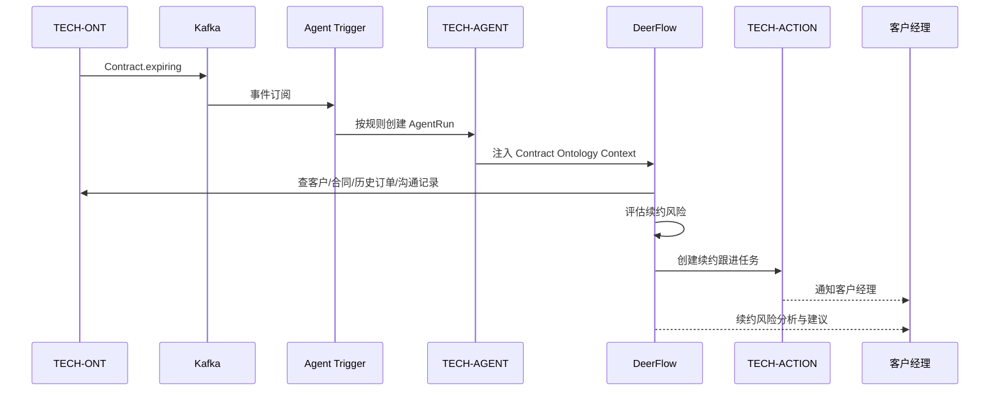
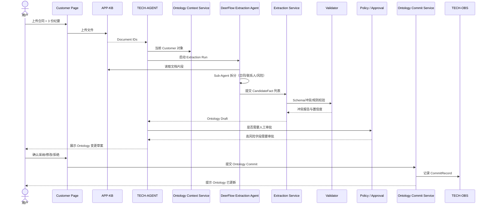

# Ontology-Native DeerFlow：集成与改造落地方案

> 版本：v1.0 · 2026-07-26  
> 适用仓库：D:/Hermes/Workspace/10_Projects/2026-07-02-MetaPlatform  
> 状态：草案（已通过讨论、待正式评审）  
> 配套文档：`CLAUDE.md`、`docs/superpowers/specs/2026-07-25-metaflow-three-scenario-architecture.md`、`TECH-AGENT/README.md`、`TECH-ONT/README.md`（待补）

## 目录

1. [背景与目标](#1-背景与目标)
2. [核心战略定位](#2-核心战略定位)
3. [总体架构](#3-总体架构)
4. [领域模型与契约](#4-领域模型与契约)
5. [运行时分工](#5-运行时分工)
6. [Ontology Middleware 改造](#6-ontology-middleware-改造)
7. [Ontology 工具集](#7-ontology-工具集)
8. [Ontology Authoring 流水线（核心治理边界）](#8-ontology-authoring-流水线核心治理边界)
9. [用户场景与调用关系](#9-用户场景与调用关系)
10. [安全、权限与审计](#10-安全权限与审计)
11. [现有模块改造清单](#11-现有模块改造清单)
12. [分阶段落地路径](#12-分阶段落地路径)
13. [第一期 MVP 范围与验收标准](#13-第一期-mvp-范围与验收标准)
14. [风险与治理原则](#14-风险与治理原则)
15. [后续工作](#15-后续工作)

---

## 1. 背景与目标

### 1.1 背景

MetaPlatform 已经明确以下事实：

- 后端统一为 Java 25 + Spring AI Alibaba（SAA），禁止新增 Python 业务后端；  
- Ontology 是企业业务世界的唯一真相源，AI 编排围绕 Ontology 展开；  
- `TECH-AGENT` 提供数字员工运行时、单 Agent 定义、A2A 协作与评估；  
- `TECH-MCP` 治理 MCP 服务，`TECH-ACTION` 治理业务动作，`TECH-WFE` 承载审批/等待/补偿；  
- MetaFlow DSL → FlowGram.AI 设计器 → SAA Graph 是当前 AI 编排路线。

外部观察到的诉求：

- DeerFlow 2.0 是一款能力完整的 Super Agent Harness（Sub-Agents、Memory、Sandbox、Skills、Scheduled Tasks、MCP、文件工作区、Artifact），与 MetaPlatform 的产品目标高度契合；  
- 但 DeerFlow 是 Python + LangGraph，不能直接合并进现有 Java/SAA 体系；  
- 同时，MetaPlatform 的 AI 体验需要一个统一认知引擎，让用户在任何页面、对话或业务事件中都能获得“懂企业语义、懂对象关系、懂行动空间”的 AI 协作。

### 1.2 目标

1. **把 Ontology 升级为 DeerFlow 的世界模型**：让 Ontology 成为 Agent 推理的语义上下文来源、对象真相源、行动空间和权限边界。  
2. **保持 MetaPlatform 现有架构基线**：不引入新的长期技术栈，不破坏 Java/SAA 路线；DeerFlow 作为外部 Runtime Adapter 接入。  
3. **统一 SuperAI 体验**：用户在任何入口（页面、对话、事件）都能调用同一套 Ontology-Native Agent Runtime。  
4. **建立 Ontology Authoring 治理边界**：明确“LLM 只能产生 Candidate Fact，不能直接写入 Ontology”。  
5. **分阶段落地、可回滚**：第一期只做只读分析与证据链；后续逐步开放受控 Action、事件驱动与自动写入草稿。

### 1.3 非目标

- 不在第一期引入新的长期语言栈。  
- 不修改 `CLAUDE.md` 关于“后端统一 Java”的核心约束。  
- 不做 DeerFlow 源码级 Fork 合并。  
- 不在第一期开放 Ontology 自动写入。

---

## 2. 核心战略定位

### 2.1 一句话定义

> **Ontology-Native DeerFlow = 以 Ontology 为世界模型，以 DeerFlow 为认知/规划/执行引擎的 Ontology Agent Runtime。**

### 2.2 角色边界

| 角色 | 职责 | 约束 |
|---|---|---|
| Ontology | 企业业务世界模型（Concept、Object、Relationship、Metric、Event、Permission、Action） | 唯一真相源 |
| DeerFlow | 自然语言理解、规划、推理、Sub-Agent、Memory、Workspace、Artifact | 不直接写入 Ontology |
| Ontology Extraction Service | 将 DeerFlow 输出转化为 Candidate Fact，校验 Schema 与冲突 | 与 DeerFlow 解耦 |
| Ontology Validator | 影响分析、版本对比、审批分级 | 不参与模型推理 |
| Ontology Commit Service | 草稿审批、版本化写入、审计回溯 | 唯一写入入口 |
| Temporal / TECH-WFE | 审批、等待、定时、补偿、恢复 | 管生命周期 |
| TECH-ACTION | 受控业务动作执行 | 唯一副作用入口 |
| TECH-RAG | 非结构化知识检索 | 仅补充知识 |
| TECH-LLMGW | 模型路由、限流、成本核算 | 唯一模型出口 |

### 2.3 关键原则

1. **Ontology 是世界模型和唯一真相源。**
2. **DeerFlow 是认知、推理与执行协调载体。**
3. **所有业务修改必须经过受治理的 Ontology Action 或 Ontology Commit Service。**
4. **LLM 输出永远只能成为 Candidate Fact 或 Action Proposal，不能绕过治理直接落库。**
5. **前端只关心统一 RunEvent 与 Artifact，不感知 DeerFlow、LangGraph 或 SAA。**

---

## 3. 总体架构

### 3.1 架构图



### 3.2 一次完整 Run 的五个阶段

1. **用户上下文解析**：前端携带 `InteractionContext` 与 `Subject` 调用 SuperAI。  
2. **Ontology Context 构建**：`Ontology Context Service` 组装权限过滤后的 `OntologyContextEnvelope`。  
3. **DeerFlow 推理与规划**：在 Ontology Middleware Chain 守护下执行理解、规划、Sub-Agent 调用。  
4. **Action 安全执行**：所有副作用经过 `Ontology Action Guard` → `TECH-ACTION` → `TECH-WFE`（必要时审批）。  
5. **证据与状态回写**：`Evidence Service` 绑定事实来源，`Ontology Event` 触发后续 Agent。

### 3.3 SuperAI 内部路由



---

## 4. 领域模型与契约

### 4.1 `InteractionContext`

前端在调用 SuperAI 时必须携带，由前端按页面统一生成。

```json
{
  "message": "分析一下这个客户最近为什么销售下降",
  "interaction": {
    "appCode": "CRM",
    "pageCode": "customer-detail",
    "pageUrl": "/customers/CUST-10086",
    "selectedText": null
  },
  "subject": {
    "conceptCode": "Customer",
    "objectId": "CUST-10086"
  },
  "viewState": {
    "activeTab": "orders",
    "filters": { "timeRange": "last_12_months" }
  }
}
```

### 4.2 `OntologyContextEnvelope`

由 `Ontology Context Service` 构建，注入 DeerFlow Runtime 的不可变上下文。

```json
{
  "envelopeId": "ENV-9001",
  "tenantId": "TENANT-01",
  "userId": "USER-1001",
  "runId": "RUN-7788",
  "principal": {
    "tenantId": "TENANT-01",
    "userId": "USER-1001",
    "roles": ["ACCOUNT_MANAGER"]
  },
  "subject": {
    "concept": "Customer",
    "objectId": "CUST-10086"
  },
  "schema": {
    "properties": ["name", "customerLevel", "revenue12m", "riskLevel"],
    "relationships": ["HAS_ORDER", "HAS_CONTRACT", "CREATED_TICKET"]
  },
  "metrics": [
    "customer.revenue_12m",
    "customer.order_decline_rate",
    "customer.ticket_sentiment"
  ],
  "allowedTools": [
    "ontology.search_objects",
    "ontology.query_metric"
  ],
  "allowedActions": [
    "CreateFollowUpTask",
    "GenerateCustomerBrief"
  ],
  "approvalRequiredActions": [
    "ChangeDiscount",
    "SendOfficialOffer"
  ],
  "dataScopes": {
    "regions": ["EAST_CHINA"],
    "fieldsDenied": ["bankAccount", "legalIdentityNumber"]
  },
  "permissionSnapshotId": "PERM-123",
  "expiresAt": "2026-07-26T11:00:00+08:00",
  "signature": "<HS256>"
}
```

### 4.3 `AgentRun`

```text
AgentRun {
  runId: string
  tenantId: string
  userId: string
  agentId: string
  runtimeType: DEERFLOW | GRAPH | TEMPORAL | FAST_QUERY
  contextEnvelopeId: string
  status: PENDING | RUNNING | PAUSED | COMPLETED | FAILED | CANCELED
  goal: string
  parentRunId: string?
  budget: { tokens: int, cost: decimal, wallTimeMs: int }
  traceId: string
  startedAt: timestamp
  finishedAt: timestamp?
}
```

### 4.4 `Task`

```text
Task {
  taskId: string
  runId: string
  parentTaskId: string?
  assigneeAgent: string
  objective: string
  input: json
  outputSchema: json
  permissions: ref<PermissionSnapshot>
  budget: ref<Budget>
  status: PENDING | RUNNING | COMPLETED | FAILED
}
```

### 4.5 `RunEvent`

所有运行时统一事件类型：

```text
RUN_STARTED
PLAN_CREATED
TASK_CREATED
SUBAGENT_STARTED
MODEL_STARTED
MODEL_COMPLETED
TOOL_STARTED
TOOL_COMPLETED
EVIDENCE_ATTACHED
CLAIM_PRODUCED
ARTIFACT_CREATED
APPROVAL_REQUIRED
ACTION_PROPOSED
ACTION_GUARD_DECIDED
ACTION_EXECUTED
ACTION_FAILED
ONTOLOGY_EVENT_RECEIVED
CHECKPOINT_SAVED
RUN_PAUSED
RUN_RESUMED
RUN_FAILED
RUN_COMPLETED
```

事件字段：

```text
RunEvent {
  eventId: string
  runId: string
  type: enum
  taskId: string?
  ts: timestamp
  data: json
  traceId: string
}
```

### 4.6 `Claim`

区分事实、推断和建议，前端展示与审计的基础。

```text
Claim {
  claimId: string
  runId: string
  type: FACT | INFERENCE | RECOMMENDATION
  content: string
  confidence: decimal
  evidenceRefs: string[]
  generatedBy: { agentId, model }
}
```

### 4.7 `Evidence`

```text
Evidence {
  evidenceId: string
  type: ONTOLOGY_OBJECT | ONTOLOGY_METRIC | DOCUMENT | EXTERNAL | MODEL_DERIVED
  ref: string
  fragment: string?
  ts: timestamp
}
```

### 4.8 `ActionProposal`

```text
ActionProposal {
  proposalId: string
  runId: string
  actionCode: string
  targetObjects: string[]
  parameters: json
  reason: string
  evidenceRefs: string[]
  riskLevel: LOW | MEDIUM | HIGH | CRITICAL
  approvalRequired: bool
  idempotencyKey: string
  status: PROPOSED | APPROVED | REJECTED | EXECUTED | FAILED
}
```

### 4.9 Ontology 草稿与版本

```text
OntologyDraft {
  draftId: string
  baseVersion: string
  diff: ConceptDiff[] | ObjectDiff[] | RelationshipDiff[] | MetricDiff[]
  sourceAgentRunId: string
  candidates: CandidateFact[]
  status: DRAFT | PENDING_REVIEW | APPROVED | REJECTED | COMMITTED
}

CandidateFact {
  candidateId: string
  concept: string
  objectId: string?
  property: string
  proposedValue: json
  evidenceRefs: string[]
  confidence: decimal
  conflictLevel: NONE | LOW | MEDIUM | HIGH
}

OntologyCommit {
  commitId: string
  author: string
  sourceType: USER | AGENT | SYSTEM
  sourceAgentRunId: string?
  draftId: string
  beforeVersion: string
  afterVersion: string
  diff: json
  approver: string?
  evidenceRefs: string[]
  ts: timestamp
}
```

---

## 5. 运行时分工

| 运行时 | 适用场景 | 关键能力 | 限制 |
|---|---|---|---|
| Fast Query | 简单事实查询、对象/Metric 查询 | <500ms、确定性、无规划 | 不能执行 Action |
| DeerFlow 单 Agent | 解释、总结、轻度推理 | Memory、Workspace、单 Sub-Agent | 不直接写 Ontology |
| DeerFlow + Sub-Agents | 跨域深度分析 | 多 Sub-Agent、并行 | 仍走 Action Guard |
| Ontology Extraction Pipeline | 文档 → Candidate Fact | Extraction → Validate → Commit | 必须经过审批 |
| MetaFlow Graph | 确定性 AI DAG | 节点化、可视化、SLA | 节点资源必须预先定义 |
| Temporal / TECH-WFE | 审批、等待、定时、补偿 | 持久化、恢复、租约 | 不做推理 |
| Action Guard + Approval | 高风险业务操作 | 权限、模拟、审批、幂等 | 所有副作用必经 |

---

## 6. Ontology Middleware 改造

在 DeerFlow 现有 Middleware Chain 中加入以下原生中间件，全部以可插拔 Middleware 实现，避免改动上游核心代码。

```text
1. IdentityMiddleware
2. TenantMiddleware
3. ThreadDataMiddleware
4. OntologyContextMiddleware
5. OntologyGroundingMiddleware
6. OntologyPermissionMiddleware
7. UploadsMiddleware
8. SandboxMiddleware
9. SummarizationMiddleware
10. PlanningMiddleware
11. MemoryMiddleware
12. OntologyEvidenceMiddleware
13. OntologyActionGuardMiddleware
14. ObservationMiddleware
15. ClarificationMiddleware
```

### 6.1 OntologyContextMiddleware

- 读取 `OntologyContextEnvelope`（来自 `TECH-AGENT`）；  
- 写入 Thread 本地只读上下文，模型不可修改；  
- 在每次 Tool Call 前重新校验 `expiresAt` 与 `permissionSnapshotId`。

### 6.2 OntologyGroundingMiddleware

- 将自然语言映射到 Concept / Object / Metric；  
- 输出 Grounded Intent（intents, concepts, filters, metrics, candidateActions）；  
- 当置信度 < 阈值时进入 Clarification 流程。

### 6.3 OntologyPermissionMiddleware

- 字段级权限：未授权字段在数据返回模型前脱敏；  
- 对象级权限：过滤返回对象；  
- 关系级权限：限制 `get_related_objects` 范围；  
- Action 级权限：仅返回 `allowedActions` 中的 Action。

### 6.4 OntologyEvidenceMiddleware

- 对每个 Claim 强制绑定至少一个 Evidence；  
- 证据类型：`ONTOLOGY_OBJECT` / `ONTOLOGY_METRIC` / `DOCUMENT` / `EXTERNAL`；  
- 写入 `RunEvent.CLAIM_PRODUCED` 与 `RunEvent.EVIDENCE_ATTACHED`。

### 6.5 OntologyActionGuardMiddleware



---

## 7. Ontology 工具集

不提供万能 `execute_sql`，而是细分语义工具。

### 7.1 Schema

- `ontology.describe_concept`
- `ontology.describe_relationship`
- `ontology.describe_metric`
- `ontology.get_available_actions`

### 7.2 Object

- `ontology.resolve_object`
- `ontology.get_object`
- `ontology.search_objects`
- `ontology.get_related_objects`
- `ontology.get_object_timeline`

### 7.3 Query

- `ontology.query_objects`
- `ontology.query_metric`
- `ontology.compare_objects`
- `ontology.aggregate_metric`
- `ontology.explain_metric`

### 7.4 Action

- `ontology.propose_action`
- `ontology.simulate_action`
- `ontology.request_action_approval`
- `ontology.execute_action`
- `ontology.get_action_status`

### 7.5 Evidence

- `ontology.attach_evidence`
- `ontology.get_provenance`
- `ontology.create_candidate_fact`

所有返回结果必须包含：

```json
{
  "data": {},
  "provenance": [],
  "freshness": "ISO8601",
  "permissionSnapshotId": "PERM-123",
  "traceId": "TRACE-456"
}
```

---

## 8. Ontology Authoring 流水线（核心治理边界）

> **核心原则：LLM 只产生 Candidate Fact，不能直接写入 Ontology；写入必须经过独立治理。**

### 8.1 流水线



### 8.2 Extraction Service

- 调 DeerFlow 的 Extraction Sub-Agents（合同 / 联系人 / 风险 / 时间线）；  
- 将结果转写为 `CandidateFact` 列表；  
- 调用 Validator 进行 Schema/冲突/规则校验。

### 8.3 Validator

职责：

- Schema 校验（属性存在性、类型、唯一性）；  
- 业务规则校验（如 `startDate < endDate`）；  
- 冲突检测（覆盖 vs 补充）；  
- 置信度评估（多源一致性、来源类型、历史准确率）；  
- 影响范围分析（影响哪些 Agent/规则/查询）。

### 8.4 Commit Service

提供：

```text
proposeDraft(candidates[]) -> draftId
approveDraft(draftId, reviewerId) -> draftId
publishDraft(draftId) -> commitId
rollbackToVersion(versionId) -> commitId
diffVersions(v1, v2) -> diff
getDraftImpact(draftId) -> impactReport
```

每次 Commit 必须写入 `OntologyCommit`，含 before/after version、approver、evidence、sourceAgentRunId。

### 8.5 自动 vs 人工策略

| 风险 | 字段示例 | 写入策略 |
|---|---|---|
| 低风险 | 公关描述、补充属性、文档摘要 | 自动写入草稿 → 后台异步 Commit |
| 中风险 | 联系人补充、业务指标更新 | 提交 Draft，需 Reviewer 审批 |
| 高风险 | 核心字段覆盖、关系修改、Ontology Schema 修改 | 强人工审批 + 影响报告 |
| 关键 | 删除事实、影响权限的字段 | 多签 + 审计广播 |

### 8.6 用户体验

用户在客户页上传材料后看到：

```text
1. 文档已入库（KB 摘要）
2. Ontology 变更草案
   ├── 联系人 王小伟 (LegalContact)      置信 0.93   来源 DOC-321
   ├── 合同金额 1,200 万                  置信 0.97   来源 DOC-321
   ├── 风险点 交付周期过紧                置信 0.88   来源 DOC-323
3. 冲突提示：现有 contractAmount=1100 万 与候选 1200 万
4. 操作：[全部采纳] [选择性采纳] [忽略] [要求补充说明]
```

---

## 9. 用户场景与调用关系

### 9.1 场景 A：对象 Copilot（首期 MVP）

用户操作：打开客户详情，点击 SuperAI → “分析一下这个客户最近的情况”。



### 9.2 场景 B：跨域深度分析

用户操作：SuperAI 输入 “分析华东区销售下降原因”。



### 9.3 场景 C：受控 Action 执行

用户操作：在分析结果中说 “给这些高风险客户创建跟进任务，并申请 10% 续约优惠”。



### 9.4 场景 D：Ontology Event 主动触发

事件源：`Contract.expiring`（合同 45 天后到期）。



### 9.5 场景 E：文档 → Ontology 抽取（Authoring）

用户操作：在客户页上传 “2026 年合同 + 3 份会议纪要”。



---

## 10. 安全、权限与审计

### 10.1 权限层级

| 层级 | 示例 |
|---|---|
| 租户隔离 | `tenantId` 全链路贯穿 |
| 角色 | `ACCOUNT_MANAGER`、`ONTOLOGY_ADMIN` |
| 对象级 | 仅访问负责区域的客户 |
| 字段级 | `bankAccount`、`legalIdentityNumber` 屏蔽 |
| 关系级 | 限制 `get_related_objects` 跨对象 |
| Action 级 | 按 Action 白名单授予 Agent |
| 审批级 | 高风险 Action 触发人工审批 |

### 10.2 Prompt Injection 防护

- `OntologyContextEnvelope` 不可被模型修改；  
- Tool 返回值在写入 Memory 前进行结构化校验；  
- 用户上传内容视为不可信输入，需脱敏、隔离；  
- 高风险 Action 必须二次确认。

### 10.3 Sandbox 边界

- 每个 Thread 独立 Pod；  
- 禁止挂载 Docker Socket；  
- 禁止访问宿主目录；  
- 出网域名白名单；  
- 任务结束销毁；  
- Secret 通过 broker 临时注入。

### 10.4 审计

`TECH-OBS` 必须记录：

- `RunEvent` 全链路；  
- Tool Call 与参数；  
- `Claim` 与 `Evidence` 绑定；  
- `ActionProposal` 与决策；  
- `OntologyCommit` 与版本 diff；  
- `Ontology Event` 与下游触发。

---

## 11. 现有模块改造清单

| 模块 | 改造 |
|---|---|
| `APP-COPILOT` | 统一 SuperAI 入口；发送 `InteractionContext`；展示 Claim/Evidence/Artifact |
| `APP-DW` | 支持配置 Ontology Agent、对象范围、Action、事件触发器 |
| `TECH-AGENT` | 增加 `OntologyContextService`、DeerFlow Adapter、Extraction Agent 路由；统一 `AgentRun` 管理 |
| `TECH-ONT` | 新增 Draft/Commit/Version/Impact API；提供 Context、Schema、Object、Metric、Event、Action 接口 |
| `TECH-IAM` | 增加对象/字段/关系/Action 级权限解析；支持 `PermissionSnapshot` 缓存 |
| `TECH-ACTION` | 增加 `simulateAction`、`proposeAction`、幂等执行、审计 |
| `TECH-RAG` | 返回带 `Evidence` 标签的检索片段 |
| `TECH-MCP` | 注册 Ontology 工具集；按租户/Agent 范围下发 |
| `TECH-WFE` | 增加 Agent 等待审批节点；接入 Temporal |
| `TECH-OBS` | 统一 RunEvent 协议；记录 Claim/Evidence/Action/Commit |
| `TECH-LLMGW` | 增加 Tenant Budget、Content Safety 钩子 |
| `TECH-MSG` | 增加 Ontology Event 与 Agent Trigger 主题 |
| `metaplatform-frontend` | 统一 `InteractionContext` 组件；Claim/Evidence/Artifact 渲染组件 |

---

## 12. 分阶段落地路径

### Phase 0：统一契约（1 个迭代）

- 定义 `InteractionContext`、`OntologyContextEnvelope`、`AgentRun`、`RunEvent`、`Claim`、`Evidence`、`ActionProposal`、`OntologyDraft`、`OntologyCommit`；  
- 在 `TECH-AGENT` 建立统一 AgentRun / RunEvent 服务；  
- 不动 UI。

**验收**：契约文档评审通过；TECH-AGENT 提供模拟事件流。

### Phase 1：Ontology Query MVP（1～2 个迭代）

- `OntologyContextService` 上线；  
- DeerFlow 接入 Ontology 工具集（Schema/Object/Query）；  
- 客户详情页 Object Copilot（只读分析）；  
- Claim/Evidence 渲染；  
- SSE 全链路；  
- 暂不开放 Action 执行。

**首个验收场景**：客户详情页 → SuperAI → “分析最近情况” → 返回带证据的分析与建议。

### Phase 2：Ontology Grounding + Sub-Agents（1～2 个迭代）

- `OntologyGroundingMiddleware` 上线；  
- Fast Query 与 Deep Task 路由；  
- 多 Sub-Agent 跨域分析；  
- 跨对象查询（销售/客户/服务）。

**首个验收场景**：SuperAI 输入 “分析华东区销售下降原因” → 自动拆分 Sub-Agent → 给出含证据的跨域报告。

### Phase 3：Action 闭环（1～2 个迭代）

- `OntologyActionGuardMiddleware` 上线；  
- `ActionProposal` + Policy + Approval；  
- 低风险 Action 自动执行；  
- 中高风险进入 Temporal/WFE 审批；  
- Ontology Event 回写。

**首个验收场景**：风险客户分析 → 创建跟进任务 + 申请优惠审批。

### Phase 4：事件驱动数字员工（1 个迭代）

- Ontology Event Trigger；  
- 定时 + 事件 + 规则触发；  
- 并发与预算控制；  
- 主动通知。

**首个验收场景**：合同到期前自动分析续约风险。

### Phase 5：Ontology Authoring（1～2 个迭代）

- Extraction / Validator / Commit Service 上线；  
- 文档上传 → CandidateFact → Draft → 审批 → Commit；  
- 低风险自动写入；  
- 高风险多签审批。

**首个验收场景**：客户页上传合同/纪要 → 自动生成 Ontology 草案 → 用户审核 → 写入。

### Phase 6：企业长期记忆（1 个迭代）

- Working / Episodic / Semantic / Organizational 四层；  
- Candidate Fact 自动审核与回写；  
- 知识库同步；  
- 用户可查看/删除。

### Phase 7：原生吸收（长期）

- 将 DeerFlow 优秀模式（Middleware、Sub-Agent 隔离、Skill Registry、Scheduled Agent Run）抽象为 Java/SAA 实现；  
- 形成可脱离 DeerFlow 的原生 `Ontology Agent Runtime`；  
- DeerFlow 演进为可选高级研究执行器。

---

## 13. 第一期 MVP 范围与验收标准

### 13.1 范围

- 客户详情页 Object Copilot；  
- Ontology Context Service；  
- DeerFlow Middleware 集成的最小集合（Context、Grounding、Permission、Evidence、Observation）；  
- Ontology Query 工具集；  
- Claim/Evidence 渲染；  
- SSE 流式事件；  
- 暂不开放 Action 执行；  
- 暂不接入事件触发；  
- 暂不接入 Ontology Authoring。

### 13.2 验收标准

#### 功能

- SuperAI 自动获取当前对象上下文，无需用户重复输入；  
- Agent 正确理解 Concept、属性、关系；  
- Agent 使用 Ontology Metric 而不是自行计算；  
- 回答区分 Fact / Inference / Recommendation；  
- 每个重要结论都有 Evidence；  
- 无权限字段不会进入模型上下文；  
- SSE 展示分析过程；  
- 同一对象重复问题可复用 Envelope。

#### 质量

- 准备 30～50 个业务问题对比三套方案（普通 RAG、Ontology Tool、Ontology-Native DeerFlow）；  
- 指标：对象识别准确率、Metric 使用准确率、关系推理准确率、幻觉率、引用完整率、任务完成率、平均 Token 成本、首响应与总耗时。

#### 安全

- 字段级权限阻断；  
- 对象越权访问阻断；  
- 用户上传内容隔离；  
- Envelope 签名与过期校验；  
- RunEvent 全量审计。

#### 体验

- 首事件延迟 < 1.5s；  
- 流式事件稳定；  
- 引用可点击跳转；  
- 证据可展开溯源。

---

## 14. 风险与治理原则

1. **LLM 不写 Ontology**：任何 Ontology 写入必须经过 Commit Service；  
2. **DeerFlow 不可绕过 Action Guard**：所有副作用走 `TECH-ACTION`；  
3. **DeerFlow 不持有长期凭据**：Secret 通过 broker 临时注入；  
4. **DeerFlow 默认不暴露公网**：仅在内网被 MetaPlatform 调用；  
5. **多租户隔离优先**：Envelope、Permission、Action 全部按租户校验；  
6. **观测先行**：在引入 DeerFlow 之前先打通 `TECH-OBS` 统一事件；  
7. **小步快跑**：先只读分析，再受控 Action，最后自动抽取；  
8. **可回滚**：所有 Ontology 变更可回滚到任意历史版本。

---

## 15. 后续工作

- [ ] 在 `docs/superpowers/specs/` 下补充 Ontology Context / DeerFlow Adapter / Ontology Authoring 三份细化设计。  
- [ ] 在 `CLAUDE.md` 中补充 “Ontology-Native DeerFlow” 章节并链接本设计。  
- [ ] 在 `TECH-AGENT/README.md` 增加 “DeerFlow Adapter” 段落。  
- [ ] 新建 `TECH-ONT/drafts/` 与 `TECH-ONT/commits/` 数据模型与 Flyway 迁移脚本。  
- [ ] 在 `APP-COPILOT` 增加 `InteractionContext` Provider 组件与 Claim/Evidence/Artifact 渲染组件。  
- [ ] 评审本设计后启动 Phase 0 实施。
