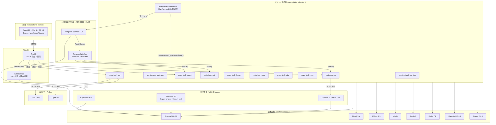
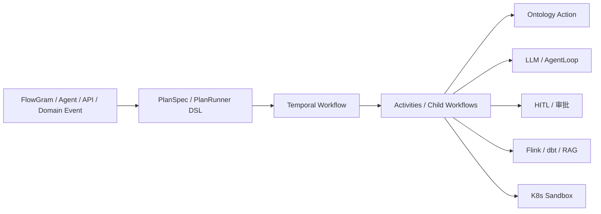
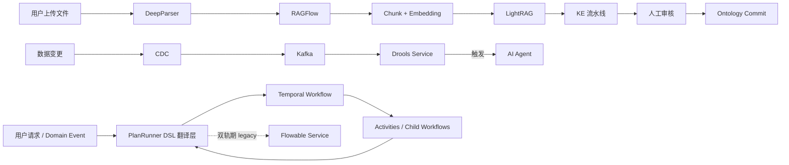
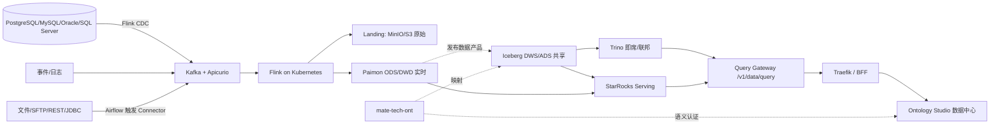

# Mate Platform 技术架构 v3.x（实施版）

> **版本**：v3.1-implementation.4 | **日期**：2026-08-25 | **状态**：实施基线 + Temporal 目标态已接受（迁移未完成）
>
> **配套文档**：
> - 技术栈定稿：`2026-07-27-mate-platform-tech-stack-confirmed.md`
> - 交付版本计划：`2026-07-27-mate-platform-delivery-roadmap.md`
> - Workflow 决策：`../decisions/ADR-0061-temporal-as-workflow-engine.md`
> - Workflow 迁移计划：`../V1.0-RELEASE-PLAN.md` §2.2 Sprint 1A
> - 历史决策归档：`archive/2026-07-27-mate-platform-technical-architecture-v2.1.md`
>
> **阅读优先级**：本文件 §1.3 与附录 B 是 ADR-0061 的目标架构覆盖层；正文中的 Flowable 部署细节描述迁移前/双轨期 legacy 运行时。发生冲突时，以 ADR-0061、§1.3 和附录 B 为准。Temporal 已完成架构选型，但 Sprint 1A 当前仍为 `Not Started`，不得把目标态写成已上线事实。

---

## 1. 系统总览

### 1.1 架构总图



### 1.2 服务全景

| 层 | 服务 | 语言 | 镜像 / 版本 | 端口 |
|---|---|---|---|---|
| **网关** | Traefik | Go | `traefik:v3.x` | 80 / 443 |
|  | AuthService | Python | `python:3.12` | 8000 |
| **Python 主后端** | mate-tech-rag | Python | `python:3.12` | 8080 |
|  | mate-tech-agent | Python | `python:3.12` | 8080 |
|  | mate-tech-llmgw | Python | `python:3.12` | 8080 |
|  | mate-tech-ont | Python | `python:3.12` | 8080 |
|  | mate-tech-msg | Python | `python:3.12` | 8080 |
|  | mate-tech-obs | Python | `python:3.12` | 8080 |
|  | mate-tech-mcp | Python | `python:3.12` | 8080 |
|  | mate-app-kb | Python | `python:3.12` | 8080 |
| **可靠编排（目标态）** | mate-tech-orchestrator / PlanRunner | Python | `python:3.12` | 8080 |
|  | Temporal Service | Go | 锁定版（由 Sprint 1A 固化） | 7233 |
|  | Temporal Worker | Python | `temporalio` SDK 锁定版 | 内部 Task Queue |
|  | Temporal UI | TypeScript / Go | 与 Temporal Service 同版本线 | 集群内部 |
| **外部引擎** | Keycloak | Java | `quay.io/keycloak/keycloak:25.0` | 8080 |
|  | Flowable engine（legacy） | Java | `flowable/flowable-engine:8.0.0` | 8081 |
|  | Flowable task（legacy） | Java | `flowable/flowable-task:8.0.0` | 8082 |
|  | Flowable rest（legacy） | Java | `flowable/flowable-rest:8.0.0` | 8083 |
|  | Drools KIE Server | Java | `jboss/kie-server:7.74` | 8180 |
| **AI 服务** | RAGFlow | Python | `infiniflow/ragflow:v0.13` | 9621 |
|  | LightRAG | Python | `hkuds/lightrag:latest` | 9622 |
| **基础设施** | PostgreSQL | C | `postgres:16-alpine` | 5432 |
|  | Neo4j | Java | `neo4j:5.x` | 7687 |
|  | Milvus | Go + C++ | `milvusdb/milvus:v2.5.0` | 19530 |
|  | MinIO | Go | `minio/minio:RELEASE.2024-10-13` | 9000 |
|  | Redis | C | `redis:7-alpine` | 6379 |
|  | Kafka | Java + Scala (KRaft) | `confluentinc/cp-kafka:7.8.0` | 9092 |
|  | RabbitMQ | Erlang | `rabbitmq:3.13-management-alpine` | 5672 |
|  | Nacos | Java | `nacos/nacos-server:v2.4.3-slim` | 8848 |
|  | Loki | Go | `grafana/loki:3.3.2` | 3100 |

### 1.3 Workflow 目标架构覆盖层（ADR-0061）

**架构原则**：Temporal 是统一的可靠编排控制面，不是通用计算、数据、消息或业务服务引擎。所有需要持久状态、跨服务步骤、重试/超时、HITL、长时间等待、补偿或版本灰度的流程优先进入 Temporal；单次低延迟 CRUD、纯查询和无恢复要求的同步调用不强制经过 Temporal。



| 能力 | Temporal 的职责 | 不由 Temporal 取代的部分 |
|---|---|---|
| 业务 Workflow / 审批 / HITL | Workflow 状态、Signal、Timer、retry、timeout、恢复、版本灰度 | 业务规则、审批 UI、第三方审批 API |
| Agent / LLM | 外层生命周期、步骤可靠执行、长任务恢复 | AgentLoop / LangGraph 的内部推理与工具决策 |
| Ontology Action | 多步骤或需确认的 Action 编排；Activity 调用 `confirm_then_apply` | Ontology Kernel、ActionType 语义和同步单步执行 |
| 数据与 AI 作业 | 编排 Flink、dbt、RAG 等作业的提交、等待、重试与补偿 | Flink 计算、Airflow 数据 DAG、查询引擎、模型推理本身 |
| 沙箱 | 创建、观察和回收 K8s Job 的可靠流程 | K8s / MicroVM 的资源与安全隔离 |
| 领域事件 | 由 Outbox/Kafka handler 启动 Workflow 或发送 Signal | Kafka/Outbox 的广播、订阅与事件保留 |
| 可视化编排 | 执行 FlowGram/Agent 产生的 PlanSpec/DSL | FlowGram 画布和业务流程建模体验 |

**确定性边界**：Workflow 代码只做确定性编排；HTTP、数据库、LLM、文件和随机/外部时间等调用必须放入幂等 Activity。Temporal SDK 直接接入，不通过通用 httpx ACL 模拟。

**迁移状态**：ADR-0061 已 `Accepted`；Sprint 1A 尚未完成。迁移期保留 `WORKFLOW_ENGINE=temporal|legacy` 和 plan 镜像表，按 `plan_id` 灰度。Flowable 只作为 legacy BPMN 运行时保留，不再承接新增业务 Workflow；达到 ADR-0061 验收门槛后退出主运行时。

---

## 2. 架构模式

### 2.1 Hexagonal Architecture（端口与适配器）

**四层结构**：
```
domain            -> 纯 Python，无外部依赖
application       -> 用例编排，通过 ports 调用 domain
infrastructure    -> 实现 ports：persistence + clients
api               -> FastAPI routes + DTO
```

**约束**：
- `domain` 不依赖任何外部包
- `application` 只依赖 `domain` 和 `ports`
- `infrastructure` 实现 `ports`
- `api` 调用 `application`

### 2.2 DDD Bounded Context

| Context | 拥有者 | 核心模型 |
|---|---|---|
| Knowledge | mate-tech-rag | Document, Chunk, KnowledgeBase |
| Ontology | mate-tech-ont | Concept, Entity, Relation |
| Agent | mate-tech-agent | AgentRun, Task, Plan |
| Workflow | mate-tech-orchestrator + Temporal | PlanSpec, WorkflowExecution, Activity |
| Rule | Drools Service | RuleSet, Fact, Trigger |
| Identity | Keycloak | User, Realm, Role |
| App | mate-app-kb | Application, Module |

**上下文映射**：
- Knowledge <-> Ontology：Customer/Supplier
- Agent <-> Workflow：Open-Host Service
- Knowledge <-> Workflow：Shared Kernel

### 2.3 CQRS（读写分离）

| 路径 | 模型 | 优化方向 |
|---|---|---|
| Command（写） | Document, Chunk, Event | 强一致、事务性 |
| Query（读） | DocumentView, ChunkView | 高性能、可缓存 |

### 2.4 Event-Driven + Outbox Pattern

**核心流程**：
```
Command Handler 写入业务表（同一事务）
        |
        v
Outbox Publisher 读取 outbox 表，发送到 Kafka
        |
        v
消费者 At-least-once 消费，幂等处理
```

### 2.5 Durable Orchestration + Event-Driven

**应用场景**：S4 智能体编排、S5b 阈值触发
**实现**：Temporal 协调需要持久恢复的业务流程；Kafka/Outbox 继续传递领域事件并触发 Workflow/Signal。

### 2.6 Anti-Corruption Layer (ACL)

每个外部服务一个 Client。以下 Flowable Client 是双轨期 legacy 示例：
```python
# packages/mate-tech-rag/clients/flowable_client.py
class FlowableClient:
    def __init__(self, base_url, auth_token):
        self.client = httpx.AsyncClient(
            base_url=base_url,
            headers={"Authorization": f"Bearer {auth_token}"},
            timeout=30.0,
            limits=httpx.Limits(max_keepalive_connections=20),
        )

    async def deploy_bpmn(self, bpmn_xml: str, name: str) -> dict:
        response = await self.client.post(
            "/api/v1/bpm/process-definitions",
            json={"name": name, "xml": bpmn_xml},
        )
        response.raise_for_status()
        return response.json()

    async def start_process(self, process_key: str, variables: dict) -> dict:
        response = await self.client.post(
            "/api/v1/bpm/process-instances",
            json={"processDefinitionKey": process_key, "variables": variables},
        )
        response.raise_for_status()
        return response.json()
```

Temporal 不使用上述 HTTP ACL 模式；通过官方 SDK 实现 `TemporalClientPort`，并把外部 I/O 封装为 Activity。

### 2.7 Resilience Patterns

**Circuit Breaker**（pybreaker）：
```python
@circuit_breaker(failure_threshold=5, recovery_timeout=30)
async def call_flowable(self, request: dict) -> dict:
    return await self.http_client.post("/api/v1/bpm/...", json=request)
```

**Bulkhead**（httpx 独立连接池）：
```python
flowable_pool = httpx.AsyncClient(limits=httpx.Limits(max_connections=20))
drools_pool = httpx.AsyncClient(limits=httpx.Limits(max_connections=20))
lightrag_pool = httpx.AsyncClient(limits=httpx.Limits(max_connections=30))
```

**Retry with Exponential Backoff**（tenacity）：
```python
@retry(
    stop=stop_after_attempt(3),
    wait=wait_exponential(multiplier=1, min=2, max=10),
    retry=retry_if_exception_type(httpx.HTTPError),
)
async def call_with_retry(self, url: str) -> dict:
    ...
```

---

## 3. 外部引擎（Java 产品）

### 3.1 Keycloak（IAM/SSO）

| 项 | 值 |
|---|---|
| 镜像 | `quay.io/keycloak/keycloak:25.0` |
| 端口 | 8080 |
| 数据库 | PostgreSQL schema `keycloak` |
| 启动模式 | `start-dev --import-realm` |
| Python 接入 | `KeycloakClient`（OIDC + Admin REST） |
| 库 | `python-keycloak` + 自研 httpx |

**提供能力**：
- OIDC 鉴权（所有语言统一）
- JWT 颁发 + 校验
- Realm / Client / Role / User 管理
- SSO 单点登录

### 3.2 Flowable 8.0（Legacy BPMN，双轨期）

> 本节保留当前实现和迁移证据。新业务 Workflow 不再扩展 Flowable；目标运行时见 §1.3 与附录 B。

| 项 | 值 |
|---|---|
| 镜像 | engine / task / rest 三服务：`flowable/flowable-*:8.0.0` |
| 端口 | engine:8081 / task:8082 / rest:8083 |
| 数据库 | PostgreSQL schema `flowable` |
| Python 接入 | `FlowableClient`（自研 httpx，调用 rest:8083） |
| 调用场景 | 迁移前 S4/BPMN 实例兼容、双轨对比与回滚 |

**架构变化**（vs 7.x）：云原生分布式，engine / task / rest 拆分独立部署。

**REST API 路径**：`/api/v1/bpm/process-definitions`、`/api/v1/bpm/process-instances`、`/api/v1/bpm/tasks` 等。

### 3.3 Drools / KIE Server（规则引擎）

| 项 | 值 |
|---|---|
| 镜像 | `jboss/kie-server:7.74` |
| 端口 | 8180 |
| 数据库 | PostgreSQL schema `drools` |
| Python 接入 | `DroolsClient`（自研 httpx） |
| 调用场景 | S5b 阈值触发、规则评估、决策表执行 |

**规则存储**：`packages/mate-tech-msg/rules/*.drl` Git 管理。

---

## 4. Python 主后端

### 4.1 技术栈

| 组件 | 选型 | 版本 |
|---|---|---|
| 包管理 | **uv**（Astral） | latest |
| Web 框架 | **FastAPI** | 0.115+ |
| ASGI 服务器 | uvicorn + uvloop + granian | latest |
| 数据验证 | **Pydantic v2** | latest |
| ORM | SQLAlchemy 2.0 + **SQLModel** | latest |
| PG 驱动 | psycopg[binary,pool] 或 asyncpg | latest |
| Neo4j 驱动 | neo4j Python driver | 5.x |
| Milvus 驱动 | pymilvus | latest |
| MinIO 驱动 | minio-py | latest |
| Redis 驱动 | redis-py | latest |
| Kafka 驱动 | aiokafka | latest |
| HTTP 客户端 | **httpx** | latest |
| LLM 编排 | **LangChain + LlamaIndex** | 1.3+ |
| 多 Agent | **LangGraph** | 1.2.9+ |
| MCP | mcp-python-sdk | latest |
| 类型检查 | **pyright**（strict 必开） | latest |
| 测试 | pytest + pytest-asyncio + hypothesis | latest |
| 代码质量 | **Ruff** | latest |
| 重试 | tenacity | latest |
| 熔断 | pybreaker | latest |

### 4.2 项目结构

```
mate-platform-backend/                    # Python 主后端 monorepo（uv）
|-- pyproject.toml                        # uv 管理 + 所有依赖
|-- ruff.toml                             # 代码规范
|-- pyrightconfig.json                    # 类型检查（strict）
|-- contracts/
|   `-- openapi/                          # Swagger/OpenAPI 3.1
|       |-- shared/common.yaml
|       |-- iam.yaml
|       |-- knowledge.yaml
|       |-- ontology.yaml
|       |-- agent.yaml
|       |-- llmgw.yaml
|       |-- msg.yaml
|       |-- obs.yaml
|       |-- mcp.yaml
|       |-- bpmn.yaml                     # Flowable 封装
|       `-- rules.yaml                    # Drools 封装
|-- packages/
|   |-- mate-common/                      # 公共 DTO / 异常 / 工具
|   |-- mate-tech-rag/                    # RAG 业务
|   |   |-- domain/
|   |   |-- services/
|   |   |-- repositories/
|   |   |-- clients/                      # ACL Client 集
|   |   |   |-- ragflow_client.py
|   |   |   |-- lightrag_client.py
|   |   |   |-- flowable_client.py
|   |   |   `-- drools_client.py
|   |   `-- api/
|   |-- mate-tech-agent/                  # Agent（LangGraph）
|   |-- mate-tech-llmgw/                  # LLM 路由
|   |-- mate-tech-msg/                    # 消息
|   |-- mate-tech-obs/                    # 可观测
|   |-- mate-tech-ont/                    # Ontology
|   |-- mate-tech-mcp/                    # MCP 协议
|   `-- mate-app-kb/                      # 业务 APP-KB
|-- services/
|   |-- auth-service/                     # JWT + 租户识别
|   `-- api-gateway/                      # 业务网关（如需要）
`-- rules/                                # Drools DRL 规则
    `-- *.drl
```

### 4.3 关键代码模式

**Pydantic v2（严格模式）**：
```python
from pydantic import BaseModel, Field, ConfigDict
from typing import Annotated, Literal

class DocumentMeta(BaseModel):
    model_config = ConfigDict(strict=True, frozen=True)

    id: Annotated[str, Field(min_length=1, max_length=64)]
    tenant_id: Annotated[str, Field(min_length=1, max_length=64)]
    title: Annotated[str, Field(min_length=1, max_length=255)]
    file_type: Literal["pdf", "docx", "pptx", "xlsx", "md", "txt"]
    size_bytes: Annotated[int, Field(ge=0)]
```

**SQLModel（类型安全 ORM）**：
```python
from sqlmodel import SQLModel, Field as SQLField

class Document(SQLModel, table=True):
    __tablename__ = "documents"

    id: str = SQLField(primary_key=True)
    tenant_id: str = SQLField(index=True)
    title: str
    status: Literal["pending", "processing", "ready", "failed"] = "pending"
```

**FastAPI 路由（legacy Flowable 兼容入口）**：
```python
from fastapi import FastAPI, Depends

app = FastAPI(title="Mate Platform API", version="3.0")

def get_flowable() -> FlowableClient:
    return FlowableClient(base_url="http://flowable-rest:8083", auth_token=...)

@app.post("/api/v1/workflow/generate")
async def generate_workflow(
    req: WorkflowRequest,
    flowable: FlowableClient = Depends(get_flowable),
):
    bpmn_xml = await llm_generate_bpmn(req.description)
    deployment = await flowable.deploy_bpmn(bpmn_xml, name=req.description)
    instance = await flowable.start_process(
        process_key=deployment["key"],
        variables=req.variables,
    )
    return {"deploymentId": deployment["id"], "instanceId": instance["id"]}
```

新增 Workflow 入口应提交 PlanSpec/DSL 并启动 Temporal Workflow，不再生成并部署新的 Flowable BPMN 实例。

---

## 5. 前端（metaplatform-frontend）

### 5.1 技术栈

| 组件 | 选型 | 版本 |
|---|---|---|
| 包管理 | pnpm | 9.0+ |
| 构建 | Vite | 6.4 |
| UI 框架 | React | 19 |
| 语言 | TypeScript | 5.7（strict） |
| HTTP | axios | 1.18 |
| UI 库 | Semi UI | 2.101 |
| UI 库（次） | Ant Design | 6.0 |
| 流程编辑器 | Flowgram.ai | 1.0.x |
| 图编辑器 | AntV X6 | 3.0 |
| E2E | Playwright | 1.61 |

### 5.2 应用清单

```
metaplatform-frontend/
|-- apps/
|   |-- portal/         # 主入口
|   |-- dashboard/      # 仪表盘
|   |-- ontstudio/      # Ontology 工作台
|   |-- kb/             # 知识库
|   |-- mcphub/         # MCP Hub
|   |-- apphub/         # App 市场
|   |-- arch/           # 架构
|   |-- dw/             # 数据工作台
|   `-- superai/        # Super AI
`-- packages/
    `-- shared/         # 共享组件 / 菜单 / 布局
```

---

## 6. 数据架构

### 6.1 数据归属

| 数据 | 存储 | 拥有服务 | 语言 |
|---|---|---|---|
| 原始文件 | MinIO | DeepParser | Python |
| ParsedDocument | PostgreSQL `rag.*` | Retrieval | Python |
| Chunk + Embedding | PostgreSQL + Milvus | Retrieval | Python |
| GraphRAG 图 | Neo4j `lrag-graph` | LightRAG | Python |
| **Workflow Event History（目标态）** | Temporal persistence schema | Temporal Service | Go / Python Worker |
| **Plan 查询镜像（迁移期）** | PostgreSQL plan mirror | mate-tech-orchestrator | Python |
| **BPMN 流程定义（legacy）** | PostgreSQL `flowable.*` | Flowable Service | Java |
| **BPMN 流程实例（legacy）** | PostgreSQL `flowable.*` | Flowable Service | Java |
| **规则定义** | PostgreSQL `drools.*` | Drools Service | Java |
| **用户/租户/凭证** | PostgreSQL `keycloak.*` | Keycloak | Java |
| Ontology | Neo4j `tech-ont` | TECH-ONT | Python |
| Citation | PostgreSQL `rag_citation.*` | Retrieval | Python |
| 事件 | Kafka | 各服务 | 多语言 |
| 缓存 | Redis | 各服务 | 多语言 |
| 可观测 | OpenTelemetry -> Loki | 全服务 | 多语言 |

### 6.2 跨服务数据流



### 6.3 隔离策略

- **PostgreSQL**：多 schema 隔离（`rag` / `flowable` / `drools` / `keycloak` / `ke`）
- **Neo4j**：3 database 隔离（`tech-ont` / `lrag-graph` / `rag-graphrag`）
- **Milvus**：collection 命名空间
- **跨服务**：通过业务 ID（`docId` / `kbId` / `processKey`）桥接

---

## 7. 网关与服务发现

### 7.1 Traefik（边缘网关）

| 项 | 值 |
|---|---|
| 镜像 | `traefik:v3.x` |
| 部署 | docker-compose 容器 |
| 职责 | TLS 终止 + 路由 + 限流 + 熔断 + traceId 注入 |
| 配置 | 静态（`traefik.yml`）+ 动态（Nacos provider） |
| 服务发现 | Traefik Nacos provider |

**中间件链**：
```
Traefik -> rate-limit -> forward-auth (-> AuthService) -> trace-id 透传 -> Python 服务
```

### 7.2 AuthService（鉴权）

| 项 | 值 |
|---|---|
| 镜像 | `python:3.12` |
| 端口 | 8000 |
| 职责 | JWT 校验 + 租户识别 + headers 注入（X-Tenant-Id / X-User-Id / X-Trace-Id） |
| 调用方式 | Traefik `forwardAuth` 中间件 |
| 不做 | 切流决策（无灰度切流） |

### 7.3 Nacos（服务发现 + 配置中心）

| 项 | 值 |
|---|---|
| 镜像 | `nacos/nacos-server:v2.4.3-slim` |
| 端口 | 8848（HTTP）+ 9848（gRPC） |
| 用途 | 服务注册 + 配置中心 + Traefik provider 数据源 |

---

## 8. 部署架构

### 8.1 docker-compose 服务清单

完整服务清单见 `docker-compose.yml`：

```yaml
# 基础设施
postgres, redis, nacos, minio, milvus, kafka, rabbitmq, loki

# 外部引擎（Java 产品；Flowable 仅双轨期 legacy）
keycloak          # :8080
flowable-engine   # :8081
flowable-task     # :8082
flowable-rest     # :8083
kie-server        # :8180

# 可靠编排目标态（Sprint 1A Helm/K8s；不以当前 Compose 存在作为已上线证据）
temporal-service  # :7233
temporal-worker   # internal task queue
temporal-ui       # cluster internal

# 网关层
traefik           # :80 / :443
auth-service      # :8000

# Python 主后端（按需启动）
mate-tech-rag, mate-tech-agent, mate-tech-llmgw,
mate-tech-ont, mate-tech-msg, mate-tech-obs, mate-tech-mcp,
mate-app-kb

# AI 服务
ragflow, lightrag

# 开发工具
swagger-editor    # :8083
swagger-ui        # :8084
prism-mock        # :4010
```

### 8.2 端口分配总表

| 端口 | 服务 |
|---|---|
| 80 / 443 | Traefik |
| 5432 | PostgreSQL |
| 6379 | Redis |
| 8848 / 9848 | Nacos |
| 9000 / 9001 | MinIO |
| 19530 / 9091 | Milvus |
| 9092 | Kafka |
| 5672 / 15672 | RabbitMQ |
| 3100 | Loki |
| 4010 | Prism Mock |
| 8000 | AuthService |
| 8080 | Keycloak / 各 Python 服务 |
| 7233 | Temporal Service（目标态） |
| 8081 / 8082 / 8083 | Flowable engine / task / rest（legacy） |
| 8083 | Swagger Editor |
| 8084 | Swagger UI |
| 8180 | KIE Server |
| 9621 / 9622 | RAGFlow / LightRAG |

---

## 9. 监控与可观测性

### 9.1 OpenTelemetry

| 组件 | 用途 |
|---|---|
| Python SDK | `opentelemetry-python` |
| 自动埋点 | FastAPI / SQLAlchemy / httpx / aiokafka |
| traceId 透传 | Traefik headers -> Python OTel context |

### 9.2 Loki（日志聚合）

| 组件 | 用途 |
|---|---|
| 镜像 | `grafana/loki:3.3.2` |
| 收集 | 各服务 stdout -> Promtail / 直接推送 |
| 端口 | 3100 |

### 9.3 关键指标

| 指标 | 目标 |
|---|---|
| API P95 延迟 | < 1.2s |
| RAG 查询 P95 | < 1s |
| BPMN 启动 P95 | < 2s |
| 规则评估 P95 | < 100ms |
| 整体 QPS | 30-50k |

---

## 10. 接口契约（Swagger/OpenAPI 3.1）

### 10.1 工具链

| 环节 | 工具 |
|---|---|
| 规范 | OpenAPI 3.1 |
| 编辑 | Swagger Editor（容器） |
| 文档展示 | Swagger UI（容器） |
| Mock | Prism（Stoplight） |
| CI 校验 | Redocly CLI + oasdiff（breaking change） |
| SDK | openapi-typescript（前端） |

### 10.2 docker-compose 集成

```yaml
swagger-editor    # :8083
swagger-ui        # :8084
prism-mock        # :4010
```

### 10.3 CI 校验（PR 必跑）

```yaml
- Redocly CLI lint（语法 + 规范校验）
- oasdiff breaking change（升级前阻断）
- Redocly bundle（多文件一致性）
```

---

## 11. 性能目标（KPI）

| 指标 | 目标 |
|---|---|
| API 主后端 P95 | < 1.2s |
| RAG 查询 P95 | < 1s |
| 主题查询 P95（LightRAG） | < 3s |
| BPMN 启动 P95 | < 2s |
| 规则评估 P95 | < 100ms |
| 整体 QPS | 30-50k |
| 启动时间 | 3-5s（vs Java 30-60s） |

---

## 12. 风险与缓解

| ID | 风险 | 等级 | 缓解 |
|---|---|---|---|
| R1 | Python 性能瓶颈（高并发） | 黄 | FastAPI + uvloop + granian 组合达 30-50k QPS |
| R2 | Python 类型安全弱 | 黄 | pyright strict + Pydantic v2 + 100% 测试覆盖 |
| R3 | Flowable 服务单点 | 绿 | 2 副本 + HPA + 健康检查 |
| R4 | Drools 规则管理复杂 | 黄 | Git 仓库管理 DRL + 版本控制 |
| R5 | Keycloak 集成复杂度 | 黄 | 业界标准，文档丰富 |
| R6 | 跨语言服务调试困难 | 黄 | 统一 OTel traceId + 标准化日志 + Loki |
| R7 | 单模块迁移失败（无 Java 兜底） | 红 | 充分预发布验证 + 蓝绿部署 + v_{n-1} 保留 7 天 |
| R8 | AI 生态继续演化 | 绿 | Python 路线与生态同步 |
| R13 | Temporal 学习曲线与 Workflow 非确定性 | 黄 | Workflow 只编排；外部 I/O 进 Activity；replay 与 grammar CI |
| R14 | Temporal/legacy 双轨数据不一致 | 黄 | plan 镜像 reconcile + 按 plan_id 灰度 + 切流冻结 schema |

---

## 13. 修订记录

| 日期 | 版本 | 变更 |
|---|---|---|
| 2026-07-27 | v3.0-implementation | 重写：删除决策历史（§ 0/1/9/13/14），精简设计模式，明确每个组件和技术栈；Flowable 7.x -> 8.0 |
| 2026-07-27 | v3.0-implementation.1 | Python 镜像：python:3.12-slim -> python:3.12 (完整版) |
| 2026-07-27 | v3.0-implementation.2 | 服务全景表明确每个组件实际语言（Go/C/Java/Erlang/Python），不再用 - 占位 |
| 2026-07-28 | v3.0-implementation.3 | 追加附录 A：v3.1 Data-Ready Baseline（mate-tech-data + Flink + Airflow + Paimon + Iceberg + Trino + StarRocks + 治理栈），不破坏 v3.0 主架构 |
| 2026-08-25 | v3.1-implementation.4 | 同步 ADR-0061：Temporal 成为可靠编排控制面；PlanRunner 退化为 DSL 翻译层；Flowable 标记为双轨期 legacy；明确 Activity、数据引擎、AgentLoop、Kafka/Outbox 与沙箱边界 |

---

## 附录 A：v3.1 Data-Ready Baseline（2026-07-28 同步）

> 本附录是 v3.0 实施基线的增量说明，用于补齐大数据 ETL、湖仓与治理能力。
> 详细设计见 `docs/superpowers/specs/2026-07-28-mate-platform-big-data-etl-design.md`。
> 本节属于文档基线更新，不构成新独立产品，不变更 Python 主后端结构，只在现有本体论引擎的「数据中心」中内嵌新增能力。

### A.1 增量服务

| 层 | 服务 | 语言 | 关键镜像/版本 | 端口 | 角色 |
|---|---|---|---|---|---|
| Python 主后端（新增） | mate-tech-data | Python 3.12 | python:3.12 | 8080 | 数据平台控制面、Pipeline、SQL Gateway、目录、血缘、质量 |
| 外部开源引擎（新增） | Flink JobManager / TaskManager | Java + Scala | flink:1.19 + Flink Kubernetes Operator | 8081 | 批流统一计算（CDC / Flink SQL / DataStream / PyFlink） |
|  | Airflow 3.x | Python | apache/airflow:3.0-python3.12 | 8082 | 数据 DAG、调度、补数、回填 |
|  | Apache Paimon | Java | apache/paimon:0.9 | — | ODS/DWD 实时主键与变更表 |
|  | Apache Iceberg | Java | apache/iceberg-rest:1.5 | — | DWS/ADS 开放共享数据产品 |
|  | Trino | Java | trinodb/trino:455 | 8083 | 即席/联邦 SQL 查询 |
|  | StarRocks | C++ | starrocks/fe-ubuntu:3.3 | 9030 / 8040 | 高并发指标、报表、Data API |
|  | Apache Gravitino | Java | apache/gravitino:0.7 | 8090 | 运行时多 Catalog 注册 |
|  | OpenMetadata | Java | openmetadata/server:1.4 | 8585 | 治理目录、Owner、Glossary、血缘 |
|  | OpenLineage | Java | openlineage/marquez:0.50 | — | 统一运行时血缘事件 |
|  | Great Expectations | Python | great-expectations/great_expectations:0.18 | — | 批量质量与对账 |
|  | Apache Ranger | Java | apache/ranger:2.4 | 6080 | 行列权限、动态脱敏、审计 |
|  | OpenBao | Go | openbao/openbao:1.15 | 8200 | 连接器密钥、动态凭证、轮换 |

Flink 为主计算引擎，Airflow 保留数据 DAG 调度；Temporal 负责跨域业务流程、人工审批等待与长任务可靠编排。Flowable 仅作为双轨期 legacy 运行时。
旧 Java `docs/legacy/tech-java-legacy/TECH-DATA` 不恢复上线，只作为 API/模型迁移参考。

### A.2 增量数据流



### A.3 控制面（Python 模块化单体）

`mate-tech-data` 内部 Bounded Context：connector、pipeline、orchestration、catalog、governance、query；吞吐和引擎状态保留在 Flink / Kafka / 湖仓中。

### A.4 与 v3.0 的关系

- v3.0 主架构、Python 主后端、网关与前端入口不变。
- 新增 `mate-tech-data` 与上述外部引擎，不引入新的微服务拆分；`mate-tech-data` 仍由 Python monorepo 与 uv 管理。
- 旧 Java `TECH-DATA` 保持归档，不作为 v3.0/v3.1 生产依赖。
- 容量、性能、可靠性目标在 §11、§12 同步追加。

### A.5 章节位置同步

| v3.0 章节 | 增量内容 |
|---|---|
| §1.2 服务全景 | 追加 A.1 表（v3.1 增量服务） |
| §6.1 数据归属 | 增加湖仓/治理/调度条目 |
| §6.2 跨服务数据流 | 替换为 A.2 图 |
| §8 部署架构 | K8s 数据平面 + Compose profiles |
| §11 性能目标 | 增加 Gold/Silver P95、StarRocks/Trino 目标 |
| §12 风险与缓解 | 增加 R9–R12 风险 |

具体正文重写交由实施计划阶段以保持增量改动可回滚。

### A.6 性能与风险（增量）

- 性能新增：Gold 实时端到端 P95 < 5s；Silver 准实时 P95 < 60s；StarRocks P95 1–3s；Trino 交互查询 P95 5–30s；控制面 ≥ 99.9%。
- 风险新增 R9：Paimon/Iceberg 兼容；R10：500 Pipeline 资源争用；R11：自定义作业越权；R12：双格式治理不统一。

## 附录 B：Temporal Workflow 迁移覆盖层（2026-08-25）

### B.1 决策与状态

- 决策源：`docs/active/decisions/ADR-0061-temporal-as-workflow-engine.md`（Accepted，2026-08-21）。
- 交付源：`docs/active/V1.0-RELEASE-PLAN.md` §2.2 Sprint 1A（当前 `Not Started`）。
- 目标：Temporal 接管业务 Workflow 的持久化执行；PlanRunner 保留为 LLM-friendly `plan JSON` → Workflow 的 DSL 翻译层。
- 非目标：不以 Temporal 替换 FastAPI CRUD、Kafka/Outbox、Flink/Airflow 计算与数据 DAG、LangGraph/AgentLoop 内部推理、Drools 规则求值或 K8s 沙箱。

### B.2 迁移顺序

1. 部署 Temporal Service、Worker、UI、NetworkPolicy 与持久化 schema。
2. 落地 PlanRunner DSL 翻译层和 5 类 Activity。
3. 将 HITL approve/reject 改为 Temporal Signal；保持 `confirm_then_apply` 语义。
4. 接入 Outbox → Temporal start/signal bridge 与只读 plan 镜像。
5. 通过 `WORKFLOW_ENGINE=temporal|legacy` 按 `plan_id` 灰度并完成双轨对比。
6. 达到 ADR-0061 验收条件后退出 Flowable 主运行时；legacy 数据按保留策略只读归档。

### B.3 新增流程准入规则

满足下列任一条件时使用 Temporal：跨服务多步骤、需等待人或外部系统、运行时间不可控、必须自动恢复、需要统一 retry/timeout/补偿、需要执行历史与版本灰度。仅包含一次同步读写、严格低延迟且调用方可安全重试的请求，可保留直接服务调用。

## 引用

- 设计规格：docs/superpowers/specs/2026-07-28-mate-platform-big-data-etl-design.md
- 主架构：docs/active/specs/2026-07-27-mate-platform-architecture-implementation.md

## 14. 引用

- 技术栈定稿：`2026-07-27-mate-platform-tech-stack-confirmed.md`
- 交付版本计划：`2026-07-27-mate-platform-delivery-roadmap.md`
- Docker Compose：`docker-compose.yml`
- 前端 monorepo：`metaplatform-frontend/`
- 历史决策文档（已归档）：`archive/2026-07-27-mate-platform-technical-architecture-v2.1.md`
