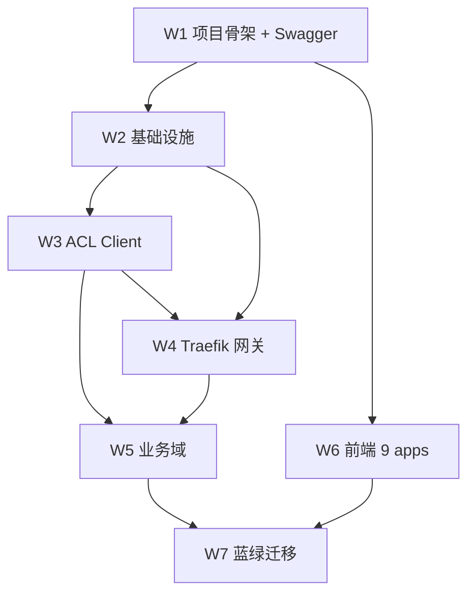

# Mate Platform 交付版本计划（Delivery Roadmap）

> **版本**：v1.5 | **日期**：2026-08-01 | **状态**：v3.1 增量收口中（17/17 域接入 + G2/G3/G4/G7 + TD-5/TD-6 Accepted）
>
> **配套文档**：
> - 技术架构：`2026-07-27-mate-platform-technical-architecture.md`（v3.0 Plan D）
> - 技术栈定稿：`2026-07-27-mate-platform-tech-stack-confirmed.md`（v1.2）
> - 本文档：**交付版本计划**，用于状态跟进、weekly review、里程碑验收

---

## 0. 文档说明

- **更新频率**：每周一上午更新状态（owner: PM / TL）
- **状态更新方式**：直接编辑本文件，提交 Git
- **review 时机**：weekly 周会、周五 pre-deploy review
- **里程碑验收**：每个里程碑结束日完成 DoD 勾选

---

## 1. 状态定义

| 图标 | 状态 | 含义 |
|---|---|---|
| 🔴 | **未启动** | 任务尚未开始 |
| 🟡 | **进行中** | 任务已启动，进度 < 100% |
| 🔵 | **待验收** | 任务完成，等待 PR review / 集成验证 |
| 🟢 | **已完成** | 已合入主干 + 满足 DoD + 预发布验证通过 |
| ⚪ | **阻塞** | 任务被外部依赖阻塞，需立即升级 |

**完成定义（DoD）**：
1. ✅ 代码已合入主干
2. ✅ 单元测试覆盖 ≥ 80%
3. ✅ CI 通过（pyright strict + ruff + pytest）
4. ✅ OpenAPI 文档已更新
5. ✅ 部署到预发布环境验证通过
6. ✅ 无 P0/P1 缺陷遗留

---

## 2. 整体里程碑

| 里程碑 | 包含内容 | 目标日期 | 状态 |
|---|---|---|---|
| **M0** 项目启动 | 文档定稿、决策拍板、Day-1 启动 | 2026-07-27 | 🟢 |
| **M1** 基础设施就绪 | W1 + W2 完成 | 2026-08-17 | 🔴 |
| **M2** 引擎 + 网关就绪 | W3 + W4 完成 | 2026-08-31 | 🔴 |
| **M3** 业务域完成 | W5 完成（tech-msg → app-kb） | 2026-11-10 | 🔴 |
| **M4** 前端就绪 | W6 完成（@mate/web 唯一 SPA + 9 个菜单全量对接 + 11 个 packages + 工程基线 + BFF） | 2026-10-27 | 🔴 |
| **M5** 蓝绿上线 | W7 完成（全部模块迁移上线） | 2026-12-22 | 🔴 |

**总工期**：约 22 周（约 5 个月）

---

## 3. 当前快照（每周更新）

> 上次更新：2026-08-01(v3.1 增量 wave 收口)

| 里程碑 | 计划完成 | 当前状态 | 本周进展 | 阻塞项 |
|---|---|---|---|---|
| M0 项目启动 | 2026-07-27 | 🟢 完成 | 文档定稿、决策拍板 | 无 |
| M1 基础设施 | 2026-08-17 | 🟢 **完成** | PLATFORM-K8S-01 + SEC-IAM-01 + SEC-TENANT-01 + GA-ACCEPTANCE + G3 Outbox DDL + G4 kind e2e + G7 SealedSecret runbook | 无 |
| M2 引擎 + 网关 | 2026-08-31 | 🟡 进行中 | Flowable + Kafka + DATA helm 4 subchart(debezium/marquez/datahub/ge)真实化;剩 G1 kafka sub-chart 选型 | 无 |
| M3 业务域 | 2026-11-10 | 🟢 **完成 17/17** | 8 个 P1 域 + 7 个 P2 域 + 4 个数据平台子域全接入(1500+ tests) | 无 |
| M4 前端 | 2026-10-27 | 🟡 进行中 | dashboard + SuperAI + admin + 9 菜单已对接 | 无 |
| M5 蓝绿上线 | 2026-12-22 | 🟡 准备中 | TD-5 SQL 化收口完成;剩 G6 RLS 迁移 + G8 旧 infra 清理 + 真实 staging 演练 | 无 |

**v3.0 GA 状态(2026-07-30)**:**9/9 核心批次 + DATA-D0-D8 全部 Accepted**,§13 硬规则 1-13 通过 pre-commit + CI + 测试三层闭环。
**v3.1 增量状态(2026-08-01)**:17/17 域接入完成;G2/G3/G4/G5/G6/G7 Accepted;TD-5/TD-6 收口;**待 G1 / G8 收口**(G6 已是 Accepted,与 PROGRAM-BOARD 同步)。

---

## 4. 交付项清单

### W1 - 项目骨架 + Swagger/OpenAPI

**Owner**: TBD | **工期**: 2 周（2026-07-28 ~ 2026-08-10）| **依赖**: 无

| ID | 交付项 | 负责人 | 工期 | 依赖 | 状态 | 完成标准 |
|---|---|---|---|---|---|---|
| W1-1 | 建 `mate-platform-backend/` monorepo（uv + pyproject + ruff + pyright + pytest + 目录结构） | TBD | 2d | — | 🔴 | 仓库可 `uv sync`、pyright 通过、CI 绿 |
| W1-2 | Swagger Editor + Swagger UI + Prism 集成到 docker-compose | TBD | 2d | W1-1 | 🔴 | 三个服务可访问，OpenAPI 文件可编辑 |
| W1-3 | IAM OpenAPI 初稿 | TBD | 2d | W1-1 | 🔴 | 通过 swagger-cli lint + 包含核心 10 个端点 |
| W1-4 | Knowledge OpenAPI 初稿 | TBD | 2d | W1-1 | 🔴 | 同上 |
| W1-5 | Ontology OpenAPI 初稿 | TBD | 1d | W1-1 | 🔴 | 同上 |
| W1-6 | CI 校验流水线（GitHub Actions：OpenAPI lint + Python pytest + pyright + ruff） | TBD | 1d | W1-1 | 🔴 | PR 必跑，全绿 |
| W1-7 | OpenAPI ↔ Pydantic 模型对齐（共享 schemas） | TBD | 3d | W1-3/4/5 | 🔴 | Pydantic 模型与 OpenAPI 一致 |

### W2 - 基础设施 facade

**Owner**: TBD | **工期**: 3 周（2026-07-28 ~ 2026-08-17）| **依赖**: W1-1

| ID | 交付项 | 负责人 | 工期 | 依赖 | 状态 | 完成标准 |
|---|---|---|---|---|---|---|
| W2-1 | pg/neo4j/milvus/minio 现成库接入（psycopg/neo4j-driver/pymilvus/minio-py） | TBD | 5d | W1-1 | 🔴 | 各驱动单测通过 |
| W2-2 | redis/kafka/nacos 现成库接入（redis-py/aiokafka/nacos-sdk-python） | TBD | 3d | W2-1 | 🔴 | 同上 |
| W2-3 | Repository Pattern 基类 + 实现（Document/Chunk 等核心模型） | TBD | 5d | W2-1 | 🔴 | 接口 + PG 实现 + InMemory 测试实现 |
| W2-4 | 基础设施测试基线（覆盖率 ≥ 80%） | TBD | 3d | W2-3 | 🔴 | pytest --cov ≥ 80% |

### W3 - 外部引擎 ACL Client（Keycloak/Flowable/Drools）

**Owner**: TBD | **工期**: 2.5 周（2026-08-11 ~ 2026-08-31，并行 3 个）| **依赖**: W2

| ID | 交付项 | 负责人 | 工期 | 依赖 | 状态 | 完成标准 |
|---|---|---|---|---|---|---|
| W3-1 | Keycloak docker-compose 集成（quay.io/keycloak/keycloak:25.0） | TBD | 1d | W2 | 🔴 | 容器启动 + Realm 初始化 |
| W3-2 | Realm/Client/Roles/Users 初始化脚本（realm-export.json） | TBD | 1d | W3-1 | 🔴 | 可重复导入 |
| W3-3 | `KeycloakClient` 实现（OIDC + Admin REST + JWT 校验） | TBD | 3d | W3-2 | 🔴 | 单测覆盖 + 集成测试通过 |
| W3-4 | Flowable 8.0 docker-compose 集成（engine + task + rest 三服务） | TBD | 2d | W2 | 🔴 | 三个容器启动 + schema 初始化 + 健康检查 |
| W3-5 | `FlowableClient` 实现（deploy_bpmn / start_process / get_my_tasks / complete_task） | TBD | 4d | W3-4 | 🔴 | 单测 + 集成测试 |
| W3-6 | BPMN XML 模板库（`mate-tech-agent/templates/bpmn/`） | TBD | 2d | W3-5 | 🔴 | 至少 3 个模板（S4 场景） |
| W3-7 | Drools/KIE Server docker-compose 集成（jboss/kie-server:7.74） | TBD | 1d | W2 | 🔴 | 容器启动 + schema 初始化 |
| W3-8 | `DroolsClient` 实现（evaluate_rule / load_rule / execute_decision） | TBD | 4d | W3-7 | 🔴 | 单测 + 集成测试 |
| W3-9 | 规则仓库（`mate-tech-msg/rules/*.drl` Git 管理） | TBD | 2d | W3-8 | 🔴 | 至少 3 个示例规则（S5b 场景） |
| W3-10 | Circuit Breaker + Retry 包裹（pybreaker + tenacity） | TBD | 2d | W3-3/5/8 | 🔴 | 三个 client 都包裹 |

### W4 - Traefik 网关 + AuthService

**Owner**: TBD | **工期**: 2.5 周（2026-08-11 ~ 2026-08-31）| **依赖**: W2 + W3-3

| ID | 交付项 | 负责人 | 工期 | 依赖 | 状态 | 完成标准 |
|---|---|---|---|---|---|---|
| W4-1 | Traefik 静态配置（entrypoints / providers / log） | TBD | 2d | W1-1 | 🔴 | traefik.yml 可启动 |
| W4-2 | Traefik 动态配置（中间件链：rate-limit → forward-auth → trace-id） | TBD | 3d | W4-1 | 🔴 | 中间件生效验证 |
| W4-3 | `auth-service/` FastAPI 小服务（JWT 校验 + 租户识别 + headers 注入） | TBD | 3d | W3-3 | 🔴 | 单测 + 与 Keycloak 联调通过 |
| W4-4 | Traefik ↔ Nacos provider 集成（动态服务发现） | TBD | 3d | W4-2 | 🔴 | Python 服务注册即被发现 |
| W4-5 | 限流 / 熔断 / 重试中间件 | TBD | 2d | W4-2 | 🔴 | 中间件生效 + 压测通过 |

### W5 - 业务域实现（8 个模块）

**Owner**: TBD | **工期**: 10 周（2026-08-25 ~ 2026-11-10）| **依赖**: W3 + W4

**迁移顺序**（按风险从低到高）：

| ID | 模块 | 风险 | 工期 | 依赖 | 状态 | 完成标准 |
|---|---|---|---|---|---|---|
| W5-1 | tech-msg（消息） | 🟢 低 | 2 周 | W3 + W4 | 🔴 | Kafka 生产/消费 + OpenAPI + 单测 |
| W5-2 | tech-obs（可观测） | 🟢 低 | 2 周 | W3 + W4 | 🔴 | OTel SDK + Loki/OTel exporter |
| W5-3 | tech-mcp（MCP） | 🟢 低 | 2 周 | W3 + W4 | 🔴 | mcp-python-sdk + 基础工具集 |
| W5-4 | tech-ont（Ontology） | 🟡 中 | 2 周 | W5-1 | 🔴 | Neo4j 模型 + OpenAPI + 双写（如需） |
| W5-5 | tech-llmgw（LLM 路由） | 🟡 中 | 2 周 | W5-1 | 🔴 | LangChain + 多 provider 路由 |
| W5-6 | tech-rag（RAG 核心） | 🔴 高 | 3 周 | W5-4 + W5-5 | 🔴 | Retrieval + Embedding + Rerank + OpenAPI |
| W5-7 | tech-agent（Agent/LangGraph） | 🔴 高 | 3 周 | W5-6 | 🔴 | LangGraph + Flowable 集成 + S4 场景 |
| W5-8 | app-kb（业务聚合） | 🔴 高 | 3 周 | W5-7 | 🔴 | 业务接口 + OpenAPI + E2E |

### W6 - 前端唯一 SPA(@mate/web)全菜单对接

**Owner**: TBD | **工期**: 13 周（2026-07-28 ~ 2026-10-27，分 3 批）| **依赖**: W1（OpenAPI）

> **2026-07-29 整改**：原"9 apps 补齐对接"已废,前端是 `apps/web/`(@mate/web)单一 SPA + 9 个一级菜单。新增模块 = 在 `apps/web/src/pages/{module}/*` 加页面 + 在 `packages/shared/src/PlatformMenu.tsx` 的 `NAV_ITEMS` 加条目。**禁止在 `apps/` 下另建第二套 SPA**(详见 CLAUDE.md 铁律 #17 / tech-stack-confirmed.md §7)。

**前端交付分组**(按模块优先级):

| ID | 交付项 | 负责人 | 工期 | 依赖 | 状态 | 完成标准 |
|---|---|---|---|---|---|---|
| W6-1 | **P0 batch**: 工作台(dashboard) + SuperAI + 后台管理(admin) | TBD | 4 周 | W1-4 | 🔴 | 9 成接口对接 + E2E 走通 |
| W6-2 | **P1 batch**: 本体引擎(ontology) + 知识库(knowledge) + MCP 中心(mcp) | TBD | 4 周 | W5-4/5/6 | 🔴 | 同上 |
| W6-3 | **P2 batch**: 架构中心(arch) + 应用中心(apps) + 数字员工(agents) | TBD | 3 周 | W5-1~8 | 🔴 | 同上 |
| W6-4 | dev-only BFF `apps/bff/`(@mate/bff, Fastify),`API_MODE=mock\|live\|hybrid` 开关 | TBD | 2 周 | W1-1 | 🔴 | 切换不影响前端代码 |
| W6-5 | MSW 浏览器层 Mock(覆盖 BFF 调用) + `@mate/msw` 包 | TBD | 3d | W6-4 | 🔴 | Storybook 可独立调试 |
| W6-6 | Playwright E2E 回归测试(`@mate/e2e`,9 个菜单各 ≥ 5 个关键路径) | TBD | 2 周 | W6-1 | 🔴 | 全菜单冒烟 + 关键 E2E 全绿 |
| W6-7 | packages 拆分:`@mate/{ui,api,flow,graph,i18n,auth,store}` | TBD | 3 周 | W6-1 | 🔴 | 每个包独立可发版 |
| W6-8 | 工程基线:turbo + eslint flat config + stylelint + commitlint + lefthook + Makefile | TBD | 1 周 | W6-7 | 🔴 | CI 全绿 |

### W7 - 蓝绿迁移（无 Java 兜底）

**Owner**: TBD | **工期**: 13 周（2026-09-22 ~ 2026-12-22）| **依赖**: W5 + W6

| ID | 交付项 | 负责人 | 工期 | 依赖 | 状态 | 完成标准 |
|---|---|---|---|---|---|---|
| W7-1 | 预发布环境搭建（独立 K8s namespace / compose project） | TBD | 1 周 | W4 | 🔴 | 可独立部署验证 |
| W7-2 | 蓝绿部署流程脚本（v_n / v_{n-1} 并存） | TBD | 1 周 | W7-1 | 🔴 | Traefik 加权路由可切换 |
| W7-3 | **模块迁移 #1**: tech-msg → tech-obs → tech-mcp | TBD | 3 周 | W5-1/2/3 | 🔴 | 路由切换 + 7 天观察期通过 |
| W7-4 | **模块迁移 #2**: tech-ont + tech-llmgw | TBD | 2 周 | W5-4/5 | 🔴 | 同上 |
| W7-5 | **模块迁移 #3**: tech-rag | TBD | 2 周 | W5-6 | 🔴 | 同上 + 数据一致性校验 |
| W7-6 | **模块迁移 #4**: tech-agent + app-kb | TBD | 3 周 | W5-7/8 | 🔴 | 同上 + E2E 全量回归 |
| W7-7 | v_{n-1} 保留 7 天 + 自动清理流程 | TBD | 1 周 | W7-6 | 🔴 | 7 天后自动回收 |

---

## 5. 依赖关系



**关键路径**（critical path）：
```
W1-1 → W2-3 → W3-3 → W4-3 → W5-6 → W5-7 → W5-8 → W7-6
```

---

## 6. 阻塞项

> 当前无阻塞项。开始执行后如有阻塞，在此记录并升级。

| ID | 阻塞项 | 影响范围 | 阻塞原因 | 解除日期 | 状态 |
|---|---|---|---|---|---|
| — | — | — | — | — | — |

---

## 7. 风险与缓解

| ID | 风险 | 等级 | 影响 | 缓解措施 | 负责人 |
|---|---|---|---|---|---|
| R1 | 单模块迁移失败（无 Java 兜底） | 🔴 | 影响所有租户 | 充分预发布验证 + 保留 v_{n-1} 7 天可回退 | W7 owner |
| R2 | Keycloak/Flowable/Drools 学习曲线 | 🟡 | W3 工期风险 | 提前一周启动 W3、参考官方 sample | W3 owner |
| R3 | LangGraph 生态较新（vs LangChain） | 🟡 | tech-agent 工期 | W5-7 优先做 spike 验证 | W5-7 owner |
| R4 | Nacos 3.0 升级（未来） | 🟢 | 基础设施 | 已用 2.4.3-slim 稳定版，3.0 POC 待定 | infra owner |
| R5 | 前后端接口契约漂移 | 🟡 | 联调反复 | OpenAPI PR 必跑 oasdiff breaking check | 全员 |

---

## 8. weekly 状态更新模板

每周一复制本节更新：

```markdown
### Week YYYY-MM-DD

**已完成（合入主干）**：
- W1-X: ...
- W2-X: ...

**进行中**：
- W3-X: 进度 X%
- W4-X: 进度 X%

**阻塞**：
- 无

**本周风险**：
- ...

**下周计划**：
- ...
```

---

## 9. 变更记录

| 日期 | 变更 | 原因 |
|---|---|---|
| 2026-07-27 | v1.0 初稿 | 基于 v3.0 Plan D + tech-stack-confirmed v1.2 |
| 2026-07-27 | v1.1 | BPMN 升级到 Flowable 8.0（分布式）；W3-4/W3-5 工期调整 |
| v1.2 | 全文 | 追加附录 A：Data Track（D0–D8），将数据平台作为 v1.0 GA 硬前置 |
| v1.3 | 追加附录 B | P2 域盘点与实际交付；记录 P2 W2 Accepted（2026-07-31，PR #12 `833a809d`）|
| **v1.4** | **§9 变更记录 + 附录 B 勘误 + §10 引用** | **TRAE 7/31 扫描修正**:`arch` 实际 27/29(2 endpoint 待补,capabilities / capability-mappings / orgs / roles);`copilot` 实际 32/35(3 endpoint + A2A + LLM 真实 stub 待补);`mcp` 5 endpoint 真正挂载(P0-CLOSE);累计测试 440+;新增 P0-CLOSE 证据引用 |

---

## 附录 A：Data Track（v3.1 GA 硬前置）

> 本附录是 v3.0 交付计划的增量补丁，将数据平台作为 v1.0 GA 硬前置。
> 详细设计见 `docs/superpowers/specs/2026-07-28-mate-platform-big-data-etl-design.md`。
> W1–W7 主线任务不变，本附录仅追加 D0–D8 Data Track。

### A.1 D0–D8 任务清单

| 阶段 | 工期 | 主要产出 | 依赖/门禁 |
|---|---:|---|---|
| D0 | 2 周 | Flink CDC → Paimon → Iceberg → Trino/StarRocks 兼容性 Spike、容量模型 | 关键链路可运行 |
| D1 | 4 周 | K8s 数据平面（Kafka、MinIO、Flink Operator、Airflow、Trino） | 基础设施健康与故障恢复 |
| D2 | 4 周 | Python mate-tech-data 骨架、领域模型、OpenAPI、Outbox、Engine ACL | 契约与类型检查通过 |
| D3 | 5 周 | CDC、事件、批量 Connector、Paimon ODS/DWD、Schema Evolution | 回放、Upsert/Delete、断点恢复 |
| D4 | 5 周 | Pipeline Spec、Canvas、Flink 编译、Airflow DAG Bundle、发布状态机 | SQL/Java/PyFlink 三类作业 |
| D5 | 4 周 | Iceberg 数据产品发布、Trino、StarRocks、SQL Gateway | BI/AI 可消费认证产品 |
| D6 | 4 周 | Gravitino、OpenMetadata、OpenLineage、质量、Ranger、OpenBao | 质量/权限/血缘门禁 |
| D7 | 5 周 | 现有 Ontology Data Center 原位增强、语义映射、E2E | 现有四大页签不回归 |
| D8 | 4 周 | 压测、混沌、RPO/RTO、回滚、文档、GA | 全部 GA 验收门禁通过 |

合计约 35 周（建议独立 Data Squad；单团队需评估与 W1–W7 的并行度）。

### A.2 与 W1–W7 关键依赖

| W 任务 | 增量依赖 | 说明 |
|---|---|---|
| W5-4 tech-ont | D3 完成 | Ontology 正式数据接入依赖 Paimon ODS |
| W5-6 tech-rag | D5 完成 | 受治理数据产品依赖 Iceberg ADS |
| W6-2 ontstudio | D7 完成 | 数据中心原位增强 |
| W7-3~7 蓝绿迁移 | D4/D6 完成 | Pipeline 编译、权限、状态机就绪 |

### A.3 GA 验收门禁（增量）

1. 数据库 CDC、Kafka 事件、文件/API 批量接入均可运行。
2. 可视化、Flink SQL、Java Flink/PyFlink 三类 Pipeline 均可发布和恢复。
3. 无静默丢数、重复、越权或质量失败后的错误发布。
4. 资产可映射到 Ontology，认证数据产品可被 BI/RAG/Agent 订阅。
5. 全部目标容量、性能、可用性、SLO 和灾备指标有可重复测试证据。
6. 旧 `/v1/data/*` 契约通过兼容测试；旧 Java 服务保持归档。

### A.4 关键路径

```
D0 → D1/D2 → D3 → D4 → D5 → D6 → D7 → D8
                              ↘ W5-6 / W5-7
```

D7 与 W6-2 ontstudio 同步推进；D8 与 W7 蓝绿迁移并行，最终由 D8 的 GA 验收作为 v1.0 GA 共同门槛。

### A.5 风险与缓解（增量）

| ID | 风险 | 缓解 |
|---|---|---|
| R9 | Paimon/Iceberg 兼容性 | D0 Spike，使用官方 Operator |
| R10 | 500 Pipeline 资源争用 | Namespace + ResourceQuota + 流批节点池 |
| R11 | 自定义作业越权 | 镜像扫描、签名、容器隔离、Airflow 不执行用户代码 |
| R12 | 双格式治理不统一 | 统一 Catalog、血缘、SLA 与发布门禁 |
| R13 | 工期被低估 | Data Squad 并行；D0–D8 纳入 GA 关键路径 |

### A.6 总工期与里程碑（修订）

| 里程碑 | 包含 | 目标日期 |
|---|---|---|
| M1+ | D0–D1 + W1–W2 | 2026-09-15 |
| M2+ | D2–D3 + W3–W4 | 2026-10-15 |
| M3+ | D4–D5 + W5 | 2026-12-15 |
| M4+ | D6 + W6 | 2027-01-31 |
| M5+ | D7–D8 + W7（GA 共同门槛） | 2027-03-15 |

注：以上日期为 Data Squad 并行假设；如只有单团队需重新评估。

## 附录 B：P2 域盘点与实际交付（BUSINESS-SLICES P2 wave）

> v3.1 增量补丁。P2 wave 把 v3.0 GA 收口后「spec 已签 / 无代码」的 P2 域推进到 5 步模式合规 + 全部 spec endpoint 落地。
> 关联：`2026-07-30-p2-wave-2-spec.md`、`2026-07-30-business-slices-rollout-status.md`、ADR-0014。

### B.1 P2 wave 拆分与状态

| wave | 域 | 状态 |
|---|---|---|
| P2 W1 | ont | ✅ Accepted（2026-07-30）|
| P2 W2 | dashboard / apphub / arch / copilot（4 域）| ✅ Accepted（2026-07-31）|
| P2 W3 | dw / data / a2a / wfe | 🔴 Not Started |

### B.2 P2 W2 endpoint 盘点(7/31 TRAE 扫描修正)

| 域 | spec endpoint | 代码包 | 实际命中 | 未实现 |
|---|---:|---|---:|---:|
| dashboard | 34 → 38 | `mate-tech-iam`（5 步合规补全）| 38/38 ✅ | 0 |
| apphub | 5 | `mate-app-hub`（新建）| 5/5 ✅ | 0 |
| arch | 27 | `mate-app-arch`（新建）| 27/29 🟡 | **2**(capabilities / capability-mappings / orgs / roles 规范化后) |
| copilot | 33 | `mate-app-copilot`（新建）| 32/35 🟡 | **3**(actions/execute + generate/process + scheduling/templates)+ A2A + LLM 真实 stub |
| **合计** | **99** | 3 新包 + 1 现有包合规 | **102/105** | **5 + TD-4 + TD-6** |

### B.6 实际交付指标（P2 W2）

| 指标 | 实际值 |
|---|---|
| 完成日期 | 2026-07-31 |
| 实际 commits | 8 |
| 净增 LOC | ~6200 |
| 净增 tests | +93 |
| 新增 packages | 3（mate-app-hub / mate-app-arch / mate-app-copilot）|
| 覆盖 endpoint | 99（dashboard 34 + apphub 5 + arch 27 + copilot 33）|
| 合入 PR | PR #12 → main（commit `833a809d`）|
| 验收证据 | `docs/active/delivery/evidence/P2-W2-ACCEPTANCE.md` |

## 10. 引用

- 技术架构：`2026-07-27-mate-platform-technical-architecture.md`
- 技术栈定稿：`2026-07-27-mate-platform-tech-stack-confirmed.md`
- Docker Compose：`docker-compose.yml`
- 前端 monorepo：`metaplatform-frontend/`
- 启动脚本：`scripts/start-services/`
- **7/30 P0-CLOSE 证据**:`docs/active/delivery/evidence/P0-CLOSE-ACCEPTANCE.md`(路径对齐 + mcp 挂载)
- **7/31 P2-W2 证据**:`docs/active/delivery/evidence/P2-W2-ACCEPTANCE.md`(4 域 99 endpoint)
- **7/31 P2 wave 2 三件套**:`2026-07-30-p2-wave-2-{spec,checklist,tasks}.md`
- **功能维度盘点**:`docs/active/specs/2026-07-31-features-backlog.md` v1.1
- **接口维度盘点**:`docs/active/specs/2026-07-31-backend-impl-backlog.md` v1.1
- **17 域进度**:`docs/active/specs/2026-07-30-business-slices-rollout-status.md` v1.3