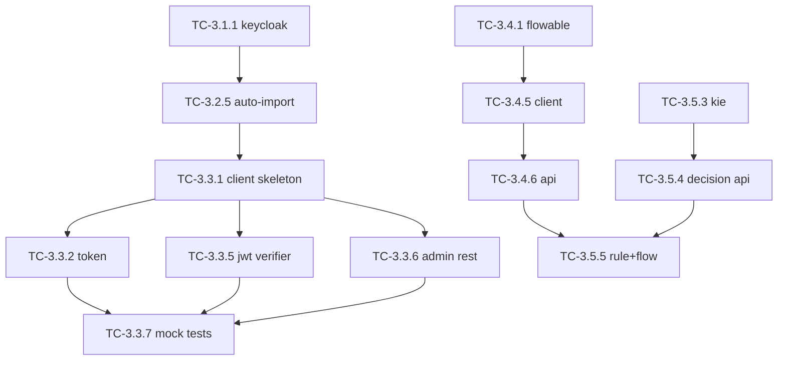

# W3 任务卡：外部引擎 ACL Client（Keycloak/Flowable/Drools）

> **源交付项**：[路线图 §4 W3](./2026-07-27-mate-platform-delivery-roadmap.md#w3---外部引擎-acl-clientkeycloakflowabledrools)
> **总览**：[Task Breakdown](./2026-07-27-mate-platform-task-breakdown.md)
> **Sprint**：S3（2026-08-11 ~ 2026-08-24）
> **里程碑**：M2 上半
> **任务卡总数**：29
> **依赖**：W2（基础设施 facade）

---

## 目录

- [W3-1 Keycloak docker-compose 集成](#w3-1-keycloak-docker-compose-集成)
- [W3-2 Realm / Client / Roles / Users 初始化](#w3-2-realm--client--roles--users-初始化)
- [W3-3 KeycloakClient 实现](#w3-3-keycloakclient-实现)
- [W3-4 Flowable docker-compose + FlowableClient](#w3-4-flowable-docker-compose--flowableclient)
- [W3-5 Drools 集成 + 决策服务](#w3-5-drools-集成--决策服务)

---

## W3-1 Keycloak docker-compose 集成

> **路线图工时**：1d | **拆出 TC 数**：4 | **关键路径**：是

### TC-3.1.1 docker-compose 加 keycloak 服务

| 字段 | 值 |
|---|---|
| **预估工时** | 2h |
| **负责人角色** | DevOps |
| **前置 TC** | TC-2.1.6（PG 服务在线） |
| **可并行 TC** | TC-3.1.2 |
| **输出 PR** | `dev: add keycloak` |
| **关键路径** | 是 |

**目标**：在 `docker-compose.yml` 加 `keycloak` 服务，连接 `mate-pg`。

**实现步骤**：
1. `quay.io/keycloak/keycloak:25.0` start-dev 模式
2. 端口 8080 + 8443
3. env：`KEYCLOAK_ADMIN=admin`、`KEYCLOAK_ADMIN_PASSWORD=admin-pass`、`KC_DB=postgres`、`KC_DB_URL=jdbc:postgresql://pg:5432/keycloak`
4. 依赖 `pg` 服务 healthcheck
5. 挂载 `infra/init/keycloak/realm-export.json` 到 `/opt/keycloak/data/import/`

**DoD 验证清单**：
- [ ] `docker compose up -d keycloak` 容器 healthy
- [ ] `curl http://localhost:8080/realms/master/.well-known/openid-configuration` 200

---

### TC-3.1.2 启动后健康检查

| 字段 | 值 |
|---|---|
| **预估工时** | 1h |
| **负责人角色** | DevOps |
| **前置 TC** | TC-3.1.1 |
| **可并行 TC** | — |
| **输出 PR** | `dev: keycloak healthcheck` |
| **关键路径** | 是 |

**目标**：docker-compose 中 `healthcheck` 等待 OIDC ready。

**实现步骤**：
1. `test: ["CMD-SHELL", "exec 3<>/dev/tcp/localhost/8080"]` 或 `curl --fail http://localhost:8080/health/ready`
2. `interval: 10s、timeout: 5s、retries: 30、start_period: 60s`
3. 写 `scripts/wait-keycloak.sh`：`until curl -sf http://localhost:8080/realms/master >/dev/null; do sleep 2; done`

**DoD 验证清单**：
- [ ] `docker compose up keycloak` 第一次跑会等到 ready 才标 healthy
- [ ] `wait-keycloak.sh` 在 CI 中可用

---

### TC-3.1.3 realm-export.json 模板

| 字段 | 值 |
|---|---|
| **预估工时** | 2h |
| **负责人角色** | Backend |
| **前置 TC** | TC-3.1.1 |
| **可并行 TC** | TC-3.1.4 |
| **输出 PR** | `dev: keycloak realm template` |

**目标**：编写 `realm-export.json` 骨架（含 realm、clients、roles 占位）。

**实现步骤**：
1. `infra/init/keycloak/realm-export.json` 顶层：`realm=mate`、`enabled=true`、`accessTokenLifespan=1800`
2. 预留 `clients[]`、`roles[]`、`users[]` 占位（详细 TC-3.2.x 填充）
3. 写 ADR-0009：为什么用 realm export 而不是 `kc.sh import`

**DoD 验证清单**：
- [ ] 启动时自动加载
- [ ] ADR-0009 合并

---

### TC-3.1.4 启动验证

| 字段 | 值 |
|---|---|
| **预估工时** | 1h |
| **负责人角色** | DevOps |
| **前置 TC** | TC-3.1.1、TC-3.1.2 |
| **可并行 TC** | — |
| **输出 PR** | `dev: keycloak smoke` |
| **关键路径** | 是 |

**目标**：CI 中加 smoke test，确认 Keycloak 在线。

**实现步骤**：
1. `tests/smoke/test_keycloak_up.py`：连 `http://localhost:8080/realms/master/.well-known/openid-configuration` 验签
2. 加进 CI 的 `infra-storage` job

**DoD 验证清单**：
- [ ] CI 绿
- [ ] Keycloak 不可用时给出明确报错

---

## W3-2 Realm / Client / Roles / Users 初始化

> **路线图工时**：1d | **拆出 TC 数**：6 | **关键路径**：否

### TC-3.2.1 realm 配置

| 字段 | 值 |
|---|---|
| **预估工时** | 1h |
| **负责人角色** | Backend |
| **前置 TC** | TC-3.1.3 |
| **可并行 TC** | TC-3.2.2 ~ TC-3.2.4 |
| **输出 PR** | `dev: keycloak realm config` |

**目标**：填充 realm 主配置。

**实现步骤**：
1. `realm=mate`、`displayName=Mate Platform`
2. 登录：`loginWithEmailAllowed=true`、`duplicateEmailsAllowed=false`
3. token：`accessTokenLifespan=1800`、`refreshTokenMaxReuse=5`、`ssoSessionIdleTimeout=1800`
4. 国际化：`internationalizationEnabled=true`、`supportedLocales=["en","zh"]`

**DoD 验证清单**：
- [ ] import 后控制台能看到配置
- [ ] token TTL 符合预期

---

### TC-3.2.2 init-client.json（apps/iam-public、apps/portal）

| 字段 | 值 |
|---|---|
| **预估工时** | 3h |
| **负责人角色** | Backend |
| **前置 TC** | TC-3.2.1 |
| **可并行 TC** | TC-3.2.3、TC-3.2.4 |
| **输出 PR** | `dev: keycloak clients` |

**目标**：定义所有需要的 client。

**实现步骤**：
1. `iam-public`：public client（前端直连），`redirectUris=["http://localhost:5173/*"]`、`webOrigins=["*"]`
2. `mate-backend`：confidential client（后端服务用），`serviceAccountsEnabled=true`
3. `mate-admin-portal`：public client，`redirectUris=["http://localhost:5174/*"]`
4. `mcphub-internal`：confidential client（仅内网）
5. 每个 client 的 `protocol=openid-connect`、`standardFlowEnabled=true`

**DoD 验证清单**：
- [ ] 4 个 client 全部 import
- [ ] confidential client 能用 client_credentials 拿 token

---

### TC-3.2.3 init-roles.json（admin / editor / viewer / agent）

| 字段 | 值 |
|---|---|
| **预估工时** | 2h |
| **负责人角色** | Backend |
| **前置 TC** | TC-3.2.1 |
| **可并行 TC** | TC-3.2.2、TC-3.2.4 |
| **输出 PR** | `dev: keycloak roles` |

**目标**：定义 realm + client roles。

**实现步骤**：
1. realm roles：`admin`、`editor`、`viewer`、`agent`
2. client `mate-backend` roles：`kb.read`、`kb.write`、`ont.read`、`ont.write`、`rag.invoke`
3. role attributes：`admin.description`、`agent.capabilities=["tool-call","plan"]`
4. composite：`editor` 包含 `kb.read`、`kb.write`

**DoD 验证清单**：
- [ ] 7 个 realm role + 5 个 client role 全部 import
- [ ] 复合关系正确

---

### TC-3.2.4 init-users.json（admin 用户 + 种子数据）

| 字段 | 值 |
|---|---|
| **预估工时** | 2h |
| **负责人角色** | Backend |
| **前置 TC** | TC-3.2.1 |
| **可并行 TC** | TC-3.2.2、TC-3.2.3 |
| **输出 PR** | `dev: keycloak users` |

**目标**：定义种子用户。

**实现步骤**：
1. `admin@mate.local` / `admin-pass`：realm role `admin`
2. `editor@mate.local` / `editor-pass`：realm role `editor`
3. `viewer@mate.local` / `viewer-pass`：realm role `viewer`
4. `agent@mate.local` / `agent-pass`：realm role `agent`
5. 用户属性：`tenant=default`、`locale=zh`

**DoD 验证清单**：
- [ ] 4 用户可登录
- [ ] role 绑定正确

---

### TC-3.2.5 启动时自动导入（docker-entrypoint）

| 字段 | 值 |
|---|---|
| **预估工时** | 1h |
| **负责人角色** | DevOps |
| **前置 TC** | TC-3.2.1 ~ TC-3.2.4 |
| **可并行 TC** | — |
| **输出 PR** | `dev: keycloak auto-import` |
| **关键路径** | 是 |

**目标**：保证 `docker compose up keycloak` 后能直接看到 4 用户 4 client。

**实现步骤**：
1. `KEYCLOAK_IMPORT=/opt/keycloak/data/import/realm-export.json`
2. `realm-export.json` 用 `users[*].credentials[*].value` 显式声明初始密码
3. 启动命令：`start --import-realm`

**DoD 验证清单**：
- [ ] 第一次启动后 `admin@mate.local / admin-pass` 可登录控制台
- [ ] 4 client / 4 role / 4 user 全部就位

---

### TC-3.2.6 可重复导入测试

| 字段 | 值 |
|---|---|
| **预估工时** | 1h |
| **负责人角色** | Backend |
| **前置 TC** | TC-3.2.5 |
| **可并行 TC** | — |
| **输出 PR** | `test(keycloak): reimport` |

**目标**：删除 PG 数据卷后再 import，应得相同结果。

**实现步骤**：
1. `tests/test_keycloak_reimport.sh`：删 `mate-pg-data` 卷 → 重启 → 验证用户数
2. 写进 `scripts/smoke/keycloak-import.sh`

**DoD 验证清单**：
- [ ] 重复 3 次结果一致
- [ ] CI 中可调起

---

## W3-3 KeycloakClient 实现

> **路线图工时**：3d | **拆出 TC 数**：7 | **关键路径**：是

### TC-3.3.1 KeycloakClient 骨架 + 配置

| 字段 | 值 |
|---|---|
| **预估工时** | 3h |
| **负责人角色** | Backend |
| **前置 TC** | TC-3.2.5（Keycloak 4 用户就位） |
| **可并行 TC** | — |
| **输出 PR** | `feat(iam): keycloak client skeleton` |
| **关键路径** | 是 |

**目标**：在 `apps/tech-iam` 提供 `KeycloakClient`，统一封装 OIDC + Admin REST。

**实现步骤**：
1. 依赖 `python-keycloak>=3.4`、`httpx>=0.27`、`pyjwt[crypto]>=2.8`
2. `apps/tech-iam/src/tech_iam/keycloak.py`：
   ```python
   class KeycloakClient:
       def __init__(self, *, server_url: str, realm: str, client_id: str, client_secret: str | None = None): ...
   ```
3. 内部持有 `python_keycloak.KeycloakOpenID` 与 `KeycloakAdmin`
4. 配置走 env：`KEYCLOAK_SERVER_URL`、`KEYCLOAK_REALM=m ate`、`KEYCLOAK_CLIENT_ID`
5. 写 `tests/test_keycloak_skeleton.py`：构造 client 不报错

**DoD 验证清单**：
- [ ] 单元测试通过
- [ ] pyright strict 通过
- [ ] 错误配置抛 `KeycloakConfigError`

---

### TC-3.3.2 OIDC token 颁发（password grant）

| 字段 | 值 |
|---|---|
| **预估工时** | 4h |
| **负责人角色** | Backend |
| **前置 TC** | TC-3.3.1 |
| **可并行 TC** | TC-3.3.3、TC-3.3.4 |
| **输出 PR** | `feat(iam): oidc password grant` |
| **关键路径** | 是 |

**目标**：`KeycloakClient.token(username, password) -> TokenResponse`。

**实现步骤**：
1. `def token(self, *, username: str, password: str, scope: str = "openid profile email") -> TokenResponse`
2. 调 `openid.token(username, password, grant_type="password", scope=scope)`
3. 失败 → `raise InvalidCredentials`
4. `TokenResponse`（在 `libs/openapi-schemas/src/iam/`）：`access_token`、`refresh_token`、`expires_in`、`token_type`、`scope`
5. 写 `tests/test_keycloak_token.py`：用真实 Keycloak 容器跑通

**DoD 验证清单**：
- [ ] 4 个种子用户都能拿 token
- [ ] 错误密码 → 401 + `InvalidCredentials`
- [ ] 过期处理（mock 时间）

---

### TC-3.3.3 OIDC refresh token

| 字段 | 值 |
|---|---|
| **预估工时** | 2h |
| **负责人角色** | Backend |
| **前置 TC** | TC-3.3.2 |
| **可并行 TC** | TC-3.3.4 |
| **输出 PR** | `feat(iam): oidc refresh` |

**目标**：`KeycloakClient.refresh(refresh_token) -> TokenResponse`。

**实现步骤**：
1. 调 `openid.refresh_token(refresh_token)`
2. 复用 TC-3.3.2 的 `TokenResponse` 校验
3. 写单测：refresh 后 access_token 不同 + refresh_token 轮换

**DoD 验证清单**：
- [ ] 单元测试 + 集成测试均绿

---

### TC-3.3.4 OIDC logout

| 字段 | 值 |
|---|---|
| **预估工时** | 2h |
| **负责人角色** | Backend |
| **前置 TC** | TC-3.3.2 |
| **可并行 TC** | TC-3.3.3 |
| **输出 PR** | `feat(iam): oidc logout` |

**目标**：`KeycloakClient.logout(refresh_token) -> None`。

**实现步骤**：
1. 调 `openid.logout(refresh_token)`
2. 同时清本地 `apps/tech-iam` 的 session 表（如有）
3. 写单测：logout 后 refresh_token 失效

**DoD 验证清单**：
- [ ] 单测绿
- [ ] 已 logout 的 token 不能 refresh

---

### TC-3.3.5 JWT 校验（FastAPI 依赖）

| 字段 | 值 |
|---|---|
| **预估工时** | 4h |
| **负责人角色** | Backend |
| **前置 TC** | TC-3.3.2 |
| **可并行 TC** | TC-3.3.6 |
| **输出 PR** | `feat(iam): jwt verifier` |
| **关键路径** | 是 |

**目标**：FastAPI 依赖 `current_user()` + `require_role("admin")`。

**实现步骤**：
1. `apps/tech-iam/src/tech_iam/deps.py`：
   ```python
   async def current_user(authorization: str = Header(...)) -> UserContext: ...
   def require_role(role: str) -> Callable: ...
   ```
2. 校验：签名（用 Keycloak 公钥，缓存 5min） + 过期 + issuer + audience
3. 失败 → 401 + `ErrorResponse(code="4A001")`
4. 写 `tests/test_jwt_verifier.py`：合法/过期/伪造/缺失

**DoD 验证清单**：
- [ ] 合法 token → UserContext
- [ ] 过期 token → 401
- [ ] 错误签名 → 401
- [ ] pyright strict 通过

---

### TC-3.3.6 Admin REST 封装（用户/角色 CRUD）

| 字段 | 值 |
|---|---|
| **预估工时** | 6h |
| **负责人角色** | Backend |
| **前置 TC** | TC-3.3.1 |
| **可并行 TC** | TC-3.3.5 |
| **输出 PR** | `feat(iam): admin rest` |
| **关键路径** | 是 |

**目标**：`KeycloakClient.users` / `.roles` 子命名空间，对应 OpenAPI 的 IAM 端点。

**实现步骤**：
1. `users.list(*, limit, offset, search) -> list[User]`
2. `users.create(payload: UserCreate) -> User`
3. `users.get(user_id) -> User`
4. `users.update(user_id, payload: UserUpdate) -> User`
5. `users.delete(user_id) -> None`
6. `users.assign_roles(user_id, role_names: list[str]) -> None`
7. `roles.list() -> list[Role]`
8. 写 `tests/test_keycloak_admin.py`：CRUD + 角色绑定

**DoD 验证清单**：
- [ ] 与 OpenAPI §4 W1-3 的 10 端点一一对应
- [ ] 错误用户 → 404 + `EntityNotFound`
- [ ] 重复创建 → 409 + `Conflict`

---

### TC-3.3.7 单测（mock OIDC server）

| 字段 | 值 |
|---|---|
| **预估工时** | 3h |
| **负责人角色** | Backend |
| **前置 TC** | TC-3.3.2 ~ TC-3.3.6 |
| **可并行 TC** | — |
| **输出 PR** | `test(iam): keycloak client suite` |
| **关键路径** | 是 |

**目标**：在单测环境用 `respx` + `pyfakefs` mock Keycloak 响应，离线跑通。

**实现步骤**：
1. 依赖 `respx>=0.21`、`pytest-httpx>=0.30`
2. `tests/test_keycloak_client.py`：
   - 6 个 fixture：成功/失败 token、refresh、logout、admin CRUD、JWT
   - 每个方法至少 1 个正向 + 1 个反向
3. `pytest -m "not integration"` 跑得通

**DoD 验证清单**：
- [ ] 离线（不连 Keycloak）100% 绿
- [ ] 覆盖 ≥ 80%

---

## W3-4 Flowable docker-compose + FlowableClient

> **路线图工时**：3d | **拆出 TC 数**：7 | **关键路径**：否

### TC-3.4.1 flowable-rest + flowable-ui 容器

| 字段 | 值 |
|---|---|
| **预估工时** | 2h |
| **负责人角色** | DevOps |
| **前置 TC** | TC-2.1.6 |
| **可并行 TC** | TC-3.4.2 |
| **输出 PR** | `dev: add flowable` |

**目标**：加 `flowable-rest`（8090）+ `flowable-ui`（8091）。

**实现步骤**：
1. `flowable/flowable-rest:6.8.0`
2. env：`FLOWABLE_DATABASE_TYPE=postgres`、`SPRING_DATASOURCE_URL=jdbc:postgresql://pg:5432/flowable`
3. 挂卷 `mate-flowable-data`
4. healthcheck：`curl --fail http://localhost:8090/flowable-rest/service/management/health`

**DoD 验证清单**：
- [ ] 容器 healthy
- [ ] 管理控制台 8091 可访问

---

### TC-3.4.2 postgres schema 初始化

| 字段 | 值 |
|---|---|
| **预估工时** | 1h |
| **负责人角色** | DevOps |
| **前置 TC** | TC-3.4.1 |
| **可并行 TC** | — |
| **输出 PR** | `dev: flowable pg init` |

**目标**：首次启动前建 `flowable` 数据库。

**实现步骤**：
1. `infra/init/postgres/02-flowable.sql`：`CREATE DATABASE flowable;`（条件存在跳过）
2. 通过 `mate-pg-init` 一次性 init 容器加载

**DoD 验证清单**：
- [ ] 重启后 flowable 表自动生成
- [ ] `psql -l` 能看到 `flowable` 库

---

### TC-3.4.3 默认 admin 账号

| 字段 | 值 |
|---|---|
| **预估工时** | 1h |
| **负责人角色** | Backend |
| **前置 TC** | TC-3.4.1 |
| **可并行 TC** | — |
| **输出 PR** | `dev: flowable admin` |

**目标**：`admin / admin-pass` 可登录 flowable-ui。

**实现步骤**：
1. `infra/init/flowable/01-admin.sql`：插 admin 用户的 hash（`BCrypt`）
2. 文档说明：本地用，**生产环境必须改密码**

**DoD 验证清单**：
- [ ] 控制台能登录

---

### TC-3.4.4 BPMN 部署脚本

| 字段 | 值 |
|---|---|
| **预估工时** | 4h |
| **负责人角色** | Backend |
| **前置 TC** | TC-3.4.1 |
| **可并行 TC** | TC-3.4.5 |
| **输出 PR** | `feat(bpm): deploy script` |

**目标**：提供 `scripts/deploy-bpmn.sh`，把 `apps/tech-agent/bpmn/*.bpmn` 部署到 Flowable。

**实现步骤**：
1. 用 Flowable REST API `/repository/deployments`
2. multipart/form-data 上传 .bpmn + .png
3. 输出部署 ID 与 version
4. 写一个示例流程 `apps/tech-agent/bpmn/agent-loop.bpmn`（1 start → 1 service task → 1 end）

**DoD 验证清单**：
- [ ] 部署后 flowable-ui 能看到流程图
- [ ] 重跑幂等（同文件名 + 内容不变 → 不重复部署）

---

### TC-3.4.5 FlowableClient 实现

| 字段 | 值 |
|---|---|
| **预估工时** | 6h |
| **负责人角色** | Backend |
| **前置 TC** | TC-3.4.4 |
| **可并行 TC** | — |
| **输出 PR** | `feat(bpm): flowable client` |
| **关键路径** | 是 |

**目标**：`apps/tech-bpm` 提供 `FlowableClient`。

**实现步骤**：
1. 依赖 `httpx`
2. 内部 base_url + basic auth（admin/admin-pass）
3. 方法：
   - `deploy(process_definition_key, bpmn_bytes) -> Deployment`
   - `start_process(key, variables: dict) -> ProcessInstance`
   - `get_process_instance(id) -> ProcessInstance`
   - `complete_task(task_id, variables: dict) -> None`
   - `list_tasks(process_instance_id) -> list[Task]`
   - `cancel_process(id, reason: str) -> None`
4. 写 `tests/test_flowable_client.py`：deploy + start + complete 全链路

**DoD 验证清单**：
- [ ] 单测（mock）+ 集成测试（真容器）均绿
- [ ] 错误流程定义 → 400 + `InvalidBpmn`

---

### TC-3.4.6 流程 CRUD + 启动 + 状态查询

| 字段 | 值 |
|---|---|
| **预估工时** | 4h |
| **负责人角色** | Backend |
| **前置 TC** | TC-3.4.5 |
| **可并行 TC** | — |
| **输出 PR** | `feat(bpm): lifecycle` |

**目标**：把 FlowableClient 暴露成 OpenAPI 端点。

**实现步骤**：
1. `apps/tech-bpm/src/tech_bpm/api.py`：
   - `POST /api/v1/bpm/deployments`（multipart）
   - `POST /api/v1/bpm/process-instances`
   - `GET /api/v1/bpm/process-instances/{id}`
   - `POST /api/v1/bpm/tasks/{id}/complete`
   - `GET /api/v1/bpm/process-instances/{id}/tasks`
   - `POST /api/v1/bpm/process-instances/{id}/cancel`
2. 写 `tests/test_bpm_api.py`：API 端到端

**DoD 验证清单**：
- [ ] swagger-ui 列出 6 端点
- [ ] 与 OpenAPI §5 W5-7 的 S4 场景 schema 一致

---

### TC-3.4.7 单测

| 字段 | 值 |
|---|---|
| **预估工时** | 2h |
| **负责人角色** | Backend |
| **前置 TC** | TC-3.4.5、TC-3.4.6 |
| **可并行 TC** | — |
| **输出 PR** | `test(bpm): client + api` |

**DoD 验证清单**：
- [ ] client + api 单测覆盖率 ≥ 80%
- [ ] CI 绿

---

## W3-5 Drools 集成 + 决策服务

> **路线图工时**：1.5d | **拆出 TC 数**：5 | **关键路径**：否

### TC-3.5.1 Drools 引擎评估

| 字段 | 值 |
|---|---|
| **预估工时** | 3h |
| **负责人角色** | Backend |
| **前置 TC** | TC-3.4.5 |
| **可并行 TC** | TC-3.5.2 |
| **输出 PR** | `docs(drools): eval` |

**目标**：评估 v1 用 Drools KIE Server 还是本地嵌入 KieSession。

**实现步骤**：
1. 写 ADR-0010：v1 选**本地嵌入**（`kieker-python` 不存在，用 `pyke3` 替代规则引擎；Drools 走 KIE Server 远程）
2. 实际方案：Drools 走 REST（KIE Server 7.x），`apps/tech-rules` 调它
3. spike：用 docker-compose 启 `jboss/kie-server:7.74` + 一个示例规则验证端到端

**DoD 验证清单**：
- [ ] ADR-0010 合并，决策明确
- [ ] spike 文档可复现

---

### TC-3.5.2 规则文件存放约定

| 字段 | 值 |
|---|---|
| **预估工时** | 1h |
| **负责人角色** | Backend |
| **前置 TC** | — |
| **可并行 TC** | TC-3.5.3 |
| **输出 PR** | `docs(drools): file convention` |

**目标**：规定 DRL 规则文件存放位置与命名。

**实现步骤**：
1. 路径：`apps/tech-rules/rules/{namespace}/*.drl`
2. 命名：`{entity}_{action}.drl`（例：`agent_plan_routing.drl`）
3. 每个 DRL 头声明 package + import
4. ADR-0011：规则版本用 `kjar` GAV

**DoD 验证清单**：
- [ ] ADR-0011 合并
- [ ] 目录结构示例文件齐

---

### TC-3.5.3 KIE Server 容器集成

| 字段 | 值 |
|---|---|
| **预估工时** | 3h |
| **负责人角色** | DevOps |
| **前置 TC** | TC-3.5.1、TC-3.5.2 |
| **可并行 TC** | TC-3.5.4 |
| **输出 PR** | `dev: add kie-server` |

**目标**：加 `kie-server` 容器，加载示例 `mate-kjar`。

**实现步骤**：
1. `docker-compose.yml` 加 `kie-server:7.74`，端口 8180
2. 挂载 `apps/tech-rules/rules/` 到 `/opt/jboss/standalone/deployments/` 或用 `kie-server maven repo`
3. 写 `infra/init/kie/01-build-kjar.sh`：用 `kie-maven-plugin` 构建示例 kjar
4. healthcheck：`curl --fail http://localhost:8180/services/rest/server/ready`

**DoD 验证清单**：
- [ ] 容器 healthy
- [ ] `POST /services/rest/server/containers/instances/mate-kjar` 返回 201

---

### TC-3.5.4 决策服务 OpenAPI 端点

| 字段 | 值 |
|---|---|
| **预估工时** | 4h |
| **负责人角色** | Backend |
| **前置 TC** | TC-3.5.3 |
| **可并行 TC** | TC-3.5.5 |
| **输出 PR** | `feat(rules): decision api` |

**目标**：`apps/tech-rules` 暴露 `POST /api/v1/rules/decide`。

**实现步骤**：
1. `RuleRequest` schema：`{ container: str, payload: dict }`
2. `RuleResponse` schema：`{ results: list[dict], facts: list[dict] }`
3. `apps/tech-rules/src/tech_rules/api.py`：
   ```python
   @router.post("/decide", response_model=RuleResponse)
   async def decide(req: RuleRequest) -> RuleResponse:
       # 1. 调 KIE Server fireAllRules
       # 2. 返回结果
   ```
4. OpenAPI 同步更新到 `openapi/paths/rules.yaml`
5. 写 `tests/test_decision_api.py`：1 正 + 1 反

**DoD 验证清单**：
- [ ] swagger-ui 列出端点
- [ ] 错误 container → 404 + `ContainerNotFound`
- [ ] 慢规则（>5s）→ 504

---

### TC-3.5.5 规则与流程联动

| 字段 | 值 |
|---|---|
| **预估工时** | 4h |
| **负责人角色** | Backend |
| **前置 TC** | TC-3.5.4、TC-3.4.5 |
| **可并行 TC** | — |
| **输出 PR** | `feat(agent): rule-driven bpm` |

**目标**：在 Flowable BPMN 的 service task 中调 Drools，决定分支。

**实现步骤**：
1. 写一个 `agent-decision-flow.bpmn`：start → service task（调 `decide` API）→ exclusive gateway（根据结果分 2 支）
2. 用 `apps/tech-agent` 的 worker 在 service task 调 `apps/tech-rules` 的 API
3. 写 `tests/test_rule_driven_bpm.py`：3 个分支场景各跑一次

**DoD 验证清单**：
- [ ] 3 个分支流程实例都能跑通
- [ ] 错误规则结果 → 流程进入错误分支 + 通知

---

## W3 完成度检查表

| W3-n | 路线图 ID | 关键路径 | 路线图工时 | TC 数 | 状态 |
|---|---|---|---|---|---|
| W3-1 | §4 W3-1 | 是 | 1d | 4 | 未启动 |
| W3-2 | §4 W3-2 | 否 | 1d | 6 | 未启动 |
| W3-3 | §4 W3-3 | 是 | 3d | 7 | 未启动 |
| W3-4 | §4 W3-4 | 否 | 3d | 7 | 未启动 |
| W3-5 | §4 W3-5 | 否 | 1.5d | 5 | 未启动 |
| **合计** | — | — | **9.5d** | **29** | **未启动** |

---

## Sprint S3 建议排程

| 周 | 重点 TC | 备注 |
|---|---|---|
| W3 D1 | TC-3.1.1 ~ TC-3.1.4 | Keycloak 上线 + 启动验证 |
| W3 D1-D2 | TC-3.2.1 ~ TC-3.2.6 | 4 client / 4 role / 4 user + 幂等 |
| W3 D2-D4 | TC-3.3.1 ~ TC-3.3.7 | KeycloakClient 全套（OIDC + JWT + Admin） |
| W3 D3-D5 | TC-3.4.1 ~ TC-3.4.7 | Flowable 容器 + 部署 + Client + API |
| W3 D5-D6 | TC-3.5.1 ~ TC-3.5.5 | Drools 评估 + 决策服务 + 流程联动 |

> 关键路径：W3-1（1d）→ W3-3（3d）。W3-2 / W3-4 / W3-5 可全并行。

---

## 依赖关系图



---

## 变更记录

| 日期 | 变更 | 原因 |
|---|---|---|
| 2026-07-27 | v1.0 初稿 | 配合 Task Breakdown 总览建立 W3 任务卡 |
