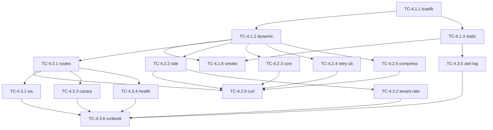

# W4 任务卡：Traefik 网关

> **源交付项**：[路线图 §5 依赖 § W4 Traefik 网关](./2026-07-27-mate-platform-delivery-roadmap.md)
> **总览**：[Task Breakdown](./2026-07-27-mate-platform-task-breakdown.md)
> **Sprint**：S4（2026-08-18 ~ 2026-08-31）
> **里程碑**：M2 下半
> **任务卡总数**：18
> **依赖**：W2（PG/Redis 在线）+ W3（Keycloak/Flowable 在线）

---

## 目录

- [W4-1 Traefik 基础集成](#w4-1-traefik-基础集成)
- [W4-2 路由与中间件](#w4-2-路由与中间件)
- [W4-3 WebSocket + 网关策略](#w4-3-websocket--网关策略)

---

## W4-1 Traefik 基础集成

> **路线图工时**：2d | **拆出 TC 数**：6 | **关键路径**：是

### TC-4.1.1 docker-compose 加 Traefik v3.0

| 字段 | 值 |
|---|---|
| **预估工时** | 2h |
| **负责人角色** | DevOps |
| **前置 TC** | TC-2.2.4 |
| **可并行 TC** | TC-4.1.2、TC-4.1.3 |
| **输出 PR** | `dev: add traefik` |
| **关键路径** | 是 |

**目标**：在 `docker-compose.yml` 加 `traefik` v3.0 容器。

**实现步骤**：
1. `traefik:v3.0` 容器，端口 80 + 443 + 8080（dashboard）
2. 挂卷：
   - `/var/run/docker.sock:/var/run/docker.sock:ro`
   - `./infra/traefik:/etc/traefik`
3. 命令：`--providers.docker=true --providers.docker.exposedbydefault=false --api.insecure=true`
4. 标 `expose: true` 的 service 自动注册

**DoD 验证清单**：
- [ ] `docker compose up -d traefik` healthy
- [ ] `http://localhost:8080/api/version` 200

---

### TC-4.1.2 动态配置目录

| 字段 | 值 |
|---|---|
| **预估工时** | 1h |
| **负责人角色** | DevOps |
| **前置 TC** | TC-4.1.1 |
| **可并行 TC** | TC-4.1.3 |
| **输出 PR** | `dev: traefik dynamic conf` |

**目标**：建立动态配置目录结构。

**实现步骤**：
1. `infra/traefik/dynamic/`：放 routers / middlewares / services
2. `infra/traefik/dynamic/routers/_template.yaml`：注释化模板
3. `infra/traefik/dynamic/middlewares/`：按用途分子目录
4. `dynamic_conf.yml`：动态加载入口 `providers.file.directory=/etc/traefik/dynamic`

**DoD 验证清单**：
- [ ] 改 dynamic 下的文件 Traefik 自动热加载
- [ ] reload 不丢连接

---

### TC-4.1.3 静态配置（端口、entryPoints、log）

| 字段 | 值 |
|---|---|
| **预估工时** | 2h |
| **负责人角色** | DevOps |
| **前置 TC** | TC-4.1.1 |
| **可并行 TC** | TC-4.1.2 |
| **输出 PR** | `dev: traefik static conf` |

**目标**：编写 `infra/traefik/traefik.yml`。

**实现步骤**：
1. `entryPoints.web.address=:80`、`entryPoints.websecure.address=:443`
2. `entryPoints.traefik.address=:8080`（API + dashboard）
3. `accessLog: true`、`accessLog.fields.headers.defaultMode=keep`
4. `log.level=INFO`
5. `metrics.prometheus.addEntryPointsLabels=true`

**DoD 验证清单**：
- [ ] 配置 reload 不报错
- [ ] 访问日志输出到 stdout JSON

---

### TC-4.1.4 metrics / dashboard

| 字段 | 值 |
|---|---|
| **预估工时** | 1h |
| **负责人角色** | DevOps |
| **前置 TC** | TC-4.1.3 |
| **可并行 TC** | TC-4.1.5 |
| **输出 PR** | `dev: traefik metrics` |

**目标**：Prometheus metrics + dashboard 暴露。

**实现步骤**：
1. `metrics.prometheus.buckets=[0.005,0.01,0.05,0.1,0.5,1,5]`
2. dashboard 绑定 `entryPoints.traefik`，加 basic auth
3. `infra/traefik/dynamic/middlewares/auth-dashboard.yaml`：usersFile 指向 `infra/traefik/.htpasswd`
4. 写 `scripts/gen-htpasswd.sh`：`htpasswd -nb admin admin-pass`

**DoD 验证清单**：
- [ ] `/metrics` 200
- [ ] dashboard 需 basic auth

---

### TC-4.1.5 TLS 自动签发（本地 mkcert）

| 字段 | 值 |
|---|---|
| **预估工时** | 2h |
| **负责人角色** | DevOps |
| **前置 TC** | TC-4.1.1 |
| **可并行 TC** | TC-4.1.4 |
| **输出 PR** | `dev: traefik tls mkcert` |

**目标**：本地开发用 mkcert 签证书，告别自签警告。

**实现步骤**：
1. 文档：`docs/runbooks/tls-local.md` 写 `mkcert -install && mkcert "*.mate.local"`
2. 输出文件：`infra/traefik/certs/{cert.pem,key.pem}`
3. `traefik.yml`：`tls.certificates` 引用文件
4. `infra/traefik/dynamic/routers/_tls_template.yaml`：注释化
5. hosts 写 `host.mate.local`，本地 `/etc/hosts` 配 127.0.0.1

**DoD 验证清单**：
- [ ] 浏览器访问无证书警告
- [ ] 错误域名 → 404

---

### TC-4.1.6 启动验证

| 字段 | 值 |
|---|---|
| **预估工时** | 1h |
| **负责人角色** | DevOps |
| **前置 TC** | TC-4.1.1 ~ TC-4.1.5 |
| **可并行 TC** | — |
| **输出 PR** | `test(traefik): smoke` |
| **关键路径** | 是 |

**目标**：写 smoke test + CI 接入。

**实现步骤**：
1. `tests/smoke/test_traefik_up.py`：探测 `/api/version`、`/metrics`、`/dashboard`
2. CI 加 `infra-gateway` job
3. 写 `docs/runbooks/gateway.md`：写明如何加新 service

**DoD 验证清单**：
- [ ] CI 绿
- [ ] docs/runbooks/gateway.md 含完整样例

---

## W4-2 路由与中间件

> **路线图工时**：2d | **拆出 TC 数**：6 | **关键路径**：否

### TC-4.2.1 路由规则（host / path prefix）

| 字段 | 值 |
|---|---|
| **预估工时** | 3h |
| **负责人角色** | DevOps |
| **前置 TC** | TC-4.1.2 |
| **可并行 TC** | TC-4.2.2 ~ TC-4.2.5 |
| **输出 PR** | `feat(gw): base routes` |

**目标**：定义 9 个 apps + 8 个 tech 服务的路由规则。

**实现步骤**：
1. `infra/traefik/dynamic/routers/services.yaml`：
   - `iam-router`：`Host("iam.mate.local") || PathPrefix("/api/v1/iam")`
   - `kb-router`：`Host("kb.mate.local") || PathPrefix("/api/v1/kb")`
   - 其余类比
2. 每个 router 引用对应 service + 中间件链
3. 写 ADR-0012：host-first 还是 path-first（结论：path-first，便于单 host 多租户）

**DoD 验证清单**：
- [ ] 9 apps + 8 tech 路由全配
- [ ] ADR-0012 合并
- [ ] 错误路径 → 404

---

### TC-4.2.2 中间件：rate-limit

| 字段 | 值 |
|---|---|
| **预估工时** | 2h |
| **负责人角色** | DevOps |
| **前置 TC** | TC-4.1.2 |
| **可并行 TC** | TC-4.2.1、TC-4.2.3 ~ TC-4.2.5 |
| **输出 PR** | `feat(gw): rate limit` |

**目标**：每个 tech-* 服务按 IP 限流 100 req/s，burst 200。

**实现步骤**：
1. `infra/traefik/dynamic/middlewares/ratelimit-default.yaml`
2. `rateLimit.average=100`、`rateLimit.burst=200`
3. 应用到所有 tech-* router
4. 写 `tests/test_rate_limit.sh`：连发 300 个请求，验证 429 出现

**DoD 验证清单**：
- [ ] 429 响应符合预期（`X-RateLimit-*` 头）
- [ ] 调小阈值 1 req/s 仍能触发

---

### TC-4.2.3 中间件：cors

| 字段 | 值 |
|---|---|
| **预估工时** | 1h |
| **负责人角色** | DevOps |
| **前置 TC** | TC-4.1.2 |
| **可并行 TC** | TC-4.2.1、TC-4.2.2、TC-4.2.4、TC-4.2.5 |
| **输出 PR** | `feat(gw): cors` |

**目标**：CORS 中间件允许 `http://localhost:5173`。

**实现步骤**：
1. `middlewares/cors.yaml`：`cors.allowedOrigins=["http://localhost:5173","http://localhost:5174"]`
2. `cors.allowedMethods=["GET","POST","PUT","PATCH","DELETE","OPTIONS"]`
3. `cors.allowedHeaders=["Authorization","Content-Type","X-Tenant-Id"]`
4. `cors.exposedHeaders=["X-Trace-Id"]`
5. 写 `tests/test_cors.sh`：preflight 请求验证

**DoD 验证清单**：
- [ ] OPTIONS 200 + 头齐全
- [ ] 错误 origin 无 CORS 头

---

### TC-4.2.4 中间件：retry + circuit breaker

| 字段 | 值 |
|---|---|
| **预估工时** | 3h |
| **负责人角色** | DevOps |
| **前置 TC** | TC-4.1.2 |
| **可并行 TC** | TC-4.2.1 ~ TC-4.2.3、TC-4.2.5 |
| **输出 PR** | `feat(gw): retry cb` |

**目标**：5xx/网络错误自动重试 2 次，CB 在失败率 50% 持续 30s 触发。

**实现步骤**：
1. `middlewares/retry.yaml`：`retry.attempts=2`、`retry.initialInterval=100ms`
2. 用 Traefik 插件 `cnjprentice/circuitbreaker`：阈值 + 半开探测
3. 写 `tests/test_retry_cb.sh`：mock 后端 100% 失败 → 验证 502 + 后续请求直接 503

**DoD 验证清单**：
- [ ] 间歇失败能恢复
- [ ] 持续失败进入 CB

---

### TC-4.2.5 中间件：compress

| 字段 | 值 |
|---|---|
| **预估工时** | 1h |
| **负责人角色** | DevOps |
| **前置 TC** | TC-4.1.2 |
| **可并行 TC** | TC-4.2.1 ~ TC-4.2.4 |
| **输出 PR** | `feat(gw): compress` |

**目标**：gzip 压缩所有 `text/*` 与 `application/json` 响应。

**实现步骤**：
1. `middlewares/compress.yaml`：`compress.excludedMimeTypes=["application/grpc"]`
2. 应用到所有 router
3. 写 `tests/test_compress.sh`：`curl -H "Accept-Encoding: gzip"` 验证 `Content-Encoding: gzip`

**DoD 验证清单**：
- [ ] JSON 响应被压缩
- [ ] 流式 SSE 不被压缩

---

### TC-4.2.6 路由测试（curl 验证）

| 字段 | 值 |
|---|---|
| **预估工时** | 2h |
| **负责人角色** | DevOps |
| **前置 TC** | TC-4.2.1 ~ TC-4.2.5 |
| **可并行 TC** | — |
| **输出 PR** | `test(gw): routes` |

**目标**：把所有路由 + 中间件组合的端到端 curl 验证脚本化。

**实现步骤**：
1. `tests/gateway/`：每个 app 一个 `.sh`，覆盖 200 / 401 / 404 / 405 / 429
2. `scripts/gateway-test.sh`：跑全部
3. CI 加 `gateway-routes` job

**DoD 验证清单**：
- [ ] 全部通过
- [ ] 失败时明确指出哪个 app / 哪个 status

---

## W4-3 WebSocket + 网关策略

> **路线图工时**：2d | **拆出 TC 数**：6 | **关键路径**：否

### TC-4.3.1 WebSocket 升级（kb/search/stream）

| 字段 | 值 |
|---|---|
| **预估工时** | 2h |
| **负责人角色** | DevOps |
| **前置 TC** | TC-4.1.2 |
| **可并行 TC** | TC-4.3.2 ~ TC-4.3.5 |
| **输出 PR** | `feat(gw): ws upgrade` |

**目标**：Traefik 自动识别 `Connection: Upgrade` 并转发 WebSocket。

**实现步骤**：
1. `infra/traefik/dynamic/routers/ws.yaml`：匹配 `PathPrefix("/api/v1/kb/search/stream")` 与 `PathPrefix("/api/v1/agent/chat")`
2. 显式声明 transport 配置
3. 写 `tests/test_ws.sh`：用 `websocat` 连 30s，每 5s 收一条

**DoD 验证清单**：
- [ ] WS 连接能建立
- [ ] 帧内容与后端一致

---

### TC-4.3.2 限流策略（按 tenant）

| 字段 | 值 |
|---|---|
| **预估工时** | 3h |
| **负责人角色** | DevOps |
| **前置 TC** | TC-4.2.2 |
| **可并行 TC** | TC-4.3.1、TC-4.3.3 ~ TC-4.3.5 |
| **输出 PR** | `feat(gw): tenant rate limit` |

**目标**：用 `X-Tenant-Id` header 区分租户，每个租户 50 req/s。

**实现步骤**：
1. 中间件 `tenant-ratelimit.yaml`：`rateLimitExtractor` 用 header
2. 默认 50 req/s；可走 nacos 动态调整
3. 写 `tests/test_tenant_rate.sh`：两个 tenant 各 60 个并发 → 各自 50/200 成功

**DoD 验证清单**：
- [ ] 两个 tenant 互不影响
- [ ] 未带 header → 走 default

---

### TC-4.3.3 灰度权重（按 header / cookie）

| 字段 | 值 |
|---|---|
| **预估工时** | 3h |
| **负责人角色** | DevOps |
| **前置 TC** | TC-4.2.1 |
| **可并行 TC** | TC-4.3.1、TC-4.3.2、TC-4.3.4、TC-4.3.5 |
| **输出 PR** | `feat(gw): canary` |

**目标**：通过 `X-Canary=blue` 或 cookie `mate_canary=blue` 路由到 `v2` 服务。

**实现步骤**：
1. `services.yaml` 给 tech-kb 配 v1 + v2 两个 service
2. 用 `traefik.http.services.tech-kb-v1.loadbalancer.server.port=8000`、v2 同
3. router 加 header / cookie matcher
4. 写 `tests/test_canary.sh`：发 100 个带 `X-Canary=blue` 的请求，全部到 v2

**DoD 验证清单**：
- [ ] header 路由 100% 命中目标
- [ ] 无 header 走默认 v1

---

### TC-4.3.4 健康检查 + 自动剔除

| 字段 | 值 |
|---|---|
| **预估工时** | 2h |
| **负责人角色** | DevOps |
| **前置 TC** | TC-4.2.1 |
| **可并行 TC** | TC-4.3.1 ~ TC-4.3.3、TC-4.3.5 |
| **输出 PR** | `feat(gw): health check` |

**目标**：每 5s 探活，失败 2 次自动剔除，恢复后自动加回。

**实现步骤**：
1. `loadbalancer.healthCheck.path=/healthz`、`interval=5s`
2. 写 `tests/test_health_check.sh`：用 `iptables` 模拟后端不可用 → 30s 内全部流量走剩余实例

**DoD 验证清单**：
- [ ] 剔除期间无 502
- [ ] 恢复后自动加回

---

### TC-4.3.5 网关日志接入到 OTel

| 字段 | 值 |
|---|---|
| **预估工时** | 3h |
| **负责人角色** | DevOps |
| **前置 TC** | TC-4.1.3 |
| **可并行 TC** | TC-4.3.1 ~ TC-4.3.4 |
| **输出 PR** | `feat(gw): otel access log` |

**目标**：访问日志 → OTel collector → tech-obs。

**实现步骤**：
1. `traefik.yml` 加 `accessLog.format=json`、`fields.headers.names.X-Trace-Id=keep`
2. 写 `infra/traefik/otel-collector.yaml`：File → OTLP
3. 用 `tcplog` 或 `file` provider 把日志落到 `infra/logs/access.log`
4. 写 `tests/test_otel_log.sh`：发请求 → grep `access.log` 验证

**DoD 验证清单**：
- [ ] OTel collector 收到 access.log
- [ ] trace_id 关联到 tech-* app 的 trace

---

### TC-4.3.6 文档：路由表维护 runbook

| 字段 | 值 |
|---|---|
| **预估工时** | 2h |
| **负责人角色** | DevOps |
| **前置 TC** | TC-4.2.1、TC-4.3.1 ~ TC-4.3.5 |
| **可并行 TC** | — |
| **输出 PR** | `docs(gw): runbook` |

**目标**：`docs/runbooks/gateway.md` 含完整路由表 + 加新 service 流程。

**实现步骤**：
1. 路由表（域名 / path / service / 中间件 / 限流 / 灰度）以 markdown table 形式
2. 流程："加新 service" / "调整限流" / "紧急下线"
3. ADR-0013：路由命名规范

**DoD 验证清单**：
- [ ] 新人按文档 10 分钟加一个新 service

---

## W4 完成度检查表

| W4-n | 路线图归属 | 关键路径 | 路线图工时 | TC 数 | 状态 |
|---|---|---|---|---|---|
| W4-1 | Traefik 基础集成 | 是 | 2d | 6 | 未启动 |
| W4-2 | 路由与中间件 | 否 | 2d | 6 | 未启动 |
| W4-3 | WebSocket + 网关策略 | 否 | 2d | 6 | 未启动 |
| **合计** | — | — | **6d** | **18** | **未启动** |

---

## Sprint S4 建议排程

| 周 | 重点 TC | 备注 |
|---|---|---|
| W4 D1 | TC-4.1.1 ~ TC-4.1.3 | Traefik 容器 + 静态 + 动态配置 |
| W4 D1-D2 | TC-4.1.4 ~ TC-4.1.6 | metrics / TLS / 启动验证 |
| W4 D2-D3 | TC-4.2.1 ~ TC-4.2.5 | 9 apps + 8 tech 路由 + 5 个中间件 |
| W4 D3-D4 | TC-4.2.6 | 端到端 curl 验证 |
| W4 D4-D5 | TC-4.3.1 ~ TC-4.3.3 | WebSocket / tenant 限流 / 灰度 |
| W4 D5-D6 | TC-4.3.4 ~ TC-4.3.6 | 健康检查 / OTel / runbook |

> 关键路径：W4-1（2d）。W4-2 / W4-3 与 W5 / W6 可并行开始（前端 BFF 路由可与 W6-4 并行）。

---

## 路由总表（v1）

| Host / Path | 目标 service | 中间件链 | 限流 | 灰度 |
|---|---|---|---|---|
| `iam.mate.local` / `/api/v1/iam/*` | tech-iam:8000 | cors → auth → ratelimit-default | 100 rps | — |
| `kb.mate.local` / `/api/v1/kb/*` | tech-kb:8000 | cors → auth → ratelimit-default → compress | 100 rps | canary |
| `ont.mate.local` / `/api/v1/ont/*` | tech-ont:8000 | cors → auth → ratelimit-default | 50 rps | — |
| `llm.mate.local` / `/api/v1/llm/*` | tech-llmgw:8000 | cors → auth → ratelimit-default → cb | 200 rps | — |
| `rag.mate.local` / `/api/v1/rag/*` | tech-rag:8000 | cors → auth → ratelimit-default | 100 rps | — |
| `agent.mate.local` / `/api/v1/agent/*` | tech-agent:8000 | cors → auth → ratelimit-default | 50 rps | — |
| `bpm.mate.local` / `/api/v1/bpm/*` | tech-bpm:8000 | cors → auth → ratelimit-default | 50 rps | — |
| `msg.mate.local` / `/api/v1/msg/*` | tech-msg:8000 | cors → auth → ratelimit-default | 200 rps | — |
| `kb.mate.local/api/v1/kb/search/stream` | tech-kb:8000（WS） | cors → auth → ws-upgrade | 30 conn | — |
| `agent.mate.local/api/v1/agent/chat` | tech-agent:8000（WS） | cors → auth → ws-upgrade | 30 conn | — |
| `app.mate.local/*` | metaplatform-frontend | cors → compress | — | canary |

> 详细路由 YAML 在 `infra/traefik/dynamic/routers/services.yaml`，修改需走 PR + 1 个 reviewer。

---

## 依赖关系图

---

## 变更记录

| 日期 | 变更 | 原因 |
|---|---|---|
| 2026-07-27 | v1.0 初稿 | 配合 Task Breakdown 总览建立 W4 任务卡 |
