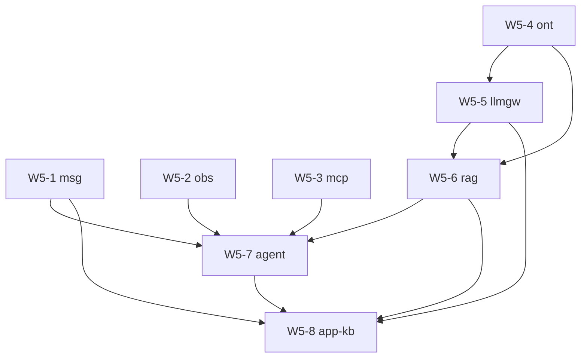

# W5 任务卡：业务域（8 个 tech-* + app-kb）

> **源交付项**：[路线图 §4 W5](./2026-07-27-mate-platform-delivery-roadmap.md#w5---业务域-tech-msg--app-kb)
> **总览**：[Task Breakdown](./2026-07-27-mate-platform-task-breakdown.md)
> **Sprint**：S5–S10（2026-08-31 ~ 2026-11-10）
> **里程碑**：M3（业务域完成）
> **任务卡总数**：96
> **依赖**：W1（OpenAPI）+ W2（基础设施）+ W3（ACL）+ W4（网关）

> **格式说明**：W5 是最大模块，96 张 TC 跨 8 个域。为控制单文件体积，本文件采用**紧凑 TC 格式**（省略详细实现步骤，仅保留 6 字段 + 目标 + DoD）。每张卡平均 ~12 行。

---

## 目录

| 域 | 路线图 | 路线图工时 | TC 数 | 关键路径 | 状态 |
|---|---|---|---|---|---|
| W5-1 tech-msg 消息 | 🟢 低 | 2 周 | 12 | — | 未启动 |
| W5-2 tech-obs 可观测 | 🟢 低 | 2 周 | 10 | — | 未启动 |
| W5-3 tech-mcp MCP | 🟢 低 | 2 周 | 10 | — | 未启动 |
| W5-4 tech-ont 本体 | 🟡 中 | 2 周 | 12 | 是 | 未启动 |
| W5-5 tech-llmgw LLM 路由 | 🟡 中 | 2 周 | 12 | 是 | 未启动 |
| W5-6 tech-rag RAG 核心 | 🔴 高 | 3 周 | 14 | 是 | 未启动 |
| W5-7 tech-agent Agent | 🔴 高 | 3 周 | 14 | 是 | 未启动 |
| W5-8 app-kb 业务聚合 | 🔴 高 | 3 周 | 12 | 是 | 未启动 |

---

## W5-1 tech-msg（消息总线，12 张 TC）

> 关键路径：否 | 优先级：低 | 风险：Kafka 团队熟悉度

### TC-5.1.1 apps/tech-msg 初始化

| 字段 | 值 |
|---|---|
| 工时 | 2h | 角色 | Backend | 前置 | TC-1.1.7 | PR | `feat(msg): scaffold` |

**目标**：建 `apps/tech-msg` 包（fastapi + pyproject + Dockerfile + docker-compose service）。

**DoD**：`uv sync`、`uv run --package tech-msg uvicorn` 启动 + `GET /healthz` 200。

---

### TC-5.1.2 消息模型 Pydantic

| 字段 | 值 |
|---|---|
| 工时 | 3h | 角色 | Backend | 前置 | TC-1.7.4 | PR | `feat(msg): models` |

**目标**：`Message[T]` 泛型（payload + headers + traceId + tenantId + key + timestamp）。

**DoD**：roundtrip 测试、OpenAPI schema 同步。

---

### TC-5.1.3 KafkaClient 集成（复用 W2-2.2）

| 字段 | 值 |
|---|---|
| 工时 | 2h | 角色 | Backend | 前置 | TC-2.2.2、TC-5.1.1 | PR | `feat(msg): kafka client` |

**目标**：`apps/tech-msg/src/tech_msg/kafka.py` 包装 `KafkaProducer` / `KafkaConsumer`。

**DoD**：连真实 Kafka 发 1 条收 1 条。

---

### TC-5.1.4 publisher 端点

| 字段 | 值 |
|---|---|
| 工时 | 4h | 角色 | Backend | 前置 | TC-5.1.2、TC-5.1.3 | PR | `feat(msg): publish api` |

**目标**：`POST /api/v1/msg/publish`（带幂等键、partition key）。

**DoD**：swagger-ui 列出，集成测试 200。

---

### TC-5.1.5 subscriber worker

| 字段 | 值 |
|---|---|
| 工时 | 6h | 角色 | Backend | 前置 | TC-5.1.3 | PR | `feat(msg): subscriber` |

**目标**：consumer group `tech-msg` 自动拉取 → 调本地 handler。

**DoD**：跑 1 个 echo topic，发 → 收 → handler 触发。

---

### TC-5.1.6 dead-letter 队列

| 字段 | 值 |
|---|---|
| 工时 | 3h | 角色 | Backend | 前置 | TC-5.1.5 | PR | `feat(msg): dlq` |

**目标**：handler 抛异常 3 次后路由到 `mate.msg.dlq`。

**DoD**：故意抛异常的 handler → DLQ 收到 + 含异常 stack。

---

### TC-5.1.7 消息追踪（OTel）

| 字段 | 值 |
|---|---|
| 工时 | 3h | 角色 | Backend | 前置 | TC-5.1.5 | PR | `feat(msg): otel` |

**目标**：consumer 与 producer 跨服务 trace 关联。

**DoD**：tech-msg ↔ tech-kb 的 trace 在 Tempo 中连成一条。

---

### TC-5.1.8 幂等性（dedup key）

| 字段 | 值 |
|---|---|
| 工时 | 3h | 角色 | Backend | 前置 | TC-5.1.4 | PR | `feat(msg): dedup` |

**目标**：publisher 强制带 `X-Idempotency-Key`，broker 端用 Redis 7 天去重。

**DoD**：同 key 重复 publish → 第二次返回 200 + 命中提示。

---

### TC-5.1.9 顺序保证（partition key）

| 字段 | 值 |
|---|---|
| 工时 | 2h | 角色 | Backend | 前置 | TC-5.1.3 | PR | `feat(msg): partition` |

**目标**：默认按 `tenantId` 路由 partition → 同租户有序。

**DoD**：单测验证同 key 同 partition。

---

### TC-5.1.10 重试策略（指数退避）

| 字段 | 值 |
|---|---|
| 工时 | 3h | 角色 | Backend | 前置 | TC-5.1.5 | PR | `feat(msg): retry` |

**目标**：handler 失败按 1s/5s/30s 退避重试 3 次。

**DoD**：模拟瞬时失败 → 第三次成功。

---

### TC-5.1.11 OpenAPI 同步

| 字段 | 值 |
|---|---|
| 工时 | 2h | 角色 | Backend | 前置 | TC-5.1.4 | PR | `docs(msg): openapi` |

**目标**：`openapi/paths/msg.yaml` 含 publish + status 端点。

**DoD**：CI lint 绿。

---

### TC-5.1.12 单测 + 集成

| 字段 | 值 |
|---|---|
| 工时 | 4h | 角色 | Backend | 前置 | TC-5.1.1 ~ TC-5.1.11 | PR | `test(msg): suite` |

**目标**：`pytest --package tech-msg` 覆盖率 ≥ 80%。

**DoD**：CI 绿 + 报告齐。

---

## W5-2 tech-obs（可观测，10 张 TC）

> 关键路径：否 | 优先级：低 | 复用 OTel + Grafana

### TC-5.2.1 OTel SDK 集成

| 字段 | 值 |
|---|---|
| 工时 | 3h | 角色 | DevOps | 前置 | TC-1.1.7 | PR | `feat(obs): otel sdk` |

**目标**：`libs/observability/` 提供 `init_tracing(service_name)`。

**DoD**：hello app 启动后 trace 推到 Tempo。

---

### TC-5.2.2 自动 instrument

| 字段 | 值 |
|---|---|
| 工时 | 3h | 角色 | DevOps | 前置 | TC-5.2.1 | PR | `feat(obs): auto-instr` |

**目标**：覆盖 FastAPI、httpx、SQLAlchemy、aiokafka、psycopg。

**DoD**：trace 中能看到 http/db/mq span。

---

### TC-5.2.3 自定义 span

| 字段 | 值 |
|---|---|
| 工时 | 2h | 角色 | Backend | 前置 | TC-5.2.1 | PR | `feat(obs): custom span` |

**目标**：`@traced("kb.search")` 装饰器 + 业务字段属性。

**DoD**：trace 中带 `kb.kb_id` 等属性。

---

### TC-5.2.4 Prometheus exporter

| 字段 | 值 |
|---|---|
| 工时 | 2h | 角色 | DevOps | 前置 | TC-5.2.1 | PR | `feat(obs): prom exporter` |

**目标**：每个 app 暴露 `/metrics`（含 request_count、latency、in_flight）。

**DoD**：Prometheus 抓得到 9 个 app 数据。

---

### TC-5.2.5 Loki 日志聚合

| 字段 | 值 |
|---|---|
| 工时 | 3h | 角色 | DevOps | 前置 | TC-2.1.6 | PR | `feat(obs): loki` |

**目标**：所有 stdout JSON log → Promtail → Loki。

**DoD**：Grafana Explore 搜得到跨 app 日志。

---

### TC-5.2.6 Tempo trace 存储

| 字段 | 值 |
|---|---|
| 工时 | 3h | 角色 | DevOps | 前置 | TC-2.1.6 | PR | `feat(obs): tempo` |

**目标**：docker-compose 加 Tempo + OTLP 接收器。

**DoD**：trace 能存 7 天。

---

### TC-5.2.7 Grafana 仪表盘

| 字段 | 值 |
|---|---|
| 工时 | 4h | 角色 | DevOps | 前置 | TC-5.2.4 ~ TC-5.2.6 | PR | `feat(obs): grafana` |

**目标**：8 个 dashboard（请求量、延迟、错误率、队列深度、JVM/内存、PG、Milvus、Traefik）。

**DoD**：Grafana `http://localhost:3000` 可访问。

---

### TC-5.2.8 告警规则（Prometheus）

| 字段 | 值 |
|---|---|
| 工时 | 3h | 角色 | DevOps | 前置 | TC-5.2.4 | PR | `feat(obs): alerts` |

**目标**：10 条 alert（5xx > 1%、p95 > 1s、PG 连接打满、Milvus p99 > 100ms、…）。

**DoD**：alertmanager 收到 + 静默规则可配。

---

### TC-5.2.9 健康检查聚合

| 字段 | 值 |
|---|---|
| 工时 | 2h | 角色 | DevOps | 前置 | TC-5.2.4 | PR | `feat(obs): health aggregator` |

**目标**：`/api/v1/obs/health` 汇总 9 个 app + 基础设施 7 个。

**DoD**：任一 down → 整体 down + 明细。

---

### TC-5.2.10 OpenAPI + 文档

| 字段 | 值 |
|---|---|
| 工时 | 2h | 角色 | DevOps | 前置 | TC-5.2.9 | PR | `docs(obs): openapi+runbook` |

**DoD**：swagger-ui + `docs/runbooks/observability.md`。

---

## W5-3 tech-mcp（MCP，10 张 TC）

> 关键路径：否 | 优先级：低 | 用 mcp-python-sdk

### TC-5.3.1 mcp-python-sdk 集成

| 字段 | 值 |
|---|---|
| 工时 | 3h | 角色 | Backend | 前置 | TC-1.1.7 | PR | `feat(mcp): sdk` |

**目标**：`apps/tech-mcp` 引入 `mcp>=1.0`。

**DoD**：`mcp.Server` 实例化 + 启动 stdio。

---

### TC-5.3.2 工具注册（kb search）

| 字段 | 值 |
|---|---|
| 工时 | 4h | 角色 | Backend | 前置 | TC-5.3.1、TC-5.6.6 | PR | `feat(mcp): tool kb_search` |

**目标**：注册 `kb_search(query, top_k, kb_ids)` 工具 → 调 tech-rag。

**DoD**：stdio 调通，返回 top_k 命中。

---

### TC-5.3.3 资源注册（ontology）

| 字段 | 值 |
|---|---|
| 工时 | 4h | 角色 | Backend | 前置 | TC-5.3.1、TC-5.4.6 | PR | `feat(mcp): resource ontology` |

**目标**：`ontology://{class_id}` URI 暴露本体。

**DoD**：`read_resource` 返回类定义。

---

### TC-5.3.4 提示模板

| 字段 | 值 |
|---|---|
| 工时 | 2h | 角色 | Backend | 前置 | TC-5.3.1 | PR | `feat(mcp): prompt templates` |

**目标**：`prompts/list` 含 `summarize_doc`、`extract_entities` 3 个。

**DoD**：模板能渲染。

---

### TC-5.3.5 transport（stdio + sse）

| 字段 | 值 |
|---|---|
| 工时 | 4h | 角色 | Backend | 前置 | TC-5.3.1 | PR | `feat(mcp): transport` |

**目标**：同时支持 stdio（本地）与 sse（远端）。

**DoD**：两种 transport 都能用。

---

### TC-5.3.6 server bootstrap

| 字段 | 值 |
|---|---|
| 工时 | 2h | 角色 | Backend | 前置 | TC-5.3.5 | PR | `feat(mcp): bootstrap` |

**目标**：`uv run --package tech-mcp` 启动 server，配置走 env。

**DoD**：docker compose 加 service 后 healthy。

---

### TC-5.3.7 工具调用限流

| 字段 | 值 |
|---|---|
| 工时 | 2h | 角色 | Backend | 前置 | TC-5.3.2 | PR | `feat(mcp): rate limit` |

**目标**：每个工具按 tenant 50 req/min（用 Redis）。

**DoD**：超限返回 429。

---

### TC-5.3.8 OpenAPI 网关桥

| 字段 | 值 |
|---|---|
| 工时 | 4h | 角色 | Backend | 前置 | TC-5.3.2 | PR | `feat(mcp): http bridge` |

**目标**：`POST /api/v1/mcp/tools/{name}` HTTP 调用工具。

**DoD**：swagger-ui 列出所有工具。

---

### TC-5.3.9 OAuth 集成

| 字段 | 值 |
|---|---|
| 工时 | 3h | 角色 | Backend | 前置 | TC-3.3.5、TC-5.3.8 | PR | `feat(mcp): oauth` |

**目标**：HTTP bridge 走 Keycloak JWT 校验。

**DoD**：无 token 401、过期 401。

---

### TC-5.3.10 单测 + 集成

| 字段 | 值 |
|---|---|
| 工时 | 4h | 角色 | Backend | 前置 | TC-5.3.1 ~ TC-5.3.9 | PR | `test(mcp): suite` |

**DoD**：覆盖率 ≥ 80%。

---

## W5-4 tech-ont（本体，12 张 TC）

> 关键路径：**是** | 优先级：中 | 复用 W2-3.5 Neo4j stub

### TC-5.4.1 apps/tech-ont 初始化

| 字段 | 值 |
|---|---|
| 工时 | 2h | 角色 | Backend | 前置 | TC-1.1.7 | PR | `feat(ont): scaffold` |

**DoD**：`uv run --package tech-ont uvicorn` 启动 + `/healthz` 200。

---

### TC-5.4.2 Neo4j GraphRepository 实现

| 字段 | 值 |
|---|---|
| 工时 | 6h | 角色 | Backend | 前置 | TC-2.1.3、TC-2.3.5 | PR | `feat(ont): neo4j repo` |

**目标**：实现 W2-3.5 Protocol（节点 / 边 CRUD + 简单查询）。

**DoD**：单测 + 集成测试（真 Neo4j）绿。

---

### TC-5.4.3 本体管理 OpenAPI 实现

| 字段 | 值 |
|---|---|
| 工时 | 6h | 角色 | Backend | 前置 | TC-1.5.2、TC-5.4.2 | PR | `feat(ont): api ontology` |

**目标**：`/api/v1/ont/ontologies` + `/classes` + `/properties` 8 端点。

**DoD**：swagger-ui "Try it out" 跑通。

---

### TC-5.4.4 SPARQL 端点实现

| 字段 | 值 |
|---|---|
| 工时 | 6h | 角色 | Backend | 前置 | TC-5.4.2 | PR | `feat(ont): sparql` |

**目标**：`/api/v1/ont/sparql` 接 SELECT / INSERT / DELETE。

**DoD**：与 Neo4j Cypher 互转，单元 + 集成测试。

---

### TC-5.4.5 explain 端点

| 字段 | 值 |
|---|---|
| 工时 | 3h | 角色 | Backend | 前置 | TC-5.4.4 | PR | `feat(ont): explain` |

**目标**：把 SPARQL 转成执行计划 + 估计成本。

**DoD**：返回 Cypher PROFILE 信息。

---

### TC-5.4.6 OWL 2 导入/导出

| 字段 | 值 |
|---|---|
| 工时 | 6h | 角色 | Backend | 前置 | TC-5.4.3 | PR | `feat(ont): owl io` |

**目标**：`POST /api/v1/ont/import-owl` 接收 RDF/XML + 写入 Neo4j；`GET /export-owl` 反向。

**DoD**：示例 wine 本体能 roundtrip。

---

### TC-5.4.7 实例管理

| 字段 | 值 |
|---|---|
| 工时 | 4h | 角色 | Backend | 前置 | TC-5.4.3 | PR | `feat(ont): instances` |

**目标**：`/instances` + `/relations` CRUD。

**DoD**：单测 + 集成。

---

### TC-5.4.8 版本管理

| 字段 | 值 |
|---|---|
| 工时 | 3h | 角色 | Backend | 前置 | TC-5.4.3 | PR | `feat(ont): versioning` |

**目标**：本体支持多版本，CRUD 端点带 `version` 参数。

**DoD**：同 ontology_id 多个 version 互不干扰。

---

### TC-5.4.9 双写策略（如需）

| 字段 | 值 |
|---|---|
| 工时 | 4h | 角色 | Backend | 前置 | TC-5.4.3 | PR | `feat(ont): dual write` |

**目标**：CRUD 同时写 PG 元数据 + Neo4j 关系。失败回滚。

**DoD**：Neo4j 故障时 PG 也不写。

---

### TC-5.4.10 全文检索集成

| 字段 | 值 |
|---|---|
| 工时 | 4h | 角色 | Backend | 前置 | TC-5.4.3 | PR | `feat(ont): full text` |

**目标**：实例/类名支持中文 + 英文模糊搜索（用 PG `tsvector`）。

**DoD**：1000 个实例下查询 < 100ms。

---

### TC-5.4.11 权限与租户隔离

| 字段 | 值 |
|---|---|
| 工时 | 3h | 角色 | Backend | 前置 | TC-3.3.5、TC-5.4.3 | PR | `feat(ont): tenant` |

**目标**：所有 CRUD 强制带 `X-Tenant-Id`，跨租户访问 403。

**DoD**：跨租户 unit test 全 403。

---

### TC-5.4.12 单测 + 集成

| 字段 | 值 |
|---|---|
| 工时 | 4h | 角色 | Backend | 前置 | TC-5.4.1 ~ TC-5.4.11 | PR | `test(ont): suite` |

**DoD**：覆盖率 ≥ 80%。

---

## W5-5 tech-llmgw（LLM 路由，12 张 TC）

> 关键路径：**是** | 优先级：中 | 风险：多 provider 适配

### TC-5.5.1 apps/tech-llmgw 初始化

| 字段 | 值 |
|---|---|
| 工时 | 2h | 角色 | Backend | 前置 | TC-1.1.7 | PR | `feat(llmgw): scaffold` |

**DoD**：app 启动 + `/healthz`。

---

### TC-5.5.2 LangChain 集成

| 字段 | 值 |
|---|---|
| 工时 | 4h | 角色 | Backend | 前置 | TC-5.5.1 | PR | `feat(llmgw): langchain` |

**目标**：`libs/llm/` 提供 LangChain 包装（统一 chat interface）。

**DoD**：`chat(messages, model="gpt-4o")` 跑通。

---

### TC-5.5.3 多 provider 路由

| 字段 | 值 |
|---|---|
| 工时 | 6h | 角色 | Backend | 前置 | TC-5.5.2 | PR | `feat(llmgw): router` |

**目标**：根据 `model` 字段路由到 openai / anthropic / qwen / doubao。

**DoD**：4 个 provider 各跑通 1 次。

---

### TC-5.5.4 限流与配额

| 字段 | 值 |
|---|---|
| 工时 | 4h | 角色 | Backend | 前置 | TC-5.5.3 | PR | `feat(llmgw): quota` |

**目标**：每租户 RPM/TPM 限制，超限排队或 429。

**DoD**：故意超限 → 排队 30s 后成功。

---

### TC-5.5.5 成本计量

| 字段 | 值 |
|---|---|
| 工时 | 4h | 角色 | Backend | 前置 | TC-5.5.3 | PR | `feat(llmgw): cost` |

**目标**：每个请求记录 token 用量 + 单价 → 写到 PG `llm_usage` 表。

**DoD**：日报 query 正确。

---

### TC-5.5.6 重试与 fallback

| 字段 | 值 |
|---|---|
| 工时 | 4h | 角色 | Backend | 前置 | TC-5.5.3 | PR | `feat(llmgw): fallback` |

**目标**：主模型 5xx / 超时 → 自动 fallback 到次选。

**DoD**：mock 主 provider 失败 → 次选成功。

---

### TC-5.5.7 流式响应（SSE）

| 字段 | 值 |
|---|---|
| 工时 | 4h | 角色 | Backend | 前置 | TC-5.5.3 | PR | `feat(llmgw): stream` |

**目标**：`POST /api/v1/llm/chat/stream` 输出 SSE。

**DoD**：浏览器 EventSource 收到增量。

---

### TC-5.5.8 Function calling 适配

| 字段 | 值 |
|---|---|
| 工时 | 6h | 角色 | Backend | 前置 | TC-5.5.3 | PR | `feat(llmgw): tools` |

**目标**：4 个 provider 统一 tool schema + tool_calls 输出。

**DoD**：openai/anthropic 工具调用各 1 例。

---

### TC-5.5.9 OpenAPI 暴露

| 字段 | 值 |
|---|---|
| 工时 | 3h | 角色 | Backend | 前置 | TC-5.5.7、TC-5.5.8 | PR | `feat(llmgw): openapi` |

**目标**：`/api/v1/llm/chat` + `/stream` + `/embeddings`。

**DoD**：swagger-ui 列出。

---

### TC-5.5.10 缓存层（Redis）

| 字段 | 值 |
|---|---|
| 工时 | 4h | 角色 | Backend | 前置 | TC-5.5.3 | PR | `feat(llmgw): cache` |

**目标**：相同 prompt + temperature=0 → 命中缓存。

**DoD**：缓存命中率 ≥ 30%。

---

### TC-5.5.11 安全与脱敏

| 字段 | 值 |
|---|---|
| 工时 | 3h | 角色 | Backend | 前置 | TC-5.5.3 | PR | `feat(llmgw): safety` |

**目标**：敏感字段（手机号、身份证）送 LLM 前自动打码。

**DoD**：示例 input 输出验证打码。

---

### TC-5.5.12 单测 + 集成

| 字段 | 值 |
|---|---|
| 工时 | 4h | 角色 | Backend | 前置 | TC-5.5.1 ~ TC-5.5.11 | PR | `test(llmgw): suite` |

**DoD**：覆盖率 ≥ 80%（用 `vcrpy` 录 LLM 响应）。

---

## W5-6 tech-rag（RAG 核心，14 张 TC）

> 关键路径：**是** | 优先级：高 | 风险：检索质量

### TC-5.6.1 apps/tech-rag 初始化

| 字段 | 值 |
|---|---|
| 工时 | 2h | 角色 | Backend | 前置 | TC-1.1.7 | PR | `feat(rag): scaffold` |

**DoD**：app 启动。

---

### TC-5.6.2 Embedding 模型集成

| 字段 | 值 |
|---|---|
| 工时 | 4h | 角色 | Backend | 前置 | TC-5.5.2 | PR | `feat(rag): embed` |

**目标**：默认 `text-embedding-3-small`（可切 bge-m3）。

**DoD**：1000 文本向量化 < 5s。

---

### TC-5.6.3 Milvus 向量入库

| 字段 | 值 |
|---|---|
| 工时 | 4h | 角色 | Backend | 前置 | TC-2.1.4、TC-2.3.6 | PR | `feat(rag): vector insert` |

**目标**：实现 `VectorRepository.insert(chunks: list[Chunk])`。

**DoD**：1 万条入库 < 10s。

---

### TC-5.6.4 检索（向量 + 全文 hybrid）

| 字段 | 值 |
|---|---|
| 工时 | 6h | 角色 | Backend | 前置 | TC-5.6.3、TC-2.3.3 | PR | `feat(rag): retrieve` |

**目标**：`retrieve(query, top_k=10, mode=hybrid|vector|bm25)`。

**DoD**：hybrid p95 < 200ms。

---

### TC-5.6.5 Rerank 模型集成

| 字段 | 值 |
|---|---|
| 工时 | 4h | 角色 | Backend | 前置 | TC-5.6.4 | PR | `feat(rag): rerank` |

**目标**：默认 `bge-reranker-v2-m3`，可关闭。

**DoD**：rerank 后 nDCG@10 提升 ≥ 5%。

---

### TC-5.6.6 检索端点

| 字段 | 值 |
|---|---|
| 工时 | 4h | 角色 | Backend | 前置 | TC-5.6.4 | PR | `feat(rag): search api` |

**目标**：`POST /api/v1/rag/search` + `POST /search/stream` (SSE)。

**DoD**：与 W1-4 OpenAPI 对齐。

---

### TC-5.6.7 文档摄取（来自 tech-kb）

| 字段 | 值 |
|---|---|
| 工时 | 6h | 角色 | Backend | 前置 | TC-5.6.3、TC-2.3.3 | PR | `feat(rag): ingest` |

**目标**：监听 tech-kb `document.indexed` 事件 → 自动向量化入库。

**DoD**：E2E 上传 PDF → 1min 后可检索。

---

### TC-5.6.8 Query 改写

| 字段 | 值 |
|---|---|
| 工时 | 4h | 角色 | Backend | 前置 | TC-5.5.7 | PR | `feat(rag): query rewrite` |

**目标**：用 LLM 把口语化 query 改写成关键词。

**DoD**：开源 SQuAD 50 题上 +3% 召回。

---

### TC-5.6.9 HyDE（可选）

| 字段 | 值 |
|---|---|
| 工时 | 3h | 角色 | Backend | 前置 | TC-5.6.8 | PR | `feat(rag): hyde` |

**目标**：先让 LLM 假想答案，再检索。

**DoD**：开关可控，A/B 对比报告。

---

### TC-5.6.10 评估集 + 自动跑分

| 字段 | 值 |
|---|---|
| 工时 | 4h | 角色 | Backend | 前置 | TC-5.6.4 | PR | `feat(rag): eval` |

**目标**：`apps/tech-rag/eval/` 存 50 个领域问题 + 标准答案。

**DoD**：`pytest --eval` 输出 hit@n / nDCG。

---

### TC-5.6.11 引用溯源

| 字段 | 值 |
|---|---|
| 工时 | 4h | 角色 | Backend | 前置 | TC-5.6.6 | PR | `feat(rag): citation` |

**目标**：检索结果带 `chunk_id`、`document_id`、`score`、`text_span`。

**DoD**：能反查到原文档第几段。

---

### TC-5.6.12 多租户隔离

| 字段 | 值 |
|---|---|
| 工时 | 3h | 角色 | Backend | 前置 | TC-5.6.3 | PR | `feat(rag): tenant` |

**目标**：Milvus collection 按 tenant 分区，跨租户 0 召回。

**DoD**：unit test 验证。

---

### TC-5.6.13 性能基线

| 字段 | 值 |
|---|---|
| 工时 | 3h | 角色 | Backend | 前置 | TC-5.6.4 | PR | `feat(rag): perf bench` |

**目标**：p95 < 200ms、QPS ≥ 50。

**DoD**：pytest-benchmark 报告归档。

---

### TC-5.6.14 单测 + 集成

| 字段 | 值 |
|---|---|
| 工时 | 4h | 角色 | Backend | 前置 | TC-5.6.1 ~ TC-5.6.13 | PR | `test(rag): suite` |

**DoD**：覆盖率 ≥ 80%。

---

## W5-7 tech-agent（Agent + LangGraph，14 张 TC）

> 关键路径：**是** | 优先级：高 | 风险：LangGraph 生态较新

### TC-5.7.1 apps/tech-agent 初始化

| 字段 | 值 |
|---|---|
| 工时 | 2h | 角色 | Backend | 前置 | TC-1.1.7 | PR | `feat(agent): scaffold` |

**DoD**：app 启动。

---

### TC-5.7.2 LangGraph 集成

| 字段 | 值 |
|---|---|
| 工时 | 4h | 角色 | Backend | 前置 | TC-5.7.1 | PR | `feat(agent): langgraph` |

**目标**：`libs/agent/graph.py` 提供 `StateGraph` 工厂。

**DoD**：示例 "echo" graph 跑通。

---

### TC-5.7.3 工具调用桥（→ tech-mcp）

| 字段 | 值 |
|---|---|
| 工时 | 6h | 角色 | Backend | 前置 | TC-5.3.1、TC-5.7.2 | PR | `feat(agent): tool bridge` |

**目标**：Agent 节点调 MCP 工具，自动转 LangChain Tool。

**DoD**：echo agent 调用 `kb_search` 拿到结果。

---

### TC-5.7.4 状态持久化（Postgres）

| 字段 | 值 |
|---|---|
| 工时 | 4h | 角色 | Backend | 前置 | TC-2.1.1、TC-5.7.2 | PR | `feat(agent): checkpoint pg` |

**目标**：`PostgresSaver` 配置，agent 中断可恢复。

**DoD**：kill -9 → 重启后 state 恢复。

---

### TC-5.7.5 S1 场景：单 Agent 问答

| 字段 | 值 |
|---|---|
| 工时 | 6h | 角色 | Backend | 前置 | TC-5.7.3、TC-5.6.6 | PR | `feat(agent): s1 single` |

**目标**：Agent 1 步调 `kb_search` → 用 LLM 生成答案。

**DoD**：swagger-ui `/api/v1/agent/chat` 端到端通。

---

### TC-5.7.6 S2 场景：多 Agent 协作

| 字段 | 值 |
|---|---|
| 工时 | 8h | 角色 | Backend | 前置 | TC-5.7.5 | PR | `feat(agent): s2 multi` |

**目标**：planner agent → worker agents → synthesizer 模式。

**DoD**：3 节点 graph 串通。

---

### TC-5.7.7 S3 场景：Human-in-the-loop

| 字段 | 值 |
|---|---|
| 工时 | 6h | 角色 | Backend | 前置 | TC-5.7.5 | PR | `feat(agent): s3 hitl` |

**目标**：某节点 `interrupt_before` 等待人类审批。

**DoD**：审批后自动继续。

---

### TC-5.7.8 S4 场景：流程驱动

| 字段 | 值 |
|---|---|
| 工时 | 6h | 角色 | Backend | 前置 | TC-3.4.5、TC-5.7.5 | PR | `feat(agent): s4 bpm` |

**目标**：用 Flowable BPMN 编排 Agent 步骤，service task 调 agent。

**DoD**：BPMN 跑通 + agent 输出写入流程变量。

---

### TC-5.7.9 SSE 流式输出

| 字段 | 值 |
|---|---|
| 工时 | 4h | 角色 | Backend | 前置 | TC-5.7.5 | PR | `feat(agent): stream api` |

**目标**：`/api/v1/agent/chat/stream` 输出 token + tool_call + final。

**DoD**：浏览器 EventSource 验证。

---

### TC-5.7.10 内存与上下文管理

| 字段 | 值 |
|---|---|
| 工时 | 4h | 角色 | Backend | 前置 | TC-5.7.4 | PR | `feat(agent): memory` |

**目标**：短期（thread 内）+ 长期（向量库）记忆。

**DoD**：跨会话召回历史。

---

### TC-5.7.11 安全护栏

| 字段 | 值 |
|---|---|
| 工时 | 4h | 角色 | Backend | 前置 | TC-5.7.5 | PR | `feat(agent): guardrails` |

**目标**：输入检查（prompt injection）+ 输出检查（PII）。

**DoD**：恶意 prompt 拦截 + PII 自动脱敏。

---

### TC-5.7.12 评估集

| 字段 | 值 |
|---|---|
| 工时 | 4h | 角色 | Backend | 前置 | TC-5.7.5 | PR | `feat(agent): eval` |

**目标**：20 个对话场景（单轮/多轮/工具/审批）。

**DoD**：`pytest --eval` 跑通。

---

### TC-5.7.13 OpenAPI

| 字段 | 值 |
|---|---|
| 工时 | 3h | 角色 | Backend | 前置 | TC-5.7.5、TC-5.7.9 | PR | `docs(agent): openapi` |

**DoD**：CI lint 绿。

---

### TC-5.7.14 单测 + 集成

| 字段 | 值 |
|---|---|
| 工时 | 4h | 角色 | Backend | 前置 | TC-5.7.1 ~ TC-5.7.13 | PR | `test(agent): suite` |

**DoD**：覆盖率 ≥ 80%。

---

## W5-8 app-kb（业务聚合，12 张 TC）

> 关键路径：**是** | 优先级：高 | 聚合 tech-kb / rag / agent

### TC-5.8.1 apps/app-kb 初始化

| 字段 | 值 |
|---|---|
| 工时 | 2h | 角色 | Backend | 前置 | TC-1.1.7 | PR | `feat(app-kb): scaffold` |

**DoD**：app 启动。

---

### TC-5.8.2 业务模型 Pydantic

| 字段 | 值 |
|---|---|
| 工时 | 3h | 角色 | Backend | 前置 | TC-1.7.4 | PR | `feat(app-kb): models` |

**目标**：`DocumentApp`、`RetrievalRequestApp`、`AgentChatRequest` 等聚合 schema。

**DoD**：roundtrip 测试。

---

### TC-5.8.3 知识库管理聚合端点

| 字段 | 值 |
|---|---|
| 工时 | 6h | 角色 | Backend | 前置 | TC-5.8.2、TC-2.3.3 | PR | `feat(app-kb): kb api` |

**目标**：`POST /api/v1/app-kb/kbs` 直接调 tech-kb，封装鉴权 + 限流。

**DoD**：端到端 200。

---

### TC-5.8.4 文档上传 + 异步向量化

| 字段 | 值 |
|---|---|
| 工时 | 6h | 角色 | Backend | 前置 | TC-5.8.3、TC-5.6.7 | PR | `feat(app-kb): upload flow` |

**目标**：上传 → tech-kb 存原档 + 发 Kafka → tech-rag 监听入库。

**DoD**：上传后 30s 可检索。

---

### TC-5.8.5 检索聚合（带业务过滤）

| 字段 | 值 |
|---|---|
| 工时 | 4h | 角色 | Backend | 前置 | TC-5.8.3、TC-5.6.6 | PR | `feat(app-kb): search` |

**目标**：检索前按 tenant/权限过滤 KB 列表。

**DoD**：跨租户 0 召回。

---

### TC-5.8.6 Agent 对话聚合

| 字段 | 值 |
|---|---|
| 工时 | 6h | 角色 | Backend | 前置 | TC-5.7.5、TC-5.8.5 | PR | `feat(app-kb): chat` |

**目标**：`POST /api/v1/app-kb/chat` 走 agent + 自动用用户能访问的 KB。

**DoD**：返回引用 + 答案。

---

### TC-5.8.7 任务编排（BPMN 触发）

| 字段 | 值 |
|---|---|
| 工时 | 6h | 角色 | Backend | 前置 | TC-3.4.5、TC-5.7.8 | PR | `feat(app-kb): workflow` |

**目标**：`POST /api/v1/app-kb/workflows` 启动一个 S4 BPMN。

**DoD**：流程跑通 + 回调到位。

---

### TC-5.8.8 业务事件订阅

| 字段 | 值 |
|---|---|
| 工时 | 4h | 角色 | Backend | 前置 | TC-5.1.3 | PR | `feat(app-kb): events` |

**目标**：订阅 `mate.events.*`，给前端 SSE 推送。

**DoD**：发事件 → 前端 1s 内收到。

---

### TC-5.8.9 统计与计量

| 字段 | 值 |
|---|---|
| 工时 | 3h | 角色 | Backend | 前置 | TC-5.8.3 | PR | `feat(app-kb): stats` |

**目标**：`GET /api/v1/app-kb/stats` 返回 KB/文档/检索量。

**DoD**：dashboard 能用。

---

### TC-5.8.10 OpenAPI

| 字段 | 值 |
|---|---|
| 工时 | 3h | 角色 | Backend | 前置 | TC-5.8.1 ~ TC-5.8.9 | PR | `docs(app-kb): openapi` |

**DoD**：CI lint 绿。

---

### TC-5.8.11 端到端 E2E 测试

| 字段 | 值 |
|---|---|
| 工时 | 6h | 角色 | QA | 前置 | TC-5.8.4、TC-5.8.5、TC-5.8.6 | PR | `test(app-kb): e2e` |

**目标**：`tests/e2e/test_kb_lifecycle.py`：上传 → 检索 → 对话 → 引用。

**DoD**：CI 绿 + 录屏归档。

---

### TC-5.8.12 单测 + 集成

| 字段 | 值 |
|---|---|
| 工时 | 4h | 角色 | Backend | 前置 | TC-5.8.1 ~ TC-5.8.11 | PR | `test(app-kb): suite` |

**DoD**：覆盖率 ≥ 80%。

---

## W5 完成度检查表

| W5-n | 域 | 路线图工时 | 关键路径 | TC 数 | 状态 |
|---|---|---|---|---|---|
| W5-1 | tech-msg | 2 周 | 否 | 12 | 未启动 |
| W5-2 | tech-obs | 2 周 | 否 | 10 | 未启动 |
| W5-3 | tech-mcp | 2 周 | 否 | 10 | 未启动 |
| W5-4 | tech-ont | 2 周 | 是 | 12 | 未启动 |
| W5-5 | tech-llmgw | 2 周 | 是 | 12 | 未启动 |
| W5-6 | tech-rag | 3 周 | 是 | 14 | 未启动 |
| W5-7 | tech-agent | 3 周 | 是 | 14 | 未启动 |
| W5-8 | app-kb | 3 周 | 是 | 12 | 未启动 |
| **合计** | — | **~19 周** | — | **96** | **未启动** |

---

## Sprint S5–S10 排程

| Sprint | 周次 | 域 | 关键 TC |
|---|---|---|---|
| **S5** | W5 (08-31 ~ 09-13) | tech-msg + tech-obs + tech-mcp | TC-5.1.1 ~ TC-5.3.10 |
| **S6** | W6 (09-14 ~ 09-27) | tech-ont + tech-llmgw 前半 | TC-5.4.1 ~ TC-5.5.6 |
| **S7** | W7 (09-28 ~ 10-11) | tech-llmgw 后半 + tech-rag 前半 | TC-5.5.7 ~ TC-5.6.7 |
| **S8** | W8 (10-12 ~ 10-25) | tech-rag 后半 + tech-agent 前半 | TC-5.6.8 ~ TC-5.7.7 |
| **S9** | W9 (10-26 ~ 11-08) | tech-agent 后半 + app-kb 前半 | TC-5.7.8 ~ TC-5.8.6 |
| **S10** | W10 (11-09 ~ 11-22) | app-kb 后半 + E2E | TC-5.8.7 ~ TC-5.8.12 |

> 关键路径：W5-4 → W5-5 → W5-6 → W5-7 → W5-8。
> W5-1/2/3 与关键路径可全并行。
> M3 验收日期 2026-11-10 → 留 1.5 周 buffer 走 W5-8 E2E。

---

## 依赖关系图

---

## 变更记录

| 日期 | 变更 | 原因 |
|---|---|---|
| 2026-07-27 | v1.0 初稿 | 配合 Task Breakdown 总览建立 W5 任务卡（紧凑格式） |
