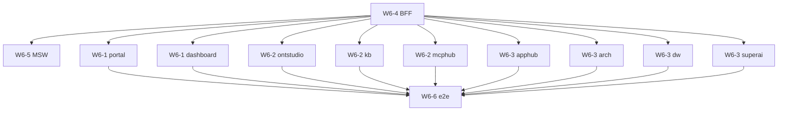

# W6 任务卡：前端 9 apps + 支撑能力

> **源交付项**：[路线图 §4 W6](./2026-07-27-mate-platform-delivery-roadmap.md#w6---前端-9-apps-补齐对接)
> **总览**：[Task Breakdown](./2026-07-27-mate-platform-task-breakdown.md)
> **Sprint**：S5–S8（与 W5 并行，2026-07-28 ~ 2026-10-27）
> **里程碑**：M4（前端就绪）
> **任务卡总数**：59
> **依赖**：W1（OpenAPI，仅依赖契约）

> **格式说明**：W6 跨 9 个 app + 6 个支撑任务。采用**统一 6 卡模板**（scaffold / 路由 / 状态 / 列表 / 详情 / E2E），支撑任务单列。

---

## 目录

| 批次 | 域 | app 数 | TC 数 | 状态 |
|---|---|---|---|---|
| W6-1 | P0: portal + dashboard | 2 | 12 | 未启动 |
| W6-2 | P1: ontstudio + kb + mcphub | 3 | 18 | 未启动 |
| W6-3 | P2: apphub + arch + dw + superai | 4 | 20 | 未启动 |
| W6-4 | BFF API_MODE 开关 | — | 3 | 未启动 |
| W6-5 | MSW 浏览器层 Mock | — | 3 | 未启动 |
| W6-6 | Playwright E2E | — | 3 | 未启动 |

---

## 通用模板（每个 app 共 6 TC）

| TC | 名称 | 工时 |
|---|---|---|
| TC-6.x.1 | 包初始化 + 路由 + MSW 接通 | 1d |
| TC-6.x.2 | 全局状态管理（Zustand/Redux） | 0.5d |
| TC-6.x.3 | 列表页（表格 + 搜索 + 过滤 + 分页） | 1.5d |
| TC-6.x.4 | 详情页（drawer/modal + 表单 + 校验） | 1.5d |
| TC-6.x.5 | 与后端 OpenAPI 端到端联调 | 1d |
| TC-6.x.6 | a11y / i18n / 错误状态打磨 | 0.5d |

每个 app 字段填充：

| 字段 | 值 |
|---|---|
| 前置 TC | W6-4（BFF）+ 上一 app 完工 |
| 可并行 TC | 同批次内其他 app |
| 输出 PR | `feat(<app>): <capability>` |
| 关键路径 | 与 P0/P1 优先级一致 |

---

## W6-1 P0 batch：portal + dashboard（12 张 TC）

> 关键路径：是 | 优先级：P0

### TC-6.1.1 portal 包初始化

| 字段 | 值 |
|---|---|
| 工时 | 1d | 角色 | Frontend | 前置 | W1-4 + W6-4 | PR | `feat(portal): scaffold` |

**目标**：`apps/portal/`（React 18 + Vite + TS + Tailwind + React Router）。

**DoD**：`pnpm dev` 启动、首页 + login 页可访问、MSW 接通。

---

### TC-6.1.2 portal 状态管理

| 字段 | 值 |
|---|---|
| 工时 | 0.5d | 角色 | Frontend | 前置 | TC-6.1.1 | PR | `feat(portal): state` |

**目标**：`useAuthStore`（Zustand）持久化 token + user。

**DoD**：刷新后状态保留。

---

### TC-6.1.3 portal 列表页（应用/角色/租户）

| 字段 | 值 |
|---|---|
| 工时 | 1.5d | 角色 | Frontend | 前置 | TC-6.1.2 | PR | `feat(portal): list` |

**DoD**：3 个列表页（角色/用户/租户），搜索 + 过滤 + 分页走通。

---

### TC-6.1.4 portal 详情页

| 字段 | 值 |
|---|---|
| 工时 | 1.5d | 角色 | Frontend | 前置 | TC-6.1.3 | PR | `feat(portal): detail` |

**DoD**：创建/编辑用户/角色的 drawer、表单校验、错误提示。

---

### TC-6.1.5 portal 端到端联调

| 字段 | 值 |
|---|---|
| 工时 | 1d | 角色 | Frontend | 前置 | TC-6.1.4 | PR | `feat(portal): e2e wired` |

**DoD**：9 成 OpenAPI 端点对接、E2E 跑通。

---

### TC-6.1.6 portal 打磨

| 字段 | 值 |
|---|---|
| 工时 | 0.5d | 角色 | Frontend | 前置 | TC-6.1.5 | PR | `feat(portal): polish` |

**DoD**：a11y（axe 通过）、i18n（中/英）、loading / empty / error 三态齐。

---

### TC-6.1.7 dashboard 包初始化

| 字段 | 值 |
|---|---|
| 工时 | 1d | 角色 | Frontend | 前置 | W6-4 | PR | `feat(dashboard): scaffold` |

**DoD**：`apps/dashboard/` 启动。

---

### TC-6.1.8 dashboard 状态管理

| 字段 | 值 |
|---|---|
| 工时 | 0.5d | 角色 | Frontend | 前置 | TC-6.1.7 | PR | `feat(dashboard): state` |

**DoD**：时区 + 主题 + 布局选择持久化。

---

### TC-6.1.9 dashboard 统计卡片

| 字段 | 值 |
|---|---|
| 工时 | 1.5d | 角色 | Frontend | 前置 | TC-6.1.8、TC-5.8.9 | PR | `feat(dashboard): stat cards` |

**目标**：5 个核心指标（KB 数 / 文档数 / 检索量 / Agent 调用 / LLM Token）。

**DoD**：数字 + 趋势 + 同比。

---

### TC-6.1.10 dashboard 图表

| 字段 | 值 |
|---|---|
| 工时 | 1.5d | 角色 | Frontend | 前置 | TC-6.1.9 | PR | `feat(dashboard): charts` |

**DoD**：3 个 ECharts 图表（趋势 / 分布 / 排行）。

---

### TC-6.1.11 dashboard 端到端联调

| 字段 | 值 |
|---|---|
| 工时 | 1d | 角色 | Frontend | 前置 | TC-6.1.10 | PR | `feat(dashboard): e2e wired` |

**DoD**：tech-obs + app-kb 数据源接全。

---

### TC-6.1.12 dashboard 打磨

| 字段 | 值 |
|---|---|
| 工时 | 0.5d | 角色 | Frontend | 前置 | TC-6.1.11 | PR | `feat(dashboard): polish` |

**DoD**：可拖拽布局 + 暗色主题。

---

## W6-2 P1 batch：ontstudio + kb + mcphub（18 张 TC）

> 关键路径：是 | 优先级：P1

### TC-6.2.1 ontstudio 初始化

| 字段 | 值 |
|---|---|
| 工时 | 1d | 角色 | Frontend | 前置 | W6-4 | PR | `feat(ontstudio): scaffold` |

---

### TC-6.2.2 ontstudio 状态管理

| 字段 | 值 |
|---|---|
| 工时 | 0.5d | 角色 | Frontend | 前置 | TC-6.2.1 | PR | `feat(ontstudio): state` |

---

### TC-6.2.3 ontstudio 本体树形列表

| 字段 | 值 |
|---|---|
| 工时 | 1.5d | 角色 | Frontend | 前置 | TC-6.2.2、TC-5.4.3 | PR | `feat(ontstudio): class tree` |

**DoD**：类层次树（懒加载）+ 右键菜单。

---

### TC-6.2.4 ontstudio 详情/编辑

| 字段 | 值 |
|---|---|
| 工时 | 1.5d | 角色 | Frontend | 前置 | TC-6.2.3 | PR | `feat(ontstudio): detail` |

**DoD**：属性 + 实例 + 关系 3 tab 编辑。

---

### TC-6.2.5 ontstudio SPARQL 编辑器

| 字段 | 值 |
|---|---|
| 工时 | 1.5d | 角色 | Frontend | 前置 | TC-6.2.4、TC-5.4.4 | PR | `feat(ontstudio): sparql editor` |

**DoD**：Monaco + 语法高亮 + 结果表。

---

### TC-6.2.6 ontstudio 端到端联调 + 打磨

| 字段 | 值 |
|---|---|
| 工时 | 1d | 角色 | Frontend | 前置 | TC-6.2.5 | PR | `feat(ontstudio): e2e+polish` |

---

### TC-6.2.7 kb 初始化

| 字段 | 值 |
|---|---|
| 工时 | 1d | 角色 | Frontend | 前置 | W6-4 | PR | `feat(kb): scaffold` |

---

### TC-6.2.8 kb 状态管理

| 字段 | 值 |
|---|---|
| 工时 | 0.5d | 角色 | Frontend | 前置 | TC-6.2.7 | PR | `feat(kb): state` |

---

### TC-6.2.9 kb 知识库列表

| 字段 | 值 |
|---|---|
| 工时 | 1.5d | 角色 | Frontend | 前置 | TC-6.2.8、TC-5.8.3 | PR | `feat(kb): list` |

---

### TC-6.2.10 kb 文档上传 + 状态

| 字段 | 值 |
|---|---|
| 工时 | 1.5d | 角色 | Frontend | 前置 | TC-6.2.9、TC-5.8.4 | PR | `feat(kb): upload` |

**DoD**：拖拽上传 + 分块进度 SSE 实时。

---

### TC-6.2.11 kb 检索界面

| 字段 | 值 |
|---|---|
| 工时 | 1.5d | 角色 | Frontend | 前置 | TC-6.2.10、TC-5.6.6 | PR | `feat(kb): search ui` |

**DoD**：Query 输入 + 结果 + 引用高亮。

---

### TC-6.2.12 kb 端到端 + 打磨

| 字段 | 值 |
|---|---|
| 工时 | 1d | 角色 | Frontend | 前置 | TC-6.2.11 | PR | `feat(kb): e2e+polish` |

---

### TC-6.2.13 mcphub 初始化

| 字段 | 值 |
|---|---|
| 工时 | 1d | 角色 | Frontend | 前置 | W6-4 | PR | `feat(mcphub): scaffold` |

---

### TC-6.2.14 mcphub 状态

| 字段 | 值 |
|---|---|
| 工时 | 0.5d | 角色 | Frontend | 前置 | TC-6.2.13 | PR | `feat(mcphub): state` |

---

### TC-6.2.15 mcphub 工具列表 + 详情

| 字段 | 值 |
|---|---|
| 工时 | 1.5d | 角色 | Frontend | 前置 | TC-6.2.14、TC-5.3.8 | PR | `feat(mcphub): tool list` |

---

### TC-6.2.16 mcphub 调用试运行

| 字段 | 值 |
|---|---|
| 工时 | 1.5d | 角色 | Frontend | 前置 | TC-6.2.15 | PR | `feat(mcphub): try it` |

**DoD**：填 JSON Schema → 调工具 → 看结果。

---

### TC-6.2.17 mcphub 资源浏览

| 字段 | 值 |
|---|---|
| 工时 | 1d | 角色 | Frontend | 前置 | TC-6.2.16 | PR | `feat(mcphub): resources` |

---

### TC-6.2.18 mcphub 端到端 + 打磨

| 字段 | 值 |
|---|---|
| 工时 | 1d | 角色 | Frontend | 前置 | TC-6.2.17 | PR | `feat(mcphub): e2e+polish` |

---

## W6-3 P2 batch：apphub + arch + dw + superai（20 张 TC）

> 关键路径：否 | 优先级：P2 | 工期 3 周

### TC-6.3.1 apphub 初始化

| 字段 | 值 |
|---|---|
| 工时 | 1d | 角色 | Frontend | 前置 | W6-4 | PR | `feat(apphub): scaffold` |

**目标**：`apps/apphub/` —— 应用商店风格市场。

---

### TC-6.3.2 apphub 状态

| 字段 | 值 |
|---|---|
| 工时 | 0.5d | 角色 | Frontend | 前置 | TC-6.3.1 | PR | `feat(apphub): state` |

---

### TC-6.3.3 apphub 应用列表

| 字段 | 值 |
|---|---|
| 工时 | 1.5d | 角色 | Frontend | 前置 | TC-6.3.2 | PR | `feat(apphub): list` |

**DoD**：分类、搜索、评分。

---

### TC-6.3.4 apphub 安装/卸载

| 字段 | 值 |
|---|---|
| 工时 | 1d | 角色 | Frontend | 前置 | TC-6.3.3 | PR | `feat(apphub): install` |

**DoD**：安装进度 + 错误回滚。

---

### TC-6.3.5 apphub 端到端 + 打磨

| 字段 | 值 |
|---|---|
| 工时 | 1d | 角色 | Frontend | 前置 | TC-6.3.4 | PR | `feat(apphub): e2e+polish` |

---

### TC-6.3.6 arch 初始化

| 字段 | 值 |
|---|---|
| 工时 | 1d | 角色 | Frontend | 前置 | W6-4 | PR | `feat(arch): scaffold` |

**目标**：`apps/arch/` —— 架构图编辑。

---

### TC-6.3.7 arch 状态

| 字段 | 值 |
|---|---|
| 工时 | 0.5d | 角色 | Frontend | 前置 | TC-6.3.6 | PR | `feat(arch): state` |

---

### TC-6.3.8 arch 画布

| 字段 | 值 |
|---|---|
| 工时 | 2d | 角色 | Frontend | 前置 | TC-6.3.7 | PR | `feat(arch): canvas` |

**DoD**：拖拽节点、连线、保存。

---

### TC-6.3.9 arch 模板库

| 字段 | 值 |
|---|---|
| 工时 | 1d | 角色 | Frontend | 前置 | TC-6.3.8 | PR | `feat(arch): templates` |

---

### TC-6.3.10 arch 端到端 + 打磨

| 字段 | 值 |
|---|---|
| 工时 | 1d | 角色 | Frontend | 前置 | TC-6.3.9 | PR | `feat(arch): e2e+polish` |

---

### TC-6.3.11 dw 初始化

| 字段 | 值 |
|---|---|
| 工时 | 1d | 角色 | Frontend | 前置 | W6-4 | PR | `feat(dw): scaffold` |

**目标**：`apps/dw/` —— DataWorks 风格数据工作流。

---

### TC-6.3.12 dw 状态

| 字段 | 值 |
|---|---|
| 工时 | 0.5d | 角色 | Frontend | 前置 | TC-6.3.11 | PR | `feat(dw): state` |

---

### TC-6.3.13 dw 画布（节点 + 连线）

| 字段 | 值 |
|---|---|
| 工时 | 2d | 角色 | Frontend | 前置 | TC-6.3.12 | PR | `feat(dw): canvas` |

---

### TC-6.3.14 dw 节点库

| 字段 | 值 |
|---|---|
| 工时 | 1d | 角色 | Frontend | 前置 | TC-6.3.13 | PR | `feat(dw): nodes` |

**DoD**：10 个内置节点（DB / HTTP / LLM / Agent / Branch 等）。

---

### TC-6.3.15 dw 端到端 + 打磨

| 字段 | 值 |
|---|---|
| 工时 | 1d | 角色 | Frontend | 前置 | TC-6.3.14 | PR | `feat(dw): e2e+polish` |

---

### TC-6.3.16 superai 初始化

| 字段 | 值 |
|---|---|
| 工时 | 1d | 角色 | Frontend | 前置 | W6-4 | PR | `feat(superai): scaffold` |

**目标**：`apps/superai/` —— SuperAI 助手入口。

---

### TC-6.3.17 superai 状态

| 字段 | 值 |
|---|---|
| 工时 | 0.5d | 角色 | Frontend | 前置 | TC-6.3.16 | PR | `feat(superai): state` |

---

### TC-6.3.18 superai 对话界面

| 字段 | 值 |
|---|---|
| 工时 | 1.5d | 角色 | Frontend | 前置 | TC-6.3.17、TC-5.7.9 | PR | `feat(superai): chat ui` |

**DoD**：流式输出 + 工具调用可视化。

---

### TC-6.3.19 superai 历史 / 收藏

| 字段 | 值 |
|---|---|
| 工时 | 1d | 角色 | Frontend | 前置 | TC-6.3.18 | PR | `feat(superai): history` |

---

### TC-6.3.20 superai 端到端 + 打磨

| 字段 | 值 |
|---|---|
| 工时 | 1d | 角色 | Frontend | 前置 | TC-6.3.19 | PR | `feat(superai): e2e+polish` |

---

## W6-4 BFF `API_MODE=mock|live|hybrid` 开关

> 关键路径：是 | 优先级：P0

### TC-6.4.1 BFF 项目初始化

| 字段 | 值 |
|---|---|
| 工时 | 1d | 角色 | Frontend | 前置 | TC-1.1.7 | PR | `feat(bff): scaffold` |

**目标**：`apps/bff/`（Node + Fastify + TS），统一前端请求入口。

**DoD**：`pnpm dev` 启动 + 透传一个 mock 端点。

---

### TC-6.4.2 API_MODE 路由分发

| 字段 | 值 |
|---|---|
| 工时 | 1d | 角色 | Frontend | 前置 | TC-6.4.1 | PR | `feat(bff): api_mode router` |

**目标**：根据 env 决定走 mock / live / 混合。

**DoD**：3 种模式切换不影响前端代码。

---

### TC-6.4.3 BFF 文档 + 部署

| 字段 | 值 |
|---|---|
| 工时 | 0.5d | 角色 | Frontend | 前置 | TC-6.4.2 | PR | `docs(bff): usage` |

**DoD**：`docs/runbooks/bff.md` + Docker 镜像。

---

## W6-5 MSW 浏览器层 Mock

### TC-6.5.1 MSW 基础

| 字段 | 值 |
|---|---|
| 工时 | 0.5d | 角色 | Frontend | 前置 | TC-6.4.1 | PR | `feat(msw): setup` |

**DoD**：handlers/ 目录 + worker 启动。

---

### TC-6.5.2 OpenAPI → MSW 自动生成

| 字段 | 值 |
|---|---|
| 工时 | 1d | 角色 | Frontend | 前置 | TC-1.6.1、TC-6.5.1 | PR | `feat(msw): codegen` |

**目标**：`openapi-typescript` + `msw` 自动生成 handlers。

**DoD**：改 OpenAPI 后 PR 自动更新 mocks。

---

### TC-6.5.3 Storybook 集成

| 字段 | 值 |
|---|---|
| 工时 | 0.5d | 角色 | Frontend | 前置 | TC-6.5.2 | PR | `feat(msw): storybook` |

**DoD**：每个组件有 story + mock 数据可独立调试。

---

## W6-6 Playwright E2E

### TC-6.6.1 Playwright 基础

| 字段 | 值 |
|---|---|
| 工时 | 0.5d | 角色 | QA | 前置 | TC-6.4.3 | PR | `test(e2e): setup` |

**DoD**：`pnpm test:e2e` 跑通一个 demo。

---

### TC-6.6.2 每 app 关键路径 E2E

| 字段 | 值 |
|---|---|
| 工时 | 1.5 周 | 角色 | QA | 前置 | TC-6.6.1 | PR | `test(e2e): all apps` |

**目标**：9 apps 各 ≥ 5 个关键 E2E（登录 / 主流程 / 错误路径）。

**DoD**：CI 中 `e2e` job 绿。

---

### TC-6.6.3 视觉回归

| 字段 | 值 |
|---|---|
| 工时 | 0.5 周 | 角色 | QA | 前置 | TC-6.6.2 | PR | `test(e2e): visual` |

**目标**：P0 apps 加视觉回归（snapshots）。

**DoD**：误报率 < 5%。

---

## W6 完成度检查表

| W6-n | 范围 | 路线图工时 | TC 数 | 状态 |
|---|---|---|---|---|
| W6-1 | P0: portal + dashboard | 4 周 | 12 | 未启动 |
| W6-2 | P1: ontstudio + kb + mcphub | 4 周 | 18 | 未启动 |
| W6-3 | P2: apphub + arch + dw + superai | 3 周 | 20 | 未启动 |
| W6-4 | BFF API_MODE | 2d | 3 | 未启动 |
| W6-5 | MSW | 3d | 3 | 未启动 |
| W6-6 | Playwright E2E | 2 周 | 3 | 未启动 |
| **合计** | — | **~13 周** | **59** | **未启动** |

---

## Sprint 排程

| Sprint | 周次 | 重点 | 备注 |
|---|---|---|---|
| **S5a** | W6-1 D1-D2 | W6-4 BFF + W6-5 MSW | 前置 |
| **S5b** | W6-1 D3-D5 | W6-1 portal 6 TC | 与 W5-1/2/3 并行 |
| **S6a** | W6-1 D5-D7 | W6-1 dashboard 6 TC | |
| **S6b** | W6-2 D1-D7 | W6-2 ontstudio + kb + mcphub 18 TC | 与 W5-4/5 并行 |
| **S7a** | W6-3 D1-D7 | W6-3 apphub + arch | 与 W5-6/7 并行 |
| **S7b** | W6-3 D5-D7 | W6-3 dw + superai | |
| **S8** | W6 收尾 | W6-6 E2E 全量 | M4 验收 |

---

## 依赖关系图

---

## 变更记录

| 日期 | 变更 | 原因 |
|---|---|---|
| 2026-07-27 | v1.0 初稿 | 配合 Task Breakdown 总览建立 W6 任务卡（统一 6 卡模板） |
