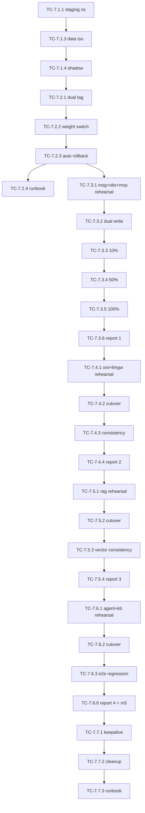

# W7 任务卡：蓝绿迁移（无 Java 兜底）

> **源交付项**：[路线图 §4 W7](./2026-07-27-mate-platform-delivery-roadmap.md#w7---蓝绿迁移无-java-兜底)
> **总览**：[Task Breakdown](./2026-07-27-mate-platform-task-breakdown.md)
> **Sprint**：S11–S13（2026-09-22 ~ 2026-12-22）
> **里程碑**：M5（蓝绿上线）
> **任务卡总数**：31
> **依赖**：W5（业务域）+ W6（前端）

> **核心原则**：无 Java 兜底，每次迁移失败回退 v_{n-1} 7 天可观察期。

---

## 目录

- [W7-1 预发布环境搭建](#w7-1-预发布环境搭建)
- [W7-2 蓝绿部署流程脚本](#w7-2-蓝绿部署流程脚本)
- [W7-3 模块迁移 #1：msg + obs + mcp](#w7-3-模块迁移-1msg--obs--mcp)
- [W7-4 模块迁移 #2：ont + llmgw](#w7-4-模块迁移-2ont--llmgw)
- [W7-5 模块迁移 #3：rag](#w7-5-模块迁移-3rag)
- [W7-6 模块迁移 #4：agent + app-kb](#w7-6-模块迁移-4agent--app-kb)
- [W7-7 v_{n-1} 保留 7 天 + 自动清理](#w7-7-v_n-1-保留-7-天--自动清理)

---

## W7-1 预发布环境搭建

> 路线图工时：1 周 | TC 数：4 | 关键路径：是

### TC-7.1.1 独立 K8s namespace

| 字段 | 值 |
|---|---|
| 工时 | 1d | 角色 | DevOps | 前置 | W4.1.1 | PR | `dev: staging ns` |

**目标**：在 K8s 集群建 `mate-staging` namespace。

**DoD**：`kubectl get ns` 看到 + 默认 service account 权限收窄。

---

### TC-7.1.2 预发布 compose project

| 字段 | 值 |
|---|---|
| 工时 | 1d | 角色 | DevOps | 前置 | TC-7.1.1 | PR | `dev: staging compose` |

**目标**：dev 也有本地 staging 模拟（用不同 docker-compose project）。

**DoD**：`docker compose -p mate-staging up -d` 启一套完整链路。

---

### TC-7.1.3 数据隔离

| 字段 | 值 |
|---|---|
| 工时 | 2d | 角色 | DevOps | 前置 | TC-7.1.2 | PR | `dev: staging data iso` |

**目标**：staging 用独立 PG / Redis / MinIO 桶（带 `stg_` 前缀）。

**DoD**：dev 数据不会出现在 staging。

---

### TC-7.1.4 流量影子

| 字段 | 值 |
|---|---|
| 工时 | 1d | 角色 | DevOps | 前置 | TC-7.1.3 | PR | `dev: shadow traffic` |

**目标**：staging 同时接收 prod 流量的 5% 影子（不写回）。

**DoD**：影子请求有 trace_id 关联。

---

## W7-2 蓝绿部署流程脚本

> 路线图工时：1 周 | TC 数：4 | 关键路径：是

### TC-7.2.1 镜像双 tag（v_n / v_{n-1}）

| 字段 | 值 |
|---|---|
| 工时 | 1d | 角色 | DevOps | 前置 | TC-7.1.2 | PR | `ci: dual tag` |

**目标**：CI 同时给新镜像打 `v_n` 与 `previous=latest` 标签。

**DoD**：`ghcr.io/mate/tech-kb:v_n` 与 `previous` 都存在。

---

### TC-7.2.2 Traefik 权重切换

| 字段 | 值 |
|---|---|
| 工时 | 2d | 角色 | DevOps | 前置 | TC-7.2.1、TC-4.3.3 | PR | `feat(gw): weight switch` |

**目标**：`scripts/blue-green-switch.sh tech-kb 100` 把 v_n 切到 100% 流量。

**DoD**：权重可任意切，5s 内生效。

---

### TC-7.2.3 健康检查 + 自动回滚

| 字段 | 值 |
|---|---|
| 工时 | 2d | 角色 | DevOps | 前置 | TC-7.2.2 | PR | `feat(gw): auto rollback` |

**目标**：v_n 切 100% 后 60s 内若 5xx > 1% → 自动回滚到 v_{n-1}。

**DoD**：注入故障 30s 内自动回滚。

---

### TC-7.2.4 切换 runbook

| 字段 | 值 |
|---|---|
| 工时 | 1d | 角色 | DevOps | 前置 | TC-7.2.2、TC-7.2.3 | PR | `docs: blue-green runbook` |

**目标**：`docs/runbooks/blue-green.md`：从预演到回滚全流程。

**DoD**：新人照文档 30 分钟内能切一个 service。

---

## W7-3 模块迁移 #1：tech-msg + tech-obs + tech-mcp

> 路线图工时：3 周 | TC 数：6 | 关键路径：是

### TC-7.3.1 预发布 3 模块联合演练

| 字段 | 值 |
|---|---|
| 工时 | 2d | 角色 | DevOps + Backend | 前置 | TC-7.2.3、W5-1/2/3 | PR | `migrate: msg+obs+mcp rehearsal` |

**目标**：在 staging 跑 1 周联合演练。

**DoD**：staging 端到端 200。

---

### TC-7.3.2 数据双写

| 字段 | 值 |
|---|---|
| 工时 | 2d | 角色 | Backend | 前置 | TC-7.3.1 | PR | `migrate: dual write` |

**目标**：生产端 tech-msg 同步写 v_n 与 v_{n-1}（用于对比）。

**DoD**：3 天后两端数据差异 < 0.01%。

---

### TC-7.3.3 流量切 10%

| 字段 | 值 |
|---|---|
| 工时 | 1d | 角色 | DevOps | 前置 | TC-7.3.2 | PR | `migrate: 10% cutover` |

**DoD**：监控 24h，错误率 < 0.1%。

---

### TC-7.3.4 流量切 50%

| 字段 | 值 |
|---|---|
| 工时 | 1d | 角色 | DevOps | 前置 | TC-7.3.3 | PR | `migrate: 50% cutover` |

**DoD**：监控 24h。

---

### TC-7.3.5 流量切 100%

| 字段 | 值 |
|---|---|
| 工时 | 1d | 角色 | DevOps | 前置 | TC-7.3.4 | PR | `migrate: 100% cutover` |

**DoD**：监控 7 天，0 P0/P1。

---

### TC-7.3.6 迁移完成报告

| 字段 | 值 |
|---|---|
| 工时 | 1d | 角色 | PM | 前置 | TC-7.3.5 | PR | `docs: migration 1 report` |

**目标**：`docs/migration/2026-10-msg-obs-mcp.md`。

**DoD**：含指标对比、问题清单、回滚预案。

---

## W7-4 模块迁移 #2：tech-ont + tech-llmgw

> 路线图工时：2 周 | TC 数：4 | 关键路径：是

### TC-7.4.1 预发布联合演练

| 字段 | 值 |
|---|---|
| 工时 | 1d | 角色 | DevOps + Backend | 前置 | TC-7.3.5、W5-4/5 | PR | `migrate: ont+llmgw rehearsal` |

---

### TC-7.4.2 流量分阶段切

| 字段 | 值 |
|---|---|
| 工时 | 1 周 | 角色 | DevOps | 前置 | TC-7.4.1 | PR | `migrate: ont+llmgw cutover` |

**DoD**：10% → 50% → 100%，每阶段 24h 观察。

---

### TC-7.4.3 数据一致性校验

| 字段 | 值 |
|---|---|
| 工时 | 2d | 角色 | Backend | 前置 | TC-7.4.2 | PR | `migrate: ont consistency` |

**目标**：对照 Neo4j 实例数、关系数、向量数。

**DoD**：差异 < 0.01%。

---

### TC-7.4.4 迁移完成报告

| 字段 | 值 |
|---|---|
| 工时 | 1d | 角色 | PM | 前置 | TC-7.4.3 | PR | `docs: migration 2 report` |

---

## W7-5 模块迁移 #3：tech-rag

> 路线图工时：2 周 | TC 数：4 | 关键路径：是

### TC-7.5.1 预发布 + 检索质量对比

| 字段 | 值 |
|---|---|
| 工时 | 2d | 角色 | QA + Backend | 前置 | TC-7.4.4、W5-6 | PR | `migrate: rag rehearsal` |

**目标**：用 W5-6.10 评估集对比 v_n vs v_{n-1}。

**DoD**：nDCG@10 差异 < 2%。

---

### TC-7.5.2 流量分阶段切

| 字段 | 值 |
|---|---|
| 工时 | 1 周 | 角色 | DevOps | 前置 | TC-7.5.1 | PR | `migrate: rag cutover` |

---

### TC-7.5.3 向量数据一致性

| 字段 | 值 |
|---|---|
| 工时 | 1d | 角色 | Backend | 前置 | TC-7.5.2 | PR | `migrate: rag vector consistency` |

---

### TC-7.5.4 迁移完成报告

| 字段 | 值 |
|---|---|
| 工时 | 1d | 角色 | PM | 前置 | TC-7.5.3 | PR | `docs: migration 3 report` |

---

## W7-6 模块迁移 #4：tech-agent + app-kb

> 路线图工时：3 周 | TC 数：6 | 关键路径：是

### TC-7.6.1 预发布 + 4 个场景验证

| 字段 | 值 |
|---|---|
| 工时 | 3d | 角色 | QA + Backend | 前置 | TC-7.5.4、W5-7/8 | PR | `migrate: agent+kb rehearsal` |

**DoD**：S1-S4 场景全过。

---

### TC-7.6.2 流量分阶段切

| 字段 | 值 |
|---|---|
| 工时 | 1.5 周 | 角色 | DevOps | 前置 | TC-7.6.1 | PR | `migrate: agent+kb cutover` |

---

### TC-7.6.3 E2E 全量回归

| 字段 | 值 |
|---|---|
| 工时 | 2d | 角色 | QA | 前置 | TC-7.6.2 | PR | `migrate: e2e regression` |

**DoD**：W6-6 所有 E2E 100% 绿。

---

### TC-7.6.4 性能对比

| 字段 | 值 |
|---|---|
| 工时 | 1d | 角色 | Backend | 前置 | TC-7.6.2 | PR | `migrate: perf compare` |

**DoD**：p95 延迟差异 < 5%。

---

### TC-7.6.5 业务指标对比

| 字段 | 值 |
|---|---|
| 工时 | 1d | 角色 | PM | 前置 | TC-7.6.3 | PR | `migrate: biz metric` |

**目标**：检索成功率、Agent 完成率、用户反馈。

**DoD**：指标持平或更好。

---

### TC-7.6.6 迁移完成报告（M5 收官）

| 字段 | 值 |
|---|---|
| 工时 | 1d | 角色 | PM | 前置 | TC-7.6.5 | PR | `docs: migration 4 report + m5 done` |

**DoD**：M5 收官报告 + Go-Live 公告。

---

## W7-7 v_{n-1} 保留 7 天 + 自动清理

> 路线图工时：1 周 | TC 数：3 | 关键路径：否

### TC-7.7.1 保留期提醒

| 字段 | 值 |
|---|---|
| 工时 | 0.5d | 角色 | DevOps | 前置 | TC-7.6.6 | PR | `dev: keepalive alert` |

**目标**：v_{n-1} 镜像保留 7 天，期间每天提醒（Slack）。

**DoD**：第 7 天仍可访问 v_{n-1}。

---

### TC-7.7.2 自动清理脚本

| 字段 | 值 |
|---|---|
| 工时 | 1d | 角色 | DevOps | 前置 | TC-7.7.1 | PR | `dev: cleanup script` |

**目标**：`scripts/cleanup-old-releases.sh`：删 7 天前的镜像与 k8s 部署。

**DoD**：定时任务 + 手动触发均成功。

---

### TC-7.7.3 清理 runbook

| 字段 | 值 |
|---|---|
| 工时 | 0.5d | 角色 | DevOps | 前置 | TC-7.7.2 | PR | `docs: cleanup runbook` |

**DoD**：`docs/runbooks/cleanup.md`。

---

## W7 完成度检查表

| W7-n | 范围 | 路线图工时 | TC 数 | 关键路径 | 状态 |
|---|---|---|---|---|---|
| W7-1 | 预发布环境 | 1 周 | 4 | 是 | 未启动 |
| W7-2 | 蓝绿流程 | 1 周 | 4 | 是 | 未启动 |
| W7-3 | 迁移 #1: msg+obs+mcp | 3 周 | 6 | 是 | 未启动 |
| W7-4 | 迁移 #2: ont+llmgw | 2 周 | 4 | 是 | 未启动 |
| W7-5 | 迁移 #3: rag | 2 周 | 4 | 是 | 未启动 |
| W7-6 | 迁移 #4: agent+app-kb | 3 周 | 6 | 是 | 未启动 |
| W7-7 | 保留 + 清理 | 1 周 | 3 | 否 | 未启动 |
| **合计** | — | **13 周** | **31** | — | **未启动** |

---

## 关键路径与里程碑

```
W7-1 → W7-2 → W7-3 → W7-4 → W7-5 → W7-6 → M5 Go-Live
                                       ↓
                                      W7-7
```

| 阶段 | 周次 | 重点 |
|---|---|---|
| **S11a** | W11 (09-22 ~ 10-05) | W7-1 预发布 + W7-2 蓝绿脚本 |
| **S11b** | W12 (10-06 ~ 10-19) | W7-3 迁移 #1 演练 + 数据双写 |
| **S12a** | W12 (10-20 ~ 11-02) | W7-3 流量切完 |
| **S12b** | W13 (11-03 ~ 11-16) | W7-4 + W7-5 迁移 |
| **S13a** | W13 (11-17 ~ 11-30) | W7-6 agent+kb 迁移 |
| **S13b** | W14 (12-01 ~ 12-22) | 观察期 + 收官 + W7-7 |

> 4 次迁移每次 7 天观察期。Go-Live 公告日 2026-12-22。

---

## 风险与缓解

| 风险 | 等级 | 缓解 |
|---|---|---|
| R1 单模块迁移失败无 Java 兜底 | 🔴 高 | 充分预演 + 7 天回退窗口 |
| R2 数据迁移过程中 v_{n-1} 写入丢失 | 🔴 高 | 双向同步 3 天后再切流量 |
| R3 影子流量中敏感数据泄露 | 🟡 中 | 脱敏后比对、不落库 |
| R4 关键路径回退超时 | 🟡 中 | 自动回滚 + 1-click runbook |
| R5 评估集过拟合 | 🟢 低 | 影子流量 + 真实用户反馈双轨 |

---

## 蓝绿切换流程图

```mermaid
flowchart LR
    A[v_{n-1} 100%] --> B[启动 v_n 影子 5%]
    B --> C[双写 3 天]
    C --> D[切 10% 流量]
    D --> E{监控 24h<br/>错误率 < 0.1%?}
    E -- 是 --> F[切 50%]
    E -- 否 --> Z[回滚 v_{n-1}]
    F --> G{监控 24h}
    G -- 是 --> H[切 100%]
    G -- 否 --> Z
    H --> I[观察 7 天]
    I --> J{7 天无 P0/P1?}
    J -- 是 --> K[标记 v_n 为 latest]
    J -- 否 --> Z
    K --> L[启动 7 天保留期 + 清理]
```

---

## 依赖关系图



---

## 变更记录

| 日期 | 变更 | 原因 |
|---|---|---|
| 2026-07-27 | v1.0 初稿 | 配合 Task Breakdown 总览建立 W7 任务卡 |
