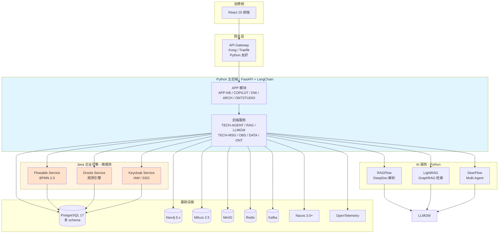
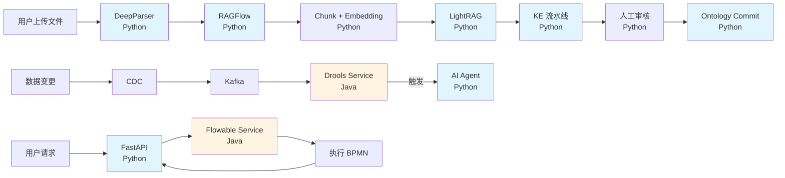

# Mate Platform 技术架构（主架构 - v3.0 Plan D）

> ⚠️ **本文档已归档（2026-07-27）**
>
> 本文档为**决策导向版本**，包含 v3.0 vs v2.1 对比、22 个设计模式详尽列举、迁移路径讨论等"模糊"内容。
>
> **实施导向版本（最新）**：2026-07-27-mate-platform-architecture-implementation.md
>
> 仅作为决策追溯保留。实施请参考新版文档。


> **版本**：v3.0 | **日期**：2026-07-27 | **状态**：正式主架构（THE ONE DOC）
>
> **核心突破**：抛弃"Java 主力 vs Python AI"的二元选择，采用**"Polyglot Microservice Architecture"（多语言微服务架构）**——**�a�言只是实现细节，业务按需选最佳技术**。
>
> **本文件状态**：Mate Platform **正式主架构（THE ONE DOC）**
>
> **历史文档**（已归档，供决策追溯）：
> - v2.1 主架构：`archive/2026-07-27-mate-platform-technical-architecture-v2.1.md（Java 主力 + Python AI）
> - v2 决策：`archive/2026-07-27-v2-tech-stack-decision.md（已废止）
> - v2.0 / v1 方案：`archive/ 下其他 6 份历史文档


---

## 0. 为什么需要 v3.0（Plan D）

### 0.1 v2.1 的局限性

v2.1（Java 主力 + Python AI 子域）在工程现实中有 4 个痛点：

| 痛点 | 表现 |
|---|---|
| **桥接层冗余** | Java 主后端 → Java 桥接层 → Python AI 服务，**多一跳** |
| **AI 生态劣势** | LangChain / LlamaIndex 的 Python 生态远超 Java 端 Spring AI |
| **BPMN 缺口** | 复杂工作流 Java Flowable 在 v2.1 走主后端，但全 Python 后无法享用 |
| **团队配置** | 若团队以 Python 为主，v2.1 强 Java 主力**违反团队实际** |

### 0.2 Plan D 的核心思想

> **让"语言"退到实现层，让"服务"显式化。**
>
> **不**在 Python 生态里找 Java 替代品（接受 70% 能力）。
> **不**全 Java（错过 Python AI 生态红利）。
> **而是**：用 Java 的最强引擎 + 用 Python 的最强 AI，**全部通过 API 暴露为服务**。

### 0.3 决策对比

| 维度 | v2.1 (Java 主力) | **v3.0 (Plan D)** |
|---|---|---|
| 主后端语言 | Java 21 | **Python 3.12+** |
| BPMN 引擎 | TECH-WFE（Java） | **Flowable Service（Java 微服务）** |
| 规则引擎 | TECH-RULE（Java） | **Drools Service（Java 微服务）** |
| IAM | TECH-IAM（Java） | **Keycloak Service（Java）** |
| AI 编排 | SAA（Java） | **LangChain / LlamaIndex（Python）** |
| 多 Agent | DeerFlow（Python） | **DeerFlow（Python）** |
| RAG | RAGFlow + LightRAG（Python） | **RAGFlow + LightRAG（Python）** |
| 语言选择 | "Java 为主" | **"每服务选最佳"** |

---

## 1. 核心架构模式：Polyglot Microservice

### 1.1 模式定义

**Polyglot Microservice**（多语言微服务）是一种架构模式，**系统中不同服务用不同语言实现**，但**通过统一的协议（REST/gRPC）+ 统一的基础设施（Nacos/Kafka）** 互联互通。

**关键原则**：
- **语言不是约束**——服务选最适合的语言
- **接口是契约**——REST/gRPC + OpenAPI
- **基础设施统一**——Nacos 服务发现 + Kafka 事件流 + OTel 可观测
- **可独立部署**——每个服务独立的 K8s Deployment

### 1.2 架构总图



### 1.3 服务全景（15+ 服务）

| 层 | 服务 | 语言 | 职责 | 状态 |
|---|---|---|---|---|
| **网关** | API Gateway | Go/Python | Kong/Traefik | 🆕 |
| **Python 主后端** | APP 模块 | Python | 业务 API | 🆕 |
| | TECH-AGENT | Python | 多 Agent 编排 | 🆕 |
| | TECH-RAG | Python | RAG 业务逻辑 | 🔄 重写 |
| | TECH-LLMGW | Python | LLM 路由 | 🔄 重写 |
| | TECH-MSG | Python | 消息 | 🆕 |
| | TECH-OBS | Python | 可观测 | 🆕 |
| | TECH-DATA | Python | 数据访问 | 🆕 |
| | TECH-ONT | Python | Ontology | 🔄 重写 |
| | TECH-MCP | Python | MCP 协议 | 🆕 |
| **Python AI 服务** | RAGFlow | Python | DeepDoc 解析 | ✅ 已有 |
| | LightRAG | Python | GraphRAG | ✅ 已有 |
| | DeerFlow | Python | Multi-Agent | ✅ 已有 |
| **Java 企业引擎** | Flowable Service | Java | BPMN 2.0 | 🆕 **本版本新增** |
| | Drools Service | Java | 规则引擎 | 🆕 **本版本新增** |
| | Keycloak Service | Java | IAM/SSO | 🆕 **本版本新增** |

---


## 2. 软件设计模式（Software Design Patterns）

> **本节是 v3.0 的"代码层宪法"**——所有服务（Python 主后端 + Java 微服务）必须遵循这些模式。
>
> **目标**：3-5 年后新人能在 1 周内理解代码结构 + 1 个月内能上手改任何模块。
>
> **核心原则**：
> - **业务逻辑与基础设施解耦**（Hexagonal）
> - **服务边界清晰**（DDD）
> - **读写路径分离**（CQRS）
> - **跨服务异步事件**（Event-Driven + Outbox）
> - **故障隔离**（Circuit Breaker + Bulkhead）
> - **可测试性优先**（Repository + DI）

### 2.1 架构模式

#### 2.1.1 Hexagonal Architecture（端口与适配器）

**核心思想**：业务核心（Domain）不依赖任何外部实现，所有外部依赖通过**端口（Port）**和**适配器（Adapter）**接入。

```
                     ┌──────────────────────────────┐
                     │  API 适配器                    │
                     │  (FastAPI Routes / DTO)        │
                     └────────────┬─────────────────┘
                                  │ 端口：Query / Command
                     ┌────────────▼─────────────────┐
                     │  Application Service          │
                     │  (用例编排)                   │
                     └────────────┬─────────────────┘
                                  │ 端口：Repository
                     ┌────────────▼─────────────────┐
              ┌──────┤  Domain Core                ├──────┐
              │      │  (实体 / 领域服务 / 事件) │      │
              │      └──────────────────────────────┘      │
       持久化适配器                              外部服务适配器
   (PG / Neo4j / Milvus)                (RAGFlow / LightRAG /
                                          Flowable / Drools / LLM)
```

**v3.0 应用**：
- **Python 主后端**：domain / application / infrastructure / api 四层
- **Java 服务**：同样四层（domain / application / infrastructure / api）
- **好处**：换 RAGFlow 为 LangChain 只需改适配器，不动业务逻辑

#### 2.1.2 Domain-Driven Design (DDD) - Bounded Context

**核心思想**：用**有界上下文（Bounded Context）**划分业务边界，每个上下文有自己独立的模型。

**v3.0 Bounded Contexts**：

| Bounded Context | 拥有者 | 核心模型 |
|---|---|---|
| **Knowledge** | TECH-RAG | Document, Chunk, KnowledgeBase |
| **Ontology** | TECH-ONT | Concept, Entity, Relation |
| **Agent** | TECH-AGENT | AgentRun, Task, Plan |
| **Workflow** | Flowable Service | ProcessDefinition, ProcessInstance |
| **Rule** | Drools Service | RuleSet, Fact, Trigger |
| **Identity** | Keycloak | User, Realm, Role |
| **App** | APP-* | Application, Module |

**上下文映射**（Context Map）：
- Knowledge ↔ Ontology：Knowledge 通过 Customer/Supplier 模式消费 Ontology 概念
- Agent ↔ Workflow：Agent 通过 Open-Host Service 调用 Workflow
- Knowledge ↔ Workflow：Shared Kernel（共享事件 schema）

#### 2.1.3 CQRS（命令查询职责分离）

**核心思想**：**写路径**（Commands）和**读路径**（Queries）使用不同模型，可独立优化。

**v3.0 应用**：

| 路径 | 模型 | 优化方向 |
|---|---|---|
| **Command**（写） | Document, Chunk, Event | 强一致，事务性 |
| **Query**（读） | SearchResult, Citation, Answer | 高吞吐，最终一致 |

**示例**：
- Command：`POST /api/v1/rag/documents` → 写 Document + 发 Event
- Query：`POST /api/v1/rag/retrieve` → 查 Milvus + 拼装 Answer

### 2.2 通信模式

#### 2.2.1 Event-Driven Architecture + Outbox Pattern

**核心思想**：服务间通过**事件**异步通信，配合 **Outbox 模式**保证事件不丢。

**v3.0 事件分类**：

| 类别 | 主题前缀 | 消费者 | 模式 |
|---|---|---|---|
| Domain Event | `domain.*` | 多个 | Pub/Sub |
| Integration Event | `integration.*` | 明确指定 | Pub/Sub |
| Command Event | `cmd.*` | 单个 | Point-to-Point |

**Outbox 模式**（防丢）：
```
Service 写业务表 + outbox 表（同一事务）
        ↓
Outbox Publisher 读取 outbox，发送到 Kafka
        ↓
消费者 At-least-once 消费，幂等处理
```

#### 2.2.2 Saga Pattern（分布式事务）

**v3.0 应用场景**：
- **S4 智能体编排**：用户确认 → 部署 BPMN → 启动流程 → 创建监听 → 全部成功才提交
- **S5b 阈值触发**：数据变更 → 规则评估 → AI 分析 → 用户确认 Action → 执行

**实现**：Choreography Saga（事件驱动，无中心协调器）

#### 2.2.3 Anti-Corruption Layer (ACL)

**核心思想**：当调用外部服务时，**用专门的适配器层隔离其 API 怪癖**，不让外部概念污染内部领域模型。

**v3.0 应用**：
- `FlowableClient` 把 Flowable 的 REST API 包装为领域方法
- `DroolsClient` 把 Drools 规则 API 包装为领域方法
- `RAGFlowClient` / `LightRAGClient` 包装 AI 服务的 API
- **好处**：某天换 Flowable 为 Camunda，只需改 ACL，业务代码不动

### 2.3 数据访问模式

#### 2.3.1 Repository Pattern

```python
# Python 接口（domain 层定义）
class DocumentRepository(Protocol):
    async def find_by_id(self, id: str) -> Document | None: ...
    async def save(self, doc: Document) -> None: ...
    async def list_by_kb(self, kb_id: str, page: int) -> list[Document]: ...

# 实现（infrastructure 层）
class PgDocumentRepository(DocumentRepository):
    def __init__(self, session: AsyncSession): ...
    async def find_by_id(self, id: str) -> Document | None:
        # SQLAlchemy 实现
        ...
```

**好处**：
- Domain 不依赖 ORM
- 单元测试可 Mock Repository
- 换 PG 为其他 DB 只需改实现

#### 2.3.2 Domain Event（领域事件）

```python
# 领域事件
@dataclass
class DocumentUploadedEvent:
    document_id: str
    tenant_id: str
    uploaded_at: datetime

# 领域服务发布
class DocumentService:
    async def upload(self, doc: Document) -> None:
        await self.repo.save(doc)
        await self.events.publish(DocumentUploadedEvent(...))
        # 订阅者：parser 启动、LightRAG 抽取、KE 流水线
```

### 2.4 弹性模式（Resilience Patterns）

#### 2.4.1 Circuit Breaker（熔断器）

**v3.0 应用场景**：Python → Java 服务（Flowable / Drools）调用

```python
# 使用 pybreaker 或 polly
@circuit_breaker(failure_threshold=5, recovery_timeout=30)
async def call_flowable(self, request: dict) -> dict:
    return await self.http_client.post("/api/v1/bpm/...", json=request)
    # 连续 5 次失败 → 熔断 30s → 30s 后半开重试
```

#### 2.4.2 Bulkhead（舱壁模式）

**v3.0 应用**：不同外部服务用独立线程池，防止一个慢服务拖垮全部。

```python
# Python httpx 限流
limits = httpx.Limits(
    max_keepalive_connections=20,
    max_connections=100
)
# Java 服务用独立连接池
flowable_pool = httpx.AsyncClient(limits=httpx.Limits(max_connections=20))
drools_pool = httpx.AsyncClient(limits=httpx.Limits(max_connections=20))
lightrag_pool = httpx.AsyncClient(limits=httpx.Limits(max_connections=30))
```

#### 2.4.3 Retry with Exponential Backoff

```python
# Python tenacity 库
@retry(
    stop=stop_after_attempt(3),
    wait=wait_exponential(multiplier=1, min=2, max=10),
    retry=retry_if_exception_type(httpx.HTTPError)
)
async def call_with_retry(self, url: str) -> dict:
    ...
```

### 2.5 代码组织

#### 2.5.1 Python 项目结构（Hexagonal Layout）

```
mate-platform-backend/
├── packages/
│   ├── mate-common/              # 公共 DTO/异常/常量
│   ├── mate-domain/              # 领域模型（纯 Python，无外部依赖）
│   │   ├── document.py
│   │   ├── chunk.py
│   │   └── events.py
│   ├── mate-application/         # 应用服务（用例编排）
│   │   ├── services/
│   │   └── ports/                 # 端口接口（Repository, Client）
│   ├── mate-infrastructure/      # 适配器实现
│   │   ├── persistence/           # PG / Neo4j / Milvus Repository 实现
│   │   ├── clients/               # 外部服务 Client
│   │   │   ├── ragflow_client.py
│   │   │   ├── lightrag_client.py
│   │   │   ├── flowable_client.py
│   │   │   └── drools_client.py
│   │   └── messaging/             # Kafka 发布订阅
│   └── mate-api/                  # FastAPI 接口
│       ├── routes/
│       └── schemas/                # Pydantic DTO
└── services/                       # K8s 部署单元入口
    ├── api-gateway/
    └── ...
```

**核心规则**：
- `domain` **不**依赖任何外部包
- `application` 只依赖 `domain` 和 `ports`
- `infrastructure` 实现 `ports`
- `api` 调用 `application`
- 依赖箭头**永远向内**

#### 2.5.2 Java 项目结构（Hexagonal + DDD）

```
flowable-service/
├── src/main/java/com/metaplatform/bpm/
│   ├── domain/                    # 领域模型
│   │   ├── model/                  # ProcessDefinition, ProcessInstance
│   │   ├── event/                  # 领域事件
│   │   └── service/                # 领域服务
│   ├── application/               # 应用服务
│   │   ├── usecase/                # StartProcess, CompleteTask
│   │   └── port/                   # 接口（ProcessEnginePort）
│   ├── infrastructure/            # 适配器
│   │   ├── persistence/            # Flowable Repository
│   │   ├── engine/                 # Flowable ProcessEngine
│   │   └── messaging/              # Kafka 事件发布
│   └── api/                        # REST 接口
│       ├── controller/
│       └── dto/
└── src/test/                       # 测试
```

### 2.6 可维护性实践

#### 2.6.1 测试策略（Test Pyramid）

| 层级 | 占比 | 工具 | 覆盖目标 |
|---|---|---|---|
| **Unit Test** | 70% | pytest (Python) / JUnit (Java) | 业务逻辑、算法 |
| **Integration Test** | 20% | pytest-asyncio / Spring Boot Test | 适配器、外部接口 |
| **Contract Test** | 5% | Pact | 跨服务 API 契约 |
| **E2E Test** | 5% | Playwright | 关键用户流程 |

**关键测试规则**：
- 单元测试：**纯 Java/Python**，无 Spring/FastAPI 启动
- 集成测试：Testcontainers 起真实 PG/Neo4j
- 契约测试：每个服务发布 Pact，消费者验证

#### 2.6.2 可观测性（Observability）

| 维度 | 工具 | 实践 |
|---|---|---|
| **日志** | structlog (Python) / Logback (Java) | 结构化 JSON + TraceID |
| **指标** | Prometheus + Grafana | RED 指标（Rate/Errors/Duration） |
| **链路** | OpenTelemetry | 每个请求 traceID 贯穿所有服务 |
| **告警** | Alertmanager | SLO 违反自动告警 |

**核心 TraceID 流程**：
```
API Gateway 接收请求 → 生成 traceID
        ↓
Python 主后端 → 透传 traceID 到所有调用（httpx header）
        ↓
Java 服务 → 接收 traceID 写入 MDC
        ↓
所有日志都包含 traceID，可在 Grafana 串联
```

#### 2.6.3 文档即代码

| 文档类型 | 位置 | 维护方式 |
|---|---|---|
| API 规范 | `openapi/*.yaml` | 代码生成 + CI 验证 |
| ADR（架构决策） | `docs/adr/NNNN-title.md` | PR 强制 |
| 数据模型 | `docs/data-model.md` | 自动从代码生成 |
| README | 每个包/服务一个 | 与代码同步提交 |

#### 2.6.4 API 版本化

**策略**：URI Path 版本化（最清晰）

```
/api/v1/rag/documents         # 当前版本
/api/v2/rag/documents         # 未来版本（breaking change）
```

**规则**：
- **Patch** 版本：Bug 修复，向后兼容
- **Minor** 版本：新增功能，向后兼容
- **Major** 版本：Breaking change，需要 URL 升级
- **v1 至少维护 6 个月**（给消费者迁移时间）

#### 2.6.5 错误处理标准化

**统一错误响应格式**：
```json
{
  "error": {
    "code": "DOCUMENT_NOT_FOUND",
    "message": "Document xyz not found",
    "details": {...},
    "traceId": "trace-xxx",
    "timestamp": "2026-07-27T..."
  }
}
```

**错误码分层**：
- `4xx` 客户端错误（可重试/不可重试）
- `5xx` 服务端错误（临时/永久）
- 跨服务错误保留原始错误码 + 上下文

### 2.7 反模式（Anti-Patterns）必须避免

| 反模式 | 表现 | 后果 | 替代方案 |
|---|---|---|---|
| **Big Ball of Mud** | 代码无分层，逻辑混在一起 | 改一处坏十处 | Hexagonal 分层 |
| **Distributed Monolith** | 微服务紧耦合（同步调用链） | 牵一发动全身 | Event + Saga |
| **Chatty Services** | 一次操作调用 10+ 服务 | 性能差、脆弱 | 数据聚合 / BFF |
| **Tight Coupling** | 服务间共享数据库表 | 改 schema 影响所有 | Database per Service |
| **Missing Observability** | 没有 traceID / 日志结构化 | 故障难定位 | OTel + structlog |
| **Synchronous Everywhere** | 所有调用都是同步 HTTP | 慢、脆弱 | 异步事件 |
| **Distributed Transactions** | 跨服务 2PC | 极慢、复杂 | Saga + 最终一致 |
| **Hard-coded Configs** | URL / 密钥写在代码里 | 改环境麻烦 | Nacos 配置中心 |
| **Premature Optimization** | 没测就优化 | 浪费时间 | 先 Profile 后优化 |
| **No Tests for Critical Logic** | 核心逻辑无测试 | bug 频繁 | 关键路径 100% 覆盖 |

### 2.8 实施检查清单（每服务必须满足）

| 检查项 | Python | Java |
|---|---|---|
| ✅ Hexagonal 分层 | 4 个包（domain/application/infra/api） | 4 个包 |
| ✅ Repository 模式 | 所有数据访问 | 所有数据访问 |
| ✅ Anti-Corruption Layer | 外部服务 Client | 外部服务 Adapter |
| ✅ 结构化日志 | structlog | Logback JSON |
| ✅ TraceID 透传 | httpx 中间件 | Spring Filter |
| ✅ Circuit Breaker | pybreaker / httpx | Resilience4j |
| ✅ 单元测试覆盖率 | ≥ 70% | ≥ 70% |
| ✅ OpenAPI 规范 | 自动生成 | springdoc-openapi |
| ✅ API 版本化 | /api/v1/ | /api/v1/ |
| ✅ 错误格式统一 | 标准化 DTO | 标准化 DTO |

### 2.9 给团队的 5 条铁律

1. **永远不要从 domain 层导入 infrastructure**
2. **永远不要在 controller 写业务逻辑**
3. **永远不要让外部 API 概念进入 domain**
4. **永远不要在 service 同步调用超过 3 个外部服务**（用事件）
5. **永远不要 hard-code URL / 密钥**（用配置中心）

---

**本节作为 v3.0 实施的"代码宪法"——所有 PR 必须符合上述规范。**
### 2.10 GoF 23 个经典设计模式（在 v3.0 的应用）

> **本节是 §2 软件设计模式的具体落地**——23 个 GoF 设计模式在 v3.0 平台代码中的**实际应用**。
>
> **目标**：每个模式**至少 1 个 v3.0 真实场景示例**，让开发者知道**什么时候用、怎么用**。

#### 2.10.1 创建型模式（Creational, 5 个）

##### 1. Singleton（单例）

- **意图**：确保类只有一个实例，并提供全局访问点。
- **v3.0 应用**：
  - ❌ **慎用**：传统单例难测试，与 DI 冲突
  - ✅ 用 Spring/Dependency Inject 容器管理 Bean 生命周期（Java）
  - ✅ 用 module-level singleton（Python）
- **示例**：
  ```python
  # Python：模块级单例（推荐）
  # config.py
  class AppConfig:
      def __init__(self):
          self.db_url = os.getenv("DB_URL")
          self.llm_url = os.getenv("LLM_URL")

  # 模块加载时创建一次
  config = AppConfig()  # 模块单例

  # 使用
  from app.config import config
  ```
- **何时不用**：状态可变 + 多线程环境（用 thread-local）

##### 2. Factory Method（工厂方法）

- **意图**：定义创建对象的接口，让子类决定实例化哪个类。
- **v3.0 应用**：
  - ✅ **LLM Client Factory**：根据配置创建不同 LLM Provider 客户端
  - ✅ **Repository Factory**：根据环境变量选择 PG/MySQL 实现
- **示例**：
  ```python
  class LLMClientFactory:
      @staticmethod
      def create(provider: str) -> LLMClient:
          if provider == "openai":
              return OpenAIClient(...)
          elif provider == "qwen":
              return QwenClient(...)
          raise ValueError(f"Unknown provider: {provider}")

  client = LLMClientFactory.create(config.llm_provider)
  ```
- **何时用**：对象创建逻辑复杂、有多种变体

##### 3. Abstract Factory（抽象工厂）

- **意图**：创建一系列相关或相互依赖的对象族。
- **v3.0 应用**：
  - ✅ **存储抽象工厂**：同时创建 PG / Neo4j / Milvus 三种 Repository
  - ✅ **服务抽象工厂**：同时创建 Flowable / Drools / Keycloak 客户端
- **示例**：
  ```python
  class StorageFactory(ABC):
      @abstractmethod
      def create_document_repo(self) -> DocumentRepository: ...
      @abstractmethod
      def create_chunk_repo(self) -> ChunkRepository: ...

  class ProductionStorageFactory(StorageFactory):
      def create_document_repo(self):
          return PgDocumentRepository(...)

  class TestStorageFactory(StorageFactory):
      def create_document_repo(self):
          return InMemoryDocumentRepository(...)

  factory = ProductionStorageFactory() if env == "prod" else TestStorageFactory()
  ```
- **何时用**：需要创建"一族"相关对象

##### 4. Builder（建造者）

- **意图**：分步骤构建复杂对象。
- **v3.0 应用**：
  - ✅ **查询构建器**：复杂 RAG 查询条件
  - ✅ **Request/Response DTO 构造**
- **示例**：
  ```python
  class RetrievalQueryBuilder:
      def __init__(self):
          self._query = ""

      def with_text(self, text: str):
          self._query = text
          return self

      def with_kb(self, kb_id: str):
          self._kb_id = kb_id
          return self

      def with_mode(self, mode: str):
          self._mode = mode
          return self

      def build(self) -> RetrievalQuery:
          return RetrievalQuery(text=self._query, kb_id=self._kb_id, mode=self._mode)

  query = (RetrievalQueryBuilder()
      .with_text("Q3 风险点")
      .with_kb("kb-finance-2024")
      .with_mode("GLOBAL")
      .build())
  ```
- **何时用**：构造参数多（>4）、部分可选、对象不可变

##### 5. Prototype（原型）

- **意图**：通过克隆现有对象来创建新对象。
- **v3.0 应用**：
  - ✅ **文档版本快照**：S6 Ontology 演进
  - ✅ **检索请求缓存**
- **示例**：
  ```python
  import copy

  class Document:
      def clone(self) -> "Document":
          return copy.deepcopy(self)

  v1 = Document("doc-1", "Q3 报告", {"version": 1})
  v2 = v1.clone()
  v2.metadata["version"] = 2
  ```
- **何时用**：对象创建成本高、需要大量相似对象

#### 2.10.2 结构型模式（Structural, 7 个）

##### 6. Adapter（适配器）

- **意图**：将一个类的接口转换成客户希望的另一个接口。
- **v3.0 应用**：
  - ✅ **RAGFlowClient / LightRAGClient / FlowableClient / DroolsClient**
  - ✅ **所有外部服务的 Anti-Corruption Layer**
- **示例**：
  ```python
  class FlowableAdapter:
      """把 Flowable 复杂 REST API 适配为领域方法"""

      def __init__(self, client: FlowableClient):
          self._client = client

      def start_approval_workflow(self, requester, approver, amount, reason):
          variables = {
              "requester": requester,
              "approver": approver,
              "amount": amount,
              "reason": reason,
              "status": "PENDING"
          }
          instance = self._client.start_process("approval-workflow", variables)
          return instance["id"]
  ```
- **何时用**：集成第三方服务、统一多个相似接口

##### 7. Bridge（桥接）

- **意图**：将抽象部分与实现部分分离。
- **v3.0 应用**：
  - ✅ **存储抽象与实现分离**
  - ✅ **Repository Pattern + 多种实现**
- **示例**：
  ```python
  class DocumentRepository(ABC):
      @abstractmethod
      def find_by_id(self, id: str) -> Document: ...

  class PgDocumentRepository(DocumentRepository):
      def find_by_id(self, id): ...  # PG 实现

  class Neo4jDocumentRepository(DocumentRepository):
      def find_by_id(self, id): ...  # Neo4j 实现
  ```
- **何时用**：抽象和实现都需要独立扩展

##### 8. Composite（组合）

- **意图**：将对象组合成树形结构。
- **v3.0 应用**：
  - ✅ **知识库 / 文档树结构**：KnowledgeBase → Folder → Document
  - ✅ **Ontology 概念层次**
- **示例**：
  ```python
  class KnowledgeNode(ABC):
      def get_name(self) -> str: ...
      def get_size(self) -> int: ...

  class Document(KnowledgeNode):
      def get_size(self): return self.size_bytes

  class Folder(KnowledgeNode):
      def __init__(self):
          self.children = []

      def add(self, child):
          self.children.append(child)

      def get_size(self):
          return sum(c.get_size() for c in self.children)
  ```
- **何时用**：树形结构、整体与部分操作一致

##### 9. Decorator（装饰器）

- **意图**：动态地给对象添加额外职责。
- **v3.0 应用**：
  - ✅ **HTTP 客户端装饰**：重试 / 限流 / 缓存 / 日志
  - ✅ **检索服务装饰**：结果后处理
- **示例**：
  ```python
  class LLMClient(ABC):
      @abstractmethod
      async def chat(self, prompt: str) -> str: ...

  class CachedLLMClient(LLMClient):
      def __init__(self, wrapped: LLMClient, cache: Cache):
          self._wrapped = wrapped
          self._cache = cache

      async def chat(self, prompt: str) -> str:
          key = hash(prompt)
          if cached := self._cache.get(key):
              return cached
          result = await self._wrapped.chat(prompt)
          self._cache.set(key, result)
          return result

  class RetryLLMClient(LLMClient):
      def __init__(self, wrapped: LLMClient, max_retries: int = 3):
          self._wrapped = wrapped
          self._max_retries = max_retries

      async def chat(self, prompt: str) -> str:
          for attempt in range(self._max_retries):
              try:
                  return await self._wrapped.chat(prompt)
              except Exception:
                  if attempt == self._max_retries - 1: raise
                  await asyncio.sleep(2 ** attempt)

  client = RetryLLMClient(CachedLLMClient(OpenAIClient()))
  ```
- **何时用**：需要动态添加功能、避免继承膨胀

##### 10. Facade（外观）

- **意图**：为子系统中的一组接口提供统一的高层接口。
- **v3.0 应用**：
  - ✅ **TECH-RAG Unified API**
  - ✅ **KeycloakClient Facade**
- **示例**：
  ```python
  class KnowledgeService:
      """知识服务外观"""

      def __init__(self, doc_repo, chunk_repo, vector_store, embedder, reranker):
          self._doc_repo = doc_repo
          self._chunk_repo = chunk_repo
          self._vector_store = vector_store
          self._embedder = embedder
          self._reranker = reranker

      async def search(self, query: str, kb_id: str) -> SearchResult:
          """业务方只调这一个方法"""
          query_vec = await self._embedder.embed(query)
          candidates = await self._vector_store.search(query_vec, kb_id, top_k=100)
          ranked = await self._reranker.rerank(query, candidates, top_k=10)
          return SearchResult(chunks=ranked, total=len(ranked))
  ```
- **何时用**：子系统复杂、客户端需要简化接口

##### 11. Flyweight（享元）

- **意图**：运用共享技术有效地支持大量细粒度对象。
- **v3.0 应用**：
  - ✅ **Embedding 模型共享**
  - ✅ **KB 元数据缓存**
- **示例**：
  ```python
  class EmbedderFactory:
      _instances = {}

      @classmethod
      def get_embedder(cls, model_name: str):
          if model_name not in cls._instances:
              cls._instances[model_name] = OpenAIEmbedder(model_name)
          return cls._instances[model_name]
  ```
- **何时用**：大量相似对象、内存敏感

##### 12. Proxy（代理）

- **意图**：为其他对象提供一种代理以控制访问。
- **v3.0 应用**：
  - ✅ **延迟加载代理**：大文档按需解析
  - ✅ **访问控制代理**：Keycloak 权限检查
  - ✅ **缓存代理**
- **示例**：
  ```python
  class DocumentProxy:
      """文档代理 - 延迟加载 + 权限检查"""

      def __init__(self, doc_id, user, repo):
          self._id = doc_id
          self._user = user
          self._repo = repo
          self._doc = None  # 延迟加载

      @property
      def content(self):
          if self._doc is None:
              self._doc = self._repo.find_by_id(self._id)
              if not self._user.can_read(self._doc):
                  raise PermissionError("Access denied")
          return self._doc.content
  ```
- **何时用**：需要控制访问、延迟加载、缓存

#### 2.10.3 行为型模式（Behavioral, 11 个）

##### 13. Chain of Responsibility（责任链）

- **意图**：将请求的发送者和接收者解耦。
- **v3.0 应用**：
  - ✅ **FastAPI 中间件链**：认证 → 限流 → 日志 → 业务
  - ✅ **请求处理管道**
- **示例**：
  ```python
  app = FastAPI()

  @app.middleware("http")
  async def auth_middleware(request, call_next):
      token = request.headers.get("Authorization")
      user = await auth_service.verify(token)
      request.state.user = user
      return await call_next(request)

  @app.middleware("http")
  async def rate_limit_middleware(request, call_next):
      if not await rate_limiter.allow(request.state.user):
          raise HTTPException(429)
      return await call_next(request)
  ```
- **何时用**：多个对象可处理同一请求

##### 14. Command（命令）

- **意图**：将请求封装为对象。
- **v3.0 应用**：
  - ✅ **Action Command 模式**
  - ✅ **S4 智能体编排**
  - ✅ **Undo/Redo 支持**
- **示例**：
  ```python
  @dataclass
  class Command: pass

  @dataclass
  class CreateOntologyCommand(Command):
      name: str
      properties: dict
      created_by: str

  class CommandBus:
      def __init__(self):
          self._handlers = {}
          self._history = []

      def register(self, cmd_type, handler):
          self._handlers[cmd_type] = handler

      async def execute(self, cmd: Command):
          handler = self._handlers[type(cmd)]
          result = await handler(cmd)
          self._history.append(cmd)
          return result
  ```
- **何时用**：需要撤销/重做、日志、事务

##### 15. Interpreter（解释器）

- **意图**：给定语言，定义其文法表示和解释器。
- **v3.0 应用**：
  - ✅ **DRL 规则解析**（Drools 内部）
  - ✅ **BPMN XML 解析**（Flowable 内部）
  - ✅ **查询 DSL 解析**
- **示例**：
  ```python
  class QueryParser:
      """解析 'kb:kb-1 AND (type:contract OR type:agreement)' """

      def parse(self, query: str) -> dict:
          tokens = query.split()
          return self._parse_expression(tokens)
  ```
- **何时用**：自定义 DSL、需要解释执行

##### 16. Iterator（迭代器）

- **意图**：顺序访问聚合对象的元素。
- **v3.0 应用**：
  - ✅ **流式响应**：SSE 推送
  - ✅ **分页查询**
- **示例**：
  ```python
  class DocumentIterator:
      def __init__(self, repo, kb_id, page_size=100):
          self._repo = repo
          self._offset = 0
          self._page_size = page_size

      def __iter__(self):
          return self

      def __next__(self) -> Document:
          page = self._repo.list_by_kb(self._kb_id, self._offset, self._page_size)
          if not page: raise StopIteration
          self._offset += self._page_size
          return page[0]
  ```
- **何时用**：需要遍历聚合对象、隐藏内部结构

##### 17. Mediator（中介者）

- **意图**：用中介对象封装一系列对象交互。
- **v3.0 应用**：
  - ✅ **RetrievalRouter**：AUTO 模式路由
  - ✅ **Agent Coordinator**
- **示例**：
  ```python
  class RetrievalMediator:
      """检索中介者 - 协调多种检索方式"""

      def __init__(self, hybrid, graph, lightrag):
          self._hybrid = hybrid
          self._graph = graph
          self._lightrag = lightrag

      async def retrieve(self, query) -> RetrievalResult:
          mode = query.mode if query.mode != "AUTO" else self._classify(query.text)

          if mode == "FACTUAL": return await self._hybrid.search(query)
          elif mode == "ENTITY": return await self._graph.search(query)
          elif mode == "THEMATIC": return await self._lightrag.query(query)
  ```
- **何时用**：多个对象间交互复杂

##### 18. Memento（备忘录）

- **意图**：不破坏封装性，捕获对象内部状态。
- **v3.0 应用**：
  - ✅ **Ontology 版本管理**（S6）
  - ✅ **文档快照**
- **示例**：
  ```python
  @dataclass
  class OntologyMemento:
      concept_id: str
      state: dict
      created_at: datetime

  class OntologyWithHistory:
      def __init__(self, concept_id):
          self._id = concept_id
          self._state = {}
          self._history = []

      def save(self, by) -> OntologyMemento:
          memento = OntologyMemento(
              concept_id=self._id,
              state=copy.deepcopy(self._state),
              created_by=by
          )
          self._history.append(memento)
          return memento

      def restore(self, memento):
          self._state = copy.deepcopy(memento.state)
  ```
- **何时用**：需要撤销、回滚、版本管理

##### 19. Observer（观察者）

- **意图**：一对多依赖，状态改变自动通知依赖者。
- **v3.0 应用**：
  - ✅ **Kafka 事件发布订阅**（v3.0 核心）
  - ✅ **领域事件订阅**
- **示例**：
  ```python
  class EventBus:
      def __init__(self):
          self._subscribers = {}

      def subscribe(self, event_type, handler):
          self._subscribers.setdefault(event_type, []).append(handler)

      async def publish(self, event):
          for handler in self._subscribers.get(type(event), []):
              await handler(event)

  bus = EventBus()
  async def on_doc_uploaded(event):
      await start_ke_pipeline(event.doc_id)
  bus.subscribe(DocumentUploadedEvent, on_doc_uploaded)
  await bus.publish(DocumentUploadedEvent(doc_id="doc-1"))
  ```
- **何时用**：事件驱动、解耦发布者和订阅者

##### 20. State（状态）

- **意图**：对象在内部状态改变时改变行为。
- **v3.0 应用**：
  - ✅ **文档状态机**：DRAFT → PENDING_REVIEW → PUBLISHED → ARCHIVED
  - ✅ **审批状态**
- **示例**：
  ```python
  class DocumentState(Enum):
      DRAFT = "DRAFT"
      PENDING_REVIEW = "PENDING_REVIEW"
      PUBLISHED = "PUBLISHED"
      ARCHIVED = "ARCHIVED"

  class Document:
      def __init__(self):
          self._state = DocumentState.DRAFT

      def submit_for_review(self):
          if self._state != DocumentState.DRAFT:
              raise ValueError(f"Cannot submit from {self._state}")
          self._state = DocumentState.PENDING_REVIEW

      def publish(self):
          if self._state != DocumentState.PENDING_REVIEW:
              raise ValueError(f"Cannot publish from {self._state}")
          self._state = DocumentState.PUBLISHED
  ```
- **何时用**：对象行为随状态变化而变

##### 21. Strategy（策略）

- **意图**：定义算法族，使它们可互换。
- **v3.0 应用**：
  - ✅ **LLM Provider 切换**
  - ✅ **Embedding 模型切换**
  - ✅ **检索策略切换**
- **示例**：
  ```python
  class RetrievalStrategy(ABC):
      @abstractmethod
      async def search(self, query: str) -> list[Chunk]: ...

  class HybridStrategy(RetrievalStrategy):
      def __init__(self, milvus, bm25): ...
      async def search(self, query): ...  # 混合检索

  class GraphStrategy(RetrievalStrategy):
      def __init__(self, neo4j, embedder): ...
      async def search(self, query): ...  # 图检索

  class RetrievalContext:
      def __init__(self, strategy: RetrievalStrategy):
          self._strategy = strategy

      def set_strategy(self, strategy):
          self._strategy = strategy

      async def search(self, query):
          return await self._strategy.search(query)
  ```
- **何时用**：多种算法可互换、运行时选择

##### 22. Template Method（模板方法）

- **意图**：定义算法骨架，某些步骤延迟到子类。
- **v3.0 应用**：
  - ✅ **文档解析流水线**：parse → chunk → embed → index
  - ✅ **RAG 检索流水线**
- **示例**：
  ```python
  class IngestionPipeline(ABC):
      """文档摄取模板方法"""

      async def ingest(self, doc_id):
          """模板方法 - 定义算法骨架"""
          doc = await self._fetch(doc_id)
          chunks = await self._chunk(doc)
          enriched = await self._enrich(chunks)    # 子类实现
          vectors = await self._embed(enriched)
          await self._index(vectors)
          await self._notify(doc_id)              # 子类实现

      @abstractmethod
      async def _enrich(self, chunks): ...

      @abstractmethod
      async def _notify(self, doc_id): ...

  class StandardIngestion(IngestionPipeline):
      async def _enrich(self, chunks):
          return chunks
      async def _notify(self, doc_id):
          ...
  ```
- **何时用**：算法骨架固定、某些步骤可定制

##### 23. Visitor（访问者）

- **意图**：不改变元素类，定义新操作。
- **v3.0 应用**：
  - ✅ **文档分析操作**：解析/统计/导出
  - ✅ **Ontology 概念遍历**
- **示例**：
  ```python
  class DocumentVisitor(ABC):
      @abstractmethod
      def visit_text(self, text): ...
      @abstractmethod
      def visit_table(self, table): ...
      @abstractmethod
      def visit_image(self, image): ...

  class StatisticsVisitor(DocumentVisitor):
      def __init__(self):
          self.word_count = 0
          self.table_count = 0

      def visit_text(self, text):
          self.word_count += len(text.split())
      def visit_table(self, table):
          self.table_count += 1

  class Document:
      def accept(self, visitor):
          for chunk in self.chunks:
              if chunk.type == "text": visitor.visit_text(chunk.content)
              elif chunk.type == "table": visitor.visit_table(chunk.content)
  ```
- **何时用**：需要对复杂结构进行多种操作

#### 2.10.4 模式应用速查表

| 模式 | v3.0 最适用场景 | 优先级 |
|---|---|---|
| **Singleton** | 配置、日志 | ⭐⭐ |
| **Factory Method** | LLM / Repository 工厂 | ⭐⭐⭐⭐⭐ |
| **Abstract Factory** | 存储族、服务族 | ⭐⭐⭐⭐ |
| **Builder** | 复杂查询 / DTO | ⭐⭐⭐⭐⭐ |
| **Prototype** | 文档版本快照 | ⭐⭐⭐ |
| **Adapter** | 外部服务包装 | ⭐⭐⭐⭐⭐ |
| **Bridge** | 抽象与实现解耦 | ⭐⭐⭐⭐ |
| **Composite** | 树形结构 | ⭐⭐⭐⭐ |
| **Decorator** | HTTP 客户端增强 | ⭐⭐⭐⭐⭐ |
| **Facade** | 复杂系统简化 | ⭐⭐⭐⭐⭐ |
| **Flyweight** | 共享资源 | ⭐⭐ |
| **Proxy** | 延迟加载 / 缓存 | ⭐⭐⭐⭐ |
| **Chain of Responsibility** | 中间件链 | ⭐⭐⭐⭐⭐ |
| **Command** | Action / Undo | ⭐⭐⭐⭐ |
| **Interpreter** | DSL 解析 | ⭐⭐ |
| **Iterator** | 流式 / 分页 | ⭐⭐⭐⭐ |
| **Mediator** | Router / Coordinator | ⭐⭐⭐⭐⭐ |
| **Memento** | 版本 / 快照 | ⭐⭐⭐ |
| **Observer** | 事件订阅 | ⭐⭐⭐⭐⭐ |
| **State** | 状态机 | ⭐⭐⭐⭐ |
| **Strategy** | 算法切换 | ⭐⭐⭐⭐⭐ |
| **Template Method** | 算法骨架 | ⭐⭐⭐⭐ |
| **Visitor** | 复杂结构操作 | ⭐⭐⭐ |

#### 2.10.5 模式使用原则

1. **不要为了用模式而用模式** - 简单问题用简单方案
2. **优先组合而非继承** - 多用 Strategy/Decorator/Adapter
3. **接口优于实现** - 依赖抽象
4. **模式服务业务，不服务架构**
5. **重构出模式** - 第一版不一定要用，需求变了再重构

**反模式**：
- ❌ 模式过度使用（5 行代码用了 3 个模式）
- ❌ Singleton 满天飞（难测试）
- ❌ 工厂套工厂（无意义）
- ❌ Visitor 滥用（破坏封装）

#### 2.10.6 模式学习路径

| 阶段 | 重点掌握 | 时间 |
|---|---|---|
| **入门** | Singleton / Factory / Strategy / Observer | 1 周 |
| **中级** | Adapter / Decorator / Facade / Builder | 2 周 |
| **高级** | Composite / State / Memento / Visitor | 2 周 |
| **专家** | Bridge / Flyweight / Interpreter / Mediator | 按需 |

## 3. Flowable Service（Java BPMN 微服务）

> **设计原则**：用 Java 最强的 BPMN 引擎，通过 API 暴露为微服务，**让任何语言都能调用完整 BPMN 2.0 能力**。

### 3.1 技术栈

| 组件 | 选型 | 版本 |
|---|---|---|
| 框架 | Spring Boot | 3.5.x |
| BPMN 引擎 | **Flowable** | 7.x（最新） |
| 数据库 | PostgreSQL | 17（独立 schema `flowable`） |
| 认证 | Spring Security + JWT | 6.4.x |
| 服务发现 | Nacos Client | 3.0+ |
| 可观测 | OpenTelemetry | 1.45+ |
| 构建 | Maven | 3.9+ |

### 3.2 Maven 项目结构

```xml
<project>
  <artifactId>flowable-service</artifactId>
  <dependencies>
    <!-- Flowable BPMN -->
    <dependency>
      <groupId>org.flowable</groupId>
      <artifactId>flowable-spring-boot-starter</artifactId>
      <version>7.x</version>
    </dependency>
    
    <!-- Spring Boot -->
    <dependency>
      <groupId>org.springframework.boot</groupId>
      <artifactId>spring-boot-starter-web</artifactId>
    </dependency>
    <dependency>
      <groupId>org.springframework.boot</groupId>
      <artifactId>spring-boot-starter-data-jpa</artifactId>
    </dependency>
    
    <!-- PostgreSQL -->
    <dependency>
      <groupId>org.postgresql</groupId>
      <artifactId>postgresql</artifactId>
    </dependency>
    
    <!-- Nacos -->
    <dependency>
      <groupId>com.alibaba.nacos</groupId>
      <artifactId>nacos-client</artifactId>
    </dependency>
    
    <!-- OpenTelemetry -->
    <dependency>
      <groupId>io.opentelemetry</groupId>
      <artifactId>opentelemetry-spring-boot-starter</artifactId>
    </dependency>
  </dependencies>
</project>
```

### 3.3 部署架构

```
Namespace: mate-bpm
├── Deployment: flowable-service (2 副本)
│   ├── Spring Boot 3.5 + Flowable 7.x
│   ├── REST API (Port 8080)
│   └── OpenTelemetry SDK
├── Service: flowable-service (ClusterIP)
├── ConfigMap: flowable-config
├── Secret: flowable-db-password
├── PVC: flowable-storage (50Gi)
└── NetworkPolicy: 仅允许 mate-tech / mate-app
```

### 3.4 核心 API

```
基础路径: /api/v1/bpm/

# 流程定义管理
POST   /process-definitions              # 部署 BPMN XML
GET    /process-definitions              # 列出所有流程
GET    /process-definitions/{key}        # 流程详情
DELETE /process-definitions/{key}        # 卸载

# 流程实例
POST   /process-instances                # 启动新流程
GET    /process-instances/{id}          # 实例状态
DELETE /process-instances/{id}          # 取消
GET    /process-instances/{id}/variables # 变量

# 任务（用户工作项）
GET    /tasks                           # 任务列表
GET    /tasks/{id}                      # 任务详情
POST   /tasks/{id}/complete             # 完成任务
POST   /tasks/{id}/claim                # 认领
POST   /tasks/{id}/delegate            # 委派

# 历史（审计）
GET    /history/process-instances        # 历史流程
GET    /history/tasks                   # 历史任务
GET    /history/variables               # 历史变量

# 业务专用（我们的封装）
POST   /workflow/smart-workflow/generate # 智能体生成（你的 S4 场景）
```

### 3.5 Python 调用示例

```python
import httpx
from typing import Any

class FlowableClient:
    """Python client for Flowable Service"""
    
    def __init__(self, base_url: str, auth_token: str):
        self.client = httpx.AsyncClient(
            base_url=base_url,
            headers={"Authorization": f"Bearer {auth_token}"},
            timeout=30.0,
            limits=httpx.Limits(max_keepalive_connections=20)
        )
    
    async def deploy_bpmn(self, bpmn_xml: str, name: str) -> dict:
        """部署 BPMN 流程定义"""
        response = await self.client.post(
            "/api/v1/bpm/process-definitions",
            json={"name": name, "xml": bpmn_xml}
        )
        response.raise_for_status()
        return response.json()
    
    async def start_process(
        self, 
        process_key: str, 
        variables: dict
    ) -> dict:
        """启动流程实例"""
        response = await self.client.post(
            "/api/v1/bpm/process-instances",
            json={"processDefinitionKey": process_key, "variables": variables}
        )
        response.raise_for_status()
        return response.json()
    
    async def get_my_tasks(self, user_id: str) -> list[dict]:
        """获取用户任务"""
        response = await self.client.get(
            "/api/v1/bpm/tasks",
            params={"assignee": user_id}
        )
        response.raise_for_status()
        return response.json()
    
    async def complete_task(self, task_id: str, variables: dict = None) -> dict:
        """完成任务"""
        response = await self.client.post(
            f"/api/v1/bpm/tasks/{task_id}/complete",
            json={"variables": variables or {}}
        )
        response.raise_for_status()
        return response.json()
```

---

## 4. Drools Service（Java 规则引擎微服务）

> **设计原则**：用 Java 最强的 Drools 规则引擎，通过 API 暴露，**为 S5b 阈值触发和 S12 知识冲突解决提供企业级规则能力**。

### 5.1 技术栈

| 组件 | 选型 | 版本 |
|---|---|---|
| 框架 | Spring Boot | 3.5.x |
| 规则引擎 | **Drools** | 8.x / 9.x |
| 数据库 | PostgreSQL | 17（独立 schema `drools`） |
| 规则仓库 | Git / MinIO | 存储 DRL 文件 |

### 4.2 部署架构

```
Namespace: mate-rule
├── Deployment: drools-service (2 副本)
├── Service: drools-service (ClusterIP, port 8081)
└── ConfigMap: drools-rules
```

### 4.3 核心 API

```
基础路径: /api/v1/rules/

# 规则集管理
POST   /rulesets                        # 上传 DRL 规则集
GET    /rulesets                        # 列出所有规则集
GET    /rulesets/{id}                   # 规则集详情
PUT    /rulesets/{id}                   # 更新规则集
DELETE /rulesets/{id}                   # 删除

# 规则执行
POST   /rulesets/{id}/fire              # 用事实评估规则
POST   /rules/fire                      # 临时事实评估

# 规则版本管理
GET    /rulesets/{id}/versions          # 历史版本
POST   /rulesets/{id}/versions          # 创建新版本
POST   /rulesets/{id}/rollback          # 回滚版本
```

### 4.4 Python 调用示例（S5b 阈值触发）

```python
class DroolsClient:
    """Python client for Drools Service - 阈值规则"""
    
    async def evaluate_threshold(
        self,
        event_type: str,
        event_data: dict,
        ruleset_id: str = "contract-amount-thresholds"
    ) -> dict:
        """评估数据变更是否触发阈值规则"""
        response = await self.client.post(
            f"/api/v1/rules/rulesets/{ruleset_id}/fire",
            json={
                "factType": event_type,
                "fact": event_data
            }
        )
        response.raise_for_status()
        return response.json()
    
    # S5b 业务示例：合同金额超 100 万触发风险评估
    async def check_contract_risk(self, contract: dict) -> dict:
        result = await self.evaluate_threshold(
            "Contract",
            {
                "contractId": contract["id"],
                "amount": contract["amount"],
                "type": contract["type"]
            }
        )
        if result.get("fired"):
            return {
                "triggered": True,
                "ruleName": result["ruleName"],
                "action": "trigger_agent",
                "agentName": "RiskAssessmentAgent"
            }
        return {"triggered": False}
```

### 4.5 Drools DRL 规则示例

```drl
package com.metaplatform.rules.threshold

import com.metaplatform.facts.ContractFact
import com.metaplatform.facts.CustomerFact

rule "ContractAmountHighRisk"
    when
        $contract : ContractFact(amount > 1000000, type == "Sales")
    then
        insert(new TriggerFact("RiskAssessmentAgent", $contract.getId()));
        notifyChannel("legal", "高额合同：" + $contract.getId());
end

rule "CustomerNPSLow"
    when
        $customer : CustomerFact(nps < 30)
    then
        insert(new TriggerFact("CustomerCareAgent", $customer.getId()));
end
```

---

## 5. Keycloak Service（Java IAM 微服务）

> **设计原则**：用 Keycloak（业界标准 IAM），Python 通过 OIDC 协议调用，**不重新发明身份认证**。

### 5.1 技术栈

| 组件 | 选型 |
|---|---|
| IAM | **Keycloak** 24.x |
| 协议 | OIDC / OAuth2 / SAML |
| 数据库 | PostgreSQL 17（独立 schema `keycloak`） |

### 5.2 部署架构

```
Namespace: mate-iam
├── Deployment: keycloak (2 副本)
├── Service: keycloak (ClusterIP, port 8443)
└── Realm: mate-platform
```

### 4.3 Python 集成

```python
from keycloak import KeycloakOpenID

# Python 服务使用 Keycloak
keycloak_openid = KeycloakOpenID(
    server_url="http://keycloak.mate-iam.svc.cluster.local:8443",
    realm_name="mate-platform",
    client_id="mate-tech-rag",
    client_secret_key="***"
)

# 验证 token
token_info = keycloak_openid.introspect(token)
```

---

## 6. Python 主后端设计

### 7.1 技术栈

| 组件 | 选型 | 版本 |
|---|---|---|
| **Web 框架** | **FastAPI** | 0.115+ |
| **ASGI 服务器** | **uvicorn + uvloop + granian** | latest |
| **数据验证** | **Pydantic** v2 | latest |
| **ORM** | **SQLAlchemy** 2.0 + **SQLModel** | latest |
| **图库** | **neo4j Python driver** | 5.x |
| **消息** | **aiokafka** | latest |
| **HTTP 客户端** | **httpx** | latest |
| **LLM 编排** | **LangChain** + **LlamaIndex** | 1.3+ |
| **多 Agent** | **LangGraph** | 1.2.9+ |
| **MCP** | **mcp-python-sdk** | latest |
| **类型检查** | **pyright** (Microsoft) | latest |
| **测试** | **pytest** + **pytest-asyncio** + **hypothesis** | latest |
| **代码质量** | **Ruff** | latest |
| **包管理** | **uv** (Astral) | latest |

### 5.2 项目结构

```
mate-platform-backend/                 # Python 主后端 monorepo
├── pyproject.toml                    # uv 管理
├── ruff.toml                          # 代码规范
├── packages/
│   ├── mate-common/                   # 公共：DTO、异常、工具
│   ├── mate-tech-rag/                 # RAG 业务逻辑
│   │   ├── clients/
│   │   │   ├── ragflow_client.py     # 调用 RAGFlow
│   │   │   ├── lightrag_client.py    # 调用 LightRAG
│   │   │   ├── flowable_client.py    # 调用 Flowable
│   │   │   └── drools_client.py     # 调用 Drools
│   │   ├── services/
│   │   │   ├── retrieval.py
│   │   │   ├── knowledge_eng.py
│   │   │   └── citation.py
│   │   └── api/
│   │       └── routes.py
│   ├── mate-tech-agent/               # Agent
│   ├── mate-tech-llmgw/               # LLM 路由
│   ├── mate-tech-msg/                 # 消息
│   ├── mate-tech-obs/                 # 可观测
│   ├── mate-tech-ont/                 # Ontology
│   ├── mate-tech-mcp/                 # MCP
│   └── mate-app-kb/                   # 业务 APP-KB
└── services/
    ├── flowable-service/              # Java 微服务
    ├── drools-service/                # Java 微服务
    └── keycloak/                      # Java IAM
```

### 5.3 FastAPI 应用示例

```python
from fastapi import FastAPI, Depends, HTTPException
from pydantic import BaseModel
from typing import List
from clients import FlowableClient, DroolsClient, RAGFlowClient

app = FastAPI(title="Mate Platform API", version="3.0")

# 依赖注入
def get_flowable() -> FlowableClient:
    return FlowableClient(
        base_url="http://flowable-service.mate-bpm.svc.cluster.local:8080",
        auth_token=current_user_token
    )

def get_drools() -> DroolsClient:
    return DroolsClient(
        base_url="http://drools-service.mate-rule.svc.cluster.local:8081",
        auth_token=current_user_token
    )

# S4: 智能体编排生成
class WorkflowRequest(BaseModel):
    description: str
    variables: dict = {}

@app.post("/api/v1/workflow/generate")
async def generate_workflow(
    req: WorkflowRequest,
    flowable: FlowableClient = Depends(get_flowable)
):
    # 1. LLM 生成 BPMN XML
    bpmn_xml = await llm_generate_bpmn(req.description)
    
    # 2. 部署到 Flowable
    deployment = await flowable.deploy_bpmn(bpmn_xml, name=req.description)
    
    # 3. 启动流程
    instance = await flowable.start_process(
        process_key=deployment["key"],
        variables=req.variables
    )
    
    return {"deploymentId": deployment["id"], "instanceId": instance["id"]}

# S5b: 阈值触发
class EventPayload(BaseModel):
    entity_type: str
    entity_id: str
    field: str
    value: float

@app.post("/api/v1/events/threshold-check")
async def check_threshold(
    payload: EventPayload,
    drools: DroolsClient = Depends(get_drools)
):
    result = await drools.evaluate_threshold(
        event_type=payload.entity_type,
        event_data={
            "id": payload.entity_id,
            "field": payload.field,
            "value": payload.value
        }
    )
    if result.get("fired"):
        # 触发 AI Agent
        await agent_dispatch(result["action"], result["target"])
    return result
```

### 5.4 类型安全（Python 弱项强化）

```python
from pydantic import BaseModel, Field, ConfigDict
from sqlmodel import SQLModel, Field as SQLField
from typing import Annotated, Literal

# Pydantic v2 - 严格数据模型
class DocumentMeta(BaseModel):
    model_config = ConfigDict(strict=True, frozen=True)
    
    id: Annotated[str, Field(min_length=1, max_length=64)]
    tenant_id: Annotated[str, Field(min_length=1, max_length=64)]
    title: Annotated[str, Field(min_length=1, max_length=255)]
    file_type: Literal["pdf", "docx", "pptx", "xlsx", "md", "txt"]
    size_bytes: Annotated[int, Field(ge=0)]
    uploaded_at: datetime

# SQLModel - 类型安全的 ORM
class Document(SQLModel, table=True):
    __tablename__ = "documents"
    
    id: str = SQLField(primary_key=True)
    tenant_id: str = SQLField(index=True)
    title: str
    file_type: str
    status: Literal["pending", "processing", "ready", "failed"] = "pending"
```

---

## 7. 数据架构

### 6.1 数据归属（v3 多语言服务）

| 数据 | 存储 | 拥有服务 | 语言 |
|---|---|---|---|
| 原始文件 | MinIO | DeepParser (Python) | Python |
| ParsedDocument | PostgreSQL `rag.*` | Retrieval (Python) | Python |
| Chunk + Embedding | PostgreSQL + Milvus | Retrieval (Python) | Python |
| **GraphRAG 图** | Neo4j `lrag-graph` | LightRAG (Python) | Python |
| **BPMN 流程定义** | PostgreSQL `flowable.*` | **Flowable Service (Java)** | Java |
| **BPMN 流程实例** | PostgreSQL `flowable.*` | **Flowable Service (Java)** | Java |
| **规则定义** | PostgreSQL `drools.*` | **Drools Service (Java)** | Java |
| **用户/租户/凭证** | PostgreSQL `keycloak.*` | **Keycloak Service (Java)** | Java |
| Ontology | Neo4j `tech-ont` | TECH-ONT (Python) | Python |
| Citation | PostgreSQL `rag_citation.*` | Retrieval (Python) | Python |
| 事件 | Kafka | 各服务 | 多语言 |
| 缓存 | Redis | 各服务 | 多语言 |
| 可观测 | OpenTelemetry | 全服务 | 多语言 |

### 6.2 跨服务数据流



### 6.3 隔离策略

- **PostgreSQL**：多 schema 隔离（rag / flowable / drools / keycloak / ke）
- **Neo4j**：3 database 隔离（tech-ont / lrag-graph / rag-graphrag）
- **Milvus**：collection 命名空间
- **跨服务**：通过业务 ID（`docId` / `kbId` / `processKey`）桥接

---

## 8. 部署架构

### 7.1 K8s Namespace 布局

| Namespace | 服务 | 语言 | 副本 |
|---|---|---|---|
| `mate-tech` | Python 主后端（全部 FastAPI 服务） | Python | 2-4 |
| `mate-ai` | RAGFlow, LightRAG, DeerFlow | Python | 2 |
| `mate-bpm` | **Flowable Service** | **Java** | 2 |
| `mate-rule` | **Drools Service** | **Java** | 2 |
| `mate-iam` | **Keycloak Service** | **Java** | 2 |
| `mate-deerflow` | DeerFlow（既有） | Python | 2 |
| `mate-frontend` | 前端 | TS | 2 |
| `mate-monitor` | Prometheus, Grafana, Loki | 多 | 1 |
| `mate-infra` | PG / Neo4j / Milvus / Kafka / Redis | — | — |

### 7.2 部署矩阵

| 服务 | 镜像 | 资源 | 端口 |
|---|---|---|---|
| `mate-tech-rag` (Python) | `python:3.12-slim` | 2C/4G | 8080 |
| `mate-tech-agent` (Python) | `python:3.12-slim` | 2C/4G | 8080 |
| `mate-tech-llmgw` (Python) | `python:3.12-slim` | 2C/4G | 8080 |
| `flowable-service` (Java) | `eclipse-temurin:21-jre` | 4C/8G | 8080 |
| `drools-service` (Java) | `eclipse-temurin:21-jre` | 4C/8G | 8081 |
| `keycloak` (Java) | `quay.io/keycloak/keycloak:24` | 2C/4G | 8443 |
| `ragflow` (Python) | `infiniflow/ragflow:v0.13` | 4C/8G | 9621 |
| `lightrag` (Python) | `hkuds/lightrag:latest` | 4C/8G | 9622 |
| `deerflow` (Python) | `bytedance/deer-flow:2.1` | 2C/4G | 8001 |

### 7.3 跨语言服务互联

所有跨服务调用通过：
- **同步**：REST API（httpx in Python, RestTemplate in Java）
- **异步**：Kafka 事件流
- **服务发现**：Nacos 3.0+
- **认证**：Keycloak JWT（所有语言都能用）

---

## 9. 迁移路径（v2.1 → v3.0）

### 8.1 阶段路线

| 阶段 | 内容 | 工期 | 风险 |
|---|---|---|---|
| **v3.0-P1** | Java 引擎服务化（Flowable + Drools + Keycloak） | 6 周 | 🟢 低（新增） |
| **v3.0-P2** | Python 主后端搭建（FastAPI + SQLModel） | 6 周 | 🟡 中（新建） |
| **v3.0-P3** | 业务模块迁移（APP-KB / APP-COPILOT 等） | 8 周 | 🟡 中（迁移） |
| **v3.0-P4** | 灰度切换（按租户 5%→50%→100%） | 4 周 | 🟡 中 |
| **v3.0-P5** | Java 主后端下线 | 2 周 | 🟢 低 |
| **总计** | | **26 周** | |

### 8.2 共存期（v2.1 + v3.0 并行）

迁移期间，**v2.1 Java 主后端**和**v3.0 Python 主后端**并存：

| 流量分配 | 阶段 |
|---|---|
| 100% Java（v2.1） | v3.0-P1, P2 |
| 90% Java + 10% Python（新租户走 Python） | v3.0-P3 |
| 50/50 | v3.0-P4 灰度中段 |
| 10% Java + 90% Python | v3.0-P4 灰度后段 |
| 100% Python | v3.0-P5 |

### 8.3 兼容性保证

迁移期间保证：
- ✅ API 接口兼容（前端无需修改）
- ✅ 数据兼容（同一 PostgreSQL / Neo4j / Milvus）
- ✅ 事件兼容（同一 Kafka 主题）
- ✅ 鉴权兼容（同 Keycloak 颁发的 JWT）

---

## 10. 风险与缓解

| ID | 风险 | 等级 | 缓解 |
|---|---|---|---|
| R1 | Python 性能瓶颈（高并发） | 🟡 | FastAPI + uvloop + granian 组合达 30-50k QPS |
| R2 | Python 类型安全弱 | 🟡 | pyright + Pydantic v2 + 100% 测试覆盖 |
| R3 | 团队 Python 技能缺口 | 🟡 | v2 决策已破例 DeerFlow，团队已具备基础 |
| R4 | Flowable 服务单点 | 🟢 | 2 副本 + HPA + 健康检查 |
| R5 | Drools 规则管理复杂 | 🟡 | Git 仓库管理 DRL + 版本控制 |
| R6 | Keycloak 集成复杂度 | 🟡 | 业界标准，文档丰富 |
| R7 | 跨语言服务调试困难 | 🟡 | 统一 OTel traceId + 标准化日志 |
| R8 | 灰度切换数据一致性 | 🟡 | 双写期 + 校验 |
| R9 | 团队抗拒变化 | 🟢 | 渐进迁移 + 培训 |
| R10 | AI 生态继续演化 | 🟢 | Python 路线与生态同步 |

---

## 11. KPI

### 10.1 性能目标

| 指标 | v2.1 (Java) | **v3.0 (Python+Java 微服务)** |
|---|---|---|
| RAG 查询 P95 | 1s | **1s**（Python 性能相当） |
| 主题查询 P95 | 3s | **3s**（LightRAG 服务） |
| BPMN 启动 P95 | N/A | **2s**（Flowable Service） |
| 规则评估 P95 | N/A | **100ms**（Drools Service） |
| 主后端 P95 | 1s | **1.2s**（Python 略慢但可接受） |
| 整体 QPS | 100k+ | **30-50k**（足够 RAG 场景） |

### 10.2 业务能力

| 能力 | v2.1 | **v3.0** |
|---|---|---|
| BPMN 2.0 完整支持 | 🟢 | **🟢**（Flowable） |
| 复杂规则 | 🟢 | **🟢**（Drools） |
| 企业 IAM | 🟢 | **🟢**（Keycloak） |
| AI 编排 | 🟡 | **🟢**（LangChain 优势） |
| RAG 质量 | 🟢 | **🟢**（相同 AI 服务） |
| Multi-Agent | 🟢 | **🟢**（DeerFlow） |

### 10.3 成本

| 项 | v2.1 | v3.0 | 差异 |
|---|---|---|---|
| 内存 | 较多（Java 堆） | 较少（Python 进程） | -30% |
| CPU | 较高 | 中等 | -20% |
| 启动时间 | 30-60s | 3-5s | 10x 快 |
| 开发速度 | 中等 | **快 50%** | 显著提升 |

---

## 12. 决策记录

| 字段 | 值 |
|---|---|
| 架构名称 | v3.0 Plan D Polyglot Microservice Architecture |
| 决策日期 | 2026-07-27 |
| 决策人 | 项目 Owner |
| 上层规范 | v2 决策（已废止）+ v2.1 主架构 |
| 演进方向 | Polyglot Microservice（语言无关注） |
| 核心突破 | Java 引擎服务化 + Python AI 生态 |
| 推荐度 | ⭐⭐⭐⭐⭐（业界主流） |

---

## 13. 与 v2.1 主架构的关系

| 维度 | v2.1 主架构 | v3.0 (本规范) |
|---|---|---|
| **状态** | 当前实现 | 演进方向 |
| **后端语言** | Java 21 | Python 3.12+ |
| **BPMN** | TECH-WFE (Java in main) | **Flowable Service (Java 微服务)** |
| **规则** | TECH-RULE (Java in main) | **Drools Service (Java 微服务)** |
| **IAM** | TECH-IAM (Java) | **Keycloak Service (Java)** |
| **AI 编排** | SAA 1.1.2 (Java) | **LangChain (Python)** |
| **RAG 桥接** | Java 桥接层 | **Python 直接调用** |
| **14 业务场景** | 已覆盖 | 全部覆盖（无变化） |

**v3.0 是当前正式主架构。** v2.1 已归档为决策历史，v3.0 是其演进升级版。

---

## 14. 给读者的 3 个快速判断

| 你的情况 | 建议 |
|---|---|
| 团队 100% Python | **走 v3.0**（本规范） |
| 团队 100% Java | 走 v2.1 |
| 团队混合 | **走 v3.0**（语言无关注，团队按特长分配） |
| 业务以 AI 为主 | **走 v3.0**（Python AI 生态优势） |
| 业务以传统企业为主 | 走 v2.1（Java 企业生态成熟） |
| 想要快速验证 | 走 v2.1（已实现） |
| 想要长期演化 | **走 v3.0**（本规范） |

---

**下一步行动**：
1. **团队讨论**：v2.1 vs v3.0 选哪个
2. **决策**：基于团队配置 + 业务特征
3. **执行**：按选定方案推进

---

**相关 Review 入口**：
- 架构评审：本文件
- 决策对比：v2.1 主架构 vs 本规范
- 实施细节：各服务单独规范文档（待补充）
