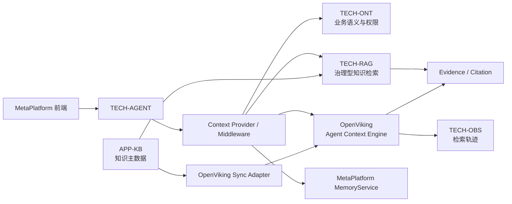

# MetaPlatform × OpenViking 未来架构候选方案

> **状态：未来架构候选（Future Architecture Candidate）**  
> **决策：当前不实施、不替换现有技术栈；待 Agent 上下文与长期记忆进入下一阶段时进行 POC 评估。**  
> **记录日期：2026-07-27**  
> **适用模块：TECH-AGENT、TECH-RAG、APP-KB、TECH-ONT、TECH-MCP、TECH-IAM、TECH-OBS**

## 1. 背景与结论

[OpenViking](https://docs.openviking.net/zh/getting-started/01-introduction) 是面向 AI Agent 的开源上下文数据库，以文件系统范式统一管理 Resource、Memory 和 Skill，并提供 `viking://` URI、L0/L1/L2 分层上下文、目录递归检索、Session 记忆提炼及检索轨迹。

OpenViking 与 MetaPlatform 当前 Agent、RAG、Memory 架构具有较高匹配度，未来可以作为 **Agent Context Engine（Agent 上下文引擎）** 引入。但它与 `APP-KB`、`TECH-RAG`、`TECH-AGENT MemoryService` 存在明显能力重叠，因此不应在未经验证时直接替换现有系统。

建议的长期定位：

> `TECH-ONT` 管理受治理的业务语义，`APP-KB / TECH-RAG` 管理受治理的企业知识，OpenViking 管理 Agent 上下文、经验与技能发现。

## 2. 架构原则

1. **旁路增强，而非直接替换**：初期仅作为可选 Context Provider。
2. **MetaPlatform 保持主权**：IAM、Ontology、知识主数据、Evidence 和审计仍由 MetaPlatform 管理。
3. **单向同步优先**：`APP-KB → OpenViking`，避免早期双向一致性问题。
4. **可降级**：OpenViking 不可用时，Agent 必须继续使用现有 RAG 和 MemoryService。
5. **默认关闭**：通过 Feature Flag 按租户、Agent 或场景启用。
6. **事实回答保持证据链**：OpenViking 返回的事实型资源必须转换为 MetaPlatform Evidence/Citation。
7. **先 POC 后决策**：只有安全、质量、成本和性能指标达标后，才进入正式架构基线。

## 3. 能力映射

| OpenViking 能力 | MetaPlatform 对应模块 | 未来价值 |
|---|---|---|
| Resource | APP-KB、TECH-RAG | 为文档、代码、网页增加层次化上下文 |
| Memory | TECH-AGENT MemoryService | 增强长期记忆、会话经验和任务轨迹 |
| Skill | TECH-AGENT SkillRegistry、TECH-MCP | 支持 Agent 技能的统一组织与语义发现 |
| Session | Thread / Run / Checkpoint | 在会话结束后自动沉淀经验 |
| L0/L1/L2 | 摘要、Chunk、原文 | 降低上下文 Token 和噪声 |
| 目录递归检索 | TECH-RAG / Milvus | 补充平铺式 Top-K 检索 |
| 检索轨迹 | TECH-OBS、Evidence | 提升召回链路可观测性 |
| 多租户 HTTP API | TECH-IAM、TECH-GW | 映射 MetaPlatform 租户与用户身份 |

## 4. 候选目标架构



### 4.1 MetaPlatform 保留职责

- 知识库主数据、文档版本和审核；
- Chunk Review、Ontology 绑定与 Ontology Filter；
- IAM、租户、权限和数据范围；
- Claim、Evidence、Citation 与企业审计；
- Action Governance；
- 结构化业务对象、指标、事件和动作。

### 4.2 OpenViking 候选职责

- Agent 上下文的虚拟目录组织；
- L0 摘要、L1 概览、L2 原文的按需加载；
- 目录递归探索；
- Agent Session 经验提炼；
- 用户偏好、任务经验和轨迹记忆；
- Skill 的语义发现；
- 上下文召回轨迹。

## 5. 优先候选场景

### 5.1 Agent 长期记忆

这是优先级最高、风险最低的切入点。建议映射：

| MetaPlatform | OpenViking |
|---|---|
| Working Memory | 当前 Session，通常不持久化 |
| Episodic Memory | cases / trajectories / events |
| Semantic Memory | entities / preferences / experiences |
| Organizational Memory | 共享 Resource 或受控组织记忆 |
| Agent Skill | `viking://agent/skills/` |
| 用户私有 Skill | `viking://user/{userId}/skills/` |

Agent 执行前召回相关经验，执行结束后按策略提交 Session。敏感会话默认不得自动沉淀。

### 5.2 代码库与项目资料

可将架构文档、API、服务代码、Runbook 和历史任务组织为：

```text
viking://resources/metaplatform/
├── architecture/
├── api/
├── services/
│   ├── tech-agent/
│   ├── tech-ont/
│   └── tech-rag/
├── runbooks/
└── project-history/
```

Agent 先读取目录摘要和概览，再按需加载原文，避免一次性注入大量上下文。

### 5.3 混合上下文召回

候选执行链路：

```text
用户问题
  → Ontology Grounding
  → 权限范围计算
  → TECH-RAG 检索治理型知识
  → OpenViking 检索经验、资源与技能
  → 去重、排序和 Token 预算控制
  → Context Envelope
  → LLM 执行
```

召回结果必须保留 Provider 和用途：

```json
{
  "contexts": [
    {
      "provider": "metaplatform-rag",
      "type": "knowledge",
      "citationRequired": true
    },
    {
      "provider": "openviking",
      "type": "experience",
      "citationRequired": false
    }
  ]
}
```

## 6. 身份与多租户映射

OpenViking Client-Server 模式支持 API Key 和租户身份请求头。建议映射：

| MetaPlatform | OpenViking |
|---|---|
| `tenantId` | account |
| `userId` | user |
| `agentId` | actor peer 或 metadata |
| `threadId` | session |
| `runId` | session / trace metadata |

推荐调用路径：

```text
用户 → TECH-GW / TECH-IAM → TECH-AGENT → OpenViking
```

浏览器不得直接持有 OpenViking Key。若未来使用 trusted 模式，只允许受信内部网关注入身份 Header，外部请求不得自行声明 account 或 user。

## 7. 候选实施阶段

### Phase A：独立 POC

- 独立部署 OpenViking，不接管现有 Milvus；
- 验证通过 `TECH-LLMGW` 使用现有 OpenAI 兼容模型；
- 导入一个代码库、一个文档库及 20～50 个历史 Session；
- 至少覆盖两个租户和三个用户；
- 验证中文摘要、递归检索、记忆提炼、删除和租户隔离。

### Phase B：接入 TECH-AGENT

候选新增包：

```text
TECH-AGENT/src/main/java/com/metaplatform/agent/context/openviking/
├── OpenVikingProperties.java
├── OpenVikingClient.java
├── OpenVikingContextProvider.java
├── OpenVikingIdentityMapper.java
├── OpenVikingSessionBridge.java
├── OpenVikingMemoryBridge.java
└── OpenVikingHealthIndicator.java
```

候选配置：

```yaml
mate:
  context:
    openviking:
      enabled: false
      base-url: http://openviking:1933
      api-key: ${OPENVIKING_API_KEY:}
      connect-timeout: 3s
      read-timeout: 30s
      retrieval:
        top-k: 8
        max-tokens: 6000
      session:
        auto-commit: false
```

### Phase C：APP-KB 单向同步

由 APP-KB 发布：

```text
kb.document.processed
kb.document.updated
kb.document.deleted
```

同步关系至少记录：

```text
tenant_id
knowledge_base_id
document_id
document_version
viking_uri
content_hash
sync_status
last_synced_at
```

APP-KB 始终作为知识主数据源，OpenViking 作为派生的上下文索引和消费视图。

## 8. 风险与明确边界

在正式决策前不得：

- 删除 TECH-RAG 或 Milvus；
- 让 OpenViking 成为知识库主数据库；
- 将 Ontology Object 降级为普通 Markdown 主数据；
- 绕开 MetaPlatform IAM、Evidence 或审计；
- 默认对全部企业会话开启自动记忆；
- 同时实施 APP-KB 与 OpenViking 的双向同步；
- 让 OpenViking 故障阻塞 Agent 主链路。

主要待验证风险：

1. 与现有文档解析、Embedding、Memory 的能力重叠；
2. 双索引带来的成本和一致性；
3. 中文 L0/L1 生成质量；
4. PII、敏感信息及“被遗忘权”处理；
5. 多租户和用户记忆隔离；
6. 检索新增延迟；
7. OpenViking 版本成熟度及升级兼容性；
8. 与 MetaPlatform Evidence 和 Ontology Filter 的衔接成本。

## 9. POC 验收门槛

| 指标 | 建议门槛 |
|---|---:|
| Recall@10 | 相对现有 RAG 提升 ≥ 10% |
| 有效上下文 Token | 降低 ≥ 20% |
| 跨 Session 信息召回率 | ≥ 80% |
| 错误用户记忆泄漏 | 0 |
| 错误租户数据泄漏 | 0 |
| P95 检索新增延迟 | ≤ 500～1000ms |
| OpenViking 故障时 Agent 可用性 | 不受影响 |
| 文档删除后残留 | 在规定 SLA 内清除 |
| 事实型回答 Evidence 可追溯率 | 100% |

## 10. 架构决策状态

当前状态为 **候选 / 暂缓实施**，不进入当前 MetaPlatform 架构基线，也不形成近期交付承诺。

满足以下条件时可重新评审：

- Agent 长期任务对分层上下文产生明确需求；
- 现有平铺式 RAG 在复杂项目资料上出现可量化瓶颈；
- Session 经验复用成为产品核心能力；
- POC 达到第 9 节的安全、质量、性能和成本门槛；
- 已明确 APP-KB、TECH-RAG、MemoryService 与 OpenViking 的数据主权边界。

## 11. 参考资料

- [OpenViking 简介](https://docs.openviking.net/zh/getting-started/01-introduction)
- [OpenViking API 概览](https://docs.openviking.net/zh/api/01-overview)
- [OpenViking 服务端模式](https://docs.openviking.net/zh/getting-started/03-quickstart-server)
- [OpenViking GitHub](https://github.com/volcengine/OpenViking)
