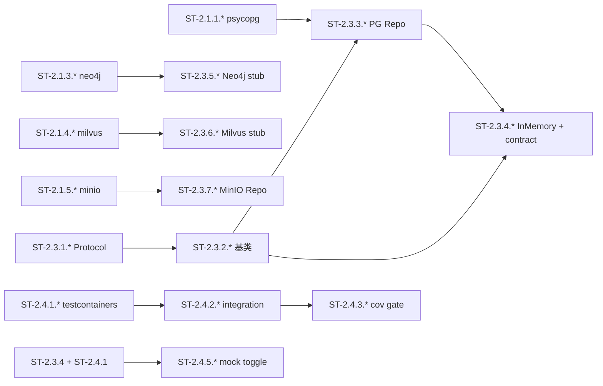

# W2 子任务卡（ST）：基础设施 facade

> **源任务卡**：[tasks-W2.md](./2026-07-27-mate-platform-tasks-W2.md)
> **总览**：[Task Breakdown v2.0](./2026-07-27-mate-platform-task-breakdown.md)
> **Sprint**：S2（2026-08-03 ~ 2026-08-17）
> **里程碑**：M1 下半
> **ST 总数**：63（拆解自 24 个 TC）
> **粒度**：0.5-4 小时 / 单文件 / 单函数 / 单测试

---

## 目录

- [W2-1 pg / neo4j / milvus / minio 接入](#w2-1-pg--neo4j--milvus--minio-接入)（20 ST）
- [W2-2 redis / kafka / nacos 接入](#w2-2-redis--kafka--nacos-接入)（13 ST）
- [W2-3 Repository Pattern 基类 + 实现](#w2-3-repository-pattern-基类--实现)（19 ST）
- [W2-4 基础设施测试基线](#w2-4-基础设施测试基线)（11 ST）
- [完成度检查表](#完成度检查表)
- [Sprint S2 ST 排程](#sprint-s2-st-排程)

---
## W2-1 pg / neo4j / milvus / minio 接入

> **路线图工时**：5d | **拆出 TC 数**：7 | **关键路径**：是 | **ST 数**：20

### TC-2.1.1 psycopg 3 接入 + 连接池（4h → 4 ST）

#### ST-2.1.1.1 libs/infra-contracts 加 psycopg 依赖

| 字段 | 值 |
|---|---|
| 所属 TC | TC-2.1.1 |
| 工时 | 0.5h | 角色 | Backend |
| 目标文件 | libs/infra-contracts/pyproject.toml |
| 前置 ST | TC-1.1.7（Hello app 跑通） |
| 输出 commit | chore(infra): psycopg dep (ST-2.1.1.1) |

**目标**：在 infra-contracts 加入 psycopg 3 + pool 依赖。

**改动清单**：
1. 编辑 libs/infra-contracts/pyproject.toml
2. `dependencies` 加 `psycopg[binary,pool]>=3.1`
3. uv sync 验证依赖图

**DoD**：
- [ ] uv lock 同步成功
- [ ] uv run --package infra-contracts python -c "import psycopg" 无报错

---

#### ST-2.1.1.2 PgClient.connect() + 连接池

| 字段 | 值 |
|---|---|
| 所属 TC | TC-2.1.1 |
| 工时 | 1h | 角色 | Backend |
| 目标文件 | libs/infra-contracts/src/infra_contracts/pg.py |
| 前置 ST | ST-2.1.1.1 |
| 输出 commit | feat(infra): PgClient connect |

**目标**：实现 PgClient 类的连接与池化能力。

**改动清单**：
1. 新建 src/infra_contracts/pg.py
2. `class PgClient`，`__init__` 读 `PG_DSN` env
3. `connect()`：`ConnectionPool(min_size=2, max_size=10, timeout=30)`
4. 提供 `close()` 释放池

**DoD**：
- [ ] pyright strict 通过
- [ ] `from infra_contracts.pg import PgClient` 无 import error

---

#### ST-2.1.1.3 PgClient.transaction() 上下文

| 字段 | 值 |
|---|---|
| 所属 TC | TC-2.1.1 |
| 工时 | 1h | 角色 | Backend |
| 目标文件 | libs/infra-contracts/src/infra_contracts/pg.py |
| 前置 ST | ST-2.1.1.2 |
| 输出 commit | feat(infra): pg transaction |

**目标**：提供事务上下文管理器。

**改动清单**：
1. `@contextmanager def transaction(self)`：yield psycopg.Connection
2. 异常时自动 rollback
3. 嵌套调用复用同一连接

**DoD**：
- [ ] 单测验证 commit/rollback 路径

---

#### ST-2.1.1.4 PgClient CRUD + 单测

| 字段 | 值 |
|---|---|
| 所属 TC | TC-2.1.1 |
| 工时 | 1.5h | 角色 | Backend |
| 目标文件 | libs/infra-contracts/src/infra_contracts/pg.py、tests/test_pg.py |
| 前置 ST | ST-2.1.1.3 |
| 输出 commit | test(infra): pg client suite |

**目标**：完成 fetch_one/fetch_all/execute + 测试。

**改动清单**：
1. 加 `fetch_one(sql, params)`、`fetch_all(sql, params)`、`execute(sql, params)`
2. tests/test_pg.py：建 hello 表 → 插入 → 查询 → 删除
3. 用 testcontainers 起 PG 16

**DoD**：
- [ ] 单测全绿
- [ ] 覆盖率 ≥ 85%

---

### TC-2.1.2 异步 asyncpg 评估（2h → 2 ST）

#### ST-2.1.2.1 ADR-0005 asyncpg 评估决策

| 字段 | 值 |
|---|---|
| 所属 TC | TC-2.1.2 |
| 工时 | 1h | 角色 | Backend |
| 目标文件 | docs/active/decisions/ADR-0005-asyncpg.md |
| 前置 ST | ST-2.1.1.4 |
| 输出 commit | docs(infra): ADR-0005 asyncpg |

**目标**：写 ADR 明确 v1 默认 psycopg，asyncpg 仅按需。

**改动清单**：
1. 新建 ADR-0005
2. Context / Decision / Consequences 三段式
3. 决定：v1 走 psycopg（同步）；asyncpg 仅在 FastAPI 端点显式需要时启用

**DoD**：
- [ ] ADR-0005 合并入决策库

---

#### ST-2.1.2.2 psycopg vs asyncpg 性能 spike 脚本

| 字段 | 值 |
|---|---|
| 所属 TC | TC-2.1.2 |
| 工时 | 1h | 角色 | Backend |
| 目标文件 | scripts/eval-asyncpg.py |
| 前置 ST | ST-2.1.2.1 |
| 输出 commit | chore(infra): eval-asyncpg spike |

**目标**：用同一 schema 跑两个驱动对比延迟。

**改动清单**：
1. 新建 scripts/eval-asyncpg.py
2. 同一 select × 1000 跑两次，记录 p50/p95
3. 输出 markdown 表格写入 docs/active/reports/asyncpg-eval.md

**DoD**：
- [ ] 脚本可重复运行
- [ ] 报告产出数字

---

### TC-2.1.3 neo4j-driver 接入（3h → 3 ST）

#### ST-2.1.3.1 libs/infra-contracts 加 neo4j 依赖

| 字段 | 值 |
|---|---|
| 所属 TC | TC-2.1.3 |
| 工时 | 0.5h | 角色 | Backend |
| 目标文件 | libs/infra-contracts/pyproject.toml |
| 前置 ST | TC-1.1.7 |
| 输出 commit | chore(infra): neo4j dep |

**改动清单**：
1. `dependencies` 加 `neo4j>=5.20`
2. uv sync 验证

**DoD**：
- [ ] 依赖图锁定

---

#### ST-2.1.3.2 Neo4jClient 类 + execute_query/write

| 字段 | 值 |
|---|---|
| 所属 TC | TC-2.1.3 |
| 工时 | 1.5h | 角色 | Backend |
| 目标文件 | libs/infra-contracts/src/infra_contracts/neo4j.py |
| 前置 ST | ST-2.1.3.1 |
| 输出 commit | feat(infra): Neo4jClient |

**改动清单**：
1. 新建 src/infra_contracts/neo4j.py
2. `class Neo4jClient`，env: `NEO4J_URI=bolt://localhost:7687`、`NEO4J_USER=neo4j`、`NEO4J_PASSWORD=mate-pass`
3. `driver()` 上下文、`execute_query(cypher, params)`、`execute_write(cypher, params)`

**DoD**：
- [ ] pyright strict 通过

---

#### ST-2.1.3.3 Neo4jClient 单测 + 错误连接友好提示

| 字段 | 值 |
|---|---|
| 所属 TC | TC-2.1.3 |
| 工时 | 1h | 角色 | Backend |
| 目标文件 | libs/infra-contracts/tests/test_neo4j.py |
| 前置 ST | ST-2.1.3.2 |
| 输出 commit | test(infra): neo4j client |

**改动清单**：
1. tests/test_neo4j.py：起 testcontainers neo4j
2. test_connect_query_write：建节点 → 查 → 删
3. test_bad_uri_friendly：错误 URI 给明确异常信息

**DoD**：
- [ ] 两 case 全绿

---

### TC-2.1.4 pymilvus 接入（3h → 3 ST）

#### ST-2.1.4.1 libs/infra-contracts 加 pymilvus 依赖

| 字段 | 值 |
|---|---|
| 所属 TC | TC-2.1.4 |
| 工时 | 0.5h | 角色 | Backend |
| 目标文件 | libs/infra-contracts/pyproject.toml |
| 前置 ST | TC-1.1.7 |
| 输出 commit | chore(infra): pymilvus dep |

**改动清单**：
1. 加 `pymilvus>=2.4`
2. uv lock

**DoD**：
- [ ] 依赖锁定

---

#### ST-2.1.4.2 MilvusClient.connect/collection/insert/search

| 字段 | 值 |
|---|---|
| 所属 TC | TC-2.1.4 |
| 工时 | 1.5h | 角色 | Backend |
| 目标文件 | libs/infra-contracts/src/infra_contracts/milvus.py |
| 前置 ST | ST-2.1.4.1 |
| 输出 commit | feat(infra): MilvusClient |

**改动清单**：
1. 新建 src/infra_contracts/milvus.py
2. `class MilvusClient`，env: `MILVUS_HOST=localhost`、`MILVUS_PORT=19530`
3. 方法：`connect`、`create_collection`、`insert`、`search`、`drop`

**DoD**：
- [ ] pyright strict 通过

---

#### ST-2.1.4.3 MilvusClient test_* 前缀自动清理

| 字段 | 值 |
|---|---|
| 所属 TC | TC-2.1.4 |
| 工时 | 1h | 角色 | Backend |
| 目标文件 | libs/infra-contracts/tests/test_milvus.py |
| 前置 ST | ST-2.1.4.2 |
| 输出 commit | test(infra): milvus client |

**改动清单**：
1. test_create_insert_search：建 collection → 插 100 → 检索
2. collection 名带 `test_` 前缀 → session 结束自动 drop
3. test_drop

**DoD**：
- [ ] 3 个 case 全绿，无残留 collection

---

### TC-2.1.5 minio-py 接入（3h → 3 ST）

#### ST-2.1.5.1 libs/infra-contracts 加 minio 依赖

| 字段 | 值 |
|---|---|
| 所属 TC | TC-2.1.5 |
| 工时 | 0.5h | 角色 | Backend |
| 目标文件 | libs/infra-contracts/pyproject.toml |
| 前置 ST | TC-1.1.7 |
| 输出 commit | chore(infra): minio dep |

**改动清单**：
1. 加 `minio>=7.2`
2. uv lock

**DoD**：
- [ ] 依赖锁定

---

#### ST-2.1.5.2 MinioClient 五方法封装

| 字段 | 值 |
|---|---|
| 所属 TC | TC-2.1.5 |
| 工时 | 1.5h | 角色 | Backend |
| 目标文件 | libs/infra-contracts/src/infra_contracts/minio.py |
| 前置 ST | ST-2.1.5.1 |
| 输出 commit | feat(infra): MinioClient |

**改动清单**：
1. 新建 src/infra_contracts/minio.py
2. env: `MINIO_ENDPOINT=localhost:9000`、`MINIO_ACCESS_KEY=mate`、`MINIO_SECRET_KEY=mate-pass`
3. 方法：`bucket_exists`、`make_bucket`、`put_object`、`get_object`、`presigned_get`

**DoD**：
- [ ] pyright strict 通过

---

#### ST-2.1.5.3 MinioClient 单测 + presigned TTL 1h

| 字段 | 值 |
|---|---|
| 所属 TC | TC-2.1.5 |
| 工时 | 1h | 角色 | Backend |
| 目标文件 | libs/infra-contracts/tests/test_minio.py |
| 前置 ST | ST-2.1.5.2 |
| 输出 commit | test(infra): minio client |

**改动清单**：
1. test_put_get：上传 → 下载 → 字节一致
2. test_presigned_ttl：presigned_get 默认 ttl=3600s
3. bucket 名 `test_<uuid>`，session 结束清理

**DoD**：
- [ ] 2 case 全绿
- [ ] 1h 过期路径 mock 验证

---

### TC-2.1.6 docker-compose 加 4 个服务（3h → 3 ST）

#### ST-2.1.6.1 docker-compose.yml 加 pg + neo4j 服务

| 字段 | 值 |
|---|---|
| 所属 TC | TC-2.1.6 |
| 工时 | 1h | 角色 | DevOps |
| 目标文件 | docker-compose.yml |
| 前置 ST | TC-2.1.1 + TC-2.1.3 |
| 输出 commit | dev(infra): pg+neo4j compose |

**改动清单**：
1. 加 `postgres:16-alpine`（5432，卷 `mate-pg-data`，env `POSTGRES_USER=mate`、`POSTGRES_PASSWORD=mate`、`POSTGRES_DB=mate`，healthcheck `pg_isready`）
2. 加 `neo4j:5.20`（7474 + 7687，env `NEO4J_AUTH=neo4j/mate-pass`，healthcheck `cypher-shell`）

**DoD**：
- [ ] `docker compose up pg neo4j` 两服务 healthy

---

#### ST-2.1.6.2 docker-compose.yml 加 milvus + minio 服务

| 字段 | 值 |
|---|---|
| 所属 TC | TC-2.1.6 |
| 工时 | 1h | 角色 | DevOps |
| 目标文件 | docker-compose.yml |
| 前置 ST | ST-2.1.6.1 |
| 输出 commit | dev(infra): milvus+minio compose |

**改动清单**：
1. 加 `milvusdb/milvus:v2.4-standalone`（19530，依赖 etcd + minio via profile）
2. 加 `minio/minio:RELEASE.2024-08-17T01-24-54Z`（9000 + 9001，env `MINIO_ROOT_USER=mate`、`MINIO_ROOT_PASSWORD=mate-pass`）
3. depends_on 链：milvus → etcd, minio

**DoD**：
- [ ] `docker compose --profile storage up` 4 个服务 healthy

---

#### ST-2.1.6.3 启动脚本 + 健康检汇总

| 字段 | 值 |
|---|---|
| 所属 TC | TC-2.1.6 |
| 工时 | 1h | 角色 | DevOps |
| 目标文件 | scripts/wait-for-infra.sh |
| 前置 ST | ST-2.1.6.2 |
| 输出 commit | dev(infra): wait-for-infra script |

**改动清单**：
1. 新建 scripts/wait-for-infra.sh
2. 对每个服务端口轮询 + 等待 healthcheck
3. start-tech-services.ps1 引用此脚本

**DoD**：
- [ ] 冷启动 4 服务 < 90s

---

### TC-2.1.7 各驱动单测汇总（2h → 2 ST）

#### ST-2.1.7.1 tests/conftest.py 加 4 个 storage fixture

| 字段 | 值 |
|---|---|
| 所属 TC | TC-2.1.7 |
| 工时 | 1h | 角色 | Backend |
| 目标文件 | libs/infra-contracts/tests/conftest.py |
| 前置 ST | TC-2.1.1 ~ TC-2.1.5、TC-2.1.6 |
| 输出 commit | test(infra): storage fixtures |

**改动清单**：
1. 加 `pg_client` / `neo4j_client` / `milvus_client` / `minio_client` 四个 session-scope fixture
2. 用 testcontainers 拉起容器
3. teardown 阶段清理

**DoD**：
- [ ] 4 fixture 全部 session 级
- [ ] 复用率：外部测试可直接 import

---

#### ST-2.1.7.2 tests/test_storage.py 套件 + CI infra-storage job

| 字段 | 值 |
|---|---|
| 所属 TC | TC-2.1.7 |
| 工时 | 1h | 角色 | DevOps |
| 目标文件 | libs/infra-contracts/tests/test_storage.py、.github/workflows/python.yml |
| 前置 ST | ST-2.1.7.1 |
| 输出 commit | ci(infra): storage job |

**改动清单**：
1. tests/test_storage.py：4 个 test class × 1 smoke test
2. .github/workflows/python.yml 加 `infra-storage` job
3. job 依赖 `docker compose up -d`

**DoD**：
- [ ] CI 中 infra-storage job 绿

---## W2-2 redis / kafka / nacos 接入

> **路线图工时**：3d | **拆出 TC 数**：5 | **关键路径**：否 | **ST 数**：13

### TC-2.2.1 redis-py 接入（3h → 3 ST）

#### ST-2.2.1.1 libs/infra-contracts 加 redis 依赖

| 字段 | 值 |
|---|---|
| 所属 TC | TC-2.2.1 |
| 工时 | 0.5h | 角色 | Backend |
| 目标文件 | libs/infra-contracts/pyproject.toml |
| 前置 ST | TC-1.1.7 |
| 输出 commit | chore(infra): redis dep |

**改动清单**：
1. 加 `redis>=5.0`（含 asyncio）
2. uv lock

**DoD**：
- [ ] 依赖锁定

---

#### ST-2.2.1.2 RedisClient + AsyncRedisClient 双类

| 字段 | 值 |
|---|---|
| 所属 TC | TC-2.2.1 |
| 工时 | 1.5h | 角色 | Backend |
| 目标文件 | libs/infra-contracts/src/infra_contracts/redis_client.py |
| 前置 ST | ST-2.2.1.1 |
| 输出 commit | feat(infra): RedisClient |

**改动清单**：
1. 新建 src/infra_contracts/redis_client.py
2. `class RedisClient`（同步）封装 redis.Redis
3. `class AsyncRedisClient` 封装 redis.asyncio.Redis
4. 默认 `REDIS_URL=redis://localhost:6379/0`

**DoD**：
- [ ] pyright strict 通过

---

#### ST-2.2.1.3 redis 同步 + 异步单测

| 字段 | 值 |
|---|---|
| 所属 TC | TC-2.2.1 |
| 工时 | 1h | 角色 | Backend |
| 目标文件 | libs/infra-contracts/tests/test_redis.py |
| 前置 ST | ST-2.2.1.2 |
| 输出 commit | test(infra): redis client |

**改动清单**：
1. test_sync_set_get_ttl：3 个 case
2. test_async_set_get_ttl：3 个 case
3. test_bad_url_friendly：URL 错误给明确报错

**DoD**：
- [ ] ≥ 6 case 全绿

---

### TC-2.2.2 aiokafka 接入（3h → 3 ST）

#### ST-2.2.2.1 libs/infra-contracts 加 kafka 依赖

| 字段 | 值 |
|---|---|
| 所属 TC | TC-2.2.2 |
| 工时 | 0.5h | 角色 | Backend |
| 目标文件 | libs/infra-contracts/pyproject.toml |
| 前置 ST | TC-1.1.7 |
| 输出 commit | chore(infra): aiokafka dep |

**改动清单**：
1. 加 `aiokafka>=0.11`、`kafka-python-ng>=2.2`（脚本用）
2. uv lock

**DoD**：
- [ ] 依赖锁定

---

#### ST-2.2.2.2 KafkaProducer.publish + KafkaConsumer.subscribe

| 字段 | 值 |
|---|---|
| 所属 TC | TC-2.2.2 |
| 工时 | 1.5h | 角色 | Backend |
| 目标文件 | libs/infra-contracts/src/infra_contracts/kafka.py |
| 前置 ST | ST-2.2.2.1 |
| 输出 commit | feat(infra): KafkaProducer/Consumer |

**改动清单**：
1. 新建 src/infra_contracts/kafka.py
2. `class KafkaProducer.publish(topic, payload, key)`：默认 JSON 序列化、key=str
3. `class KafkaConsumer.subscribe(topics, group_id)`：异步迭代
4. 默认 `KAFKA_BOOTSTRAP=localhost:9092`

**DoD**：
- [ ] pyright strict 通过

---

#### ST-2.2.2.3 kafka 发收 + 顺序校验单测

| 字段 | 值 |
|---|---|
| 所属 TC | TC-2.2.2 |
| 工时 | 1h | 角色 | Backend |
| 目标文件 | libs/infra-contracts/tests/test_kafka.py |
| 前置 ST | ST-2.2.2.2 |
| 输出 commit | test(infra): kafka client |

**改动清单**：
1. test_produce_consume_ordered：发 10 → 收 10，校验顺序与载荷
2. test_bad_topic_raises：错误主题给明确异常

**DoD**：
- [ ] 2 case 全绿

---

### TC-2.2.3 nacos-sdk-python 接入（2h → 2 ST）

#### ST-2.2.3.1 NacosConfig.get + subscribe 封装

| 字段 | 值 |
|---|---|
| 所属 TC | TC-2.2.3 |
| 工时 | 1.5h | 角色 | Backend |
| 目标文件 | libs/infra-contracts/src/infra_contracts/nacos.py |
| 前置 ST | TC-1.1.7 |
| 输出 commit | feat(infra): NacosConfig |

**改动清单**：
1. 依赖加 `nacos-sdk-python>=1.0`
2. 新建 src/infra_contracts/nacos.py
3. `class NacosConfig.get(key)`、`subscribe(key, callback)`
4. 默认 `NACOS_SERVER=localhost:8848`、`NACOS_NAMESPACE=mate`

**DoD**：
- [ ] pyright strict 通过

---

#### ST-2.2.3.2 nacos 单测 + mock 推送

| 字段 | 值 |
|---|---|
| 所属 TC | TC-2.2.3 |
| 工时 | 0.5h | 角色 | Backend |
| 目标文件 | libs/infra-contracts/tests/test_nacos.py |
| 前置 ST | ST-2.2.3.1 |
| 输出 commit | test(infra): nacos mock |

**改动清单**：
1. mock 服务端推送一次 → 验证回调被触发
2. test_get_returns_value：get 正常返回

**DoD**：
- [ ] 2 case 全绿

---

### TC-2.2.4 docker-compose 加 3 个服务（3h → 3 ST）

#### ST-2.2.4.1 docker-compose.yml 加 redis 服务

| 字段 | 值 |
|---|---|
| 所属 TC | TC-2.2.4 |
| 工时 | 0.5h | 角色 | DevOps |
| 目标文件 | docker-compose.yml |
| 前置 ST | TC-2.1.6 |
| 输出 commit | dev(infra): redis compose |

**改动清单**：
1. 加 `redis:7-alpine`（6379，卷 `mate-redis-data`，healthcheck `redis-cli ping`）

**DoD**：
- [ ] `docker compose up redis` healthy

---

#### ST-2.2.4.2 docker-compose.yml 加 kafka 服务

| 字段 | 值 |
|---|---|
| 所属 TC | TC-2.2.4 |
| 工时 | 1h | 角色 | DevOps |
| 目标文件 | docker-compose.yml |
| 前置 ST | ST-2.2.4.1 |
| 输出 commit | dev(infra): kafka compose |

**改动清单**：
1. 加 `bitnami/kafka:3.7`（9092，KRaft 模式）
2. env: `KAFKA_CFG_NODE_ID=0`、`KAFKA_CFG_PROCESS_ROLES=controller,broker`、`KAFKA_CFG_CONTROLLER_QUORUM_VOTERS=0@kafka:9093`
3. healthcheck `kafka-broker-api-versions.sh`

**DoD**：
- [ ] kafka healthy
- [ ] KRaft 模式工作（无需 zookeeper）

---

#### ST-2.2.4.3 docker-compose.yml 加 nacos + realm-import

| 字段 | 值 |
|---|---|
| 所属 TC | TC-2.2.4 |
| 工时 | 1.5h | 角色 | DevOps |
| 目标文件 | docker-compose.yml、infra/init/nacos/realm-import.json |
| 前置 ST | ST-2.2.4.2 |
| 输出 commit | dev(infra): nacos compose |

**改动清单**：
1. 加 `nacos/nacos-server:v2.4.3-slim`（8848 + 9848）
2. env: `MODE=standalone`、`JVM_XMS=512m`、`NACOS_AUTH_ENABLE=true`
3. 新建 infra/init/nacos/realm-import.json：预置 `mate` namespace

**DoD**：
- [ ] nacos 控制台 http://localhost:8848/nacos 可登录
- [ ] realm-import 加载完成

---

### TC-2.2.5 各驱动单测汇总（2h → 2 ST）

#### ST-2.2.5.1 tests/conftest.py 加 messaging fixtures

| 字段 | 值 |
|---|---|
| 所属 TC | TC-2.2.5 |
| 工时 | 1h | 角色 | Backend |
| 目标文件 | libs/infra-contracts/tests/conftest.py |
| 前置 ST | TC-2.2.1 ~ TC-2.2.3、TC-2.2.4 |
| 输出 commit | test(infra): messaging fixtures |

**改动清单**：
1. 加 `redis_client` / `kafka_producer` / `nacos_client` session-scope fixture
2. 复用 TC-2.1.6 起好的容器

**DoD**：
- [ ] 3 fixture session 级

---

#### ST-2.2.5.2 tests/test_messaging.py 套件 + CI job

| 字段 | 值 |
|---|---|
| 所属 TC | TC-2.2.5 |
| 工时 | 1h | 角色 | DevOps |
| 目标文件 | libs/infra-contracts/tests/test_messaging.py、.github/workflows/python.yml |
| 前置 ST | ST-2.2.5.1 |
| 输出 commit | ci(infra): messaging job |

**改动清单**：
1. tests/test_messaging.py：3 个 test class × 1 smoke
2. CI 加 `infra-messaging` job

**DoD**：
- [ ] CI job 绿

---
## W2-3 Repository Pattern 基类 + 实现

> **路线图工时**：5d | **拆出 TC 数**：7 | **关键路径**：是 | **ST 数**：19

### TC-2.3.1 Repository 协议/接口设计（3h → 3 ST）

#### ST-2.3.1.1 Repository[T, ID] Protocol 定义

| 字段 | 值 |
|---|---|
| 所属 TC | TC-2.3.1 |
| 工时 | 1h | 角色 | Backend |
| 目标文件 | libs/infra-contracts/src/infra_contracts/repo.py |
| 前置 ST | TC-1.7.4 |
| 输出 commit | feat(infra): Repository Protocol |

**改动清单**：
1. 新建 src/infra_contracts/repo.py
2. `class Repository(Protocol[T, ID])`：async get / list / save / delete
3. 用 `typing.Protocol` + `Generic[T, ID]`

**DoD**：
- [ ] pyright strict 不报 warning

---

#### ST-2.3.1.2 ADR-0006 Protocol vs ABC 决策

| 字段 | 值 |
|---|---|
| 所属 TC | TC-2.3.1 |
| 工时 | 1h | 角色 | Backend |
| 目标文件 | docs/active/decisions/ADR-0006-repo-protocol.md |
| 前置 ST | ST-2.3.1.1 |
| 输出 commit | docs(infra): ADR-0006 |

**改动清单**：
1. 新建 ADR-0006
2. Context：鸭子类型 vs 显式继承
3. Decision：默认 Protocol；可选基类（TC-2.3.2）按需

**DoD**：
- [ ] ADR 合并

---

#### ST-2.3.1.3 Protocol 契约示例测试

| 字段 | 值 |
|---|---|
| 所属 TC | TC-2.3.1 |
| 工时 | 1h | 角色 | Backend |
| 目标文件 | libs/infra-contracts/tests/test_repo_protocol.py |
| 前置 ST | ST-2.3.1.2 |
| 输出 commit | test(infra): repo protocol |

**改动清单**：
1. tests/test_repo_protocol.py：InMemory 实现 mock 协议
2. 4 方法调用全绿

**DoD**：
- [ ] mock 协议可被 pyright 静态检查

---

### TC-2.3.2 通用 Repository 抽象基类（3h → 3 ST）

#### ST-2.3.2.1 EntityNotFound 异常定义

| 字段 | 值 |
|---|---|
| 所属 TC | TC-2.3.2 |
| 工时 | 0.5h | 角色 | Backend |
| 目标文件 | libs/common/src/common/exceptions.py |
| 前置 ST | TC-2.3.1 |
| 输出 commit | feat(common): EntityNotFound |

**改动清单**：
1. 新建 libs/common（若未建）
2. `class EntityNotFound(Exception)`，含 entity_type + id 字段

**DoD**：
- [ ] pyright strict 通过

---

#### ST-2.3.2.2 AbstractRepository 基类 + get_or_raise

| 字段 | 值 |
|---|---|
| 所属 TC | TC-2.3.2 |
| 工时 | 1.5h | 角色 | Backend |
| 目标文件 | libs/infra-contracts/src/infra_contracts/base_repo.py |
| 前置 ST | ST-2.3.2.1 |
| 输出 commit | feat(infra): AbstractRepository |

**改动清单**：
1. 新建 src/infra_contracts/base_repo.py
2. `class AbstractRepository(Generic[T, ID])`
3. 要求子类实现 `_extract_id(entity)`
4. `get_or_raise(id)` 默认实现，缺失抛 EntityNotFound

**DoD**：
- [ ] pyright strict 通过

---

#### ST-2.3.2.3 base_repo 默认实现单测

| 字段 | 值 |
|---|---|
| 所属 TC | TC-2.3.2 |
| 工时 | 1h | 角色 | Backend |
| 目标文件 | libs/infra-contracts/tests/test_base_repo.py |
| 前置 ST | ST-2.3.2.2 |
| 输出 commit | test(infra): base_repo |

**改动清单**：
1. fake repo：4 个方法各 1 case
2. get_or_raise：存在返回，缺失抛 EntityNotFound

**DoD**：
- [ ] ≥ 5 case 全绿

---

### TC-2.3.3 Document / Chunk PG 实现（6h → 4 ST）

#### ST-2.3.3.1 apps/tech-kb 初始化 + migration 001

| 字段 | 值 |
|---|---|
| 所属 TC | TC-2.3.3 |
| 工时 | 1h | 角色 | Backend |
| 目标文件 | apps/tech-kb/pyproject.toml、apps/tech-kb/migrations/001_init.sql |
| 前置 ST | TC-2.1.1、TC-2.3.2 |
| 输出 commit | feat(kb): scaffold + migration 001 |

**改动清单**：
1. uv init --package tech-kb
2. 新建 migrations/001_init.sql
3. `documents`：id UUID PK、kb_id UUID、status TEXT、source_uri TEXT、metadata JSONB、created_at TIMESTAMPTZ
4. `chunks` + `tsvector` + GIN 索引
5. IF NOT EXISTS 幂等

**DoD**：
- [ ] 迁移可重复执行

---

#### ST-2.3.3.2 PgDocumentRepository 实现

| 字段 | 值 |
|---|---|
| 所属 TC | TC-2.3.3 |
| 工时 | 2h | 角色 | Backend |
| 目标文件 | apps/tech-kb/src/tech_kb/repos/pg_document.py |
| 前置 ST | ST-2.3.3.1 |
| 输出 commit | feat(kb): PgDocumentRepository |

**改动清单**：
1. `class PgDocumentRepository(AbstractRepository[Document, UUID])`
2. 用 PgClient（TC-2.1.1）连接
3. 实现 get / list / save / delete + kb_id/status 过滤

**DoD**：
- [ ] pyright strict 通过
- [ ] list 支持 filter

---

#### ST-2.3.3.3 PgChunkRepository 实现

| 字段 | 值 |
|---|---|
| 所属 TC | TC-2.3.3 |
| 工时 | 1.5h | 角色 | Backend |
| 目标文件 | apps/tech-kb/src/tech_kb/repos/pg_chunk.py |
| 前置 ST | ST-2.3.3.2 |
| 输出 commit | feat(kb): PgChunkRepository |

**改动清单**：
1. `class PgChunkRepository(AbstractRepository[Chunk, UUID])`
2. tsvector 列读 + GIN 检索支持
3. CRUD + 按 document_id 列表

**DoD**：
- [ ] 全文检索路径工作

---

#### ST-2.3.3.4 test_pg_document_repo CRUD + tsvector 检索

| 字段 | 值 |
|---|---|
| 所属 TC | TC-2.3.3 |
| 工时 | 1.5h | 角色 | Backend |
| 目标文件 | apps/tech-kb/tests/test_pg_document_repo.py、test_pg_chunk_repo.py |
| 前置 ST | ST-2.3.3.3 |
| 输出 commit | test(kb): pg repos |

**改动清单**：
1. test_crud_document：4 case
2. test_fulltext_chunk：插入含关键词 chunk → 检索命中
3. 覆盖率 ≥ 80%

**DoD**：
- [ ] 单测全绿 + 覆盖率达标

---

### TC-2.3.4 Document / Chunk InMemory 实现（3h → 2 ST）

#### ST-2.3.4.1 mem_document + mem_chunk InMemory 实现

| 字段 | 值 |
|---|---|
| 所属 TC | TC-2.3.4 |
| 工时 | 1.5h | 角色 | Backend |
| 目标文件 | apps/tech-kb/src/tech_kb/repos/mem_document.py、mem_chunk.py |
| 前置 ST | TC-2.3.1 |
| 输出 commit | feat(kb): in-memory repos |

**改动清单**：
1. `class InMemoryDocumentRepository`：用 `dict[UUID, Document]`
2. `class InMemoryChunkRepository`：同上
3. 完整实现 Protocol + AbstractRepository

**DoD**：
- [ ] 启动 < 10ms

---

#### ST-2.3.4.2 contract test：PG + InMemory 同组用例

| 字段 | 值 |
|---|---|
| 所属 TC | TC-2.3.4 |
| 工时 | 1.5h | 角色 | Backend |
| 目标文件 | apps/tech-kb/tests/contract/test_document_repo.py、test_chunk_repo.py |
| 前置 ST | ST-2.3.4.1 + TC-2.3.3 |
| 输出 commit | test(kb): contract repos |

**改动清单**：
1. tests/contract/test_document_repo.py：`@pytest.parametrize("repo_factory", [pg_factory, mem_factory])`
2. 同一组用例在两实现下都跑
3. 同上 chunk repo

**DoD**：
- [ ] 两实现共用同一份 contract 测试通过

---

### TC-2.3.5 Neo4j Repository 接口预留（2h → 2 ST）

#### ST-2.3.5.1 GraphRepository Protocol + stub

| 字段 | 值 |
|---|---|
| 所属 TC | TC-2.3.5 |
| 工时 | 1.5h | 角色 | Backend |
| 目标文件 | apps/tech-ont/src/tech_ont/repos/neo4j_repo.py |
| 前置 ST | TC-2.3.1、TC-2.1.3 |
| 输出 commit | feat(ont): Neo4j repo stub |

**改动清单**：
1. `class Neo4jGraphRepository(Protocol)`：节点 / 边 CRUD
2. 方法体抛 `NotImplementedError`
3. type stubs 完整

**DoD**：
- [ ] Protocol 可被 mock

---

#### ST-2.3.5.2 ADR-0007 Neo4j v1 角色

| 字段 | 值 |
|---|---|
| 所属 TC | TC-2.3.5 |
| 工时 | 0.5h | 角色 | Backend |
| 目标文件 | docs/active/decisions/ADR-0007-neo4j-role.md |
| 前置 ST | ST-2.3.5.1 |
| 输出 commit | docs(ont): ADR-0007 |

**改动清单**：
1. ADR-0007：v1 Neo4j 仅做读模型
2. 主写：OpenAPI → tech-ont → Neo4j

**DoD**：
- [ ] ADR 合并

---

### TC-2.3.6 Milvus Repository 接口预留（2h → 2 ST）

#### ST-2.3.6.1 VectorRepository Protocol + stub

| 字段 | 值 |
|---|---|
| 所属 TC | TC-2.3.6 |
| 工时 | 1h | 角色 | Backend |
| 目标文件 | apps/tech-kb/src/tech_kb/repos/vector_repo.py |
| 前置 ST | TC-2.3.1、TC-2.1.4 |
| 输出 commit | feat(kb): VectorRepository stub |

**改动清单**：
1. `class VectorRepository(Protocol)`：insert / search / delete / drop_collection
2. 方法体抛 `NotImplementedError`

**DoD**：
- [ ] 4 方法签名完整

---

#### ST-2.3.6.2 VectorRepository 契约示例测试

| 字段 | 值 |
|---|---|
| 所属 TC | TC-2.3.6 |
| 工时 | 1h | 角色 | Backend |
| 目标文件 | apps/tech-kb/tests/test_vector_repo_protocol.py |
| 前置 ST | ST-2.3.6.1 |
| 输出 commit | test(kb): vector repo protocol |

**改动清单**：
1. mock VectorRepository，验证 4 方法调用契约

**DoD**：
- [ ] mock + pyright 静态检查通过

---

### TC-2.3.7 MinIO Repository 实现（4h → 3 ST）

#### ST-2.3.7.1 MinioBlobRepository put/get 方法

| 字段 | 值 |
|---|---|
| 所属 TC | TC-2.3.7 |
| 工时 | 1.5h | 角色 | Backend |
| 目标文件 | apps/tech-kb/src/tech_kb/repos/minio_blob.py |
| 前置 ST | TC-2.1.5 |
| 输出 commit | feat(kb): MinioBlobRepository put/get |

**改动清单**：
1. `class MinioBlobRepository`
2. `put(key, bytesio, size, content_type)`
3. `get(key) -> bytes`

**DoD**：
- [ ] pyright strict 通过

---

#### ST-2.3.7.2 key 规则 + presigned_get

| 字段 | 值 |
|---|---|
| 所属 TC | TC-2.3.7 |
| 工时 | 1h | 角色 | Backend |
| 目标文件 | apps/tech-kb/src/tech_kb/repos/minio_blob.py |
| 前置 ST | ST-2.3.7.1 |
| 输出 commit | feat(kb): minio presigned |

**改动清单**：
1. key 规则函数：`{tenant_id}/{kb_id}/{document_id}/{filename}`
2. `presigned_get(key, ttl=3600)`：默认 1h
3. ttl 校验（> 0 且 ≤ 7 天）

**DoD**：
- [ ] key 规则覆盖所有路径

---

#### ST-2.3.7.3 test_minio_blob_repo 100MB 上传下载 + ttl

| 字段 | 值 |
|---|---|
| 所属 TC | TC-2.3.7 |
| 工时 | 1.5h | 角色 | Backend |
| 目标文件 | apps/tech-kb/tests/test_minio_blob_repo.py |
| 前置 ST | ST-2.3.7.2 |
| 输出 commit | test(kb): minio blob |

**改动清单**：
1. test_put_get_bytes_match：100MB 上传 → 下载 → 字节一致
2. test_presigned_ttl：默认 1h，过期后失效
3. test_perf_100mb：< 5s（本地）

**DoD**：
- [ ] 3 case 全绿

---
## W2-4 基础设施测试基线

> **路线图工时**：3d | **拆出 TC 数**：5 | **关键路径**：是 | **ST 数**：11

### TC-2.4.1 pytest fixtures 设计（testcontainers）（4h → 3 ST）

#### ST-2.4.1.1 testcontainers-python 加 6 个容器依赖

| 字段 | 值 |
|---|---|
| 所属 TC | TC-2.4.1 |
| 工时 | 0.5h | 角色 | Backend |
| 目标文件 | libs/infra-contracts/pyproject.toml |
| 前置 ST | TC-2.1.7、TC-2.2.5 |
| 输出 commit | chore(infra): testcontainers dep |

**改动清单**：
1. 加 `testcontainers[postgres,neo4j,milvus,minio,redis,confluentkafka]>=4.7`
2. uv lock

**DoD**：
- [ ] 依赖锁定

---

#### ST-2.4.1.2 tests/fixtures/containers.py 6 个 fixture

| 字段 | 值 |
|---|---|
| 所属 TC | TC-2.4.1 |
| 工时 | 2h | 角色 | Backend |
| 目标文件 | libs/infra-contracts/tests/fixtures/containers.py |
| 前置 ST | ST-2.4.1.1 |
| 输出 commit | test(infra): containers fixtures |

**改动清单**：
1. 6 个 session-scope fixture：postgres / neo4j / milvus / minio / redis / kafka
2. 端口随机化（避免 CI 并行冲突）
3. 自动清理 teardown

**DoD**：
- [ ] session 级 fixture 可被复用

---

#### ST-2.4.1.3 infra_compose fixture：testcontainers ⇄ compose

| 字段 | 值 |
|---|---|
| 所属 TC | TC-2.4.1 |
| 工时 | 1.5h | 角色 | Backend |
| 目标文件 | libs/infra-contracts/tests/fixtures/containers.py |
| 前置 ST | ST-2.4.1.2 |
| 输出 commit | test(infra): infra_compose |

**改动清单**：
1. `infra_compose` fixture：根据 `INFRA_BACKEND` env 选 testcontainers 或 docker compose
2. CI 默认 testcontainers，本地可选 compose

**DoD**：
- [ ] CI 启动 < 60s
- [ ] session 结束自动清理

---

### TC-2.4.2 集成测试 base（3h → 2 ST）

#### ST-2.4.2.1 tests/integration/conftest.py 全容器装配

| 字段 | 值 |
|---|---|
| 所属 TC | TC-2.4.2 |
| 工时 | 1.5h | 角色 | Backend |
| 目标文件 | libs/infra-contracts/tests/integration/conftest.py |
| 前置 ST | TC-2.4.1 |
| 输出 commit | test(infra): integration conftest |

**改动清单**：
1. 新建 tests/integration/conftest.py
2. 引用所有容器 fixture
3. teardown 顺序保证

**DoD**：
- [ ] conftest 干净

---

#### ST-2.4.2.2 5 个 smoke test + pytest 标记

| 字段 | 值 |
|---|---|
| 所属 TC | TC-2.4.2 |
| 工时 | 1.5h | 角色 | Backend |
| 目标文件 | libs/infra-contracts/tests/integration/test_*.py、pyproject.toml |
| 前置 ST | ST-2.4.2.1 |
| 输出 commit | test(infra): integration smoke |

**改动清单**：
1. tests/integration/test_pg_smoke.py、test_neo4j_smoke.py、test_milvus_smoke.py、test_minio_smoke.py、test_redis_smoke.py
2. pyproject.toml：`markers = ["integration: integration tests"]`
3. 默认 `pytest -m "not integration"` 跳过

**DoD**：
- [ ] `pytest -m integration` 全绿
- [ ] 默认 `pytest` < 30s

---

### TC-2.4.3 覆盖率门槛 CI 接入（2h → 2 ST）

#### ST-2.4.3.1 pyproject.toml [tool.coverage.run] + CI 加 --cov-fail-under

| 字段 | 值 |
|---|---|
| 所属 TC | TC-2.4.3 |
| 工时 | 1h | 角色 | DevOps |
| 目标文件 | pyproject.toml、.github/workflows/python.yml |
| 前置 ST | TC-1.6.3、TC-2.4.2 |
| 输出 commit | ci: cov gate 80% |

**改动清单**：
1. `[tool.coverage.run] omit = ["*/tests/*", "*/migrations/*"]`
2. CI workflow 加 `--cov-fail-under=80`
3. 故意删一个测试验证 CI 阻断

**DoD**：
- [ ] CI 覆盖率门槛生效

---

#### ST-2.4.3.2 codecov 上传 + badge

| 字段 | 值 |
|---|---|
| 所属 TC | TC-2.4.3 |
| 工时 | 1h | 角色 | DevOps |
| 目标文件 | .github/workflows/python.yml、README.md |
| 前置 ST | ST-2.4.3.1 |
| 输出 commit | ci: codecov upload |

**改动清单**：
1. CI 加 codecov uploader action
2. README 加 codecov badge

**DoD**：
- [ ] codecov 报告可看

---

### TC-2.4.4 性能基准（连接池上限）（3h → 2 ST）

#### ST-2.4.4.1 pytest-benchmark 加 PG/Milvus 基准

| 字段 | 值 |
|---|---|
| 所属 TC | TC-2.4.4 |
| 工时 | 2h | 角色 | Backend |
| 目标文件 | libs/infra-contracts/tests/bench/test_pg_pool_bench.py、test_milvus_bench.py |
| 前置 ST | TC-2.4.1 |
| 输出 commit | test(infra): perf bench |

**改动清单**：
1. 依赖 `pytest-benchmark>=4.0`
2. test_pg_pool_bench：100 并发 × 10 次简单 SELECT
3. test_milvus_bench：10k 向量 search

**DoD**：
- [ ] benchmark 输出存档到 docs/active/reports/

---

#### ST-2.4.4.2 ADR-0008 性能基线值

| 字段 | 值 |
|---|---|
| 所属 TC | TC-2.4.4 |
| 工时 | 1h | 角色 | Backend |
| 目标文件 | docs/active/decisions/ADR-0008-perf-baseline.md |
| 前置 ST | ST-2.4.4.1 |
| 输出 commit | docs(infra): ADR-0008 |

**改动清单**：
1. ADR-0008：固化 PG p95 < 10ms、Milvus search p95 < 50ms
2. 后续告警阈值引用

**DoD**：
- [ ] ADR 合并

---

### TC-2.4.5 mock vs real 切换开关（2h → 2 ST）

#### ST-2.4.5.1 factory.get_document_repo() + INFRA_MODE 切换

| 字段 | 值 |
|---|---|
| 所属 TC | TC-2.4.5 |
| 工时 | 1.5h | 角色 | Backend |
| 目标文件 | libs/infra-contracts/src/infra_contracts/factory.py |
| 前置 ST | TC-2.3.4、TC-2.4.1 |
| 输出 commit | feat(infra): mock toggle |

**改动清单**：
1. 新建 src/infra_contracts/factory.py
2. `def get_document_repo() -> DocumentRepository`
3. 根据 `INFRA_MODE=mock|real` 决定返回 InMemory 或 Pg

**DoD**：
- [ ] 两种模式接口行为一致

---

#### ST-2.4.5.2 test_factory + README INFRA_MODE 文档

| 字段 | 值 |
|---|---|
| 所属 TC | TC-2.4.5 |
| 工时 | 0.5h | 角色 | Backend |
| 目标文件 | libs/infra-contracts/tests/test_factory.py、README.md |
| 前置 ST | ST-2.4.5.1 |
| 输出 commit | docs(infra): INFRA_MODE |

**改动清单**：
1. tests/test_factory.py：mock + real 模式分别返回正确实现
2. README 写 INFRA_MODE 用法

**DoD**：
- [ ] apps/tech-kb 接口行为一致

---

## W2 完成度检查表

| W2-n | 路线图 ID | 关键路径 | TC 数 | ST 数 | ST 总工时 | 状态 |
|---|---|---|---|---|---|---|
| W2-1 | §4 W2-1 | 是 | 7 | 20 | ~28h | 🔴 未启动 |
| W2-2 | §4 W2-2 | 否 | 5 | 13 | ~17h | 🔴 未启动 |
| W2-3 | §4 W2-3 | 是 | 7 | 19 | ~28h | 🔴 未启动 |
| W2-4 | §4 W2-4 | 是 | 5 | 11 | ~15h | 🔴 未启动 |
| **合计** | — | — | **24** | **63** | **~88h** | **🔴 未启动** |

> **关键路径 ST 数**：27（W2-1 + W2-3 + W2-4），必须在 S2 内合入。

---

## Sprint S2 ST 排程（ST 视角）

> 每回合（~2-4h）执行 2-4 条连续 ST。

### Day 1-2（pg/neo4j/milvus/minio 接入）

| 时段 | 重点 ST | 工时 |
|---|---|---|
| D1 上午 | ST-2.1.1.1 → ST-2.1.1.4（psycopg 全套） | 4h |
| D1 下午 | ST-2.1.3.1 → ST-2.1.3.3（neo4j 全套） | 3h |
| D2 上午 | ST-2.1.4.1 → ST-2.1.4.3（milvus 全套） | 3h |
| D2 下午 | ST-2.1.5.1 → ST-2.1.5.3（minio 全套） + ST-2.1.2.1 → ST-2.1.2.2（ADR + 评估） | 5h |

### Day 3（compose + fixtures）

| 时段 | 重点 ST | 工时 |
|---|---|---|
| D3 上午 | ST-2.1.6.1 → ST-2.1.6.3（compose + wait 脚本） | 3h |
| D3 下午 | ST-2.1.7.1 → ST-2.1.7.2（test_storage 套件 + CI） | 2h |

### Day 4-5（redis/kafka/nacos 接入）

| 时段 | 重点 ST | 工时 |
|---|---|---|
| D4 上午 | ST-2.2.1.1 → ST-2.2.1.3（redis 全套） | 3h |
| D4 下午 | ST-2.2.2.1 → ST-2.2.2.3（kafka 全套） | 3h |
| D5 上午 | ST-2.2.3.1 → ST-2.2.3.2（nacos 全套） | 2h |
| D5 下午 | ST-2.2.4.1 → ST-2.2.4.3（compose messaging 三件） + ST-2.2.5.1 → ST-2.2.5.2（test_messaging + CI） | 5h |

### Day 6-7（Repository 协议 + 基类）

| 时段 | 重点 ST | 工时 |
|---|---|---|
| D6 上午 | ST-2.3.1.1 → ST-2.3.1.3（Protocol + ADR + 测试） | 3h |
| D6 下午 | ST-2.3.2.1 → ST-2.3.2.3（基类 + EntityNotFound + 测试） | 3h |

### Day 8-9（PG/InMemory Repo 实现）

| 时段 | 重点 ST | 工时 |
|---|---|---|
| D8 上午 | ST-2.3.3.1 → ST-2.3.3.2（migration + PgDocumentRepository） | 3h |
| D8 下午 | ST-2.3.3.3 → ST-2.3.3.4（PgChunkRepository + 测试） | 3h |
| D9 上午 | ST-2.3.4.1 → ST-2.3.4.2（InMemory + contract 测试） | 3h |

### Day 10（Neo4j/Milvus/MinIO Repo）

| 时段 | 重点 ST | 工时 |
|---|---|---|
| D10 上午 | ST-2.3.5.1 → ST-2.3.5.2（Neo4j stub + ADR） + ST-2.3.6.1 → ST-2.3.6.2（Milvus stub + 测试） | 4h |
| D10 下午 | ST-2.3.7.1 → ST-2.3.7.3（MinIO Blob Repo 全套） | 4h |

### Day 11-12（测试基线）

| 时段 | 重点 ST | 工时 |
|---|---|---|
| D11 上午 | ST-2.4.1.1 → ST-2.4.1.3（testcontainers fixtures） | 4h |
| D11 下午 | ST-2.4.2.1 → ST-2.4.2.2（integration conftest + smoke） | 3h |
| D12 上午 | ST-2.4.3.1 → ST-2.4.3.2（cov gate + codecov） | 2h |
| D12 下午 | ST-2.4.4.1 → ST-2.4.4.2（benchmark + ADR-0008） + ST-2.4.5.1 → ST-2.4.5.2（factory + README） | 3h |

---

## 依赖关系图

---

## 变更记录

| 日期 | 版本 | 变更 | 原因 |
|---|---|---|---|
| 2026-07-28 | v2.0 | 从 W2 TC（24 条）拆出 ST（63 条） | 单回合执行避免 Token 超限；TC 4-24h 仍过大 |
