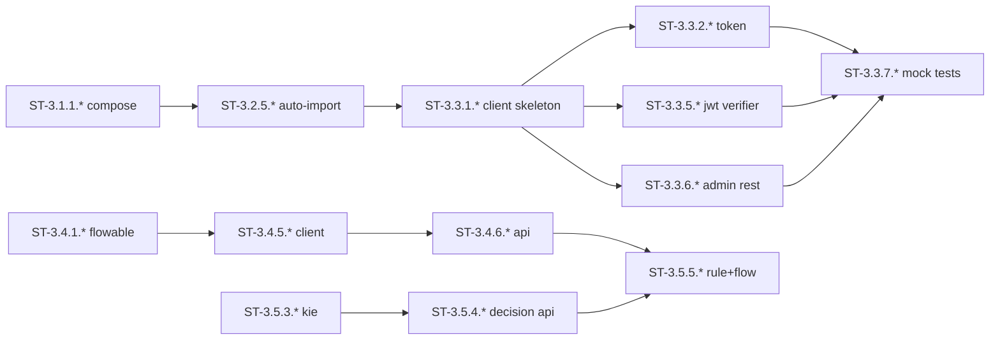

# W3 子任务卡（ST）：外部引擎 ACL Client（Keycloak / Flowable / Drools）

> **源任务卡**：[tasks-W3.md](./2026-07-27-mate-platform-tasks-W3.md)
> **总览**：[Task Breakdown v2.0](./2026-07-27-mate-platform-task-breakdown.md)
> **Sprint**：S3（2026-08-11 ~ 2026-08-24）
> **里程碑**：M2 上半
> **ST 总数**：65（拆解自 29 个 TC）
> **粒度**：0.5-4 小时 / 单文件 / 单函数 / 单测试

---

## 目录

- [W3-1 Keycloak docker-compose 集成](#w3-1-keycloak-docker-compose-集成)（8 ST）
- [W3-2 Realm/Client/Roles/Users 初始化](#w3-2-realmclientrolesusers-初始化)（12 ST）
- [W3-3 KeycloakClient 实现](#w3-3-keycloakclient-实现)（18 ST）
- [W3-4 Flowable docker-compose + FlowableClient](#w3-4-flowable-docker-compose--flowableclient)（17 ST）
- [W3-5 Drools 集成 + 决策服务](#w3-5-drools-集成--决策服务)（10 ST）
- [完成度检查表](#完成度检查表)
- [Sprint S3 ST 排程](#sprint-s3-st-排程)

---
## W3-1 Keycloak docker-compose 集成

> **路线图工时**：1d | **拆出 TC 数**：4 | **关键路径**：是 | **ST 数**：8

### TC-3.1.1 docker-compose 加 keycloak 服务（2h → 2 ST）

#### ST-3.1.1.1 docker-compose.yml 加 keycloak 服务

| 字段 | 值 |
|---|---|
| 所属 TC | TC-3.1.1 |
| 工时 | 1h | 角色 | DevOps |
| 目标文件 | docker-compose.yml |
| 前置 ST | TC-2.1.6（PG 服务在线） |
| 输出 commit | dev: add keycloak service |

**目标**：在 docker-compose 加 keycloak 容器。

**改动清单**：
1. 加 `quay.io/keycloak/keycloak:25.0` start-dev 模式
2. 端口 8080 + 8443
3. env：`KEYCLOAK_ADMIN=admin`、`KEYCLOAK_ADMIN_PASSWORD=admin-pass`、`KC_DB=postgres`、`KC_DB_URL=jdbc:postgresql://pg:5432/keycloak`
4. depends_on：`pg` 服务 healthcheck

**DoD**：
- [ ] 容器启动不报 DB 错误

---

#### ST-3.1.1.2 keycloak 卷挂载 + realm-export 占位

| 字段 | 值 |
|---|---|
| 所属 TC | TC-3.1.1 |
| 工时 | 1h | 角色 | DevOps |
| 目标文件 | docker-compose.yml、infra/init/keycloak/realm-export.json |
| 前置 ST | ST-3.1.1.1 |
| 输出 commit | dev: keycloak import mount |

**改动清单**：
1. 挂 `infra/init/keycloak/` 到 `/opt/keycloak/data/import/`
2. 先放空 realm-export.json 占位（详细见 TC-3.1.3）

**DoD**：
- [ ] `docker compose up -d keycloak` 容器 healthy

---

### TC-3.1.2 启动后健康检查（1h → 2 ST）

#### ST-3.1.2.1 docker-compose healthcheck 配 OIDC ready

| 字段 | 值 |
|---|---|
| 所属 TC | TC-3.1.2 |
| 工时 | 0.5h | 角色 | DevOps |
| 目标文件 | docker-compose.yml |
| 前置 ST | TC-3.1.1 |
| 输出 commit | dev: keycloak healthcheck |

**改动清单**：
1. healthcheck：`CMD-SHELL curl --fail http://localhost:8080/health/ready`
2. interval 10s、timeout 5s、retries 30、start_period 60s

**DoD**：
- [ ] 健康检查配置完整

---

#### ST-3.1.2.2 scripts/wait-keycloak.sh

| 字段 | 值 |
|---|---|
| 所属 TC | TC-3.1.2 |
| 工时 | 0.5h | 角色 | DevOps |
| 目标文件 | scripts/wait-keycloak.sh |
| 前置 ST | ST-3.1.2.1 |
| 输出 commit | dev: wait-keycloak script |

**改动清单**：
1. 写脚本：`until curl -sf http://localhost:8080/realms/master >/dev/null; do sleep 2; done`
2. 加 `set -euo pipefail`

**DoD**：
- [ ] CI 中可用

---

### TC-3.1.3 realm-export.json 模板（2h → 2 ST）

#### ST-3.1.3.1 realm-export.json 顶层骨架

| 字段 | 值 |
|---|---|
| 所属 TC | TC-3.1.3 |
| 工时 | 1h | 角色 | Backend |
| 目标文件 | infra/init/keycloak/realm-export.json |
| 前置 ST | TC-3.1.1 |
| 输出 commit | dev: keycloak realm template |

**改动清单**：
1. 顶层：`realm=mate`、`enabled=true`、`accessTokenLifespan=1800`
2. 预留 `clients[]`、`roles[]`、`users[]` 空数组

**DoD**：
- [ ] JSON schema 合规

---

#### ST-3.1.3.2 ADR-0009 realm export vs kc.sh import

| 字段 | 值 |
|---|---|
| 所属 TC | TC-3.1.3 |
| 工时 | 1h | 角色 | Backend |
| 目标文件 | docs/active/decisions/ADR-0009-keycloak-import.md |
| 前置 ST | ST-3.1.3.1 |
| 输出 commit | docs(iam): ADR-0009 |

**改动清单**：
1. 写 ADR-0009：决定使用 realm export 文件（vs kc.sh import 命令）
2. Context / Decision / Consequences 三段式

**DoD**：
- [ ] ADR 合并

---

### TC-3.1.4 启动验证（1h → 2 ST）

#### ST-3.1.4.1 tests/smoke/test_keycloak_up.py

| 字段 | 值 |
|---|---|
| 所属 TC | TC-3.1.4 |
| 工时 | 0.5h | 角色 | DevOps |
| 目标文件 | tests/smoke/test_keycloak_up.py |
| 前置 ST | TC-3.1.1、TC-3.1.2 |
| 输出 commit | dev: keycloak smoke |

**改动清单**：
1. 连 `http://localhost:8080/realms/master/.well-known/openid-configuration`
2. 校验返回 200 + issuer 字段

**DoD**：
- [ ] smoke 测试通过

---

#### ST-3.1.4.2 CI infra-storage job 加 keycloak 步骤

| 字段 | 值 |
|---|---|
| 所属 TC | TC-3.1.4 |
| 工时 | 0.5h | 角色 | DevOps |
| 目标文件 | .github/workflows/python.yml |
| 前置 ST | ST-3.1.4.1 |
| 输出 commit | ci: keycloak smoke |

**改动清单**：
1. CI job 加 `curl --fail http://localhost:8080/...` 步骤
2. 错误时阻断

**DoD**：
- [ ] Keycloak 不可用时 CI 红

---## W3-2 Realm / Client / Roles / Users 初始化

> **路线图工时**：1d | **拆出 TC 数**：6 | **关键路径**：否 | **ST 数**：12

### TC-3.2.1 realm 配置（1h → 2 ST）

#### ST-3.2.1.1 realm 主配置：登录 + token + 国际化

| 字段 | 值 |
|---|---|
| 所属 TC | TC-3.2.1 |
| 工时 | 0.5h | 角色 | Backend |
| 目标文件 | infra/init/keycloak/realm-export.json |
| 前置 ST | TC-3.1.3 |
| 输出 commit | dev: realm config |

**改动清单**：
1. `realm=mate`、`displayName=Mate Platform`
2. 登录：`loginWithEmailAllowed=true`、`duplicateEmailsAllowed=false`
3. token：`accessTokenLifespan=1800`、`refreshTokenMaxReuse=5`、`ssoSessionIdleTimeout=1800`
4. 国际化：`internationalizationEnabled=true`、`supportedLocales=["en","zh"]`

**DoD**：
- [ ] import 后控制台能看到配置

---

#### ST-3.2.1.2 realm 校验：TTL + locale

| 字段 | 值 |
|---|---|
| 所属 TC | TC-3.2.1 |
| 工时 | 0.5h | 角色 | Backend |
| 目标文件 | infra/init/keycloak/realm-export.json、tests/test_realm_config.py |
| 前置 ST | ST-3.2.1.1 |
| 输出 commit | test(iam): realm config |

**改动清单**：
1. JSON schema 校验脚本
2. 写 test_realm_config.py：accessTokenLifespan == 1800、supportedLocales 含 zh

**DoD**：
- [ ] TTL / locale 校验通过

---

### TC-3.2.2 init-client.json（3h → 3 ST）

#### ST-3.2.2.1 public clients：iam-public + mate-admin-portal

| 字段 | 值 |
|---|---|
| 所属 TC | TC-3.2.2 |
| 工时 | 1h | 角色 | Backend |
| 目标文件 | infra/init/keycloak/realm-export.json（clients 段） |
| 前置 ST | TC-3.2.1 |
| 输出 commit | dev: public clients |

**改动清单**：
1. `iam-public`：public client，`redirectUris=["http://localhost:5173/*"]`、`webOrigins=["*"]`
2. `mate-admin-portal`：public client，`redirectUris=["http://localhost:5174/*"]`
3. `protocol=openid-connect`、`standardFlowEnabled=true`

**DoD**：
- [ ] 2 client import 后控制台可见

---

#### ST-3.2.2.2 confidential clients：mate-backend + mcphub-internal

| 字段 | 值 |
|---|---|
| 所属 TC | TC-3.2.2 |
| 工时 | 1h | 角色 | Backend |
| 目标文件 | infra/init/keycloak/realm-export.json（clients 段） |
| 前置 ST | ST-3.2.2.1 |
| 输出 commit | dev: confidential clients |

**改动清单**：
1. `mate-backend`：confidential client（后端服务用），`serviceAccountsEnabled=true`
2. `mcphub-internal`：confidential client（仅内网）
3. 每个有 `clientId` + `secret` 占位

**DoD**：
- [ ] confidential client 能用 client_credentials 拿 token

---

#### ST-3.2.2.3 4 client 启动验证

| 字段 | 值 |
|---|---|
| 所属 TC | TC-3.2.2 |
| 工时 | 1h | 角色 | Backend |
| 目标文件 | tests/test_clients_imported.py |
| 前置 ST | ST-3.2.2.2 |
| 输出 commit | test(iam): clients check |

**改动清单**：
1. test_clients_imported：连 Admin API 拉 client 列表，断言 4 个全在

**DoD**：
- [ ] 4 client 全部 import

---

### TC-3.2.3 init-roles.json（2h → 2 ST）

#### ST-3.2.3.1 realm roles：admin/editor/viewer/agent

| 字段 | 值 |
|---|---|
| 所属 TC | TC-3.2.3 |
| 工时 | 1h | 角色 | Backend |
| 目标文件 | infra/init/keycloak/realm-export.json（roles 段） |
| 前置 ST | TC-3.2.1 |
| 输出 commit | dev: realm roles |

**改动清单**：
1. realm roles：`admin`、`editor`、`viewer`、`agent`
2. role attributes：`admin.description`、`agent.capabilities=["tool-call","plan"]`
3. composite：`editor` 包含 `kb.read`、`kb.write`

**DoD**：
- [ ] 4 realm role 全部 import

---

#### ST-3.2.3.2 client roles：mate-backend 5 个

| 字段 | 值 |
|---|---|
| 所属 TC | TC-3.2.3 |
| 工时 | 1h | 角色 | Backend |
| 目标文件 | infra/init/keycloak/realm-export.json（roles 段） |
| 前置 ST | ST-3.2.3.1 |
| 输出 commit | dev: client roles |

**改动清单**：
1. client `mate-backend` roles：`kb.read`、`kb.write`、`ont.read`、`ont.write`、`rag.invoke`

**DoD**：
- [ ] 5 client role 全部 import

---

### TC-3.2.4 init-users.json（2h → 2 ST）

#### ST-3.2.4.1 4 种子用户定义

| 字段 | 值 |
|---|---|
| 所属 TC | TC-3.2.4 |
| 工时 | 1h | 角色 | Backend |
| 目标文件 | infra/init/keycloak/realm-export.json（users 段） |
| 前置 ST | TC-3.2.1 |
| 输出 commit | dev: seed users |

**改动清单**：
1. `admin@mate.local` / `admin-pass`：realm role `admin`
2. `editor@mate.local` / `editor-pass`：realm role `editor`
3. `viewer@mate.local` / `viewer-pass`：realm role `viewer`
4. `agent@mate.local` / `agent-pass`：realm role `agent`
5. 用户属性：`tenant=default`、`locale=zh`

**DoD**：
- [ ] 4 用户定义完整

---

#### ST-3.2.4.2 user credentials 显式声明

| 字段 | 值 |
|---|---|
| 所属 TC | TC-3.2.4 |
| 工时 | 1h | 角色 | Backend |
| 目标文件 | infra/init/keycloak/realm-export.json（users 段） |
| 前置 ST | ST-3.2.4.1 |
| 输出 commit | dev: user credentials |

**改动清单**：
1. `users[*].credentials[*].value` 显式声明初始密码
2. `temporary=false`、`type=password`

**DoD**：
- [ ] 第一次启动后 4 用户可登录

---

### TC-3.2.5 启动时自动导入（1h → 2 ST）

#### ST-3.2.5.1 docker-compose start --import-realm 启动命令

| 字段 | 值 |
|---|---|
| 所属 TC | TC-3.2.5 |
| 工时 | 0.5h | 角色 | DevOps |
| 目标文件 | docker-compose.yml |
| 前置 ST | TC-3.2.1 ~ TC-3.2.4 |
| 输出 commit | dev: keycloak auto-import |

**改动清单**：
1. 启动命令加 `--import-realm`
2. env：`KEYCLOAK_IMPORT=/opt/keycloak/data/import/realm-export.json`

**DoD**：
- [ ] 第一次启动自动加载 realm

---

#### ST-3.2.5.2 端到端验证：4 用户 4 client 4 role

| 字段 | 值 |
|---|---|
| 所属 TC | TC-3.2.5 |
| 工时 | 0.5h | 角色 | DevOps |
| 目标文件 | tests/smoke/test_keycloak_bootstrap.sh |
| 前置 ST | ST-3.2.5.1 |
| 输出 commit | test(iam): bootstrap verify |

**改动清单**：
1. scripts 脚本：调 Admin API 拉 users / clients / roles
2. 断言各 4 个

**DoD**：
- [ ] 端到端 import 验证

---

### TC-3.2.6 可重复导入测试（1h → 1 ST）

#### ST-3.2.6.1 scripts/smoke/keycloak-import.sh

| 字段 | 值 |
|---|---|
| 所属 TC | TC-3.2.6 |
| 工时 | 1h | 角色 | Backend |
| 目标文件 | scripts/smoke/keycloak-import.sh |
| 前置 ST | TC-3.2.5 |
| 输出 commit | test(keycloak): reimport |

**改动清单**：
1. 删 `mate-pg-data` 卷 → 重启 → 验证用户数
2. 写进 CI 跑 3 次

**DoD**：
- [ ] 重复 3 次结果一致

---
## W3-3 KeycloakClient 实现

> **路线图工时**：3d | **拆出 TC 数**：7 | **关键路径**：是 | **ST 数**：21

### TC-3.3.1 KeycloakClient 骨架 + 配置（3h → 2 ST）

#### ST-3.3.1.1 apps/tech-iam 初始化 + keycloak 依赖

| 字段 | 值 |
|---|---|
| 所属 TC | TC-3.3.1 |
| 工时 | 1h | 角色 | Backend |
| 目标文件 | apps/tech-iam/pyproject.toml |
| 前置 ST | TC-3.2.5 |
| 输出 commit | chore(iam): tech-iam scaffold |

**改动清单**：
1. uv init --package tech-iam
2. 依赖：`python-keycloak>=3.4`、`httpx>=0.27`、`pyjwt[crypto]>=2.8`
3. 加进 workspace

**DoD**：
- [ ] uv sync 成功

---

#### ST-3.3.1.2 KeycloakClient 骨架 + env 配置

| 字段 | 值 |
|---|---|
| 所属 TC | TC-3.3.1 |
| 工时 | 2h | 角色 | Backend |
| 目标文件 | apps/tech-iam/src/tech_iam/keycloak.py、tests/test_keycloak_skeleton.py |
| 前置 ST | ST-3.3.1.1 |
| 输出 commit | feat(iam): keycloak skeleton |

**改动清单**：
1. `class KeycloakClient`，`__init__(*, server_url, realm, client_id, client_secret=None)`
2. 内部持有 `KeycloakOpenID` + `KeycloakAdmin`
3. env：`KEYCLOAK_SERVER_URL`、`KEYCLOAK_REALM=mate`、`KEYCLOAK_CLIENT_ID`
4. 错误配置抛 `KeycloakConfigError`
5. 单测：构造 client 不报错

**DoD**：
- [ ] pyright strict 通过
- [ ] 单测全绿

---

### TC-3.3.2 OIDC token 颁发（4h → 3 ST）

#### ST-3.3.2.1 TokenResponse schema 定义

| 字段 | 值 |
|---|---|
| 所属 TC | TC-3.3.2 |
| 工时 | 0.5h | 角色 | Backend |
| 目标文件 | libs/openapi-schemas/src/iam/token.py |
| 前置 ST | TC-3.3.1 |
| 输出 commit | feat(schemas): TokenResponse |

**改动清单**：
1. `class TokenResponse(BaseModel)`：`access_token`、`refresh_token`、`expires_in`、`token_type`、`scope`
2. Pydantic v2 配置

**DoD**：
- [ ] pyright strict 通过

---

#### ST-3.3.2.2 KeycloakClient.token() password grant

| 字段 | 值 |
|---|---|
| 所属 TC | TC-3.3.2 |
| 工时 | 2h | 角色 | Backend |
| 目标文件 | apps/tech-iam/src/tech_iam/keycloak.py |
| 前置 ST | ST-3.3.2.1 |
| 输出 commit | feat(iam): oidc token |

**改动清单**：
1. `def token(*, username, password, scope="openid profile email") -> TokenResponse`
2. 调 `openid.token(username, password, grant_type="password", scope=scope)`
3. 失败 → 抛 `InvalidCredentials`

**DoD**：
- [ ] pyright strict 通过

---

#### ST-3.3.2.3 token 单测（4 用户 + 错误密码）

| 字段 | 值 |
|---|---|
| 所属 TC | TC-3.3.2 |
| 工时 | 1.5h | 角色 | Backend |
| 目标文件 | apps/tech-iam/tests/test_keycloak_token.py |
| 前置 ST | ST-3.3.2.2 |
| 输出 commit | test(iam): token suite |

**改动清单**：
1. test_4_users_get_token：4 个种子用户都能拿 token
2. test_wrong_password_401：错误密码 → `InvalidCredentials`
3. test_expired_token：mock 时间验证过期处理

**DoD**：
- [ ] 3 case 全绿

---

### TC-3.3.3 OIDC refresh token（2h → 2 ST）

#### ST-3.3.3.1 KeycloakClient.refresh() 实现

| 字段 | 值 |
|---|---|
| 所属 TC | TC-3.3.3 |
| 工时 | 1h | 角色 | Backend |
| 目标文件 | apps/tech-iam/src/tech_iam/keycloak.py |
| 前置 ST | TC-3.3.2 |
| 输出 commit | feat(iam): oidc refresh |

**改动清单**：
1. `def refresh(self, refresh_token: str) -> TokenResponse`
2. 调 `openid.refresh_token(refresh_token)`
3. 复用 TokenResponse 校验

**DoD**：
- [ ] pyright strict 通过

---

#### ST-3.3.3.2 refresh 单测：轮换 + 过期

| 字段 | 值 |
|---|---|
| 所属 TC | TC-3.3.3 |
| 工时 | 1h | 角色 | Backend |
| 目标文件 | apps/tech-iam/tests/test_keycloak_refresh.py |
| 前置 ST | ST-3.3.3.1 |
| 输出 commit | test(iam): refresh suite |

**改动清单**：
1. test_refresh_changes_access_token：refresh 后 access_token 不同
2. test_refresh_rotates：refresh_token 轮换
3. test_expired_refresh：过期 refresh 抛异常

**DoD**：
- [ ] 3 case 全绿

---

### TC-3.3.4 OIDC logout（2h → 2 ST）

#### ST-3.3.4.1 KeycloakClient.logout() 实现

| 字段 | 值 |
|---|---|
| 所属 TC | TC-3.3.4 |
| 工时 | 1h | 角色 | Backend |
| 目标文件 | apps/tech-iam/src/tech_iam/keycloak.py |
| 前置 ST | TC-3.3.2 |
| 输出 commit | feat(iam): oidc logout |

**改动清单**：
1. `def logout(self, refresh_token: str) -> None`
2. 调 `openid.logout(refresh_token)`
3. 同时清本地 session 表（如有）

**DoD**：
- [ ] pyright strict 通过

---

#### ST-3.3.4.2 logout 单测：refresh 失效

| 字段 | 值 |
|---|---|
| 所属 TC | TC-3.3.4 |
| 工时 | 1h | 角色 | Backend |
| 目标文件 | apps/tech-iam/tests/test_keycloak_logout.py |
| 前置 ST | ST-3.3.4.1 |
| 输出 commit | test(iam): logout suite |

**改动清单**：
1. test_logout_invalidates_refresh：logout 后 refresh_token 失效
2. test_logout_already_invalid：重复 logout 不报错

**DoD**：
- [ ] 2 case 全绿

---

### TC-3.3.5 JWT 校验（4h → 3 ST）

#### ST-3.3.5.1 current_user() FastAPI 依赖

| 字段 | 值 |
|---|---|
| 所属 TC | TC-3.3.5 |
| 工时 | 2h | 角色 | Backend |
| 目标文件 | apps/tech-iam/src/tech_iam/deps.py |
| 前置 ST | TC-3.3.2 |
| 输出 commit | feat(iam): current_user dep |

**改动清单**：
1. `async def current_user(authorization: str = Header(...)) -> UserContext`
2. 校验：签名（用 Keycloak 公钥，缓存 5min） + 过期 + issuer + audience
3. 失败 → 401 + `ErrorResponse(code="4A001")`

**DoD**：
- [ ] pyright strict 通过

---

#### ST-3.3.5.2 require_role() 装饰器

| 字段 | 值 |
|---|---|
| 所属 TC | TC-3.3.5 |
| 工时 | 1h | 角色 | Backend |
| 目标文件 | apps/tech-iam/src/tech_iam/deps.py |
| 前置 ST | ST-3.3.5.1 |
| 输出 commit | feat(iam): require_role |

**改动清单**：
1. `def require_role(role: str) -> Callable`
2. 包装 FastAPI 端点：检查 user.realm_roles 含 role
3. 缺失 → 403 + `ErrorResponse(code="4B001")`

**DoD**：
- [ ] pyright strict 通过

---

#### ST-3.3.5.3 JWT 校验单测（合法/过期/伪造/缺失）

| 字段 | 值 |
|---|---|
| 所属 TC | TC-3.3.5 |
| 工时 | 1h | 角色 | Backend |
| 目标文件 | apps/tech-iam/tests/test_jwt_verifier.py |
| 前置 ST | ST-3.3.5.2 |
| 输出 commit | test(iam): jwt verifier |

**改动清单**：
1. test_valid_token：合法 token → UserContext
2. test_expired_token：过期 token → 401
3. test_wrong_signature：错误签名 → 401
4. test_missing_token：缺 header → 401

**DoD**：
- [ ] 4 case 全绿

---

### TC-3.3.6 Admin REST 封装（6h → 4 ST）

#### ST-3.3.6.1 users 列表 + 创建

| 字段 | 值 |
|---|---|
| 所属 TC | TC-3.3.6 |
| 工时 | 1.5h | 角色 | Backend |
| 目标文件 | apps/tech-iam/src/tech_iam/keycloak.py（users 子命名空间） |
| 前置 ST | TC-3.3.1 |
| 输出 commit | feat(iam): users list/create |

**改动清单**：
1. `KeycloakClient.users` 子命名空间
2. `users.list(*, limit, offset, search) -> list[User]`
3. `users.create(payload: UserCreate) -> User`

**DoD**：
- [ ] pyright strict 通过

---

#### ST-3.3.6.2 users 读取 + 更新 + 删除

| 字段 | 值 |
|---|---|
| 所属 TC | TC-3.3.6 |
| 工时 | 1.5h | 角色 | Backend |
| 目标文件 | apps/tech-iam/src/tech_iam/keycloak.py |
| 前置 ST | ST-3.3.6.1 |
| 输出 commit | feat(iam): users get/update/delete |

**改动清单**：
1. `users.get(user_id) -> User`
2. `users.update(user_id, payload: UserUpdate) -> User`
3. `users.delete(user_id) -> None`

**DoD**：
- [ ] 错误用户 → 404 + `EntityNotFound`

---

#### ST-3.3.6.3 assign_roles + roles 列表

| 字段 | 值 |
|---|---|
| 所属 TC | TC-3.3.6 |
| 工时 | 1h | 角色 | Backend |
| 目标文件 | apps/tech-iam/src/tech_iam/keycloak.py |
| 前置 ST | ST-3.3.6.2 |
| 输出 commit | feat(iam): assign_roles |

**改动清单**：
1. `users.assign_roles(user_id, role_names: list[str]) -> None`
2. `roles.list() -> list[Role]`

**DoD**：
- [ ] 重复创建 → 409 + `Conflict`

---

#### ST-3.3.6.4 admin REST 单测

| 字段 | 值 |
|---|---|
| 所属 TC | TC-3.3.6 |
| 工时 | 2h | 角色 | Backend |
| 目标文件 | apps/tech-iam/tests/test_keycloak_admin.py |
| 前置 ST | ST-3.3.6.3 |
| 输出 commit | test(iam): admin rest |

**改动清单**：
1. CRUD + 角色绑定测试
2. 与 OpenAPI §4 W1-3 的 10 端点一一对应

**DoD**：
- [ ] 与 OpenAPI 对齐

---

### TC-3.3.7 单测 mock OIDC server（3h → 2 ST）

#### ST-3.3.7.1 respx + pytest-httpx 加依赖 + fixture

| 字段 | 值 |
|---|---|
| 所属 TC | TC-3.3.7 |
| 工时 | 1h | 角色 | Backend |
| 目标文件 | apps/tech-iam/pyproject.toml、tests/conftest.py |
| 前置 ST | TC-3.3.2 ~ TC-3.3.6 |
| 输出 commit | chore(iam): respx fixtures |

**改动清单**：
1. 加 `respx>=0.21`、`pytest-httpx>=0.30`
2. tests/conftest.py：6 个 fixture：成功/失败 token、refresh、logout、admin CRUD、JWT

**DoD**：
- [ ] fixture 可复用

---

#### ST-3.3.7.2 mock 套件 100% 离线绿

| 字段 | 值 |
|---|---|
| 所属 TC | TC-3.3.7 |
| 工时 | 2h | 角色 | Backend |
| 目标文件 | apps/tech-iam/tests/test_keycloak_client.py |
| 前置 ST | ST-3.3.7.1 |
| 输出 commit | test(iam): mock suite |

**改动清单**：
1. tests/test_keycloak_client.py：每个方法 ≥ 1 正 + 1 反
2. 覆盖率 ≥ 80%

**DoD**：
- [ ] 离线（不连 Keycloak）100% 绿

---
## W3-4 Flowable docker-compose + FlowableClient

> **路线图工时**：3d | **拆出 TC 数**：7 | **关键路径**：否 | **ST 数**：21

### TC-3.4.1 flowable-rest + flowable-ui 容器（2h → 2 ST）

#### ST-3.4.1.1 docker-compose.yml 加 flowable-rest

| 字段 | 值 |
|---|---|
| 所属 TC | TC-3.4.1 |
| 工时 | 1h | 角色 | DevOps |
| 目标文件 | docker-compose.yml |
| 前置 ST | TC-2.1.6 |
| 输出 commit | dev: add flowable-rest |

**改动清单**：
1. 加 `flowable/flowable-rest:6.8.0`（端口 8090）
2. env：`FLOWABLE_DATABASE_TYPE=postgres`、`SPRING_DATASOURCE_URL=jdbc:postgresql://pg:5432/flowable`
3. 卷 `mate-flowable-data`

**DoD**：
- [ ] 容器启动

---

#### ST-3.4.1.2 docker-compose.yml 加 flowable-ui + healthcheck

| 字段 | 值 |
|---|---|
| 所属 TC | TC-3.4.1 |
| 工时 | 1h | 角色 | DevOps |
| 目标文件 | docker-compose.yml |
| 前置 ST | ST-3.4.1.1 |
| 输出 commit | dev: flowable-ui + healthcheck |

**改动清单**：
1. 加 `flowable/flowable-ui:6.8.0`（端口 8091）
2. healthcheck：`curl --fail http://localhost:8090/flowable-rest/service/management/health`

**DoD**：
- [ ] 容器 healthy
- [ ] 控制台 8091 可访问

---

### TC-3.4.2 postgres schema 初始化（1h → 1 ST）

#### ST-3.4.2.1 infra/init/postgres/02-flowable.sql

| 字段 | 值 |
|---|---|
| 所属 TC | TC-3.4.2 |
| 工时 | 1h | 角色 | DevOps |
| 目标文件 | infra/init/postgres/02-flowable.sql |
| 前置 ST | TC-3.4.1 |
| 输出 commit | dev: flowable pg init |

**改动清单**：
1. `CREATE DATABASE flowable;`（条件存在跳过）
2. 通过 `mate-pg-init` 一次性 init 容器加载

**DoD**：
- [ ] 重启后 flowable 表自动生成

---

### TC-3.4.3 默认 admin 账号（1h → 1 ST）

#### ST-3.4.3.1 infra/init/flowable/01-admin.sql

| 字段 | 值 |
|---|---|
| 所属 TC | TC-3.4.3 |
| 工时 | 1h | 角色 | Backend |
| 目标文件 | infra/init/flowable/01-admin.sql |
| 前置 ST | TC-3.4.1 |
| 输出 commit | dev: flowable admin |

**改动清单**：
1. 插 admin 用户的 BCrypt hash
2. 文档：本地用，生产环境必须改密码

**DoD**：
- [ ] 控制台能登录

---

### TC-3.4.4 BPMN 部署脚本（4h → 3 ST）

#### ST-3.4.4.1 scripts/deploy-bpmn.sh + REST 上传

| 字段 | 值 |
|---|---|
| 所属 TC | TC-3.4.4 |
| 工时 | 1.5h | 角色 | Backend |
| 目标文件 | scripts/deploy-bpmn.sh |
| 前置 ST | TC-3.4.1 |
| 输出 commit | feat(bpm): deploy script |

**改动清单**：
1. 用 Flowable REST API `/repository/deployments`
2. multipart/form-data 上传 .bpmn + .png
3. 输出部署 ID 与 version

**DoD**：
- [ ] 脚本能跑

---

#### ST-3.4.4.2 示例 BPMN：agent-loop.bpmn

| 字段 | 值 |
|---|---|
| 所属 TC | TC-3.4.4 |
| 工时 | 1.5h | 角色 | Backend |
| 目标文件 | apps/tech-agent/bpmn/agent-loop.bpmn |
| 前置 ST | ST-3.4.4.1 |
| 输出 commit | feat(bpm): example bpmn |

**改动清单**：
1. 写示例流程：1 start → 1 service task → 1 end
2. 配套 PNG 导出

**DoD**：
- [ ] flowable-ui 能看到流程图

---

#### ST-3.4.4.3 幂等部署：同名内容不重复

| 字段 | 值 |
|---|---|
| 所属 TC | TC-3.4.4 |
| 工时 | 1h | 角色 | Backend |
| 目标文件 | scripts/deploy-bpmn.sh |
| 前置 ST | ST-3.4.4.2 |
| 输出 commit | feat(bpm): idempotent deploy |

**改动清单**：
1. 部署前查 `/repository/deployments?name=X` 是否存在
2. 同名同内容跳过；不同则新建

**DoD**：
- [ ] 重跑幂等

---

### TC-3.4.5 FlowableClient 实现（6h → 4 ST）

#### ST-3.4.5.1 apps/tech-bpm 初始化 + FlowableClient 骨架

| 字段 | 值 |
|---|---|
| 所属 TC | TC-3.4.5 |
| 工时 | 1h | 角色 | Backend |
| 目标文件 | apps/tech-bpm/pyproject.toml、src/tech_bpm/client.py |
| 前置 ST | TC-3.4.4 |
| 输出 commit | feat(bpm): client skeleton |

**改动清单**：
1. uv init --package tech-bpm，加 httpx 依赖
2. `class FlowableClient`，base_url + basic auth（admin/admin-pass）

**DoD**：
- [ ] pyright strict 通过

---

#### ST-3.4.5.2 FlowableClient.deploy + start_process

| 字段 | 值 |
|---|---|
| 所属 TC | TC-3.4.5 |
| 工时 | 2h | 角色 | Backend |
| 目标文件 | apps/tech-bpm/src/tech_bpm/client.py |
| 前置 ST | ST-3.4.5.1 |
| 输出 commit | feat(bpm): deploy+start |

**改动清单**：
1. `deploy(process_definition_key, bpmn_bytes) -> Deployment`
2. `start_process(key, variables: dict) -> ProcessInstance`

**DoD**：
- [ ] pyright strict 通过

---

#### ST-3.4.5.3 FlowableClient 流程实例 + 任务操作

| 字段 | 值 |
|---|---|
| 所属 TC | TC-3.4.5 |
| 工时 | 2h | 角色 | Backend |
| 目标文件 | apps/tech-bpm/src/tech_bpm/client.py |
| 前置 ST | ST-3.4.5.2 |
| 输出 commit | feat(bpm): instance+task |

**改动清单**：
1. `get_process_instance(id) -> ProcessInstance`
2. `complete_task(task_id, variables: dict) -> None`
3. `list_tasks(process_instance_id) -> list[Task]`
4. `cancel_process(id, reason: str) -> None`

**DoD**：
- [ ] pyright strict 通过

---

#### ST-3.4.5.4 FlowableClient 单测（mock + 集成）

| 字段 | 值 |
|---|---|
| 所属 TC | TC-3.4.5 |
| 工时 | 1h | 角色 | Backend |
| 目标文件 | apps/tech-bpm/tests/test_flowable_client.py |
| 前置 ST | ST-3.4.5.3 |
| 输出 commit | test(bpm): client |

**改动清单**：
1. mock 测试：deploy + start + complete
2. 集成测试：真容器跑 agent-loop

**DoD**：
- [ ] 单测 + 集成测试均绿

---

### TC-3.4.6 流程 CRUD + 启动 + 状态查询（4h → 4 ST）

#### ST-3.4.6.1 api.py 部署端点

| 字段 | 值 |
|---|---|
| 所属 TC | TC-3.4.6 |
| 工时 | 1h | 角色 | Backend |
| 目标文件 | apps/tech-bpm/src/tech_bpm/api.py |
| 前置 ST | TC-3.4.5 |
| 输出 commit | feat(bpm): deploy api |

**改动清单**：
1. `POST /api/v1/bpm/deployments`（multipart）

**DoD**：
- [ ] swagger-ui 列出

---

#### ST-3.4.6.2 api.py 流程实例端点

| 字段 | 值 |
|---|---|
| 所属 TC | TC-3.4.6 |
| 工时 | 1h | 角色 | Backend |
| 目标文件 | apps/tech-bpm/src/tech_bpm/api.py |
| 前置 ST | ST-3.4.6.1 |
| 输出 commit | feat(bpm): instance api |

**改动清单**：
1. `POST /api/v1/bpm/process-instances`
2. `GET /api/v1/bpm/process-instances/{id}`

**DoD**：
- [ ] swagger-ui 列出 2 端点

---

#### ST-3.4.6.3 api.py 任务端点

| 字段 | 值 |
|---|---|
| 所属 TC | TC-3.4.6 |
| 工时 | 1h | 角色 | Backend |
| 目标文件 | apps/tech-bpm/src/tech_bpm/api.py |
| 前置 ST | ST-3.4.6.2 |
| 输出 commit | feat(bpm): task api |

**改动清单**：
1. `POST /api/v1/bpm/tasks/{id}/complete`
2. `GET /api/v1/bpm/process-instances/{id}/tasks`

**DoD**：
- [ ] swagger-ui 列出 2 端点

---

#### ST-3.4.6.4 api.py cancel 端点 + 端到端测试

| 字段 | 值 |
|---|---|
| 所属 TC | TC-3.4.6 |
| 工时 | 1h | 角色 | Backend |
| 目标文件 | apps/tech-bpm/src/tech_bpm/api.py、tests/test_bpm_api.py |
| 前置 ST | ST-3.4.6.3 |
| 输出 commit | feat(bpm): cancel api |

**改动清单**：
1. `POST /api/v1/bpm/process-instances/{id}/cancel`
2. tests/test_bpm_api.py：API 端到端

**DoD**：
- [ ] swagger-ui 列出 6 端点

---

### TC-3.4.7 单测（2h → 2 ST）

#### ST-3.4.7.1 test_flowable_client.py mock 套件

| 字段 | 值 |
|---|---|
| 所属 TC | TC-3.4.7 |
| 工时 | 1h | 角色 | Backend |
| 目标文件 | apps/tech-bpm/tests/test_flowable_client.py |
| 前置 ST | TC-3.4.5、TC-3.4.6 |
| 输出 commit | test(bpm): client mock |

**改动清单**：
1. mock 5 个方法
2. 错误 BPMN → 400 + `InvalidBpmn`

**DoD**：
- [ ] mock 覆盖率 ≥ 80%

---

#### ST-3.4.7.2 test_bpm_api.py 集成套件

| 字段 | 值 |
|---|---|
| 所属 TC | TC-3.4.7 |
| 工时 | 1h | 角色 | Backend |
| 目标文件 | apps/tech-bpm/tests/test_bpm_api.py |
| 前置 ST | ST-3.4.7.1 |
| 输出 commit | test(bpm): api e2e |

**改动清单**：
1. 6 端点端到端
2. CI 集成

**DoD**：
- [ ] CI 绿

---
## W3-5 Drools 集成 + 决策服务

> **路线图工时**：1.5d | **拆出 TC 数**：5 | **关键路径**：否 | **ST 数**：10

### TC-3.5.1 Drools 引擎评估（3h → 2 ST）

#### ST-3.5.1.1 ADR-0010 Drools 集成方式决策

| 字段 | 值 |
|---|---|
| 所属 TC | TC-3.5.1 |
| 工时 | 1h | 角色 | Backend |
| 目标文件 | docs/active/decisions/ADR-0010-drools-integration.md |
| 前置 ST | TC-3.4.5 |
| 输出 commit | docs(rules): ADR-0010 |

**改动清单**：
1. 写 ADR-0010：v1 选**本地嵌入**评估
2. 实际方案：Drools 走 REST（KIE Server 7.x），`apps/tech-rules` 调它

**DoD**：
- [ ] ADR 合并

---

#### ST-3.5.1.2 spike 验证 KIE Server REST

| 字段 | 值 |
|---|---|
| 所属 TC | TC-3.5.1 |
| 工时 | 2h | 角色 | Backend |
| 目标文件 | scripts/spike-kie-server.sh、docs/active/reports/kie-spike.md |
| 前置 ST | ST-3.5.1.1 |
| 输出 commit | chore(rules): kie spike |

**改动清单**：
1. 用 docker-compose 启 `jboss/kie-server:7.74` + 一个示例规则
2. 验证端到端

**DoD**：
- [ ] spike 文档可复现

---

### TC-3.5.2 规则文件存放约定（1h → 2 ST）

#### ST-3.5.2.1 DRL 文件命名与目录约定

| 字段 | 值 |
|---|---|
| 所属 TC | TC-3.5.2 |
| 工时 | 0.5h | 角色 | Backend |
| 目标文件 | docs/active/decisions/ADR-0011-rules-convention.md |
| 前置 ST | — |
| 输出 commit | docs(rules): ADR-0011 |

**改动清单**：
1. 路径：`apps/tech-rules/rules/{namespace}/*.drl`
2. 命名：`{entity}_{action}.drl`
3. ADR-0011：规则版本用 kjar GAV

**DoD**：
- [ ] ADR 合并

---

#### ST-3.5.2.2 apps/tech-rules/rules 目录骨架

| 字段 | 值 |
|---|---|
| 所属 TC | TC-3.5.2 |
| 工时 | 0.5h | 角色 | Backend |
| 目标文件 | apps/tech-rules/rules/{agent, kb, ont}/.gitkeep |
| 前置 ST | ST-3.5.2.1 |
| 输出 commit | feat(rules): dirs skeleton |

**改动清单**：
1. 创建子目录 + .gitkeep
2. 加 README 说明

**DoD**：
- [ ] 目录结构示例文件齐

---

### TC-3.5.3 KIE Server 容器集成（3h → 2 ST）

#### ST-3.5.3.1 docker-compose.yml 加 kie-server

| 字段 | 值 |
|---|---|
| 所属 TC | TC-3.5.3 |
| 工时 | 1.5h | 角色 | DevOps |
| 目标文件 | docker-compose.yml |
| 前置 ST | TC-3.5.1、TC-3.5.2 |
| 输出 commit | dev: add kie-server |

**改动清单**：
1. 加 `kie-server:7.74`，端口 8180
2. 挂 `apps/tech-rules/rules/` 到 `/opt/jboss/standalone/deployments/`
3. healthcheck：`curl --fail http://localhost:8180/services/rest/server/ready`

**DoD**：
- [ ] 容器 healthy

---

#### ST-3.5.3.2 mate-kjar 构建脚本

| 字段 | 值 |
|---|---|
| 所属 TC | TC-3.5.3 |
| 工时 | 1.5h | 角色 | DevOps |
| 目标文件 | infra/init/kie/01-build-kjar.sh |
| 前置 ST | ST-3.5.3.1 |
| 输出 commit | dev: mate-kjar builder |

**改动清单**：
1. 写 `01-build-kjar.sh`：用 `kie-maven-plugin` 构建示例 kjar
2. POST `/services/rest/server/containers/instances/mate-kjar`

**DoD**：
- [ ] 返回 201

---

### TC-3.5.4 决策服务 OpenAPI 端点（4h → 3 ST）

#### ST-3.5.4.1 RuleRequest/Response schema

| 字段 | 值 |
|---|---|
| 所属 TC | TC-3.5.4 |
| 工时 | 1h | 角色 | Backend |
| 目标文件 | libs/openapi-schemas/src/rules/decision.py |
| 前置 ST | TC-3.5.3 |
| 输出 commit | feat(schemas): RuleRequest/Response |

**改动清单**：
1. `class RuleRequest(BaseModel)`：`container: str`、`payload: dict`
2. `class RuleResponse(BaseModel)`：`results: list[dict]`、`facts: list[dict]`

**DoD**：
- [ ] pyright strict 通过

---

#### ST-3.5.4.2 apps/tech-rules/api.py + decide 端点

| 字段 | 值 |
|---|---|
| 所属 TC | TC-3.5.4 |
| 工时 | 2h | 角色 | Backend |
| 目标文件 | apps/tech-rules/src/tech_rules/api.py |
| 前置 ST | ST-3.5.4.1 |
| 输出 commit | feat(rules): decide endpoint |

**改动清单**：
1. `@router.post("/decide", response_model=RuleResponse)`
2. 调 KIE Server fireAllRules
3. OpenAPI 同步更新到 `openapi/paths/rules.yaml`

**DoD**：
- [ ] swagger-ui 列出端点

---

#### ST-3.5.4.3 tests/test_decision_api.py

| 字段 | 值 |
|---|---|
| 所属 TC | TC-3.5.4 |
| 工时 | 1h | 角色 | Backend |
| 目标文件 | apps/tech-rules/tests/test_decision_api.py |
| 前置 ST | ST-3.5.4.2 |
| 输出 commit | test(rules): decide api |

**改动清单**：
1. test_decide_happy：1 正
2. test_container_not_found：404 + `ContainerNotFound`
3. test_slow_rule_timeout：>5s → 504

**DoD**：
- [ ] 3 case 全绿

---

### TC-3.5.5 规则与流程联动（4h → 1 ST）

#### ST-3.5.5.1 agent-decision-flow.bpmn + 3 分支联动

| 字段 | 值 |
|---|---|
| 所属 TC | TC-3.5.5 |
| 工时 | 4h | 角色 | Backend |
| 目标文件 | apps/tech-agent/bpmn/agent-decision-flow.bpmn、tests/test_rule_driven_bpm.py |
| 前置 ST | TC-3.5.4、TC-3.4.5 |
| 输出 commit | feat(agent): rule-driven bpm |

**改动清单**：
1. 写 BPMN：start → service task（调 decide API）→ exclusive gateway（2 支）
2. apps/tech-agent worker 调 apps/tech-rules API
3. tests/test_rule_driven_bpm.py：3 分支各跑一次

**DoD**：
- [ ] 3 分支流程实例都能跑通

---

## W3 完成度检查表

| W3-n | 路线图 ID | 关键路径 | TC 数 | ST 数 | ST 总工时 | 状态 |
|---|---|---|---|---|---|---|
| W3-1 | §4 W3-1 | 是 | 4 | 8 | ~9h | 🔴 未启动 |
| W3-2 | §4 W3-2 | 否 | 6 | 12 | ~14h | 🔴 未启动 |
| W3-3 | §4 W3-3 | 是 | 7 | 18 | ~27h | 🔴 未启动 |
| W3-4 | §4 W3-4 | 否 | 7 | 17 | ~24h | 🔴 未启动 |
| W3-5 | §4 W3-5 | 否 | 5 | 10 | ~13h | 🔴 未启动 |
| **合计** | — | — | **29** | **65** | **~87h** | **🔴 未启动** |

> **关键路径 ST 数**：26（W3-1 + W3-3），必须在 S3 内合入。

---

## Sprint S3 ST 排程（ST 视角）

> 每回合（~2-4h）执行 2-4 条连续 ST。

### Day 1（Keycloak 上线 + Realm）

| 时段 | 重点 ST | 工时 |
|---|---|---|
| D1 上午 | ST-3.1.1.1 → ST-3.1.1.2 + ST-3.1.2.1 → ST-3.1.2.2（compose + healthcheck） | 3h |
| D1 下午 | ST-3.1.3.1 → ST-3.1.3.2（realm 模板 + ADR-0009）+ ST-3.1.4.1 → ST-3.1.4.2（smoke + CI） | 3h |

### Day 2（Client + Role + User）

| 时段 | 重点 ST | 工时 |
|---|---|---|
| D2 上午 | ST-3.2.1.1 → ST-3.2.1.2（realm 配置 + 校验） | 1h |
| D2 上午 | ST-3.2.2.1 → ST-3.2.2.3（4 client + 验证） | 3h |
| D2 下午 | ST-3.2.3.1 → ST-3.2.3.2（7 role）+ ST-3.2.4.1 → ST-3.2.4.2（4 user） | 4h |
| D2 下午 | ST-3.2.5.1 → ST-3.2.5.2（auto-import）+ ST-3.2.6.1（幂等） | 2h |

### Day 3-4（KeycloakClient 实现）

| 时段 | 重点 ST | 工时 |
|---|---|---|
| D3 上午 | ST-3.3.1.1 → ST-3.3.1.2（skeleton + 配置） | 3h |
| D3 下午 | ST-3.3.2.1 → ST-3.3.2.3（token + schema + 测试） | 4h |
| D4 上午 | ST-3.3.3.1 → ST-3.3.3.2 + ST-3.3.4.1 → ST-3.3.4.2（refresh + logout + 测试） | 4h |
| D4 下午 | ST-3.3.5.1 → ST-3.3.5.3（JWT 校验 + 测试） | 4h |

### Day 5（Admin REST + mock）

| 时段 | 重点 ST | 工时 |
|---|---|---|
| D5 上午 | ST-3.3.6.1 → ST-3.3.6.2（users CRUD） | 3h |
| D5 下午 | ST-3.3.6.3 → ST-3.3.6.4（assign_roles + 测试） | 3h |
| D5 下午 | ST-3.3.7.1 → ST-3.3.7.2（respx mock 套件） | 3h |

### Day 6-7（Flowable + Client + API）

| 时段 | 重点 ST | 工时 |
|---|---|---|
| D6 上午 | ST-3.4.1.1 → ST-3.4.1.2（容器 + UI + healthcheck） | 2h |
| D6 上午 | ST-3.4.2.1 + ST-3.4.3.1（pg init + admin） | 2h |
| D6 下午 | ST-3.4.4.1 → ST-3.4.4.3（deploy 脚本 + 幂等） | 4h |
| D7 上午 | ST-3.4.5.1 → ST-3.4.5.4（FlowableClient 全套） | 6h |
| D7 下午 | ST-3.4.6.1 → ST-3.4.6.4（6 API 端点） + ST-3.4.7.1 → ST-3.4.7.2（测试） | 6h |

### Day 8-9（Drools + 决策服务 + 联动）

| 时段 | 重点 ST | 工时 |
|---|---|---|
| D8 上午 | ST-3.5.1.1 → ST-3.5.1.2（ADR + spike） | 3h |
| D8 上午 | ST-3.5.2.1 → ST-3.5.2.2（规则约定 + 目录） | 1h |
| D8 下午 | ST-3.5.3.1 → ST-3.5.3.2（kie-server + kjar） | 3h |
| D9 上午 | ST-3.5.4.1 → ST-3.5.4.3（decide API + schema + 测试） | 4h |
| D9 下午 | ST-3.5.5.1（agent-decision-flow.bpmn 联动） | 4h |

---

## 依赖关系图

---

## 变更记录

| 日期 | 版本 | 变更 | 原因 |
|---|---|---|---|
| 2026-07-28 | v2.0 | 从 W3 TC（29 条）拆出 ST（65 条） | 单回合执行避免 Token 超限；TC 4-24h 仍过大 |
