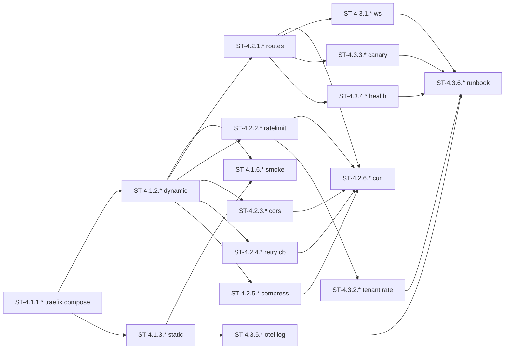

# W4 子任务卡（ST）：Traefik 网关

> **源任务卡**：[tasks-W4.md](./2026-07-27-mate-platform-tasks-W4.md)
> **总览**：[Task Breakdown v2.0](./2026-07-27-mate-platform-task-breakdown.md)
> **Sprint**：S4（2026-08-18 ~ 2026-08-31）
> **里程碑**：M2 下半
> **ST 总数**：48（拆解自 18 个 TC）
> **粒度**：0.5-4 小时 / 单文件 / 单函数 / 单测试

---

## 目录

- [W4-1 Traefik 基础集成](#w4-1-traefik-基础集成)（12 ST）
- [W4-2 路由与中间件](#w4-2-路由与中间件)（19 ST）
- [W4-3 WebSocket + 网关策略](#w4-3-websocket--网关策略)（17 ST）
- [完成度检查表](#完成度检查表)
- [Sprint S4 ST 排程](#sprint-s4-st-排程)

---
## W4-1 Traefik 基础集成

> **路线图工时**：2d | **拆出 TC 数**：6 | **关键路径**：是 | **ST 数**：12

### TC-4.1.1 docker-compose 加 Traefik v3.0（2h → 2 ST）

#### ST-4.1.1.1 docker-compose.yml 加 traefik 容器

| 字段 | 值 |
|---|---|
| 所属 TC | TC-4.1.1 |
| 工时 | 1h | 角色 | DevOps |
| 目标文件 | docker-compose.yml |
| 前置 ST | TC-2.2.4 |
| 输出 commit | dev: add traefik |

**目标**：在 docker-compose 加 traefik v3.0 容器。

**改动清单**：
1. 加 `traefik:v3.0` 容器，端口 80 + 443 + 8080（dashboard）
2. 挂卷：`/var/run/docker.sock:/var/run/docker.sock:ro`、`./infra/traefik:/etc/traefik`
3. 命令：`--providers.docker=true --providers.docker.exposedbydefault=false --api.insecure=true`

**DoD**：
- [ ] 容器启动

---

#### ST-4.1.1.2 traefik 命令行 + 启动验证

| 字段 | 值 |
|---|---|
| 所属 TC | TC-4.1.1 |
| 工时 | 1h | 角色 | DevOps |
| 目标文件 | docker-compose.yml |
| 前置 ST | ST-4.1.1.1 |
| 输出 commit | dev: traefik api |

**改动清单**：
1. 命令加 `--accesslog=true --accesslog.format=json`
2. 健康检查：`curl --fail http://localhost:8080/api/version`

**DoD**：
- [ ] `/api/version` 200
- [ ] 容器 healthy

---

### TC-4.1.2 动态配置目录（1h → 2 ST）

#### ST-4.1.2.1 infra/traefik/dynamic 目录结构

| 字段 | 值 |
|---|---|
| 所属 TC | TC-4.1.2 |
| 工时 | 0.5h | 角色 | DevOps |
| 目标文件 | infra/traefik/dynamic/{routers,middlewares,services}/.gitkeep |
| 前置 ST | TC-4.1.1 |
| 输出 commit | dev: traefik dynamic dirs |

**改动清单**：
1. 新建 dynamic/routers、dynamic/middlewares、dynamic/services
2. 每个加 .gitkeep + README.md

**DoD**：
- [ ] 目录结构清晰

---

#### ST-4.1.2.2 _template.yaml + dynamic_conf.yml

| 字段 | 值 |
|---|---|
| 所属 TC | TC-4.1.2 |
| 工时 | 0.5h | 角色 | DevOps |
| 目标文件 | infra/traefik/dynamic/routers/_template.yaml、dynamic_conf.yml |
| 前置 ST | ST-4.1.2.1 |
| 输出 commit | dev: traefik template |

**改动清单**：
1. _template.yaml：注释化模板
2. dynamic_conf.yml：`providers.file.directory=/etc/traefik/dynamic`

**DoD**：
- [ ] 改 dynamic 下的文件 Traefik 自动热加载

---

### TC-4.1.3 静态配置（2h → 2 ST）

#### ST-4.1.3.1 traefik.yml entryPoints + accessLog

| 字段 | 值 |
|---|---|
| 所属 TC | TC-4.1.3 |
| 工时 | 1h | 角色 | DevOps |
| 目标文件 | infra/traefik/traefik.yml |
| 前置 ST | TC-4.1.1 |
| 输出 commit | dev: traefik static entryPoints |

**改动清单**：
1. `entryPoints.web.address=:80`、`entryPoints.websecure.address=:443`
2. `entryPoints.traefik.address=:8080`（API + dashboard）
3. `accessLog: true`、`accessLog.fields.headers.defaultMode=keep`

**DoD**：
- [ ] 配置 reload 不报错

---

#### ST-4.1.3.2 traefik.yml log + metrics 配置

| 字段 | 值 |
|---|---|
| 所属 TC | TC-4.1.3 |
| 工时 | 1h | 角色 | DevOps |
| 目标文件 | infra/traefik/traefik.yml |
| 前置 ST | ST-4.1.3.1 |
| 输出 commit | dev: traefik log+metrics |

**改动清单**：
1. `log.level=INFO`、`log.format=json`
2. `metrics.prometheus.addEntryPointsLabels=true`

**DoD**：
- [ ] 访问日志输出到 stdout JSON

---

### TC-4.1.4 metrics / dashboard（1h → 2 ST）

#### ST-4.1.4.1 metrics.prometheus.buckets 配置

| 字段 | 值 |
|---|---|
| 所属 TC | TC-4.1.4 |
| 工时 | 0.5h | 角色 | DevOps |
| 目标文件 | infra/traefik/traefik.yml |
| 前置 ST | TC-4.1.3 |
| 输出 commit | dev: traefik prom buckets |

**改动清单**：
1. `metrics.prometheus.buckets=[0.005,0.01,0.05,0.1,0.5,1,5]`

**DoD**：
- [ ] `/metrics` 200

---

#### ST-4.1.4.2 dashboard basic auth + htpasswd 生成器

| 字段 | 值 |
|---|---|
| 所属 TC | TC-4.1.4 |
| 工时 | 0.5h | 角色 | DevOps |
| 目标文件 | infra/traefik/dynamic/middlewares/auth-dashboard.yaml、scripts/gen-htpasswd.sh |
| 前置 ST | ST-4.1.4.1 |
| 输出 commit | dev: dashboard auth |

**改动清单**：
1. auth-dashboard.yaml：`usersFile` 指向 `infra/traefik/.htpasswd`
2. scripts/gen-htpasswd.sh：`htpasswd -nb admin admin-pass`

**DoD**：
- [ ] dashboard 需 basic auth

---

### TC-4.1.5 TLS 自动签发（本地 mkcert）（2h → 2 ST）

#### ST-4.1.5.1 mkcert 文档 + 证书生成脚本

| 字段 | 值 |
|---|---|
| 所属 TC | TC-4.1.5 |
| 工时 | 1h | 角色 | DevOps |
| 目标文件 | docs/runbooks/tls-local.md、scripts/gen-mkcert.sh |
| 前置 ST | TC-4.1.1 |
| 输出 commit | dev: mkcert runbook |

**改动清单**：
1. docs/runbooks/tls-local.md：`mkcert -install && mkcert "*.mate.local"`
2. scripts/gen-mkcert.sh：自动执行
3. 输出文件：`infra/traefik/certs/{cert.pem,key.pem}`

**DoD**：
- [ ] 证书生成脚本可重复运行

---

#### ST-4.1.5.2 traefik.yml TLS 配置 + hosts 映射

| 字段 | 值 |
|---|---|
| 所属 TC | TC-4.1.5 |
| 工时 | 1h | 角色 | DevOps |
| 目标文件 | infra/traefik/traefik.yml、infra/traefik/dynamic/routers/_tls_template.yaml |
| 前置 ST | ST-4.1.5.1 |
| 输出 commit | dev: traefik tls config |

**改动清单**：
1. `tls.certificates` 引用 mkcert 文件
2. _tls_template.yaml：注释化
3. hosts 写 `*.mate.local`，本地 /etc/hosts 配 127.0.0.1

**DoD**：
- [ ] 浏览器访问无证书警告

---

### TC-4.1.6 启动验证（1h → 2 ST）

#### ST-4.1.6.1 tests/smoke/test_traefik_up.py

| 字段 | 值 |
|---|---|
| 所属 TC | TC-4.1.6 |
| 工时 | 0.5h | 角色 | DevOps |
| 目标文件 | tests/smoke/test_traefik_up.py |
| 前置 ST | TC-4.1.1 ~ TC-4.1.5 |
| 输出 commit | test(traefik): smoke |

**改动清单**：
1. 探测 `/api/version`、`/metrics`、`/dashboard` 三端点

**DoD**：
- [ ] smoke 通过

---

#### ST-4.1.6.2 CI infra-gateway job + runbook

| 字段 | 值 |
|---|---|
| 所属 TC | TC-4.1.6 |
| 工时 | 0.5h | 角色 | DevOps |
| 目标文件 | .github/workflows/python.yml、docs/runbooks/gateway.md |
| 前置 ST | ST-4.1.6.1 |
| 输出 commit | ci(gw): job + runbook |

**改动清单**：
1. CI 加 `infra-gateway` job
2. docs/runbooks/gateway.md：如何加新 service

**DoD**：
- [ ] CI 绿

---## W4-2 路由与中间件

> **路线图工时**：2d | **拆出 TC 数**：6 | **关键路径**：否 | **ST 数**：19

### TC-4.2.1 路由规则（host / path prefix）（3h → 4 ST）

#### ST-4.2.1.1 services.yaml 路由骨架

| 字段 | 值 |
|---|---|
| 所属 TC | TC-4.2.1 |
| 工时 | 1h | 角色 | DevOps |
| 目标文件 | infra/traefik/dynamic/routers/services.yaml |
| 前置 ST | TC-4.1.2 |
| 输出 commit | feat(gw): routes skeleton |

**改动清单**：
1. 9 apps + 8 tech 路由骨架
2. `iam-router`：`Host("iam.mate.local") || PathPrefix("/api/v1/iam")`
3. `kb-router`：`Host("kb.mate.local") || PathPrefix("/api/v1/kb")`

**DoD**：
- [ ] 17 路由骨架就位

---

#### ST-4.2.1.2 9 apps 路由（frontend）

| 字段 | 值 |
|---|---|
| 所属 TC | TC-4.2.1 |
| 工时 | 0.5h | 角色 | DevOps |
| 目标文件 | infra/traefik/dynamic/routers/services.yaml |
| 前置 ST | ST-4.2.1.1 |
| 输出 commit | feat(gw): 9 apps routes |

**改动清单**：
1. app-arch / app-apphub / app-copilot / app-dashboard / app-dw / app-kb / app-portal 等
2. 每个 router + service + 中间件链

**DoD**：
- [ ] 9 apps 路由全配

---

#### ST-4.2.1.3 8 tech 服务路由

| 字段 | 值 |
|---|---|
| 所属 TC | TC-4.2.1 |
| 工时 | 0.5h | 角色 | DevOps |
| 目标文件 | infra/traefik/dynamic/routers/services.yaml |
| 前置 ST | ST-4.2.1.2 |
| 输出 commit | feat(gw): 8 tech routes |

**改动清单**：
1. tech-iam / tech-kb / tech-ont / tech-llmgw / tech-rag / tech-agent / tech-bpm / tech-msg 路由
2. 每个 router 引用对应 service + 中间件链

**DoD**：
- [ ] 8 tech 路由全配

---

#### ST-4.2.1.4 ADR-0012 host-first vs path-first

| 字段 | 值 |
|---|---|
| 所属 TC | TC-4.2.1 |
| 工时 | 1h | 角色 | DevOps |
| 目标文件 | docs/active/decisions/ADR-0012-routing-strategy.md |
| 前置 ST | ST-4.2.1.3 |
| 输出 commit | docs(gw): ADR-0012 |

**改动清单**：
1. 写 ADR-0012：结论 path-first（便于单 host 多租户）
2. Context / Decision / Consequences 三段式

**DoD**：
- [ ] ADR 合并
- [ ] 错误路径 → 404 验证

---

### TC-4.2.2 中间件：rate-limit（2h → 3 ST）

#### ST-4.2.2.1 ratelimit-default.yaml 配置

| 字段 | 值 |
|---|---|
| 所属 TC | TC-4.2.2 |
| 工时 | 0.5h | 角色 | DevOps |
| 目标文件 | infra/traefik/dynamic/middlewares/ratelimit-default.yaml |
| 前置 ST | TC-4.1.2 |
| 输出 commit | feat(gw): rate-limit default |

**改动清单**：
1. `rateLimit.average=100`、`rateLimit.burst=200`

**DoD**：
- [ ] 配置生效

---

#### ST-4.2.2.2 services.yaml 引用 ratelimit

| 字段 | 值 |
|---|---|
| 所属 TC | TC-4.2.2 |
| 工时 | 0.5h | 角色 | DevOps |
| 目标文件 | infra/traefik/dynamic/routers/services.yaml |
| 前置 ST | ST-4.2.2.1 |
| 输出 commit | feat(gw): apply ratelimit |

**改动清单**：
1. 所有 tech-* router 加 `middlewares=[ratelimit-default@file]`

**DoD**：
- [ ] tech-* 路由全部挂上

---

#### ST-4.2.2.3 test_rate_limit.sh 验证

| 字段 | 值 |
|---|---|
| 所属 TC | TC-4.2.2 |
| 工时 | 1h | 角色 | DevOps |
| 目标文件 | tests/test_rate_limit.sh |
| 前置 ST | ST-4.2.2.2 |
| 输出 commit | test(gw): rate limit |

**改动清单**：
1. 连发 300 请求，验证 429 出现
2. 调小阈值 1 req/s 仍能触发

**DoD**：
- [ ] 429 + X-RateLimit-* 头验证通过

---

### TC-4.2.3 中间件：cors（1h → 3 ST）

#### ST-4.2.3.1 cors.yaml 配置

| 字段 | 值 |
|---|---|
| 所属 TC | TC-4.2.3 |
| 工时 | 0.5h | 角色 | DevOps |
| 目标文件 | infra/traefik/dynamic/middlewares/cors.yaml |
| 前置 ST | TC-4.1.2 |
| 输出 commit | feat(gw): cors config |

**改动清单**：
1. `cors.allowedOrigins=["http://localhost:5173","http://localhost:5174"]`
2. `cors.allowedMethods=["GET","POST","PUT","PATCH","DELETE","OPTIONS"]`
3. `cors.allowedHeaders=["Authorization","Content-Type","X-Tenant-Id"]`
4. `cors.exposedHeaders=["X-Trace-Id"]`

**DoD**：
- [ ] 配置完整

---

#### ST-4.2.3.2 services.yaml 引用 cors

| 字段 | 值 |
|---|---|
| 所属 TC | TC-4.2.3 |
| 工时 | 0.5h | 角色 | DevOps |
| 目标文件 | infra/traefik/dynamic/routers/services.yaml |
| 前置 ST | ST-4.2.3.1 |
| 输出 commit | feat(gw): apply cors |

**改动清单**：
1. 所有 router 加 `middlewares=[cors@file,...]`

**DoD**：
- [ ] cors 挂在所有 router

---

#### ST-4.2.3.3 test_cors.sh 验证 preflight

| 字段 | 值 |
|---|---|
| 所属 TC | TC-4.2.3 |
| 工时 | 0.5h | 角色 | DevOps |
| 目标文件 | tests/test_cors.sh |
| 前置 ST | ST-4.2.3.2 |
| 输出 commit | test(gw): cors preflight |

**改动清单**：
1. 写 preflight 请求验证
2. 错误 origin 无 CORS 头

**DoD**：
- [ ] OPTIONS 200 + 头齐全

---

### TC-4.2.4 中间件：retry + circuit breaker（3h → 3 ST）

#### ST-4.2.4.1 retry.yaml 配置

| 字段 | 值 |
|---|---|
| 所属 TC | TC-4.2.4 |
| 工时 | 1h | 角色 | DevOps |
| 目标文件 | infra/traefik/dynamic/middlewares/retry.yaml |
| 前置 ST | TC-4.1.2 |
| 输出 commit | feat(gw): retry config |

**改动清单**：
1. `retry.attempts=2`、`retry.initialInterval=100ms`

**DoD**：
- [ ] 间歇失败能恢复

---

#### ST-4.2.4.2 circuitbreaker 插件配置

| 字段 | 值 |
|---|---|
| 所属 TC | TC-4.2.4 |
| 工时 | 1h | 角色 | DevOps |
| 目标文件 | infra/traefik/dynamic/middlewares/circuitbreaker.yaml、traefik.yml |
| 前置 ST | ST-4.2.4.1 |
| 输出 commit | feat(gw): circuit breaker |

**改动清单**：
1. 用 `cnjprentice/circuitbreaker` 插件
2. 阈值：失败率 50% 持续 30s 触发

**DoD**：
- [ ] 持续失败进入 CB

---

#### ST-4.2.4.3 test_retry_cb.sh mock 后端验证

| 字段 | 值 |
|---|---|
| 所属 TC | TC-4.2.4 |
| 工时 | 1h | 角色 | DevOps |
| 目标文件 | tests/test_retry_cb.sh |
| 前置 ST | ST-4.2.4.2 |
| 输出 commit | test(gw): retry cb |

**改动清单**：
1. mock 后端 100% 失败 → 验证 502 + 后续请求直接 503

**DoD**：
- [ ] retry + CB 链路验证

---

### TC-4.2.5 中间件：compress（1h → 2 ST）

#### ST-4.2.5.1 compress.yaml 配置

| 字段 | 值 |
|---|---|
| 所属 TC | TC-4.2.5 |
| 工时 | 0.5h | 角色 | DevOps |
| 目标文件 | infra/traefik/dynamic/middlewares/compress.yaml |
| 前置 ST | TC-4.1.2 |
| 输出 commit | feat(gw): compress config |

**改动清单**：
1. `compress.excludedMimeTypes=["application/grpc"]`

**DoD**：
- [ ] 配置完整

---

#### ST-4.2.5.2 services.yaml 引用 compress + test

| 字段 | 值 |
|---|---|
| 所属 TC | TC-4.2.5 |
| 工时 | 0.5h | 角色 | DevOps |
| 目标文件 | infra/traefik/dynamic/routers/services.yaml、tests/test_compress.sh |
| 前置 ST | ST-4.2.5.1 |
| 输出 commit | feat(gw): apply compress |

**改动清单**：
1. 所有 router 加 compress
2. test_compress.sh：`curl -H "Accept-Encoding: gzip"` 验证 `Content-Encoding: gzip`

**DoD**：
- [ ] JSON 响应被压缩
- [ ] 流式 SSE 不被压缩

---

### TC-4.2.6 路由测试（curl 验证）（2h → 4 ST）

#### ST-4.2.6.1 tests/gateway/ 17 个 app 的 .sh 脚本

| 字段 | 值 |
|---|---|
| 所属 TC | TC-4.2.6 |
| 工时 | 1.5h | 角色 | DevOps |
| 目标文件 | tests/gateway/*.sh（17 个） |
| 前置 ST | TC-4.2.1 ~ TC-4.2.5 |
| 输出 commit | test(gw): per-app scripts |

**改动清单**：
1. 每个 app 一个 .sh
2. 覆盖 200 / 401 / 404 / 405 / 429

**DoD**：
- [ ] 17 脚本齐全

---

#### ST-4.2.6.2 scripts/gateway-test.sh runner

| 字段 | 值 |
|---|---|
| 所属 TC | TC-4.2.6 |
| 工时 | 0.5h | 角色 | DevOps |
| 目标文件 | scripts/gateway-test.sh |
| 前置 ST | ST-4.2.6.1 |
| 输出 commit | test(gw): runner |

**改动清单**：
1. 跑全部 17 个脚本
2. 汇总成功 / 失败

**DoD**：
- [ ] runner 可串行调用

---

#### ST-4.2.6.3 CI gateway-routes job

| 字段 | 值 |
|---|---|
| 所属 TC | TC-4.2.6 |
| 工时 | 0.5h | 角色 | DevOps |
| 目标文件 | .github/workflows/python.yml |
| 前置 ST | ST-4.2.6.2 |
| 输出 commit | ci(gw): routes job |

**改动清单**：
1. CI 加 `gateway-routes` job

**DoD**：
- [ ] CI 绿

---

#### ST-4.2.6.4 失败定位增强

| 字段 | 值 |
|---|---|
| 所属 TC | TC-4.2.6 |
| 工时 | 0.5h | 角色 | DevOps |
| 目标文件 | scripts/gateway-test.sh |
| 前置 ST | ST-4.2.6.3 |
| 输出 commit | test(gw): fail hint |

**改动清单**：
1. 失败时明确指出哪个 app / 哪个 status

**DoD**：
- [ ] 失败定位友好

---
## W4-3 WebSocket + 网关策略

> **路线图工时**：2d | **拆出 TC 数**：6 | **关键路径**：否 | **ST 数**：17

### TC-4.3.1 WebSocket 升级（2h → 3 ST）

#### ST-4.3.1.1 ws.yaml 路由配置

| 字段 | 值 |
|---|---|
| 所属 TC | TC-4.3.1 |
| 工时 | 1h | 角色 | DevOps |
| 目标文件 | infra/traefik/dynamic/routers/ws.yaml |
| 前置 ST | TC-4.1.2 |
| 输出 commit | feat(gw): ws routes |

**改动清单**：
1. 匹配 `PathPrefix("/api/v1/kb/search/stream")` 与 `PathPrefix("/api/v1/agent/chat")`
2. 显式声明 transport 配置

**DoD**：
- [ ] 2 个 WS 路由配置完成

---

#### ST-4.3.1.2 ws-upgrade 中间件

| 字段 | 值 |
|---|---|
| 所属 TC | TC-4.3.1 |
| 工时 | 0.5h | 角色 | DevOps |
| 目标文件 | infra/traefik/dynamic/middlewares/ws-upgrade.yaml |
| 前置 ST | ST-4.3.1.1 |
| 输出 commit | feat(gw): ws middleware |

**改动清单**：
1. 中间件：识别 `Connection: Upgrade` 头

**DoD**：
- [ ] 中间件配置完整

---

#### ST-4.3.1.3 test_ws.sh websocat 验证

| 字段 | 值 |
|---|---|
| 所属 TC | TC-4.3.1 |
| 工时 | 0.5h | 角色 | DevOps |
| 目标文件 | tests/test_ws.sh |
| 前置 ST | ST-4.3.1.2 |
| 输出 commit | test(gw): ws connection |

**改动清单**：
1. 用 `websocat` 连 30s，每 5s 收一条
2. 帧内容与后端一致

**DoD**：
- [ ] WS 连接建立成功

---

### TC-4.3.2 限流策略（按 tenant）（3h → 3 ST）

#### ST-4.3.2.1 tenant-ratelimit.yaml 配置

| 字段 | 值 |
|---|---|
| 所属 TC | TC-4.3.2 |
| 工时 | 1h | 角色 | DevOps |
| 目标文件 | infra/traefik/dynamic/middlewares/tenant-ratelimit.yaml |
| 前置 ST | TC-4.2.2 |
| 输出 commit | feat(gw): tenant ratelimit |

**改动清单**：
1. `rateLimitExtractor` 用 header
2. 默认 50 req/s

**DoD**：
- [ ] 配置生效

---

#### ST-4.3.2.2 nacos 动态调整阈值

| 字段 | 值 |
|---|---|
| 所属 TC | TC-4.3.2 |
| 工时 | 1h | 角色 | DevOps |
| 目标文件 | infra/traefik/dynamic/middlewares/tenant-ratelimit.yaml |
| 前置 ST | ST-4.3.2.1 |
| 输出 commit | feat(gw): tenant limit nacos |

**改动清单**：
1. 阈值走 nacos 动态调整
2. file provider 热加载

**DoD**：
- [ ] 动态调整生效

---

#### ST-4.3.2.3 test_tenant_rate.sh 两 tenant 隔离

| 字段 | 值 |
|---|---|
| 所属 TC | TC-4.3.2 |
| 工时 | 1h | 角色 | DevOps |
| 目标文件 | tests/test_tenant_rate.sh |
| 前置 ST | ST-4.3.2.2 |
| 输出 commit | test(gw): tenant rate isolation |

**改动清单**：
1. 两个 tenant 各 60 个并发 → 各自 50/200 成功
2. 未带 header → 走 default

**DoD**：
- [ ] 两 tenant 互不影响

---

### TC-4.3.3 灰度权重（按 header / cookie）（3h → 4 ST）

#### ST-4.3.3.1 services.yaml v1 + v2 双 service

| 字段 | 值 |
|---|---|
| 所属 TC | TC-4.3.3 |
| 工时 | 1h | 角色 | DevOps |
| 目标文件 | infra/traefik/dynamic/routers/services.yaml |
| 前置 ST | TC-4.2.1 |
| 输出 commit | feat(gw): v1 v2 services |

**改动清单**：
1. 给 tech-kb 配 v1 + v2 两个 service
2. `loadbalancer.server.port=8000`

**DoD**：
- [ ] 双 service 配置完成

---

#### ST-4.3.3.2 canary-router header matcher

| 字段 | 值 |
|---|---|
| 所属 TC | TC-4.3.3 |
| 工时 | 1h | 角色 | DevOps |
| 目标文件 | infra/traefik/dynamic/routers/services.yaml |
| 前置 ST | ST-4.3.3.1 |
| 输出 commit | feat(gw): canary header |

**改动清单**：
1. router 加 `Header("X-Canary","blue")` matcher
2. 路由到 v2

**DoD**：
- [ ] header 路由配置

---

#### ST-4.3.3.3 canary-router cookie matcher

| 字段 | 值 |
|---|---|
| 所属 TC | TC-4.3.3 |
| 工时 | 0.5h | 角色 | DevOps |
| 目标文件 | infra/traefik/dynamic/routers/services.yaml |
| 前置 ST | ST-4.3.3.2 |
| 输出 commit | feat(gw): canary cookie |

**改动清单**：
1. router 加 cookie `mate_canary=blue` matcher

**DoD**：
- [ ] cookie 路由配置

---

#### ST-4.3.3.4 test_canary.sh 100% 命中目标

| 字段 | 值 |
|---|---|
| 所属 TC | TC-4.3.3 |
| 工时 | 0.5h | 角色 | DevOps |
| 目标文件 | tests/test_canary.sh |
| 前置 ST | ST-4.3.3.3 |
| 输出 commit | test(gw): canary |

**改动清单**：
1. 发 100 个带 `X-Canary=blue` 的请求，全部到 v2
2. 无 header 走默认 v1

**DoD**：
- [ ] header 100% 命中
- [ ] 无 header 走默认

---

### TC-4.3.4 健康检查 + 自动剔除（2h → 2 ST）

#### ST-4.3.4.1 loadbalancer.healthCheck 配置

| 字段 | 值 |
|---|---|
| 所属 TC | TC-4.3.4 |
| 工时 | 1h | 角色 | DevOps |
| 目标文件 | infra/traefik/dynamic/routers/services.yaml |
| 前置 ST | TC-4.2.1 |
| 输出 commit | feat(gw): health check |

**改动清单**：
1. `loadbalancer.healthCheck.path=/healthz`、`interval=5s`
2. 失败 2 次自动剔除

**DoD**：
- [ ] 健康检查配置生效

---

#### ST-4.3.4.2 test_health_check.sh 模拟后端不可用

| 字段 | 值 |
|---|---|
| 所属 TC | TC-4.3.4 |
| 工时 | 1h | 角色 | DevOps |
| 目标文件 | tests/test_health_check.sh |
| 前置 ST | ST-4.3.4.1 |
| 输出 commit | test(gw): health check auto-evict |

**改动清单**：
1. 用 `iptables` 模拟后端不可用 → 30s 内全部流量走剩余实例
2. 恢复后自动加回

**DoD**：
- [ ] 剔除期间无 502
- [ ] 恢复后自动加回

---

### TC-4.3.5 网关日志接入到 OTel（3h → 3 ST）

#### ST-4.3.5.1 traefik.yml accessLog + trace_id 字段

| 字段 | 值 |
|---|---|
| 所属 TC | TC-4.3.5 |
| 工时 | 1h | 角色 | DevOps |
| 目标文件 | infra/traefik/traefik.yml |
| 前置 ST | TC-4.1.3 |
| 输出 commit | feat(gw): otel accesslog |

**改动清单**：
1. `accessLog.format=json`
2. `fields.headers.names.X-Trace-Id=keep`

**DoD**：
- [ ] JSON 日志 + X-Trace-Id 保留

---

#### ST-4.3.5.2 otel-collector.yaml File → OTLP

| 字段 | 值 |
|---|---|
| 所属 TC | TC-4.3.5 |
| 工时 | 1h | 角色 | DevOps |
| 目标文件 | infra/traefik/otel-collector.yaml |
| 前置 ST | ST-4.3.5.1 |
| 输出 commit | feat(gw): otel collector |

**改动清单**：
1. File receiver → OTLP exporter
2. 把日志落到 `infra/logs/access.log`

**DoD**：
- [ ] collector 配置文件完整

---

#### ST-4.3.5.3 test_otel_log.sh 验证 trace 关联

| 字段 | 值 |
|---|---|
| 所属 TC | TC-4.3.5 |
| 工时 | 1h | 角色 | DevOps |
| 目标文件 | tests/test_otel_log.sh |
| 前置 ST | ST-4.3.5.2 |
| 输出 commit | test(gw): otel log |

**改动清单**：
1. 发请求 → grep `access.log` 验证
2. trace_id 关联到 tech-* app 的 trace

**DoD**：
- [ ] OTel collector 收到 access.log
- [ ] trace 关联成功

---

### TC-4.3.6 文档：路由表维护 runbook（2h → 2 ST）

#### ST-4.3.6.1 docs/runbooks/gateway.md 路由表

| 字段 | 值 |
|---|---|
| 所属 TC | TC-4.3.6 |
| 工时 | 1h | 角色 | DevOps |
| 目标文件 | docs/runbooks/gateway.md |
| 前置 ST | TC-4.2.1、TC-4.3.1 ~ TC-4.3.5 |
| 输出 commit | docs(gw): runbook routes |

**改动清单**：
1. 路由表 markdown table：域名 / path / service / 中间件 / 限流 / 灰度

**DoD**：
- [ ] 路由表完整

---

#### ST-4.3.6.2 ADR-0013 路由命名规范 + 紧急下线流程

| 字段 | 值 |
|---|---|
| 所属 TC | TC-4.3.6 |
| 工时 | 1h | 角色 | DevOps |
| 目标文件 | docs/active/decisions/ADR-0013-route-naming.md、docs/runbooks/gateway.md |
| 前置 ST | ST-4.3.6.1 |
| 输出 commit | docs(gw): ADR-0013 |

**改动清单**：
1. ADR-0013：路由命名规范
2. 流程："加新 service" / "调整限流" / "紧急下线"

**DoD**：
- [ ] 新人按文档 10 分钟加一个新 service

---

## W4 完成度检查表

| W4-n | 路线图 ID | 关键路径 | TC 数 | ST 数 | ST 总工时 | 状态 |
|---|---|---|---|---|---|---|
| W4-1 | §5 W4-1 | 是 | 6 | 12 | ~14h | 🔴 未启动 |
| W4-2 | §5 W4-2 | 否 | 6 | 19 | ~24h | 🔴 未启动 |
| W4-3 | §5 W4-3 | 否 | 6 | 17 | ~24h | 🔴 未启动 |
| **合计** | — | — | **18** | **48** | **~62h** | **🔴 未启动** |

> **关键路径 ST 数**：12（W4-1），必须在 S4 内合入。

---

## Sprint S4 ST 排程（ST 视角）

> 每回合（~2-4h）执行 2-4 条连续 ST。

### Day 1（Traefik 容器 + 静态 + 动态）

| 时段 | 重点 ST | 工时 |
|---|---|---|
| D1 上午 | ST-4.1.1.1 → ST-4.1.1.2（容器 + 启动验证） | 2h |
| D1 下午 | ST-4.1.2.1 → ST-4.1.2.2（动态目录 + 模板） + ST-4.1.3.1 → ST-4.1.3.2（静态 entryPoints + log/metrics） | 4h |

### Day 2（metrics + TLS + smoke）

| 时段 | 重点 ST | 工时 |
|---|---|---|
| D2 上午 | ST-4.1.4.1 → ST-4.1.4.2（metrics + dashboard auth） + ST-4.1.5.1 → ST-4.1.5.2（mkcert + TLS） | 4h |
| D2 下午 | ST-4.1.6.1 → ST-4.1.6.2（smoke + CI + runbook） | 1h |

### Day 3（路由 + 中间件）

| 时段 | 重点 ST | 工时 |
|---|---|---|
| D3 上午 | ST-4.2.1.1 → ST-4.2.1.4（services.yaml + ADR-0012） | 4h |
| D3 下午 | ST-4.2.2.1 → ST-4.2.2.3 + ST-4.2.3.1 → ST-4.2.3.3（ratelimit + cors + 测试） | 4h |

### Day 4（retry CB + compress + 路由测试）

| 时段 | 重点 ST | 工时 |
|---|---|---|
| D4 上午 | ST-4.2.4.1 → ST-4.2.4.3（retry + CB + 测试） | 3h |
| D4 上午 | ST-4.2.5.1 → ST-4.2.5.2（compress + 测试） | 1h |
| D4 下午 | ST-4.2.6.1 → ST-4.2.6.4（17 脚本 + runner + CI + 失败定位） | 3h |

### Day 5（WS + tenant limit + canary）

| 时段 | 重点 ST | 工时 |
|---|---|---|
| D5 上午 | ST-4.3.1.1 → ST-4.3.1.3（WS 路由 + middleware + 测试） | 2h |
| D5 下午 | ST-4.3.2.1 → ST-4.3.2.3 + ST-4.3.3.1 → ST-4.3.3.4（tenant limit + canary） | 6h |

### Day 6（health + OTel + runbook）

| 时段 | 重点 ST | 工时 |
|---|---|---|
| D6 上午 | ST-4.3.4.1 → ST-4.3.4.2（health check + 测试） | 2h |
| D6 下午 | ST-4.3.5.1 → ST-4.3.5.3（OTel 接入 + 测试） | 3h |
| D6 下午 | ST-4.3.6.1 → ST-4.3.6.2（runbook + ADR-0013） | 2h |

---

## 依赖关系图

---

## 变更记录

| 日期 | 版本 | 变更 | 原因 |
|---|---|---|---|
| 2026-07-28 | v2.0 | 从 W4 TC（18 条）拆出 ST（48 条） | 单回合执行避免 Token 超限；TC 4-24h 仍过大 |
