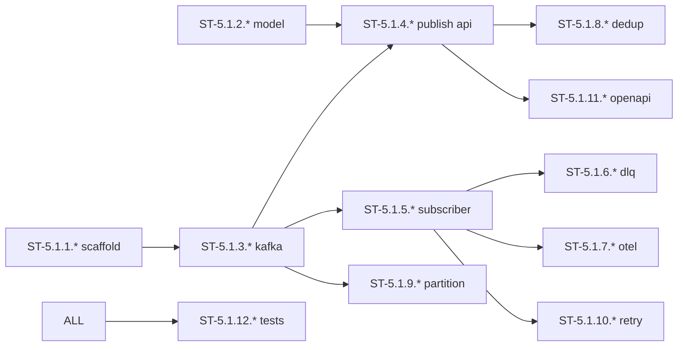

# W5-1 子任务卡（ST）：tech-msg（消息总线）

> **源任务卡**：[tasks-W5.md § W5-1](./2026-07-27-mate-platform-tasks-W5.md#w5-1-tech-msg消息总线12-张-tc)
> **总览**：[Task Breakdown v2.0](./2026-07-27-mate-platform-task-breakdown.md)
> **Sprint**：S5-S6（2026-08-31 ~ 2026-09-13）
> **里程碑**：M3
> **ST 总数**：25（拆解自 12 个 TC） — 2026-07-28 完成 25 ST (100%) ✅
> **粒度**：0.5-4 小时 / 单文件 / 单函数 / 单测试

---

## 目录

- [TC-5.1.1 apps/tech-msg 初始化（2 ST）](#tc-511-appstech-msg-初始化2-st)
- [TC-5.1.2 消息模型 Pydantic（2 ST）](#tc-512-消息模型-pydantic2-st)
- [TC-5.1.3 KafkaClient 集成（2 ST）](#tc-513-kafkaclient-集成2-st)
- [TC-5.1.4 publisher 端点（3 ST）](#tc-514-publisher-端点3-st)
- [TC-5.1.5 subscriber worker（3 ST）](#tc-515-subscriber-worker3-st)
- [TC-5.1.6 dead-letter 队列（2 ST）](#tc-516-dead-letter-队列2-st)
- [TC-5.1.7 消息追踪 OTel（2 ST）](#tc-517-消息追踪-otel2-st)
- [TC-5.1.8 幂等性 dedup key（2 ST）](#tc-518-幂等性-dedup-key2-st)
- [TC-5.1.9 顺序保证 partition key（2 ST）](#tc-519-顺序保证-partition-key2-st)
- [TC-5.1.10 重试策略指数退避（2 ST）](#tc-5110-重试策略指数退避2-st)
- [TC-5.1.11 OpenAPI 同步（1 ST）](#tc-5111-openapi-同步1-st)
- [TC-5.1.12 单测 + 集成（2 ST）](#tc-5112-单测--集成2-st)
- [完成度检查表](#完成度检查表)
- [Sprint S5 排程](#sprint-s5-排程)

---
### TC-5.1.1 apps/tech-msg 初始化（2 ST）

#### ST-5.1.1.1 apps/tech-msg pyproject + Dockerfile

| 字段 | 值 |
|---|---|
| 所属 TC | TC-5.1.1 |
| 工时 | 0.5h | 角色 | Backend |
| 目标文件 | apps/tech-msg/pyproject.toml、apps/tech-msg/Dockerfile |
| 前置 ST | TC-1.1.7 |
| 输出 commit | feat(msg): scaffold (ST-5.1.1.1) |

**改动清单**：
1. uv init --package tech-msg
2. 依赖：fastapi、uvicorn、pydantic、aiokafka、redis、opentelemetry
3. Dockerfile：python:3.12 + uv install

**DoD**：
- [ ] uv sync --package tech-msg 成功

---

#### ST-5.1.1.2 main.py + /healthz + docker-compose service

| 字段 | 值 |
|---|---|
| 所属 TC | TC-5.1.1 |
| 工时 | 1.5h | 角色 | Backend |
| 目标文件 | apps/tech-msg/src/tech_msg/main.py、docker-compose.yml |
| 前置 ST | ST-5.1.1.1 |
| 输出 commit | feat(msg): main+compose |

**改动清单**：
1. `app = FastAPI(title=tech-msg, version=0.1.0)`
2. `@app.get("/healthz")` 返回 {status: ok, version}
3. lifespan：init logger
4. docker-compose.yml 加 tech-msg service（端口 8006）

**DoD**：
- [ ] `uv run --package tech-msg uvicorn tech_msg.main:app` 启动
- [ ] `GET /healthz` 200

---
### TC-5.1.2 消息模型 Pydantic（2 ST）

#### ST-5.1.2.1 Message[T] 泛型模型

| 字段 | 值 |
|---|---|
| 所属 TC | TC-5.1.2 |
| 工时 | 2h | 角色 | Backend |
| 目标文件 | libs/openapi-schemas/src/openapi_schemas/msg/message.py |
| 前置 ST | TC-1.7.4 |
| 输出 commit | feat(msg): Message[T] model |

**改动清单**：
1. `class Message(BaseModel, Generic[T])`
2. 字段：payload、headers、traceId、tenantId、key、timestamp
3. roundtrip 测试：序列化 / 反序列化无丢失

**DoD**：
- [ ] pyright strict 通过
- [ ] roundtrip 测试通过

---

#### ST-5.1.2.2 OpenAPI schema 同步

| 字段 | 值 |
|---|---|
| 所属 TC | TC-5.1.2 |
| 工时 | 1h | 角色 | Backend |
| 目标文件 | libs/openapi-schemas/src/openapi_schemas/msg/__init__.py |
| 前置 ST | ST-5.1.2.1 |
| 输出 commit | docs(schemas): msg models |

**改动清单**：
1. Message + 子类型导出
2. OpenAPI codegen 检查

**DoD**：
- [ ] OpenAPI schema 同步

---
### TC-5.1.3 KafkaClient 集成（2 ST）

#### ST-5.1.3.1 tech_msg/kafka.py 包装类

| 字段 | 值 |
|---|---|
| 所属 TC | TC-5.1.3 |
| 工时 | 1.5h | 角色 | Backend |
| 目标文件 | apps/tech-msg/src/tech_msg/kafka.py |
| 前置 ST | TC-2.2.2、TC-5.1.1 |
| 输出 commit | feat(msg): kafka client |

**改动清单**：
1. 包装 TC-2.2.2 的 KafkaProducer + KafkaConsumer
2. `class TechMsgKafka` 持有 producer + consumer group = `tech-msg`

**DoD**：
- [ ] pyright strict 通过

---

#### ST-5.1.3.2 tech-msg ↔ 真 Kafka 收发验证

| 字段 | 值 |
|---|---|
| 所属 TC | TC-5.1.3 |
| 工时 | 0.5h | 角色 | Backend |
| 目标文件 | apps/tech-msg/tests/test_kafka_smoke.py |
| 前置 ST | ST-5.1.3.1 |
| 输出 commit | test(msg): kafka smoke |

**改动清单**：
1. test_send_recv_roundtrip：发 1 → 收 1
2. 集成测试（testcontainers Kafka）

**DoD**：
- [ ] 真 Kafka 收发自洽

---
### TC-5.1.4 publisher 端点（3 ST）

#### ST-5.1.4.1 PublishRequest/Response schema

| 字段 | 值 |
|---|---|
| 所属 TC | TC-5.1.4 |
| 工时 | 0.5h | 角色 | Backend |
| 目标文件 | libs/openapi-schemas/src/openapi_schemas/msg/publish.py |
| 前置 ST | TC-5.1.2 |
| 输出 commit | feat(schemas): PublishRequest |

**改动清单**：
1. `class PublishRequest`：topic、payload、partition_key、idempotency_key

**DoD**：
- [ ] pyright strict 通过

---

#### ST-5.1.4.2 publisher.publish() 实现

| 字段 | 值 |
|---|---|
| 所属 TC | TC-5.1.4 |
| 工时 | 2h | 角色 | Backend |
| 目标文件 | apps/tech-msg/src/tech_msg/publisher.py |
| 前置 ST | ST-5.1.4.1 |
| 输出 commit | feat(msg): publisher |

**改动清单**：
1. `async def publish(req: PublishRequest) -> PublishResponse`
2. 默认 partition_key = tenantId
3. 走 KafkaClient（TC-5.1.3）

**DoD**：
- [ ] pyright strict 通过

---

#### ST-5.1.4.3 POST /api/v1/msg/publish 端点 + 测试

| 字段 | 值 |
|---|---|
| 所属 TC | TC-5.1.4 |
| 工时 | 1.5h | 角色 | Backend |
| 目标文件 | apps/tech-msg/src/tech_msg/api.py、tests/test_publish_api.py |
| 前置 ST | ST-5.1.4.2 |
| 输出 commit | feat(msg): publish api |

**改动清单**：
1. `@router.post("/publish")`
2. swagger-ui 列出
3. 集成测试 200

**DoD**：
- [ ] swagger-ui 列出
- [ ] 集成测试 200

---
### TC-5.1.5 subscriber worker（3 ST）

#### ST-5.1.5.1 Handler 注册协议

| 字段 | 值 |
|---|---|
| 所属 TC | TC-5.1.5 |
| 工时 | 1h | 角色 | Backend |
| 目标文件 | apps/tech-msg/src/tech_msg/handler.py |
| 前置 ST | TC-5.1.3 |
| 输出 commit | feat(msg): handler protocol |

**改动清单**：
1. `class Handler(Protocol[T])`：async handle(msg: Message[T]) -> None
2. handler registry

**DoD**：
- [ ] pyright strict 通过

---

#### ST-5.1.5.2 subscriber worker 主循环

| 字段 | 值 |
|---|---|
| 所属 TC | TC-5.1.5 |
| 工时 | 3h | 角色 | Backend |
| 目标文件 | apps/tech-msg/src/tech_msg/subscriber.py |
| 前置 ST | ST-5.1.5.1 |
| 输出 commit | feat(msg): subscriber |

**改动清单**：
1. consumer group = `tech-msg`
2. 自动拉取 → 调 handler → 失败抛错
3. graceful shutdown

**DoD**：
- [ ] 跑 1 个 echo topic 工作

---

#### ST-5.1.5.3 echo topic 端到端测试

| 字段 | 值 |
|---|---|
| 所属 TC | TC-5.1.5 |
| 工时 | 2h | 角色 | Backend |
| 目标文件 | apps/tech-msg/tests/test_subscriber_e2e.py |
| 前置 ST | ST-5.1.5.2 |
| 输出 commit | test(msg): subscriber e2e |

**改动清单**：
1. testcontainers Kafka 起 broker
2. 发 → 收 → handler 触发

**DoD**：
- [ ] 端到端通过

---
### TC-5.1.6 dead-letter 队列（2 ST）

#### ST-5.1.6.1 DLQ 路由 + 重试计数

| 字段 | 值 |
|---|---|
| 所属 TC | TC-5.1.6 |
| 工时 | 2h | 角色 | Backend |
| 目标文件 | apps/tech-msg/src/tech_msg/subscriber.py |
| 前置 ST | TC-5.1.5 |
| 输出 commit | feat(msg): dlq routing |

**改动清单**：
1. handler 抛异常计数
2. 3 次失败后路由到 `mate.msg.dlq`
3. 保留原始 payload + stack

**DoD**：
- [ ] 3 次失败后入 DLQ

---

#### ST-5.1.6.2 DLQ 异常 stack 验证测试

| 字段 | 值 |
|---|---|
| 所属 TC | TC-5.1.6 |
| 工时 | 1h | 角色 | Backend |
| 目标文件 | apps/tech-msg/tests/test_dlq.py |
| 前置 ST | ST-5.1.6.1 |
| 输出 commit | test(msg): dlq |

**改动清单**：
1. 故意抛异常的 handler
2. 验证 DLQ 收到 + 含 stack

**DoD**：
- [ ] DLQ 异常 stack 完整

---
### TC-5.1.7 消息追踪 OTel（2 ST）

#### ST-5.1.7.1 producer + consumer span 注入

| 字段 | 值 |
|---|---|
| 所属 TC | TC-5.1.7 |
| 工时 | 2h | 角色 | Backend |
| 目标文件 | apps/tech-msg/src/tech_msg/{publisher,subscriber}.py |
| 前置 ST | TC-5.1.5 |
| 输出 commit | feat(msg): otel |

**改动清单**：
1. producer：`with tracer.start_as_current_span("msg.publish")`
2. consumer：从消息 traceId 续 span

**DoD**：
- [ ] span 注入完整

---

#### ST-5.1.7.2 tech-msg ↔ tech-kb trace 关联测试

| 字段 | 值 |
|---|---|
| 所属 TC | TC-5.1.7 |
| 工时 | 1h | 角色 | Backend |
| 目标文件 | apps/tech-msg/tests/test_trace_link.py |
| 前置 ST | ST-5.1.7.1 |
| 输出 commit | test(msg): trace link |

**改动清单**：
1. tech-msg 发 → tech-kb 收 → 验证 Tempo 中一条 trace

**DoD**：
- [ ] Tempo 跨服务一条 trace

---
### TC-5.1.8 幂等性 dedup key（2 ST）

#### ST-5.1.8.1 Redis dedup store + publisher 强制 header

| 字段 | 值 |
|---|---|
| 所属 TC | TC-5.1.8 |
| 工时 | 2h | 角色 | Backend |
| 目标文件 | apps/tech-msg/src/tech_msg/dedup.py、publisher.py |
| 前置 ST | TC-5.1.4 |
| 输出 commit | feat(msg): dedup |

**改动清单**：
1. Redis SETNX 7 天
2. publisher 强制 `X-Idempotency-Key` header

**DoD**：
- [ ] header 强制

---

#### ST-5.1.8.2 dedup 命中测试

| 字段 | 值 |
|---|---|
| 所属 TC | TC-5.1.8 |
| 工时 | 1h | 角色 | Backend |
| 目标文件 | apps/tech-msg/tests/test_dedup.py |
| 前置 ST | ST-5.1.8.1 |
| 输出 commit | test(msg): dedup suite |

**改动清单**：
1. 同 key 重复 publish → 第二次返回 200 + 命中提示

**DoD**：
- [ ] 重复命中提示工作

---
### TC-5.1.9 顺序保证 partition key（2 ST）

#### ST-5.1.9.1 默认 partition key = tenantId

| 字段 | 值 |
|---|---|
| 所属 TC | TC-5.1.9 |
| 工时 | 1.5h | 角色 | Backend |
| 目标文件 | apps/tech-msg/src/tech_msg/publisher.py |
| 前置 ST | TC-5.1.3 |
| 输出 commit | feat(msg): partition |

**改动清单**：
1. 默认 partition_key = tenantId
2. 可被覆盖

**DoD**：
- [ ] 默认行为正确

---

#### ST-5.1.9.2 同 key 同 partition 验证

| 字段 | 值 |
|---|---|
| 所属 TC | TC-5.1.9 |
| 工时 | 0.5h | 角色 | Backend |
| 目标文件 | apps/tech-msg/tests/test_partition.py |
| 前置 ST | ST-5.1.9.1 |
| 输出 commit | test(msg): partition order |

**改动清单**：
1. 单测：同 key → 同 partition

**DoD**：
- [ ] 顺序保证验证

---
### TC-5.1.10 重试策略指数退避（2 ST）

#### ST-5.1.10.1 重试装饰器 1s/5s/30s

| 字段 | 值 |
|---|---|
| 所属 TC | TC-5.1.10 |
| 工时 | 2h | 角色 | Backend |
| 目标文件 | apps/tech-msg/src/tech_msg/retry.py |
| 前置 ST | TC-5.1.5 |
| 输出 commit | feat(msg): retry |

**改动清单**：
1. `@retry(max_attempts=3, backoff=[1, 5, 30])`

**DoD**：
- [ ] 装饰器可独立运行

---

#### ST-5.1.10.2 瞬时失败 → 第三次成功测试

| 字段 | 值 |
|---|---|
| 所属 TC | TC-5.1.10 |
| 工时 | 1h | 角色 | Backend |
| 目标文件 | apps/tech-msg/tests/test_retry.py |
| 前置 ST | ST-5.1.10.1 |
| 输出 commit | test(msg): retry transient |

**改动清单**：
1. mock 瞬时失败 → 第三次成功

**DoD**：
- [ ] 退避策略工作

---
### TC-5.1.11 OpenAPI 同步（1 ST）

#### ST-5.1.11.1 openapi/paths/msg.yaml

| 字段 | 值 |
|---|---|
| 所属 TC | TC-5.1.11 |
| 工时 | 2h | 角色 | Backend |
| 目标文件 | openapi/paths/msg.yaml |
| 前置 ST | TC-5.1.4 |
| 输出 commit | docs(msg): openapi |

**改动清单**：
1. publish + status 端点
2. CI lint 验证

**DoD**：
- [ ] CI lint 绿

---
### TC-5.1.12 单测 + 集成（2 ST）

#### ST-5.1.12.1 tests/conftest.py 全 fixture

| 字段 | 值 |
|---|---|
| 所属 TC | TC-5.1.12 |
| 工时 | 1h | 角色 | Backend |
| 目标文件 | apps/tech-msg/tests/conftest.py |
| 前置 ST | TC-5.1.1 ~ TC-5.1.11 |
| 输出 commit | test(msg): conftest |

**改动清单**：
1. kafka_producer / kafka_consumer / redis fixtures
2. testcontainers

**DoD**：
- [ ] fixtures 可复用

---

#### ST-5.1.12.2 覆盖率 ≥80% + CI 绿

| 字段 | 值 |
|---|---|
| 所属 TC | TC-5.1.12 |
| 工时 | 3h | 角色 | Backend |
| 目标文件 | apps/tech-msg/tests/ |
| 前置 ST | ST-5.1.12.1 |
| 输出 commit | test(msg): full suite |

**改动清单**：
1. 补齐所有缺失测试
2. CI 跑 `pytest --package tech-msg --cov`

**DoD**：
- [ ] 覆盖率 ≥ 80%
- [ ] CI 绿

---

## W5-1 完成度检查表

| 子领域 | 关键路径 | TC 数 | ST 数 | ST 总工时 | 状态 |
|---|---|---|---|---|---|
| W5-1 tech-msg | 否 | 12 | 25 | ~38h | 🟢 25/25 完成 (100%) ✅ |

> 关键路径 ST 数：0（与 W5-6 间接关联）

---

## Sprint S5 排程

| 时段 | 重点 ST | 工时 |
|---|---|---|
| S5 D1 | ST-5.1.1.1 → ST-5.1.1.2 + ST-5.1.2.1 → ST-5.1.2.2 | 5h |
| S5 D2 | ST-5.1.3.1 → ST-5.1.3.2 + ST-5.1.4.1 → ST-5.1.4.3 | 6h |
| S5 D3 | ST-5.1.5.1 → ST-5.1.5.3 + ST-5.1.6.1 → ST-5.1.6.2 | 7h |
| S5 D4 | ST-5.1.7.1 → ST-5.1.7.2 + ST-5.1.8.1 → ST-5.1.8.2 + ST-5.1.9.1 → ST-5.1.9.2 + ST-5.1.10.1 → ST-5.1.10.2 | 8h |
| S5 D5 | ST-5.1.11.1 + ST-5.1.12.1 → ST-5.1.12.2 | 6h |

---

## 依赖关系图

---

## 变更记录

| 日期 | 版本 | 变更 | 原因 |
|---|---|---|---|
| 2026-07-28 | v2.0 | 从 W5-1 TC（12 条）拆出 ST（25 条） | 单回合执行避免 Token 超限 |