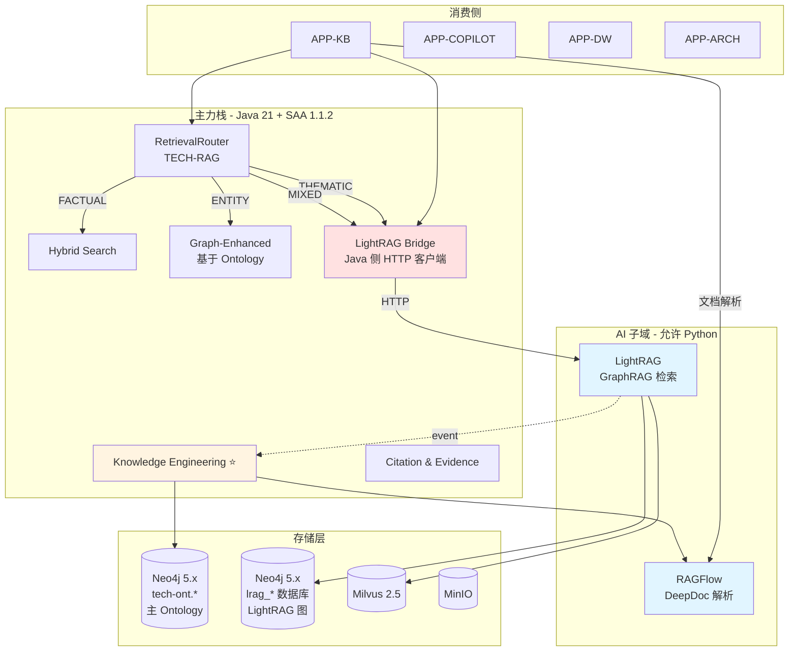

# SPEC - LightRAG 集成规范

> 版本：v1.0 | 日期：2026-07-27 | 状态：方案定稿（**待法务签字后启动实施**）
>
> **本规范基于 v2 技术栈决策**（`2026-07-27-v2-tech-stack-decision.md`），将 LightRAG 作为外部服务引入。
>
> **关联文档**：
> - v2 决策：`docs/superpowers/specs/2026-07-27-v2-tech-stack-decision.md`
> - A 方案（已更新引用）：`docs/superpowers/specs/2026-07-27-ragflow-graphrag-integration-a.md`
> - 法务审查：`docs/legal/LEGAL_CLEARANCE-ragflow-2026-07-27.md`（LightRAG 为 MIT，本规范不需 AGPL 法务审查，但需法务过 LightRAG MIT 条款备案）

---

## 0. 为什么选 LightRAG 而不是 Microsoft GraphRAG

| 维度 | Microsoft GraphRAG（官方） | **LightRAG（HKU）** |
|---|---|---|
| **形态** | Python 库/CLI（参考实现） | **Python 服务**（自带 FastAPI HTTP） |
| **生产可用** | ⚠️ README 明示 "research preview" | ✅ HKU 团队维护，生产级 |
| **内存问题** | 🔴 >100MB 图即崩 | 🟢 优化后百万节点级 |
| **检索模式** | Local + Global + DRIFT | **Local + Global + Hybrid + Mix**（更全） |
| **存储后端** | 仅 NetworkX/文件 | **NetworkX / Neo4j / PostgreSQL+AGE / Memgraph** |
| **增量更新** | 🟡 需手动重跑 | ✅ 内置 |
| **协议** | MIT | **MIT**（同等友好） |
| **社区活跃度** | 🟢 微软官方 | 🟢 HKU 团队，commit 频率高 |
| **与 LLM 集成** | OpenAI only | **多厂商**（OpenAI/Anthropic/DeepSeek/Ollama） |
| **可嵌入性** | 需自己包装 | ✅ 直接 `lightrag-server` 命令启动 |
| **文档质量** | 学术导向 | 工程导向 |

**结论**：LightRAG 在工程现实上**显著优于** Microsoft GraphRAG，**且**同为 MIT 协议（合规同样简单）。

---

## 1. LightRAG 技术栈（实际版本）

来源：[github.com/HKUDS/LightRAG](https://github.com/HKUDS/LightRAG)

| 类别 | 技术 | 版本 | 用途 |
|---|---|---|---|
| **核心语言** | Python | 3.10+ | 服务实现 |
| **Web 框架** | FastAPI | latest | HTTP API |
| **图算法** | NetworkX | 3.x | 默认图后端 |
| | python-igraph | 0.11+ | Leiden 算法（**LightRAG 用这个**） |
| | graspologic | - | 高级图分析 |
| **图存储**（可选） | Neo4j | 5.x | 生产级图后端 |
| | PostgreSQL + AGE | - | 替代方案 |
| | Memgraph | - | 替代方案 |
| **向量库** | NanoVectorDB（默认） / ChromaDB / Milvus / Qdrant | - | 实体/关系向量 |
| **LLM** | OpenAI / Anthropic / DeepSeek / Gemini / Ollama | - | **多厂商** |
| **Embedding** | 同上 | - | 实体向量化 |
| **包管理** | pip / uv / poetry | - | - |

**关键点**：LightRAG 默认**不需要外部图数据库**（用 NetworkX 内存图），但**生产环境强烈建议用 Neo4j**（你已经部署了）。

---

## 2. 整体架构

### 2.1 集成架构图



### 2.2 双 Neo4j 数据库的隔离原则

| 数据库 | 拥有方 | 用途 | Label 前缀 |
|---|---|---|---|
| `tech-ont` | TECH-ONT | 受治理的 Ontology | `tech-ont.*` |
| `lrag-graph` | **LightRAG** | 自动构建的 KG（按知识库隔离） | `lrag_*` |
| `rag-graphrag` | GraphRAG Java（未来） | 备用 | `rag_*` |

**严格隔离**：
- LightRAG **不**写 `tech-ont` 数据库
- TECH-ONT **不**写 `lrag-graph` 数据库
- 跨数据库引用通过业务 ID（`kbId` / `docId` / `chunkId`）桥接

### 2.3 LightRAG 在你的场景中的定位

| 场景 | LightRAG 角色 | 说明 |
|---|---|---|
| S1 知识库建立 | ❌ 不直接用 | 文档解析走 RAGFlow；LightRAG 消费解析后数据 |
| S2 Ontology 抽象 | ✅ **输入源** | LightRAG 自动抽实体/关系 → 发布事件 → KE 转 Candidate Fact |
| S3 知识问答 | ✅ **检索后端** | 主题型/跨文档问题走 LightRAG（Local/Global/Mix） |

**关键认知**：LightRAG 在你的架构里**既是"检索引擎"（S3），也是"知识抽取源"（S2）**。一鱼两吃。

---

## 3. 部署架构

### 3.1 Docker Compose（开发环境）

```yaml
# 集成到 metaplatform docker-compose.yml
services:
  lightrag:
    image: ${LIGHTRAG_IMAGE:-hkuds/lightrag:latest}
    container_name: mate-lightrag
    command: lightrag-server
    ports:
      - "9621:9621"  # LightRAG HTTP API
    volumes:
      - lightrag_data:/app/data
      - lightrag_workspace:/app/workspace
    environment:
      # LLM 配置（指向 TECH-LLMGW）
      LLM_BINDING: openai
      LLM_MODEL: ${LIGHTRAG_LLM_MODEL:-qwen-max}
      LLM_BINDING_HOST: ${TECH_LLMGW_URL:-http://tech-llmgw:8080/v1}
      LLM_BINDING_API_KEY: ${TECH_LLMGW_API_KEY}
      
      # Embedding 配置
      EMBEDDING_BINDING: openai
      EMBEDDING_MODEL: ${LIGHTRAG_EMBEDDING_MODEL:-text-embedding-v3}
      EMBEDDING_DIM: 1024
      EMBEDDING_BINDING_HOST: ${TECH_LLMGW_URL}
      EMBEDDING_BINDING_API_KEY: ${TECH_LLMGW_API_KEY}
      
      # 图存储（Neo4j）
      NEO4J_URI: ${NEO4J_URI:-bolt://neo4j:7687}
      NEO4J_USERNAME: ${NEO4J_USER}
      NEO4J_PASSWORD: ${NEO4J_PASSWORD}
      NEO4J_DATABASE: lrag-graph
      
      # 服务配置
      HOST: 0.0.0.0
      PORT: 9621
      WORKERS: 2
    networks:
      - mate-internal
    healthcheck:
      test: ["CMD", "curl", "-f", "http://localhost:9621/health"]
      interval: 30s
      timeout: 10s
      retries: 3
    deploy:
      resources:
        limits:
          cpus: '4'
          memory: 8G
```

### 3.2 K8s 部署（生产环境）

| 资源 | 配置 |
|---|---|
| Namespace | `mate-ai` |
| Deployment | `mate-lightrag` |
| 副本数 | 2（无状态，扩缩容友好） |
| 资源 requests | 2 CPU / 4Gi |
| 资源 limits | 4 CPU / 8Gi |
| Service | ClusterIP `mate-lightrag:9621` |
| ConfigMap | LLM/Embedding 配置 |
| Secret | API keys、Neo4j 密码 |
| PersistentVolume | 100Gi（workspace + data） |
| NetworkPolicy | 仅允许 `mate-tech-rag` namespace 访问 |
| HPA | CPU > 70% 自动扩容到 4 副本 |

### 3.3 与 RAGFlow / DeerFlow 的部署关系

| 组件 | Namespace | 端口 | 用途 | 协议 |
|---|---|---|---|---|
| RAGFlow | `mate-ai` | 9621（**注意端口冲突**）| DeepDoc 解析 | AGPL-3.0 |
| LightRAG | `mate-ai` | 9622（调整后）| GraphRAG 检索 | MIT |
| DeerFlow | `mate-deerflow` | 8001 | Agent Runtime | MIT |
| TECH-RAG | `mate-tech` | 8080 | 主力 Java | 自研 |

> ⚠️ **端口调整**：LightRAG 默认 9621，建议改 9622 避免与 RAGFlow 端口冲突

---

## 4. Java 侧桥接层

### 4.1 模块位置

```
com.metaplatform.rag.bridge.lightrag/
├── LightRagClient.java              # HTTP 客户端
├── LightRagProperties.java          # Nacos 配置
├── LightRagAutoConfiguration.java   # Spring Boot 自动装配
├── dto/
│   ├── InsertRequest.java
│   ├── InsertResponse.java
│   ├── QueryRequest.java
│   ├── QueryResponse.java
│   ├── QueryMode.java               # enum: LOCAL / GLOBAL / HYBRID / MIX
│   └── LightRagChunk.java
├── event/
│   ├── LightRagEntityExtractedEvent.java
│   └── LightRagCommunityBuiltEvent.java
└── exception/
    ├── LightRagUnavailableException.java
    └── LightRagQueryException.java
```

### 4.2 核心接口设计

```java
public interface LightRagClient {
    /**
     * 插入文档（触发 LightRAG 自动抽取实体/关系/构建社区）
     */
    InsertResponse insertDocument(InsertRequest request);
    
    /**
     * 查询（4 种模式）
     */
    QueryResponse query(QueryRequest request);
    
    /**
     * 增量更新文档
     */
    InsertResponse updateDocument(String docId, String content);
    
    /**
     * 删除文档
     */
    void deleteDocument(String docId);
    
    /**
     * 健康检查
     */
    HealthStatus health();
}
```

### 4.3 配置（Nacos）

```yaml
lightrag:
  base-url: http://mate-lightrag.mate-ai.svc.cluster.local:9622
  api-key: ${LIGHTRAG_API_KEY:-internal-token-2026}
  timeout-ms: 30000
  stream-timeout-ms: 60000
  
  llm:
    model: qwen-max
    max-tokens: 4000
    temperature: 0.0
  
  embedding:
    model: text-embedding-v3
    dim: 1024
  
  query:
    default-mode: HYBRID
    default-top-k: 10
    default-max-tokens: 6000
  
  feature-flag:
    enabled-by-tenant:
      tenant-001: true
      tenant-002: false
    enabled-by-kb:
      kb-finance-2024: true
      kb-contracts: true
  
  fallback:
    enabled: true
    fallback-mode: GRAPH_ENHANCED
```

### 4.4 降级策略

| 场景 | 降级路径 |
|---|---|
| LightRAG 完全不可用 | Graph-Enhanced（基于本地 Ontology） |
| LightRAG 查询超时 | 重试 1 次 → 降级到 Hybrid |
| LightRAG 索引未完成 | 返回 "INDEX_BUILDING" 状态，前端轮询 |
| LightRAG Neo4j 不可用 | 降级到 NetworkX 内存模式（仅限 dev） |

---

## 5. API 合约

### 5.1 TECH-RAG 侧统一接口

```http
POST /api/v1/rag/lightrag/documents
{
  "docId": "uuid",
  "kbId": "kb-finance-2024",
  "content": "原始文本（已 chunking）",
  "metadata": {
    "title": "Q3 2024 财报",
    "source": "公司公告",
    "pageRange": [1, 25]
  }
}
→ 202 Accepted
{
  "taskId": "uuid",
  "estimatedSeconds": 60
}
```

```http
POST /api/v1/rag/lightrag/query
{
  "query": "Q3 主要风险点是什么？",
  "kbIds": ["kb-finance-2024"],
  "mode": "GLOBAL",            // LOCAL | GLOBAL | HYBRID | MIX
  "topK": 10,
  "maxTokens": 6000,
  "includeCitations": true
}
→ 200 OK
{
  "answer": "...",
  "mode": "GLOBAL",
  "entities": [
    { "name": "Q3 2024", "type": "TIME_PERIOD", "relevance": 0.92 }
  ],
  "relations": [
    { "source": "公司", "target": "Q3 2024", "type": "REPORTS_ON" }
  ],
  "citations": [
    { "docId": "...", "chunkId": "...", "snippet": "...", "score": 0.87 }
  ],
  "traceId": "trace-xxx",
  "latencyMs": 3200
}
```

### 5.2 4 种查询模式说明

| 模式 | 适用问题 | 实现路径 |
|---|---|---|
| **LOCAL** | "X 是什么"、"X 的属性" | 实体聚焦 + 邻居扩展 |
| **GLOBAL** | "Q3 主要讲了什么"、"主题" | 社区摘要 + Map-Reduce |
| **HYBRID** ⭐ 推荐默认 | 大多数问题 | Local + Global 融合 |
| **MIX** | "对比 A 和 B" | 多次检索 + 融合 |

### 5.3 与 Router 的协作

```java
// RetrievalRouter 集成
public RetrievalResult route(QueryRequest req) {
    if (req.getMode() == Mode.AUTO) {
        Mode m = classify(req.getQuery());
        if (m == Mode.THEMATIC) {
            return lightRagClient.query(req.toLightRagQuery(Mode.GLOBAL));
        }
    }
    // ... 既有路由
}
```

---

## 6. 与 Knowledge Engineering 的协同 ⭐

### 6.1 数据流

```
Chunk（来自 RAGFlow 解析后）
        ↓
LightRAG 接收并自动抽取
        ↓
Neo4j lrag-graph：实体-关系图自动构建
        ↓
LightRag 社区检测（Leiden）
        ↓
社区摘要（LLLM Map-Reduce）
        ↓
   ┌────┴────┐
   │         │
   │  主题检索 │    ← 用户查询路径
   │         │
   └─────────┘
        │
        │  事件发布
        ▼
   ┌──────────────────────────────────┐
   │  LightRag → KE 事件              │
   │  Topic: rag.lightrag.entities.extracted.v1 │
   │  Payload: {                       │
   │    docId, kbId,                   │
   │    entities: [...],               │
   │    relations: [...],              │
   │    confidence: 0.85,              │
   │    sourceChunkIds: [...]          │
   │  }                                │
   └──────────────────────────────────┘
        │
        ▼
   Knowledge Engineering 模块
        │
        ├─ 1. 自动转 Candidate Fact
        ├─ 2. 置信度过滤（>0.8 直接入队，0.5-0.8 需人工审，<0.5 丢弃）
        ├─ 3. 人工审核
        └─ 4. 通过 TECH-ONT API 提交到主 Ontology
```

### 6.2 事件订阅（KE 侧）

```java
@KafkaListener(topics = "rag.lightrag.entities.extracted.v1")
public void onLightRagExtracted(LightRagEntityExtractedEvent event) {
    // 1. 转换 Candidate Fact
    List<CandidateFact> candidates = event.getEntities().stream()
        .filter(e -> e.getConfidence() >= 0.5)
        .map(this::toCandidate)
        .toList();
    
    // 2. 写入 KE 表
    candidateFactRepository.saveAll(candidates);
    
    // 3. 触发审核工作流（高置信度自动入队）
    if (candidates.stream().anyMatch(c -> c.getConfidence() >= 0.8)) {
        reviewWorkflowService.createBatchTask(candidates);
    }
}
```

### 6.3 关键设计点

| 设计 | 说明 |
|---|---|
| **LightRAG 不直接写 Ontology** | 一致性约束，KE 永远是中间人 |
| **置信度分层处理** | 高/中/低分别走不同审核路径 |
| **事件幂等** | 基于 `eventId` 去重，避免重复抽取 |
| **人工审核必走** | 任何 Ontology 变更必须经人确认 |

---

## 7. 数据模型（增量）

### 7.1 新增表（与 A 方案 `rag_bridge` 配合）

```sql
-- Schema: rag_bridge_lightrag
CREATE SCHEMA IF NOT EXISTS rag_bridge_lightrag;

-- LightRAG 调用日志
CREATE TABLE rag_bridge_lightrag.call_log (
    id                BIGSERIAL PRIMARY KEY,
    task_id           VARCHAR(64) NOT NULL,
    doc_id            VARCHAR(64),
    kb_id             VARCHAR(64),
    tenant_id         VARCHAR(64) NOT NULL,
    operation         VARCHAR(20) NOT NULL,    -- INSERT / QUERY / UPDATE / DELETE
    mode              VARCHAR(20),              -- LOCAL / GLOBAL / HYBRID / MIX
    request_payload   JSONB,
    response_payload  JSONB,
    status            VARCHAR(20) NOT NULL,
    latency_ms        INTEGER,
    token_count       INTEGER,
    error_message     TEXT,
    created_at        TIMESTAMPTZ DEFAULT now()
);
CREATE INDEX idx_lightrag_tenant ON rag_bridge_lightrag.call_log(tenant_id, created_at DESC);

-- 抽取事件桥接（LightRAG → KE 候选事实）
CREATE TABLE rag_bridge_lightrag.extraction_event (
    id                BIGSERIAL PRIMARY KEY,
    event_id          VARCHAR(64) NOT NULL UNIQUE,  -- 来自 Kafka
    tenant_id         VARCHAR(64) NOT NULL,
    kb_id             VARCHAR(64) NOT NULL,
    doc_id            VARCHAR(64) NOT NULL,
    entities          JSONB NOT NULL,               -- 抽取的实体
    relations         JSONB NOT NULL,               -- 抽取的关系
    processed_status  VARCHAR(20) NOT NULL DEFAULT 'PENDING',
    -- PENDING / CONVERTED_TO_CANDIDATE / DISCARDED
    candidate_ids     BIGINT[],                     -- 转换后的候选事实 ID
    created_at        TIMESTAMPTZ DEFAULT now(),
    processed_at      TIMESTAMPTZ
);
```

### 7.2 Neo4j 数据库（隔离）

```cypher
// LightRAG 使用的 Neo4j 数据库：lrag-graph
// 与 tech-ont 数据库严格隔离
// LightRAG 自己管理以下标签：
//   - Entity（节点）
//   - Relationship（边）
//   - Chunk（节点）
//   - Community（节点）

// 不允许跨数据库 JOIN
// 跨库引用通过业务 ID（docId / chunkId）在应用层处理
```

---

## 8. 实施路线图

### Phase 0：基础（与 RAGFlow 并行，1 周）

| 任务 | 负责 | 完成标志 |
|---|---|---|
| Neo4j 准备 `lrag-graph` 数据库 | DevOps | 数据库可连 |
| LightRAG 版本锁定（建议 v1.x latest） | 架构组 | 版本确定 |
| 端口分配（9622 避免与 RAGFlow 冲突） | 架构组 | 端口确定 |
| 鉴权方案确认 | 架构组 | 方案确定 |

### Phase 1：部署 + 桥接层（2 周）

| 任务 | 负责 | 工期 |
|---|---|---|
| LightRAG Docker Compose 集成 | DevOps | 0.5 周 |
| LightRAG K8s 部署 + HPA | DevOps | 1 周 |
| `LightRagClient` Java 客户端 | Java | 1 周 |
| `LightRagProperties` Nacos 配置 | Java | 0.5 周 |
| 健康检查 + 监控埋点（TECH-OBS） | Java | 0.5 周 |
| 单元测试（用 Testcontainers 起 LightRAG） | Java | 0.5 周 |

### Phase 2：检索集成（1.5 周）

| 任务 | 负责 | 工期 |
|---|---|---|
| 4 种查询模式 API 暴露 | Java | 0.5 周 |
| 与 Router 集成 | Java | 0.5 周 |
| Citation 链路对接 | Java | 0.5 周 |
| 集成测试（端到端） | QA | 持续 |

### Phase 3：KE 协同（2 周）

| 任务 | 负责 | 工期 |
|---|---|---|
| 事件订阅器（LightRAG → KE） | Java | 1 周 |
| Candidate Fact 转换逻辑 | Java | 0.5 周 |
| 置信度分层审核流程 | Java + 产品 | 0.5 周 |

### Phase 4：灰度 + 评估（持续）

| 任务 | 负责 |
|---|---|
| 灰度发布（按租户 → 按知识库） | Java + DevOps |
| 评估指标：Recall / 答案质量 / Token 成本 | 算法工程师 |
| 与 Microsoft GraphRAG / RAGFlow 对比基线 | 算法工程师 |
| 季度 v2 复盘 | 架构组 |

---

## 9. 风险与缓解

| ID | 风险 | 等级 | 缓解 |
|---|---|---|---|
| R1 | LightRAG 内存图扩展性问题 | 🟡 中 | 使用 Neo4j 后端（生产） |
| R2 | LightRAG 升级/破坏性变更 | 🟢 低 | 锁定版本 + 季度复盘 |
| R3 | LightRAG 与 TECH-ONT 数据不一致 | 🟡 中 | 双数据库隔离 + 业务 ID 桥接 |
| R4 | LightRAG 抽取噪声大 | 🟡 中 | 置信度过滤 + 人工审核 |
| R5 | LightRAG Token 成本高 | 🟡 中 | 摘要用便宜模型 + 限社区数 |
| R6 | LightRAG 社区不活跃 | 🟢 低 | HKU 团队主力项目，活跃度高 |
| R7 | 跨语言桥接层性能 | 🟢 低 | HTTP + 连接池 + 复用 |
| R8 | KE 事件丢失导致 Ontology 缺漏 | 🟡 中 | 至少一次投递 + 监控告警 + 定期全量重抽取 |

---

## 10. 评估指标

| 指标 | 现状基线 | Phase 2 目标 | Phase 4 目标 |
|---|---|---|---|
| S2 主题型 Recall@10 | TBD | +20% | +50% |
| S3 实体型 Recall@10 | TBD | +10% | +30% |
| LightRAG 索引速度（1MB 文档） | — | ≤ 60s | ≤ 30s |
| LightRAG 查询 P95 延迟 | — | ≤ 3s | ≤ 1.5s |
| Global Search Token 成本 | — | ≤ 7000/query | ≤ 5000/query |
| 抽取事件 → Candidate Fact 转化率 | — | ≥ 60% | ≥ 80% |
| Candidate Fact 通过率（人工） | — | ≥ 70% | ≥ 85% |

---

## 11. 法律合规

| 事项 | 状态 |
|---|---|
| LightRAG 协议 | **MIT**（极其友好） |
| 商业使用 | ✅ 允许 |
| 修改 | ✅ 允许 |
| 分发 | ✅ 允许（保留版权声明） |
| 法务审查 | **简单备案**（不需要 AGPL 那种深度审查） |

**法务需确认**：
- [ ] LightRAG MIT 协议文本归档
- [ ] 在产品致谢中保留 LightRAG 版权声明
- [ ] 不修改 LightRAG 源码（修改需保留 MIT 声明）

---

## 12. 与 A 方案的关系

| 维度 | A 方案（已更新） | 本规范 |
|---|---|---|
| Microsoft GraphRAG | ❌ 不再使用 | 替换为 **LightRAG** |
| RAGFlow | ✅ DeepDoc 解析 | ✅ 保留 |
| TECH-RAG Router | ✅ 4 种模式 | ✅ 扩展 LightRAG 4 种模式 |
| KE 流水线 | ✅ Ontology 抽象 | ✅ **LightRAG 抽取作为输入源** |
| 法务审查 | 🟡 AGPL（RAGFlow） | 🟢 MIT（LightRAG）+ 🟡 AGPL（RAGFlow） |

---

## 13. 决策记录

| 字段 | 值 |
|---|---|
| 方案名称 | LightRAG 集成规范 |
| 决策日期 | 2026-07-27 |
| 决策人 | 项目 Owner |
| 上层规范 | `2026-07-27-v2-tech-stack-decision.md` + `2026-07-27-ragflow-graphrag-integration-a.md` |
| 法务文件 | `docs/legal/LEGAL_CLEARANCE-ragflow-2026-07-27.md`（LightRAG 备案需新增） |
| 实施启动 | 法务备案后即可 |

---

## 14. 实施 Checklist（你/团队待办）

### 🔴 阻塞项
- [ ] **法务过 AGPL**（RAGFlow 部分必须先）
- [ ] **法务过 LightRAG MIT 备案**（简单，可与 AGPL 并行）
- [ ] 联系 RAGFlow 商业方案（如果决定用）

### 🟢 并行可启动（不阻塞法务）
- [ ] 准备 Neo4j `lrag-graph` 数据库
- [ ] Docker Compose 集成测试
- [ ] Java 团队熟悉 LightRAG API
- [ ] 评估 HKU LightRAG 文档

### 🚦 法务签字后启动
- [ ] K8s 部署
- [ ] Java 桥接层实现
- [ ] KE 协同实现
- [ ] 灰度发布

---

**回我以下任一**：
- **「T 实施」** → 法务回来后立刻出 Phase 1 详细计划
- **「R 调研」** → 我深入 LightRAG 仓库，验证关键 API
- **「U 更新 A 方案」** → 把 A 方案里 Microsoft GraphRAG 部分替换为本规范引用
- **「S 暂停」** → 等法务 + 你消化完今天 4 份文档