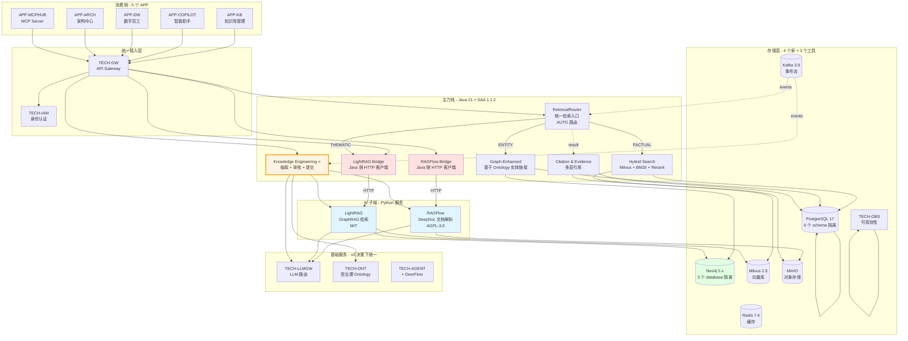
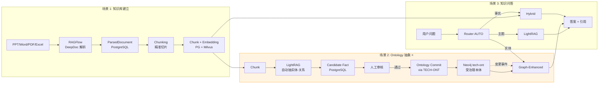

# Mate Platform RAG 主架构（The One Doc）

> 版本：v2.0 | 日期：2026-07-27 | 模块：TECH-RAG + 协同模块 | 状态：**正式版**
>
> **本架构文档是 Mate Platform RAG 能力的唯一参考**。
> 它整合了 v2 技术栈决策 + RAGFlow 集成 + LightRAG 集成 + Knowledge Engineering 流水线 + 全部最新决策。
>
> **本架构取代以下历史文档**（保留供决策追溯）：
> - `2026-07-27-rag-graphrag-best-solution.md`（v1 方案）
> - `2026-07-27-platform-rag-technical-architecture.md`（v1 全 Java 架构，已废止）
> - `2026-07-27-ragflow-graphrag-integration-a.md`（A 方案，整体方向）
> - `2026-07-27-lightrag-integration.md`（LightRAG 具体实施）

---

## 0. TL;DR

| 维度 | 决策 |
|---|---|
| **技术栈基线** | Java 21 + Spring AI Alibaba 1.1.2 主力 + AI 子域允许 Python（v2 决策） |
| **核心场景** | S1 知识库建立（PPT/Word/PDF 解析）/ S2 Ontology 抽象（KE 流水线）/ S3 知识问答 |
| **核心引擎** | **RAGFlow**（文档解析，Python）+ **LightRAG**（GraphRAG 检索，Python）+ **自研**（Hybrid / Graph-Enhanced / Router / Citation / KE） |
| **差异化** | Knowledge Engineering 流水线（AI 抽 Ontology + 人工审核）——护城河 |
| **数据落点** | 4 个家：PostgreSQL 17 / Neo4j 5.x / Milvus 2.5 / MinIO + 3 个工具：Redis 7.4 / Kafka 3.9 / TECH-OBS |
| **合规** | RAGFlow AGPL-3.0 自评估 + LightRAG MIT 备案 + 应急方案（Java 重写） |
| **工期** | MVP 6 周（基础 + RAGFlow + LightRAG 并行），完整 12 周 |
| **投入** | 1 Java + 1 Python/DevOps + AI 协作 |

---

## 1. 决策基础

### 1.1 v2 技术栈决策（2026-07-27 通过）

| 维度 | v1.2（已废止） | **v2（当前）** |
|---|---|---|
| 主力栈 | 全量 Java + SAA | **Java 21 + SAA 1.1.2**（不变） |
| Python 允许 | ❌ 禁止 | ✅ **AI 子域允许**（Agent Runtime / 复杂 RAG / 特定工具） |
| 决策公理 | 个人能力上限 | **AI 作为技术专家**（团队 + AI + 自评估三重判断） |
| 运维约束 | "少一套栈" | "**可观测性到位即可**"（不分语言） |

详见：`docs/superpowers/specs/2026-07-27-v2-tech-stack-decision.md`

### 1.2 业务场景（核心三大场景）

| 场景 | 描述 | 当前能力 | 增强后能力 |
|---|---|---|---|
| **S1 知识库建立** | PPT/Word/PDF/Excel 精准切片 | 🟠 Tika 基础 | ✅ RAGFlow DeepDoc + 结构化解析 |
| **S2 Ontology 抽象** | AI 抽实体-关系-优化本体 | ❌ 缺 | ✅ **KE 流水线**（护城河） |
| **S3 知识问答** | 跨主题、跨文档智能问答 | ✅ Hybrid + Graph-Enhanced | ✅ + LightRAG 主题检索 |

### 1.3 设计原则（7 条铁律）

| # | 原则 | 说明 |
|---|---|---|
| P1 | **主力栈优先** | 新项目默认 Java + SAA |
| P2 | **AI 子域例外** | Agent Runtime、复杂 RAG、OCR/版面允许 Python |
| P3 | **核心业务后端禁 Python** | 交易、订单、权限、计费必须 Java |
| P4 | **法务合规是硬约束** | 任何新开源组件必须过自评估（不**分**语言） |
| P5 | **可观测性高于语言统一** | 跨语言栈必须统一接入 TECH-OBS |
| P6 | **AI 协作是新能力维度** | 团队需**主动**与 AI 协作（review、调试、跨语言翻译） |
| P7 | **季度复盘 + 决策可逆** | 每季度复盘多语言栈成本，可回退 |

---

## 2. 整体架构

### 2.1 系统总览



### 2.2 数据流（3 场景流水线）



### 2.3 跨语言服务集成（v2 决策下统一）

| 维度 | Java 主力 | Python AI 子域 | 统一约束 |
|---|---|---|---|
| LLM 调用 | 走 `TECH-LLMGW` | 走 `TECH-LLMGW`（OpenAI 协议） | ✅ 一致 |
| 身份认证 | 走 `TECH-IAM`（OAuth2） | 走 `TECH-IAM` | ✅ 一致 |
| 事件流 | 走 `TECH-MSG`（Kafka） | 走 `TECH-MSG` | ✅ 一致 |
| 可观测性 | 接入 `TECH-OBS` | 接入 `TECH-OBS` | ✅ 一致 |
| 配置 | `Nacos 3.0+` | `Nacos 3.0+` | ✅ 一致 |
| 服务发现 | `Nacos 3.0+` | `Nacos 3.0+` | ✅ 一致 |

**关键认知**：**RAGFlow 和 LightRAG 不在 v2 公理的"特权"——它们必须和其他服务一样接入平台基础设施**。

---

## 3. 模块详细设计

### 3.1 模块 A：RAGFlow Bridge（文档解析）

**Maven 坐标**：`com.metaplatform:tech-rag-ragflow-bridge:1.x.0`
**协议合规**：AGPL-3.0 自评估通过

**职责**：
- 接收文档上传请求
- 调用 RAGFlow HTTP API 解析
- 解析后结构化输出（ParsedDocument）
- 触发下游 chunking + embedding

**核心类**：
```
com.metaplatform.rag.bridge.ragflow/
├── RagFlowClient.java              # HTTP 客户端
├── RagFlowProperties.java
├── RagFlowAutoConfiguration.java
├── dto/{ParseRequest, ParseResponse, ParseTaskStatus, ParsedDocumentDto}
└── exception/{RagFlowUnavailableException, RagFlowParseException}
```

**降级策略**：
| 场景 | 降级 |
|---|---|
| RAGFlow 不可用 | Tika 基础解析（已有） |
| 部分能力不可用 | 部分解析 + 标记 |
| 响应超时 | 重试 1 次 → 标记 partial |

详见：`docs/superpowers/specs/2026-07-27-ragflow-graphrag-integration-a.md` §4

### 3.2 模块 B：LightRAG Bridge（GraphRAG 检索）

**Maven 坐标**：`com.metaplatform:tech-rag-lightrag-bridge:1.x.0`
**协议合规**：MIT（极简，仅保留 LICENSE）

**职责**：
- 调用 LightRAG 4 种查询模式（LOCAL/GLOBAL/HYBRID/MIX）
- 订阅 LightRAG 实体抽取事件
- 转换 Candidate Fact → 喂给 KE 流水线

**核心类**：
```
com.metaplatform.rag.bridge.lightrag/
├── LightRagClient.java
├── LightRagProperties.java
├── LightRagAutoConfiguration.java
├── dto/{InsertRequest, InsertResponse, QueryRequest, QueryResponse, QueryMode}
├── event/{LightRagEntityExtractedEvent, LightRagCommunityBuiltEvent}
└── exception/{LightRagUnavailableException, LightRagQueryException}
```

**4 种查询模式**：

| 模式 | 适用问题 | 实现 |
|---|---|---|
| LOCAL | "X 是什么" | 实体聚焦 + 邻居扩展 |
| GLOBAL | "Q3 主要讲了什么" | 社区摘要 + Map-Reduce |
| HYBRID ⭐ 默认 | 大多数问题 | Local + Global 融合 |
| MIX | "对比 A 和 B" | 多次检索 + 融合 |

详见：`docs/superpowers/specs/2026-07-27-lightrag-integration.md`

### 3.3 模块 C：Knowledge Engineering ⭐（护城河）

**Maven 坐标**：`com.metaplatform:tech-rag-knowledge-eng:1.x.0`

**职责**：
- 接收 LightRAG 抽取事件
- 转换 Candidate Fact（按置信度分层）
- 人工审核工作流
- 调用 TECH-ONT API 提交到 Ontology

**关键设计**：
- 置信度 ≥ 0.8 → 自动入队高优先级审核
- 置信度 0.5-0.8 → 入队常规审核
- 置信度 < 0.5 → 丢弃

**核心类**：
```
com.metaplatform.rag.knowledgeeng/
├── KnowledgeEngineeringService.java
├── extraction/{EntityExtractor, RelationExtractor, ExtractionPipeline}
├── candidate/{CandidateFact, CandidateFactService, CandidateStatus}
├── review/{ReviewTaskService, ReviewWorkflow, ReviewerAssignment}
├── ontology/{OntologyCommitService, OntologyCommitClient}
└── prompt/{PromptTemplateService, PromptVersion, PromptExperiment}
```

### 3.4 模块 D：Hybrid & Graph-Enhanced（既有能力）

**Maven 坐标**：`com.metaplatform:tech-rag-retrieval:1.x.0`（既有）
**状态**：✅ 已有，本架构中**保持不变**，仅增强

**职责**：
- Hybrid Retrieve（向量 + BM25 + Rerank）
- Graph-Enhanced（基于 Ontology 实体链接）
- Multi-KB 检索

**与新模块的协同**：
- 订阅 `rag.ke.ontology.committed` 事件 → 本地缓存失效
- 订阅 `rag.parser.document.parsed` 事件 → 触发向量索引重建

### 3.5 模块 E：Citation & Evidence

**Maven 坐标**：`com.metaplatform:tech-rag-citation:1.x.0`（强化）
**状态**：✅ 已有，强化为多层 Evidence

### 3.6 模块 F：RetrievalRouter（统一入口）

**Maven 坐标**：`com.metaplatform:tech-rag-router:1.x.0`（新建）

**路由策略**：
```java
public RetrievalResult route(QueryRequest req) {
    Mode mode = req.getMode() == Mode.AUTO
        ? classify(req.getQuery())      // cheap LLM call
        : req.getMode();
    return switch (mode) {
        case FACTUAL  -> hybridSearch(req);
        case ENTITY   -> graphEnhancedSearch(req);
        case THEMATIC -> lightRagClient.query(req.toLightRagQuery(Mode.GLOBAL));
        case DRIFT    -> lightRagClient.query(req.toLightRagQuery(Mode.HYBRID));
        case MIXED    -> rrf(hybridSearch(req), graphEnhanced(req), lightRagGlobal(req));
    };
}
```

---

## 4. 数据架构（4 个家 + 3 个工具）

### 4.1 数据归属总表

| 数据 | 存储 | Schema/Collection/Database | 拥有模块 |
|---|---|---|---|
| 原始文件 | MinIO | `kb-{tenantId}/{kbId}/raw/{docId}.{ext}` | RAGFlow Bridge |
| ParsedDocument | PostgreSQL | `rag_parser.*` | RAGFlow Bridge |
| Chunk | PostgreSQL | `rag.*` (既有) | Retrieval |
| Chunk Embedding | Milvus | `rag_chunk_vec` | Retrieval |
| LightRAG 实体/关系/社区 | Neo4j | **lrag-graph database** | LightRAG Bridge |
| LightRAG 摘要 | PostgreSQL | `rag_lightrag.*` | LightRAG Bridge |
| Community Summary | PostgreSQL | `rag_lightrag.community_summary` | LightRAG Bridge |
| Candidate Fact | PostgreSQL | `rag_ke.*` | KE |
| Review Task | PostgreSQL | `rag_ke.*` | KE |
| Prompt Template | PostgreSQL | `rag_ke.*` | KE |
| **Ontology Concept/Relation** | Neo4j | **tech-ont database** | **TECH-ONT**（受治理） |
| Citation | PostgreSQL | `rag_citation.*` | Citation |
| Query Log | PostgreSQL | `rag_router.*` | Router |
| LightRAG 调用日志 | PostgreSQL | `rag_bridge_lightrag.*` | LightRAG Bridge |
| RAGFlow 调用日志 | PostgreSQL | `rag_bridge_ragflow.*` | RAGFlow Bridge |
| 缓存 | Redis | `rag:*` | 各模块 |
| 事件 | Kafka | `rag.*.v1` | 各模块 |
| 可观测性 | TECH-OBS | - | 全模块 |

### 4.2 关键隔离策略

**Neo4j 三库隔离**（生产必选）：

| Database | 拥有方 | Label 前缀 | 写入方 |
|---|---|---|---|
| `tech-ont` | TECH-ONT | `tech-ont.*` | TECH-ONT |
| `lrag-graph` | LightRAG | LightRAG 默认 Label | LightRAG |
| `rag-graphrag` | GraphRAG Java（备用） | `rag_*` | 自研（未来） |

**PostgreSQL 多 schema 隔离**：

| Schema | 拥有模块 | 跨 schema FK |
|---|---|---|
| `rag` | Retrieval（既有） | ❌ |
| `rag_parser` | RAGFlow Bridge | ❌ |
| `rag_ke` | Knowledge Engineering | ❌ |
| `rag_lightrag` | LightRAG Bridge | ❌ |
| `rag_citation` | Citation | ❌ |
| `rag_router` | Router | ❌ |
| `rag_bridge_ragflow` | RAGFlow Bridge | ❌ |
| `rag_bridge_lightrag` | LightRAG Bridge | ❌ |

**核心规则**：
- 跨模块**不直查**、**不直写**——通过事件 + 业务 ID
- 共享 ID 而非共享数据
- 数据冗余只发生在事件 payload（仅关键 ID，不复制大字段）

### 4.3 跨模块引用业务键

| 业务键 | 含义 | 跨模块使用 |
|---|---|---|
| `tenantId` | 租户 ID | 全部事件 |
| `kbId` | 知识库 ID | 跨模块检索 |
| `docId` | 文档 ID | RAGFlow / KE / Retrieval |
| `chunkId` | Chunk ID | Retrieval / LightRAG |
| `ontologyId` | Ontology 概念 ID | KE / GE / Router |
| `eventId` | 事件 ID | 消费幂等 |

---

## 5. API 设计

### 5.1 顶层 API 列表

| 模块 | API 前缀 | 方法 | 说明 |
|---|---|---|---|
| **RAGFlow Bridge** | `/api/v1/rag/parser/*` | POST/GET | 文档解析 |
| **LightRAG Bridge** | `/api/v1/rag/lightrag/*` | POST/GET | GraphRAG 检索 |
| **KE** | `/api/v1/rag/ke/*` | POST/GET | 抽取/审核/提交 |
| **Retrieval** | `/api/v1/rag/retrieve/*` | POST | Hybrid/Graph-Enhanced |
| **Citation** | `/api/v1/rag/citation/*` | POST/GET | 引用管理 |
| **Router** | `/api/v1/rag/retrieve` | POST | 统一入口（带 mode） |
| **KB 管理** | `/api/v1/rag/knowledge/*` | POST/GET | 知识库 CRUD |
| **文档管理** | `/api/v1/rag/documents/*` | POST/GET | 文档 CRUD |

### 5.2 统一检索 API（AUTO 模式）

```http
POST /api/v1/rag/retrieve
Authorization: Bearer {token}
Content-Type: application/json

{
  "query": "Q3 2024 财报里主要的风险点是什么？",
  "kbIds": ["kb-finance-2024"],
  "mode": "AUTO",                       // AUTO | FACTUAL | ENTITY | THEMATIC | DRIFT | MIXED
  "topK": 10,
  "includeGraphContext": true,
  "includeCitations": true
}

→ 200 OK
{
  "answer": "...",
  "mode": "THEMATIC",                   // AUTO 路由后实际选择
  "results": [
    { "chunkId": "...", "content": "...", "score": 0.87 }
  ],
  "evidences": [
    { "claim": "...", "citations": [...] }
  ],
  "traceId": "trace-xxx",
  "latencyMs": 1820,
  "tokenCount": 4500
}
```

### 5.3 RAGFlow Bridge API

```http
POST /api/v1/rag/parser/documents/{docId}/parse
{
  "parser": "RAGFLOW" | "DEEP" | "BASIC",
  "options": { "ocrEnabled": true, "tableExtraction": true, "language": "zh-CN" }
}
→ 202 Accepted { "taskId": "uuid", "status": "PENDING" }

GET /api/v1/rag/parser/tasks/{taskId}
→ 200 OK { "status": "DONE", "parserUsed": "RAGFLOW", "latencyMs": 3200 }
```

### 5.4 LightRAG Bridge API

```http
POST /api/v1/rag/lightrag/query
{
  "query": "Q3 主要风险点是什么？",
  "kbIds": ["kb-finance-2024"],
  "mode": "GLOBAL",                     // LOCAL | GLOBAL | HYBRID | MIX
  "topK": 10,
  "maxTokens": 6000,
  "includeCitations": true
}
→ 200 OK
{
  "answer": "...",
  "mode": "GLOBAL",
  "entities": [...],
  "relations": [...],
  "citations": [...],
  "traceId": "trace-xxx",
  "latencyMs": 3200
}
```

### 5.5 KE API

```http
POST /api/v1/rag/ke/extraction-tasks
GET  /api/v1/rag/ke/candidates?status=PENDING
POST /api/v1/rag/ke/candidates/{id}/approve
POST /api/v1/rag/ke/candidates/{id}/reject
POST /api/v1/rag/ke/candidates/batch-approve
POST /api/v1/rag/ke/candidates/{id}/commit
GET  /api/v1/rag/ke/review-tasks?assignee=me
POST /api/v1/rag/ke/prompts
```

---

## 6. 事件协议

### 6.1 Kafka 主题清单

| 主题 | 发布方 | 订阅方 | 用途 |
|---|---|---|---|
| `rag.parser.document.parsed.v1` | RAGFlow Bridge | KE / Retrieval | 文档解析完成 |
| `rag.parser.document.parse-failed.v1` | RAGFlow Bridge | KE | 解析失败 |
| `rag.lightrag.entity.extracted.v1` | LightRAG Bridge | **KE** | **关键**：实体抽取 → 喂给 KE |
| `rag.lightrag.community.built.v1` | LightRAG Bridge | Router | 社区构建完成 |
| `rag.ke.candidate.created.v1` | KE | UI | 候选事实待审核 |
| `rag.ke.ontology.committed.v1` | KE | Retrieval / GraphRAG / Router | **关键**：Ontology 变更 |
| `rag.ke.prompt.activated.v1` | KE | Retrieval | Prompt 切换 |
| `rag.retrieval.index.rebuilt.v1` | Retrieval | Router | 索引重建 |
| `rag.router.query.completed.v1` | Router | OBS | 检索完成（监控用） |

### 6.2 事件 Schema 规范

```json
{
  "eventId": "uuid",
  "eventType": "PascalCase",
  "version": "1.0",
  "occurredAt": "ISO-8601",
  "tenantId": "...",
  "sourceModule": "tech-rag-lightrag-bridge | ...",
  "payload": { ... }
}
```

### 6.3 消费约定

- 至少一次（at-least-once）投递
- 消费者幂等（基于 `eventId`）
- 失败重试 3 次后入死信队列

---

## 7. 部署架构

### 7.1 部署单元（K8s）

| 部署单元 | 包含模块 | 副本数 | 资源 |
|---|---|---|---|
| `tech-rag-core` | Router + Retrieval + Citation | 2 | 2C/4G |
| `tech-rag-ragflow-bridge` | RAGFlow Bridge | 2 | 2C/4G |
| `tech-rag-lightrag-bridge` | LightRAG Bridge | 2 | 2C/4G |
| `tech-rag-knowledge-eng` | KE | 2 | 2C/4G |
| `mate-ragflow` | RAGFlow（外部） | 2 | 4C/8G |
| `mate-lightrag` | LightRAG（外部） | 2 | 4C/8G |

### 7.2 命名空间布局

| Namespace | 包含服务 |
|---|---|
| `mate-tech` | TECH-RAG 全套 Java 服务 |
| `mate-ai` | RAGFlow、LightRAG |
| `mate-deerflow` | DeerFlow（既有） |
| `mate-deerflow` | （共用，跨 namespace 通过 Nacos） |

### 7.3 端口分配

| 服务 | 端口 | 协议 |
|---|---|---|
| TECH-RAG | 8080 | HTTP |
| RAGFlow | 9621 | HTTP |
| **LightRAG** | **9622**（避免与 RAGFlow 冲突） | HTTP |
| DeerFlow Gateway | 8001 | HTTP（ClusterIP） |
| TECH-LLMGW | 8081 | HTTP（OpenAI 兼容） |

### 7.4 中间件依赖

| 中间件 | 版本 | 用途 | Schema/DB |
|---|---|---|---|
| PostgreSQL | 17 | 主库 | 8 个 schema 隔离 |
| Neo4j | 5.x | Ontology + LightRAG | 3 个 database 隔离 |
| Milvus | 2.5 | 向量库 | 多 collection |
| MinIO | - | 对象存储 | - |
| Redis | 7.4 | 缓存 | - |
| Kafka | 3.9 | 事件流 | - |
| Nacos | 3.0+ | 服务发现/配置/注册 | - |
| TECH-LLMGW | - | LLM 路由 | - |
| TECH-ONT | - | Ontology 服务 | - |
| TECH-IAM | - | 身份认证 | - |
| TECH-OBS | - | 可观测性 | - |

### 7.5 关键 Nacos 配置示例

```yaml
# tech-rag-ragflow-bridge.yaml
ragflow:
  base-url: http://mate-ragflow.mate-ai.svc.cluster.local:9621
  api-key: ${RAGFLOW_API_KEY}
  timeout-ms: 30000
  feature-flag:
    enabled-by-tenant:
      tenant-001: true
  fallback:
    enabled: true
    fallback-parser: TIKA_BASIC

# tech-rag-lightrag-bridge.yaml
lightrag:
  base-url: http://mate-lightrag.mate-ai.svc.cluster.local:9622
  api-key: ${LIGHTRAG_API_KEY:-internal-token-2026}
  llm:
    model: qwen-max
    max-tokens: 4000
  query:
    default-mode: HYBRID
  feature-flag:
    enabled-by-kb:
      kb-finance-2024: true
  fallback:
    enabled: true
    fallback-mode: GRAPH_ENHANCED
```

---

## 8. 演进路线图（独立发版）

### 8.1 阶段路线

| 阶段 | 模块 | 内容 | 工期 | 关键里程碑 |
|---|---|---|---|---|
| **P0** | - | 自评估法务 + 基础准备 | 1 周 | 法务签字 + Neo4j lrag-graph 准备 |
| **P1-A** | RAGFlow Bridge | 部署 + 桥接层 | 2 周 | 第一个文档解析走 RAGFlow |
| **P1-B** | LightRAG Bridge | 部署 + 桥接层 | 2 周 | 第一次主题查询走 LightRAG |
| **P2-A** | KE 流水线 | 抽取 + 审核 + 提交 | 2 周 | 第一个 Candidate → Ontology |
| **P2-B** | Retrieval Router | AUTO 路由 | 1.5 周 | 统一入口上线 |
| **P3** | 评估 + 调优 | Recall / Token / 延迟 | 持续 | 全场景验证 |
| **P4** | 灰度 + 生产化 | 租户灰度 | 2 周 | 正式生产 |

**总工期**：约 10-12 周（其中 P1-A / P1-B / P2-A 可并行）

### 8.2 独立发版原则

- 每个 Maven 模块可独立打 jar
- 每个模块可独立 K8s 部署
- 跨模块不绑版本
- DB 变更用 Flyway 向前兼容

### 8.3 灰度策略

| 维度 | 灰度方式 |
|---|---|
| 按租户 | Feature Flag 开关 |
| 按知识库 | Feature Flag 开关 |
| 按模块 | 独立灰度 |

---

## 9. 风险与缓解

| ID | 风险 | 等级 | 缓解 |
|---|---|---|---|
| R1 | RAGFlow AGPL-3.0 商业化合规 | 🟡 中 | 自评估 + 应急方案（Java 重写 6-8 周） |
| R2 | RAGFlow/LightRAG 服务不可用 | 🟡 中 | 降级到自研（Tika / Graph-Enhanced） |
| R3 | LightRAG 抽取噪声大 | 🟡 中 | 置信度过滤 + 人工审核 |
| R4 | 跨语言调试困难 | 🟡 中 | v2 决策：AI 协作解决 |
| R5 | LLM Token 成本爆炸 | 🟡 中 | 摘要用 qwen-turbo + 限社区数 + 缓存 |
| R6 | 模块独立发版数据不一致 | 🟡 中 | 事件 schema 严格版本化 + 兼容期 |
| R7 | Neo4j 多库管理复杂 | 🟢 低 | 文档 + 监控 |
| R8 | KE 事件丢失 | 🟡 中 | 至少一次 + 监控告警 + 定期全量重抽 |
| R9 | 商业化时协议问题 | 🟡 中 | 商业化前重新评估 + 应急方案 |
| R10 | v2 决策季度复盘结论为"回退" | 🟢 低 | v1.3 退路已设计 |

---

## 10. KPI

### 10.1 质量

| 场景 | 指标 | P1 目标 | P4 目标 |
|---|---|---|---|
| S1 知识库建立 | 表格抽取 F1 | ≥ 0.85 | ≥ 0.92 |
| S1 | 阅读顺序准确率 | ≥ 0.80 | ≥ 0.90 |
| S2 Ontology 抽取 | 实体抽取 F1 | ≥ 0.75 | ≥ 0.85 |
| S2 | 关系抽取 F1 | ≥ 0.65 | ≥ 0.80 |
| S3 知识问答 | 事实型 Recall@10 | 不 regression | 不 regression |
| S3 | 主题型 Recall@10 | +20% | +50% |

### 10.2 性能（P95 延迟）

| 模块 | 目标 |
|---|---|
| RAGFlow 解析（1MB PDF） | ≤ 3s |
| LightRAG 索引（1MB 文档） | ≤ 60s |
| LightRAG 查询 | ≤ 3s |
| Hybrid Search | ≤ 1s |
| KE 抽取（单文档） | ≤ 30s |
| Router AUTO 分类 | ≤ 200ms |

### 10.3 成本

| 项 | 目标 |
|---|---|
| LightRAG GLOBAL 查询单次 | ≤ 7000 token |
| KE 抽取（单文档） | ≤ 2M token |
| 社区摘要（每 1000 文档一次性） | ≤ 5M token |

---

## 11. 合规自评估

### 11.1 RAGFlow（AGPL-3.0）

**自评估决策**：见 `docs/legal/LEGAL_CLEARANCE-ragflow-2026-07-27.md`

**核心结论**：
- 不修改 RAGFlow 源码 ✅
- 完整保留 LICENSE ✅
- 服务级使用风险等级：🟡 中（场景 2 ToB 组件）
- 应急方案：6-8 周 Java 重写

### 11.2 LightRAG（MIT）

**自评估决策**：
- 协议 MIT，🟢 接近零风险
- 保留 LICENSE + 产品致谢即可
- 无需深度法务审查

### 11.3 其他组件

| 组件 | 协议 | 风险 |
|---|---|---|
| Apache PDFBox / Tika / POI | Apache 2.0 | 🟢 |
| JGraphT（备选） | LGPL 2.1 + EPL | 🟢 |
| PaddleOCR 模型 | Apache 2.0 | 🟢 |
| Spring AI Alibaba | Apache 2.0 | 🟢 |
| Milvus | Apache 2.0 | 🟢 |
| Neo4j 社区版 | GPL v3 | 🟢（独立进程） |

### 11.4 商业化前必做

- [ ] 重新评估 AGPL-3.0（找真律师）
- [ ] 评估 RAGFlow 商业许可证
- [ ] 评估 LightRAG SLA / 商业支持
- [ ] 准备 Java 重写作为 Plan B

---

## 12. 实施 Checklist

### 🔴 立即可启动（不阻塞任何外部）

- [ ] 勾选 `LEGAL_CLEARANCE-ragflow-2026-07-27.md` §4 决策（1 分钟）
- [ ] 锁定 RAGFlow 版本（建议 v0.13.0+）
- [ ] 锁定 LightRAG 版本（建议 latest）
- [ ] Neo4j 准备 `lrag-graph` database
- [ ] Docker Compose 集成测试
- [ ] Java 团队熟悉 RAGFlow + LightRAG API

### 🟡 团队启动后 1-2 周

- [ ] RAGFlow K8s 部署
- [ ] LightRAG K8s 部署
- [ ] `RagFlowClient` Java 客户端
- [ ] `LightRagClient` Java 客户端
- [ ] Nacos 配置接入

### 🟢 Phase 2（2-4 周）

- [ ] KE 流水线（LightRAG 事件 → Candidate Fact）
- [ ] 人工审核 UI
- [ ] Ontology 提交工作流
- [ ] Retrieval Router AUTO 模式

### 🚦 商业化前（必做）

- [ ] 重新评估 AGPL-3.0
- [ ] 联系 InfiniFlow 商业方案
- [ ] 法律咨询

---

## 13. 关联文档

| 文档 | 关系 | 用途 |
|---|---|---|
| `2026-07-27-v2-tech-stack-decision.md` | 决策基础 | v2 决策的来龙去脉 |
| `2026-07-27-ragflow-graphrag-integration-a.md` | 上层方案 | A 方案整体方向 |
| `2026-07-27-lightrag-integration.md` | 具体实施 | LightRAG 详细集成 |
| `2026-07-27-LEGAL_CLEARANCE-ragflow-2026-07-27.md` | 合规 | 自评估法务 |

**历史文档**（保留供决策追溯）：
- `2026-07-27-rag-graphrag-best-solution.md`（v1 方案）
- `2026-07-27-platform-rag-technical-architecture.md`（v1 全 Java 架构，已废止）

---

## 14. 决策记录

| 字段 | 值 |
|---|---|
| 架构名称 | Mate Platform RAG 主架构（v2） |
| 决策日期 | 2026-07-27 |
| 决策人 | 项目 Owner（自评） |
| 上层决策 | v2 技术栈决策 |
| 合规方式 | 自评估 + 商业化前重评估 |
| 实施启动 | 本文档 review 后 |

---

**下一步**：
1. 你 review 本文档
2. 勾选法务决策
3. 启动 Phase 0（基础准备）
4. 团队按 §12 checklist 推进