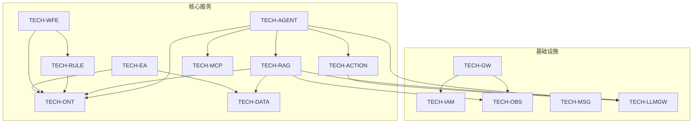
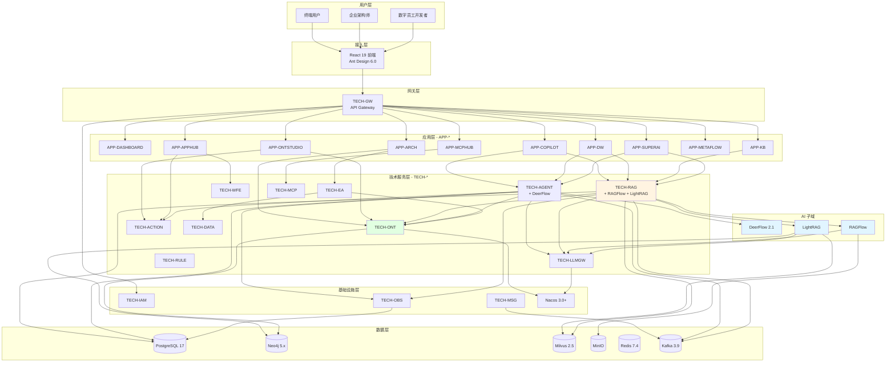
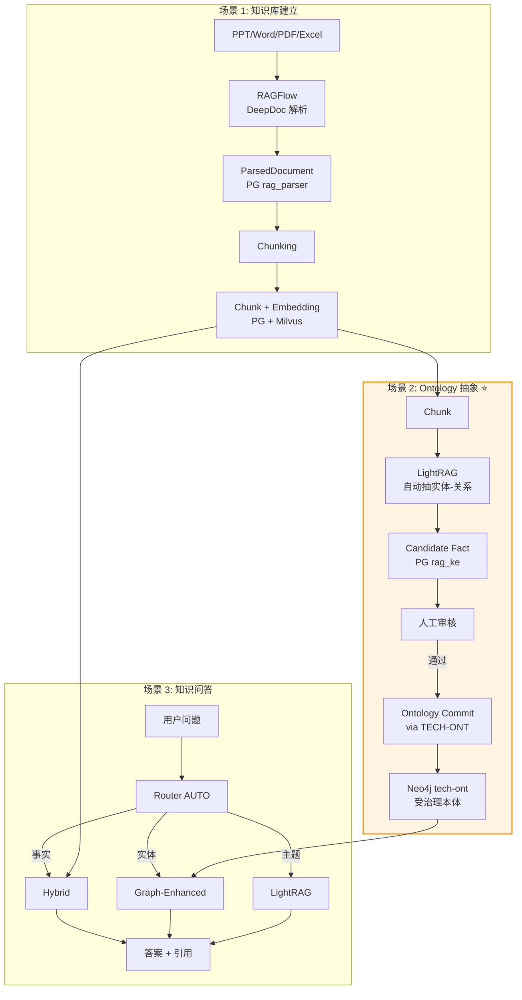
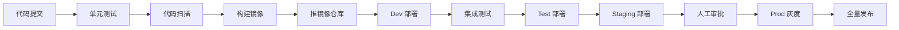

# Mate Platform 完整技术架构

> **版本**：v2.0 | **日期**：2026-07-27 | **状态**：正式版（Active）
>
> **本架构文档是 Mate Platform 的唯一权威技术参考（The One Doc）**。
>
> **当前版本**：v2.1（2026-07-27 增量：14 个业务场景全图，含主动阈值触发 S5b）
>
> **本文档整合**：v2 技术栈决策 + RAGFlow 集成 + LightRAG 集成 + Knowledge Engineering 流水线 + 全部模块的完整技术栈。
>
> **归档历史文档**（保留供决策追溯，本文档**不**依赖）：
> - `2026-07-27-mate-platform-rag-architecture.md`（RAG 子系统主架构，已并入本文档 §9）
> - `2026-07-27-v2-tech-stack-decision.md`（v2 决策，已并入 §1）
> - `2026-07-27-ragflow-graphrag-integration-a.md`（A 方案，已并入 §6.5 / §9.1）
> - `2026-07-27-lightrag-integration.md`（LightRAG 实施，已并入 §6.6 / §9.2）
> - `2026-07-27-rag-graphrag-best-solution.md`（v1 方案，已废止）
> - `2026-07-27-platform-rag-technical-architecture.md`（v1 全 Java 架构，已废止）
> - `docs/legal/LEGAL_CLEARANCE-ragflow-2026-07-27.md`（合规自评估，已并入 §10.4）

---

## 0. TL;DR

| 维度 | 决策 |
|---|---|
| **平台定位** | 基于 Ontology 本体引擎的企业级 AI 平台（数字员工 + RAG 知识库 + 智能助手 + 架构中心） |
| **技术栈基线** | Java 21 + Spring AI Alibaba 1.1.2 主力 + AI 子域允许 Python 3.10+ |
| **核心技术** | Spring Boot 3.5 / Spring AI 1.1.2 / PostgreSQL 17 / Neo4j 5.x / Milvus 2.5 / Kafka 3.9 |
| **AI 编排** | Spring AI Alibaba 1.1.2.0（BOM 统一）+ SAA Graph Core + Nacos 3.0+ MCP/A2A |
| **核心 RAG 引擎** | RAGFlow（DeepDoc 解析）+ LightRAG（GraphRAG 检索）+ 自研（Hybrid / Router / KE） |
| **Agent Runtime** | DeerFlow 2.1（外部集成）+ 自研 SAA Graph Core |
| **核心数据家** | 4 个：PostgreSQL / Neo4j / Milvus / MinIO |
| **核心中间件** | Redis 7.4 / Kafka 3.9 / Nacos 3.0+ / Istio 1.24 / OpenTelemetry 1.45 |
| **差异化** | Knowledge Engineering 流水线（AI 抽 Ontology + 人工审核）——护城河 |
| **合规** | RAGFlow AGPL-3.0 自评估 + LightRAG MIT 备案 + 应急方案 |
| **文档版本** | v2.0（取代 v1.x 全部历史文档） |

---

## 1. 架构原则

### 1.1 v2 技术栈决策（2026-07-27 通过）

| 维度 | v1.2（已废止） | **v2（当前）** |
|---|---|---|
| 主力栈 | 全量 Java + SAA | **Java 21 + SAA 1.1.2**（不变） |
| Python 允许 | ❌ 禁止 | ✅ **AI 子域允许** |
| 决策公理 | 个人能力上限 | **AI 作为技术专家**（团队 + AI + 自评估三重判断） |
| 运维约束 | "少一套栈" | "**可观测性到位即可**"（不分语言） |

### 1.2 7 条铁律

| # | 原则 | 说明 |
|---|---|---|
| **P1** | **主力栈优先** | 新项目默认 Java + SAA |
| **P2** | **AI 子域例外** | Agent Runtime、复杂 RAG、OCR/版面允许 Python |
| **P3** | **核心业务后端禁 Python** | 交易、订单、权限、计费必须 Java |
| **P4** | **法务合规是硬约束** | 任何新开源组件必须过自评估 |
| **P5** | **可观测性高于语言统一** | 跨语言栈必须统一接入 TECH-OBS |
| **P6** | **AI 协作是新能力维度** | 团队需**主动**与 AI 协作 |
| **P7** | **季度复盘 + 决策可逆** | 每季度复盘，可回退到 v1.3 |

### 1.3 业务三大场景

| 场景 | 描述 | 引擎 |
|---|---|---|
| **S1 知识库建立** | PPT/Word/PDF/Excel 精准切片 | RAGFlow（DeepDoc） |
| **S2 Ontology 抽象** ⭐ | AI 抽实体-关系-优化本体 | KE 流水线（护城河） |
| **S3 知识问答** | 跨主题、跨文档智能问答 | Hybrid / Graph-Enhanced / LightRAG |

---

## 2. 技术语言

### 2.1 后端语言

| 语言 | 版本 | 用途 | 占比 |
|---|---|---|---|
| **Java** | **21 LTS** | 主力后端语言 | ~85% |
| **Python** | **3.10+** | AI 子域（Agent/RAG/特定工具） | ~10% |
| Go（备用） | 1.22+ | 性能关键服务（未来） | <5% |

**决策依据**：
- Java 21 LTS = 长期支持 + 现代化特性（虚拟线程、模式匹配）
- Python 3.10+ = AI 生态成熟（LangChain、Transformers、PaddleOCR）

### 2.2 前端语言

| 语言 | 版本 | 用途 |
|---|---|---|
| **TypeScript** | 5.7+ | 主力前端语言 |
| JavaScript | ES2022 | 运行时 |
| CSS | Tailwind 4 + CSS Modules | 样式 |
| HTML | HTML5 | 模板 |

### 2.3 数据 / 配置语言

| 语言 | 用途 |
|---|---|
| **SQL** | 数据库查询 |
| **Cypher** | Neo4j 图查询 |
| **JSON / YAML** | 配置 / API |
| **Markdown** | 文档 |
| **Bash / PowerShell** | 脚本 |
| **HCL / K8s YAML** | IaC |

---

## 3. 技术栈（详细版本与依据）

### 3.1 后端核心框架

| 类别 | 技术 | 版本 | 依据 |
|---|---|---|---|
| **语言** | **Java** | **21 LTS** | 虚拟线程、模式匹配 |
| **框架** | Spring Boot | 3.5.x | Spring 生态核心 |
| **框架** | Spring Framework | 6.2.x | 底层容器 |
| **框架** | Spring Cloud | 2025.0.x | 微服务治理 |
| **框架** | Spring Cloud Alibaba | 2025.0.0.0 | Nacos / Sentinel / Seata |
| **AI 编排** | **Spring AI** | **1.1.2** | Java LLM 集成 |
| **AI 编排** | **Spring AI Alibaba** | **1.1.2.0** | **BOM 统一、Graph/Nacos MCP/A2A** |
| **AI 扩展** | Spring AI Alibaba Extensions | 1.1.2.1 | 扩展工具 |
| **数据** | Spring Data JPA | latest | ORM |
| **数据** | Spring Data Neo4j | latest | 图库 |
| **数据** | MyBatis-Plus（可选） | 3.5.x | 复杂 SQL 场景 |
| **Web** | Spring WebFlux + MVC + 虚拟线程 | latest | 响应式 + 同步混合 |
| **安全** | Spring Security | 6.4.x | OAuth2 / JWT |
| **协议** | Nacos Client | 3.0.3 | 服务发现/配置 |
| **可观测** | Micrometer | 1.13+ | 监控指标 |
| **测试** | JUnit 5 + Mockito + Testcontainers | latest | 单元/集成测试 |

### 3.2 前端技术栈

| 类别 | 技术 | 版本 | 依据 |
|---|---|---|---|
| **语言** | TypeScript | 5.7+ | 类型安全 |
| **框架** | **React** | **19** | 主力前端框架 |
| **构建** | Vite | 6+ | 现代化构建 |
| **UI 库** | **Ant Design** | **6.0** | 企业级组件 |
| **UI 库** | Ant Design X | 2.0 | AI 场景组件 |
| **流程** | **FlowGram.AI** | latest | 流程编排（fixed/free layout） |
| **可视化** | **AntV X6** | 2.x | 图谱/架构图 |
| **包管理** | pnpm | 10.x | monorepo |
| **状态** | Zustand / Jotai | latest | 轻量状态管理 |
| **数据获取** | TanStack Query | 5.x | 服务端状态 |
| **测试** | Vitest + Testing Library | latest | 单元测试 |
| **E2E** | Playwright | 1.49+ | 端到端测试 |

### 3.3 AI / 数据科学

| 类别 | 技术 | 版本 | 依据 |
|---|---|---|---|
| **Python** | Python | 3.10+ | AI 生态 |
| **Agent 框架** | **LangGraph** | 1.2.9+ | 多 Agent 编排 |
| **LLM 客户端** | LangChain | 1.3+ | LLM 工具调用 |
| **沙箱** | e2b-code-interpreter | 2.8+ | 云端代码沙箱 |
| **OCR** | PaddleOCR | latest | 中文 OCR |
| **PDF** | pymupdf4llm | latest | PDF 提取 |
| **解析** | markitdown | latest | 多格式 → Markdown |
| **MCP** | agent-client-protocol | 0.4+ | MCP 协议 |
| **可观测** | Langfuse / Monocle | 3.4+ | LLM 追踪 |
| **搜索** | Tavily / Exa / Firecrawl | latest | 联网搜索 |
| **IM** | lark-oapi / slack-sdk | latest | 多 IM 集成 |
| **包管理** | uv | latest | 快速 Python 包管理 |

### 3.4 基础设施

| 类别 | 技术 | 版本 | 依据 |
|---|---|---|---|
| **容器编排** | **Kubernetes** | **1.32** | 行业标准 |
| **服务网格** | **Istio** | **1.24** | mTLS / 流量管理 |
| **API 网关** | Spring Cloud Gateway | latest | Java 生态 |
| **Ingress** | Nginx Ingress / Istio Gateway | latest | K8s 入口 |
| **镜像** | Docker | 24+ | 容器化 |
| **CI/CD** | GitHub Actions / Argo CD | latest | 自动化 |
| **IaC** | Terraform / Helm | latest | 基础设施即代码 |
| **密钥** | HashiCorp Vault / K8s Secret | latest | 密钥管理 |

### 3.5 可观测性

| 类别 | 技术 | 版本 | 用途 |
|---|---|---|---|
| **链路追踪** | **OpenTelemetry** | **1.45+** | 分布式追踪 |
| **指标** | Prometheus | 3.x | 指标采集 |
| **可视化** | **Grafana** | **11.x** | 仪表盘 |
| **日志** | Loki / ELK | latest | 日志聚合 |
| **LLM 追踪** | Langfuse | 3.4+ | LLM 调用追踪 |
| **AI 追踪** | SAA Graph Observation | latest | Spring AI 追踪 |
| **告警** | Alertmanager | latest | 告警管理 |

---

## 4. 标准化组件（自研 TECH-* 模块）

Mate Platform 自研的技术服务模块，构成平台技术底座。

### 4.1 核心 TECH-* 模块清单

| 模块 | 职责 | 状态 | 关键依赖 |
|---|---|---|---|
| **TECH-GW** | API 网关、流量管理、灰度 | ✅ 已实现 | Spring Cloud Gateway, Nacos |
| **TECH-IAM** | 身份认证、租户隔离、OAuth2 | ✅ 已实现 | Spring Security, JWT |
| **TECH-AGENT** | Agent 编排、SAA Graph Core | ✅ 已实现 | Spring AI Alibaba |
| **TECH-LLMGW** | LLM 统一路由、限流、成本 | ✅ 已实现 | Spring AI, SAA |
| **TECH-MSG** | 消息基础设施（Kafka） | ✅ 已实现 | Kafka, RabbitMQ |
| **TECH-OBS** | 可观测性统一接入 | ✅ 已实现 | OpenTelemetry, Micrometer |
| **TECH-DATA** | 数据访问层、CDC | ✅ 已实现 | Spring Data, Flink |
| **TECH-ONT** | Ontology 概念/实体/属性 | ✅ 已实现 | Neo4j, OWL |
| **TECH-RAG** | RAG 引擎（含本架构的 RAG 子系统） | ✅ 部分实现 | Milvus, Neo4j, Spring AI |
| **TECH-WFE** | 工作流引擎（BPMN） | ✅ 已实现 | Flowable |
| **TECH-ACTION** | Action 引擎 | ✅ 已实现 | - |
| **TECH-RULE** | 规则引擎（Drools） | ✅ 已实现 | Drools |
| **TECH-EA** | EA 架构资产 | 🟡 部分 | Neo4j |
| **TECH-MCP** | MCP 协议 | 🟡 部分 | Nacos 3.0+ |

### 4.2 模块依赖关系



### 4.3 TECH-RAG 子系统内部模块（v2 架构）

| 子模块 | 职责 | 状态 |
|---|---|---|
| `tech-rag-common` | 公共 DTO / 异常 / 工具 | ✅ |
| `tech-rag-ragflow-bridge` | RAGFlow 桥接层（DeepDoc） | 🆕 新建 |
| `tech-rag-lightrag-bridge` | LightRAG 桥接层（GraphRAG） | 🆕 新建 |
| `tech-rag-knowledge-eng` | Knowledge Engineering 流水线 ⭐ | 🆕 新建 |
| `tech-rag-retrieval` | Hybrid + Graph-Enhanced | ✅ 增强 |
| `tech-rag-citation` | 多层引用 | ✅ 增强 |
| `tech-rag-router` | 统一路由 | 🆕 新建 |
| `tech-rag-app` | Spring Boot 启动器 | ✅ |
| `tech-rag-bom` | BOM | ✅ |

---

## 5. 中间件（详细配置）

### 5.1 数据库（4 个家）

| 类型 | 选型 | 版本 | 用途 | 隔离策略 |
|---|---|---|---|---|
| **关系数据库** | **PostgreSQL** | **17** | 主库 | 8 schema 隔离 |
| **图数据库** | **Neo4j** | **5.x** | Ontology + GraphRAG | 3 database 隔离 |
| **向量数据库** | **Milvus** | **2.5** | 向量检索 | 多 collection |
| **对象存储** | **MinIO** | latest | 文件存储 | bucket 隔离 |

#### 5.1.1 PostgreSQL Schema 隔离清单

| Schema | 拥有模块 | 主要表 |
|---|---|---|
| `public` | 系统 | 用户、租户等基础表 |
| `rag` | Retrieval（既有） | knowledge_base, document, chunk, search_feedback |
| `rag_parser` | RAGFlow Bridge | parsed_document, parse_task |
| `rag_bridge_ragflow` | RAGFlow Bridge | ragflow_call_log, fallback_event |
| `rag_bridge_lightrag` | LightRAG Bridge | call_log, extraction_event |
| `rag_ke` | Knowledge Engineering | extraction_task, candidate_fact, review_task, prompt_template |
| `rag_lightrag` | LightRAG Bridge | community_summary, extraction_task |
| `rag_citation` | Citation | citation |
| `rag_router` | Router | query_log |

#### 5.1.2 Neo4j Database 隔离清单

| Database | 拥有方 | 标签前缀 | 写入方 |
|---|---|---|---|
| `tech-ont` | TECH-ONT | `tech-ont.*` | TECH-ONT（受治理） |
| `lrag-graph` | LightRAG | 默认 | LightRAG 服务 |
| `rag-graphrag` | GraphRAG（备用） | `rag_*` | 自研（未来） |

### 5.2 消息与缓存

| 类型 | 选型 | 版本 | 用途 | 规模预估 |
|---|---|---|---|---|
| **消息队列** | **Apache Kafka** | **3.9** | 事件流、跨模块通信 | 3 节点起 |
| **消息队列**（备） | RabbitMQ | 4.x | 任务队列 | 单节点 |
| **缓存** | **Redis** / Valkey | **7.4 / 8** | 缓存、分布式锁、Stream | 3 节点集群 |
| **缓存** | Caffeine（本地） | latest | JVM 内缓存 | - |

### 5.3 服务发现与配置

| 类别 | 选型 | 版本 | 用途 |
|---|---|---|---|
| **注册中心** | **Nacos** | **3.0.1+** | 服务发现 + 配置 + MCP/A2A 注册 |
| **配置** | Nacos Config | 3.0.1+ | 动态配置 |
| **服务发现** | Nacos Discovery | 3.0.1+ | 服务注册/发现 |
| **协议注册** | Nacos MCP | 3.0.1+ | MCP Server 注册 |
| **Agent 协议** | Nacos A2A | 3.0.1+ | A2A Agent 注册 |

### 5.4 容器与服务网格

| 类别 | 选型 | 版本 | 用途 |
|---|---|---|---|
| **容器运行时** | containerd | 1.7+ | K8s 容器引擎 |
| **容器引擎** | Docker | 24+ | 本地开发 |
| **服务网格** | **Istio** | **1.24** | mTLS、流量管理、可观测 |
| **Ingress** | Istio Gateway | 1.24 | K8s 入口 |
| **Sidecar** | Istio Proxy | 1.24 | Envoy |

### 5.5 数据 ETL 与湖仓

| 类别 | 选型 | 版本 | 用途 |
|---|---|---|---|
| **实时计算** | Apache Flink | 1.20 | 流处理 |
| **批量调度** | Apache Airflow | 2.10 | 任务调度 |
| **数据转换** | DBT | 1.9 | SQL 转换 |
| **数据湖** | Apache Hudi（主） | 1.x | 增量湖 |
| **数据湖**（备） | Apache Iceberg | 1.8 | 湖格式 |
| **OLAP** | StarRocks | 3.4 / 4.0 | 实时 OLAP |

---

## 6. 成熟的开源平台

### 6.1 RAGFlow（v2 决策下集成）

| 维度 | 详情 |
|---|---|
| **项目** | RAGFlow |
| **GitHub** | `infiniflow/ragflow` |
| **协议** | AGPL-3.0（自评估通过） |
| **版本** | v0.13.0+ |
| **用途** | **DeepDoc 文档解析**（仅此一项） |
| **不**用 | 它的 RAG 检索、UI、配置系统 |
| **引入方式** | 服务级调用（不修改源码） |
| **部署** | Docker / K8s（ClusterIP） |
| **集成路径** | `tech-rag-ragflow-bridge` |

### 6.2 LightRAG（v2 决策下集成）

| 维度 | 详情 |
|---|---|
| **项目** | LightRAG |
| **GitHub** | `HKUDS/LightRAG` |
| **协议** | **MIT**（极简） |
| **版本** | latest |
| **用途** | GraphRAG 检索（4 模式）+ 实体抽取 |
| **优势** | HKU 团队、生产级、内存优化、多厂商 LLM |
| **集成路径** | `tech-rag-lightrag-bridge` |

### 6.3 DeerFlow（既有集成）

| 维度 | 详情 |
|---|---|
| **项目** | DeerFlow |
| **GitHub** | `bytedance/deer-flow` |
| **协议** | MIT |
| **版本** | 2.1.0 |
| **用途** | Agent Runtime（Sub-Agents / Sandbox / Skills） |
| **集成路径** | `TECH-AGENT` 内的 DeerFlowAdapter |
| **技术栈** | Python 3.12 / LangGraph 1.2.9 / FastAPI / Next.js 16 |

### 6.4 Spring AI Alibaba（SAA 1.1.2.0）

| 维度 | 详情 |
|---|---|
| **项目** | Spring AI Alibaba |
| **GitHub** | `alibaba/spring-ai-alibaba` |
| **协议** | Apache 2.0 |
| **版本** | 1.1.2.0 |
| **用途** | **Java AI 编排统一底座**（BOM） |
| **关键能力** | Graph / Nacos MCP / A2A / Prompt / Tool / RAG |

### 6.5 其他关键开源组件

| 组件 | 协议 | 用途 |
|---|---|---|
| **Apache Tika** | Apache 2.0 | 多格式文档解析（基础层） |
| **Apache PDFBox** | Apache 2.0 | PDF 处理 |
| **Apache POI** | Apache 2.0 | Office 文档（PPTX/DOCX/XLSX） |
| **JGraphT** | LGPL 2.1 + EPL | 图算法（Leiden/Louvain 备选） |
| **PaddleOCR** | Apache 2.0 | 中文 OCR（模型权重） |
| **onnxruntime-java** | MIT | ONNX 模型推理 |
| **FlowGram.AI** | Apache 2.0 | 流程编排（fixed/free layout） |
| **AntV X6** | MIT | 图谱/架构图可视化 |
| **LangGraph** | MIT | Python 多 Agent 编排（DeerFlow 用） |
| **Drools** | Apache 2.0 | 规则引擎（TECH-RULE） |
| **Flowable** | Apache 2.0 | 工作流引擎（TECH-WFE） |

### 6.6 选型决策原则

| 原则 | 说明 |
|---|---|
| **优先成熟** | 选有大规模生产案例的 |
| **优先 Apache 2.0 / MIT** | 协议友好，零法律风险 |
| **避开 AGPL 强传染** | 服务级集成时**必须**自评估 |
| **避开 SSPL / 商业** | 不锁定 |
| **活跃度** | 近 6 个月有 commit |
| **社区支持** | 有官方文档、Discord/Slack |

---

## 7. 模块架构

### 7.1 应用模块（APP-*）

| 模块 | 职责 |
|---|---|
| **APP-DASHBOARD** | 个人工作台 |
| **APP-COPILOT** | 智能助手 |
| **APP-DW** | 数字员工 |
| **APP-ARCH** | 架构中心 |
| **APP-KB** | 知识库 |
| **APP-APPHUB** | 应用中心 |
| **APP-ONTSTUDIO** | 本体建模 |
| **APP-MCPHUB** | MCP Server 中心 |
| **APP-METAFLOW** | 流程编排 |
| **APP-SUPERAI** | 超级 AI |

### 7.2 APP → TECH 依赖矩阵

| APP → | IAM | GW | AGENT | RAG | ONT | LLMGW | MSG | OBS | DATA | WFE | ACTION | RULE | EA | MCP |
|---|---|---|---|---|---|---|---|---|---|---|---|---|---|---|
| APP-DASHBOARD | ✅ | ✅ | - | - | - | - | ✅ | ✅ | - | - | - | - | - | - |
| APP-COPILOT | ✅ | ✅ | ✅ | ✅ | ✅ | ✅ | ✅ | ✅ | - | - | - | - | - | - |
| APP-DW | ✅ | ✅ | ✅ | ✅ | ✅ | ✅ | ✅ | ✅ | - | - | ✅ | - | - | - |
| APP-ARCH | ✅ | ✅ | - | - | ✅ | - | ✅ | ✅ | ✅ | - | - | - | ✅ | - |
| APP-KB | ✅ | ✅ | - | ✅ | - | - | ✅ | ✅ | - | - | - | - | - | - |
| APP-APPHUB | ✅ | ✅ | ✅ | - | ✅ | - | ✅ | ✅ | - | ✅ | ✅ | ✅ | - | - |
| APP-ONTSTUDIO | ✅ | ✅ | - | - | ✅ | - | ✅ | ✅ | ✅ | - | ✅ | ✅ | - | - |
| APP-MCPHUB | ✅ | ✅ | - | - | ✅ | - | - | ✅ | - | - | - | - | - | ✅ |
| APP-METAFLOW | ✅ | ✅ | - | - | - | - | ✅ | ✅ | - | ✅ | - | - | - | - |
| APP-SUPERAI | ✅ | ✅ | ✅ | ✅ | ✅ | ✅ | ✅ | ✅ | - | - | - | - | - | - |

### 7.3 系统整体视图



---

## 8. 数据架构（4 个家 + 3 个工具）

### 8.1 数据归属总表

| 数据 | 存储 | Schema/Collection/Database | 拥有模块 |
|---|---|---|---|
| 原始文件 | MinIO | `kb-{tenantId}/{kbId}/raw/{docId}.{ext}` | RAGFlow Bridge |
| ParsedDocument | PostgreSQL | `rag_parser.*` | RAGFlow Bridge |
| Chunk | PostgreSQL | `rag.*` | Retrieval |
| Chunk Embedding | Milvus | `rag_chunk_vec` | Retrieval |
| LightRAG 实体/关系/社区 | Neo4j | `lrag-graph` | LightRAG |
| LightRAG 摘要 | PostgreSQL | `rag_lightrag.*` | LightRAG Bridge |
| Candidate Fact | PostgreSQL | `rag_ke.*` | KE |
| Review Task | PostgreSQL | `rag_ke.*` | KE |
| Prompt Template | PostgreSQL | `rag_ke.*` | KE |
| **Ontology Concept/Relation** | Neo4j | `tech-ont` | **TECH-ONT**（受治理） |
| Citation | PostgreSQL | `rag_citation.*` | Citation |
| Query Log | PostgreSQL | `rag_router.*` | Router |
| 调用日志 | PostgreSQL | `rag_bridge_*` | Bridges |
| 缓存 | Redis | `rag:*` | 各模块 |
| 事件 | Kafka | `rag.*.v1` | 各模块 |
| 可观测性 | TECH-OBS | - | 全模块 |

### 8.2 数据生命周期

| 数据 | 保留期 | 删除策略 |
|---|---|---|
| 原始文件 | 永久 | 软删 + 30 天回收 |
| ParsedDocument | 永久 | 跟随文档 |
| Chunk + Embedding | 永久 | 跟随文档重建 |
| Candidate Fact (PENDING) | 30 天 | 超期自动清理 |
| Candidate Fact (REJECTED) | 90 天 | 用于 Prompt 优化 |
| Prompt 模板 | 永久 | 只追加 |
| Ontology | 永久 | 版本化 |
| Query Log | 90 天 | 热-温-冷分层 |
| 监控数据 | 13 个月 | Prometheus 规则 |

### 8.3 备份策略

| 数据 | 备份方式 | RPO | RTO |
|---|---|---|---|
| PostgreSQL | 每日全量 + WAL 归档 | 5 分钟 | 1 小时 |
| Neo4j | 每日全量 + 在线备份 | 1 小时 | 4 小时 |
| Milvus | 每日全量 | 24 小时 | 4 小时 |
| MinIO | 跨区域复制 | 0 | 1 小时 |
| Redis | AOF | 1 秒 | 1 分钟 |
| Kafka | 3 副本 | 0 | 实时 |

---

## 9. RAG 子系统架构（重点章节）

### 9.1 整体架构



### 9.2 RAG 子系统 6 大模块

| 模块 | 职责 | Maven 坐标 | 状态 |
|---|---|---|---|
| **A. RAGFlow Bridge** | DeepDoc 解析 | `tech-rag-ragflow-bridge` | 🆕 |
| **B. LightRAG Bridge** | GraphRAG 检索 | `tech-rag-lightrag-bridge` | 🆕 |
| **C. Knowledge Engineering** | 抽取 + 审核 + 提交 | `tech-rag-knowledge-eng` | 🆕 ⭐ |
| **D. Retrieval** | Hybrid + Graph-Enhanced | `tech-rag-retrieval` | ✅ |
| **E. Citation** | 多层引用 | `tech-rag-citation` | ✅ |
| **F. Router** | 统一入口 | `tech-rag-router` | 🆕 |

### 9.3 RAG 子系统数据流（闭环）

```
[文档上传]
    ↓
[RAGFlow 解析] → ParsedDocument
    ↓
[Chunking] → Chunk + Embedding
    ↓
[LightRAG 自动抽实体-关系] → 事件
    ↓
[KE 转 Candidate Fact] → 待审核
    ↓
[人工审核] → 通过 / 拒绝
    ↓
[TECH-ONT API 提交] → Ontology 更新
    ↓
[Graph-Enhanced 检索] ← 用最新 Ontology
    ↓
[用户查询] → Router AUTO
    ↓
[Hybrid / GE / LightRAG] → 答案 + 引用
```

### 9.4 RAG 子系统 API 顶层

| 路径 | 方法 | 模块 | 说明 |
|---|---|---|---|
| `/api/v1/rag/parser/*` | POST/GET | A | 文档解析 |
| `/api/v1/rag/lightrag/*` | POST/GET | B | GraphRAG 检索 |
| `/api/v1/rag/ke/*` | POST/GET | C | 抽取/审核/提交 |
| `/api/v1/rag/retrieve/*` | POST | D | Hybrid/GE |
| `/api/v1/rag/citation/*` | POST/GET | E | 引用 |
| `/api/v1/rag/retrieve` | POST | F | 统一入口 |

### 9.5 RAG 子系统事件协议

| 主题 | 发布方 | 订阅方 |
|---|---|---|
| `rag.parser.document.parsed.v1` | A | C, D |
| `rag.parser.document.parse-failed.v1` | A | C |
| `rag.lightrag.entity.extracted.v1` | B | **C** ⭐ |
| `rag.lightrag.community.built.v1` | B | F |
| `rag.ke.candidate.created.v1` | C | UI |
| `rag.ke.ontology.committed.v1` | C | D, B, F ⭐ |
| `rag.ke.prompt.activated.v1` | C | D |
| `rag.retrieval.index.rebuilt.v1` | D | F |
| `rag.router.query.completed.v1` | F | OBS |

---


## 10. 业务场景全图（14 个核心场景）

> **本节是 v2.1 增量**：把所有业务场景（5 原始 + 8 补充 + 1 主动触发）合并为完整的"业务全景图"。

### 10.1 场景总览（14 场景 × 4 维度）

| ID | 场景名称 | 触发方式 | 涉及核心模块 | 实现状态 |
|---|---|---|---|---|
| **S1** | 知识库建立（文档上传） | 用户上传文件 | RAGFlow Bridge / Retrieval | ✅ 已设计 |
| **S2** | Ontology 抽象（内容/对话） | 文档解析后 / 用户对话 | LightRAG / KE / TECH-ONT | ✅ 已设计 |
| **S3** | 知识问答（多 Agent） | 用户查询 | Router / Hybrid / LightRAG | ✅ 已设计 |
| **S4** | 智能体编排生成 | 用户请求 | TECH-WFE / TECH-ACTION / FlowGram.AI | 🆕 新增 |
| **S5** | 智能巡检（定期） | 定时任务 | LightRAG / KE / Agent | 🆕 新增 |
| **S5b** | **实时阈值触发** ⭐ | 数据变化 + 规则命中 | **TECH-RULE** / Agent | 🆕 **本版本新增** |
| **S6** | Ontology 演进与版本 | 用户编辑 / 提交 | TECH-ONT / Git-like | 🆕 新增 |
| **S7** | 知识反馈闭环 | 用户反馈 | Router / KE / TECH-OBS | 🆕 新增 |
| **S8** | 多模态文档解析 | 文件含图/表/公式 | RAGFlow / onnxruntime | 🆕 新增 |
| **S9** | 知识推荐与主动推送 | 行为/订阅/阈值 | Agent / IM 集成 | 🆕 新增 |
| **S10** | 企业级知识治理 | 任意操作 | TECH-IAM / TECH-OBS | 🆕 新增 |
| **S11** | 跨组织知识共享 | 跨租户访问 | TECH-IAM / TECH-AGENT | 🆕 新增 |
| **S12** | 知识冲突解决 | 规则引擎 | TECH-RULE / KE | 🆕 新增 |
| **S13** | 应急异常处理 | 异常事件 | Sentinel / 降级策略 | 🆕 新增 |

### 10.2 5 个核心场景（S1-S5）详细设计

#### S1：知识库建立（文档上传）

```
用户上传文件 → TECH-KB → RAGFlow 解析 → ParsedDocument
    ↓
Chunking → Chunk + Embedding → Milvus + PostgreSQL
    ↓
触发 LightRAG 实体抽取 → Candidate Fact
    ↓
KE 流水线：人工审核 → Ontology 提交
```

| 维度 | 内容 |
|---|---|
| 触发方式 | 用户在 APP-KB 上传文件（PPT/Word/PDF/Excel/图片） |
| 用户角色 | 知识库管理员、业务专家 |
| 关键模块 | RAGFlow Bridge / Retrieval / LightRAG Bridge / KE |
| 关键路径 | 上传 → 解析 → chunking → embedding → 入库 |
| 异步 | 解析、embedding、抽取是异步任务 |
| 输出 | KB 中可检索的 Chunk + Ontology 中的概念 |

#### S2：Ontology 抽象（从内容/对话）

```
对话模式：
  用户描述 → KE 对话式抽取 → 候选本体 → 用户确认 → 入库

文档模式（=S1 的后半段）：
  Chunk → LightRAG 自动抽取 → 候选 → 人工审核 → 入库
```

| 维度 | 内容 |
|---|---|
| 触发方式 | 文档解析后自动触发 / 用户在 APP-ONTSTUDIO 启动对话 |
| 关键模块 | LightRAG Bridge / KE / TECH-ONT |
| 关键路径 | 输入 → LLM 抽取 → Candidate Fact → 人工审核 → Commit |
| 置信度分层 | ≥0.8 高优先级 / 0.5-0.8 常规 / <0.5 丢弃 |
| 输出 | Neo4j tech-ont 数据库中的新概念/关系 |

#### S3：知识问答（多 Agent 协同）

```
用户问题 → Router (AUTO) → 意图分类
    ├─ 事实型 → Hybrid (Milvus + BM25 + Rerank)
    ├─ 实体型 → Graph-Enhanced (基于 Ontology)
    └─ 主题型 → LightRAG (Local/Global/Mix)
              ↓
          答案 + Citation + Evidence → 用户
              ↓
          用户反馈 → KE 改进 Prompt
```

| 维度 | 内容 |
|---|---|
| 触发方式 | 用户在 APP-COPILOT / APP-DW / APP-ARCH 输入问题 |
| 关键模块 | RetrievalRouter / Hybrid / Graph-Enhanced / LightRAG / Citation / Agent |
| 多 Agent 协同 | 简单问题单 Agent；复杂问题主 Agent 调度多个 Sub-Agent |
| 答案构成 | 直接答案 + 引用段落 + Evidence 链 + 数据源 |
| 反馈闭环 | 用户点赞/点踩 → 反馈回 KE 改进 Prompt |

#### S4：智能体编排生成（NEW）

```
用户描述需求 → Agent 理解 → 调用 WFE/Action 工具生成方案
    ↓
LLM 总结工作流草案 → 用户确认
    ↓
TECH-WFE (FlowGram.AI) 保存为可执行工作流
    ↓
发布 + 触发后续 Action
```

| 维度 | 内容 |
|---|---|
| 触发方式 | 用户在 APP-APPHUB 描述："我需要 XX 流程" |
| 关键模块 | TECH-AGENT / TECH-WFE / TECH-ACTION / TECH-RULE |
| 关键路径 | 理解意图 → 平台规范约束 → LLM 生成 → 人工确认 → 持久化 |
| 平台规范 | Action Guard / Schema 校验 / 权限检查 |
| 输出 | FlowGram.AI 流程定义 + Action 编排 JSON |

#### S5：智能巡检（定期，NEW）

```
定时任务（每日/每周）→ 启动巡检 Agent
    ↓
扫描 Ontology 一致性 / 数据质量 / 业务规则违反
    ↓
汇总问题 → LLM 生成报告
    ↓
推送报告给指定用户 / IM
```

| 维度 | 内容 |
|---|---|
| 触发方式 | 定时（cron）或手动触发 |
| 关键模块 | TECH-AGENT / LightRAG / KE / TECH-RULE |
| 巡检内容 | Ontology 完整性 / 数据一致性 / 异常值 / 缺失字段 |
| 输出 | 巡检报告（HTML/PDF/Markdown） + 异常工单 |
| 频率 | 业务可配置（每日关键 / 每周全量） |

### 10.3 S5b：实时阈值触发（NEW ⭐ 本版本重点新增）

> **用户原话**："发现某些本体或者属性之类的值超过阈值，要主动触发AI相关内容"

这是 S5 的**实时版本**——从"定期批量"变成"事件驱动秒级响应"。

#### 10.3.1 触发流程

```
[数据源] → [数据变更事件] → [Kafka]
    ↓
[TECH-RULE 规则引擎（Drools）]
    ↓
if 阈值命中
    ↓
[TECH-AGENT 调度 AI Agent]
    ↓
[AI 分析 / 通知 / 自动响应]
    ↓
[用户收到推送 / 工单 / 自动 Action]
```

#### 10.3.2 触发场景示例

| 业务场景 | 监控对象 | 阈值规则 | 触发响应 |
|---|---|---|---|
| 合同风险 | 合同金额 > 100万 | 触发风险评估 Agent | 通知法务 + 生成风险报告 |
| 客户健康度 | 客户 NPS < 30 | 触发客户关怀 Agent | 通知客户经理 + 推荐挽回方案 |
| 库存告警 | 库存 < 安全库存 20% | 触发补货 Agent | 通知采购 + 生成补货单 |
| 异常交易 | 单笔交易 > 50万 | 触发合规 Agent | 通知合规 + 冻结审查 |
| Ontology 一致性 | 概念被引用次数 < 3 且 > 6 月 | 触发清理建议 | 通知 Ontology 管理员 |
| 知识陈旧 | 文档最近 1 年未更新 | 触发复审 Agent | 通知原作者 + 推荐更新 |

#### 10.3.3 技术架构

| 组件 | 角色 |
|---|---|
| **数据变更事件** | CDC（Debezium / DataX）+ Kafka Topic `data.changed.*` |
| **TECH-MSG** | 事件分发（Kafka） |
| **TECH-RULE** | Drools 规则引擎，订阅事件，评估阈值 |
| **TECH-AGENT** | 触发 AI Agent（按规则类型路由） |
| **IM 集成** | 飞书/钉钉/企业微信 通知（已有 DeerFlow 集成） |
| **TECH-ACTION** | 自动 Action（可选，需授权） |
| **TECH-OBS** | 全链路监控 |

#### 10.3.4 规则定义示例（Drools DRL）

```drl
package com.metaplatform.rules.threshold

import com.metaplatform.event.DataChangedEvent
import com.metaplatform.rule.ThresholdContext

rule "ContractAmountHighRisk"
    when
        $event : DataChangedEvent(entityType == "Contract", field == "amount")
        $ctx : ThresholdContext(value : value, value > 1000000)
    then
        triggerAgent("RiskAssessmentAgent", $event, $ctx);
        notifyChannel("legal", "高额合同：" + $event.getEntityId());
end

rule "CustomerNPSLow"
    when
        $event : DataChangedEvent(entityType == "Customer", field == "nps")
        $ctx : ThresholdContext(value : value, value < 30)
    then
        triggerAgent("CustomerCareAgent", $event, $ctx);
end
```

#### 10.3.5 安全控制

| 控制点 | 措施 |
|---|---|
| 规则变更审批 | 通过 TECH-RULE 管理界面，需 Owner 审批 |
| AI 自动 Action | 默认"仅通知"，可配置为"自动 Action"（需二次确认） |
| 高风险 Action | 必须人工确认才能执行 |
| 误触发保护 | 规则可设置抑制期（如 1 小时内不重复触发） |
| 审计 | 全部触发记录入 TECH-OBS，可追溯 |

### 10.4 8 个补充场景（S6-S13）简述

| ID | 场景 | 一句话设计 | 关键模块 |
|---|---|---|---|
| **S6** | Ontology 演进与版本 | 概念合并/重命名/废弃/回滚，影响分析 | TECH-ONT / Git-like versioning |
| **S7** | 知识反馈闭环 | 显式/隐式反馈 → 改进 embedding / Prompt | KE / TECH-OBS |
| **S8** | 多模态文档解析 | 图片/表格/公式 → 结构化 | RAGFlow / onnxruntime / PaddleOCR |
| **S9** | 知识推荐与主动推送 | 行为触发 / 订阅 / 阈值 | Agent / IM 集成 |
| **S10** | 企业级知识治理 | 权限 / 审批 / 审计 / 脱敏 / 合规 | TECH-IAM / TECH-OBS / Sentinel |
| **S11** | 跨组织知识共享 | 共享池 / 联邦查询 / 知识市场 | TECH-IAM / TECH-AGENT |
| **S12** | 知识冲突解决 | 同名异义 / 同义不同名 / 时效冲突 | TECH-RULE / KE |
| **S13** | 应急异常处理 | 降级 / 限流 / 熔断 / 拦截 | Sentinel / 降级策略 |

### 10.5 跨场景能力映射

| 能力 | 涉及场景 | 实现模块 |
|---|---|---|
| 文档解析 | S1, S8 | RAGFlow |
| 实体抽取 | S2, S5, S5b, S6 | LightRAG / KE |
| 多 Agent 协同 | S3, S4, S5, S5b, S9 | TECH-AGENT |
| 规则引擎 | S5, S5b, S12, S13 | TECH-RULE (Drools) |
| 工作流引擎 | S4 | TECH-WFE (Flowable) |
| 主动推送 | S5, S5b, S9 | IM 集成 / Agent |
| 知识治理 | S6, S10, S11 | TECH-IAM / TECH-OBS |
| 冲突解决 | S12 | TECH-RULE / KE |

### 10.6 主动触发 vs 被动响应（关键认知）

| 维度 | 被动响应（S1-S3） | 主动触发（S5, S5b, S9） |
|---|---|---|
| 触发方 | 用户 | 系统（事件/规则/定时） |
| 响应时机 | 用户请求后 | 数据变化后（秒级） |
| AI 角色 | 服务提供者 | 主动助理 |
| 关键技术 | 检索 / 抽取 | 规则引擎 / 事件流 / Agent |
| 价值 | "答得上" | "想得到" |

**Mate Platform 的差异化 = 主动 + 被动 双向 AI 能力**。


## 11. 安全与合规

### 11.1 安全原则

| 维度 | 措施 |
|---|---|
| **认证** | OAuth2 / JWT，SSO（OIDC / SAML） |
| **授权** | RBAC + ABAC，最小权限 |
| **传输** | TLS 1.3，mTLS（服务间） |
| **存储** | 静态加密（AES-256） |
| **密钥** | HashiCorp Vault / K8s Secret |
| **审计** | 全部 API 调用审计日志 |
| **数据脱敏** | PII 自动脱敏，日志脱敏 |

### 11.2 租户隔离

| 维度 | 隔离方式 |
|---|---|
| **数据库** | Row-Level Security（RLS） |
| **向量** | Collection 命名空间 + Filter |
| **图** | Multi-Database / Label 前缀 |
| **对象存储** | Bucket 路径隔离 |
| **缓存** | Key 前缀 |

### 11.3 数据保护

| 维度 | 措施 |
|---|---|
| **静态加密** | AES-256（DB / MinIO） |
| **传输加密** | TLS 1.3 |
| **密钥管理** | Vault 集中管理 |
| **数据脱敏** | PII 自动识别 + 脱敏 |
| **备份加密** | 备份文件加密 |
| **删除** | 软删除 + 30 天回收 + 物理擦除 |

### 11.4 合规自评估

| 组件 | 协议 | 风险 | 措施 |
|---|---|---|---|
| RAGFlow | AGPL-3.0 | 🟡 中 | 服务级使用 + 保留 LICENSE + 不修改源码 + 应急方案 |
| LightRAG | MIT | 🟢 极低 | 保留 LICENSE + 致谢 |
| Spring AI Alibaba | Apache 2.0 | 🟢 | 无 |
| Apache 系列 | Apache 2.0 | 🟢 | 无 |
| JGraphT | LGPL 2.1 + EPL | 🟢 | 动态链接 |
| PaddleOCR | Apache 2.0 | 🟢 | 无 |
| Neo4j 社区版 | GPL v3 | 🟢 | 独立进程，不传染 |
| 商业化前 | 必重评估 | - | 找真律师 |

**应急方案**：若被要求开源，6-8 周可切换 RAGFlow 到 Java 重写 DeepDoc，LightRAG 保留（MIT 不受影响）。

---

## 12. 可观测性

### 12.1 三大支柱

| 维度 | 工具 | 用途 |
|---|---|---|
| **Metrics** | Prometheus + Grafana | 数值指标 |
| **Logs** | Loki / ELK | 日志聚合 |
| **Traces** | OpenTelemetry + Jaeger | 链路追踪 |

### 12.2 关键指标

| 类别 | 指标 | 目标 |
|---|---|---|
| **可用性** | SLO（月度） | ≥ 99.5% |
| **响应** | P95 延迟 | 按模块 |
| **吞吐** | QPS | 按模块 |
| **错误率** | 5xx 占比 | < 0.1% |
| **资源** | CPU / 内存 / 磁盘 | < 80% |
| **LLM** | Token / 调用 / 成本 | 按日统计 |

### 12.3 告警分级

| 等级 | 触发条件 | 响应 |
|---|---|---|
| **P0** | 服务不可用 | 立即 |
| **P1** | SLO 违反 | 1 小时内 |
| **P2** | 资源接近上限 | 4 小时内 |
| **P3** | 趋势异常 | 工作时间 |
| **P4** | 提示 | 下个工作日 |

### 12.4 业务监控（LLM 专项）

| 指标 | 说明 |
|---|---|
| LLM 调用次数 | 按模型/租户/场景 |
| LLM Token 消耗 | 按日/周/月 |
| LLM 成本 | 按租户/场景 |
| LLM P95 延迟 | 按模型 |
| LLM 错误率 | 按错误码 |
| 抽取 F1 / Recall | 离线评估 |
| 用户反馈（赞/踩） | UI 反馈 |

---

## 13. 性能与扩展

### 13.1 性能基线

| 服务 | P95 延迟目标 | 备注 |
|---|---|---|
| TECH-GW | ≤ 50ms | 网关开销 |
| TECH-IAM | ≤ 100ms | 鉴权开销 |
| TECH-RAG Hybrid | ≤ 1s | 检索 |
| TECH-RAG LightRAG | ≤ 3s | GraphRAG |
| RAGFlow 解析（1MB PDF） | ≤ 3s | DeepDoc |
| LightRAG 索引（1MB） | ≤ 60s | 全量 |
| Router AUTO 分类 | ≤ 200ms | cheap LLM |
| KE 抽取（单文档） | ≤ 30s | LLM |
| TECH-LLMGW | ≤ 2s | LLM 路由 |

### 13.2 扩展策略

| 维度 | 策略 |
|---|---|
| **水平扩展** | K8s HPA（CPU > 70% 自动扩容） |
| **垂直扩展** | 资源 limits 调整 |
| **读写分离** | PG 主从 / Neo4j 集群 / Milvus 集群 |
| **缓存** | Redis 多级 + 本地 Caffeine |
| **限流** | Sentinel / Spring Cloud Gateway |
| **降级** | 熔断 + fallback |
| **异步** | Kafka 异步处理 |

### 13.3 限流策略

| 维度 | 限制 |
|---|---|
| **租户级** | 100 QPS（可配置） |
| **用户级** | 10 QPS |
| **LLM** | 按模型/租户配额 |
| **存储** | 单租户 100GB 文档 |

---

## 14. 部署架构

### 14.1 环境规划

| 环境 | 用途 | 部署位置 |
|---|---|---|
| **dev** | 开发联调 | 本地 Docker Compose |
| **test** | 测试 | K8s 测试集群 |
| **staging** | 预发 | K8s 预发集群 |
| **prod** | 生产 | K8s 生产集群（多 region） |

### 14.2 K8s 命名空间

| Namespace | 包含服务 |
|---|---|
| `mate-tech` | TECH-* 全套 Java 服务 |
| `mate-ai` | RAGFlow, LightRAG |
| `mate-deerflow` | DeerFlow |
| `mate-frontend` | 前端应用 |
| `mate-monitor` | 监控、告警 |
| `mate-infra` | 基础设施（中间件） |

### 14.3 CI/CD 流水线



### 14.4 灰度策略

| 阶段 | 灰度维度 | 方式 |
|---|---|---|
| Canary | 5% 流量 | Istio 流量切分 |
| Tenant | 按租户 | Feature Flag |
| KB | 按知识库 | Feature Flag |
| 全量 | 100% | - |

---

## 15. 风险与缓解

| ID | 风险 | 等级 | 缓解 |
|---|---|---|---|
| R1 | RAGFlow AGPL-3.0 商业化风险 | 🟡 | 自评估 + 应急方案 + 商业化前重评 |
| R2 | RAGFlow/LightRAG 不可用 | 🟡 | 降级到自研（Tika / Graph-Enhanced） |
| R3 | LightRAG 抽取噪声 | 🟡 | 置信度过滤 + 人工审核 |
| R4 | 跨语言调试困难 | 🟡 | v2 决策：AI 协作 |
| R5 | LLM Token 成本爆炸 | 🟡 | 摘要用 qwen-turbo + 限社区数 + 缓存 |
| R6 | 模块独立发版数据不一致 | 🟡 | 事件 schema 严格版本化 |
| R7 | Neo4j 多库管理复杂 | 🟢 | 文档 + 监控 |
| R8 | KE 事件丢失 | 🟡 | 至少一次 + 监控 + 定期全量重抽 |
| R9 | 商业化时协议问题 | 🟡 | 商业化前重新评估 |
| R10 | v2 决策需回退 | 🟢 | v1.3 退路已设计 |

---

## 16. 实施路线图

### 15.1 阶段路线

| 阶段 | 内容 | 工期 | 关键里程碑 |
|---|---|---|---|
| **P0** | 自评估法务 + 基础准备 | 1 周 | 法务签字 + Neo4j lrag-graph 准备 |
| **P1-A** | RAGFlow Bridge | 2 周 | 第一个文档解析走 RAGFlow |
| **P1-B** | LightRAG Bridge | 2 周 | 第一次主题查询走 LightRAG |
| **P2-A** | KE 流水线 | 2 周 | 第一个 Candidate → Ontology |
| **P2-B** | Retrieval Router | 1.5 周 | 统一入口上线 |
| **P3** | 评估 + 调优 | 持续 | 全场景验证 |
| **P4** | 灰度 + 生产化 | 2 周 | 正式生产 |

**总工期**：约 10-12 周

### 15.2 独立发版原则

- 每个 Maven 模块可独立 jar
- 每个模块可独立 K8s 部署
- 跨模块不绑版本
- DB 变更用 Flyway 向前兼容

---

## 17. 决策记录

| 字段 | 值 |
|---|---|
| 架构名称 | Mate Platform 完整技术架构 |
| 版本 | v2.0 |
| 决策日期 | 2026-07-27 |
| 决策人 | 项目 Owner |
| 上层决策 | v2 技术栈决策 |
| 合规方式 | 自评估 + 商业化前重评估 |
| 受众 | 项目 Owner、研发团队、未来成员 |

---

## 18. 关联文档

### 17.1 归档历史文档

以下 6 份历史文档已**归档到 `docs/superpowers/specs/archive/`**（**不再更新**），保留供决策追溯：

| 归档文档 | 原用途 | 当前内容已并入主架构的章节 |
|---|---|---|
| `archive/2026-07-27-mate-platform-rag-architecture.md` | RAG 子系统主架构（v1 整合） | §9 RAG 子系统架构 |
| `archive/2026-07-27-v2-tech-stack-decision.md` | v2 技术栈决策 | §1 架构原则 |
| `archive/2026-07-27-ragflow-graphrag-integration-a.md` | A 方案整体方向 | §6.1 RAGFlow, §9.1 数据流 |
| `archive/2026-07-27-lightrag-integration.md` | LightRAG 详细集成 | §6.2 LightRAG, §9.2 数据流 |
| `archive/2026-07-27-rag-graphrag-best-solution.md` | v1 GraphRAG 方案 | 🗑️ 已废止（仅作决策历史） |
| `archive/2026-07-27-platform-rag-technical-architecture.md` | v1 全 Java 架构 | 🗑️ 已废止（v2 决策推翻） |

### 17.2 保留在其他位置的相关文档

| 文档 | 位置 | 状态 |
|---|---|---|
| `LEGAL_CLEARANCE-ragflow-2026-07-27.md` | `docs/legal/` | ⚠️ 内容已并入 §10.4，原文保留作合规追溯 |
| `SPEC-TECH-RAG-RAG引擎API规范_v1.0-20260716.md` | `TECH-RAG/docs/` | ⚠️ 已被本文档 §9.4 / §5 API 取代 |
| `2026-07-27-openviking-future-architecture-candidate.md` | 同目录 | ✅ 不同主题（OpenViking 集成候选），保留 |

### 17.3 未来更新原则

- 修改本文档时，**直接编辑本文件**（`2026-07-27-mate-platform-technical-architecture.md`）
- 重大变更（如技术栈变动）需要在 §16 决策记录追加条目 + 项目 Owner 签字
- 本目录的 `archive/` 不再更新，仅供历史追溯

---

## 附录 A：版本历史

| 版本 | 日期 | 主要变更 |
|---|---|---|
| v1.0 | 2026-07-22 | 既有 RAG 引擎 API 规范（`SPEC-TECH-RAG-RAG引擎API规范_v1.0`） |
| v1.5 | 2026-07-26 | DeerFlow 集成（既有） |
| **v2.0** | **2026-07-27** | **整合 v2 决策 + RAGFlow + LightRAG + KE 流水线 + 完整技术栈** |
| **v2.1** | **2026-07-27** | **+ 14 个业务场景全图（5 原始 + 8 补充 + 1 主动阈值触发 S5b）** |

---

## 附录 B：使用指南

### 日常 reference

> **当你想了解平台整体架构**：直接看 §0, §1, §3, §7
> **当你想了解 RAG 子系统**：看 §9
> **当你想了解部署**：看 §13
> **当你想了解 KPI / 风险**：看 §11, §14
> **当你想了解合规**：看 §10.4

### 新人 onboarding

1. 先读 §0（TL;DR）建立全局感
2. 读 §1（架构原则）
3. 读 §3（技术栈）
4. 按需读 §4-§7（模块）
5. 读 §9（RAG 子系统，核心差异化）
6. 读 §13（部署）

### 决策 review

- 修改本文档时，**必须**先在 §16 决策记录追加条目
- 重大变更（如技术栈变动）需要 Owner 签字