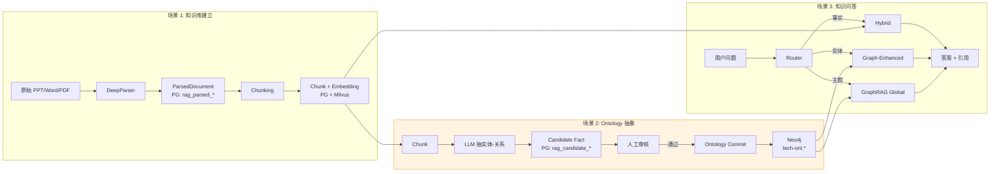

# SPEC - Mate Platform RAG 技术架构（完整版）

> 版本：v1.0 | 日期：2026-07-27 | 模块：TECH-RAG 全栈 | 状态：架构定稿
>
> **核心承诺**：将 **FlowRAG 思路（深度文档解析）** 与 **GraphRAG 思路（实体抽取+社区+全局检索）** 全部纳入平台，
> **以独立模块、同源代码仓库、版本化 API、事件驱动** 的方式实现 **两个范式可独立更新、独立发版、独立回滚**。
>
> **关联文档**：
> - 既有规范 `TECH-RAG/docs/SPEC-TECH-RAG-RAG引擎API规范_v1.0-20260716.md`（v1 基础 API，本文档为 v2 扩展）
> - 路线图 `docs/superpowers/specs/2026-07-27-rag-graphrag-best-solution.md`（v1 方案）
> - 知识库消费侧 `docs/prd/APP-KB/PRD-APP-KB-知识库_v1.1-20260722.md`
> - DeerFlow 协同 `docs/superpowers/specs/2026-07-26-ontology-native-deerflow-integration-and-migration-plan.md`

---

## 0. TL;DR

| 维度 | 决策 |
|---|---|
| 平台 RAG 栈 | **5 大模块 + 1 个统一路由**：DeepParser（FlowRAG 思路）/ GraphRAG（Microsoft 思路）/ Knowledge Engineering / Hybrid & Graph-Enhanced / Router & Citation |
| 借鉴对象 | **RAGFlow（DeepDoc 解析思想）** + **Microsoft GraphRAG（Leiden + Map-Reduce 摘要）** + 既有 Hybrid Retrieve / Graph-Enhanced |
| 实现语言 | **Java 21 + Spring AI Alibaba 1.1.2 全栈**（守住 v1.2 决策） |
| 借鉴方式 | **算法级重写 + 设计思想借鉴**，**不复制任何开源代码** |
| 模块独立性 | **Maven 多模块 + 事件驱动 + 版本化 API + 独立 Flyway schema**，可独立发版/回滚 |
| 法律风险 | 🟢 低（仅算法/思想借鉴，AGPL-3.0 / MIT / Apache 2.0 合规边界见 §11） |
| 数据落点 | **4 个家 + 3 个工具**：PostgreSQL 17 / MinIO / Milvus 2.5 / Neo4j 5.x + Redis / Kafka / TECH-OBS |
| 核心场景 | S1 知识库建立（PPT/Word/PDF 精准切片）→ S2 Ontology 抽象（LLM 抽取+审核）→ S3 知识问答 |
| 差异化 | **Knowledge Engineering 流水线**——AI 抽 Ontology + 人工审核 + 正式入库，是别人抄不走的护城河 |

---

## 1. 架构原则（5 条铁律）

| # | 原则 | 说明 |
|---|---|---|
| P1 | **同源代码 + 多 Maven 模块** | 5 大模块在同一 git 仓库，但编译产物是 5 个独立 jar，可独立部署 |
| P2 | **事件驱动解耦** | 模块间不直接调用，全部通过 Kafka 事件 + 版本化 REST API |
| P3 | **数据所有权清晰** | 每个模块拥有自己的 PG schema / Milvus collection / Neo4j 标签前缀，跨模块不直查 |
| P4 | **Feature Flag 控制** | 每个模块支持按租户/知识库动态开关，灰度上线 |
| P5 | **回滚必须原子** | 一次发版只动一个模块，DB 变更用 Flyway 向前兼容，Neo4j schema 用 label 前缀隔离 |

---
## 2. 整体架构图

### 2.1 模块视图（5 大模块 + 1 路由）

```mermaid
flowchart TB
    subgraph 消费侧
        APP1[APP-KB<br/>知识库]
        APP2[APP-COPILOT<br/>智能助手]
        APP3[APP-DW<br/>数字员工]
        APP4[APP-ARCH<br/>架构中心]
        APP5[APP-MCPHUB<br/>MCP Server]
    end

    subgraph 统一入口
        ROUTER[RetrievalRouter<br/>统一检索入口<br/>AUTO 路由]
    end

    subgraph 模块A[模块 A: DeepParser<br/>FlowRAG 思路]
        DP1[LayoutAnalyzer]
        DP2[OcrEngine]
        DP3[TableExtractor]
        DP4[ReadingOrderResolver]
        DP5[ParsingPipeline]
    end

    subgraph 模块B[模块 B: GraphRAG<br/>Microsoft 思路]
        GR1[GraphBuilder]
        GR2[CommunityDetector<br/>Leiden]
        GR3[CommunitySummarizer<br/>Map-Reduce]
        GR4[LocalSearch]
        GR5[GlobalSearch]
    end

    subgraph 模块C[模块 C: Knowledge Engineering ⭐]
        KE1[EntityExtractor]
        KE2[RelationExtractor]
        KE3[CandidateFactService]
        KE4[ReviewWorkflow]
        KE5[OntologyCommitService]
    end

    subgraph 模块D[模块 D: Hybrid & Graph-Enhanced<br/>既有能力]
        HE1[HybridSearch<br/>向量+BM25+Rerank]
        HE2[GraphEnhancedSearch<br/>基于 Ontology 实体链接]
    end

    subgraph 模块E[模块 E: Citation & Evidence]
        CE1[CitationBuilder]
        CE2[EvidenceChain]
        CE3[CitationStore]
    end

    subgraph 基础设施
        LLMGW[TECH-LLMGW]
        ONT[TECH-ONT<br/>Neo4j 5.x]
        IAM[TECH-IAM]
        OBS[TECH-OBS]
        PG[(PostgreSQL 17<br/>4 个 schema 隔离)]
        MINIO[(MinIO<br/>对象存储)]
        MILVUS[(Milvus 2.5<br/>向量库)]
        REDIS[(Redis 7.4<br/>缓存)]
        KAFKA[(Kafka<br/>事件流)]
    end

    APP1 --> ROUTER
    APP2 --> ROUTER
    APP3 --> ROUTER
    APP4 --> ROUTER
    APP5 --> ROUTER
    APP1 -->|上传文档| DP5
    APP1 -->|审核候选| KE4

    ROUTER -->|FACTUAL| HE1
    ROUTER -->|ENTITY| HE2
    ROUTER -->|THEMATIC| GR5
    ROUTER -.结果.-> CE1

    DP5 -->|ParsedDocument| GR1
    DP5 -->|ParsedDocument| KE1
    KE5 -->|变更事件| HE2
    KE5 -->|变更事件| GR2

    HE1 --> MILVUS
    HE1 --> PG
    HE2 --> ONT
    HE2 --> PG
    GR1 --> ONT
    GR2 --> ONT
    GR3 --> PG
    GR4 --> ONT
    GR4 --> PG
    GR5 --> PG
    GR5 --> MILVUS
    KE1 --> LLMGW
    KE3 --> PG
    KE4 --> PG
    KE5 --> ONT
    CE1 --> PG
    CE3 --> MINIO
    CE3 --> PG

    DP5 --> MINIO
    DP5 --> PG
    DP5 --> LLMGW
    GR3 --> LLMGW

    KAFKA -.events.-> DP5
    KAFKA -.events.-> GR2
    KAFKA -.events.-> KE1
    KAFKA -.events.-> ROUTER

    style 模块C fill:#fff4e1,stroke:#ff9900,stroke-width:2px
    style KE1 fill:#ffe1cc
    style KE3 fill:#ffe1cc
    style KE4 fill:#ffe1cc
    style KE5 fill:#ffe1cc
    style ONT fill:#e1f5ff
```



### 2.2 数据流视图（3 场景流水线）



### 2.3 模块独立性视图

```mermaid
flowchart LR
    subgraph TECH-RAG[tech-rag (Maven 多模块项目)]
        M0[tech-rag-common<br/>公共 DTO/异常/工具]
        M1[tech-rag-deepparser<br/>模块 A: FlowRAG]
        M2[tech-rag-graphrag<br/>模块 B: GraphRAG]
        M3[tech-rag-knowledge-eng<br/>模块 C: KE]
        M4[tech-rag-retrieval<br/>模块 D: Hybrid + GE]
        M5[tech-rag-citation<br/>模块 E: Citation]
        M6[tech-rag-router<br/>统一路由]
    end

    M0 --> M1
    M0 --> M2
    M0 --> M3
    M0 --> M4
    M0 --> M5
    M0 --> M6
    M6 --> M4
    M6 --> M2
    M1 -.Kafka.-> M2
    M1 -.Kafka.-> M3
    M3 -.Kafka.-> M2
    M3 -.Kafka.-> M4

    style M1 fill:#e1ffe1
    style M2 fill:#e1e1ff
    style M3 fill:#ffe1e1
    style M4 fill:#f0f0f0
    style M5 fill:#f0f0f0
    style M6 fill:#fff4e1
```

---

## 3. 模块详细设计

### 3.1 模块 A：DeepParser（FlowRAG 思路）

**Maven 坐标**：`com.metaplatform:tech-rag-deepparser:1.x.0`
**借鉴对象**：RAGFlow DeepDoc（**仅算法/设计思想，零代码复制**）
**协议合规**：Apache 2.0（PDFBox/Tika/onnxruntime）+ Apache 2.0 模型权重

#### 3.1.1 职责

| 职责 | 说明 |
|---|---|
| 多格式文档解析 | PPT / Word / PDF / Excel / Markdown / 图片 |
| 版面分析 | 标题/段落/列表/表格/图注检测 |
| OCR | 扫描件、PaddleOCR via onnxruntime-java |
| 表格抽取 | TableStructureRecognizer 模型（PubTabNet） |
| 阅读顺序还原 | 中英文版式自适应 |
| 解析后结构化输出 | ParsedDocument（JSON） |

#### 3.1.2 包结构

```
com.metaplatform.rag.deepparser/
├── DeepParserService.java              # 总入口（编排）
├── layout/
│   ├── LayoutAnalyzer.java             # 版面分析
│   ├── ReadingOrderResolver.java       # 阅读顺序
│   └── BoundingBox.java
├── ocr/
│   ├── OcrEngine.java                  # 抽象
│   ├── PaddleOcrEngine.java            # PaddleOCR via onnxruntime
│   └── OcrResult.java
├── table/
│   ├── TableExtractor.java
│   ├── TableStructureRecognizer.java   # PubTabNet
│   └── TableDto.java
├── reader/
│   ├── PdfReader.java                  # PDFBox
│   ├── PptxReader.java                 # Apache POI
│   ├── DocxReader.java                 # POI + docx4j
│   ├── ExcelReader.java                # POI
│   ├── MarkdownReader.java
│   └── ImageReader.java                # 直接 OCR
├── pipeline/
│   ├── ParsingPipeline.java
│   ├── ParsedDocument.java
│   ├── ParsedSection.java
│   └── ParsedTable.java
└── config/
    ├── DeepParserProperties.java       # @ConfigurationProperties
    └── DeepParserAutoConfiguration.java
```

#### 3.1.3 数据模型

```sql
-- Schema: rag_parser
CREATE SCHEMA IF NOT EXISTS rag_parser;

CREATE TABLE rag_parser.parsed_document (
    id              BIGSERIAL PRIMARY KEY,
    doc_id          VARCHAR(64) NOT NULL UNIQUE,
    kb_id           VARCHAR(64) NOT NULL,
    tenant_id       VARCHAR(64) NOT NULL,
    parser_version  VARCHAR(20) NOT NULL,
    format          VARCHAR(20) NOT NULL,
    sections        JSONB NOT NULL,
    raw_metadata    JSONB,
    parse_status    VARCHAR(20) NOT NULL,
    error_message   TEXT,
    parse_latency_ms INTEGER,
    created_at      TIMESTAMPTZ DEFAULT now(),
    updated_at      TIMESTAMPTZ DEFAULT now()
);
CREATE INDEX idx_parsed_kb ON rag_parser.parsed_document(kb_id, tenant_id);

-- 解析任务表（异步解析用）
CREATE TABLE rag_parser.parse_task (
    id              BIGSERIAL PRIMARY KEY,
    doc_id          VARCHAR(64) NOT NULL,
    minio_path      VARCHAR(500) NOT NULL,
    format          VARCHAR(20) NOT NULL,
    options         JSONB,
    status          VARCHAR(20) NOT NULL,
    priority        SMALLINT DEFAULT 5,
    started_at      TIMESTAMPTZ,
    completed_at    TIMESTAMPTZ,
    error_message   TEXT,
    created_at      TIMESTAMPTZ DEFAULT now()
);
```

#### 3.1.4 API 合约

```http
POST /api/v1/rag/parser/documents/{docId}/parse
Content-Type: application/json
{
  "parser": "DEEP",
  "options": { "ocrEnabled": true, "tableExtraction": true, "language": "zh-CN" }
}
→ 202 Accepted { "taskId": "uuid", "status": "PENDING" }

GET /api/v1/rag/parser/tasks/{taskId}
→ 200 OK { "status": "DONE", "parsedDocId": "...", "latencyMs": 3200 }

GET /api/v1/rag/parser/documents/{docId}
→ 200 OK ParsedDocument

POST /api/v1/rag/parser/documents/{docId}/reparse
→ 202 Accepted
```

#### 3.1.5 发布事件

```json
// Topic: rag.parser.document.parsed.v1
{
  "eventId": "uuid",
  "eventType": "DocumentParsed",
  "version": "1.0",
  "occurredAt": "2026-07-27T...",
  "tenantId": "...",
  "kbId": "...",
  "docId": "...",
  "parserVersion": "1.2.0",
  "parseStatus": "SUCCESS",
  "sectionCount": 24,
  "tableCount": 5,
  "chunkIds": ["c-001", "c-002", ...]
}
```

#### 3.1.6 独立发版约束

- **DB 变更**：`rag_parser.*` schema 下的所有表由本模块单独 Flyway 脚本管理
- **API 版本**：URL 前缀 `/api/v1/rag/parser/`，breaking change 升 `/v2/`
- **依赖**：仅依赖 `tech-rag-common` + 外部库
- **不依赖**：其他 RAG 模块（解耦）

---

### 3.2 模块 B：GraphRAG（Microsoft GraphRAG 思路）

**Maven 坐标**：`com.metaplatform:tech-rag-graphrag:1.x.0`
**借鉴对象**：Microsoft GraphRAG（**MIT，仅算法/设计借鉴**）
**协议合规**：MIT（仅思想）+ LGPL 2.1（JGraphT，仅 dynamic-link）+ 自研 Leiden

#### 3.2.1 职责

| 职责 | 说明 |
|---|---|
| Graph Builder | Chunk → 实体-关系 → Neo4j（`rag_*` 标签前缀） |
| Community Detector | Leiden 算法（自研或 JGraphT） |
| Community Summarizer | Map-Reduce 风格 LLM 摘要 |
| Local Search | 实体聚焦检索 |
| Global Search | 社区摘要检索 |
| DRIFT Search | Local + Global 混合推理（Phase 2） |

#### 3.2.2 包结构

```
com.metaplatform.rag.graphrag/
├── GraphRAGService.java
├── builder/
│   ├── GraphBuilder.java
│   ├── EntityExtractor.java
│   ├── RelationExtractor.java
│   └── ExtractionPromptTemplate.java
├── community/
│   ├── CommunityDetector.java
│   ├── LeidenAlgorithm.java
│   ├── CommunityHierarchy.java
│   └── Community.java
├── summary/
│   ├── CommunitySummarizer.java
│   ├── SummaryGenerator.java
│   └── SummaryReducer.java
├── search/
│   ├── LocalSearch.java
│   ├── GlobalSearch.java
│   ├── DriftSearch.java
│   └── SearchMode.java
├── storage/
│   ├── GraphNode.java
│   ├── GraphEdge.java
│   └── Neo4jGraphStore.java
├── incremental/
│   ├── IncrementalUpdater.java
│   └── DiffCalculator.java
└── config/
    ├── GraphRAGProperties.java
    └── GraphRAGAutoConfiguration.java
```

#### 3.2.3 Neo4j 数据模型（独立 label 前缀）

| Label | 字段 | 与 Ontology 的关系 |
|---|---|---|
| `rag_chunk` | id, doc_id, kb_id, content, position | 与 Ontology 概念无关 |
| `rag_entity` | id, name, type, description, embedding | 可桥接 Ontology 概念（可选） |
| `rag_community` | id, level, parent_id, summary, summary_embedding | 无 |
| `rag_document` | id, kb_id, title, source | 无 |

**关系类型**：`rag_mentions` / `rag_related_to` / `rag_belongs_to` / `rag_contains` / `rag_part_of`

**与 Ontology 节点的关系**：
- **严格隔离**：`rag_*` Label 永远不与 `tech-ont.*` 混用
- **桥接原则**：通过 `kbId.ontologyConceptCode` 显式配置桥接，自动桥接**禁止**

#### 3.2.4 PostgreSQL 数据模型

```sql
-- Schema: rag_graphrag
CREATE SCHEMA IF NOT EXISTS rag_graphrag;

CREATE TABLE rag_graphrag.community_summary (
    id              BIGSERIAL PRIMARY KEY,
    community_id    VARCHAR(64) NOT NULL,
    level           SMALLINT NOT NULL,
    kb_id           VARCHAR(64) NOT NULL,
    tenant_id       VARCHAR(64) NOT NULL,
    summary         TEXT NOT NULL,
    summary_emb_id  VARCHAR(64),
    entity_count    INTEGER,
    chunk_count     INTEGER,
    summary_model   VARCHAR(50),
    created_at      TIMESTAMPTZ DEFAULT now(),
    updated_at      TIMESTAMPTZ DEFAULT now(),
    UNIQUE(community_id, level, kb_id)
);

CREATE TABLE rag_graphrag.extraction_task (
    id              BIGSERIAL PRIMARY KEY,
    doc_id          VARCHAR(64) NOT NULL,
    kb_id           VARCHAR(64) NOT NULL,
    tenant_id       VARCHAR(64) NOT NULL,
    status          VARCHAR(20) NOT NULL,
    extracted_entities INTEGER DEFAULT 0,
    extracted_relations INTEGER DEFAULT 0,
    prompt_version  VARCHAR(20),
    model           VARCHAR(50),
    error_message   TEXT,
    started_at      TIMESTAMPTZ,
    completed_at    TIMESTAMPTZ
);
```

#### 3.2.5 API 合约

```http
POST /api/v1/rag/graphrag/rebuild/{kbId}
POST /api/v1/rag/graphrag/refresh/{docId}

POST /api/v1/rag/graphrag/retrieve/local
{
  "query": "违约责任条款如何界定？",
  "kbIds": ["kb-contracts"],
  "topK": 10,
  "expandDepth": 2
}
→ 200 OK { "results": [...], "graphContext": [...] }

POST /api/v1/rag/graphrag/retrieve/global
{
  "query": "Q3 主要风险点是什么？",
  "kbIds": ["kb-finance-2024"],
  "topK": 5,
  "communityLevel": 1
}
→ 200 OK { "answer": "...", "communities": [...], "citations": [...] }

GET /api/v1/rag/graphrag/communities/{kbId}?level=1
→ 200 OK { "communities": [...] }
```

#### 3.2.6 发布事件

```json
// Topic: rag.graphrag.graph.updated.v1
{
  "eventId": "uuid",
  "eventType": "GraphUpdated",
  "version": "1.0",
  "occurredAt": "...",
  "tenantId": "...",
  "kbId": "...",
  "docId": "...",
  "addedEntities": 23,
  "addedRelations": 41,
  "affectedCommunities": 3
}
```

---

### 3.3 模块 C：Knowledge Engineering ⭐（护城河）

**Maven 坐标**：`com.metaplatform:tech-rag-knowledge-eng:1.x.0`
**借鉴对象**：Microsoft GraphRAG 抽取 Prompt 设计（**MIT，仅借鉴思路**）
**协议合规**：自研 + 借鉴思路

#### 3.3.1 职责

| 职责 | 说明 |
|---|---|
| 实体/关系抽取 | LLM 从 Chunk 抽取 Candidate Fact |
| 候选事实管理 | PG 持久化、状态机 |
| 人工审核工作流 | 单审 / 批量审 / 角色权限 |
| Ontology 提交 | 通过 TECH-ONT API 提交 |
| Prompt 迭代 A/B | 模板版本管理、效果评估 |
| 反馈反哺 | 拒绝样本用于 Prompt 优化 |

#### 3.3.2 包结构

```
com.metaplatform.rag.knowledgeeng/
├── KnowledgeEngineeringService.java
├── extraction/
│   ├── EntityExtractor.java
│   ├── RelationExtractor.java
│   ├── ExtractionPipeline.java
│   └── ExtractionContext.java
├── candidate/
│   ├── CandidateFact.java
│   ├── CandidateFactRepository.java
│   ├── CandidateFactService.java
│   └── CandidateStatus.java
├── review/
│   ├── ReviewTaskService.java
│   ├── ReviewWorkflow.java
│   ├── ReviewerAssignment.java
│   └── ReviewDecision.java
├── ontology/
│   ├── OntologyCommitService.java
│   ├── OntologyCommitClient.java
│   └── CommitResult.java
├── prompt/
│   ├── PromptTemplateService.java
│   ├── PromptVersion.java
│   ├── PromptExperiment.java
│   └── PromptMetrics.java
└── config/
    ├── KnowledgeEngProperties.java
    └── KnowledgeEngAutoConfiguration.java
```

#### 3.3.3 PostgreSQL 数据模型

```sql
-- Schema: rag_ke
CREATE SCHEMA IF NOT EXISTS rag_ke;

CREATE TABLE rag_ke.extraction_task (
    id                BIGSERIAL PRIMARY KEY,
    doc_id            VARCHAR(64) NOT NULL,
    kb_id             VARCHAR(64) NOT NULL,
    tenant_id         VARCHAR(64) NOT NULL,
    chunk_ids         TEXT[],
    status            VARCHAR(20) NOT NULL,
    prompt_version    VARCHAR(20) NOT NULL,
    model             VARCHAR(50) NOT NULL,
    extracted_count   INTEGER DEFAULT 0,
    error_message     TEXT,
    started_at        TIMESTAMPTZ,
    completed_at      TIMESTAMPTZ,
    created_at        TIMESTAMPTZ DEFAULT now()
);

CREATE TABLE rag_ke.candidate_fact (
    id                BIGSERIAL PRIMARY KEY,
    task_id           BIGINT REFERENCES rag_ke.extraction_task(id),
    tenant_id         VARCHAR(64) NOT NULL,
    fact_type         VARCHAR(20) NOT NULL,
    payload           JSONB NOT NULL,
    confidence        DECIMAL(4,3) NOT NULL,
    source_chunk_ids  TEXT[] NOT NULL,
    source_doc_ids    TEXT[],
    status            VARCHAR(20) NOT NULL DEFAULT 'PENDING',
    ontology_id       VARCHAR(64),
    rejection_reason  TEXT,
    created_at        TIMESTAMPTZ DEFAULT now(),
    decided_at        TIMESTAMPTZ,
    decided_by        VARCHAR(64)
);
CREATE INDEX idx_candidate_status ON rag_ke.candidate_fact(status, tenant_id);
CREATE INDEX idx_candidate_payload ON rag_ke.candidate_fact USING GIN (payload jsonb_path_ops);

CREATE TABLE rag_ke.review_task (
    id                BIGSERIAL PRIMARY KEY,
    tenant_id         VARCHAR(64) NOT NULL,
    candidate_ids     BIGINT[] NOT NULL,
    assignee          VARCHAR(64),
    batch_id          VARCHAR(64),
    status            VARCHAR(20) NOT NULL,
    sla_due_at        TIMESTAMPTZ,
    created_at        TIMESTAMPTZ DEFAULT now(),
    closed_at         TIMESTAMPTZ
);

CREATE TABLE rag_ke.prompt_template (
    id                BIGSERIAL PRIMARY KEY,
    name              VARCHAR(50) NOT NULL,
    version           VARCHAR(20) NOT NULL,
    template          TEXT NOT NULL,
    variables         JSONB,
    is_active         BOOLEAN DEFAULT false,
    metrics           JSONB,
    created_at        TIMESTAMPTZ DEFAULT now(),
    created_by        VARCHAR(64),
    UNIQUE(name, version)
);

CREATE TABLE rag_ke.prompt_experiment (
    id                BIGSERIAL PRIMARY KEY,
    name              VARCHAR(100) NOT NULL,
    template_a        VARCHAR(50) NOT NULL,
    template_b        VARCHAR(50) NOT NULL,
    traffic_split     DECIMAL(3,2),
    status            VARCHAR(20) NOT NULL,
    metrics_a         JSONB,
    metrics_b         JSONB,
    winner            VARCHAR(50),
    started_at        TIMESTAMPTZ,
    concluded_at      TIMESTAMPTZ
);
```

#### 3.3.4 API 合约

```http
POST /api/v1/rag/ke/extraction-tasks
{ "docId": "...", "kbId": "...", "promptVersion": "1.0" }
→ 202 Accepted { "taskId": "uuid" }

GET /api/v1/rag/ke/candidates?status=PENDING&kbId=...&page=1
→ 200 OK { "items": [...], "total": 123 }

POST /api/v1/rag/ke/candidates/{id}/approve
POST /api/v1/rag/ke/candidates/{id}/reject
POST /api/v1/rag/ke/candidates/batch-approve
POST /api/v1/rag/ke/candidates/{id}/commit

GET /api/v1/rag/ke/review-tasks?assignee=me&status=OPEN
POST /api/v1/rag/ke/prompts
```

#### 3.3.5 发布事件

```json
// Topic: rag.ke.candidate.created.v1
{
  "eventId": "uuid",
  "eventType": "CandidateFactCreated",
  "version": "1.0",
  "tenantId": "...",
  "candidateId": "...",
  "factType": "ENTITY",
  "confidence": 0.92
}

// Topic: rag.ke.ontology.committed.v1
{
  "eventId": "uuid",
  "eventType": "OntologyCommitted",
  "version": "1.0",
  "tenantId": "...",
  "kbId": "...",
  "ontologyId": "...",
  "conceptCode": "CUSTOMER_LIFECYCLE",
  "operation": "CREATE",
  "committedBy": "..."
}
```

#### 3.3.6 与 Ontology 的边界

| Knowledge Engineering 职责 | TECH-ONT 职责 |
|---|---|
| 抽 Candidate Fact | 管理 Concept/Relation/Attribute |
| 人工审核 | Schema 校验、版本控制 |
| 调用 TECH-ONT API 提交 | 接受提交、影响分析、版本对比 |
| Prompt 管理 | 不涉及 |
| A/B 实验 | 不涉及 |

**关键约束**：Knowledge Engineering **永远不直接写 Neo4j**，必须通过 TECH-ONT 提交。这与 DeerFlow 集成时的红线一致（"LLM 不写 Ontology"）。

---

### 3.4 模块 D：Hybrid & Graph-Enhanced（既有能力）

**Maven 坐标**：`com.metaplatform:tech-rag-retrieval:1.x.0`
**状态**：✅ 已有，本架构中**保持不变**，仅增强

#### 3.4.1 职责

| 职责 | 说明 |
|---|---|
| Hybrid Retrieve | 向量（Milvus）+ BM25 + Rerank |
| Graph-Enhanced | 基于 Ontology 实体链接 + 1~3 跳扩展 |
| Multi-KB 检索 | 跨知识库联邦检索 |
| Chunking | 已有，多策略切片 |

#### 3.4.2 与新模块的关系

- **增强点 1**：Graph-Enhanced 订阅 `rag.ke.ontology.committed` 事件，本地缓存自动失效
- **增强点 2**：Hybrid Retrieve 订阅 `rag.parser.document.parsed` 事件，触发向量索引重建
- **增强点 3**：Router 调用本模块的 FACTUAL / ENTITY 检索

### 3.5 模块 E：Citation & Evidence

**Maven 坐标**：`com.metaplatform:tech-rag-citation:1.x.0`
**状态**：✅ 已有，本架构中**强化为多层 Evidence**

#### 3.5.1 职责

| 职责 | 说明 |
|---|---|
| Citation 生成 | chunk / sentence / entity / relation 多层级 |
| Evidence Chain | 答案 → 声明 → 引用链 |
| 可视化支持 | 与 AntV X6 集成 |

#### 3.5.2 数据模型

```sql
-- Schema: rag_citation
CREATE SCHEMA IF NOT EXISTS rag_citation;

CREATE TABLE rag_citation.citation (
    id                BIGSERIAL PRIMARY KEY,
    claim_id          VARCHAR(64) NOT NULL,
    citation_level    VARCHAR(20) NOT NULL,
    source_doc_id     VARCHAR(64) NOT NULL,
    page_number       INTEGER,
    section_id        VARCHAR(64),
    text_snippet      TEXT,
    bbox              JSONB,
    entity_refs       JSONB,
    relation_refs     JSONB,
    confidence        DECIMAL(4,3),
    created_at        TIMESTAMPTZ DEFAULT now()
);
CREATE INDEX idx_citation_claim ON rag_citation.citation(claim_id);
```

### 3.6 模块 F：RetrievalRouter（统一入口）

**Maven 坐标**：`com.metaplatform:tech-rag-router:1.x.0`
**状态**：🆕 新建

#### 3.6.1 职责

| 职责 | 说明 |
|---|---|
| 统一 API | `/api/v1/rag/retrieve` |
| 意图分类 | cheap LLM call 判定 FACTUAL/ENTITY/THEMATIC |
| 路由分发 | 根据 mode 调对应模块 |
| 结果融合 | 多路结果 RRF 融合 |

#### 3.6.2 路由策略

```java
public RetrievalResult route(QueryRequest req) {
    Mode mode = req.getMode() == Mode.AUTO
        ? classify(req.getQuery())
        : req.getMode();
    return switch (mode) {
        case FACTUAL  -> hybridSearch(req);
        case ENTITY   -> graphEnhancedSearch(req);
        case THEMATIC -> graphRAGService.globalSearch(req);
        case DRIFT    -> graphRAGService.driftSearch(req);
        case MIXED    -> rrf(hybridSearch(req), graphEnhanced(req), globalSearch(req));
    };
}
```

#### 3.6.3 数据模型（路由日志）

```sql
-- Schema: rag_router
CREATE SCHEMA IF NOT EXISTS rag_router;

CREATE TABLE rag_router.query_log (
    id                BIGSERIAL PRIMARY KEY,
    tenant_id         VARCHAR(64) NOT NULL,
    user_id           VARCHAR(64) NOT NULL,
    query             TEXT NOT NULL,
    mode_requested    VARCHAR(20) NOT NULL,
    mode_actual       VARCHAR(20) NOT NULL,
    modules_called    TEXT[],
    latency_ms        INTEGER,
    token_count       INTEGER,
    result_count      INTEGER,
    feedback          JSONB,
    created_at        TIMESTAMPTZ DEFAULT now()
);
CREATE INDEX idx_query_tenant ON rag_router.query_log(tenant_id, created_at DESC);
```

---

## 4. 跨模块事件协议（Kafka 主题清单）

| 主题 | 发布方 | 订阅方 | 用途 |
|---|---|---|---|
| `rag.parser.document.parsed.v1` | DeepParser | KE / GraphRAG / Retrieval | 文档解析完成，触发抽取/索引 |
| `rag.parser.document.parse-failed.v1` | DeepParser | KE | 解析失败，跳过抽取 |
| `rag.ke.candidate.created.v1` | KE | UI / Notification | 新候选事实待审核 |
| `rag.ke.ontology.committed.v1` | KE | Retrieval / GraphRAG / Router | Ontology 变更，缓存失效 |
| `rag.ke.prompt.activated.v1` | KE | Retrieval | Prompt 切换 |
| `rag.graphrag.graph.updated.v1` | GraphRAG | Router | 图谱更新 |
| `rag.graphrag.summary.regenerated.v1` | GraphRAG | Router | 摘要重建 |
| `rag.retrieval.index.rebuilt.v1` | Retrieval | Router | 索引重建完成 |
| `rag.router.query.completed.v1` | Router | OBS | 检索完成（用于监控） |

**事件 Schema 规范**（所有事件必须包含）：
```json
{
  "eventId": "uuid",
  "eventType": "PascalCase",
  "version": "1.0",
  "occurredAt": "ISO-8601",
  "tenantId": "...",
  "sourceModule": "tech-rag-deepparser|...",
  "payload": { ... }
}
```

**消费约定**：
- 至少一次（at-least-once）投递
- 消费者幂等（基于 `eventId`）
- 失败重试 3 次后入死信队列

---

## 5. 数据架构（4 个家 + 3 个工具）

### 5.1 数据归属

| 数据 | 存储 | Schema/Collection | 拥有模块 |
|---|---|---|---|
| 原始文件 | MinIO | `kb-{tenantId}/{kbId}/raw/{docId}.{ext}` | DeepParser |
| ParsedDocument | PostgreSQL | `rag_parser.*` | DeepParser |
| Chunk | PostgreSQL | `rag.*` (既有) | Retrieval |
| Chunk Embedding | Milvus | `rag_chunk_vec` | Retrieval |
| Candidate Fact | PostgreSQL | `rag_ke.*` | KE |
| Review Task | PostgreSQL | `rag_ke.*` | KE |
| Prompt Template | PostgreSQL | `rag_ke.*` | KE |
| Ontology Concept/Relation | Neo4j | `tech-ont.*` (既有) | TECH-ONT |
| GraphRAG 图（rag_*） | Neo4j | `rag_chunk/rag_entity/rag_community` | GraphRAG |
| Community Summary | PostgreSQL | `rag_graphrag.*` | GraphRAG |
| Citation | PostgreSQL | `rag_citation.*` | Citation |
| Query Log | PostgreSQL | `rag_router.*` | Router |
| 缓存 | Redis | `rag:*` | 各模块 |
| 事件 | Kafka | `rag.*.v1` | 各模块 |
| 可观测性 | TECH-OBS | - | 全模块 |

### 5.2 跨模块引用规则

| 规则 | 说明 |
|---|---|
| **跨模块不直查** | DeepParser 不查 KE 表；KE 不查 GraphRAG 表；通过事件解耦 |
| **跨模块不直写** | KE 不写 Neo4j；通过 TECH-ONT API |
| **共享 ID 而非共享数据** | `docId` / `kbId` / `chunkId` / `ontologyId` 作为业务键，跨模块引用 |
| **数据冗余有边界** | 只在事件 payload 中冗余关键 ID，不复制大字段 |

### 5.3 数据生命周期

| 数据 | 保留期 | 删除策略 |
|---|---|---|
| 原始文件 | 永久 | 软删 + 30 天回收 |
| ParsedDocument | 永久 | 跟随文档 |
| Chunk + Embedding | 永久 | 跟随文档重建 |
| Candidate Fact (PENDING) | 30 天 | 超期自动清理 |
| Candidate Fact (REJECTED) | 90 天 | 用于 Prompt 优化 |
| Prompt 模板 | 永久 | 只追加 |
| Ontology | 永久 | 版本化 |
| Query Log | 90 天 | 热-温-冷分层 |

---

## 6. API 总览

### 6.1 顶层 API 列表

| 模块 | API 前缀 | 方法 | 说明 |
|---|---|---|---|
| DeepParser | `/api/v1/rag/parser/*` | POST/GET | 文档解析 |
| GraphRAG | `/api/v1/rag/graphrag/*` | POST/GET | 图谱构建与检索 |
| KE | `/api/v1/rag/ke/*` | POST/GET | 抽取/审核/提交 |
| Retrieval | `/api/v1/rag/retrieve/*` | POST | 混合/图增强 |
| Citation | `/api/v1/rag/citation/*` | POST/GET | 引用管理 |
| Router | `/api/v1/rag/retrieve` | POST | 统一入口（带 mode） |
| KB 管理 | `/api/v1/rag/knowledge/*` | POST/GET | 知识库 CRUD |
| 文档管理 | `/api/v1/rag/documents/*` | POST/GET | 文档 CRUD |

### 6.2 统一检索 API（AUTO 模式）

```http
POST /api/v1/rag/retrieve
Authorization: Bearer {token}
Content-Type: application/json

{
  "query": "Q3 2024 财报里主要的风险点是什么？",
  "kbIds": ["kb-finance-2024"],
  "mode": "AUTO",
  "topK": 10,
  "includeGraphContext": true,
  "includeCitations": true
}

→ 200 OK
{
  "answer": "...",
  "mode": "GRAPHRAG_GLOBAL",
  "results": [
    { "chunkId": "...", "content": "...", "score": 0.87 }
  ],
  "evidences": [
    { "claim": "...", "citations": [...] }
  ],
  "traceId": "trace-xxx",
  "latencyMs": 1820,
  "tokenCount": 4500
}
```

---

## 7. 部署架构

### 7.1 部署模式

**单仓库多模块** + **单镜像多 fat-jar**：
- 同一 git 仓库
- 同一 Dockerfile（multi-stage build）
- 默认 1 个镜像启动时按需加载模块
- 高级部署可拆为多个独立部署单元

### 7.2 K8s 部署单元（生产推荐）

| 部署单元 | 包含模块 | 副本数 | 资源 |
|---|---|---|---|
| `tech-rag-core` | router + retrieval + citation | 2 | 2C/4G |
| `tech-rag-deepparser` | 模块 A | 2 | 4C/8G（CPU 密集） |
| `tech-rag-graphrag` | 模块 B | 2 | 4C/8G（计算密集） |
| `tech-rag-ke` | 模块 C | 2 | 2C/4G |

### 7.3 中间件依赖

| 中间件 | 版本 | 用途 |
|---|---|---|
| PostgreSQL | 17 | 主库（5 个 schema 隔离） |
| Neo4j | 5.x | Ontology + GraphRAG 图 |
| Milvus | 2.5 | 向量检索 |
| MinIO | - | 对象存储 |
| Redis | 7.4 | 缓存 |
| Kafka | 3.9 | 事件流 |
| Nacos | 3.0+ | 服务发现/配置/注册 |
| TECH-LLMGW | - | 统一 LLM 路由 |
| TECH-ONT | - | Ontology 服务 |
| TECH-IAM | - | 身份认证 |
| TECH-OBS | - | 可观测性 |

### 7.4 配置管理（Nacos）

```yaml
# tech-rag-deepparser.yaml
spring:
  datasource:
    url: jdbc:postgresql://pg:5432/metaplatform?currentSchema=rag_parser
deepparser:
  ocr:
    enabled: true
    model: paddle-ocr-v3
  table:
    enabled: true
    model: pubtabnet
  layout:
    model: paddle-layout-v2
  feature-flag:
    enabled-by-tenant:
      tenant-001: true
      tenant-002: false

# tech-rag-graphrag.yaml
graphrag:
  community:
    algorithm: leiden
    levels: 2
  summary:
    model: qwen-turbo
    max-tokens: 7000
  feature-flag:
    enabled-by-kb:
      kb-finance-2024: true
```

---

## 8. 演进路线图（独立发版策略）

### 8.1 版本约定

- **MAJOR**：不兼容 API 或数据 schema
- **MINOR**：向后兼容的功能新增
- **PATCH**：bug fix

模块独立发版示例：
- `tech-rag-deepparser: 1.2.0` 与 `tech-rag-graphrag: 1.0.5` 可同时存在
- 模块间依赖仅通过 Nacos 配置 + Kafka 事件，不绑版本

### 8.2 阶段路线图

| 阶段 | 模块 | 内容 | 工期 | 关键里程碑 |
|---|---|---|---|---|
| **R1** | 既有 | Hybrid + Graph-Enhanced 稳定 | 已完成 | - |
| **R2-A** | DeepParser | 基础 DeepDoc 思路 | 3 周 | PPT/PDF 解析可用 |
| **R2-B** | KE | 抽取 + 审核 + 提交 MVP | 3 周 | 第一个 Candidate 提交到 Ontology |
| **R3-A** | DeepParser | 强化（OCR + 表格） | 2 周 | 扫描件可解析 |
| **R3-B** | GraphRAG | Builder + Leiden + Local Search | 4 周 | 第一个社区检测 |
| **R4-A** | GraphRAG | Global Search + DRIFT | 3 周 | 主题检索可用 |
| **R4-B** | Router | AUTO 路由 + 智能分类 | 2 周 | 统一入口上线 |
| **R5** | 全模块 | 生产化（评估/监控/灰度） | 4 周 | 全模块可灰度 |

### 8.3 灰度策略

| 阶段 | 灰度维度 | 方式 |
|---|---|---|
| DeepParser | 按租户 → 按知识库 | Feature Flag |
| GraphRAG | 按知识库（高价值场景优先） | Feature Flag |
| KE | 按租户（专家资源有限） | Feature Flag |
| Router | 按租户 → 全部 | Feature Flag |

---

## 9. 风险与缓解

| ID | 风险 | 等级 | 缓解 |
|---|---|---|---|
| R1 | 模块间事件丢失/乱序 | 中 | 至少一次投递 + 幂等 + 监控告警 |
| R2 | DeepParser 复杂 PDF 解析失败 | 中 | Tika + PaddleOCR + 人工兜底 |
| R3 | GraphRAG 摘要 Token 成本爆炸 | 高 | 用 qwen-turbo + 限制社区数 + 摘要分级缓存 |
| R4 | LLM 抽取质量不稳定 | 高 | Prompt A/B + Few-shot + 拒绝样本反哺 |
| R5 | Neo4j 双写（Ontology + GraphRAG）冲突 | 中 | 严格 label 前缀隔离 + 不同 database |
| R6 | 模块独立发版时数据不一致 | 中 | 事件 schema 严格版本化 + 兼容期 |
| R7 | RAGFlow AGPL-3.0 法律风险 | 低 | 仅借鉴思想/算法，零代码复制 + 法务签字 |
| R8 | LEIDEN 自研实现踩坑 | 中 | JGraphT 备选 + 详细单测 |
| R9 | PaddleOCR Java 推理精度损失 | 中 | onnxruntime 直接加载模型，理论一致 |
| R10 | Prompt 模板管理混乱 | 中 | 版本号 + 实验框架 + 监控指标 |

---

## 10. 评估指标（KPI）

### 10.1 质量

| 场景 | 指标 | 现状基线 | R2 目标 | R4 目标 |
|---|---|---|---|---|
| S1（知识库建立） | 表格抽取 F1 | TBD | ≥ 0.85 | ≥ 0.92 |
| S1 | 阅读顺序准确率 | TBD | ≥ 0.80 | ≥ 0.90 |
| S2（Ontology 抽取） | 实体抽取 F1 | TBD | ≥ 0.75 | ≥ 0.85 |
| S2 | 关系抽取 F1 | TBD | ≥ 0.65 | ≥ 0.80 |
| S3（知识问答） | 事实型 Recall@10 | TBD | 不 regression | 不 regression |
| S3 | 实体型 Recall@10 | TBD | +10% | +20% |
| S3 | 主题型 Recall@10 | TBD | +30% | +50% |

### 10.2 性能

| 模块 | P95 延迟目标 |
|---|---|
| DeepParser（1MB PDF） | ≤ 3s |
| KE 抽取（单文档） | ≤ 30s |
| GraphRAG Builder（单文档） | ≤ 60s |
| GraphRAG Local Search | ≤ 1.5s |
| GraphRAG Global Search | ≤ 5s |
| Hybrid Search | ≤ 1s |
| Router AUTO 分类 | ≤ 200ms |

### 10.3 成本

| 项 | 目标 |
|---|---|
| Global Search 单查询 | ≤ 7000 token |
| 社区摘要（每 1000 文档一次性） | ≤ 5M token |
| 实体抽取（每 1000 文档一次性） | ≤ 2M token |

---

## 11. 法律合规边界

### 11.1 借鉴对象与协议

| 借鉴对象 | 协议 | 借鉴方式 | 合规 |
|---|---|---|---|
| RAGFlow DeepDoc | AGPL-3.0 | 仅借鉴算法/设计，零代码复制 | 🟢 |
| Microsoft GraphRAG | MIT | 仅借鉴算法/设计/Prompt 思路，零代码复制 | 🟢 |
| Leiden 算法 | 公开论文 | 自研实现或 JGraphT（LGPL 2.1 dynamic-link） | 🟢 |
| PaddleOCR 模型 | Apache 2.0 | 模型权重公开，onnxruntime 调用 | 🟢 |
| Apache PDFBox | Apache 2.0 | 直接使用 | 🟢 |
| Apache Tika | Apache 2.0 | 直接使用 | 🟢 |
| Apache POI | Apache 2.0 | 直接使用（PPTX/DOCX/XLSX） | 🟢 |
| JGraphT | LGPL 2.1 + EPL | dynamic-link | 🟢 |
| Spring AI Alibaba | Apache 2.0 | 直接使用 | 🟢 |

### 11.2 红线

- ❌ **禁止**：复制 RAGFlow / Microsoft GraphRAG 任何代码
- ❌ **禁止**：服务级包装调用 RAGFlow / Microsoft GraphRAG 实例
- ❌ **禁止**：引入 Python 运行时（守住 v1.2 决策）
- ❌ **禁止**：直接写 Neo4j 的 `tech-ont.*` Label（必须通过 TECH-ONT API）

### 11.3 法务签字位

- **Phase 1 启动前置条件**：`docs/legal/LEGAL_CLEARANCE-platform-rag-2026-07-27.md`
- **签字方**：法务 + 架构组 + 项目 Owner
- **覆盖内容**：借鉴清单 + 协议矩阵 + 风险声明

---

## 12. 文档维护

| 版本 | 日期 | 变更 |
|---|---|---|
| v1.0 | 2026-07-27 | 初版定稿 |

---

## 附录 A：Maven 多模块结构

```
tech-rag-parent/                     # Parent POM
├── pom.xml                          # 依赖管理、BOM
├── tech-rag-common/                 # 公共 DTO/异常/工具
├── tech-rag-deepparser/             # 模块 A: FlowRAG 思路
├── tech-rag-graphrag/               # 模块 B: GraphRAG 思路
├── tech-rag-knowledge-eng/          # 模块 C: Knowledge Engineering ⭐
├── tech-rag-retrieval/              # 模块 D: Hybrid + Graph-Enhanced
├── tech-rag-citation/               # 模块 E: Citation & Evidence
├── tech-rag-router/                 # 模块 F: 统一入口
├── tech-rag-app/                    # Spring Boot 启动器
└── tech-rag-bom/                    # BOM 供其他模块引用
```

## 附录 B：跨模块事件完整清单

| 主题 | 模式 | 描述 |
|---|---|---|
| `rag.parser.document.parsed.v1` | 发布/订阅 | 文档解析完成 |
| `rag.parser.document.parse-failed.v1` | 发布/订阅 | 解析失败 |
| `rag.ke.candidate.created.v1` | 发布/订阅 | 新候选事实 |
| `rag.ke.ontology.committed.v1` | 发布/订阅 | Ontology 提交 |
| `rag.ke.prompt.activated.v1` | 发布/订阅 | Prompt 切换 |
| `rag.graphrag.graph.updated.v1` | 发布/订阅 | 图谱更新 |
| `rag.graphrag.summary.regenerated.v1` | 发布/订阅 | 摘要重建 |
| `rag.retrieval.index.rebuilt.v1` | 发布/订阅 | 索引重建 |
| `rag.router.query.completed.v1` | 发布 | 查询完成（监控用） |

## 附录 C：参考资源

- Microsoft GraphRAG：https://github.com/microsoft/graphrag （MIT）
- RAGFlow：https://github.com/infiniflow/ragflow （AGPL-3.0，仅参考）
- Leiden 算法：Traag et al. 2019
- Spring AI Alibaba：https://github.com/alibaba/spring-ai-alibaba
- Apache PDFBox / Tika / POI
- JGraphT：https://jgrapht.org
- PaddleOCR：https://github.com/PaddlePaddle/PaddleOCR

---

**下一步行动**：

1. **本周**：法务启动 `LEGAL_CLEARANCE` 流程
2. **下周**：启动 Phase 0 基线评估（1 周）
3. **Phase 0 完成后**：根据基线数据决定 R2-A / R2-B 优先级
4. **本规范评审**：架构组 + 项目 Owner 签字

---

**相关 Review 入口**：
- 法务：`docs/legal/LEGAL_CLEARANCE-platform-rag-2026-07-27.md`（待创建）
- 架构组：本文件 §1 原则 + §8 路线图
- 项目 Owner：R2-A / R2-B 启动批准
