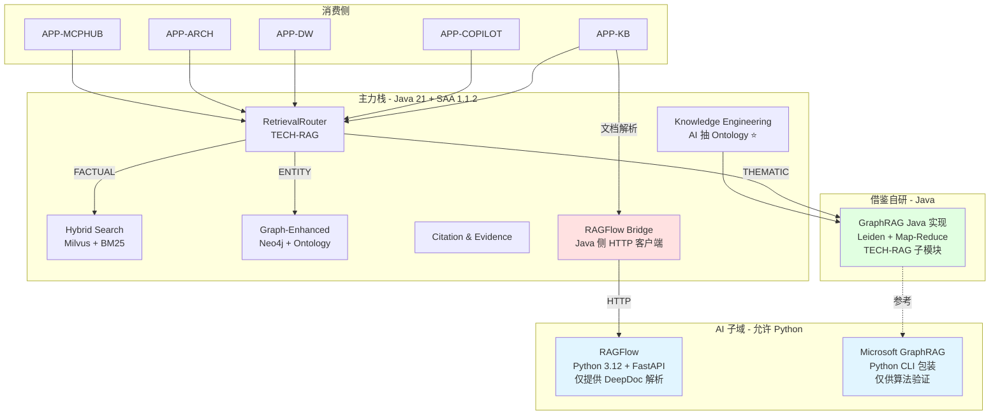

# SPEC - RAGFlow + Microsoft GraphRAG 集成方案（A 方案）

> 版本：v1.0 | 日期：2026-07-27 | 状态：方案定稿（**待法务签字后启动实施**）
>
> **本方案是 `2026-07-27-platform-rag-technical-architecture.md`（v1 全 Java 方案）的 v2 替代版**。
> 在 v2 技术栈决策（`2026-07-27-v2-tech-stack-decision.md`）下，将 RAGFlow 与 Microsoft GraphRAG 作为外部服务引入。
>
> **法务前置**：`docs/legal/LEGAL_CLEARANCE-ragflow-2026-07-27.md` 签字完成
> 签字前**不得**启动任何集成代码开发

---

## 0. TL;DR

| 维度 | 决策 |
|---|---|
| RAGFlow 引入范围 | **仅做文档解析（DeepDoc）**，不接管 RAG 检索 |
| Microsoft GraphRAG 引入范围 | **借鉴算法 + Prompt 设计 + Java 重写核心**（无现成"服务"可引入） |
| 部署方式 | Docker Compose（dev）/ K8s Sidecar（prod） |
| 集成入口 | TECH-RAG Router 通过 HTTP 桥接层调用 |
| 法律风险 | 🟡 中（AGPL-3.0，需法务签字） |
| 工期 | 启动 2 周（法务+部署） + 实施 4~6 周 |
| 投入 | 1 Java + 1 Python/DevOps + 0.5 法务支持 |

---

## 1. 引入策略（边界明确）

### 1.1 RAGFlow 引入边界

| 能力 | 是否引入 | 说明 |
|---|---|---|
| **DeepDoc 文档解析** | ✅ **核心引入** | PPT/Word/PDF/Excel/扫描件解析 |
| Hybrid Retrieval | ❌ 不用 | 用自研 Hybrid（已有） |
| GraphRAG 检索 | ❌ 不用 | 用自研 + 借鉴 GraphRAG 思路 |
| RAGFlow UI | ❌ 不用 | 嵌入 Mate Platform 自身前端 |
| RAGFlow 配置系统 | ❌ 不用 | Mate Platform KB 管理对接 |

**RAGFlow 定位**：**纯文档解析工具**，如同调用 Tesseract OCR 一样。

### 1.2 Microsoft GraphRAG 引入边界

**关键事实**：Microsoft GraphRAG 是**MIT 协议的 Python 库/参考实现**，**不是可部署的"服务"**。

| 引入方式 | 选择 | 说明 |
|---|---|---|
| **A. 自部署 Python 服务** | 🟡 可选 | 用 `graphrag` CLI 包装为 API |
| **B. 借鉴算法 + Java 重写** | ✅ **推荐** | 借鉴 Prompt 设计和算法，Java 重写核心 |
| **C. 集成社区第三方服务** | 🟡 风险 | 社区服务稳定性/合规不确定 |

**我的建议**：**B（Java 重写）** + **A（CLI 包装，仅供验证）**。

理由：
- B 守 v2 决策 P1（主力 Java）
- A 仅作为"参考实现"用于算法验证
- 一旦 B 验证完成，A 即可下线

### 1.3 借鉴清单（明确边界）

| 借鉴对象 | 借鉴内容 | 借鉴方式 | 风险 |
|---|---|---|---|
| RAGFlow | DeepDoc 解析思路（版面/表格/OCR） | Java 重写，**不**复制代码 | 🟢 |
| RAGFlow | Hybrid Retrieval 评分模型 | 借鉴设计，不复制代码 | 🟢 |
| Microsoft GraphRAG | Leiden + Map-Reduce 摘要 | 借鉴算法，Java 重写 | 🟢 |
| Microsoft GraphRAG | 实体抽取 Prompt 模板 | 借鉴设计，**重写**为 Java 字符串 | 🟢 |
| Microsoft GraphRAG | Local/Global/DRIFT 三模式 | 借鉴设计，Java 实现 | 🟢 |
| Leiden 算法论文 | 算法本身 | 自研实现（~500 行 Java） | 🟢 |

---

## 2. 整体架构（A 方案）

### 2.1 模块视图



### 2.2 关键架构决策

| 决策 | 方案 | 理由 |
|---|---|---|
| RAGFlow 部署方式 | K8s Deployment + Service（ClusterIP） | 内部服务，不对外 |
| RAGFlow 调用方式 | TECH-RAG 内 Java HTTP 客户端 | 简单、跨语言、可控 |
| 鉴权 | RAGFlow Internal Token（K8s Secret） | 与 DeerFlow 模式一致 |
| 失败降级 | RAGFlow 不可用 → 降级为 Tika 基础解析 | 避免单点 |
| GraphRAG 验证 | CLI 包仅用于"对比基线" | 验证 Java 实现的差距 |
| 法务隔离 | LEGAL_CLEARANCE 必须先签 | 不许代码先行 |

---

## 3. 部署架构

### 3.1 Docker Compose（开发环境）

```yaml
# 集成到 metaplatform docker-compose.yml
services:
  ragflow:
    image: ${RAGFLOW_IMAGE:-infiniflow/ragflow:v0.13.0}
    container_name: mate-ragflow
    ports:
      - "9385:9385"  # RAGFlow HTTP API
    volumes:
      - ragflow_data:/ragflow/data
    environment:
      - RAGFLOW_LICENSE_FILE=/ragflow/LICENSE
    networks:
      - mate-internal
    healthcheck:
      test: ["CMD", "curl", "-f", "http://localhost:9385/health"]
      interval: 30s
      timeout: 10s
      retries: 3
    deploy:
      resources:
        limits:
          cpus: '4'
          memory: 8G
```

### 3.2 K8s 部署（生产环境）

| 资源 | 配置 |
|---|---|
| Deployment | `mate-ragflow` |
| 副本数 | 2 |
| 资源 limits | 4 CPU / 8Gi |
| Service | ClusterIP |
| NetworkPolicy | 仅允许 `mate-tech-rag` namespace 访问 |
| ConfigMap | RAGFlow 配置 |
| Secret | RAGFlow API Token |
| PersistentVolume | 50Gi（数据） |

### 3.3 与 DeerFlow 部署的关系

| 组件 | Namespace | 端口 | 鉴权 |
|---|---|---|---|
| DeerFlow Gateway | `mate-deerflow` | 8001 (ClusterIP) | X-DeerFlow-Internal-Token |
| RAGFlow | `mate-ragflow` | 9385 (ClusterIP) | RAGFLOW_API_KEY |
| TECH-RAG | `mate-tech` | 8080 | TECH-IAM OAuth2 |

---

## 4. 集成桥接层设计（Java 侧）

### 4.1 模块位置

```
com.metaplatform.rag.bridge.ragflow/
├── RagFlowClient.java              # HTTP 客户端
├── RagFlowProperties.java          # Nacos 配置
├── RagFlowAutoConfiguration.java   # Spring Boot 自动装配
├── dto/
│   ├── ParseRequest.java
│   ├── ParseResponse.java
│   ├── ParseTaskStatus.java
│   └── ParsedDocumentDto.java
└── exception/
    ├── RagFlowUnavailableException.java
    └── RagFlowParseException.java
```

### 4.2 接口设计

```java
public interface RagFlowClient {
    /**
     * 提交文档解析任务（异步）
     */
    ParseTaskResponse submitParseTask(String docId, byte[] file, ParseOptions options);
    
    /**
     * 查询解析任务状态
     */
    ParseTaskStatus queryTaskStatus(String taskId);
    
    /**
     * 同步解析（短文档）
     */
    ParsedDocumentDto parseSync(byte[] file, ParseOptions options);
}
```

### 4.3 配置（Nacos）

```yaml
ragflow:
  base-url: http://ragflow.mate-ragflow.svc.cluster.local:9385
  api-key: ${RAGFLOW_API_KEY}
  timeout-ms: 30000
  stream-timeout-ms: 60000
  reconnect-timeout-ms: 60000
  fallback:
    enabled: true
    fallback-parser: TIKA_BASIC
  feature-flag:
    enabled-by-tenant:
      tenant-001: true
      tenant-002: false
```

### 4.4 降级策略

| 场景 | 降级路径 |
|---|---|
| RAGFlow 完全不可用 | Tika 基础解析（已有能力） |
| RAGFlow 部分能力不可用 | 部分解析 + 标记 |
| RAGFlow 响应超时 | 重试 1 次 → 标记 partial → 异步补全 |

---

## 5. API 合约（TECH-RAG 侧）

### 5.1 解析接口

```http
POST /api/v1/rag/parser/documents/{docId}/parse
{
  "parser": "RAGFLOW" | "DEEP" | "BASIC",
  "options": {
    "ocrEnabled": true,
    "tableExtraction": true,
    "language": "zh-CN"
  }
}
→ 202 Accepted
{
  "taskId": "uuid",
  "status": "PENDING"
}
```

### 5.2 状态查询

```http
GET /api/v1/rag/parser/tasks/{taskId}
→ 200 OK
{
  "taskId": "uuid",
  "status": "DONE",
  "parserUsed": "RAGFLOW",
  "parsedDocId": "...",
  "latencyMs": 3200
}
```

### 5.3 与现有 API 的关系

- 兼容既有 `POST /api/v1/rag/documents/{docId}/reparse`
- 新增 `parser: "RAGFLOW"` 选项
- 默认值：`RAGFLOW`（如启用）→ 否则 `DEEP` → 否则 `BASIC`

---

## 6. 数据模型（增量）

### 6.1 新增表

```sql
-- Schema: rag_bridge
CREATE SCHEMA IF NOT EXISTS rag_bridge;

-- RAGFlow 调用日志
CREATE TABLE rag_bridge.ragflow_call_log (
    id                BIGSERIAL PRIMARY KEY,
    task_id           VARCHAR(64) NOT NULL,
    doc_id            VARCHAR(64) NOT NULL,
    tenant_id         VARCHAR(64) NOT NULL,
    request_payload   JSONB,
    response_payload  JSONB,
    status            VARCHAR(20) NOT NULL,
    latency_ms        INTEGER,
    error_message     TEXT,
    created_at        TIMESTAMPTZ DEFAULT now()
);
CREATE INDEX idx_ragflow_call_tenant ON rag_bridge.ragflow_call_log(tenant_id, created_at DESC);

-- 降级事件日志
CREATE TABLE rag_bridge.fallback_event (
    id                BIGSERIAL PRIMARY KEY,
    doc_id            VARCHAR(64) NOT NULL,
    tenant_id         VARCHAR(64) NOT NULL,
    primary_parser    VARCHAR(20) NOT NULL,
    fallback_parser   VARCHAR(20) NOT NULL,
    reason            TEXT,
    created_at        TIMESTAMPTZ DEFAULT now()
);
```

### 6.2 与既有表的关系

| 既有表 | 关系 | 说明 |
|---|---|---|
| `rag_parser.parsed_document` | 1:1 继承 | RAGFlow 输出写入此表 |
| `rag.*` (chunk) | 下游 | RAGFlow 解析后触发既有 chunking |

---

## 7. 实施路线图

### Phase 0：法务与基础（2 周）

| 任务 | 负责 | 完成标志 |
|---|---|---|
| 法务过 `LEGAL_CLEARANCE` | 法务 | 签字 |
| 联系 InfiniFlow 商业方案 | 法务 + 项目 Owner | 报价邮件 |
| 锁定 RAGFlow 版本 | 架构组 | 选定 v0.13.0（或更新） |
| 与 RAGFlow 商业沟通 | 项目 Owner | 决策（用 / 不用） |

**Phase 0 硬性退出条件**：法务签字 + 商业方案明确。

### Phase 1：部署 + 桥接层（3 周）

| 任务 | 负责 | 工期 |
|---|---|---|
| RAGFlow Docker Compose 集成 | DevOps | 0.5 周 |
| RAGFlow K8s 部署 | DevOps | 1 周 |
| `RagFlowClient` Java 客户端 | Java | 1 周 |
| `RagFlowProperties` Nacos 配置 | Java | 0.5 周 |
| 降级逻辑（fallback to Tika） | Java | 0.5 周 |
| 健康检查 + 监控埋点 | Java | 0.5 周 |

### Phase 2：业务接入（2 周）

| 任务 | 负责 | 工期 |
|---|---|---|
| 与 `ParsedDocument` 表对接 | Java | 0.5 周 |
| 与 Chunking 流水线对接 | Java | 0.5 周 |
| 灰度发布（按租户） | Java + DevOps | 1 周 |
| 业务验证（10 份真实合同/财报） | 业务方 | 持续 |

### Phase 3：Microsoft GraphRAG 借鉴自研（4 周，可与 Phase 1/2 并行）

| 任务 | 负责 | 工期 |
|---|---|---|
| `graphrag` CLI 包装为 API | Python | 1 周（仅参考） |
| Java 侧 Leiden 自研 | Java | 2 周 |
| Java 侧 Map-Reduce 摘要 | Java + SAA | 2 周 |
| 与 Ontology 桥接 | Java | 1 周 |

### Phase 4：评估 + 调优（持续）

| 任务 | 负责 |
|---|---|
| 评估表抽取 F1 / 解析质量 | 算法工程师 |
| 评估 LLM Token 成本 | 算法工程师 |
| 季度复盘（v2 决策是否需要回退） | 架构组 |

---

## 8. 风险与缓解

| ID | 风险 | 等级 | 缓解 |
|---|---|---|---|
| R1 | AGPL-3.0 法务未通过 | 🟡 中 | 替代方案：Java 重写 DeepDoc（见 §9） |
| R2 | RAGFlow 商业方案成本高 | 🟡 中 | 评估"自研 vs 商业" ROI |
| R3 | RAGFlow 升级/协议变更 | 🟢 低 | 锁定版本 + 季度复盘 |
| R4 | 跨语言桥接层性能 | 🟢 低 | HTTP + 连接池，已验证 |
| R5 | RAGFlow 容器崩溃 | 🟢 低 | 降级到 Tika + 告警 |
| R6 | Python 运维能力 | 🟢 低 | v2 决策下已合法化 |
| R7 | LLM 抽取质量 | 🟡 中 | A/B 测试 + 反馈循环 |
| R8 | Leiden 自研实现踩坑 | 🟡 中 | JGraphT 备选 |

---

## 9. 替代方案（如果 RAGFlow 不能引入）

如果法务不通过 RAGFlow，可走 **A' 方案**：

| 组件 | 替代 |
|---|---|
| DeepDoc 解析 | Java 自研（PDFBox + Tika + onnxruntime + PaddleOCR） |
| RAGFlow Hybrid | 用自研（已有） |
| 工期 | +3~4 周 |
| 风险 | 自研 OCR 精度可能略低 |

**A' 方案实施路径**：参考 `2026-07-27-rag-graphrag-best-solution.md`（历史方案）。

---

## 10. 决策记录

| 字段 | 值 |
|---|---|
| 方案名称 | A 方案 - RAGFlow + GraphRAG 集成 |
| 决策日期 | 2026-07-27 |
| 决策人 | 项目 Owner |
| 评审方 | 架构组 + 法务 |
| 上层规范 | `2026-07-27-v2-tech-stack-decision.md` |
| 法务文件 | `docs/legal/LEGAL_CLEARANCE-ragflow-2026-07-27.md` |
| 实施启动 | 法务签字之日 |

---

## 11. 与历史文档的关系

| 文档 | 关系 |
|---|---|
| `2026-07-27-rag-graphrag-best-solution.md` | 📚 历史参考（v1 方案，部分思路仍可用） |
| `2026-07-27-platform-rag-technical-architecture.md` | ⚠️ **v1 架构作废**（全 Java 已被 v2 决策替代） |
| `2026-07-27-v2-tech-stack-decision.md` | ✅ **当前有效**（v2 决策基础） |
| 本文档 | ✅ **当前有效**（A 方案具体实施） |

---

**下一步行动**：
1. ⏸️ **暂停**：等法务过 `LEGAL_CLEARANCE`
2. ✅ **签字后**：启动 Phase 1（部署 + 桥接层）
3. 📊 **持续**：Phase 3 与 Phase 1/2 并行（GraphRAG Java 重写）