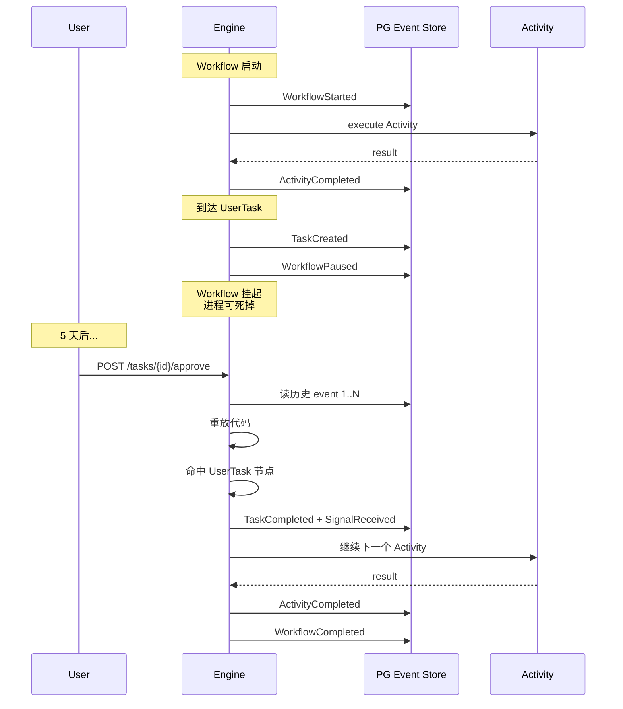

# Workflow 引擎 Path C — 总体规划（Master Synthesis）

> **状态**：2026-08-18 战略梳理完成 · **性质**：单一源文档（其他所有文件都是本文档的展开）
>
> **关联文档**：
> - 调研报告：`2026-08-18-workflow-engine-survey.md`
> - Talking Points：`2026-08-18-workflow-path-c-talking-points.md`
> - 借鉴清单（4 份）：Temporal / LangGraph / xstate / flowgram + xyflow（已落到 subagent outputs）
> - 项目记忆：`mp-workflow-path-c` + `mp-workflow-hitl-scenarios`
> - 反馈记忆：`feedback-python-native-preference`
>
> **关联 ADR**：ADR-0050（待起草）

---

## TL;DR（一段话讲完）

我们要做一个 **Python-native 的 Workflow 引擎**，**核心用户故事是 HITL**（Human-in-the-Loop），**不是 BPMN**。能力目标对标 n8n + Flowable + flowgram 三件套，但**借鉴设计 + Python 重写**（不翻译代码）、与 MatePlatform 现有的 `mate_platform/composition` cordis 内核协同。**3-4 人，6-12 月，4 个 HITL 场景是验收硬指标**。

---

## 一、战略决策（Strategic）

### 1.1 核心用户故事：**HITL，不是 BPMN**

| | 用户故事 |
|---|---|
| ✅ **核心** | **HITL**（Human-in-the-Loop）—— Workflow 节点挂起、等人决策、继续 |
| ❌ **非核心** | BPMN 标准兼容（最后做一个轻量转化层即可） |

**Why**：MatePlatform 是企业级 AI 平台，**审批可见 + 强制 audit + 合规** 是硬需求；BPMN 在内部不强制，外部对接做转化层即可。

**推论**：
1. **Path C 必须有 Event Sourcing**——不是借鉴 Temporal，是 HITL 硬约束（不做 = 不能挂起 = HITL 不能用）
2. **M0 PoC 必须包含 HITL 最小验证**（不是事后补）

### 1.2 Path C：Python-native 完全自研

| 路线 | 选/不选 | 原因 |
|---|---|---|
| **Path A** Service-Oriented 集成现成引擎 | ❌ | 异构引擎污染主代码库 |
| **Path B** 提炼算法内核 | ❌ | 工作量与 Path C 接近，价值小 |
| **Path C** Python-native 完全自研 | ✅ | Python 一致性 + 借鉴设计 |
| Path D 从零造引擎 | ❌ | NIH 反模式 |

**约束**：3-4 人 / 6-12 月 / 团队有能力消化借鉴清单。

### 1.3 借鉴设计 ≠ 翻译代码

| | 借鉴 | 翻译 |
|---|---|---|
| **读什么** | 设计文档 / ADR / Issue / Blog | 源代码 / API 签名 / 数据结构 |
| **写什么** | Python 重写，理解"为什么" | 1:1 复刻，copy 后改 snake_case |
| **结果** | 100% Python 自有、永久可演进 | 私有 fork、永远追上游、性能差 |
| **License** | 全 MIT / Apache | n8n 触雷 |

**借鉴清单已 4 份完成**：
- Temporal（确定性回放 / Event Sourcing / Signal-Query）
- LangGraph（BSP / reducer / Interrupt）
- xstate（statechart / Actor 模型）
- flowgram + xyflow（变量作用域 / 物料模式 / 画布）

### 1.4 与 n8n + Flowable + flowgram 的能力对位

| 能力来源 | 想要的能力 | Path C 怎么做 | 阶段 |
|---|---|---|---|
| **HITL（核心）** | 任务派发、审批、Agent 确认 | Event Sourcing + Interrupt + UserTask + UserApproved + AI HITL Confirm | P0 |
| n8n | 400+ 集成 | 17 域 Ontology Function（业务更对口） | P2 |
| n8n | 可视化编排 | xyflow v12 前端 + 自研编排内核 | P0 |
| n8n | 表达式引擎 | 自研 ast + Jinja2 | P2 |
| n8n | 凭据管理 | 复用 Keycloak + SEC-IAM-01 | P1 |
| Flowable | BPMN / UserTask | **不重写 BPMN**，只借鉴 UserTask 概念 + Interrupt | P0 |
| Flowable | 多租户 | 复用 SEC-TENANT-01 + Namespace | P1 |
| Flowable | Timer | PG Timer 表 + pg_cron | P0 |
| flowgram | 友好 UI | xyflow + 借鉴 variable/form 设计 | P1 |
| BPMN 兼容 | 外部对接 | v3.3+ 轻量转化层 | P3 |

---

## 二、HITL 场景详述（Tactical）

### 2.1 场景 1：UserTask（任务分发池）

**用户故事**：员工请假 → Workflow 走到"经理审批"节点 → 任务进**待办池** → 多个经理可认领 → 任一经理 approve/reject → 流程继续

```
Workflow 启动
   ↓
[Activity] 计算请假天数
   ↓
[UserTask] 经理审批 ←── 任务进待办池
   │                      ↓
   │                   经理 A claim
   │                      ↓
   │                   经理 A approve
   │                      ↓
   ←── 注入决策 ──────────┘
   ↓
[Activity] 通知员工
   ↓
Workflow 结束
```

**关键属性**：
- **状态机**：pending → claimed → completed / cancelled / expired
- **操作**：claim / delegate / 加签 / 决议
- **默认决议模式**：**or-approve**（任何认领人决议即生效）
- **进阶模式（M3）**：all_approve（会签）/ majority（N/M 按比例）

**状态机设计**（xstate 借鉴）：

```python
class UserTaskState(str, Enum):
    PENDING = "pending"
    CLAIMED = "claimed"
    COMPLETED = "completed"
    CANCELLED = "cancelled"
    EXPIRED = "expired"

@dataclass
class UserTask:
    id: str
    tenant_id: str
    workflow_id: str
    run_id: str
    assignee_role: str  # 角色
    claimer_id: Optional[str]  # 认领人
    state: UserTaskState
    payload: dict
    due_date: Optional[datetime]
```

### 2.2 场景 2：UserApproved（审批节点）

**用户故事**：合同审批 → Workflow 走到"法务审批"节点 → **审批人固定**（合同指派的法务）→ approve/reject/modify → 决策写入 audit log → 继续

**与 UserTask 的关键差异**：
| 维度 | UserTask | UserApproved |
|---|---|---|
| 审批人 | **池化**（多角色可认领） | **固定**（流程定义时指定） |
| 决议模式 | 默认 or-approve | 1 人拍板 |
| Audit log | 可选 | **强制**（合规场景） |
| 应用 | 通用审批 | 合规/审计/财务 |

**典型 use case**：
- 财务报销（金额 > 1万 需 CFO 审批）
- 合同审批（法务固定审批人）
- 数据导出（PII 数据需 DPO 审批）

### 2.3 场景 3：AI HITL Confirm（Agent 半路问人）

**用户故事**：AI Agent 自动处理工单 → 走到关键决策点（confidence < 0.8）→ Agent 暂停 → 把 proposal 发给人 → 人决议 → Agent 继续

**三种交互模式**（**三种全要**）：

```
┌─────────────────────────────────────────────────┐
│ AI Agent 走到 HITL 节点                          │
│   confidence = 0.65 < threshold (0.8)           │
│   ↓                                             │
│   pause & emit proposal                         │
└─────────────────────────────────────────────────┘
            ↓               ↓                ↓
       ┌─────────┐     ┌──────────┐     ┌──────────┐
       │ Simple  │     │ Editable │     │  Discard │
       ├─────────┤     ├──────────┤     ├──────────┤
       │approve/ │     │ 改 prop- │     │整个WF    │
       │reject   │     │ osal后AI │     │回滚到起 │
       │         │     │ 继续     │     │点       │
       └─────────┘     └──────────┘     └──────────┘
            ↓               ↓                ↓
        Agent 继续      Agent 拿修改版     revertible
        落库             落库              effects 兜底
```

**模式 1：Simple**（最轻量）
```python
decision = await ctx.interrupt("approve this proposal?")
if decision.action == "approve":
    return proposal
else:
    return new_proposal
```

**模式 2：Editable**（人可改）
```python
decision = await ctx.interrupt(proposal=my_proposal)
# decision.modified_proposal 可能被改过
return decision.modified_proposal or my_proposal
```

**模式 3：Discard + Revert**（整个 Workflow 回滚）
```python
decision = await ctx.interrupt(proposal=my_proposal)
if decision.action == "discard":
    # 触发 composition revertible effects
    ctx.revert_all()
    raise WorkflowCancelled()
```

### 2.4 场景 4：In-loop AI Confirm vs Formal Approved（用户加的细分）

| | In-loop AI Confirm | Formal Approved |
|---|---|---|
| **位置** | Agent 代码内 | Workflow DSL 节点 |
| **调用** | `human_confirm()` | `[Approved]` 节点 |
| **Audit trail** | 无（默认） | **强制** |
| **合规级** | 轻量 | 合规级 |
| **可见性** | 仅 Agent 内部 | 全 Workflow 可见 |
| **阶段** | M2 | **M1** |

**Why 需要区分**：企业级软件需要"审批可见 + 可审计 + 合规"，但 AI 内部频繁询问不能都升级到 Workflow 节点（否则画布会爆炸）。所以两种模式必须共存。

---

## 三、8 层架构（Operational）

### 3.1 架构总览

```
┌──────────────────────────────────────────────────────────────────┐
│         MatePlatform Workflow Engine（Python 自研内核）             │
├──────────────────────────────────────────────────────────────────┤
│ ① 画布层    │ xyflow v12（TS）+ 借鉴 flowgram 变量/表单设计        │
├──────────────────────────────────────────────────────────────────┤
│ ② DSL 层    │ Python pydantic（Workflow/Node/Edge/Variable）      │
├──────────────────────────────────────────────────────────────────┤
│ ③ 编排内核  │ asyncio + Event Sourcing + Interrupt（HITL 核心）   │
├──────────────────────────────────────────────────────────────────┤
│ ④ 节点注册  │ 装饰器 + composition Capability 反射                │
│             │ UserTask / UserApproved / AI HITL Confirm / 17 域    │
├──────────────────────────────────────────────────────────────────┤
│ ⑤ Agent 层  │ 借鉴 LangGraph BSP（super_step + reducer + Interrupt）│
├──────────────────────────────────────────────────────────────────┤
│ ⑥ 沙箱      │ K8s Job L2 + Firecracker L3（已就绪 ADR-0040/-41） │
├──────────────────────────────────────────────────────────────────┤
│ ⑦ 持久化    │ PostgreSQL Event Store（append-only）+ pg_cron Timer │
├──────────────────────────────────────────────────────────────────┤
│ ⑧ 集成      │ composition cordis 内核（revertible effects /       │
│             │ reactive coeffects / I1-I4 → I5-I8 不变量）          │
└──────────────────────────────────────────────────────────────────┘
```

### 3.2 HITL 视角的架构（核心）

HITL 视角下，③ 编排内核是关键：



**关键不变性**：
- 任何时刻，Event Store 都包含 Workflow 完整历史
- 重启时从 event 0 重放，不依赖内存快照
- Signal/Query 不破坏确定性回放

### 3.3 借鉴清单 → 架构层映射

| 架构层 | 主要借鉴 | 次要借鉴 | 不借鉴 |
|---|---|---|---|
| ① 画布 | xyflow（前端） | flowgram variable/form | flowgram runtime/nodejs |
| ② DSL | flowgram variable-engine（AST 类型推断） | xstate FSM | - |
| ③ 编排内核 | **Temporal Event Sourcing + Interrupt** | **LangGraph BSP** | Temporal Worker 进程模型 / Sticky Cache |
| ④ 节点注册 | xstate Actor 模型（对位 capability fiber） | flowgram material 模式 | - |
| ⑤ Agent | **LangGraph Pregel + reducer + Interrupt** | - | LangChain 强绑定 / MessagesState |
| ⑥ 沙箱 | ADR-0040/-41（已有） | - | - |
| ⑦ 持久化 | **Temporal Event History** | LangGraph Checkpointer | Temporal Visibility / ES |
| ⑧ 集成 | composition cordis（已就绪） | - | - |

---

## 四、里程碑（6-12 月）

### 4.1 总览

| 阶段 | 时长 | 交付物 | HITL 验收点 |
|---|---|---|---|
| **M0 PoC** | 2 周 | 最小可执行 workflow + PG 持久化 | **UserTask → approve → 继续** |
| **M1 内核** | 8 周 | DSL + 编排 + 持久化 + UserTask + UserApproved | 两个一等 HITL 节点 + 完整 audit log |
| **M2 节点** | 10 周 | 17 域节点 + Agent + 沙箱 + AI HITL Confirm（3 模式）+ In-loop | AI 半路问人 + editable + discard+revert |
| **M3 生产化** | 12 周 | 多租户 + 可观测 + 13 硬规则 + all_approve/majority + BPMN 转化层 | 多签模式 + 转化层 |

### 4.2 M0 PoC 详细范围（2 周 / 1-2 人）

```
目标：证明 HITL 在 asyncio + Python 下可行

必须包含：
  - Pydantic DSL（最小 Workflow + UserTask + Activity 节点）
  - asyncio 编排内核（super_step + Event Sourcing）
  - PostgreSQL Event Store（append-only + 读历史）
  - 1 个 UserTask 节点（or-approve 决议）
  - 1 个 Activity 节点
  - Interrupt 协议（pause/resume）
  - 重放验证（重启后从历史恢复）

不包含：
  - UI（命令行 + curl 即可）
  - 多租户
  - 17 域节点
  - AI HITL Confirm
  - Formal Approved node
  - BPMN
```

### 4.3 M1 详细范围（8 周 / 2-3 人）

```
目标：HITL 一等节点 + 完整 audit

必须包含（M0 基础上 +）：
  - UserTask 节点完整（claim/delegate/加签）
  - UserApproved 节点（审批人固定 + approve/reject/modify）
  - Audit log 写入 Event Store
  - 多 Workflow 并发（workflow_id 隔离）
  - Timer（pg_cron 集成）
  - 节点错误重试（composition revertible effects）
  - 50+ tests
```

### 4.4 M2 详细范围（10 周 / 2-3 人）

```
目标：AI 半路问人 + 17 域节点

必须包含（M1 基础上 +）：
  - AI HITL Confirm 节点 3 模式：
    - Simple（approve/reject）
    - Editable（人改 proposal）
    - Discard + Revert（整个 Workflow 回滚）
  - In-loop AI confirm（Agent loop 内 human_confirm）
  - LangGraph BSP 集成（super_step + reducer）
  - 17 域 Ontology Function 接入 P0（5 个域）
  - K8s Job 沙箱集成
  - 100+ tests
```

### 4.5 M3 详细范围（12 周 / 3-4 人）

```
目标：生产化 + 多签 + BPMN 转化层

必须包含（M2 基础上 +）：
  - 多租户隔离（SEC-TENANT-01 对接）
  - 可观测（OTel + audit + metrics）
  - 13 硬规则覆盖
  - UserTask 多签模式（all_approve / majority）
  - BPMN→DSL 转化层（轻量）
  - 150+ tests
  - ACCEPTANCE 文档
```

---

## 五、风险与缓解

| # | 风险 | 严重度 | 缓解 |
|---|---|---|---|
| 1 | 画布"自由+固定"双模式工作量大 | 高 | MVP 只做自由布局，固定布局走 Flowable |
| 2 | Event Sourcing corner case 多 | 高 | M0 用最小场景验证，M1 持续打磨 |
| 3 | LangGraph BSP 性能对标难 | 中 | M2 性能压测，不达标就降级为顺序执行 |
| 4 | 永久维护成本 | 中 | 借鉴清单要求 100% Python 自有，可演进 |
| 5 | 团队能力不足 | 中 | M0 PoC 是能力门槛，**跑不动降级 Path A** |

**止损线**：M0 PoC 跑不动 → 立即降级到 Path A（集成现成引擎），不无限投入。

---

## 六、任务全景（当前状态）

```
P0 关键路径：
  #15 ADR-0050（被 #25/#26 阻塞）─── pending
  #16 M0 PoC（被 #15 阻塞，含 HITL 验收）─── pending
  #17 M1 内核（被 #15 阻塞，含 UserTask + UserApproved）─── pending
  #18 M2 节点（被 #15 阻塞，含 AI HITL Confirm 3 模式）─── pending
  #19 M3 生产化 ─── pending

P1 HITL 节点设计：
  #27 设计 UserTask 节点抽象 ─── pending
  #28 设计 UserApproved 节点抽象 ─── pending
  #29 设计 AI HITL Confirm 节点 ─── pending
  #30 设计 in-loop AI confirm ─── pending

支撑任务：
  #20 借鉴清单研究 ✅
  #21 与 composition 内核协同（I5-I8）─── pending
  #22 Temporal 借鉴清单 ✅
  #23 xstate 借鉴清单 ✅
  #24 flowgram + xyflow 借鉴清单 ✅
  #25 talking points 速查卡 ✅
  #26 review 收集反馈 ─── pending
```

---

## 七、Talking Points（review 用）

### 7.1 30 秒电梯版

我们要做一个 **Python-native 的 Workflow 引擎**，**核心是 HITL**（不是 BPMN），把 n8n 的可视化、flowgram 的 UI、LangGraph 的 BSP 合三为一，用 Python 重写（不是翻译），与 composition 内核协同。

### 7.2 三大决策基线

1. **核心用户故事是 HITL**，不是 BPMN
2. **Path C**：Python-native 完全自研，借鉴设计不翻译代码
3. **HITL 决定必须有 Event Sourcing**（不是借鉴，是硬约束）

### 7.3 6 个预判 Q&A

详见 `2026-08-18-workflow-path-c-talking-points.md`。

---

## 八、资源索引

### 8.1 文档

| 文件 | 内容 |
|---|---|
| `2026-08-18-workflow-engine-survey.md` | 17 个 TOP 仓库调研 |
| `2026-08-18-workflow-master-synthesis.md` | **本文档**（单一源） |
| `2026-08-18-workflow-path-c-talking-points.md` | Review talking points |
| 借鉴清单 4 份（subagent outputs） | Temporal / LangGraph / xstate / flowgram+xyflow |

### 8.2 记忆

| 记忆 | 类型 | 内容 |
|---|---|---|
| `mp-workflow-path-c` | project | Path C 决策 + 能力对位 |
| `mp-workflow-hitl-scenarios` | project | 4 个 HITL 场景 + 3 个 AI 模式 |
| `feedback-python-native-preference` | feedback | Python 一致性偏好 |

### 8.3 任务

详见第六节任务全景。

### 8.4 ADR

- ADR-0050「Workflow 平台 Python-native 自研架构」（待起草）

---

**文档版本**：v1.0 · 2026-08-18 · 单一源
**下次更新**：review 反馈整合后 / ADR-0050 起草时