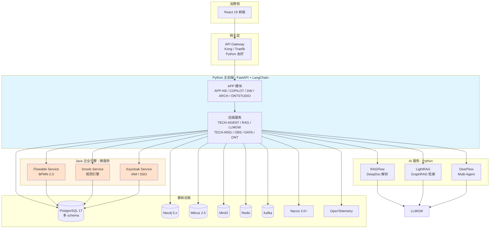
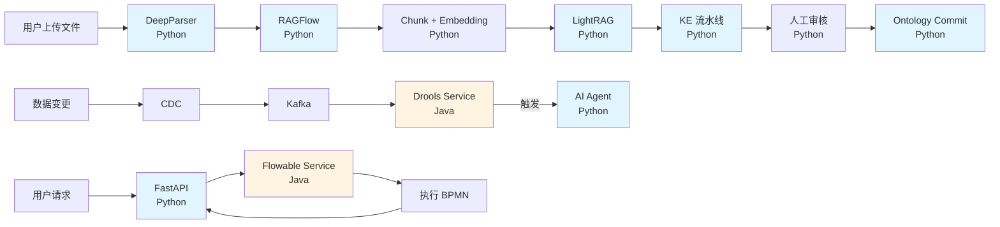

# Mate Platform 技术架构（主架构 - v3.0 Plan D）

> **版本**：v3.0 | **日期**：2026-07-27 | **状态**：正式主架构（THE ONE DOC）
>
> **核心突破**：抛弃"Java 主力 vs Python AI"的二元选择，采用**"Polyglot Microservice Architecture"（多语言微服务架构）**——**�a�言只是实现细节，业务按需选最佳技术**。
>
> **本文件状态**：Mate Platform **正式主架构（THE ONE DOC）**
>
> **历史文档**（已归档，供决策追溯）：
> - v2.1 主架构：`archive/2026-07-27-mate-platform-technical-architecture-v2.1.md（Java 主力 + Python AI）
> - v2 决策：`archive/2026-07-27-v2-tech-stack-decision.md（已废止）
> - v2.0 / v1 方案：`archive/ 下其他 6 份历史文档


---

## 0. 为什么需要 v3.0（Plan D）

### 0.1 v2.1 的局限性

v2.1（Java 主力 + Python AI 子域）在工程现实中有 4 个痛点：

| 痛点 | 表现 |
|---|---|
| **桥接层冗余** | Java 主后端 → Java 桥接层 → Python AI 服务，**多一跳** |
| **AI 生态劣势** | LangChain / LlamaIndex 的 Python 生态远超 Java 端 Spring AI |
| **BPMN 缺口** | 复杂工作流 Java Flowable 在 v2.1 走主后端，但全 Python 后无法享用 |
| **团队配置** | 若团队以 Python 为主，v2.1 强 Java 主力**违反团队实际** |

### 0.2 Plan D 的核心思想

> **让"语言"退到实现层，让"服务"显式化。**
>
> **不**在 Python 生态里找 Java 替代品（接受 70% 能力）。
> **不**全 Java（错过 Python AI 生态红利）。
> **而是**：用 Java 的最强引擎 + 用 Python 的最强 AI，**全部通过 API 暴露为服务**。

### 0.3 决策对比

| 维度 | v2.1 (Java 主力) | **v3.0 (Plan D)** |
|---|---|---|
| 主后端语言 | Java 21 | **Python 3.12+** |
| BPMN 引擎 | TECH-WFE（Java） | **Flowable Service（Java 微服务）** |
| 规则引擎 | TECH-RULE（Java） | **Drools Service（Java 微服务）** |
| IAM | TECH-IAM（Java） | **Keycloak Service（Java）** |
| AI 编排 | SAA（Java） | **LangChain / LlamaIndex（Python）** |
| 多 Agent | DeerFlow（Python） | **DeerFlow（Python）** |
| RAG | RAGFlow + LightRAG（Python） | **RAGFlow + LightRAG（Python）** |
| 语言选择 | "Java 为主" | **"每服务选最佳"** |

---

## 1. 核心架构模式：Polyglot Microservice

### 1.1 模式定义

**Polyglot Microservice**（多语言微服务）是一种架构模式，**系统中不同服务用不同语言实现**，但**通过统一的协议（REST/gRPC）+ 统一的基础设施（Nacos/Kafka）** 互联互通。

**关键原则**：
- **语言不是约束**——服务选最适合的语言
- **接口是契约**——REST/gRPC + OpenAPI
- **基础设施统一**——Nacos 服务发现 + Kafka 事件流 + OTel 可观测
- **可独立部署**——每个服务独立的 K8s Deployment

### 1.2 架构总图



### 1.3 服务全景（15+ 服务）

| 层 | 服务 | 语言 | 职责 | 状态 |
|---|---|---|---|---|
| **网关** | API Gateway | Go/Python | Kong/Traefik | 🆕 |
| **Python 主后端** | APP 模块 | Python | 业务 API | 🆕 |
| | TECH-AGENT | Python | 多 Agent 编排 | 🆕 |
| | TECH-RAG | Python | RAG 业务逻辑 | 🔄 重写 |
| | TECH-LLMGW | Python | LLM 路由 | 🔄 重写 |
| | TECH-MSG | Python | 消息 | 🆕 |
| | TECH-OBS | Python | 可观测 | 🆕 |
| | TECH-DATA | Python | 数据访问 | 🆕 |
| | TECH-ONT | Python | Ontology | 🔄 重写 |
| | TECH-MCP | Python | MCP 协议 | 🆕 |
| **Python AI 服务** | RAGFlow | Python | DeepDoc 解析 | ✅ 已有 |
| | LightRAG | Python | GraphRAG | ✅ 已有 |
| | DeerFlow | Python | Multi-Agent | ✅ 已有 |
| **Java 企业引擎** | Flowable Service | Java | BPMN 2.0 | 🆕 **本版本新增** |
| | Drools Service | Java | 规则引擎 | 🆕 **本版本新增** |
| | Keycloak Service | Java | IAM/SSO | 🆕 **本版本新增** |

---

## 2. Flowable Service（Java BPMN 微服务）

> **设计原则**：用 Java 最强的 BPMN 引擎，通过 API 暴露为微服务，**让任何语言都能调用完整 BPMN 2.0 能力**。

### 2.1 技术栈

| 组件 | 选型 | 版本 |
|---|---|---|
| 框架 | Spring Boot | 3.5.x |
| BPMN 引擎 | **Flowable** | 7.x（最新） |
| 数据库 | PostgreSQL | 17（独立 schema `flowable`） |
| 认证 | Spring Security + JWT | 6.4.x |
| 服务发现 | Nacos Client | 3.0+ |
| 可观测 | OpenTelemetry | 1.45+ |
| 构建 | Maven | 3.9+ |

### 2.2 Maven 项目结构

```xml
<project>
  <artifactId>flowable-service</artifactId>
  <dependencies>
    <!-- Flowable BPMN -->
    <dependency>
      <groupId>org.flowable</groupId>
      <artifactId>flowable-spring-boot-starter</artifactId>
      <version>7.x</version>
    </dependency>
    
    <!-- Spring Boot -->
    <dependency>
      <groupId>org.springframework.boot</groupId>
      <artifactId>spring-boot-starter-web</artifactId>
    </dependency>
    <dependency>
      <groupId>org.springframework.boot</groupId>
      <artifactId>spring-boot-starter-data-jpa</artifactId>
    </dependency>
    
    <!-- PostgreSQL -->
    <dependency>
      <groupId>org.postgresql</groupId>
      <artifactId>postgresql</artifactId>
    </dependency>
    
    <!-- Nacos -->
    <dependency>
      <groupId>com.alibaba.nacos</groupId>
      <artifactId>nacos-client</artifactId>
    </dependency>
    
    <!-- OpenTelemetry -->
    <dependency>
      <groupId>io.opentelemetry</groupId>
      <artifactId>opentelemetry-spring-boot-starter</artifactId>
    </dependency>
  </dependencies>
</project>
```

### 2.3 部署架构

```
Namespace: mate-bpm
├── Deployment: flowable-service (2 副本)
│   ├── Spring Boot 3.5 + Flowable 7.x
│   ├── REST API (Port 8080)
│   └── OpenTelemetry SDK
├── Service: flowable-service (ClusterIP)
├── ConfigMap: flowable-config
├── Secret: flowable-db-password
├── PVC: flowable-storage (50Gi)
└── NetworkPolicy: 仅允许 mate-tech / mate-app
```

### 2.4 核心 API

```
基础路径: /api/v1/bpm/

# 流程定义管理
POST   /process-definitions              # 部署 BPMN XML
GET    /process-definitions              # 列出所有流程
GET    /process-definitions/{key}        # 流程详情
DELETE /process-definitions/{key}        # 卸载

# 流程实例
POST   /process-instances                # 启动新流程
GET    /process-instances/{id}          # 实例状态
DELETE /process-instances/{id}          # 取消
GET    /process-instances/{id}/variables # 变量

# 任务（用户工作项）
GET    /tasks                           # 任务列表
GET    /tasks/{id}                      # 任务详情
POST   /tasks/{id}/complete             # 完成任务
POST   /tasks/{id}/claim                # 认领
POST   /tasks/{id}/delegate            # 委派

# 历史（审计）
GET    /history/process-instances        # 历史流程
GET    /history/tasks                   # 历史任务
GET    /history/variables               # 历史变量

# 业务专用（我们的封装）
POST   /workflow/smart-workflow/generate # 智能体生成（你的 S4 场景）
```

### 2.5 Python 调用示例

```python
import httpx
from typing import Any

class FlowableClient:
    """Python client for Flowable Service"""
    
    def __init__(self, base_url: str, auth_token: str):
        self.client = httpx.AsyncClient(
            base_url=base_url,
            headers={"Authorization": f"Bearer {auth_token}"},
            timeout=30.0,
            limits=httpx.Limits(max_keepalive_connections=20)
        )
    
    async def deploy_bpmn(self, bpmn_xml: str, name: str) -> dict:
        """部署 BPMN 流程定义"""
        response = await self.client.post(
            "/api/v1/bpm/process-definitions",
            json={"name": name, "xml": bpmn_xml}
        )
        response.raise_for_status()
        return response.json()
    
    async def start_process(
        self, 
        process_key: str, 
        variables: dict
    ) -> dict:
        """启动流程实例"""
        response = await self.client.post(
            "/api/v1/bpm/process-instances",
            json={"processDefinitionKey": process_key, "variables": variables}
        )
        response.raise_for_status()
        return response.json()
    
    async def get_my_tasks(self, user_id: str) -> list[dict]:
        """获取用户任务"""
        response = await self.client.get(
            "/api/v1/bpm/tasks",
            params={"assignee": user_id}
        )
        response.raise_for_status()
        return response.json()
    
    async def complete_task(self, task_id: str, variables: dict = None) -> dict:
        """完成任务"""
        response = await self.client.post(
            f"/api/v1/bpm/tasks/{task_id}/complete",
            json={"variables": variables or {}}
        )
        response.raise_for_status()
        return response.json()
```

---

## 3. Drools Service（Java 规则引擎微服务）

> **设计原则**：用 Java 最强的 Drools 规则引擎，通过 API 暴露，**为 S5b 阈值触发和 S12 知识冲突解决提供企业级规则能力**。

### 3.1 技术栈

| 组件 | 选型 | 版本 |
|---|---|---|
| 框架 | Spring Boot | 3.5.x |
| 规则引擎 | **Drools** | 8.x / 9.x |
| 数据库 | PostgreSQL | 17（独立 schema `drools`） |
| 规则仓库 | Git / MinIO | 存储 DRL 文件 |

### 3.2 部署架构

```
Namespace: mate-rule
├── Deployment: drools-service (2 副本)
├── Service: drools-service (ClusterIP, port 8081)
└── ConfigMap: drools-rules
```

### 3.3 核心 API

```
基础路径: /api/v1/rules/

# 规则集管理
POST   /rulesets                        # 上传 DRL 规则集
GET    /rulesets                        # 列出所有规则集
GET    /rulesets/{id}                   # 规则集详情
PUT    /rulesets/{id}                   # 更新规则集
DELETE /rulesets/{id}                   # 删除

# 规则执行
POST   /rulesets/{id}/fire              # 用事实评估规则
POST   /rules/fire                      # 临时事实评估

# 规则版本管理
GET    /rulesets/{id}/versions          # 历史版本
POST   /rulesets/{id}/versions          # 创建新版本
POST   /rulesets/{id}/rollback          # 回滚版本
```

### 3.4 Python 调用示例（S5b 阈值触发）

```python
class DroolsClient:
    """Python client for Drools Service - 阈值规则"""
    
    async def evaluate_threshold(
        self,
        event_type: str,
        event_data: dict,
        ruleset_id: str = "contract-amount-thresholds"
    ) -> dict:
        """评估数据变更是否触发阈值规则"""
        response = await self.client.post(
            f"/api/v1/rules/rulesets/{ruleset_id}/fire",
            json={
                "factType": event_type,
                "fact": event_data
            }
        )
        response.raise_for_status()
        return response.json()
    
    # S5b 业务示例：合同金额超 100 万触发风险评估
    async def check_contract_risk(self, contract: dict) -> dict:
        result = await self.evaluate_threshold(
            "Contract",
            {
                "contractId": contract["id"],
                "amount": contract["amount"],
                "type": contract["type"]
            }
        )
        if result.get("fired"):
            return {
                "triggered": True,
                "ruleName": result["ruleName"],
                "action": "trigger_agent",
                "agentName": "RiskAssessmentAgent"
            }
        return {"triggered": False}
```

### 3.5 Drools DRL 规则示例

```drl
package com.metaplatform.rules.threshold

import com.metaplatform.facts.ContractFact
import com.metaplatform.facts.CustomerFact

rule "ContractAmountHighRisk"
    when
        $contract : ContractFact(amount > 1000000, type == "Sales")
    then
        insert(new TriggerFact("RiskAssessmentAgent", $contract.getId()));
        notifyChannel("legal", "高额合同：" + $contract.getId());
end

rule "CustomerNPSLow"
    when
        $customer : CustomerFact(nps < 30)
    then
        insert(new TriggerFact("CustomerCareAgent", $customer.getId()));
end
```

---

## 4. Keycloak Service（Java IAM 微服务）

> **设计原则**：用 Keycloak（业界标准 IAM），Python 通过 OIDC 协议调用，**不重新发明身份认证**。

### 4.1 技术栈

| 组件 | 选型 |
|---|---|
| IAM | **Keycloak** 24.x |
| 协议 | OIDC / OAuth2 / SAML |
| 数据库 | PostgreSQL 17（独立 schema `keycloak`） |

### 4.2 部署架构

```
Namespace: mate-iam
├── Deployment: keycloak (2 副本)
├── Service: keycloak (ClusterIP, port 8443)
└── Realm: mate-platform
```

### 4.3 Python 集成

```python
from keycloak import KeycloakOpenID

# Python 服务使用 Keycloak
keycloak_openid = KeycloakOpenID(
    server_url="http://keycloak.mate-iam.svc.cluster.local:8443",
    realm_name="mate-platform",
    client_id="mate-tech-rag",
    client_secret_key="***"
)

# 验证 token
token_info = keycloak_openid.introspect(token)
```

---

## 5. Python 主后端设计

### 5.1 技术栈

| 组件 | 选型 | 版本 |
|---|---|---|
| **Web 框架** | **FastAPI** | 0.115+ |
| **ASGI 服务器** | **uvicorn + uvloop + granian** | latest |
| **数据验证** | **Pydantic** v2 | latest |
| **ORM** | **SQLAlchemy** 2.0 + **SQLModel** | latest |
| **图库** | **neo4j Python driver** | 5.x |
| **消息** | **aiokafka** | latest |
| **HTTP 客户端** | **httpx** | latest |
| **LLM 编排** | **LangChain** + **LlamaIndex** | 1.3+ |
| **多 Agent** | **LangGraph** | 1.2.9+ |
| **MCP** | **mcp-python-sdk** | latest |
| **类型检查** | **pyright** (Microsoft) | latest |
| **测试** | **pytest** + **pytest-asyncio** + **hypothesis** | latest |
| **代码质量** | **Ruff** | latest |
| **包管理** | **uv** (Astral) | latest |

### 5.2 项目结构

```
mate-platform-backend/                 # Python 主后端 monorepo
├── pyproject.toml                    # uv 管理
├── ruff.toml                          # 代码规范
├── packages/
│   ├── mate-common/                   # 公共：DTO、异常、工具
│   ├── mate-tech-rag/                 # RAG 业务逻辑
│   │   ├── clients/
│   │   │   ├── ragflow_client.py     # 调用 RAGFlow
│   │   │   ├── lightrag_client.py    # 调用 LightRAG
│   │   │   ├── flowable_client.py    # 调用 Flowable
│   │   │   └── drools_client.py     # 调用 Drools
│   │   ├── services/
│   │   │   ├── retrieval.py
│   │   │   ├── knowledge_eng.py
│   │   │   └── citation.py
│   │   └── api/
│   │       └── routes.py
│   ├── mate-tech-agent/               # Agent
│   ├── mate-tech-llmgw/               # LLM 路由
│   ├── mate-tech-msg/                 # 消息
│   ├── mate-tech-obs/                 # 可观测
│   ├── mate-tech-ont/                 # Ontology
│   ├── mate-tech-mcp/                 # MCP
│   └── mate-app-kb/                   # 业务 APP-KB
└── services/
    ├── flowable-service/              # Java 微服务
    ├── drools-service/                # Java 微服务
    └── keycloak/                      # Java IAM
```

### 5.3 FastAPI 应用示例

```python
from fastapi import FastAPI, Depends, HTTPException
from pydantic import BaseModel
from typing import List
from clients import FlowableClient, DroolsClient, RAGFlowClient

app = FastAPI(title="Mate Platform API", version="3.0")

# 依赖注入
def get_flowable() -> FlowableClient:
    return FlowableClient(
        base_url="http://flowable-service.mate-bpm.svc.cluster.local:8080",
        auth_token=current_user_token
    )

def get_drools() -> DroolsClient:
    return DroolsClient(
        base_url="http://drools-service.mate-rule.svc.cluster.local:8081",
        auth_token=current_user_token
    )

# S4: 智能体编排生成
class WorkflowRequest(BaseModel):
    description: str
    variables: dict = {}

@app.post("/api/v1/workflow/generate")
async def generate_workflow(
    req: WorkflowRequest,
    flowable: FlowableClient = Depends(get_flowable)
):
    # 1. LLM 生成 BPMN XML
    bpmn_xml = await llm_generate_bpmn(req.description)
    
    # 2. 部署到 Flowable
    deployment = await flowable.deploy_bpmn(bpmn_xml, name=req.description)
    
    # 3. 启动流程
    instance = await flowable.start_process(
        process_key=deployment["key"],
        variables=req.variables
    )
    
    return {"deploymentId": deployment["id"], "instanceId": instance["id"]}

# S5b: 阈值触发
class EventPayload(BaseModel):
    entity_type: str
    entity_id: str
    field: str
    value: float

@app.post("/api/v1/events/threshold-check")
async def check_threshold(
    payload: EventPayload,
    drools: DroolsClient = Depends(get_drools)
):
    result = await drools.evaluate_threshold(
        event_type=payload.entity_type,
        event_data={
            "id": payload.entity_id,
            "field": payload.field,
            "value": payload.value
        }
    )
    if result.get("fired"):
        # 触发 AI Agent
        await agent_dispatch(result["action"], result["target"])
    return result
```

### 5.4 类型安全（Python 弱项强化）

```python
from pydantic import BaseModel, Field, ConfigDict
from sqlmodel import SQLModel, Field as SQLField
from typing import Annotated, Literal

# Pydantic v2 - 严格数据模型
class DocumentMeta(BaseModel):
    model_config = ConfigDict(strict=True, frozen=True)
    
    id: Annotated[str, Field(min_length=1, max_length=64)]
    tenant_id: Annotated[str, Field(min_length=1, max_length=64)]
    title: Annotated[str, Field(min_length=1, max_length=255)]
    file_type: Literal["pdf", "docx", "pptx", "xlsx", "md", "txt"]
    size_bytes: Annotated[int, Field(ge=0)]
    uploaded_at: datetime

# SQLModel - 类型安全的 ORM
class Document(SQLModel, table=True):
    __tablename__ = "documents"
    
    id: str = SQLField(primary_key=True)
    tenant_id: str = SQLField(index=True)
    title: str
    file_type: str
    status: Literal["pending", "processing", "ready", "failed"] = "pending"
```

---

## 6. 数据架构

### 6.1 数据归属（v3 多语言服务）

| 数据 | 存储 | 拥有服务 | 语言 |
|---|---|---|---|
| 原始文件 | MinIO | DeepParser (Python) | Python |
| ParsedDocument | PostgreSQL `rag.*` | Retrieval (Python) | Python |
| Chunk + Embedding | PostgreSQL + Milvus | Retrieval (Python) | Python |
| **GraphRAG 图** | Neo4j `lrag-graph` | LightRAG (Python) | Python |
| **BPMN 流程定义** | PostgreSQL `flowable.*` | **Flowable Service (Java)** | Java |
| **BPMN 流程实例** | PostgreSQL `flowable.*` | **Flowable Service (Java)** | Java |
| **规则定义** | PostgreSQL `drools.*` | **Drools Service (Java)** | Java |
| **用户/租户/凭证** | PostgreSQL `keycloak.*` | **Keycloak Service (Java)** | Java |
| Ontology | Neo4j `tech-ont` | TECH-ONT (Python) | Python |
| Citation | PostgreSQL `rag_citation.*` | Retrieval (Python) | Python |
| 事件 | Kafka | 各服务 | 多语言 |
| 缓存 | Redis | 各服务 | 多语言 |
| 可观测 | OpenTelemetry | 全服务 | 多语言 |

### 6.2 跨服务数据流



### 6.3 隔离策略

- **PostgreSQL**：多 schema 隔离（rag / flowable / drools / keycloak / ke）
- **Neo4j**：3 database 隔离（tech-ont / lrag-graph / rag-graphrag）
- **Milvus**：collection 命名空间
- **跨服务**：通过业务 ID（`docId` / `kbId` / `processKey`）桥接

---

## 7. 部署架构

### 7.1 K8s Namespace 布局

| Namespace | 服务 | 语言 | 副本 |
|---|---|---|---|
| `mate-tech` | Python 主后端（全部 FastAPI 服务） | Python | 2-4 |
| `mate-ai` | RAGFlow, LightRAG, DeerFlow | Python | 2 |
| `mate-bpm` | **Flowable Service** | **Java** | 2 |
| `mate-rule` | **Drools Service** | **Java** | 2 |
| `mate-iam` | **Keycloak Service** | **Java** | 2 |
| `mate-deerflow` | DeerFlow（既有） | Python | 2 |
| `mate-frontend` | 前端 | TS | 2 |
| `mate-monitor` | Prometheus, Grafana, Loki | 多 | 1 |
| `mate-infra` | PG / Neo4j / Milvus / Kafka / Redis | — | — |

### 7.2 部署矩阵

| 服务 | 镜像 | 资源 | 端口 |
|---|---|---|---|
| `mate-tech-rag` (Python) | `python:3.12-slim` | 2C/4G | 8080 |
| `mate-tech-agent` (Python) | `python:3.12-slim` | 2C/4G | 8080 |
| `mate-tech-llmgw` (Python) | `python:3.12-slim` | 2C/4G | 8080 |
| `flowable-service` (Java) | `eclipse-temurin:21-jre` | 4C/8G | 8080 |
| `drools-service` (Java) | `eclipse-temurin:21-jre` | 4C/8G | 8081 |
| `keycloak` (Java) | `quay.io/keycloak/keycloak:24` | 2C/4G | 8443 |
| `ragflow` (Python) | `infiniflow/ragflow:v0.13` | 4C/8G | 9621 |
| `lightrag` (Python) | `hkuds/lightrag:latest` | 4C/8G | 9622 |
| `deerflow` (Python) | `bytedance/deer-flow:2.1` | 2C/4G | 8001 |

### 7.3 跨语言服务互联

所有跨服务调用通过：
- **同步**：REST API（httpx in Python, RestTemplate in Java）
- **异步**：Kafka 事件流
- **服务发现**：Nacos 3.0+
- **认证**：Keycloak JWT（所有语言都能用）

---

## 8. 迁移路径（v2.1 → v3.0）

### 8.1 阶段路线

| 阶段 | 内容 | 工期 | 风险 |
|---|---|---|---|
| **v3.0-P1** | Java 引擎服务化（Flowable + Drools + Keycloak） | 6 周 | 🟢 低（新增） |
| **v3.0-P2** | Python 主后端搭建（FastAPI + SQLModel） | 6 周 | 🟡 中（新建） |
| **v3.0-P3** | 业务模块迁移（APP-KB / APP-COPILOT 等） | 8 周 | 🟡 中（迁移） |
| **v3.0-P4** | 灰度切换（按租户 5%→50%→100%） | 4 周 | 🟡 中 |
| **v3.0-P5** | Java 主后端下线 | 2 周 | 🟢 低 |
| **总计** | | **26 周** | |

### 8.2 共存期（v2.1 + v3.0 并行）

迁移期间，**v2.1 Java 主后端**和**v3.0 Python 主后端**并存：

| 流量分配 | 阶段 |
|---|---|
| 100% Java（v2.1） | v3.0-P1, P2 |
| 90% Java + 10% Python（新租户走 Python） | v3.0-P3 |
| 50/50 | v3.0-P4 灰度中段 |
| 10% Java + 90% Python | v3.0-P4 灰度后段 |
| 100% Python | v3.0-P5 |

### 8.3 兼容性保证

迁移期间保证：
- ✅ API 接口兼容（前端无需修改）
- ✅ 数据兼容（同一 PostgreSQL / Neo4j / Milvus）
- ✅ 事件兼容（同一 Kafka 主题）
- ✅ 鉴权兼容（同 Keycloak 颁发的 JWT）

---

## 9. 风险与缓解

| ID | 风险 | 等级 | 缓解 |
|---|---|---|---|
| R1 | Python 性能瓶颈（高并发） | 🟡 | FastAPI + uvloop + granian 组合达 30-50k QPS |
| R2 | Python 类型安全弱 | 🟡 | pyright + Pydantic v2 + 100% 测试覆盖 |
| R3 | 团队 Python 技能缺口 | 🟡 | v2 决策已破例 DeerFlow，团队已具备基础 |
| R4 | Flowable 服务单点 | 🟢 | 2 副本 + HPA + 健康检查 |
| R5 | Drools 规则管理复杂 | 🟡 | Git 仓库管理 DRL + 版本控制 |
| R6 | Keycloak 集成复杂度 | 🟡 | 业界标准，文档丰富 |
| R7 | 跨语言服务调试困难 | 🟡 | 统一 OTel traceId + 标准化日志 |
| R8 | 灰度切换数据一致性 | 🟡 | 双写期 + 校验 |
| R9 | 团队抗拒变化 | 🟢 | 渐进迁移 + 培训 |
| R10 | AI 生态继续演化 | 🟢 | Python 路线与生态同步 |

---

## 10. KPI

### 10.1 性能目标

| 指标 | v2.1 (Java) | **v3.0 (Python+Java 微服务)** |
|---|---|---|
| RAG 查询 P95 | 1s | **1s**（Python 性能相当） |
| 主题查询 P95 | 3s | **3s**（LightRAG 服务） |
| BPMN 启动 P95 | N/A | **2s**（Flowable Service） |
| 规则评估 P95 | N/A | **100ms**（Drools Service） |
| 主后端 P95 | 1s | **1.2s**（Python 略慢但可接受） |
| 整体 QPS | 100k+ | **30-50k**（足够 RAG 场景） |

### 10.2 业务能力

| 能力 | v2.1 | **v3.0** |
|---|---|---|
| BPMN 2.0 完整支持 | 🟢 | **🟢**（Flowable） |
| 复杂规则 | 🟢 | **🟢**（Drools） |
| 企业 IAM | 🟢 | **🟢**（Keycloak） |
| AI 编排 | 🟡 | **🟢**（LangChain 优势） |
| RAG 质量 | 🟢 | **🟢**（相同 AI 服务） |
| Multi-Agent | 🟢 | **🟢**（DeerFlow） |

### 10.3 成本

| 项 | v2.1 | v3.0 | 差异 |
|---|---|---|---|
| 内存 | 较多（Java 堆） | 较少（Python 进程） | -30% |
| CPU | 较高 | 中等 | -20% |
| 启动时间 | 30-60s | 3-5s | 10x 快 |
| 开发速度 | 中等 | **快 50%** | 显著提升 |

---

## 11. 决策记录

| 字段 | 值 |
|---|---|
| 架构名称 | v3.0 Plan D Polyglot Microservice Architecture |
| 决策日期 | 2026-07-27 |
| 决策人 | 项目 Owner |
| 上层规范 | v2 决策（已废止）+ v2.1 主架构 |
| 演进方向 | Polyglot Microservice（语言无关注） |
| 核心突破 | Java 引擎服务化 + Python AI 生态 |
| 推荐度 | ⭐⭐⭐⭐⭐（业界主流） |

---

## 12. 与 v2.1 主架构的关系

| 维度 | v2.1 主架构 | v3.0 (本规范) |
|---|---|---|
| **状态** | 当前实现 | 演进方向 |
| **后端语言** | Java 21 | Python 3.12+ |
| **BPMN** | TECH-WFE (Java in main) | **Flowable Service (Java 微服务)** |
| **规则** | TECH-RULE (Java in main) | **Drools Service (Java 微服务)** |
| **IAM** | TECH-IAM (Java) | **Keycloak Service (Java)** |
| **AI 编排** | SAA 1.1.2 (Java) | **LangChain (Python)** |
| **RAG 桥接** | Java 桥接层 | **Python 直接调用** |
| **14 业务场景** | 已覆盖 | 全部覆盖（无变化） |

**v3.0 是当前正式主架构。** v2.1 已归档为决策历史，v3.0 是其演进升级版。

---

## 13. 给读者的 3 个快速判断

| 你的情况 | 建议 |
|---|---|
| 团队 100% Python | **走 v3.0**（本规范） |
| 团队 100% Java | 走 v2.1 |
| 团队混合 | **走 v3.0**（语言无关注，团队按特长分配） |
| 业务以 AI 为主 | **走 v3.0**（Python AI 生态优势） |
| 业务以传统企业为主 | 走 v2.1（Java 企业生态成熟） |
| 想要快速验证 | 走 v2.1（已实现） |
| 想要长期演化 | **走 v3.0**（本规范） |

---

**下一步行动**：
1. **团队讨论**：v2.1 vs v3.0 选哪个
2. **决策**：基于团队配置 + 业务特征
3. **执行**：按选定方案推进

---

**相关 Review 入口**：
- 架构评审：本文件
- 决策对比：v2.1 主架构 vs 本规范
- 实施细节：各服务单独规范文档（待补充）
