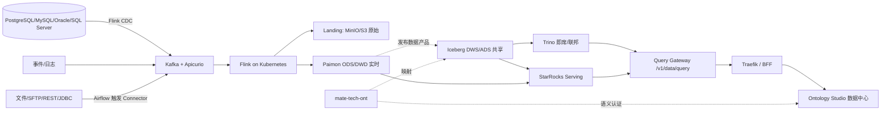

## 附录 A：v3.1 Data-Ready Baseline（2026-07-28 同步）

> 本附录是 v3.0 实施基线的增量说明，用于补齐大数据 ETL、湖仓与治理能力。
> 详细设计见 `docs/superpowers/specs/2026-07-28-mate-platform-big-data-etl-design.md`。
> 本节属于文档基线更新，不构成新独立产品，不变更 Python 主后端结构，只在现有本体论引擎的「数据中心」中内嵌新增能力。

### A.1 增量服务

| 层 | 服务 | 语言 | 关键镜像/版本 | 端口 | 角色 |
|---|---|---|---|---|---|
| Python 主后端（新增） | mate-tech-data | Python 3.12 | python:3.12 | 8080 | 数据平台控制面、Pipeline、SQL Gateway、目录、血缘、质量 |
| 外部开源引擎（新增） | Flink JobManager / TaskManager | Java + Scala | flink:1.19 + Flink Kubernetes Operator | 8081 | 批流统一计算（CDC / Flink SQL / DataStream / PyFlink） |
|  | Airflow 3.x | Python | apache/airflow:3.0-python3.12 | 8082 | 数据 DAG、调度、补数、回填 |
|  | Apache Paimon | Java | apache/paimon:0.9 | — | ODS/DWD 实时主键与变更表 |
|  | Apache Iceberg | Java | apache/iceberg-rest:1.5 | — | DWS/ADS 开放共享数据产品 |
|  | Trino | Java | trinodb/trino:455 | 8083 | 即席/联邦 SQL 查询 |
|  | StarRocks | C++ | starrocks/fe-ubuntu:3.3 | 9030 / 8040 | 高并发指标、报表、Data API |
|  | Apache Gravitino | Java | apache/gravitino:0.7 | 8090 | 运行时多 Catalog 注册 |
|  | OpenMetadata | Java | openmetadata/server:1.4 | 8585 | 治理目录、Owner、Glossary、血缘 |
|  | OpenLineage | Java | openlineage/marquez:0.50 | — | 统一运行时血缘事件 |
|  | Great Expectations | Python | great-expectations/great_expectations:0.18 | — | 批量质量与对账 |
|  | Apache Ranger | Java | apache/ranger:2.4 | 6080 | 行列权限、动态脱敏、审计 |
|  | OpenBao | Go | openbao/openbao:1.15 | 8200 | 连接器密钥、动态凭证、轮换 |

Flink 为主计算引擎，Airflow 负责调度，Flowable 继续负责人工审批。
旧 Java `docs/legacy/tech-java-legacy/TECH-DATA` 不恢复上线，只作为 API/模型迁移参考。

### A.2 增量数据流

### A.3 控制面（Python 模块化单体）

`mate-tech-data` 内部 Bounded Context：connector、pipeline、orchestration、catalog、governance、query；吞吐和引擎状态保留在 Flink / Kafka / 湖仓中。

### A.4 与 v3.0 的关系

- v3.0 主架构、Python 主后端、网关与前端入口不变。
- 新增 `mate-tech-data` 与上述外部引擎，不引入新的微服务拆分；`mate-tech-data` 仍由 Python monorepo 与 uv 管理。
- 旧 Java `TECH-DATA` 保持归档，不作为 v3.0/v3.1 生产依赖。
- 容量、性能、可靠性目标在 §11、§12 同步追加。

### A.5 章节位置同步

| v3.0 章节 | 增量内容 |
|---|---|
| §1.2 服务全景 | 追加 A.1 表（v3.1 增量服务） |
| §6.1 数据归属 | 增加湖仓/治理/调度条目 |
| §6.2 跨服务数据流 | 替换为 A.2 图 |
| §8 部署架构 | K8s 数据平面 + Compose profiles |
| §11 性能目标 | 增加 Gold/Silver P95、StarRocks/Trino 目标 |
| §12 风险与缓解 | 增加 R9–R12 风险 |

具体正文重写交由实施计划阶段以保持增量改动可回滚。

### A.6 性能与风险（增量）

- 性能新增：Gold 实时端到端 P95 < 5s；Silver 准实时 P95 < 60s；StarRocks P95 1–3s；Trino 交互查询 P95 5–30s；控制面 ≥ 99.9%。
- 风险新增 R9：Paimon/Iceberg 兼容；R10：500 Pipeline 资源争用；R11：自定义作业越权；R12：双格式治理不统一。

## 引用

- 设计规格：docs/superpowers/specs/2026-07-28-mate-platform-big-data-etl-design.md
- 主架构：docs/active/specs/2026-07-27-mate-platform-architecture-implementation.md
