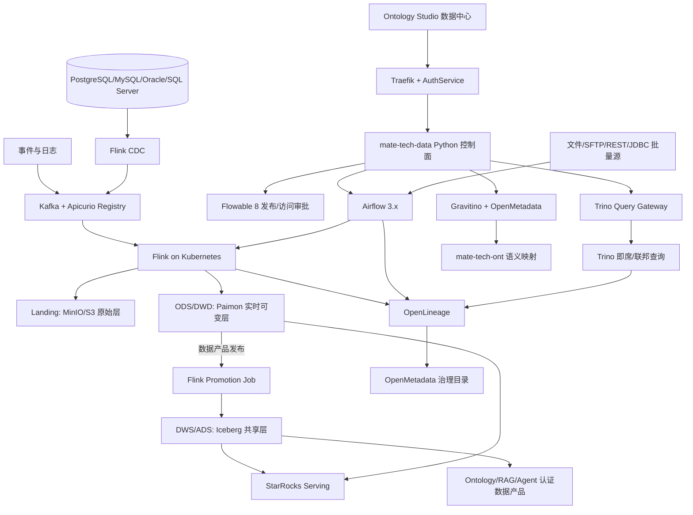

# Mate Platform 大数据 ETL 与湖仓能力设计

> **日期**：2026-07-28
> **状态**：设计已确认，待书面规格审阅
> **目标版本**：v3.1 Data-Ready Baseline / v1.0 GA 硬前置
> **设计范围**：将完整自托管大数据 ETL、湖仓、查询和治理能力嵌入现有本体论引擎的“数据中心”，不新增独立一级应用。

## 1. 背景与问题

当前 v3.0 实施版架构存在一个真实断层：

- `docs/active/specs/2026-07-27-mate-platform-architecture-implementation.md` 的 Python 服务全景没有 `MATE-DATA / TECH-DATA`。
- 数据架构中存在 `CDC → Kafka` 链路，但没有 CDC 采集、Pipeline 管理、批流计算或数据产品发布方。
- 前端当前实际运行的本体引擎已经有“数据中心”，但能力主要是数据源、数据湖概览、CDC 概览和质量 Mock，尚未形成完整 ETL/湖仓平台。
- API 契约和 PRD 仍然保留 `/v1/data/*` 与 TECH-DATA 依赖；旧 Java `TECH-DATA` 已归档，不能作为当前 v3.0 生产依赖。
- 现有 `docker-compose.yml` 没有生产级 Flink、调度、湖仓表格式、查询 Serving 和数据治理运行时。

旧版 Java `TECH-DATA` 作为迁移参考，已有约 79 个端点、ETL、dbt、湖表、数仓、数据资产、血缘、质量和监控领域；本设计不恢复该 Java 服务，而是以其 API、模型、迁移脚本和测试场景作为 Python 重构的输入。

## 2. 已确认的决策

| 主题 | 决策 |
|---|---|
| 产品定位 | 自带完整湖仓平台，不依赖外部托管数据平台 |
| 生产部署 | Kubernetes；Docker Compose 仅作为开发/演示精简环境 |
| 容量基线 | 100 TB–1 PB；日增量 5–50 TB；约 500 条并发 Pipeline |
| 计算引擎 | Flink 为唯一主计算引擎；首版不部署 Spark |
| 计算模式 | Flink CDC、Flink SQL、DataStream、PyFlink 覆盖流批场景 |
| 湖表策略 | Paimon 承载 ODS/DWD 实时可变层；Iceberg 承载 DWS/ADS 稳定共享层 |
| 数据消费 | Trino 即席/联邦查询 + StarRocks 高并发 Serving；BI 与 AI/Ontology 同等重要 |
| 调度审批 | Airflow 负责任务 DAG/调度/补数；Flowable 负责发布审批和访问审批 |
| 租户模型 | 单企业单租户私有化部署；企业内部通过项目、数据域、Namespace、RBAC 隔离 |
| 产品入口 | 嵌入现有本体论引擎 `/ontology/datacenter`，不新增 `APP-DATA` |
| 控制面 | 新建 Python `mate-tech-data`，旧 Java TECH-DATA 不上线 |
| Pipeline 开发 | 可视化 + Flink SQL + 受控 Java/PyFlink 自定义作业 |
| GA 优先级 | 大数据能力作为 v1.0 GA 硬前置，不延期到 v1.1 |
| 文档同步 | 技术架构、技术栈、交付路线、`CLAUDE.md`、`agent.md` 必须同步更新 |

## 3. 目标与非目标

### 3.1 目标

1. 建立从数据库 CDC、事件流、文件/API/批量源到湖仓数据产品的完整数据链路。
2. 以 Flink 为统一批流计算引擎，支持可视化、SQL 和受控自定义代码三类 Pipeline。
3. 以 Paimon + Iceberg 分层解决 CDC/Upsert 与开放生态/共享分析的冲突。
4. 在现有本体引擎数据中心内提供数据接入、Pipeline、湖仓、SQL、目录、血缘、质量和运行能力。
5. 将物理数据资产与 Ontology 概念、实体、关系、指标和 Action 绑定，成为 BI、RAG、Agent 的受治理数据供给。
6. 建立可回放、可补数、可回滚、可审计和可复现的 Pipeline 生命周期。
7. 支持 Kubernetes 下的水平扩缩容、资源隔离、故障恢复和灾备验收。

### 3.2 非目标

1. 首版不维护自研分布式计算引擎，不 Fork Flink、Airflow、Trino、StarRocks 或湖表项目。
2. 首版不引入 Spark；未来若有机器学习或历史重算需求，通过 Engine SPI 增加适配器。
3. 不把所有数据同时双写 Paimon 与 Iceberg；仅在发布数据产品时跨格式提升。
4. 不让浏览器直接访问 Flink、Airflow、Trino、StarRocks、OpenMetadata 原生控制台。
5. 不恢复旧 Java TECH-DATA 作为生产业务服务。
6. 不在 FastAPI 进程或 Airflow Scheduler 中执行用户自定义代码。

## 4. 总体架构

### 4.1 产品与控制面

现有本体引擎保留四个顶层页签：

- 本体论管理：概念、实体、属性、关系、规则和本体版本。
- 数据中心：数据源、批流 ETL、湖仓、SQL、目录、血缘、质量、SLA 和运行。
- Action 编排：面向业务的 Action、服务编排、触发和补偿。
- 知识图谱：Ontology 图谱和语义关系探索。

`数据中心`成为大数据能力的唯一产品入口，内部使用二级导航：

- 总览
- 数据接入
- Pipeline
- 湖仓与 SQL
- 目录与血缘
- 质量与 SLA
- 运行监控

浏览器只调用 Traefik/BFF 的 `/api/v1/data/*` 和本体 API；所有引擎通过 Python 控制面 Adapter 调用。

### 4.2 数据平面



### 4.3 数据分层原则

| 层 | 技术 | 责任 | 消费限制 |
|---|---|---|---|
| Landing | MinIO/S3 | 原始不可变、回放、审计 | 默认仅工程和治理角色 |
| ODS | Paimon | 源结构对齐、CDC Upsert/Delete、Schema Evolution | 受策略控制 |
| DWD | Paimon | 清洗、标准化、主数据对齐、实时明细 | 工程、治理和受授权查询 |
| DWS | Iceberg | 主题汇总、维度、指标、开放共享 | 可申请/订阅 |
| ADS | Iceberg | 版本化、认证的数据产品契约 | BI、RAG、Ontology、Agent 首选 |
| Serving | StarRocks | 高并发指标、报表和 Data API | 通过 Query Gateway/数据产品 API |

Paimon 到 Iceberg 的提升是明确的数据产品发布动作，不是对所有表的自动双写。每个 ADS 产品拥有 Contract、Owner、SLA、质量报告、血缘和语义映射。

## 5. 组件技术栈与职责

### 5.1 Mate 自研

| 组件 | 技术 | 责任 |
|---|---|---|
| 数据中心前端 | 现有 React/TypeScript 本体引擎 | 数据源、Pipeline、湖仓、SQL、治理和运行体验 |
| `mate-tech-data` | Python 3.12、FastAPI、SQLModel、Pydantic v2、httpx | 统一控制面与领域 API |
| Pipeline Spec | JSON Schema / Pydantic Canonical Spec | 版本化数据管道定义 |
| Compiler | Python 编译器 | 生成 Flink SQL、Job Manifest、Airflow DAG Bundle 和治理 Manifest |
| Engine Adapter | Python ACL | Airflow、Flink、Trino、StarRocks、Gravitino、OpenMetadata 调用 |
| `mate-airflow-provider` | Python Provider/Operators | Flink 提交、Savepoint、质量门禁、数据产品发布 |
| Connector SDK | Python 描述与运行规范 | 连接器注册、Schema Discovery、凭证引用和审计 |

首版 `mate-tech-data` 采用模块化单体，内部划分 Connector、Pipeline、Orchestration、Catalog、Governance、Query & Serving 六个 Bounded Context；吞吐和状态不放进 Python 控制面。

### 5.2 外部开源产品

| 能力 | 组件 | 集成边界 |
|---|---|---|
| 批流计算 | Flink + Flink Kubernetes Operator | Application Mode；SQL/DataStream/PyFlink |
| CDC | Flink CDC | 全量快照、增量、Upsert/Delete、Schema Evolution |
| 调度 | Airflow 3.x + KubernetesExecutor | DAG、重试、补数、回填和运行历史 |
| 审批 | Flowable 8 | 发布、访问和敏感资产审批 |
| 事件总线 | Kafka（KRaft）+ Apicurio Registry | 领域事件、Schema Contract 和重放 |
| 对象存储 | MinIO Distributed / S3 API | Landing、湖表文件、产物和报告 |
| 实时湖表 | Apache Paimon | ODS/DWD 主键表和实时变更 |
| 开放湖表 | Apache Iceberg | DWS/ADS 共享数据产品 |
| 联邦查询 | Trino | Paimon/Iceberg/外部源 SQL |
| OLAP Serving | StarRocks | 报表、物化视图、指标和低延迟 API |
| 运行时目录 | Apache Gravitino | Catalog、Namespace、Table、Topic、Fileset 注册 |
| 治理目录 | OpenMetadata | Owner、术语、标签、认证、质量和治理血缘 |
| 运行血缘 | OpenLineage | Airflow/Flink/Trino 运行事件 |
| 批量质量 | Great Expectations | 质量规则、对账和批量检查；流式规则编译为 Flink SQL/质量算子 |
| 访问策略 | Apache Ranger | 行列权限、脱敏、审计和策略发布 |
| 密钥 | OpenBao | 连接器密钥、动态凭证和密钥轮换 |
| 可观测性 | OTel、Prometheus、Grafana、Loki | 日志、指标、Trace、Lag、SLA 和成本 |

Gravitino 只负责技术运行时目录；OpenMetadata 负责治理目录；`mate-tech-ont` 负责物理资产到业务语义的映射，三者不互相替代。

## 6. 数据接入与 Pipeline 生命周期

### 6.1 三类接入

1. **数据库 CDC**：PostgreSQL、MySQL、Oracle、SQL Server 等通过 Flink CDC 进行全量快照和增量变更。
2. **事件与日志**：Kafka Topic + Apicurio Schema Registry，支持 Avro、Protobuf、JSON Schema。
3. **批量/API**：MinIO/S3、SFTP、REST、JDBC 等，由 Airflow 触发受控容器化 Connector，再进入 Flink 处理链路。

接入时必须完成 Schema 校验、字段分类、脱敏策略、Owner、SLA 和审计登记。

### 6.2 Pipeline 开发模式

- 可视化 Canvas：源、转换、Join、质量、映射、目标节点拖拽生成 Canonical Spec。
- Flink SQL：直接维护 SQL，受 Contract、权限和资源策略约束。
- 自定义作业：Java Flink JAR 或 PyFlink 镜像，必须经 CI 构建、镜像扫描、签名和审批。

### 6.3 编译与发布

```text
DRAFT
→ VALIDATED（类型、Schema、权限、资源、循环依赖）
→ IN_REVIEW（质量、安全、Owner、SLA、Flowable 审批）
→ DEPLOYED（签名产物与资源已注册）
→ RUNNING / PAUSED / FAILED
→ RETIRED
```

每次发布产生不可变 Pipeline Version。编译器生成：

- Flink SQL Script，或签名 JAR/PyFlink Image 引用。
- FlinkDeployment Kubernetes Manifest，包含并行度、资源、Checkpoint 和 Savepoint 策略。
- Airflow DAG Bundle，使用通用 Operator 和 Spec 参数，不拼接任意 Python。
- Data Contract、OpenLineage Job/Namespace、Quality Manifest 和 Ranger Policy Intent。

每个运行实例保存 Pipeline Version、Flink Job ID、Savepoint、Airflow Run、输入输出快照、质量报告、Trace ID 和成本标签。

### 6.4 失败策略

| 场景 | 处理 |
|---|---|
| 源不可用 | 指数退避、熔断、告警，从 Offset/Checkpoint 恢复 |
| Schema 不兼容 | 暂停受影响 Sink，进入隔离区，等待兼容决策 |
| 质量失败 | 原始数据保留，阻断认证/发布，不覆盖最后健康版本 |
| 部署失败 | 补偿清理新资源，从上一 Savepoint 恢复 |
| 查询超时 | Query Gateway 取消、记录资源消耗和审计，不影响 Pipeline |

## 7. 控制面数据与接口

### 7.1 核心实体

- Connector：`DataSource`、`CredentialRef`、`ConnectorDefinition`、`SchemaSnapshot`。
- Pipeline：`Pipeline`、`PipelineVersion`、`Node`、`Edge`、`Deployment`、`Artifact`。
- Orchestration：`Schedule`、`Run`、`Backfill`、`Checkpoint`、`Savepoint`。
- Catalog：`DataAsset`、`DatasetVersion`、`DataProduct`、`Contract`、`Subscription`。
- Governance：`LineageEdge`、`QualitySuite`、`QualityRun`、`Classification`、`PolicyBinding`、`SLA`。
- Query：`SavedQuery`、`QuerySession`、`Metric`、`Materialization`、`ResultExport`。

### 7.2 存储归属

- PostgreSQL：控制面定义、版本、运行投影、审计和 Outbox。
- MinIO：签名编译产物、查询导出和质量报告。
- Kafka：领域事件和跨服务通知。
- Redis：幂等键、短期锁、缓存。
- 引擎内部状态不复制，只保存稳定资源 ID 和必要投影。

### 7.3 REST 与事件

网关外部契约保持 `/v1/data/*`；MATE-DATA 服务内部使用 `/api/v1/data/*`，由 Traefik/BFF 做路由转换；两层均使用 OpenAPI 3.1。首版域包括：

- `/api/v1/data/datasources`
- `/api/v1/data/schema`
- `/api/v1/data/pipelines`
- `/api/v1/data/runs`
- `/api/v1/data/lakehouse`
- `/api/v1/data/catalog`
- `/api/v1/data/lineage`
- `/api/v1/data/quality`
- `/api/v1/data/query`
- `/api/v1/data/products`

领域事件使用版本化主题：

- `data.pipeline.published.v1`
- `data.run.started.v1` / `data.run.failed.v1` / `data.run.completed.v1`
- `data.product.certified.v1`
- `data.schema.changed.v1`
- `data.quality.failed.v1`

## 8. 本体引擎融合设计

不新增 `APP-DATA`，不新增平台一级导航，不让用户在两个产品之间跳转。

### 8.1 数据中心页面演进

当前 `OntologyDatacenterPage.tsx` 已有数据源、数据湖、CDC 和质量面板，按原位增强方式改造：

- 当前数据源连接列表 → 真实 DataSource、Schema Discovery、连接测试和凭证引用。
- 当前数据湖详情 → Paimon ODS/DWD、Iceberg DWS/ADS、快照、分区、Compaction 和表查询。
- 当前 CDC 概览 → Flink CDC Pipeline、延迟、Checkpoint、Lag、失败和恢复。
- 当前质量面板 → QualitySuite、QualityRun、SLA、异常隔离和发布门禁。
- 新增 Pipeline 画布、SQL 工作台、运行详情、补数、Savepoint、回滚、目录与血缘。

### 8.2 路由

- `/ontology/datacenter`：统一总览。
- `/ontology/datacenter/sources`：数据源与 Schema。
- `/ontology/datacenter/pipelines`：Pipeline、版本和画布。
- `/ontology/datacenter/lakehouse`：湖表、快照、分层和 SQL。
- `/ontology/datacenter/governance`：目录、血缘、质量和 SLA。
- `/ontology/datacenter/operations`：运行、告警、补数和回滚。

### 8.3 语义闭环

- 数据源 Schema 可直接映射到 Concept、Entity、Attribute 和 Relation。
- Pipeline 输出可直接“映射到本体”“创建实体属性”“绑定关系”。
- 认证数据产品可绑定业务概念、指标、Action 和 Agent Tool。
- 知识图谱支持切换物理血缘和业务语义关系。
- Ontology/RAG/Agent 默认只消费经认证的数据产品和授权视图。

## 9. Kubernetes、可靠性与安全

### 9.1 节点池

- Control Plane：`mate-tech-data` 3 副本、Airflow、Flowable、Gravitino、OpenMetadata、Ranger、OpenBao、PostgreSQL HA。
- Compute：Flink Operator HA，按数据域/项目 Namespace、ResourceQuota 和流批节点池隔离。
- Storage/Query：Kafka KRaft、MinIO Distributed、Trino Workers、StarRocks FE/BE/CN。

企业租户之间使用物理集群隔离；企业内部使用 Namespace、Catalog、Ranger Policy 和服务账号隔离。

### 9.2 安全

- Keycloak OIDC 身份认证。
- Ranger 行列权限、动态脱敏和审计。
- OpenBao 管理连接器密钥和动态凭证。
- TLS、NetworkPolicy、默认拒绝、入口白名单。
- 自定义作业使用非 root、只读文件系统、资源上限、镜像扫描和签名校验。

### 9.3 可靠性

- Flink Checkpoint 1–5 分钟；上线前 Savepoint；支持自动恢复、回滚和补数。
- Kafka Replication Factor ≥ 3，`min.insync.replicas ≥ 2`。
- 湖表持续治理 Compaction、小文件、快照过期和孤儿文件。
- 控制面 RPO ≤ 5 分钟、RTO ≤ 30 分钟。
- 关键流任务 RPO ≤ Checkpoint 周期、RTO ≤ 15 分钟。

## 10. 容量、性能与可观测性

| 指标 | 目标 |
|---|---|
| 湖仓容量 | 100 TB–1 PB |
| 日增量 | 5–50 TB/day |
| Pipeline 并发 | 约 500 条 |
| 控制面可用性 | ≥ 99.9% |
| Gold 实时端到端 | P95 < 5s |
| Silver 准实时端到端 | P95 < 60s |
| StarRocks | 查询 P95 1–3s |
| Trino | 交互查询 P95 5–30s |

沿用 OTel、Prometheus、Grafana、Loki，并新增 Kafka Lag、Flink Backpressure/Checkpoint、Paimon/Iceberg Compaction、Trino Queue、StarRocks Load、质量失败、SLA 和每条 Pipeline 成本指标。

## 11. Docker Compose 与 Kubernetes 交付

### 11.1 Compose 默认 Profile

开发/演示默认启动：

- PostgreSQL、Redis、Kafka、MinIO。
- Flink、Airflow、Trino。
- 轻量 Catalog 与 MATE-DATA。

### 11.2 Compose 可选 Profile

StarRocks、OpenMetadata、Ranger、OpenBao、完整质量和治理组件放在可选 profiles；Compose 不承诺生产高可用、PB 级容量或 500 Pipeline 并发。

### 11.3 Kubernetes 生产

生产使用官方 Helm/Operator 方式部署，固定兼容矩阵、资源配额、StorageClass、备份策略和多可用区拓扑；所有数据面组件通过健康检查、PodDisruptionBudget、NetworkPolicy 和滚动升级策略管理。

## 12. 交付路线 D0–D8

| 阶段 | 工期 | 产出 | 前置/门禁 |
|---|---:|---|---|
| D0 | 2 周 | Flink CDC→Paimon→Iceberg→Trino/StarRocks Spike、兼容矩阵、容量模型 | 关键链路可运行 |
| D1 | 4 周 | K8s 数据平面、Kafka、MinIO、Flink Operator、Airflow、Trino | 基础设施健康与重启恢复 |
| D2 | 4 周 | Python MATE-DATA 骨架、领域模型、OpenAPI、Outbox、Engine ACL | 契约和类型检查通过 |
| D3 | 5 周 | CDC、事件、批量 Connector、Paimon ODS/DWD、Schema Evolution | 回放、Upsert/Delete 和断点恢复 |
| D4 | 5 周 | Pipeline Spec、Canvas、Flink 编译、Airflow DAG Bundle、发布状态机 | SQL/Java/PyFlink 三类作业 |
| D5 | 4 周 | Iceberg Promotion、Trino、StarRocks、SQL Gateway、数据产品 API | BI/AI 可消费认证产品 |
| D6 | 4 周 | Gravitino、OpenMetadata、OpenLineage、质量、Ranger、OpenBao | 质量/权限/血缘门禁 |
| D7 | 5 周 | 现有 Ontology Data Center 原位增强、语义映射、E2E | 现有四大页签和旧流程不回归 |
| D8 | 4 周 | 压测、混沌、RPO/RTO、回滚、文档、GA | 全部 GA 验收门禁通过 |

D1 与 D2 可并行；D3 可与现有 TECH-ONT 基础能力并行；D7 必须等待 D4/D6 接口稳定。建议独立 Data Platform Squad；若只有当前单团队，不能继续使用原 22 周总工期假设。

## 13. 测试与验收

### 13.1 测试层级

- PR CI：Ruff、Pyright strict、单测、OpenAPI、Pipeline Spec JSON Schema、契约兼容。
- 集成：Testcontainers 验证 PostgreSQL、Kafka、MinIO、Trino；KinD 验证 Flink/Airflow/Kubernetes Operator。
- 数据正确性：Golden Dataset、全量+增量回放、Upsert/Delete、乱序、幂等、Schema Evolution、断点恢复、对账。
- 规模压测：500 Pipeline、5–50 TB/day、Kafka Lag、Checkpoint、Compaction、Trino/StarRocks 查询 P95。
- 混沌/灾备：节点、Broker、Flink TaskManager、对象存储和控制面故障；验证 RPO/RTO、Savepoint 恢复和版本回滚。
- 前端 E2E：数据中心总览、数据源、Pipeline、SQL、资产映射、质量门禁、发布审批、运行详情和回滚。

### 13.2 GA 必须满足

1. 数据库 CDC、Kafka 事件和文件/API 批量接入均可运行。
2. 可视化、Flink SQL、Java Flink/PyFlink 三类 Pipeline 均可发布和恢复。
3. 无静默丢数、重复、越权或质量失败后的错误发布。
4. 资产可映射到 Ontology，认证数据产品可被 BI/RAG/Agent 订阅。
5. 所有目标容量、性能、可用性、SLO 和灾备指标有可重复测试证据。
6. 旧 `/api/v1/data/*` 契约通过兼容测试；旧 Java 服务保持归档，不进入生产启动依赖。

## 14. 旧 TECH-DATA 迁移策略

迁移源：`docs/legacy/tech-java-legacy/TECH-DATA`。

1. 盘点并锁定 79 个 API 的路径、请求/响应、错误码、权限和租户语义。
2. 提取领域实体、Flyway SQL、质量/血缘/湖表模型和测试场景。
3. 在 Python `mate-tech-data` 中按 Bounded Context 重建，不复制 Java 包结构。
4. 保留 `/api/v1/data/*` 兼容入口，允许前端和下游逐步切换。
5. 使用契约测试、Golden Dataset 和回放测试验证结果一致性。
6. Python 版本稳定并完成蓝绿观察期后，旧 Java 继续留在 legacy 归档，不作为兜底服务。

## 15. 文档同步完成条件

实现本设计前后必须同步更新以下文件，不能只改代码：

- `docs/active/specs/2026-07-27-mate-platform-architecture-implementation.md`
- `docs/active/specs/2026-07-27-mate-platform-tech-stack-confirmed.md`
- `docs/active/specs/2026-07-27-mate-platform-delivery-roadmap.md`
- `CLAUDE.md`
- `agent.md`
- `docs/active/prd/APP-ONTSTUDIO/` 下的本体引擎 PRD
- `docs/active/prd/_top/API-CONTRACT-前端接口契约清单_v1.0-20260727.md`
- `docker-compose.yml` 与生产 Kubernetes 部署清单

`CLAUDE.md` 和 `agent.md` 必须明确：当前架构版本、MATE-DATA 服务、Flink/Airflow/Paimon/Iceberg/Trino/StarRocks、Ontology Data Center 原位融合、旧 Java TECH-DATA 仅归档参考，以及“修改主架构前先同步这两份指令文档”的约束。

## 16. 方案比较与最终选择

| 方案 | 优点 | 风险 | 结论 |
|---|---|---|---|
| Iceberg 单一湖表 | 跨引擎生态和长期可移植性最佳 | 高频 CDC Upsert/Delete、小文件和 Compaction 压力大 | 不选作唯一格式 |
| Paimon 单一湖表 | Flink CDC/Upsert/流批一体最自然 | BI 与跨引擎生态锁定更强 | 不选作唯一格式 |
| Paimon ODS/DWD + Iceberg DWS/ADS | 同时满足 Flink 实时 CDC、开放共享、BI 和 AI 数据产品 | 两种格式需要统一治理和清晰提升边界 | **最终选择** |

## 17. 风险与缓解

| 风险 | 缓解 |
|---|---|
| 组件数量多、运维复杂 | Compose profiles 降载；K8s 使用官方 Helm/Operator；D0 建兼容矩阵 |
| Paimon/Trino/StarRocks 组合兼容性 | D0 做真实 Spike；所有目标组合进入集成测试 |
| 500 Pipeline 资源争用 | Namespace、ResourceQuota、流批节点池和按 Pipeline 资源标签隔离 |
| CDC Schema 变更破坏下游 | Contract、兼容检查、隔离区和人工审批 |
| 小文件/Compaction 积压 | 统一 Compaction、文件大小、快照和成本指标治理 |
| 旧 Java 领域模型与新 Python 不一致 | API 契约、Golden Dataset、回放和双读对账 |
| 项目工期被低估 | 独立 Data Platform Squad；将 D0–D8 纳入 GA 关键路径 |
| 数据权限绕过控制面 | 浏览器不直连引擎；Ranger + Keycloak + OpenBao；全链路审计 |

## 18. 设计完成标准

本设计在以下条件下可进入实施计划：

- 上述决策、范围、数据流、职责边界、产品融合、交付路线和验收标准均已明确。
- 用户已确认“本体引擎内嵌数据中心”而非新增独立数据 APP。
- 用户已确认 Paimon + Iceberg 分层、Flink 单主引擎、Airflow/Flowable 分工和 Python MATE-DATA。
- 书面规格完成自检并提交；用户完成书面规格审阅后，才进入实施计划阶段。
