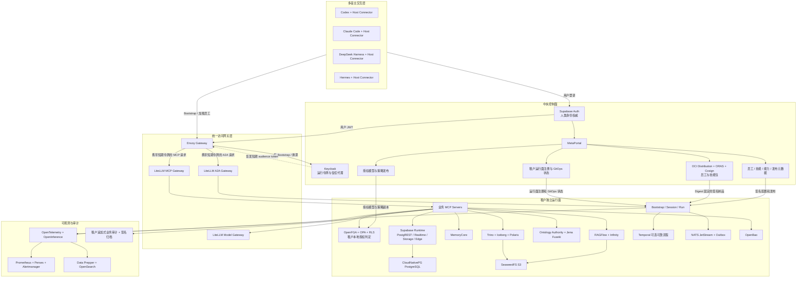

# MetaPlatform 联邦式数字员工平台目标总体架构

> 初版日期：2026-08-31
>
> 修订日期：2026-09-01
>
> 状态：讨论结论已固化，待书面评审
>
> 范围：目标总体架构、组件边界和技术选型
>
> 不包含：现状盘点、迁移方案、业务 MVP 分期、排期和实施任务

## 1. 执行摘要

MetaPlatform 的数字员工不归属于 Codex、Claude Code、DeepSeek Harness、Hermes 或其他单一 AI 客户端。平台保存数字员工的稳定身份、版本、技能、权限、业务会话、记忆、产物和审计；宿主只在当前授权范围内加载数字员工投影并执行交互式 Agent Loop。

本架构采用以下核心方向：

1. **现有 AI 客户端作为数字员工交互入口。** 不重复建设平台级聊天前端。
2. **控制面与数据面分离。** 中央控制面管理定义、发布、身份和治理；每个租户拥有独立运行面和数据面。
3. **MCP、A2A 和事件各司其职。** MCP 调用能力，A2A 调用其他 Agent，NATS 传递事件，Temporal 只承载需要可靠等待和补偿的流程。
4. **服务端记忆保证跨宿主连续。** 切换客户端时恢复业务状态、已确认事实、决策、产物和记忆，不复制宿主内部上下文。
5. **开源组件优先。** 采用 `Adopt → Configure → Extend → Build`；只自研数字员工领域语义、薄宿主 Connector 和业务 MCP Server。
6. **一份结构化权威结果，多种展示格式。** JSON 是权威数据，Markdown、HTML、PDF、DOCX 等只是可验证表示。
7. **混合部署、同构拓扑。** 云端生产使用托管 Kubernetes，私有化或离线使用 RKE2，开发演示使用 Compose；不按租户等级设计不同产品架构。
8. **业务 MVP 驱动建设。** 实施顺序将在本架构评审后单独制定，不在本文件内按组件建设“大平台底座”。

## 2. 架构原则

### 2.1 平台与宿主

- 平台拥有数字员工主权，宿主加载的是本次会话的员工投影。
- 每个宿主只安装一个稳定的 MetaPlatform Host Connector。
- 员工定义不依赖宿主内部 Prompt、模型、子 Agent 机制或聊天记录格式。
- 宿主能力不足时，平台降级为服务端执行、标准 Artifact 或显式拒绝，不能静默放宽权限。
- Codex、Claude Code、DeepSeek Harness、Hermes 的动态加载能力必须按具体版本验证，不能仅凭“支持插件或 MCP”推断其支持完整数字员工生命周期。

### 2.2 控制面与数据面

- 中央控制面只保存租户、员工、技能、版本、授权、发布和运行面注册等治理元数据。
- 租户数据面保存业务数据、任务状态、记忆、知识、凭据、审计和产物。
- 控制面主要走慢路径，不进入每次业务查询和工具调用的同步热路径。
- 一个租户对应一套独立逻辑运行时；托管部署可位于独立 Namespace，私有部署可位于客户集群。
- 所有租户使用同一套 Helm 拓扑和能力模型，不设置技术能力分级。

### 2.3 协议边界

- MCP 是模型可发现、可调用能力的主要北向协议，不是数据库、任务总账、消息总线或大数据传输协议。
- A2A 用于 Agent 与 Agent 的任务协作；数字员工定义仍以 MetaPlatform 控制面为权威。
- HTTPS/OpenAPI 用于控制管理、Bootstrap、状态回写和非模型业务接口。
- NATS JetStream 用于领域事件和异步通知。
- Temporal 是可选的可靠工作流能力，不是所有请求的必经路径。
- Trino、SPARQL、SQL、S3 等协议保留在引擎内部或受控服务端，不直接暴露给模型。

### 2.4 数据、记忆和知识

- 运行状态、长期记忆、企业知识和本体分别管理，不能以聊天记录替代。
- 本体定义业务语义；知识图谱保存关系投影；RAG 提供文档证据；数仓提供可分析数据。
- 查询和分析不允许绕过语义、权限和审计；业务写入必须通过业务 MCP Server 或受治理业务服务。
- 每个业务结论必须能追溯到数据快照、知识切片、本体版本、模型调用和授权决策。

### 2.5 开源与自研

采用以下决策顺序：

```text
直接采用开源组件
→ 通过配置满足
→ 使用插件或薄适配扩展
→ 只有产品独有语义无法覆盖时才自研
```

禁止为了“统一”而重新实现 IAM、授权引擎、模型网关、MCP 网关、A2A 网关、工作流、消息队列、RAG、记忆、图数据库、数据联邦、可观测、制品仓库或部署系统。

## 3. 目标与非目标

### 3.1 目标

- 同一数字员工能够在不同宿主继续同一个业务任务。
- 用户关闭所有客户端后，需要等待、重试或审批的任务仍可继续。
- 员工身份与授权来源同时进入每次能力调用的权限判定。
- 本体、知识、数仓、图谱和业务数据通过稳定语义提供服务。
- 员工、技能、输出 Schema 和模板可以版本化、签名、发布和撤销。
- 所有关键动作具备审批、幂等、补偿、证据和审计能力。
- 平台支持云端、客户私有集群和离线环境的同构部署。

### 3.2 非目标

- 不要求所有宿主使用相同模型、Prompt、Agent Loop、子 Agent 或 UI。
- 不建设新的通用 Agent Framework，不以 Dify、Flowise 或 LangGraph 作为平台内核。
- 不建设新的通用聊天客户端；MetaPortal 只承担管理、查看、确认和运维。
- 不把所有数据复制到中央控制面，也不允许模型直接写任意数据库。
- 不把 Temporal 放入普通查询、生成和识别请求的同步路径。
- 不允许数字员工自行批准高风险动作或未经审批发布本体。
- 不将 MCP Apps 作为基础依赖；不支持时必须能降级为结构化数据和标准文档。
- 不在本文件中确定业务 MVP 的先后顺序和项目排期。

## 4. 总体架构



宿主自己的交互式模型调用保持宿主原生路径；图中的 Model Gateway 只承载服务端模型调用。

### 4.1 分层职责

| 层 | 负责 | 不负责 |
|---|---|---|
| 多宿主交互层 | 用户交互、宿主原生 Agent Loop、加载员工投影 | 员工主数据、最终授权、长期记忆权威 |
| 中央控制面 | 定义、版本、发布、授权模型、租户治理 | 租户业务查询和高频执行状态 |
| 统一访问网关层 | 协议适配、基础身份校验、路由、配额和调用观测 | 对业务对象与动作做最终授权 |
| 租户运行面 | 业务状态、记忆、知识、数据访问、执行、审批和审计 | 跨租户集中保存敏感业务数据 |
| 数据知识引擎 | 文档证据、本体语义、关系投影、联邦查询 | 直接决定业务动作是否允许 |
| 基础设施与可观测 | 运行、存储、安全、备份、监控 | 替代业务审计和业务证据链 |

## 5. 数字员工对象模型

```text
EmployeeDefinition
  └─ EmployeeVersion
       ├─ EmployeePackage
       └─ EmployeeInstance
            └─ BusinessSession
                 ├─ WorkItem
                 │    └─ EmployeeRun
                 └─ HostSession
                      └─ ExecutionLease
```

| 对象 | 语义 |
|---|---|
| `EmployeeDefinition` | 岗位模板的稳定身份、职责和生命周期 |
| `EmployeeVersion` | 不可变版本，固定技能、能力要求、模型策略、知识策略、输出和审批规则 |
| `EmployeePackage` | 面向宿主分发的签名制品，不是员工状态数据库 |
| `EmployeeInstance` | 某租户拥有的长期数字员工，具有稳定 `employee_id` |
| `BusinessSession` | 可跨宿主持续的业务会话，关联目标、事实、决策、产物和任务 |
| `HostSession` | 某宿主的一次短期连接，可丢弃、可重建 |
| `WorkItem` | 业务任务及其授权来源、输入、目标、期限和风险 |
| `EmployeeRun` | 一次执行或重试，固定员工版本、本体版本和权限上下文 |
| `ExecutionLease` | HostSession 对 Run 的短期写权，使用 epoch 阻断旧写者 |

关键不变量：

- `employee_id`、`business_session_id` 和 `work_item_id` 跨宿主稳定。
- HostSession 可丢弃；BusinessSession、Run、Artifact 和 Memory 不随宿主丢失。
- 同一 Run 同时只有一个有效写租约，并行工作通过子 Run 实现。
- 新员工或本体版本发布后，已运行 Run 不原地切换版本。
- 宿主聊天记录不是业务状态，也不是长期记忆。

## 6. 数字员工包与动态加载

### 6.1 EmployeePackage

EmployeePackage 遵循 Agent Skills 目录思想，至少包含：

```text
employee.yaml             员工元数据、版本和宿主要求
skills/                   可加载技能及其资源
capabilities.yaml         逻辑能力要求，不含真实凭据
memory-policy.yaml        记忆写入、召回和作用域策略
outputs/                  JSON Schema 与显示模板
host-overlays/            极少量宿主差异配置
checksums.json            文件摘要
signature                 Cosign 签名引用
```

包使用 OCI Distribution Registry 存储，ORAS 推送和拉取，Cosign 签名。Supabase 只保存员工、版本、分配、审批、Digest 和撤销等元数据；不再自研包存储服务，也不允许使用浮动 `latest`。

### 6.2 Bootstrap 流程

1. 用户通过 Supabase Auth 登录。
2. Host Connector 请求可见数字员工列表。
3. 用户选择员工或业务意图触发员工选择。
4. Connector 调用 `employee.bootstrap`，提交宿主能力、用户上下文和任务范围。
5. 服务端验证用户、员工分配、租户、授权来源和宿主能力。
6. Keycloak 签发面向本次宿主与能力范围的短期运行令牌。
7. 服务端返回员工包 Digest、所需技能、MCP/A2A 入口、记忆策略、输出 Profile 和租约。
8. Connector 验签、加载并建立 HostSession。
9. 任务过程中的状态、产物和记忆候选持续回写服务端。

身份、员工配置、技能、能力、会话状态和记忆必须分开加载，不能合并成一个不可审计的超级 Prompt。

### 6.3 跨宿主切换

跨宿主只迁移受治理的业务状态：

- 已确认的目标、事实和约束。
- 当前 WorkItem、步骤、待办和失败状态。
- 决策、审批和执行回执。
- Artifact、证据和记忆引用。
- 模型或宿主无关的 Checkpoint。

不迁移宿主私有思维链、内部缓存、模型会话对象、隐藏 Prompt 或未确认草稿。旧 Lease 释放或到期后，新宿主获得更高 epoch；任何旧 epoch 写入都必须拒绝。

## 7. 身份、授权与秘密

### 7.1 身份分工

| 对象 | 权威组件 | 说明 |
|---|---|---|
| 人类用户 | Supabase Auth | 注册、登录、MFA、用户会话和人类身份权威 |
| 运行令牌与信任代理 | Keycloak | 外部身份信任、JWT Authorization Grant、内部 Token Exchange、服务账号和短期令牌 |
| 员工与服务主体元数据 | Supabase 表 + Keycloak Client/Service Account | 不建设自研 Principal Registry 服务 |
| 关系权限 | OpenFGA | 人、员工、团队、租户、资源之间的稳定关系 |
| 上下文策略 | OPA | 风险、金额、时间、地域、数据分类、审批状态等动态规则 |
| 数据行权限 | PostgreSQL RLS | 数据库最后一道租户和主体隔离 |
| 凭据与 PKI | OpenBao | API Key、数据库动态凭据、签名密钥、证书和秘密审计 |

Supabase Auth 是人类身份唯一权威；Keycloak 不成为第二套用户主数据库。外部 Supabase 身份进入 Keycloak 时使用标准 OIDC 信任和 JWT Authorization Grant，Keycloak 内部再使用标准 Token Exchange 做 audience 限定和降权。换票只发生在 Bootstrap、续租或权限变化时，MCP/A2A 网关依据缓存的 JWKS 本地验证短期 JWT，不把中央 Keycloak 放入每次业务调用的同步热路径。Supabase OAuth 2.1 Server 在当前版本仍是 Beta，因此不能在未通过生产成熟度验证前成为唯一关键链路。

### 7.2 双主体授权

每个 EmployeeRun 同时携带：

- `employee_principal`：实际执行的数字员工。
- `authorizing_principal`：授权该任务的人、流程、组织或事件。

有效权限为：

```text
员工权限
∩ 授权来源权限
∩ 当前任务范围
∩ 数据策略
∩ 风险与审批策略
```

LiteLLM 只做网关级访问控制、工具过滤、配额和路由；业务对象与动作的最终授权必须由业务 MCP Server 调用 OpenFGA、OPA 和数据库 RLS 完成。

### 7.3 风险等级

| 等级 | 行为 |
|---|---|
| R0 | 查询、分析和报告可自动执行 |
| R1 | 低风险、可逆且已预授权动作可自动执行并审计 |
| R2 | 改变普通业务状态，需要用户或业务负责人确认 |
| R3 | 高金额、不可逆或合规敏感，需要独立审批或双人审批 |
| R4 | 策略禁止，任何主体都不能绕过 |

## 8. MCP、A2A、模型与交互界面

### 8.1 LiteLLM 的三个逻辑角色

同一开源产品按职责拆成三个逻辑网关，可独立配置和扩缩：

| 逻辑角色 | 职责 |
|---|---|
| Model Gateway | 服务端模型别名、路由、配额、成本、回退和 vLLM 接入 |
| MCP Gateway | MCP Server 聚合、协议适配、工具发现、基础访问和调用观测 |
| A2A Gateway | Agent Card、A2A 路由、流式传输、访问、负载和预算 |

宿主内由 Codex、Claude Code、DeepSeek Harness 或 Hermes 发起的原生模型调用保持原生，不强制绕过 LiteLLM。只有服务端模型调用统一进入 Model Gateway。

数字员工不等于 A2A Agent：

- EmployeeDefinition 和 EmployeeInstance 由 MetaPlatform 控制面管理。
- A2A Agent Card 是员工或员工团队的运行时投影。
- A2A 用于“调用另一名员工”；MCP 用于“调用一项能力”。

平台只使用 LiteLLM MIT 开源目录中经过验证的能力。任何商业目录或企业许可证能力都必须单独审批，不能在核心架构中隐式依赖。

### 8.2 MCP Apps

MCP Apps 是可选的 MCP UI 扩展，不是 MetaPortal，也不是新聊天客户端。支持它的宿主可以在对话中沙箱化显示订单卡片、审批表单、图表和本体关系；不支持的宿主必须获得同一结果的 `structuredContent`、Markdown、HTML 或 Artifact 链接。

```text
所有宿主：JSON + Markdown/HTML + Artifact
支持 MCP Apps：额外显示交互式业务界面
```

任何 MCP App 内的按钮都只能请求工具调用，不能绕过服务端鉴权、审批、幂等和审计。

## 9. 运行、事件与可靠工作流

### 9.1 直接调用路径

以下场景默认直接调用 MCP Server 或业务服务，不经过 Temporal：

- 查询订单、客户、合同或知识。
- 本体关系解析和语义识别。
- RAG 检索和报告生成。
- 无外部等待的短时计算。
- 单服务、单数据库的简单幂等操作。

### 9.2 Temporal 使用条件

满足以下任一条件才使用 Temporal：

- 等待用户或多级审批。
- 等待外部系统、回调或长时间处理。
- 跨多个系统并需要重试、补偿或超时。
- 客户端断开后仍必须可靠推进。
- 多 Agent 长任务需要持久化协调。
- 可逆动作需要 Saga 或补偿记录。

Temporal 只拥有具体 WorkflowExecution；Employee Runtime 仍拥有 EmployeeRun 的顶层生命周期。

### 9.3 NATS 与事务 Outbox

NATS JetStream 承载 CloudEvents 风格的领域事件。业务数据库先在同一事务写入业务状态和 Outbox，再由发布器发送 NATS，消费者以 event ID 和 idempotency key 去重。目标基线不引入 Kafka、Flink 或 Spark。

## 10. 数据、知识、本体与记忆

### 10.1 事务和租户数据底座

每个租户拥有独立 CloudNativePG PostgreSQL 集群：

- PostgreSQL 使用经兼容矩阵验证的稳定主版本，实施时以镜像 Digest 锁定。
- PgBouncer 连接池。
- 领域 Schema 隔离；只有 `api` Schema 通过 PostgREST 暴露。
- 启用 `vector`、`pg_trgm`、`pgcrypto`、`pg_stat_statements`、`pgaudit`、`postgres_fdw` 和 `pg_partman`。
- PostgREST、Realtime、Storage、Edge Functions 和 Studio 组成租户 Supabase 逻辑运行时。
- Supabase Auth 保持中央部署，不在每个租户重复建设。
- Studio 只允许内部运维访问；Edge Functions 只承载轻量 Bootstrap 和短任务。

### 10.2 RAG

RAGFlow 是企业文档、解析、切片、索引、检索配置和证据的权威系统；Infinity 作为其混合检索引擎，SeaweedFS 提供 S3 对象存储。MetaPlatform 只实现薄适配器，不复制文档、切片、索引配置或新建 MetaKnowledge 服务。

RAGFlow 作为隔离的上游应用部署，使用其官方支持的 PostgreSQL 元数据后端，复用租户 CloudNativePG 中的独立数据库；缓存使用 Valkey 的 Redis 协议兼容接口。该目标拓扑不再部署 RAGFlow 默认示例中的 MySQL、Redis Server 或 MinIO，防止形成第二套重复数据库、缓存和对象存储。RAGFlow 版本升级时必须重新验证 PostgreSQL、Valkey、Infinity 和 S3 兼容性，不允许通过修改或分叉 RAGFlow 核心来维持兼容。

RAGFlow 负责其内部处理流程；只有跨 RAGFlow、业务系统、本体和审批的发布流程才使用 Temporal。

### 10.3 记忆

腾讯开源 TencentDB Agent Memory 的 MemoryCore 作为数字员工经验记忆引擎：

- L0 对话记录。
- L1 原子事实与事件。
- L2 场景经验。
- L3 稳定画像与核心偏好。
- 以 user、team、agent 和 tenant 维度隔离。

RAGFlow 保存企业知识，MemoryCore 保存员工和用户的经验记忆。平台不引入 MetaMemory、MemoryKnowledge 或 MemoryProxy 等重复层，只建设 Host Connector 到 MemoryCore 的薄适配。

MemoryCore 当前官方独立运行形态以 SQLite、本地文件和单实例为主。生产部署采用“每租户单活 StatefulSet + 加密持久卷 + 定期快照”的保守形态；在未验证官方外部存储、恢复和并发能力前，不宣称多副本高可用，也不为此自行分叉重写记忆引擎。

### 10.4 本体和知识图谱

PostgreSQL 是本体定义、版本、审批、映射和发布状态的权威存储。发布后的 OntologyPackage 作为不可变 OCI Artifact 存储和签名。

Apache Jena Fuseki/TDB2 是可重建的 RDF/图查询投影，提供 RDF、RDFS、OWL、SHACL、SPARQL 和 Named Graph 能力。投影损坏时可从权威版本重建，不允许把 Jena 当作唯一业务事实源。

GraphRAG 只用于抽取和检索模式，不成为独立的本体权威。目标基线不引入 Apache AGE。

### 10.5 数仓与业务数据联邦

分析读取采用：

```text
Ontology Planner
  → Trino
      → PostgreSQL / 业务数据源
      → Iceberg v2 / Parquet
      → SeaweedFS S3
      → Apache Polaris REST Catalog
```

- 本体规划器负责把业务语义映射为数据产品、字段、约束和连接关系。
- Trino 只负责读取和分析，不承担业务写入。
- Iceberg v2 + Parquet 作为湖仓表格式和文件格式。
- Polaris 是 Iceberg REST Catalog。
- 业务变更通过业务 MCP Server 或领域服务执行。
- 目标基线不引入 ClickHouse、Spark、Flink 或 Kafka。

## 11. 标准输出与 Artifact

### 11.1 权威对象

所有业务结果保存为不可变、版本化的 `ArtifactEnvelope` JSON：

```text
artifact_identity
employee_and_execution_context
business_session_and_work_item
ontology_context
structured_payload
evidence
quality_and_findings
recommendations
action_plan_ref
approval_records
execution_receipts
representations
integrity
```

业务报告和 ActionPlan 必须分离：报告说明事实、证据和建议；ActionPlan 描述待确认或待执行动作。模型不能通过输出一段文字直接触发业务写入。

### 11.2 Schema 与表示

- JSON Schema 2020-12 + Ajv 验证结构化结果。
- unified、remark、rehype 和 sanitizer 渲染 Markdown/HTML。
- Playwright 渲染 PDF。
- TypeScript DOCX 组件生成 DOCX。
- HTML 禁止直接使用未经清洗的模型输出。
- 大对象存储在 SeaweedFS S3，PostgreSQL 保存元数据、Digest 和权限。
- MCP 返回 `structuredContent`，同时提供文本 fallback、`resource_link` 和可选 MCP App。

每个表示必须记录媒体类型、内容引用、SHA-256、渲染器版本、源 Artifact 版本、语言、生成时间和安全策略。重新渲染不能改变权威业务状态。

## 12. MetaPortal 与前端标准

MetaPortal 是非聊天型管理与业务工作台，负责：

- 数字员工、技能、权限、分配、版本和发布。
- 任务、BusinessSession、记忆和 Artifact 查看。
- 报告、证据链、ActionPlan 和审批确认。
- 本体构建、关系浏览和运维。
- 审计、运行状态和开源控制台入口。

统一前端基线：

| 用途 | 选择 |
|---|---|
| 应用基座 | React + TypeScript + Vite |
| 通用组件 | Ant Design，作为唯一通用组件库 |
| 管理与 CRUD | Refine + `@refinedev/antd` |
| Schema 表单 | RJSF + `@rjsf/antd` |
| 常规业务图表 | Ant Design Charts |
| 本体与关系图 | Cytoscape.js，作为专业例外 |
| MCP 内嵌 UI | MCP Apps SDK，界面仍复用 Ant Design |
| 文档展示 | 共享 Artifact Renderer |

不在核心前端混用 shadcn/ui、Material UI、Mantine、Chakra UI、Bootstrap、多套图标或多套表格表单体系。`@metaplatform/ui` 只保存主题、语言和少量业务组件，不包装所有 Ant Design 组件，也不重新发明设计系统。

RAGFlow UI、Temporal UI、Supabase Studio、Keycloak Admin、OpenBao UI、OpenSearch Dashboards、Perses 等开源控制台保持原生；MetaPortal 提供统一入口和状态聚合，不复制其功能或维护第三方 UI 分叉。

## 13. 可观测、审计和证据

### 13.1 技术可观测

- OpenTelemetry 统一 Trace、Metric 和 Log 采集。
- OpenInference 描述模型、Agent 和工具 Span。
- Prometheus 采集指标。
- Perses 展示指标，Alertmanager 告警。
- Data Prepper 接收和处理日志、Trace。
- OpenSearch 保存日志和 Trace，OpenSearch Dashboards 提供检索分析。
- 不单独部署 Jaeger；Trace Analytics 由 OpenSearch 体系提供。

每租户保留独立可观测空间和访问控制；中央控制面只汇聚不含敏感业务内容的聚合指标。

### 13.2 业务审计

业务审计不等于技术日志。每个租户使用 PostgreSQL 追加式审计表、pgaudit 和事务 Outbox，记录：

- 谁授权、谁执行、代表谁执行。
- 使用的员工、技能、本体、模型和策略版本。
- 调用了哪些能力和数据产品。
- 使用了哪些证据和快照。
- 产生了什么建议、审批、动作和补偿。

审计批次定期生成 Hash/签名并归档到独立故障域的对象存储。禁止通过日志系统覆盖或删除业务审计事实。

## 14. 基础设施、交付与供应链

### 14.1 部署形态

| 环境 | 选择 |
|---|---|
| 云端生产 | 托管、符合 Kubernetes 标准的集群 |
| 私有化/离线 | RKE2 |
| 开发/演示 | Docker Compose |
| 容器运行时 | containerd |

同一个 TenantRuntime Helm Package 同时支持托管 Namespace 和客户集群，不为不同部署地点维护两套产品代码。

### 14.2 网络和发布

- Helm 管理应用包，Kustomize 管理环境差异。
- Flux CD 使用 Pull 模式 GitOps；中央控制面不长期保存客户集群管理员 kubeconfig。
- Cilium 提供集群网络和 NetworkPolicy。
- Envoy Gateway 提供南北向入口。
- 目标基线不引入 Service Mesh。
- OCI Distribution Registry 保存容器镜像、EmployeePackage、SkillPackage 和 DeploymentBundle。
- ORAS 管理通用 OCI Artifact；所有生产制品使用 Digest 固定。

### 14.3 秘密和供应链

- OpenBao 管理秘密、动态数据库凭据、签名密钥、PKI 和凭据审计。
- cert-manager 管理集群证书。
- External Secrets Operator 或 CSI 将运行时秘密投射到工作负载。
- Git、EmployeePackage、日志和 Artifact 中不得保存明文秘密。
- Trivy 扫描镜像、依赖和配置，生成 SBOM。
- Cosign 签名制品，Sigstore Policy Controller 和 Gatekeeper 执行准入。

### 14.4 算力和恢复

- 节点池区分 system、cpu 和 gpu；不自研调度器。
- CloudNativePG + Barman 提供备份和 PITR。
- SeaweedFS 元数据快照和数据副本进入独立故障域。
- OpenSearch、OpenBao、OCI Registry 和 MemoryCore 均需要独立备份与恢复演练。
- RPO、RTO 和容量指标由后续业务 MVP 规格按场景确定。

## 15. 技术选型总表

| 能力域 | 选型 | 权威职责 |
|---|---|---|
| 人类身份 | Supabase Auth | 用户登录与人类身份权威 |
| 运行令牌 | Keycloak | 外部信任、JWT Grant、Token Exchange、服务账号 |
| 关系授权 | OpenFGA | 人、员工、团队、资源关系 |
| 上下文策略 | OPA | 风险、环境、审批和数据策略 |
| 秘密与 PKI | OpenBao | 凭据、密钥、证书和动态秘密 |
| 事务数据库 | CloudNativePG PostgreSQL | 租户业务和平台元数据 |
| Supabase 数据面 | PostgREST、Realtime、Storage、Edge、Studio | API、实时、对象入口和运维 |
| 连接池 | PgBouncer | PostgreSQL 连接治理 |
| 模型网关 | LiteLLM | 服务端模型路由、成本和配额 |
| MCP 网关 | LiteLLM MCP Gateway | MCP 聚合、协议和基础访问 |
| A2A 网关 | LiteLLM A2A Gateway | Agent Card 与 Agent 路由 |
| 可靠工作流 | Temporal | 审批、等待、重试和补偿 |
| 事件 | NATS JetStream | 领域事件和异步通知 |
| RAG | RAGFlow + PostgreSQL + Valkey + Infinity + SeaweedFS S3 | 文档、切片、索引、检索和证据 |
| 记忆 | TencentDB Agent Memory / MemoryCore | L0-L3 员工经验记忆 |
| 本体权威 | PostgreSQL | 定义、版本、映射、审批和发布 |
| RDF 投影 | Apache Jena Fuseki/TDB2 | RDF、SHACL、SPARQL 和关系查询 |
| 数据联邦 | Trino | 跨源读取和分析 |
| 湖仓格式 | Iceberg v2 + Parquet | 历史与分析数据 |
| Catalog | Apache Polaris | Iceberg REST Catalog |
| 对象存储 | SeaweedFS S3 | 业务文件、Artifact 和数据文件 |
| 制品仓库 | OCI Distribution + ORAS + Cosign | 镜像、员工包、技能包和签名 |
| 前端 | React/Vite + Ant Design + Refine + RJSF | MetaPortal 与共享业务界面 |
| 图谱前端 | Cytoscape.js | 本体和关系图可视化 |
| 技术可观测 | OTel/OpenInference + Prometheus/Perses + OpenSearch | Trace、Metric、Log |
| 集群交付 | Kubernetes/RKE2 + Helm/Kustomize + Flux | 混合部署和 GitOps |

组件版本不在总体架构中写死。实施时必须以兼容矩阵、锁文件和镜像 Digest 固定具体版本。

## 16. 自研边界

### 16.1 允许自研

只允许下列产品差异化内容：

1. 数字员工领域对象、Schema、生命周期和业务规则。
2. 薄 Bootstrap Function、Session/Run 状态和租约语义。
3. Codex、Claude Code、DeepSeek Harness、Hermes 的薄 Host Connector。
4. 面向业务动作和查询的 MCP Server。
5. 领域本体、约束、映射和质量规则。
6. 标准业务输出 Schema、模板和少量共享业务 UI。

### 16.2 禁止重复建设

不自研：

- 新的用户身份系统、Token Service 或 Principal Registry 服务。
- 通用模型、MCP 或 A2A 网关。
- 通用工作流和消息队列。
- 新的 RAG、记忆、图存储或数据联邦引擎。
- 通用制品仓库、部署平台或可观测平台。
- 新的聊天 UI 或第二套前端组件体系。
- 复制 RAGFlow、MemoryCore 或 Supabase 权威数据的中间数据库。

任何新增自研服务必须先书面说明：评估过的开源方案、无法满足的具体缺口、该缺口为何属于 MetaPlatform 独有语义，以及未来移除或替换路径。

## 17. 开源与许可证策略

- 平台自有核心代码和首选依赖使用 Apache-2.0、MIT 或 BSD 系列宽松许可证。
- OpenBao 作为唯一已批准的 MPL-2.0 例外，必须以未修改、隔离部署的基础设施组件使用，不复制其代码进入平台核心。
- 核心交付不得依赖 AGPL、SSPL、BSL 或 Elastic License 组件。
- LiteLLM 只依赖 MIT 开源目录，商业目录能力不属于默认架构。
- 每次版本升级重新生成 SBOM、许可证清单并检查依赖漂移。
- “源代码可见”不等于“允许纳入核心交付”；许可证和功能层级必须同时核验。

## 18. 六个业务场景的架构覆盖

| 场景 | 主要能力链 |
|---|---|
| 合同审查 | 宿主 → 业务 MCP → RAGFlow/本体 → Artifact/证据 → 审批与行动建议 |
| 订单洞察与行动 | 宿主 → 本体规划 → Trino/业务数据 → 报告 → ActionPlan → 审批 → 业务 MCP 写入 |
| 本体构建 | 对话/材料 → 语义抽取员工 → A2A 协作 → 本体候选 → SHACL 校验 → 评审发布 |
| 本体运维 | RAG 切片/Schema 事件 → 漂移检测 → 影响分析 → 回归 → 审批发布或回滚 |
| 对话关系识别 | 对话 → 语义识别 → 本体实体、关系、约束和动作候选 |
| 材料本体识别 | 上传 → 解析与切片 → 带来源跨度的本体候选和证据 |

场景 5 和 6 是场景 1 至 4 的共享语义输入能力，不建立另一套 Employee Runtime。所有场景统一使用 ArtifactEnvelope、Evidence、ActionPlan、审批、审计和跨宿主 BusinessSession。

## 19. 生产准入与架构风险

### 19.1 宿主动态加载

当前总体架构定义的是目标契约，不宣称所有目标宿主已原生支持完整动态员工生命周期。每个宿主在进入实施范围前必须验证：

- Agent Skills 或等价技能加载。
- MCP 连接和工具刷新。
- 身份头或 OAuth 传递。
- 会话恢复和状态回写。
- A2A 与 MCP Apps 的实际支持范围。
- 无法支持时的稳定元工具和 Artifact 降级路径。

### 19.2 Supabase 与 Keycloak 身份链

Supabase OAuth 2.1 Server 当前仍是 Beta。生产准入必须验证 OIDC discovery、JWKS、audience、JWT Authorization Grant、用户链接、撤销和租户映射；如不满足，不得降级到自研 STS，而应继续使用 Keycloak 支持的标准信任链或等待上游成熟。

### 19.3 MemoryCore

必须验证单活故障恢复、SQLite 一致性、卷快照、升级迁移、租户隔离、召回质量和高并发边界。未通过前只可用于受控业务 MVP，不对外承诺多副本 HA。

### 19.4 LiteLLM

必须建立开源功能矩阵，验证所需 MCP/A2A/访问控制是否位于 MIT 目录，并验证 MCP 双向能力、流式、OAuth、审计和失败降级。LiteLLM 不支持的 MCP 扩展不能被平台假装支持。

### 19.5 MCP Apps

MCP Apps 属于可选能力。任何业务流程都必须在宿主不支持 MCP Apps 时，以 JSON、Markdown/HTML、Artifact 链接或 MetaPortal 完成。

### 19.6 RAGFlow 目标拓扑

生产准入必须用锁定版本验证 RAGFlow 的 PostgreSQL 元数据后端、Valkey 协议兼容、Infinity 混合检索和 SeaweedFS S3 行为，包括迁移、备份恢复、权限、并发、升级和回滚。若某版本无法通过，不得临时引入未经批准的数据库或许可证例外，也不得自研或分叉新的 RAG 引擎；应固定可用版本，或返回架构评审重新选择上游组件。

## 20. 总体架构验收标准

架构验收的第一性标准是：任意时刻都能证明“同一名员工在处理同一个业务任务”，且不存在越权、状态分叉、重复副作用或证据丢失。

必须验证：

- 宿主 A 开始任务，宿主 B 从同一 BusinessSession 和 WorkItem 继续。
- 新 Lease 生效后，旧 epoch 的迟到写入被拒绝。
- 客户端关闭后，Temporal 管理的等待、审批和补偿仍可推进。
- 直接查询不被无意义地路由进 Temporal。
- 重复请求和重复事件只产生一次业务效果。
- 员工权限与授权来源权限均被执行，客户端不能绕过。
- 记忆在 user、employee、team 和 tenant 维度隔离且不泄露存在性。
- RAG 证据、数据快照、本体版本、模型调用和动作回执可追溯。
- Provider 替换不改变 Capability 和 Artifact 契约。
- 控制面暂时不可达时，只允许有效签名配置继续运行，不允许权限提升。
- 运行中的 Run 固定员工和本体版本，发布或回滚不破坏既有任务。
- 托管 Namespace 与客户 RKE2 集群使用同一 TenantRuntime 包。
- 所有生产制品均有 Digest、签名、SBOM 和许可证审查记录。

## 21. 后续文档边界

本文件评审通过后，下一份文档单独定义业务 MVP 推进计划，包括：

- 业务 MVP 的优先级和依赖关系。
- 每个阶段的真实业务闭环和用户入口。
- 每个阶段启用的最小组件集合。
- 场景级业务指标、金标案例、风险阈值和生产准入。
- 现有实现的复用、替换、停用和迁移顺序。
- 里程碑、人员、工作包和验收节奏。

跨宿主切换只作为每个业务 MVP 的架构验收项，不作为独立、没有业务价值的产品阶段。

## 22. 主要上游依据

- LiteLLM 模型、MCP 与 A2A Gateway：<https://github.com/BerriAI/litellm>
- MCP Apps 规范与 SDK：<https://github.com/modelcontextprotocol/ext-apps>
- Keycloak Token Exchange：<https://www.keycloak.org/securing-apps/token-exchange>
- Keycloak JWT Authorization Grant：<https://www.keycloak.org/securing-apps/jwt-authorization-grant>
- Supabase OAuth 2.1 Server：<https://supabase.com/docs/guides/auth/oauth-server>
- RAGFlow：<https://github.com/infiniflow/ragflow>
- RAGFlow 元数据后端与运行配置：<https://github.com/infiniflow/ragflow/blob/main/docker/.env>
- TencentDB Agent Memory / MemoryCore：<https://github.com/TencentCloud/TencentDB-Agent-Memory>
- Apache Jena：<https://github.com/apache/jena>
- Apache Polaris 与 Trino 集成：<https://github.com/apache/polaris/blob/main/site/content/guides/trino/index.md>
- Refine UI 集成：<https://refine.dev/core/docs/ui-integrations/>
- Ant Design：<https://github.com/ant-design/ant-design>
- RJSF：<https://github.com/rjsf-team/react-jsonschema-form>
- OpenBao：<https://github.com/openbao/openbao>
