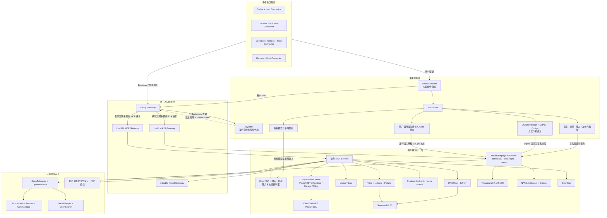

# MetaPlatform 目标总体架构

> 初版日期：2026-08-31
>
> 修订日期：2026-09-01
>
> 状态：架构、技术与实施三路多 Agent 交叉评审通过；作为条件性实施基线，未执行的生产 Gate 均保持 `NOT_EXERCISED`
>
> 范围：目标总体架构、组件边界和技术选型
>
> 不包含：现状盘点、迁移方案、业务 MVP 分期、排期和实施任务

## 1. 执行摘要

MetaPlatform 的数字员工不归属于 Codex、Claude Code、DeepSeek Harness、Hermes 或其他单一 AI 客户端。平台保存数字员工的稳定身份、版本、技能、权限、业务会话、记忆、产物和审计；宿主只在当前授权范围内加载数字员工投影并执行交互式 Agent Loop。

本架构采用以下核心方向：

1. **现有 AI 客户端作为数字员工交互入口。** 不重复建设平台级聊天前端。
2. **控制面与数据面分离。** 中央控制面管理定义、发布、身份和治理；每个租户拥有独立运行面和数据面。
3. **MCP、A2A 和事件各司其职。** MCP 调用能力，A2A 调用其他 Agent，NATS 传递事件，Temporal 只承载需要可靠等待和补偿的流程。
4. **服务端记忆保证跨宿主连续。** 切换客户端时恢复业务状态、已确认事实、决策、产物和记忆，不复制宿主内部上下文。
5. **开源组件优先。** 采用 `Adopt → Configure → Extend → Build`；只自研数字员工领域语义、薄宿主 Connector 和业务 MCP Server。
6. **一份结构化权威结果，多种展示格式。** JSON 是权威数据，Markdown、HTML、PDF、DOCX 等只是可验证表示。
7. **混合部署、同构能力。** 云端生产使用托管 Kubernetes，连接型私有部署使用 RKE2；完全断网环境采用包含本地身份、策略、制品和 GitOps 源的 Disconnected Cell。开发演示使用 Compose；部署地点不同，但业务契约不分级。
8. **业务 MVP 驱动建设。** 实施顺序将在本架构评审后单独制定，不在本文件内按组件建设“大平台底座”。

## 2. 架构原则

### 2.1 平台与宿主

- 平台拥有数字员工主权，宿主加载的是本次会话的员工投影。
- 每个宿主只安装一个稳定的 MetaPlatform Host Connector。
- 员工定义不依赖宿主内部 Prompt、模型、子 Agent 机制或聊天记录格式。
- 宿主能力不足时，平台降级为服务端执行、标准 Artifact 或显式拒绝，不能静默放宽权限。
- Codex、Claude Code、DeepSeek Harness、Hermes 的动态加载能力必须按具体版本验证，不能仅凭“支持插件或 MCP”推断其支持完整数字员工生命周期。

### 2.2 控制面与数据面

- 中央控制面只保存租户、员工、技能、版本、授权、发布和运行面注册等治理元数据。
- 租户数据面保存业务数据、任务状态、记忆、知识、凭据、审计和产物。
- 控制面主要走慢路径，不进入每次业务查询和工具调用的同步热路径。
- 一个租户对应一套独立逻辑运行时；托管部署可位于独立 Namespace，私有部署可位于客户集群。
- 所有租户使用同一套 Helm 拓扑和能力模型，不设置技术能力分级。
- 连接型私有部署的业务流量只进入租户本地 Gateway；中央控制面只发布签名治理包，不代理业务数据。
- 完全断网的 Disconnected Cell 在本地提供身份代理、Bootstrap、策略副本、OCI Registry 和 GitOps 源；中央制品通过签名 `DeploymentBundle` 离线导入。

### 2.3 协议边界

- MCP 是模型可发现、可调用能力的主要北向协议，不是数据库、任务总账、消息总线或大数据传输协议。
- A2A 用于 Agent 与 Agent 的任务协作；数字员工定义仍以 MetaPlatform 控制面为权威。
- HTTPS/OpenAPI 用于控制管理、Bootstrap、状态回写和非模型业务接口。
- NATS JetStream 用于领域事件和异步通知。
- Temporal 是可选的可靠工作流能力，不是所有请求的必经路径。
- Trino、SPARQL、SQL、S3 等协议保留在引擎内部或受控服务端，不直接暴露给模型。

### 2.4 数据、记忆和知识

- 运行状态、长期记忆、企业知识和本体分别管理，不能以聊天记录替代。
- 本体定义业务语义；知识图谱保存关系投影；RAG 提供文档证据；数仓提供可分析数据。
- 查询和分析不允许绕过语义、权限和审计；业务写入必须通过业务 MCP Server 或受治理业务服务。
- 每个业务结论必须能追溯到数据快照、知识切片、本体版本、模型调用和授权决策。

### 2.5 开源与自研

采用以下决策顺序：

```text
直接采用开源组件
→ 通过配置满足
→ 使用插件或薄适配扩展
→ 只有产品独有语义无法覆盖时才自研
```

禁止为了“统一”而重新实现 IAM、授权引擎、模型网关、MCP 网关、A2A 网关、工作流、消息队列、RAG、记忆、图数据库、数据联邦、可观测、制品仓库或部署系统。

## 3. 目标与非目标

### 3.1 目标

- 同一数字员工能够在不同宿主继续同一个业务任务。
- 用户关闭所有客户端后，需要等待、重试或审批的任务仍可继续。
- 员工身份与授权来源同时进入每次能力调用的权限判定。
- 本体、知识、数仓、图谱和业务数据通过稳定语义提供服务。
- 员工、技能、输出 Schema 和模板可以版本化、签名、发布和撤销。
- 可逆动作必须具备审批、幂等、补偿、证据和审计；不可逆动作必须在执行前完成独立审批、前置条件复核和演练，不承诺事后补偿。
- 平台支持云端、客户私有集群和离线环境的同构部署。

### 3.2 非目标

- 不要求所有宿主使用相同模型、Prompt、Agent Loop、子 Agent 或 UI。
- 不建设新的通用 Agent Framework，不以 Dify、Flowise 或 LangGraph 作为平台内核。
- 不建设新的通用聊天客户端；MetaPortal 只承担管理、查看、确认和运维。
- 不把所有数据复制到中央控制面，也不允许模型直接写任意数据库。
- 不把 Temporal 放入普通查询、生成和识别请求的同步路径。
- 不允许数字员工自行批准高风险动作或未经审批发布本体。
- 不将 MCP Apps 作为基础依赖；不支持时必须能降级为结构化数据和标准文档。
- 不在本文件中确定业务 MVP 的先后顺序和项目排期。

## 4. 总体架构



统一访问网关是逻辑层，不等于中央共享代理。托管租户和连接型私有租户的业务 MCP、A2A 与 Model Gateway 均部署在租户运行面或其本地边界；中央入口只处理登录、Bootstrap 和治理慢路径。宿主自己的交互式模型调用保持宿主原生路径；图中的 Model Gateway 只承载服务端模型调用。

### 4.1 分层职责

| 层 | 负责 | 不负责 |
|---|---|---|
| 多宿主交互层 | 用户交互、宿主原生 Agent Loop、加载员工投影 | 员工主数据、最终授权、长期记忆权威 |
| 中央控制面 | 定义、版本、发布、授权模型、租户治理 | 租户业务查询和高频执行状态 |
| 统一访问网关层 | 协议适配、基础身份校验、路由、配额和调用观测 | 对业务对象与动作做最终授权 |
| 租户运行面 | 业务状态、记忆、知识、数据访问、执行、审批和审计 | 跨租户集中保存敏感业务数据 |
| 数据知识引擎 | 文档证据、本体语义、关系投影、联邦查询 | 直接决定业务动作是否允许 |
| 基础设施与可观测 | 运行、存储、安全、备份、监控 | 替代业务审计和业务证据链 |

## 5. 数字员工对象模型

```text
EmployeeDefinition
  └─ EmployeeVersion
       ├─ EmployeePackage
       └─ EmployeeInstance
            └─ BusinessSession
                 ├─ WorkItem
                 │    └─ EmployeeRun
                 └─ HostSession
                      └─ ExecutionLease
```

| 对象 | 语义 |
|---|---|
| `EmployeeDefinition` | 岗位模板的稳定身份、职责和生命周期 |
| `EmployeeVersion` | 不可变版本，固定技能、能力要求、模型策略、知识策略、输出和审批规则 |
| `EmployeePackage` | 面向宿主分发的签名制品，不是员工状态数据库 |
| `EmployeeInstance` | 某租户拥有的长期数字员工，具有稳定 `employee_id` |
| `BusinessSession` | 可跨宿主持续的业务会话，关联目标、事实、决策、产物和任务 |
| `HostSession` | 某宿主的一次短期连接，可丢弃、可重建 |
| `WorkItem` | 业务任务及其授权来源、输入、目标、期限和风险 |
| `EmployeeRun` | 一次执行或重试，固定员工版本、本体版本和权限上下文 |
| `ExecutionLease` | HostSession 对 Run 的短期写权，使用 epoch 阻断旧写者 |

关键不变量：

- `employee_id`、`business_session_id` 和 `work_item_id` 跨宿主稳定。
- HostSession 可丢弃；BusinessSession、Run、Artifact 和 Memory 不随宿主丢失。
- 同一 Run 同时只有一个有效写租约，并行工作通过子 Run 实现。
- 新员工或本体版本发布后，已运行 Run 不原地切换版本。
- 宿主聊天记录不是业务状态，也不是长期记忆。

### 5.1 运行状态权威

`Tenant Employee Runtime` 是 `BusinessSession`、`WorkItem`、`EmployeeRun`、`HostSession` 和 `ExecutionLease` 的唯一状态权威，状态持久化于租户 PostgreSQL 的 `Run Ledger`。所有状态转换提交 `expected_state_version`，并在同一数据库事务中以 compare-and-swap 更新；版本不匹配必须拒绝，不能以最后写入覆盖。

Run Ledger 必须分别持久化 `business_sessions`、`work_items`、`employee_runs`、`host_sessions`、`execution_leases`、`checkpoints` 和 `runtime_commands`，并用外键表达对象所有权。每个 RuntimeCommand 以 `(tenant_id, run_id, idempotency_key)` 唯一并外键归属 EmployeeRun；`transition_run` 的 CAS 胜者必须在同一事务追加命令和新状态，CAS 失败或回滚不能留下孤立命令，重复键不能重复推进。BusinessSession/WorkItem 跨宿主稳定；HostSession 可删除重建；新 HostSession 在单事务中取得更高 Lease epoch；Run 固定 employee、ontology、policy 和 assignment 快照。删除 HostSession 不删除业务对象，旧 HostSession 不得重新获得已被更高 epoch 接管的写权。

Temporal、NATS、A2A、宿主和业务 MCP 只能向 Employee Runtime 提交命令或结果，不能直接改写 Run 状态。每个 `WorkflowExecution`、A2A Task、领域事件和 Artifact 都必须关联一个 `run_id` 或 `subrun_id`。业务状态不能同时由 Workflow 与事件消费者分别拥有。

### 5.2 租约隔离与副作用栅栏

所有变更型 MCP 调用、Artifact/Memory 提交和异步回调必须携带：

```text
run_id + lease_id + lease_epoch + idempotency_key
```

业务 MCP 在授权通过后、产生任何副作用前，向 Run Ledger 原子校验当前 Lease epoch。旧 epoch 在副作用入口即失败；仅在数据库提交后检查无效。不能原生接收 fencing token 的外部系统必须经租户本地副作用台账和幂等代理调用，并以 `run_id + action_plan_digest + idempotency_key` 保证至多一次业务效果。

外部 Provider 必须原生接受幂等键，或提供按该键查询/对账的 API。调用可能成功但回执尚未落库时，副作用台账进入 `INDETERMINATE`，由对账确认 `SUCCEEDED | FAILED`；禁止盲目重发。既不接受幂等键也不能查询结果的外部动作不得进入自动执行范围。

## 6. 数字员工包与动态加载

### 6.1 EmployeePackage

EmployeePackage 遵循 Agent Skills 目录思想，默认只包含声明式指令、Schema、模板和静态资源，至少包含：

```text
employee.yaml             员工元数据、版本和宿主要求
skills/                   可加载技能及其资源
capabilities.yaml         逻辑能力要求，不含真实凭据
memory-policy.yaml        记忆写入、召回和作用域策略
outputs/                  JSON Schema 与显示模板
host-overlays/            极少量宿主差异配置
checksums.json            文件摘要
permissions.yaml          声明式能力和数据访问范围
signature                 Cosign 签名引用
```

包使用 OCI Distribution Registry 存储，ORAS 推送和拉取，Cosign 签名。Supabase 只保存员工、版本、分配、审批、Digest 和撤销等元数据；不再自研包存储服务，也不允许使用浮动 `latest`。

EmployeePackage 禁止安装钩子、隐式命令和随包自动执行的二进制。确需执行代码的 Skill 必须作为独立 `SkillPackage`，声明文件、网络、进程和外部系统能力，经过发布审批并在受限沙箱运行。Host Connector 对未声明能力默认拒绝，不向 Skill 暴露宿主凭据，并执行出站网络 allowlist。平台分别管理签名信任根、密钥轮换、撤销列表和离线信任包；“已签名”只证明来源，不代表获得任意宿主权限。

在选定开源沙箱并完成文件/网络/进程拒绝、凭据不可见、资源配额和 egress allowlist 的运行时 Gate 前，可执行 SkillPackage 的平台状态为 `NOT_SUPPORTED`；EmployeePackage 只能分发声明式内容。权限 Manifest、签名和 SBOM 本身不能把该状态提升为可运行。

### 6.2 Bootstrap 流程

1. 用户通过 Supabase Auth 登录。
2. Host Connector 请求可见数字员工列表。
3. 用户选择员工或业务意图触发员工选择。
4. Connector 调用 `employee.bootstrap`，提交宿主能力、用户上下文和任务范围。
5. 服务端验证用户、员工分配、租户、授权来源和宿主能力。
6. Keycloak 签发面向本次宿主与能力范围的短期运行令牌。
7. 服务端返回员工包 Digest、所需技能、MCP/A2A 入口、记忆策略、输出 Profile 和租约。
8. Connector 验签、加载并建立 HostSession。
9. 任务过程中的状态、产物和记忆候选持续回写服务端。

身份、员工配置、技能、能力、会话状态和记忆必须分开加载，不能合并成一个不可审计的超级 Prompt。

### 6.3 跨宿主切换

跨宿主只迁移受治理的业务状态：

- 已确认的目标、事实和约束。
- 当前 WorkItem、步骤、待办和失败状态。
- 决策、审批和执行回执。
- Artifact、证据和记忆引用。
- 模型或宿主无关的 Checkpoint。

不迁移宿主私有思维链、内部缓存、模型会话对象、隐藏 Prompt 或未确认草稿。旧 Lease 释放或到期后，新宿主获得更高 epoch；任何旧 epoch 写入都必须拒绝。

## 7. 身份、授权与秘密

### 7.1 身份分工

| 对象 | 权威组件 | 说明 |
|---|---|---|
| 人类用户 | Supabase Auth；Disconnected Cell 可接客户本地 OIDC IdP | 各部署信任域内唯一的人类身份权威；平台映射稳定 `(issuer, sub)` |
| 运行令牌与信任代理 | Keycloak | OIDC Identity Brokering、内部 Token Exchange、服务账号和短期令牌；JWT Authorization Grant 仅作条件非交互路径 |
| 员工与服务主体元数据 | Supabase 表 + Keycloak Client/Service Account | 不建设自研 Principal Registry 服务 |
| 关系权限 | OpenFGA | 人、员工、团队、租户、资源之间的稳定关系 |
| 上下文策略 | OPA | 风险、金额、时间、地域、数据分类、审批状态等动态规则 |
| 数据行权限 | PostgreSQL RLS | 数据库最后一道租户和主体隔离 |
| 凭据与 PKI | OpenBao | API Key、数据库动态凭据、签名密钥、证书和秘密审计 |

连接型部署以 Supabase Auth 作为人类身份唯一权威；Keycloak 不成为第二套用户主数据库。交互式登录的主路径是 Keycloak OIDC Identity Brokering：浏览器使用 Authorization Code + PKCE 跳转到 Supabase OAuth/OIDC Server，Keycloak 校验 discovery/JWKS、ID Token 的 `iss`、`aud`、`nonce`、`exp` 和预链接 `(issuer, sub)` 后，只保存外部身份链接，再签发内部令牌。Keycloak 内部使用标准 Token Exchange 做 audience 限定和降权。JWT Authorization Grant 仅在锁定 Supabase 版本能签发以 Keycloak token endpoint 为明确 audience、带一次性 `jti` 的非交互断言且通过 Gate 时启用；普通 Supabase access token 或为其他客户端签发的 ID Token 不得直接充当该断言。换票只发生在 Bootstrap、续租或权限变化时，MCP/A2A 网关依据缓存的 JWKS 本地验证短期 JWT，不把中央 Keycloak 放入每次业务调用的同步热路径。2026-09-01 检查的 Supabase 官方文档仍将 OAuth 2.1 Server 标记为 Beta；生产判定以 Gate 锁定版本的证据为准，不依赖该标签长期不变。

Disconnected Cell 采用客户本地 OIDC IdP 或 Cell 内 Supabase Auth 作为该 Cell 的人类身份权威；平台只保存稳定 `(issuer, sub) → platform_user_id` 映射，Keycloak 仍只做信任代理与运行令牌。Cell 必须在断网期本地完成用户生命周期、MFA、撤销和审计；若客户不提供本地身份权威，则 Cell 只允许断网前签发且有限期的离线凭据，不支持新用户注册、登录或链接。

运行令牌的授权事实只能由服务端生成。最低 Claim 契约为：

```text
tenant_id
human_subject
employee_principal
authorizing_principal
business_session_id
work_item_id
run_id
lease_id
lease_epoch
aud
scope
policy_version
assignment_version
revocation_watermark
jti
exp
```

客户端提交的同名字段只能用于相关性检查，不能覆盖令牌 Claim。Run 固定创建时的授权证据快照，但每次副作用仍须检查当前 deny、主体撤销、WorkItem 状态、Lease 和 Approval；“固定快照”不表示忽略后来发生的撤权。

请求级上下文分为两个阶段，不能循环依赖：`BootstrapCallContext` 只来自已验证的人类登录令牌，包含人类主体、租户和 audience/scope，不要求尚未创建的 BusinessSession、WorkItem、Run 或 Lease。员工/任务选择和宿主能力是未受信请求参数；宿主能力必须由 Connector 实例证明或由服务端兼容矩阵校验，不能伪装成人类登录 Claim。服务端校验可见员工、分配、策略和宿主能力后创建运行对象并促成签发 Runtime Token。`RuntimeToolCallContext` 只来自上面的完整 Runtime Token，用于 resume、业务工具、Resource 和副作用。Runtime Token 不能作为首次 Bootstrap 的前置条件，Bootstrap 上下文也不能调用运行期工具。

模型可见的 Bootstrap 工具结果只能包含非敏感 `bootstrap_id`、员工投影/配置 Digest 和下一步状态，不能包含 Runtime Token、可兑换 bearer grant、PKCE verifier 或秘密引用。Connector 必须通过模型不可见的控制通道，继续持有原人类会话，并使用 PKCE 加 Connector 实例 DPoP/mTLS 证明完成换票。服务端保存的一次性 exchange grant 使用 `jti` 防重放、短 TTL，并绑定 tenant、human、employee、Run、Lease、host instance 和 audience；错宿主、错 audience、超时或重复兑换都失败。

REST 与 MCP Streamable HTTP 必须把验证后的令牌转换为对应的请求级上下文，再由工具和 Resource 读取；请求体、固定默认租户或客户端声明的 caller 都不是授权事实。异步/并发传递必须请求隔离并在结束时清理，不能跨租户泄漏上下文。Stdio 不具备人类请求身份时，只允许显式配置的服务主体能力，受保护的数字员工工具默认禁用。

该 Runtime Token Claim 契约与上游人类身份来源无关：受控 MVP 使用当前 Keycloak 登录兼容路径时也必须签发同样的短期、audience 限定运行令牌。Supabase Auth → Keycloak 只替换人类身份来源和链接链路，不能延后或改变业务侧 Claim、授权和撤销语义。

### 7.2 双主体授权

每个 EmployeeRun 同时携带：

- `employee_principal`：实际执行的数字员工。
- `authorizing_principal`：授权该任务的人、流程、组织或事件。

有效权限为：

```text
员工权限
∩ 授权来源权限
∩ 当前任务范围
∩ 数据策略
∩ 风险与审批策略
```

LiteLLM 只做网关级访问控制、工具过滤、配额和路由；业务对象与动作的最终授权必须由业务 MCP Server 调用 OpenFGA、OPA 和数据库 RLS 完成。

中央控制面拥有授权模型、员工分配和签名策略包；租户运行面拥有业务资源关系事实。OpenFGA 关系元组不得同时由中央和租户数据库作为权威。策略包按版本签名并原子激活，可回滚；租户运行面维护单调递增的 `policy_watermark`、`assignment_watermark` 和 `revocation_watermark`。副本落后或超过离线有效期时，R1-R4 操作失败关闭，只有策略明确允许的 R0 只读能力可继续。

### 7.3 风险等级

| 等级 | 行为 |
|---|---|
| R0 | 查询、分析和报告可自动执行 |
| R1 | 低风险、可逆且已预授权动作可自动执行并审计 |
| R2 | 改变普通业务状态，需要用户或业务负责人确认 |
| R3 | 高金额、不可逆或合规敏感，需要独立审批或双人审批 |
| R4 | 策略禁止，任何主体都不能绕过 |

风险等级由服务端 Policy Decision 计算；模型和宿主只能提出候选等级。策略可直接提高风险等级；降低等级必须引用策略版本并留下审计证据。

## 8. MCP、A2A、模型与交互界面

### 8.1 LiteLLM 的三个逻辑角色

同一开源产品按职责拆成三个逻辑网关，可独立配置和扩缩：

| 逻辑角色 | 职责 |
|---|---|
| Model Gateway | 服务端模型别名、路由、配额、成本、回退和 vLLM 接入 |
| MCP Gateway | MCP Server 聚合、协议适配、工具发现、基础访问和调用观测 |
| A2A Gateway | Agent Card、A2A 路由、流式传输、访问、负载和预算 |

宿主内由 Codex、Claude Code、DeepSeek Harness 或 Hermes 发起的原生模型调用保持原生，不强制绕过 LiteLLM，但其输出默认是“不受信候选”。正式报告、R1-R3 动作和本体发布所依赖的推理必须通过服务端 Model Gateway，或来自已通过准入且能提供可验证 `ModelReceipt` 的宿主。没有回执的结果只能保存为草稿，不能触发副作用。

`ModelReceipt` 至少记录 provider、model、模型版本、模型策略版本、输入/输出 Digest、调用时间、调用 ID、数据驻留标签和调用方。回执记录调用事实，不暴露宿主私有思维链。

数字员工不等于 A2A Agent：

- EmployeeDefinition 和 EmployeeInstance 由 MetaPlatform 控制面管理。
- A2A Agent Card 是员工或员工团队的运行时投影。
- A2A 用于“调用另一名员工”；MCP 用于“调用一项能力”。

每次 A2A 委托创建独立 `SubRun`，记录父 Run、完整委托链、预算、最大深度、截止时间、权限衰减和审批继承规则。子 Run 不得扩权；Employee Runtime 拒绝循环调用、超深度调用、超预算调用和超过父 Run 截止时间的调用。A2A Gateway 负责协议与路由，Employee Runtime 负责这些业务约束。

平台只使用 LiteLLM MIT 开源目录中经过验证的能力。任何商业目录或企业许可证能力都必须单独审批，不能在核心架构中隐式依赖。

### 8.2 MCP Apps

MCP Apps 是可选的 MCP UI 扩展，不是 MetaPortal，也不是新聊天客户端。支持它的宿主可以在对话中沙箱化显示订单卡片、审批表单、图表和本体关系；不支持的宿主必须获得同一结果的 `structuredContent`、Markdown、HTML 或 Artifact 链接。

```text
所有宿主：JSON + Markdown/HTML + Artifact
支持 MCP Apps：额外显示交互式业务界面
```

任何 MCP App 内的按钮都只能请求工具调用，不能绕过服务端鉴权、审批、幂等和审计。

## 9. 运行、事件与可靠工作流

### 9.1 直接调用路径

以下场景默认直接调用 MCP Server 或业务服务，不经过 Temporal：

- 查询订单、客户、合同或知识。
- 本体关系解析和语义识别。
- RAG 检索和报告生成。
- 无外部等待的短时计算。
- 单服务、单数据库的简单幂等操作。

### 9.2 Temporal 使用条件

满足以下任一条件才使用 Temporal：

- 等待用户或多级审批。
- 等待外部系统、回调或长时间处理。
- 跨多个系统并需要重试、补偿或超时。
- 客户端断开后仍必须可靠推进。
- 多 Agent 长任务需要持久化协调。
- 可逆动作需要 Saga 或补偿记录。

Temporal 只拥有具体 WorkflowExecution；Employee Runtime 仍拥有 EmployeeRun 的顶层生命周期。

Temporal Activity 对业务数据库和外部系统的每次写入都必须先登记 Activity 幂等台账。Workflow Signal、外部回调和 NATS 事件通过 Workflow Inbox 去重，统一携带 `causation_id`、`correlation_id` 和 `run_id`。取消从 WorkItem 传播到 Workflow、Activity 和 SubRun；无法取消的外部动作必须显式标记并进入对账。Workflow Replay 只能重放确定性编排，不能重放未受台账保护的副作用。

Temporal History 只保存 `authorization_grant_ref`、Run/Approval/Object Digest 和非敏感决策事实，不保存用户 bearer token 或 refresh token。Activity 使用 worker service principal 获取自己的短期令牌，再由租户本地授权服务根据 Run 中的 `authorizing_principal`、当前策略/分配/撤销水位、Approval 和 Lease 重新判定。等待期间用户或员工撤权、Approval 过期、策略推进或 Lease 失效时，Activity 失败关闭；worker service account 不能替代双主体交集。

### 9.3 NATS 与事务 Outbox

NATS JetStream 承载 CloudEvents 风格的领域事件。业务数据库先在同一事务写入业务状态和 Outbox，再由发布器发送 NATS，消费者以 event ID 和 idempotency key 去重。事件必须包含 tenant、Run/SubRun、因果链、Schema 版本和权限水位；消费失败按可重试、不可重试和毒消息分类，进入有界重试或 DLQ。DLQ 重放仍须经过 Run 状态、Lease、授权和幂等检查。目标基线不引入 Kafka、Flink 或 Spark。

每个生产者使用独立 NATS service principal/account，Subject ACL 绑定可发布的 tenant/domain，事件记录 `producer_principal` 和签名/连接身份。消费者把 NATS 身份映射到服务主体并验证 tenant、event type、Run 关联和权限水位；事件字段本身不能自证身份。未经认证或超出 Subject ACL 的生产者不能触发数据读取、模型调用或 MaintenanceRun。

## 10. 数据、知识、本体与记忆

### 10.1 事务和租户数据底座

每个租户拥有独立 CloudNativePG PostgreSQL 集群：

- PostgreSQL 使用经兼容矩阵验证的稳定主版本，实施时以镜像 Digest 锁定。
- PgBouncer 连接池。
- 领域 Schema 隔离；只有 `api` Schema 通过 PostgREST 暴露。
- 启用 `vector`、`pg_trgm`、`pgcrypto`、`pg_stat_statements`、`pgaudit`、`postgres_fdw` 和 `pg_partman`。
- PostgREST、Realtime、Edge Functions 和 Studio 组成租户 Supabase 逻辑运行时。Storage 只有在锁定版本证明可把 SeaweedFS 作为唯一 S3 对象后端时才启用；否则由受治理的 Artifact Object API 直接访问 SeaweedFS。
- 连接型部署的 Supabase Auth 保持中央部署，不在每个租户重复建设；Disconnected Cell 按 §7.1 选择客户本地 OIDC IdP 或 Cell 内 Supabase Auth。
- Studio 只允许内部运维访问；Edge Functions 只承载轻量 Bootstrap 和短任务。

业务场景共享两类输入证据权威，不以合同领域对象或宿主聊天记录代替：

- `GovernedSourceDocument`：保存逻辑文档身份、不可变版本 Digest、对象引用、ACL、数据分类、扫描结果、保留期和撤回状态；合同、一般材料和知识加工复用它。
- `DialogueSourceSnapshot`：保存经服务端授权后的最小对话片段、消息 Digest、说话人、时间、字符跨度、ACL、保留期和撤回状态。Host Connector 提交的文本在进入 Snapshot 前属于非受信输入。

合同等领域对象只引用 GovernedSourceDocument；OntologyProposal 只引用 SourceSnapshot/SourceDocument 的 Digest 和跨度。来源撤回后，未发布候选立即撤销；已发布本体保持历史不可变，同时创建 Maintenance/Remediation Proposal、标记当前 provenance 风险并通知消费者。

### 10.2 RAG

RAGFlow 是企业文档、解析、切片、索引、检索配置和证据的权威系统；Infinity 作为其混合检索引擎，SeaweedFS 提供 S3 对象存储。MetaPlatform 只实现薄适配器，不复制文档、切片、索引配置或新建 MetaKnowledge 服务。

RAGFlow 作为隔离的上游应用部署，使用其官方支持的 PostgreSQL 可选元数据后端，复用租户 CloudNativePG 中的独立数据库；缓存复用外部 Valkey，并禁用上游内建实例。目标 Helm/Compose 和离线交付包不得部署或打包 MySQL、Elasticsearch、Silo 和 MinIO 等未选服务的镜像/Chart；若 RAGFlow 主镜像仅包含未启用的客户端库，必须由 SBOM 单独登记，不能把它误报为已部署服务。RAGFlow 自身使用的消息能力与平台 NATS JetStream 分集群或命名空间管理，不承担平台领域事件总线。版本升级时必须重新验证 PostgreSQL、Valkey、Infinity 和 SeaweedFS S3 兼容性，不允许通过修改或分叉 RAGFlow 核心来维持兼容。

RAGFlow 负责其内部处理流程；只有跨 RAGFlow、业务系统、本体和审批的发布流程才使用 Temporal。

进入权威 Artifact 的 RAG Evidence 必须保存文档 Digest、切片 ID、原文跨度、解析器版本、索引版本、检索查询、过滤条件、排序、召回时间和权限水位。仅保存 RAGFlow 对象 ID 不足以复现结论；索引升级不得改变已签发 Artifact 的证据快照。

### 10.3 记忆

腾讯开源 TencentDB Agent Memory 的 MemoryCore 作为数字员工经验记忆引擎：

- L0 对话记录。
- L1 原子事实与事件。
- L2 场景经验。
- L3 稳定画像与核心偏好。
- 以 user、team、agent 和 tenant 维度隔离。

RAGFlow 保存企业知识，MemoryCore 保存员工和用户的经验记忆。平台不引入 MetaMemory、MemoryKnowledge 或 MemoryProxy 等重复层，只建设受业务授权、审计和作用域策略控制的 Memory Adapter；Host Connector 不得直连 MemoryCore。

实施时锁定 TencentDB Agent Memory 的精确 tag/commit 和启用子组件；默认只采用经验证的 MemoryCore API，不自动引入与 Skill Registry、RAGFlow 重叠的 Memory Hub、知识或代理功能。当前官方独立运行形态按单实例保守评估；在未验证数据格式、外部存储、恢复、升级、ACL 和并发能力前，不宣称多副本高可用，也不为此自行分叉重写记忆引擎。

模型和宿主只能提交 `MemoryCandidate`。Candidate 必须记录来源 Artifact/Run、证据、作用域、保留期和敏感级别，经策略或人工审核后才能晋升为长期记忆。平台必须支持冲突标记、污染撤销、来源删除传播、按主体删除和保留期到期；删除企业知识不能在 MemoryCore 留下无来源副本。

### 10.4 本体和知识图谱

PostgreSQL 是本体定义、版本、审批、映射和发布状态的权威存储。发布后的 OntologyPackage 作为不可变 OCI Artifact 存储和签名。

Apache Jena Fuseki/TDB2 是可重建的 RDF/图查询投影，提供 RDF、RDFS、SPARQL、Named Graph、SHACL 和有限 OWL/Lite 规则推理。它不是通用 OWL DL 推理器，也不是多写 HA 数据库。每个 OntologyPackage Digest 对应一个不可变 Named Graph/Dataset，所有业务查询携带 `ontology_digest`；`current` 只是可修复的便利投影，不能参与正确性判定。旧投影在引用它的 Run 结束和保留期届满前不得回收。SHACL 是发布流程的强制闸门；投影损坏时可从权威版本重建，不允许把 Jena 当作唯一业务事实源。

PostgreSQL `Ontology Release Ledger` 是发布唯一状态权威，使用 `STAGED → VALIDATED → ACTIVATING → ACTIVE | FAILED` 状态机。PostgreSQL、Jena、OCI 和通知无法组成跨系统原子事务；每一步必须幂等、可查询、可恢复。发布命令携带 Run、Lease、双主体授权、Approval 和所有对象 Digest。进程在加载图、更新 Release Ledger、切换 alias 或写 Outbox 任一点崩溃后，恢复器都按 Release Ledger 收敛；重复发布同一 Digest 不得产生第二个版本或通知。

GraphRAG 只用于抽取和检索模式，不成为独立的本体权威。目标基线不引入 Apache AGE。

### 10.5 数仓与业务数据联邦

分析读取采用：

```text
Ontology Planner
  → Trino
      → PostgreSQL / 业务数据源
      → Iceberg v2 / Parquet
      → SeaweedFS S3
      → Apache Polaris REST Catalog
```

- 本体规划器负责把业务语义映射为数据产品、字段、约束和连接关系。
- Trino 只负责读取和分析，不承担业务写入。
- Iceberg v2 + Parquet 作为湖仓表格式和文件格式。
- Polaris 是 Iceberg REST Catalog。
- 禁用 SeaweedFS 内建 Iceberg Catalog，Polaris 是唯一 Catalog 权威。
- 当前 MetaPlatform 只消费外部受治理发布者准备的 Iceberg v2 快照，不在本架构内实现 Iceberg writer。发布者先上传不可变对象、metadata file 和 attestation；平台验证 tenant/data-product、catalog/namespace/table identifier、Iceberg table UUID、schema/version、snapshot/parent snapshot、metadata location 与 Digest、对象清单 Digest、权限水位和回滚快照后，签发一次性、短期、绑定这些 Digest 的 Polaris commit 授权。只有该授权执行的生产 catalog commit 才对 Trino 可见，发布者不能用常驻写凭据绕过验证。Polaris 生产元数据使用已锁版验证的 PostgreSQL/JDBC 后端；内存 metastore 仅限测试。若未来需要平台直接写 Iceberg，必须重新完成写入幂等、提交冲突、对象清理和恢复架构评审。
- 业务变更通过业务 MCP Server 或领域服务执行。
- 目标基线不引入 ClickHouse、Spark、Flink 或 Kafka。

Ontology Planner 只能生成候选逻辑计划。业务 MCP 必须对数据产品、字段、过滤条件、连接和用途逐项授权；Trino 使用每租户独立 catalog 和只读最小权限凭据。外部数据源必须执行源端权限或受治理视图，Iceberg/S3 按租户和数据分类隔离，禁止把 SQL 文本过滤当作唯一安全边界。Evidence 记录授权后的逻辑计划 Digest、物理查询 Digest、数据源水位或快照以及结果 Digest。

Trino Iceberg connector 显式设置 `iceberg.security=READ_ONLY`，同时从 Polaris、源数据库和对象存储凭据层撤销写权限；“只读”是平台部署策略，不是 Trino 产品默认能力。

## 11. 标准输出与 Artifact

### 11.1 权威对象

所有业务结果保存为不可变、版本化的 `ArtifactEnvelope` JSON：

```text
artifact_identity
employee_and_execution_context
business_session_and_work_item
ontology_context
structured_payload
evidence
quality_and_findings
recommendations
action_plan_ref
representations
integrity
```

`ReportArtifact`、`ActionPlan`、`ApprovalRecord`、`DecisionRecord` 和 `ExecutionReceipt` 是五类独立不可变对象，以 Digest 互相引用。报告说明事实、证据和建议；ActionPlan 描述待确认或待执行动作；DecisionRecord 保存不触发副作用的终态人工决定；ApprovalRecord 仅授权后续动作；ExecutionReceipt 只证明已发生的副作用。模型不能通过输出一段文字直接触发业务写入，也不能用 DecisionRecord 冒充 ApprovalRecord 或 ExecutionReceipt。

`ApprovalRecord` 必须绑定 `action_plan_digest`、参数 Digest、证据/数据快照 Digest、审批策略版本、审批人、有效期和允许使用次数。执行前重新校验授权、对象 Digest、Lease、业务前置条件和幂等键；每次执行产生新的 ExecutionReceipt，不修改原 ArtifactEnvelope 或 ActionPlan。审批后修改参数、计划或证据必须生成新版本并重新审批。

所有对象 Digest 使用 RFC 8785 JSON Canonicalization Scheme；Digest 输入以 `metaplatform:{object_type}:{schema_version}\0` 做类型域分离，再拼接规范化 UTF-8 字节。进入 JCS 前执行平台预规范化：对象属性值为 `null`、Python `None` 或 TypeScript `undefined` 时删除该属性，因此对象字段的显式 null 与省略等价；数组中的 `null` 保留并影响 Digest；时间先转 UTC RFC 3339 字符串。键顺序、Unicode、数字、时间、对象 null/omitted 和数组 null 语义在 JSON Schema 与黄金向量中固定，Python 与 TypeScript 必须通过同一组向量。Artifact 唯一键为 `(tenant_id, object_type, digest)`，幂等唯一键为 `(tenant_id, operation, idempotency_key)`。

ApprovalRecord 的规范化载荷和 Digest 永不修改，`allowed_uses` 是其中的不可变上限。PostgreSQL `approval_usage_state` 是消费计数唯一可变权威，`approval_consumptions` 是追加式消费事实，两者都外键引用 `approval_digest` 而不改变 ApprovalRecord。一次性 Approval 的消费与 ExecutionReceipt 必须在同一事务内完成：锁定 usage state，检查 `uses_consumed < allowed_uses`、有效期、Digest、授权和 Lease，以 `(tenant_id, approval_digest, idempotency_key)` 唯一追加 consumption，递增 usage 并写入回执。两个不同幂等键并发消费同一单次审批时只能一个成功；重复同一键返回既有结果。

### 11.2 Schema 与表示

- JSON Schema 2020-12 + Ajv 验证结构化结果。
- unified、remark、rehype 和 `rehype-sanitize` 渲染 Markdown/HTML。
- Playwright 渲染 PDF。
- MIT 许可证的 `docx` TypeScript 库生成 DOCX。
- HTML 禁止直接使用未经清洗的模型输出。
- 大对象存储在 SeaweedFS S3，PostgreSQL 保存元数据、Digest 和权限。
- MCP 返回 `structuredContent`，同时提供文本 fallback、`resource_link` 和可选 MCP App。

每个表示必须记录媒体类型、内容引用、SHA-256、渲染器版本、源 Artifact 版本、语言、生成时间和安全策略。重新渲染不能改变权威业务状态。

PostgreSQL Artifact Schema 是 Artifact 元数据、版本、权限、保留和法律冻结的唯一权威；SeaweedFS 是二进制对象权威。Supabase Storage 若通过准入，只作为 SeaweedFS 的受治理 API/签名 URL facade，不另存一份对象元数据权威；未通过时禁用。桶、租户密钥和对象前缀按租户与数据分类隔离；跨宿主下载使用短期、audience 限定的签名 URL，并在服务端重新授权。

## 12. MetaPortal 与前端标准

MetaPortal 是非聊天型管理与业务工作台，负责：

- 数字员工、技能、权限、分配、版本和发布。
- 任务、BusinessSession、记忆和 Artifact 查看。
- 报告、证据链、ActionPlan 和审批确认。
- 本体构建、关系浏览和运维。
- 审计、运行状态和开源控制台入口。

统一前端基线：

| 用途 | 选择 |
|---|---|
| 应用基座 | React + TypeScript + Vite |
| 通用组件 | Ant Design，作为唯一通用组件库 |
| 管理与 CRUD | Refine + `@refinedev/antd` |
| Schema 表单 | RJSF + `@rjsf/antd` |
| 常规业务图表 | Ant Design Charts |
| 本体与关系图 | Cytoscape.js，作为专业例外 |
| MCP 内嵌 UI | MCP Apps SDK，界面仍复用 Ant Design |
| 文档展示 | 共享 Artifact Renderer |

不在核心前端混用 shadcn/ui、Material UI、Mantine、Chakra UI、Bootstrap、多套图标或多套表格表单体系。`@metaplatform/ui` 只保存主题、语言和少量业务组件，不包装所有 Ant Design 组件，也不重新发明设计系统。

RAGFlow UI、Temporal UI、Supabase Studio、Keycloak Admin、OpenBao UI、OpenSearch Dashboards、Perses 等开源控制台保持原生；MetaPortal 提供统一入口和状态聚合，不复制其功能或维护第三方 UI 分叉。

## 13. 可观测、审计和证据

### 13.1 技术可观测

- OpenTelemetry 统一 Trace、Metric 和 Log 采集。
- OpenInference 描述模型、Agent 和工具 Span。
- Prometheus 采集指标。
- Perses 展示指标，Alertmanager 告警。
- Data Prepper 接收和处理日志、Trace。
- OpenSearch 保存日志和 Trace，OpenSearch Dashboards 提供检索分析。
- 不单独部署 Jaeger；Trace Analytics 由 OpenSearch 体系提供。

每租户保留独立 OTel Collector、可观测空间和访问控制。默认关闭 Prompt/Response 正文采集，执行字段级脱敏、密钥扫描和安全标签；中央控制面只按字段 allowlist 汇聚不含敏感业务内容的聚合指标。OpenInference Span 中的业务内容只在租户本地按明确策略采样。

### 13.2 业务审计

业务审计不等于技术日志。每个租户使用 PostgreSQL 追加式审计表、pgaudit 和事务 Outbox，记录：

- 谁授权、谁执行、代表谁执行。
- 使用的员工、技能、本体、模型和策略版本。
- 调用了哪些能力和数据产品。
- 使用了哪些证据和快照。
- 产生了什么建议、审批、动作和补偿。

业务审计逐记录形成哈希链，使用与应用密钥分离的审计签名密钥签名，并归档到启用对象锁定/WORM 的独立故障域。批次签名用于归档验证，不能替代逐记录防篡改。禁止通过日志系统覆盖或删除业务审计事实。

## 14. 基础设施、交付与供应链

### 14.1 部署形态

| 环境 | 选择 |
|---|---|
| 云端生产 | 托管、符合 Kubernetes 标准的集群 |
| 连接型私有部署 | RKE2 + 租户本地 Gateway |
| 完全断网部署 | RKE2 Disconnected Cell |
| 开发/演示 | Docker Compose |
| 容器运行时 | containerd |

PlatformFoundation 与 TenantRuntime 是两个独立发布单元。PlatformFoundation 只拥有集群级 CRD、Controller 和兼容升级责任；TenantRuntime 只含 Namespace 资源并声明所需 Foundation API 版本，不能安装或修改集群级对象。同一个 TenantRuntime Helm Package 同时支持托管 Namespace 和客户集群，不为不同部署地点维护两套产品代码。Disconnected Cell 额外打包本地身份代理、Bootstrap、策略副本、OCI 镜像和 GitOps 源，通过签名 `DeploymentBundle` 导入；所有令牌、策略和制品设置最大离线有效期，过期后 R1-R4 失败关闭。重新联网时按版本和水位单向同步治理包，不自动覆盖租户业务事实。

### 14.2 网络和发布

- Helm 管理应用包，Kustomize 管理环境差异。
- Flux CD 使用 Pull 模式 GitOps；中央控制面不长期保存客户集群管理员 kubeconfig。
- Cilium 提供 CNI、东西向网络和 NetworkPolicy，不创建第二套外部 Gateway Controller。
- Envoy Gateway 是 Gateway API 的唯一南北向入口控制器，负责 TLS、路由和边界限流。
- 目标基线不引入 Service Mesh。
- OCI Distribution Registry 保存容器镜像、EmployeePackage、SkillPackage 和 DeploymentBundle。
- ORAS 管理通用 OCI Artifact；所有生产制品使用 Digest 固定。

### 14.3 秘密和供应链

- OpenBao 管理秘密、动态数据库凭据、签名密钥、PKI 和凭据审计。
- cert-manager 管理集群证书。
- External Secrets Operator 是默认的运行时秘密投射方式；只有明确需要不落 Kubernetes Secret 的工作负载才采用 Secrets Store CSI Driver，并记录例外。
- Git、EmployeePackage、日志和 Artifact 中不得保存明文秘密。
- Trivy 扫描镜像、依赖和配置，生成 SBOM。
- Cosign 签名制品，Sigstore Policy Controller 和 Gatekeeper 执行准入。

### 14.4 算力和恢复

- 节点池区分 system、cpu 和 gpu；不自研调度器。
- CloudNativePG + Apache-2.0 的 Barman Cloud Plugin 提供备份和 PITR，不引入 GPL-3.0 的独立 Barman 发行物。
- SeaweedFS 元数据快照和数据副本进入独立故障域。
- OpenSearch、OpenBao、OCI Registry 和 MemoryCore 均需要独立备份与恢复演练。
- RPO、RTO 和容量指标由后续业务 MVP 规格按场景确定。

### 14.5 故障域与降级规则

| 故障域 | 新会话 | 既有 Run | 读取 | R1-R4 写入 | 恢复权威 |
|---|---|---|---|---|---|
| Supabase Auth / Keycloak | 禁止新登录与换票 | 有效短票和水位内可继续 | 策略允许的 R0 | 票据或撤销水位过期即关闭 | 身份库、签名密钥和链接关系备份 |
| Employee Registry / OCI | 禁止新版本加载 | 固定 Digest 可继续 | 已缓存签名包可读 | 不得换版本或扩权 | Registry 元数据 + OCI Digest |
| Run Ledger PostgreSQL | 禁止 | 停止推进 | 仅独立只读系统可降级 | 全部关闭 | CloudNativePG PITR |
| OpenFGA / OPA | 禁止高风险新 Run | 水位有效且缓存命中才继续 | 明确允许的 R0 | 全部关闭 | 签名策略包 + 业务关系事实 |
| LiteLLM 逻辑网关共享故障 | 对应协议不可用 | 不改变 Run 权威状态 | 无隐式直连降级 | 无隐式直连降级 | 网关配置库 + 无状态实例 |
| MemoryCore | 可开始但标记记忆不可用 | 主流程可继续 | 不召回或写入记忆 | 业务动作按原证据执行，不伪造记忆成功 | 加密快照 + 审核台账 |
| RAGFlow / Jena / Trino | 依场景拒绝或降级 | 保持可恢复状态 | 证据不足显式返回 | 依赖其证据的动作关闭 | 各自权威数据与不可变版本 |
| SeaweedFS | 可建立无附件会话 | Run 保持等待 | 无法读取对象时显式失败 | 依赖对象的动作关闭 | 元数据快照 + 数据副本 |

每个业务 MVP 必须为实际启用的故障域确定 RPO/RTO 类别、降级行为和恢复顺序；表中的关闭规则不能被宿主或模型改写。

## 15. 技术选型总表

| 能力域 | 选型 | 权威职责 |
|---|---|---|
| 人类身份 | Supabase Auth | 用户登录与人类身份权威 |
| 运行令牌 | Keycloak | OIDC Identity Brokering、Token Exchange、服务账号；JWT Grant 条件启用 |
| 关系授权 | OpenFGA | 人、员工、团队、资源关系 |
| 上下文策略 | OPA | 风险、环境、审批和数据策略 |
| 秘密与 PKI | OpenBao | 凭据、密钥、证书和动态秘密 |
| 事务数据库 | CloudNativePG PostgreSQL | 租户业务和平台元数据 |
| 员工运行时 | MetaPlatform Tenant Employee Runtime + PostgreSQL Run Ledger | Session、WorkItem、Run、Lease、Checkpoint 的唯一状态权威 |
| Supabase 数据面 | PostgREST、Realtime、Edge、Studio；Storage 条件启用 | API、实时和运维；对象入口不能形成第二权威 |
| 连接池 | PgBouncer | PostgreSQL 连接治理 |
| 模型网关 | LiteLLM | 服务端模型路由、成本和配额 |
| MCP 网关 | LiteLLM MCP Gateway | MCP 聚合、协议和基础访问 |
| A2A 网关 | LiteLLM A2A Gateway，准入通过后启用 | Agent Card 与 Agent 路由；不拥有委托状态 |
| 可靠工作流 | Temporal | 审批、等待、重试和补偿 |
| 事件 | NATS JetStream | 领域事件和异步通知 |
| RAG | RAGFlow + PostgreSQL + Valkey + Infinity + SeaweedFS S3 | 文档、切片、索引、检索和证据 |
| 记忆 | TencentDB Agent Memory / MemoryCore，限定子组件 | L0-L3 员工经验记忆，不拥有团队、技能、ACL 或知识权威 |
| 本体权威 | PostgreSQL | 定义、版本、映射、审批和发布 |
| RDF 投影 | Apache Jena Fuseki/TDB2 | RDF、SHACL、SPARQL、Named Graph 和有限规则推理 |
| 数据联邦 | Trino | 跨源读取和分析 |
| 湖仓格式 | Iceberg v2 + Parquet | 历史与分析数据 |
| Catalog | Apache Polaris | Iceberg REST Catalog |
| 对象存储 | SeaweedFS S3 | 业务文件、Artifact 和数据文件 |
| Artifact 权威 | PostgreSQL Artifact Schema + SeaweedFS S3 | 不可变对象元数据、Digest、权限、表示和二进制 |
| 制品仓库 | OCI Distribution + ORAS + Cosign | 镜像、员工包、技能包和签名 |
| 前端 | React/Vite + Ant Design + Refine + RJSF | MetaPortal 与共享业务界面 |
| 图谱前端 | Cytoscape.js | 本体和关系图可视化 |
| 技术可观测 | OTel/OpenInference + Prometheus/Perses + OpenSearch | Trace、Metric、Log |
| 集群交付 | Kubernetes/RKE2 + Helm/Kustomize + Flux | 混合部署和 GitOps |

组件版本不在总体架构中写死。实施时必须以兼容矩阵、锁文件和镜像 Digest 固定具体版本。

## 16. 自研边界

### 16.1 允许自研

只允许下列产品差异化内容：

1. 数字员工领域对象、Schema、生命周期和业务规则。
2. 薄 Bootstrap API、Tenant Employee Runtime、Run Ledger 和租约栅栏语义。
3. Codex、Claude Code、DeepSeek Harness、Hermes 的薄 Host Connector。
4. 面向业务动作和查询的 MCP Server。
5. 领域本体、约束、映射和质量规则。
6. 标准业务输出 Schema、模板和少量共享业务 UI。

### 16.2 禁止重复建设

不自研：

- 新的用户身份系统、Token Service 或 Principal Registry 服务。
- 通用模型、MCP 或 A2A 网关。
- 通用工作流和消息队列。
- 新的 RAG、记忆、图存储或数据联邦引擎。
- 通用制品仓库、部署平台或可观测平台。
- 新的聊天 UI 或第二套前端组件体系。
- 复制 RAGFlow、MemoryCore 或 Supabase 权威数据的中间数据库。

任何新增自研服务必须先书面说明：评估过的开源方案、无法满足的具体缺口、该缺口为何属于 MetaPlatform 独有语义，以及未来移除或替换路径。

## 17. 开源与许可证策略

- 平台自有核心代码和首选依赖使用 Apache-2.0、MIT 或 BSD 系列宽松许可证。
- OpenBao 作为唯一已批准的 MPL-2.0 例外，必须以未修改、隔离部署的基础设施组件使用，不复制其代码进入平台核心。
- 核心交付不得依赖 AGPL、SSPL、BSL 或 Elastic License 组件。
- LiteLLM 只依赖 MIT 开源目录，商业目录能力不属于默认架构。
- 每次版本升级重新生成 SBOM、许可证清单并检查依赖漂移。
- “源代码可见”不等于“允许纳入核心交付”；许可证和功能层级必须同时核验。

## 18. 六个业务场景的架构覆盖

| 场景 | 输入与授权权威 | Run / 快照 | Artifact 与审批 | 副作用与回执 | 失败与恢复 |
|---|---|---|---|---|---|
| 合同审查 | 合同版本、上传者、ACL、分类和恶意文件检查 | ContractRun 固定文件 Digest、本体 Digest、RAG 索引与权限水位、ModelReceipt | 风险 ReportArtifact 与修改 ActionPlan 分离；法务 DecisionRecord 绑定计划和证据 Digest | MVP2 不创建外部任务或修改合同；DecisionRecord 是终态，不产生 ExecutionReceipt | 解析、检索或模型失败保持可重试；禁止整文或 mock fallback 冒充证据 |
| 订单洞察与行动 | 订单数据产品、字段、用途和员工/授权人双主体 | OrderRun 固定订单水位、本体 Digest、逻辑/物理查询 Digest 和策略版本 | 报告、ActionPlan、ApprovalRecord 各自不可变 | 业务 MCP 在 Lease/授权/前置条件复核后执行可逆动作并对账 | 重复调用、迟到 Lease、外部超时通过副作用台账只产生一次效果 |
| 本体构建 | 对话/材料 ACL、来源 Digest、建模职责和发布职责分离 | OntologyRun + A2A SubRun 固定候选来源、预算和委托链 | OntologyProposal、SHACL 结果、差异和评审记录进入 Artifact | Release Ledger 幂等发布签名 OntologyPackage，Jena `current` 与通知由恢复器收敛 | 校验不通过不发布；任一边界失败按 Ledger 恢复，旧版本保留给既有 Run |
| 本体运维 | RAG 切片、Schema/数据产品事件及其权限水位 | MaintenanceRun 固定基线、本体候选、影响范围和回归金标 | DriftReport、ChangePlan 和独立审批 | 发布或回滚产生回执和下游兼容通知 | 事件去重、阈值不达标拒绝发布；失败可从基线重新运行 |
| 对话关系识别 | 受授权对话片段和用户主体 | RecognitionRun 固定消息 Digest、文本跨度、本体版本和模型回执 | 候选实体/关系/约束进入可确认 Artifact | 用户确认后保存 OntologyProposal 或业务事实候选，不直接发布 | 去重、冲突和低置信候选进入人工确认；撤回来源传播到候选 |
| 材料本体识别 | 文件版本、ACL、分类、恶意文件检查和保留策略 | RecognitionRun 固定文件/切片 Digest、解析器与索引版本 | 带来源跨度的候选、冲突和合并建议进入 Artifact | 评审后合并到 OntologyProposal，不直接改权威本体 | 解析失败、重复材料、来源删除和保留到期均有显式状态与清理传播 |

场景 5 和 6 是场景 1 至 4 的共享语义输入能力，不建立另一套 Employee Runtime，但它们本身也必须完成“候选 → 用户/专家确认 → Artifact → 反馈/撤销”的闭环。六个场景统一使用 Run Ledger、Evidence、不可变对象链、审计和跨宿主 BusinessSession。

## 19. 生产准入与架构风险

### 19.1 宿主动态加载

当前总体架构定义的是目标契约，不宣称所有目标宿主已原生支持完整动态员工生命周期。每个宿主在进入实施范围前必须验证：

- Agent Skills 或等价技能加载。
- MCP 连接和工具刷新。
- 身份头或 OAuth 传递。
- 会话恢复和状态回写。
- A2A 与 MCP Apps 的实际支持范围。
- 无法支持时的稳定元工具和 Artifact 降级路径。

2026-09-01 的能力结论如下，均不等价于“宿主原生拥有完整数字员工生命周期”：

| 宿主 | 可用扩展面 | 架构用法与限制 |
|---|---|---|
| Codex | Skills、Plugins、MCP | 安装一个稳定 Connector，以 Bootstrap/元工具装载员工投影；不假设按员工热装 MCP 配置 |
| Claude Code | Plugins、Skills、Agents、MCP，可刷新插件 | 可动态刷新扩展，但 Run、Lease、Memory 和员工身份仍归平台 |
| DeepSeek Harness | Cordis plugin mount/unmount、Skills | 能力可用但上游仍处早期版本；进入生产前锁版并验证破坏性兼容 |
| Hermes | MCP reload、Plugins、Skills | 适合作为受控入口；其单租户/高权限插件安全假设不能替代平台多租户沙箱 |

因此“动态加载数字员工”的标准实现是稳定 Connector 动态获取服务端投影，而不是为每名员工安装一套宿主插件。

### 19.2 Supabase 与 Keycloak 身份链

生产准入必须针对锁定版本验证 Authorization Code + PKCE、OIDC discovery、JWKS/key rotation、ID Token `iss/aud/nonce`、预链接外部身份、Token Exchange、撤销、租户映射和断连水位。JWT Authorization Grant 作为独立的条件非交互用例，只有精确断言类型、获取方式、token-endpoint audience、一次性 `jti` 和回放存储全部通过时才启用；不能把普通 access token 或错误 audience 的 ID Token 混用。任何上游成熟度结论都记录 `checked_at + version/commit + evidence URL`，不在架构中依赖浮动的 Beta/GA 标签。如链路不满足，不得降级到自研 STS；受控 MVP 可先使用现有 Keycloak 兼容入口，Supabase Auth 切换作为独立生产门。

### 19.3 MemoryCore

必须验证单活故障恢复、SQLite 一致性、卷快照、升级迁移、租户隔离、召回质量和高并发边界。未通过前只可用于受控业务 MVP，不对外承诺多副本 HA。

### 19.4 LiteLLM

必须建立开源功能矩阵，以锁定 commit/image、实际 import graph 和 SBOM 证明所需 Model/MCP/A2A、访问控制、审计和预算能力未导入商业 `enterprise/` 目录；并验证 MCP 双向、流式、OAuth 和失败降级。A2A 在任务轮询、流式和协议互操作未通过前不得进入生产路径。LiteLLM 不支持的能力不能被平台假装支持。

### 19.5 MCP Apps

MCP Apps 属于可选能力。任何业务流程都必须在宿主不支持 MCP Apps 时，以 JSON、Markdown/HTML、Artifact 链接或 MetaPortal 完成。

### 19.6 RAGFlow 目标拓扑

生产准入必须用锁定版本验证 RAGFlow 的非默认 PostgreSQL 元数据后端、外部 Valkey、Infinity 混合检索和 SeaweedFS S3 行为，包括迁移、备份恢复、权限、并发、升级和回滚；交付 SBOM 必须排除未选用的默认依赖。若某版本无法通过，不得临时引入未经批准的数据库或许可证例外，也不得自研或分叉新的 RAG 引擎；应固定可用版本，或返回架构评审重新选择上游组件。

### 19.7 Run、授权与审批链

Run Ledger CAS、Lease fencing、策略/撤销水位、不可变 ActionPlan 审批和副作用台账是生产阻断门。受控 MVP 可以在单一宿主和现有身份兼容层验证业务价值，但任何能改变业务状态的动作都不能绕过这些契约。

### 19.8 完全离线部署

“离线可用”只在 Disconnected Cell 完成身份、策略、制品、GitOps、最长离线有效期、治理包导入和重新联网冲突演练后成立。只部署 RKE2 或缓存镜像不能宣称离线能力。

### 19.9 存储、备份与许可证

SeaweedFS 必须固定到包含已知跨 Bucket 读取漏洞修复的安全版本和镜像 Digest，并完成 RAGFlow、Trino、Polaris 与可选 Supabase Storage 的 S3 兼容、filer 元数据恢复和权限测试。Polaris 保持唯一 Iceberg Catalog。备份采用 CloudNativePG Barman Cloud Plugin。模型权重、Embedding、OCR、Parser、示例数据和 MCP Apps 文档许可独立登记，不能由上游代码仓库许可证推定。

## 20. 总体架构验收标准

架构验收的第一性标准是：任意时刻都能证明“同一名员工在处理同一个业务任务”，且不存在越权、状态分叉、重复副作用或证据丢失。

必须验证：

- 宿主 A 开始任务，宿主 B 从同一 BusinessSession 和 WorkItem 继续。
- 新 Lease 生效后，旧 epoch 的迟到写入被拒绝。
- 旧 Lease 不能在外部系统或 Artifact/Memory 路径产生迟到副作用。
- 客户端关闭后，Temporal 管理的等待、审批和补偿仍可推进。
- 直接查询不被无意义地路由进 Temporal。
- 重复请求和重复事件只产生一次业务效果。
- 员工权限与授权来源权限均被执行，客户端不能绕过。
- 策略副本落后、主体撤销或审批过期时，R1-R4 失败关闭。
- 记忆在 user、employee、team 和 tenant 维度隔离且不泄露存在性。
- RAG 证据、数据快照、本体版本、模型调用和动作回执可追溯。
- 宿主原生模型无 ModelReceipt 时只能形成草稿；审批不能用于不同 Digest 的 ActionPlan。
- Provider 替换不改变 Capability 和 Artifact 契约。
- 控制面暂时不可达时，只允许有效签名配置继续运行，不允许权限提升。
- 运行中的 Run 固定员工和本体版本，发布或回滚不破坏既有任务。
- 托管 Namespace 与客户 RKE2 集群使用同一 TenantRuntime 包。
- 完全离线部署在 Disconnected Cell 中完成登录、加载、撤销水位和过期失败演练。
- 所有生产制品均有 Digest、签名、SBOM 和许可证审查记录。

## 21. 后续文档边界

本文件评审通过后，下一份文档单独定义业务 MVP 推进计划，包括：

- 业务 MVP 的优先级和依赖关系。
- 每个阶段的真实业务闭环和用户入口。
- 每个阶段启用的最小组件集合。
- 场景级业务指标、金标案例、风险阈值和生产准入。
- 现有实现的复用、替换、停用和迁移顺序。
- 里程碑、人员、工作包和验收节奏。

跨宿主切换只作为每个业务 MVP 的架构验收项，不作为独立、没有业务价值的产品阶段。

## 22. 上游证据登记

本表只证明 2026-09-01 检查时的上游能力，不代替锁定版本的集成、恢复和许可证验收。

| 组件/能力 | 证据 | 2026-09-01 准入判定 |
|---|---|---|
| Codex Skills/Plugins/MCP | <https://learn.chatgpt.com/docs/build-skills>、<https://learn.chatgpt.com/docs/build-plugins>、<https://learn.chatgpt.com/docs/extend/mcp> | 条件采用稳定 Connector；不假设完整员工热加载 |
| Claude Code Plugins/MCP | <https://code.claude.com/docs/en/plugins>、<https://code.claude.com/docs/en/mcp> | 条件采用；平台仍拥有员工生命周期 |
| DeepSeek Harness | <https://github.com/deepseek-ai/deepseek-harness>、<https://github.com/deepseek-ai/deepseek-harness/releases> | 条件采用；早期版本需锁版和兼容门 |
| Hermes Agent | <https://github.com/NousResearch/hermes-agent/blob/main/website/docs/user-guide/features/mcp.md>、<https://github.com/NousResearch/hermes-agent/security> | 条件采用；不得把单租户插件权限模型当多租户沙箱 |
| Supabase OAuth 2.1 / JWT keys | <https://supabase.com/docs/guides/auth/oauth-server>、<https://supabase.com/docs/guides/auth/signing-keys> | 条件采用；锁版验证 Beta 能力、非对称签名和回退 |
| Keycloak Identity Brokering / Token Exchange / JWT Authorization Grant | <https://www.keycloak.org/docs/latest/server_admin/#_identity_broker>、<https://www.keycloak.org/securing-apps/token-exchange>、<https://www.keycloak.org/securing-apps/jwt-authorization-grant> | OIDC Broker + Token Exchange 主路径；执行时锁当前安全受支持 patch 与镜像 Digest，2026-09-01 验证基线为 26.7.3；JWT Grant 仅在断言 audience/jti 子门通过后启用 |
| LiteLLM Model/MCP/A2A | <https://github.com/BerriAI/litellm>、<https://docs.litellm.ai/docs/mcp>、<https://docs.litellm.ai/docs/a2a> | Model 确认；MCP/A2A 条件采用，需互操作与 MIT-only 证明 |
| LiteLLM 许可证边界 | <https://raw.githubusercontent.com/BerriAI/litellm/main/LICENSE>、<https://raw.githubusercontent.com/BerriAI/litellm/main/enterprise/LICENSE.md> | 必须锁 commit、检查 import graph 与 SBOM |
| MCP Apps | <https://modelcontextprotocol.io/extensions/apps/overview>、<https://github.com/modelcontextprotocol/ext-apps> | 可选采用；逐宿主版本验证并保留 fallback |
| RAGFlow 目标拓扑 | <https://github.com/infiniflow/ragflow/blob/main/docker/.env>、<https://github.com/infiniflow/ragflow/blob/main/helm/values.yaml> | 条件采用；PostgreSQL/Infinity/SeaweedFS 是待验证组合 |
| TencentDB Agent Memory / MemoryCore | <https://github.com/TencentCloud/TencentDB-Agent-Memory>、<https://github.com/TencentCloud/TencentDB-Agent-Memory/releases> | 条件采用；只启用 L0-L3，锁 tag/commit，先单活验收 |
| Apache Jena Fuseki/TDB2/SHACL | <https://jena.apache.org/documentation/fuseki2/>、<https://jena.apache.org/documentation/tdb2/>、<https://jena.apache.org/documentation/shacl/> | 采用；定位为可重建投影和发布校验，不宣称多写 HA/完整 OWL DL |
| Trino Iceberg / Polaris | <https://trino.io/docs/current/connector/iceberg.html>、<https://polaris.apache.org/guides/trino/> | 采用；显式只读和最小权限 |
| SeaweedFS S3 / 安全公告 | <https://github.com/seaweedfs/seaweedfs/wiki/Amazon-S3-API>、<https://github.com/seaweedfs/seaweedfs/security/advisories/GHSA-56wq-x3wv-3ff4> | 条件采用；锁安全版本并完成组合兼容测试 |
| OpenFGA / OPA | <https://openfga.dev/docs/concepts>、<https://www.openpolicyagent.org/docs/> | 采用；模型、元组和策略权威必须分离 |
| Temporal / NATS JetStream | <https://docs.temporal.io/>、<https://docs.nats.io/nats-concepts/jetstream> | 采用；只在业务需要时启用并落实幂等/因果契约 |
| OCI / ORAS / Cosign | <https://github.com/opencontainers/distribution-spec>、<https://oras.land/docs/>、<https://docs.sigstore.dev/cosign/> | 采用；制品固定 Digest、签名和撤销 |
| OpenBao | <https://openbao.org/docs/internals/high-availability/>、<https://raw.githubusercontent.com/openbao/openbao/main/LICENSE> | 采用；MPL-2.0 文件级义务按交付物处理 |
| CloudNativePG Barman Cloud Plugin | <https://github.com/cloudnative-pg/plugin-barman-cloud> | 采用 Apache-2.0 插件，不采用 GPL-3.0 独立 Barman 发行物 |
| 前端基线 | <https://github.com/ant-design/ant-design>、<https://refine.dev/core/docs/ui-integrations/>、<https://github.com/rjsf-team/react-jsonschema-form> | 采用；只迁移业务 MVP 触达页面 |
