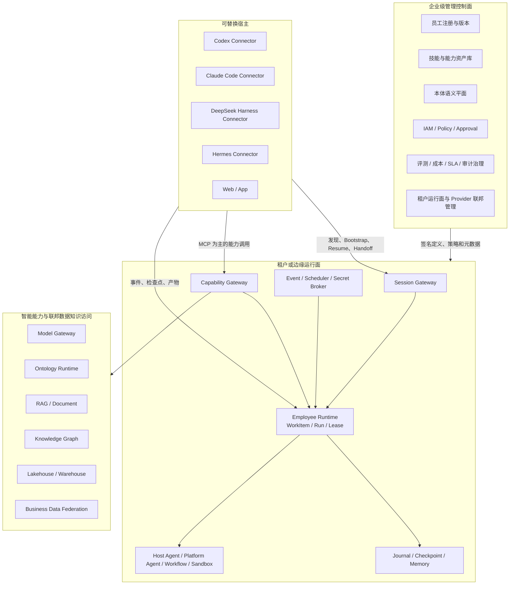

# 联邦式数字员工平台设计

> 日期：2026-08-31
>
> 状态：架构讨论已确认，待书面评审
> 范围：目标架构与业务 MVP 路线；不描述现有实现，不构成迁移或实施计划

## 1. 设计结论

数字员工属于平台，不属于 Codex、Claude Code、DeepSeek Harness、Hermes 或 Web。

平台保存数字员工的稳定身份、版本、权限、任务、状态、记忆和审计。宿主通过统一 Connector 获取经过裁剪的员工投影和短期执行租约，在授权范围内承担当前交互与推理。无人值守、事件触发、长流程和高风险动作由租户运行面负责。

本设计采用联邦式 Employee OS：

- 企业级管理控制面负责定义、发布和治理。
- 租户或边缘运行面靠近数据，负责状态、凭据和实际执行。
- 宿主可以替换，EmployeeInstance 与 WorkItem 跨宿主持续存在。
- MCP 是主要 AI 北向能力协议，不是唯一内部协议或万能服务总线。
- 业务 MVP 驱动平台增量建设，不单独建设一个长期无业务闭环的“大平台底座”。

## 2. 第一性原则

1. **平台拥有员工主权。** 宿主加载的是员工会话投影，不是员工本体。
2. **混合执行。** 平台拥有身份、权限、任务和状态；宿主在短期租约内承担当前推理，平台承担自主和可靠执行。
3. **常驻运行时。** 所有宿主关闭后，事件、定时器、审批和长流程仍可推进员工工作。
4. **员工种类不写死。** 内核固定元模型和运行契约；岗位由技能、能力、知识、模型和策略动态组合。
5. **双主体授权。** 每次运行同时记录员工执行主体与人、组织、流程或事件授权来源，权限取交集。
6. **统一能力治理，不统一所有协议。** 统一能力语义、目录、策略和审计；内部实现可使用 MCP、API、A2A、事件、SQL、图查询或工作流。
7. **员工不是微服务。** EmployeeInstance 是长期逻辑实体；EmployeeRun 按任务物化；Sandbox 按风险创建。
8. **控制面与数据面分离。** 控制面治理定义，租户运行面保存敏感数据、凭据、记忆和运行状态。
9. **单 Run 单写者。** 同一 EmployeeRun 同时只有一个有效写租约；并行通过子 Run 实现。
10. **状态、记忆、知识分层。** 跨端恢复依赖 Journal、Work State 和 Checkpoint；长期记忆负责经验复用；企业知识保持独立权威来源。
11. **员工零安装。** 每个宿主只安装一个 MetaPlatform Connector，数字员工由服务端动态发现和物化。
12. **宿主能力协商。** 保证员工身份、权限和业务状态一致，不要求内部 Agent 实现一致。
13. **本体是语义权威。** 本体定义业务概念、关系、动作、事件和约束，但不接管业务执行，也不成为所有调用的同步中转站。
14. **结构化结果、多格式表示。** 一份权威 Outcome 可渲染为 JSON、Markdown、HTML、PDF、DOCX、CSV/XLSX 等格式。

## 3. 目标与非目标

### 3.1 目标

- 同一数字员工可跨宿主继续同一 WorkItem。
- 员工可在无宿主在线时由事件或计划自动运行。
- 员工能力、数据和动作全部经过统一身份、策略与审计。
- 本体、知识、数仓和业务系统通过稳定语义被员工使用。
- 输出既能给人阅读，也能被工作流、其他员工和 Action 可靠消费。
- 每个实施阶段交付可使用、可度量的业务闭环。

### 3.2 非目标

- 不要求四个宿主使用相同模型、Prompt、子 Agent 或 UI。
- 不把 MCP 扩展成控制面数据库、任务总账、事件总线、工作流引擎或大数据传输协议。
- 不把所有企业数据复制到一个中央存储。
- 不让 EmployeeInstance 与常驻容器一一对应。
- 不允许同一员工自行批准所有高风险动作。
- 不允许未经审批的本体自我修改或自动发布。
- 不以单服务测试数量或“客户端能调用工具”作为业务完成标志。

## 4. 核心对象模型

```text
EmployeeDefinition
  └─ EmployeeVersion
       └─ EmployeeInstance
            └─ WorkItem
                 └─ EmployeeRun
                      ├─ EmployeeSession
                      ├─ ExecutionLease
                      ├─ AuthorizationContext
                      ├─ RunEvent
                      ├─ Checkpoint
                      ├─ Artifact
                      └─ MemoryCandidate → MemoryRecord
```

### 4.1 定义与实例

| 对象 | 职责 |
|---|---|
| `EmployeeDefinition` | 岗位模板的稳定身份、名称、职责、发布者和生命周期 |
| `EmployeeVersion` | 不可变版本；包含指令、技能、能力、知识、记忆、模型、权限和审批策略 |
| `EmployeeInstance` | 某租户真正拥有的长期员工；具有稳定 `employee_id`、状态和版本绑定 |

### 4.2 工作与执行

| 对象 | 职责 |
|---|---|
| `WorkItem` | 业务任务本身；包含目标、输入、期望结果、优先级、截止时间和授权来源 |
| `EmployeeRun` | 一次执行、重试或子任务；包含状态机、预算、权限上下文和结果 |
| `EmployeeSession` | 某宿主的一次连接；记录宿主、用户、设备和能力矩阵 |
| `ExecutionLease` | 某 Session 对 Run 的短期写权；包含 epoch、范围、续租、撤销和到期时间 |
| `AuthorizationContext` | 员工主体、授权来源、任务范围、数据策略和审批策略的交集 |

### 4.3 关键不变量

- `employee_id` 跨客户端稳定。
- `work_item_id` 表示业务任务，不因某次 Run 失败而消失。
- `run_id` 表示一次执行或子执行，不使用 `conversation_id` 替代。
- 一个 Run 可先后关联多个 Session，但同一时刻只有一个有效写租约。
- 运行中的 Run 固定 EmployeeVersion 和 OntologyVersion；发布新版本不原地改变既有 Run。
- 聊天记录不是长期记忆；Tool 名称不是 Capability 标识。

## 5. 总体架构



### 5.1 管理控制面

管理控制面负责：

- EmployeeDefinition、EmployeeVersion、模板和实例策略。
- Skill、CapabilityDefinition、Provider 元数据和 Marketplace 资产。
- 本体业务语义、版本和映射。
- IAM、Policy、Approval 模板和风险规则。
- 质量评测、成本、SLA、合规和审计目录。
- 租户运行面注册与已发布配置分发。

管理控制面主要走慢路径，不进入每次工具调用的热路径。

### 5.2 租户运行面

租户运行面负责：

- 宿主能力协商、SessionManifest、Lease、Resume 和 Handoff。
- EmployeeRun 的唯一权威任务总账。
- Run Journal、Checkpoint、Artifact 和 Memory。
- Capability 解析、逐次鉴权、审批、路由和审计。
- 平台 Agent、自主运行、可靠工作流、事件、定时器和 Sandbox。
- 敏感凭据、业务连接器和本地数据访问。

## 6. 宿主动态加载与交接

每个宿主只安装一个 MetaPlatform Connector。Connector 使用统一会话接口：

```text
list_employees
get_employee_profile
start_employee_session
resume_work_item
renew_lease
handoff_session
release_lease
list_capabilities
invoke_capability
submit_run_event
submit_checkpoint
propose_memory
```

服务端根据 EmployeeVersion、AuthorizationContext 和 HostCapabilities 编译签名 `SessionManifest`。Manifest 只包含本次任务所需的员工投影、能力、上下文、预算和短期租约，不包含长期凭据、完整内部策略或未授权资产。

`SessionManifest` 只是面向宿主的执行投影，不是授权判定的权威来源。每一次能力调用、状态提交和副作用提交，仍必须由服务端依据最新租约、策略、资源状态和授权来源重新判定；宿主不得仅凭本地缓存的 Manifest 放行操作。

宿主可能采用原生 Agent、子 Agent、Skill + MCP、交互控制台或平台代执行等不同物化方式。缺少必要安全能力时，平台改为服务端执行或拒绝，不静默放宽权限。

### 6.1 交接流程

1. 宿主 A 持有 Run 的当前 Lease。
2. Runtime 冻结写入并生成已确认 Checkpoint。
3. 宿主 A 释放 Lease，或 Lease 超时回收。
4. 宿主 B 绑定同一 `employee_id + work_item_id + run_id`。
5. Runtime 签发更高 epoch 的新 Lease。
6. 宿主 B 从 Checkpoint、Work State 和已授权 Memory 恢复。
7. 任何旧 epoch 的迟到写入都被拒绝。

## 7. 编排职责

平台只保留一个顶层员工任务总账，不建设包办所有事情的万能编排引擎。

| 组件 | 负责回答 |
|---|---|
| Employee Runtime | 这名员工的这项工作总体进行到哪里？ |
| Host 或 Platform Agent Loop | 当前这一步应该思考什么、调用什么？ |
| Durable Workflow | 审批、等待、重试和补偿如何可靠完成？ |
| Capability Gateway | 这一次能力调用能否放行、路由到哪里？ |
| Model Gateway | 这一次推理使用哪个模型和配额？ |
| Event Bus / Scheduler | 何时通知或唤醒一个 WorkItem？ |

Employee Runtime 拥有 `EmployeeRun` 生命周期；Workflow Engine 只拥有某个子流程的 `WorkflowExecution`；其他组件只保存自身技术状态。

## 8. 能力模型

数字员工绑定稳定的逻辑能力，不绑定具体 Tool 名称、URL、数据库或凭据。

```text
CapabilityDefinition
  └─ CapabilityProvider
       └─ TenantProviderBinding
```

`CapabilityDefinition` 定义：

- 输入输出 Schema 和业务语义。
- 版本与兼容策略。
- 读写和副作用等级。
- 幂等、补偿和审批要求。
- 数据分类、地域、SLA 和审计策略。

`CapabilityProvider` 可使用 MCP、REST/gRPC、Workflow、SQL、Graph 或 A2A。Resolver 在每次调用时根据租户、权限交集、数据位置、健康状态、成本、SLA 和审批策略选择 Provider，并签发短期调用凭证。

三种资产必须分开：

- Skill：完成工作的操作方法和策略。
- Capability：稳定、可治理的可执行接口。
- Knowledge：被查询和引用的事实数据。

## 9. 本体与数据知识平面

### 9.1 本体职责

本体是业务语义权威，定义业务对象、关系、动作、事件、约束和跨系统映射。Employee、Capability、DataProduct 和 KnowledgeAsset 引用稳定本体标识。

发布时将必要语义编译为运行描述符；网关使用已发布描述符和缓存执行校验。只有查询、变更或复杂语义解析时才实时调用 Ontology Runtime。

本体、知识图谱、数仓和 RAG 不可混同：

- 本体定义语义。
- 知识图谱保存符合语义的事实关系。
- 数仓保存可分析历史和聚合数据。
- RAG 从文档与知识资产中检索证据。

### 9.2 联邦数据知识访问

平台统一以下内容：

- KnowledgeAsset 和 DataProduct 目录。
- 本体语义与字段映射。
- 权限、数据分类、质量、时效和血缘。
- 查询与检索规划。
- Evidence Envelope 返回格式。

物理存储、内部查询协议和权威数据位置无需统一。读取通过 Knowledge/Data Capability；业务写入必须通过 Action Capability。

## 10. 状态、记忆和知识分层

| 层 | 内容 | 作用 |
|---|---|---|
| L1 Run Journal | 完整输入、调用、审批、输出、错误和成本事件 | 回放和审计事实 |
| L2 Work State / Checkpoint | 当前步骤、变量、待办、产物引用和恢复位置 | 跨宿主恢复 |
| L3 Episodic Memory | 做过什么、结果如何、发生在什么上下文 | 复用情景经验 |
| L4 Semantic / Procedural Memory | 稳定偏好、已验证经验和标准做法 | 长期学习 |
| L5 Enterprise Knowledge | 本体、文档、图谱、数仓和业务数据 | 组织权威事实 |

客户端提交 RunEvent、Checkpoint、Artifact 和 MemoryCandidate。Memory Engine 经过脱敏、分类、去重、可信度、授权、来源和有效期检查后，才将候选晋升为 MemoryRecord。

每条 Memory 带 user、employee、work item、team 或 tenant 作用域；窄作用域记忆不能自动升级为组织级事实。

## 11. 标准输出与多格式表示

所有员工返回版本化 `OutcomeEnvelope`：

```text
identity
execution_context
status
ontology_context
structured_payload
evidence
quality
findings
recommendations
action_proposals
artifacts
policy_decision
approval_records
execution_receipts
next_steps
representations
```

### 11.1 领域 Payload

- `ContractReviewReport:v1`
- `OrderInsightReport:v1`
- `OntologyChangeProposal:v1`
- `KnowledgeSliceAssessment:v1`
- `SemanticExtractionResult:v1`
- `ActionProposal:v1`

`ActionProposal` 至少包含 `action_type`、`target`、`arguments`、`preconditions`、`expected_effects`、`side_effect_level`、`risk_level`、`required_approvals`、`idempotency_key` 和 `compensation_plan`。

### 11.2 多格式表示

JSON 是权威机器数据；Markdown、HTML、PDF、DOCX、CSV/XLSX 等是同一 Outcome 的可验证表示。每个 Representation 记录：

- `media_type`
- `content_ref`
- `sha256`
- `renderer` 和版本
- `source_outcome_version`
- `locale`、`charset` 和 `generated_at`
- `disposition`
- `security_profile`

HTML 默认清洗，禁止脚本与内联事件，并应用严格 CSP。大文件通过 Artifact 引用，不内嵌进 Envelope。修改或重新渲染表示不能改变权威业务状态。

### 11.3 输出生命周期

```text
DRAFT → VALIDATED → PROPOSED → APPROVED → COMMITTED
```

`REJECTED`、`EXPIRED` 和 `SUPERSEDED` 为独立终态。已提交结果不可原地篡改，只能生成新版本或补偿记录。

该生命周期属于 `OutcomeEnvelope`，与 `EmployeeRun` 的运行状态相互关联但不等同。例如，Run 可以完成分析并进入结束态，而其 Outcome 仍处于 `PROPOSED` 等待审批；Outcome 被拒绝或过期时，也不得删除对应 Run、证据链和审计记录。

## 12. 授权、风险和客户端信任边界

客户端是不可信执行环境。Prompt、Skill 和本地代码不能承担最终权限控制。所有受治理能力调用必须由服务端重新鉴权。

有效权限为：

```text
员工权限
∩ 授权来源权限
∩ 当前任务范围
∩ 数据策略
∩ 风险与审批策略
```

风险等级：

| 等级 | 行为 |
|---|---|
| R0 | 查询、分析和报告自动执行 |
| R1 | 低风险、可逆且已预授权动作自动执行并审计 |
| R2 | 改变普通业务状态的动作由用户或业务负责人确认 |
| R3 | 高金额、不可逆或合规敏感动作由独立审批人或双人审批 |
| R4 | 策略禁止，任何主体都不能绕过 |

正式员工任务需要在线 Lease。离线客户端只能产生待重新校验的候选产物，不能调用受治理能力或直接提交权威业务结果。

## 13. 接口分层

| 通道 | 协议倾向 | 职责 |
|---|---|---|
| Control API | HTTPS/OpenAPI | 员工、版本、能力、Provider、策略和治理管理 |
| Session API | HTTPS | Discover、Bootstrap、Resume、Renew、Handoff、Release |
| Capability Channel | MCP 为主 | 模型可见的能力搜索、描述、资源访问与调用 |
| Run State API | HTTPS/Stream | Event、Checkpoint、Artifact 和 MemoryCandidate 回写 |
| Event Channel | Event Bus/Webhook | 业务事件、定时唤醒、审批结果和异步通知 |

支持动态工具刷新时，Connector 按 SessionPlan 暴露具体能力；不支持时提供稳定元工具：

```text
search_capabilities
describe_capability
invoke_capability
```

## 14. 故障与一致性

- RunEvent 使用至少一次传输和幂等消费。
- event ID、sequence 和 idempotency key 防止重复推进状态。
- Lease epoch 作为 fencing token，阻断旧客户端迟到写入。
- 宿主崩溃后只相信最后已确认 Checkpoint，不猜测未回写步骤已完成。
- 控制面暂时不可达时，租户运行面仅在已签名配置有效期内继续；不允许新版本或权限提升。

能力按副作用分级：

| 类型 | 重试规则 |
|---|---|
| READ | 通常可自动重试，可选择等价 Provider |
| IDEMPOTENT_WRITE | 必须使用 idempotency key，重复请求返回同一执行记录 |
| REVERSIBLE_WRITE | 必须保存前后快照和补偿动作 |
| IRREVERSIBLE | 使用 prepare → approval → commit，禁止盲目自动重试 |

## 15. 六个业务场景

### 15.1 直接业务价值链

1. **合同审查数字员工**：合同输入 → 条款识别 → 制度与案例证据 → 风险和修改建议 → 审批 → 报告与后续动作。
2. **订单洞察与行动数字员工**：查询订单 → 本体关联数据 → 应用约束 → 证据报告 → 行动提案 → 风险策略与授权 → 执行。

### 15.2 Ontology Factory

3. **本体构建数字员工团队**：语义分析 → 调度领域员工 → 构建对象、关系、动作和约束 → 冲突检测 → 评审 → 发布。
4. **本体运维数字员工**：持续复盘 RAG 切片和业务变化 → 漂移检测 → 变更提案 → 回归评测 → 审批发布或回滚。
5. **对话语义识别**：从用户对话识别概念、实体、关系、约束和动作候选。
6. **材料语义抽取**：从文档、表格和材料提取带来源跨度的本体候选。

场景 5 和 6 是场景 1–4 共享的语义输入能力，不单独复制 Employee Runtime。

## 16. 业务 MVP 实施路线

不设置独立“先完成统一平台底座”的阶段。每个 MVP 都交付业务入口、真实数据或知识、标准输出、风险审批、证据审计和可度量结果。

### 16.1 Business MVP 1：合同审查闭环

**用户结果**：上传真实合同，获得带证据的风险报告、修改建议、审批提案，以及 HTML、Markdown 和 JSON 输出。

**业务能力**：材料解析、条款定位、人工发布的最小合同本体、RAG 证据、约束校验、风险分级和审批。

**平台增量**：核心对象、租约、Journal/Checkpoint、最小 Capability Gateway、OutcomeEnvelope 和两个宿主的跨端验收。

**阶段出口**：

- 真实合同完成端到端审查。
- 每条结论可追溯到合同位置和制度证据。
- 高风险提案不能绕过审批。
- 第二宿主可从已确认 Checkpoint 继续。

**明确不做**：自动构建本体、复杂数据联邦、Marketplace、全套长期记忆。

### 16.2 Business MVP 2：订单洞察到行动

**用户结果**：自然语言查询订单和关联数据，生成约束明确的报告和行动方案，获批后执行一个真实可逆动作。

**业务能力**：订单本体、数据映射、联邦查询、指标与约束、Evidence Report、ActionProposal、风险分级和审批。

**平台增量**：CapabilityDefinition/Provider、Data & Knowledge Access、幂等与补偿、Workflow/HITL、Event/Scheduler。

**阶段出口**：

- 从查询到执行形成闭环。
- 数据快照、指标口径和本体路径可追溯。
- 重复请求只产生一次业务效果。
- 等待审批时所有客户端可以关闭。

**明确不做**：任意数据库写入、员工自批高风险动作、自动修改生产本体。

### 16.3 Ontology MVP 1：本体构建与发布

**用户结果**：通过对话和上传材料生成可评审的本体变更方案，并安全发布或回滚版本。

**业务能力**：语义抽取、候选合并、多员工分工、对象/关系/动作/约束建模、冲突检测、diff、评审和发布。

**平台增量**：Ontology Control Plane、SemanticExtractionResult、OntologyChangeProposal、团队子 Run、版本固定和发布回滚。

**阶段出口**：

- 从真实材料生成带证据的变更集。
- 验证和回归通过后经审批发布。
- 已运行员工继续使用原本体版本。

**明确不做**：无审批自动发布、从任意文本直接生成生产本体、持续运维闭环。

### 16.4 Ontology MVP 2：本体持续运维

**用户结果**：持续发现知识、数据和业务变化产生的语义漂移，形成可控本体演进建议。

**业务能力**：RAG 切片复盘、数据 Schema 变化、漂移检测、去重、影响分析、回归评测、发布和回滚。

**平台增量**：持续事件触发、KnowledgeSliceAssessment、质量评测、血缘、记忆晋升、变更订阅和灾备演练。

**阶段出口**：

- 对真实变化生成可解释提案。
- 业务员工回归通过后发布。
- 失败可回滚且不破坏既有 Run。

**明确不做**：无人监督自我进化、把所有知识切片直接转换为本体事实。

### 16.5 每个 MVP 的四个切片

```text
定义业务结果与金标案例
→ 最窄真实端到端链路
→ 审批、动作与异常闭环
→ 跨宿主、故障与安全验收
```

跨宿主是每个业务 MVP 的架构验收，不是单独产品阶段。

## 17. 验收模型

架构第一性验收是：任意时刻都能证明“这是同一名员工在处理同一个 WorkItem”，且不存在越权、状态分叉、重复副作用或证据丢失。

必须通过：

- 跨宿主连续：宿主 A 开始，宿主 B 从同一 WorkItem 的 Checkpoint 继续。
- 无人值守：所有客户端关闭后，业务事件仍可创建或恢复 Run。
- 旧写者阻断：新 Lease 生效后，旧 epoch 写入被拒绝。
- 重复副作用：重复请求和事件只产生一次业务效果。
- 权限不降级：宿主缺少审批或 Sandbox 时，平台代执行或拒绝。
- 记忆隔离：跨用户、员工和租户访问失败且不泄露存在性。
- Provider 可替换：员工定义不变，Capability 和 Evidence 契约保持兼容。
- 控制面断连：已签名版本在有效期内继续，权限提升不可用。
- 版本升级与回滚：运行中的 Run 保持原版本。
- 证据完整：可回放谁授权、谁执行、使用何种数据与能力以及结果。

## 18. 后续设计分解

本总体架构之后，每个业务 MVP 单独形成产品与实施规格。下一份规格应聚焦“合同审查闭环”，包括：

- 目标用户与业务边界。
- 合同类型和输入质量约束。
- 最小合同本体和知识范围。
- 金标案例、业务指标和风险阈值。
- ContractReviewReport 与 ActionProposal Schema。
- 首批宿主 Connector 和交互入口。
- 审批动作、失败场景和上线验收。

精确 SLO、宿主接入顺序、模型与存储产品选择属于各 MVP 的后续规格，不改变本文件的架构边界。
