# MetaPlatform 产品功能模块设计

> 日期：2026-09-01
>
> 状态：产品边界已通过讨论确认；待书面评审
>
> 上位架构：`docs/superpowers/specs/2026-08-31-federated-digital-employee-platform-design.md`
>
> 范围：全平台产品能力地图、模块边界、功能脑图、生命周期化 CRUD、角色权限、跨模块装配、失败处理和产品验收
>
> 不包含：现状菜单复刻、页面视觉稿、数据库表设计、API 字段设计、组件部署步骤和实施排期

## 1. 产品定位

MetaPlatform 是基于 Ontology 本体、数字员工和可治理业务行动的企业级决策与运营提效平台。平台统一管理身份、能力、语义、任务、记忆、产物和治理状态。Codex、Claude Code、DeepSeek Harness、Hermes 等宿主承担对话、意图理解、原生 Agent Loop 和 SubAgent 交互展示；MetaPlatform 不重复建设通用聊天客户端。

平台产品采用“**领域能力中心 + 动态角色工作台**”结构：底层只有一套权威领域对象，上层根据用户、租户、角色、关系和数据范围动态生成菜单、工作台和操作权限。产品模块不按 RAGFlow、Temporal、Jena、NATS 等技术组件划分；技术组件只是领域能力的实现。

### 1.1 产品目标

- 让宿主安全获取“我是谁”、可用数字员工、技能、服务和任务上下文。
- 让数字员工、本体、技能、MCP 服务、Action、工作流、数据知识、记忆和应用成为可治理产品资产。
- 让应用按固定版本装配平台资产，支持租户安装、升级、回滚和卸载。
- 让每个模块都具有完整、可解释的生命周期化 CRUD，而不是只有演示页面。
- 让任何业务结果都能追溯到用户、员工、Run、数据、知识、本体、模型、授权、审批和执行回执。

### 1.2 明确不做

- 不在 MetaPortal 内复制 Codex、Claude Code、DSH 或 Hermes 的通用对话体验。
- 不把 MCP 当作数据库协议、消息总线、任务总账或大数据传输协议。
- 不允许模板、应用或插件成为员工、本体、权限、Run 或 Artifact 的权威存储。
- 不允许已发布对象通过普通“编辑”原地修改，也不允许被引用对象直接物理删除。
- 不在首期开放未经签名、SBOM、权限清单和隔离验证的任意可执行插件。

## 2. 产品功能总脑图

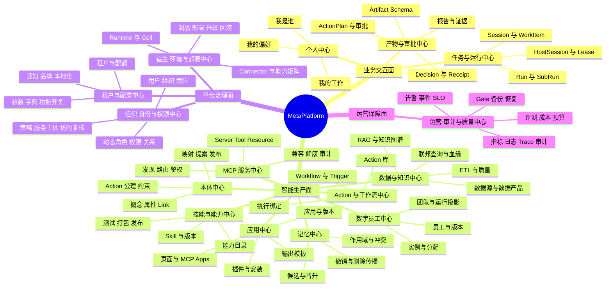
```mermaid
mindmap
  root((MetaPlatform))
    业务交互面
      个人中心
        我是谁
        我的偏好
        我的工作
      任务与运行中心
        Session 与 WorkItem
        Run 与 SubRun
        HostSession 与 Lease
      产物与审批中心
        Artifact Schema
        报告与证据
        ActionPlan 与审批
        Decision 与 Receipt
    智能生产面
      应用中心
        应用与版本
        输出模板
        页面与 MCP Apps
        插件与安装
      数字员工中心
        员工与版本
        实例与分配
        团队与运行投影
      本体中心
        概念 属性 Link
        Action 公理 约束
        映射 提案 发布
      技能与能力中心
        能力目录
        Skill 与版本
        测试 打包 发布
      MCP 服务中心
        Server Tool Resource
        发现 路由 鉴权
        兼容 健康 审计
      Action 与工作流中心
        Action 库
        执行绑定
        Workflow 与 Trigger
      数据与知识中心
        数据源与数据产品
        ETL 与质量
        RAG 与知识图谱
        联邦查询与血缘
      记忆中心
        候选与晋升
        作用域与冲突
        撤销与删除传播
    平台治理面
      组织 身份与权限中心
        用户 组织 岗位
        动态角色 权限 关系
        策略 服务主体 访问复核
      租户与配置中心
        租户与配额
        参数 字典 功能开关
        通知 品牌 本地化
      宿主 环境与部署中心
        Connector 与能力矩阵
        Runtime 与 Cell
        制品 部署 升级 回滚
    运营保障面
      运营 审计与质量中心
        指标 日志 Trace 审计
        告警 事件 SLO
        评测 成本 预算
        Gate 备份 恢复
```

## 3. 产品面与一级模块

| 产品面 | 一级模块 | 核心权威对象 | 主要使用者 |
|---|---|---|---|
| 业务交互面 | 1. 个人中心 | UserProfile、UserPreferenceSet、UserConsent、UserContextProjection | 所有用户 |
| 业务交互面 | 2. 任务与运行中心 | BusinessSession、WorkItem、EmployeeRun、SubRun、ExecutionLease | 业务用户、任务负责人、运行管理员 |
| 业务交互面 | 3. 产物与审批中心 | ArtifactSchema、Artifact、Evidence、ActionPlan、Approval、Decision、Receipt | 业务用户、审批人、审计员 |
| 智能生产面 | 4. 应用中心 | Application、Template、OutputProfile、Extension、Plugin、ApplicationInstance | 应用管理员、开发者、租户管理员 |
| 智能生产面 | 5. 数字员工中心 | EmployeeDefinition、Version、Package、Instance、Assignment、Team | 数字员工管理员、业务负责人 |
| 智能生产面 | 6. 本体中心 | Ontology、Concept、Property、Link、SemanticAction、Axiom、Constraint、Mapping、Release | 本体管理员、领域专家 |
| 智能生产面 | 7. 技能与能力中心 | Capability、SkillDefinition、SkillVersion、SkillPackage、SkillRelease | 技能管理员、数字员工管理员 |
| 智能生产面 | 8. MCP 服务中心 | MCPServer、Tool、Resource、Prompt、Route、CredentialBinding | 服务管理员、安全管理员 |
| 智能生产面 | 9. Action 与工作流中心 | ActionDefinition、ActionBinding、WorkflowDefinition、Trigger、Execution | Action 管理员、流程管理员、审批人 |
| 智能生产面 | 10. 数据与知识中心 | DataSource、DataProduct、Pipeline、KnowledgeBase、Document、Index、GraphProjection | 数据管理员、知识管理员、领域专家 |
| 智能生产面 | 11. 记忆中心 | MemoryPolicy、MemoryCandidate、MemoryItem、Conflict、DeletionRequest | 用户、记忆管理员、审计员 |
| 平台治理面 | 12. 组织、身份与权限中心 | HumanUser、Organization、Position、DynamicRole、Permission、Relation、Policy、ServicePrincipal | 平台管理员、租户管理员、安全审计员 |
| 平台治理面 | 13. 租户与配置中心 | Tenant、ConfigSchema、ConfigValue、Quota、FeatureFlag、Dictionary、Notification、Theme | 平台管理员、租户管理员 |
| 平台治理面 | 14. 宿主、环境与部署中心 | HostCapabilityContract、Connector、RuntimeEnvironment、Cell、DeploymentBundle、Deployment | 平台运维、租户运维、宿主管理员 |
| 运营保障面 | 15. 运营、审计与质量中心 | Metric、AuditEvent、Alert、Incident、Evaluation、Budget、GateEvidence、Backup、RestoreDrill | 运维、安全审计、质量负责人 |

## 4. 用户、动态角色与产品工作台

### 4.1 三层角色模型

| 层级 | 内置角色模板 | 典型范围 |
|---|---|---|
| 平台级 | 平台管理员、平台运维、安全审计员 | 全平台治理元数据、基础设施和审计；默认不读取租户业务正文 |
| 租户级 | 租户管理员、数字员工管理员、本体管理员、应用管理员、服务管理员、数据知识管理员 | 单租户内对应领域对象和发布流程 |
| 业务级 | 普通用户、任务负责人、审批人、领域专家、数据责任人 | 被分配的业务数据、任务、审批和专业评审 |

平台支持租户动态创建角色。`DynamicRole` 支持新增、复制、查询、修改草稿、配置权限和数据范围、设置继承、职责冲突校验、发布、停用和归档。角色不是宿主 Prompt；最终授权由关系、策略、资源状态和当前权限水位共同决定。

### 4.2 动态工作台

菜单和操作根据 `UserContextProjection + DynamicRole + Relation + PolicyDecision + TenantFeature` 动态生成。隐藏菜单不能替代服务端授权；所有查询和动作必须在服务端重新判定。

| 用户 | 默认工作台内容 |
|---|---|
| 普通用户 | 我是谁、偏好、我的员工、任务、待办、审批、产物、跨宿主继续 |
| 数字员工管理员 | 员工目录、版本、实例、分配、团队、技能和服务依赖、发布 |
| 本体管理员/领域专家 | 本体域、候选、差异、约束校验、影响分析、评审和发布 |
| 应用管理员 | 应用、模板、扩展、插件、依赖、安装、升级、市场和准入 |
| 平台/租户管理员 | 组织、动态角色、策略、租户配置、环境、部署和运营 |
| 审计员 | 只读审计、证据、授权决策、发布、执行、恢复和 Gate 状态 |

## 5. 统一对象、操作与生命周期

### 5.1 治理对象结构

```text
Definition
  → Version
    → Package
      → Release
        → Tenant Instance
```

`Definition` 是稳定身份；`Version` 是不可变语义版本；`Package` 是签名制品；`Release` 是经审批的发布记录；`Tenant Instance` 是租户实际启用的配置和运行实例。不是所有对象都需要完整五层，但不得把定义、版本和运行状态混为一个可任意修改的记录。

### 5.2 CRUD 图例

| 标记 | 产品语义 |
|---|---|
| C | 新增草稿、复制、导入或从模板创建 |
| R | 列表、详情、搜索、筛选、关系、依赖、历史和审计查询 |
| U | 修改草稿；已发布对象必须创建新版本 |
| D | 未引用草稿物理删除；其他对象使用停用、撤销、归档、卸载或合规删除 |
| V | 校验、测试、预览、差异和影响分析 |
| A | 提交评审、批准、拒绝和职责分离 |
| P | 打包、签名、发布、灰度、升级和回滚 |
| X | 运行、执行、触发、重试、补偿和取消 |
| G | 权限、策略、数据范围、保留期和审计治理 |

### 5.3 治理资产生命周期

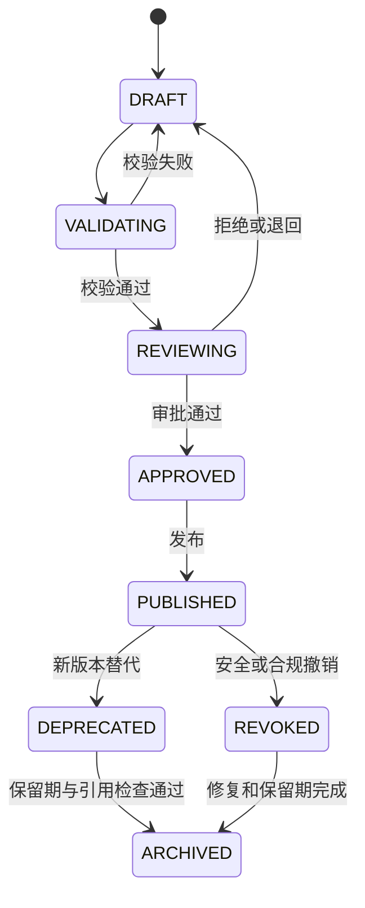
```mermaid
stateDiagram-v2
  [*] --> DRAFT
  DRAFT --> VALIDATING
  VALIDATING --> DRAFT: 校验失败
  VALIDATING --> REVIEWING: 校验通过
  REVIEWING --> DRAFT: 拒绝或退回
  REVIEWING --> APPROVED: 审批通过
  APPROVED --> PUBLISHED: 发布
  PUBLISHED --> DEPRECATED: 新版本替代
  PUBLISHED --> REVOKED: 安全或合规撤销
  DEPRECATED --> ARCHIVED: 保留期与引用检查通过
  REVOKED --> ARCHIVED: 修复和保留期完成
```

### 5.4 运行对象生命周期

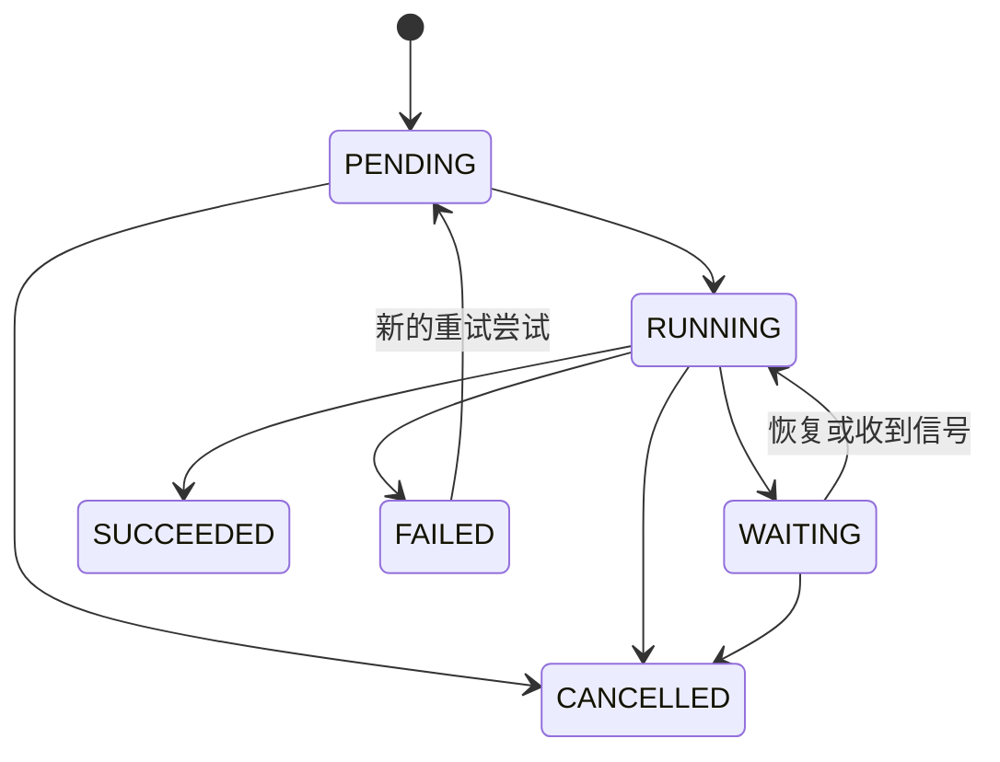
```mermaid
stateDiagram-v2
  [*] --> PENDING
  PENDING --> RUNNING
  RUNNING --> WAITING
  WAITING --> RUNNING: 恢复或收到信号
  RUNNING --> SUCCEEDED
  RUNNING --> FAILED
  PENDING --> CANCELLED
  RUNNING --> CANCELLED
  WAITING --> CANCELLED
  FAILED --> PENDING: 新的重试尝试
```

### 5.5 所有模块的公共功能

- 列表、详情、搜索、筛选、排序、分页、标签、分类、目录和收藏。
- 批量操作、导入、导出、复制、版本、差异、依赖和影响分析。
- 校验、测试、预览、提交评审、批准、拒绝、发布、灰度、回滚和撤销。
- 动态角色、关系、数据范围、职责分离、租户隔离和敏感字段控制。
- 操作日志、版本记录、授权决策、发布证据、事件和 Webhook。
- 已发布对象不可原地修改；被引用对象不可物理删除；所有例外必须留下审计证据。

---

## 6. 模块详细设计

### 6.1 个人中心

**产品职责：** 向用户和经授权的宿主提供“我是谁、我偏好什么、我正在做什么”的最小上下文。基础身份和权限事实来自身份权限中心；个人中心拥有用户声明偏好、同意记录和个人工作视图，不拥有组织和授权权威。

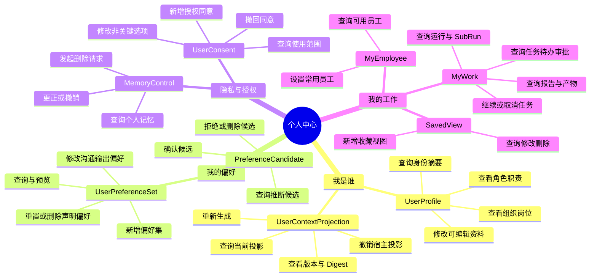
```mermaid
mindmap
  root((个人中心))
    我是谁
      UserProfile
        查询身份摘要
        修改可编辑资料
        查看组织岗位
        查看角色职责
      UserContextProjection
        查询当前投影
        重新生成
        撤销宿主投影
        查看版本与 Digest
    我的偏好
      UserPreferenceSet
        新增偏好集
        查询与预览
        修改沟通输出偏好
        重置或删除声明偏好
      PreferenceCandidate
        查询推断候选
        确认候选
        拒绝或删除候选
    隐私与授权
      UserConsent
        新增授权同意
        查询使用范围
        修改非关键选项
        撤回同意
      MemoryControl
        查询个人记忆
        更正或撤销
        发起删除请求
    我的工作
      MyEmployee
        查询可用员工
        设置常用员工
      MyWork
        查询任务待办审批
        查询运行与 SubRun
        查询报告与产物
        继续或取消任务
      SavedView
        新增收藏视图
        查询修改删除
```

| 管理对象/功能 | C | R | U | D/退役 | 关键业务操作与规则 |
|---|---|---|---|---|---|
| UserProfile | 由 IAM/HR 供应 | 本人查询最小身份摘要 | 仅可编辑显示名、头像、联系方式等开放字段 | 账号删除由身份中心处理 | 组织、岗位、角色和权限不可在个人中心修改 |
| UserPreferenceSet | 创建偏好集或从默认模板复制 | 查询有效值、来源和覆盖顺序 | 修改语言、详略、语气、格式、时区和可访问性 | 重置单项、删除用户声明值 | 企业策略优先；偏好不能降低审批和安全要求 |
| PreferenceCandidate | 系统生成候选 | 查询来源、置信度和影响 | 确认后写入声明偏好 | 拒绝、删除、禁止继续推断 | 未经确认不得生效；不保存私有思维链 |
| UserConsentRecord | 用户授予用途、范围和期限 | 查询谁在何时使用哪些个人上下文 | 缩小范围或调整非关键选项 | 撤回同意 | 撤回传播到投影、记忆候选和后续处理，不篡改既有审计 |
| UserContextProjection | Bootstrap 按需生成 | 本人和目标宿主查询最小投影 | 身份、偏好或权限变化后再生成新版本 | 撤销特定宿主、会话或全部投影 | 带 TTL、audience、版本和 Digest；不包含完整敏感档案 |
| UserEmployeeRelationship | 管理员分配或用户申请 | 查询可用员工、职责和有效期 | 设置常用项；分配变更走员工中心 | 取消收藏或撤销分配 | 可见不等于可执行；每次调用仍做授权判定 |
| MyWorkView | 由任务、审批和产物投影生成 | 查询待办、任务、运行、异常和产物 | 修改个人排序、筛选和已读状态 | 清除个人视图缓存 | 不复制 Run、Approval 或 Artifact 权威数据 |
| SavedView/Favorite | 新增收藏、筛选器和快捷入口 | 查询个人收藏 | 重命名、排序、修改筛选 | 删除 | 只保存引用和展示设置，不提升资源权限 |

### 6.2 任务与运行中心

**产品职责：** 管理跨宿主连续的业务会话、工作项、员工运行、子运行、宿主会话和执行租约，是任务状态和委托链的唯一产品入口；宿主聊天记录不是运行权威。

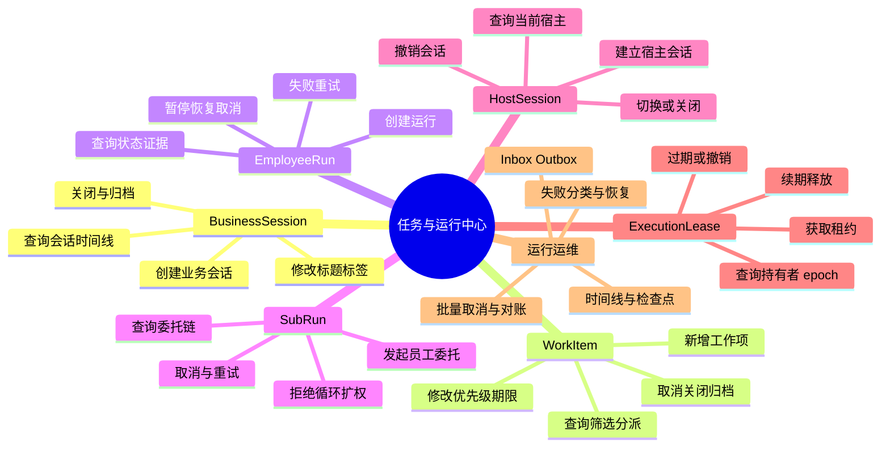
```mermaid
mindmap
  root((任务与运行中心))
    BusinessSession
      创建业务会话
      查询会话时间线
      修改标题标签
      关闭与归档
    WorkItem
      新增工作项
      查询筛选分派
      修改优先级期限
      取消关闭归档
    EmployeeRun
      创建运行
      查询状态证据
      暂停恢复取消
      失败重试
    SubRun
      发起员工委托
      查询委托链
      取消与重试
      拒绝循环扩权
    HostSession
      建立宿主会话
      查询当前宿主
      切换或关闭
      撤销会话
    ExecutionLease
      获取租约
      查询持有者 epoch
      续期释放
      过期或撤销
    运行运维
      时间线与检查点
      Inbox Outbox
      失败分类与恢复
      批量取消与对账
```

| 管理对象/功能 | C | R | U | D/退役 | 关键业务操作与规则 |
|---|---|---|---|---|---|
| BusinessSession | 用户或宿主创建业务会话 | 查询参与者、WorkItem、产物和时间线 | 修改标题、标签和可见成员 | 关闭后归档；不可删除被审计会话 | 跨宿主共享业务状态，不同步宿主私有思维链 |
| WorkItem | 新增、从模板创建或从事件生成 | 查询负责人、状态、优先级、期限和依赖 | 修改草稿字段、分派、优先级和期限 | 取消、关闭、归档 | 状态、授权和运行前置条件必须一致 |
| EmployeeRun | 在固定员工版本、用户和 WorkItem 下创建 | 查询状态、输入、输出、成本、证据和错误 | 仅允许状态命令，不直接编辑运行事实 | 取消或按保留期封存；不可物理删除 | 使用 Run Ledger CAS；运行固定员工、本体、策略和数据水位 |
| SubRun | 通过 A2A 或受控内部委托创建 | 查询父 Run、完整委托链、预算和截止时间 | 调整尚未开始的期限或取消 | 取消、失败终止；不可删除 | 权限只能衰减；拒绝循环、超深度、超预算和超期限 |
| HostSession | Connector Bootstrap 创建 | 查询宿主、版本、能力、最近心跳 | 刷新受限投影和会话元数据 | 主动关闭、超时或管理员撤销 | 不成为 BusinessSession 权威；宿主切换不改变 Run 身份 |
| ExecutionLease | 对可执行 Run 原子获取 | 查询 lease holder、epoch、TTL 和历史 | 续期；epoch 只能单调增加 | 释放、过期、撤销 | 所有副作用校验当前 Lease；迟到调用必须被 fencing 拒绝 |
| RunCheckpoint | 长任务按策略生成 | 查询恢复点和固定对象 Digest | 追加新检查点，不修改旧检查点 | 按保留策略清理未引用检查点 | 不保存 bearer token；只保存可恢复的非敏感状态引用 |
| RuntimeCommand | 创建 pause、resume、cancel、retry 等命令 | 查询命令状态、幂等键和执行者 | 不能修改已提交命令 | 未执行草稿可撤销 | 命令与 Run CAS 在同一事务登记；重复幂等键返回既有结果 |
| Inbox/Outbox/DLQ View | 由系统写入 | 查询事件、因果链、重试和毒消息 | 标记分析结果或重放计划 | 按策略归档 | 重放仍需校验 Run、Lease、授权和幂等，不能直接改业务状态 |

### 6.3 产物与审批中心

**产品职责：** 管理权威结构化产物、证据、建议、行动计划、人工决定、审批和执行回执。输出模板由应用中心管理。产物与审批中心拥有 Artifact Schema 和渲染结果引用。

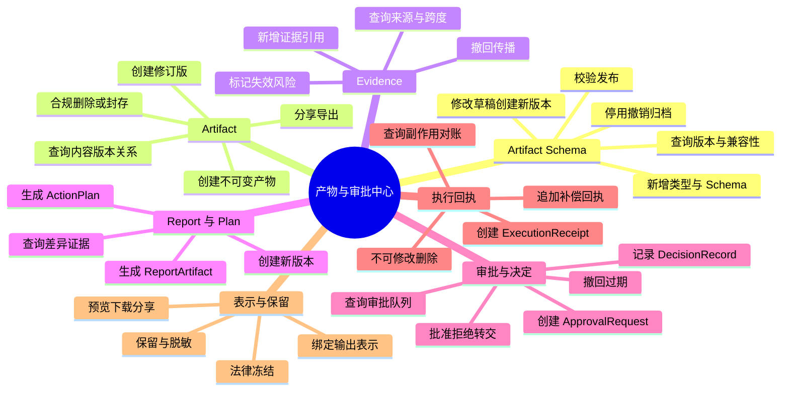
```mermaid
mindmap
  root((产物与审批中心))
    Artifact Schema
      新增类型与 Schema
      查询版本与兼容性
      修改草稿创建新版本
      停用撤销归档
      校验发布
    Artifact
      创建不可变产物
      查询内容版本关系
      创建修订版
      合规删除或封存
      分享导出
    Evidence
      新增证据引用
      查询来源与跨度
      标记失效风险
      撤回传播
    Report 与 Plan
      生成 ReportArtifact
      生成 ActionPlan
      查询差异证据
      创建新版本
    审批与决定
      创建 ApprovalRequest
      查询审批队列
      批准拒绝转交
      撤回过期
      记录 DecisionRecord
    执行回执
      创建 ExecutionReceipt
      查询副作用对账
      追加补偿回执
      不可修改删除
    表示与保留
      绑定输出表示
      预览下载分享
      法律冻结
      保留与脱敏
```

| 管理对象/功能 | C | R | U | D/退役 | 关键业务操作与规则 |
|---|---|---|---|---|---|
| ArtifactType/Schema | 新增类型、复制或导入 JSON Schema | 查询版本、引用、兼容性和示例 | 草稿可改；发布后创建新版本 | 停用、撤销、归档 | Schema 发布需兼容性和安全校验；模板不能改变权威字段语义 |
| ArtifactEnvelope | Run 或受权服务创建 | 按权限查询结构化内容、版本和关系 | 不原地修改；更正产生新 Digest | 法律冻结、按策略封存或合规删除 | 使用规范化 JSON Digest；记录员工、Run、本体、数据和证据上下文 |
| EvidenceBundle | 从数据、知识、本体、模型和授权证据创建 | 查询来源、快照、跨度、版本和完整性 | 只能追加风险标记或创建新版本 | 来源撤回时传播风险，历史审计保留 | 证据缺失或 Digest 不匹配时阻断正式结论和动作 |
| ReportArtifact | 根据 Schema 和 Evidence 创建 | 查询报告、证据、质量和表示 | 修订产生新版本 | 归档、法律冻结 | 只描述事实、分析和建议，不能直接触发业务副作用 |
| ActionPlan | 从报告或用户要求创建 | 查询动作、参数、前置条件、风险和证据 | 参数或证据变化必须新建版本 | 撤回、过期、归档 | 与 ApprovalRecord 通过 Digest 绑定；不能在审批后偷偷改参数 |
| ApprovalRequest | 为固定 ActionPlan 创建 | 查询审批人、策略、期限和状态 | 未开始前可调整通知；审批链变化需新请求 | 撤回或过期 | 支持单人、多人、会签、或签和职责分离 |
| ApprovalRecord/Usage | 审批人生成不可变批准事实 | 查询范围、有效期、允许次数和消费记录 | 原记录不可修改；消费状态事务递增 | 不可删除；可撤销未消费授权 | 执行前复核权限、Lease、业务条件和幂等；一次性审批只能成功消费一次 |
| DecisionRecord | 为无副作用的人工结论创建 | 查询决定、评论、证据和责任人 | 更正需新决定并引用旧记录 | 不可删除；可标记被替代 | 不得冒充 ApprovalRecord 或 ExecutionReceipt |
| ExecutionReceipt | 每次已发生副作用创建 | 查询结果、外部 ID、对账、失败和补偿 | 不修改；补偿产生新回执 | 不可删除；按策略封存 | 只证明已发生的效果；与审批消费和幂等台账一致 |
| ArtifactRepresentation | 渲染服务按 OutputProfile 生成 | 预览、下载、分享和校验格式 | 模板或主题变化生成新表示 | 撤销链接、过期缓存或删除派生文件 | JSON Artifact 始终是权威；Markdown/HTML/PDF/DOCX 内容必须可追溯 |
| Retention/LegalHold | 管理员或合规流程创建 | 查询保留、冻结和删除传播状态 | 调整未来策略，不能回写历史事实 | 解除冻结需授权和审计 | 删除对象时同步处理索引、缓存、对象存储和记忆引用 |

### 6.4 应用中心

**产品职责：** 将数字员工、本体、技能、MCP 服务、Action、Workflow、数据知识、角色模板、页面和输出模板装配成可发布、可安装的应用。应用只固定依赖和用户体验，不复制各领域权威对象。

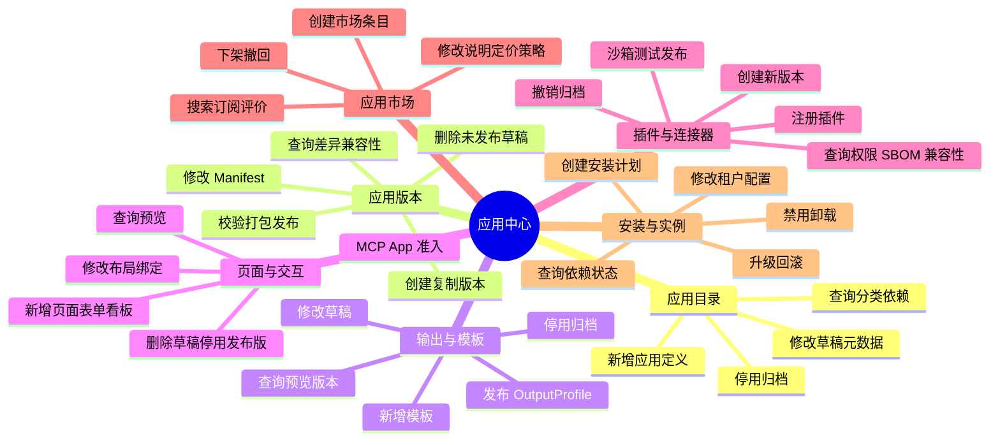
```mermaid
mindmap
  root((应用中心))
    应用目录
      新增应用定义
      查询分类依赖
      修改草稿元数据
      停用归档
    应用版本
      创建复制版本
      查询差异兼容性
      修改 Manifest
      删除未发布草稿
      校验打包发布
    输出与模板
      新增模板
      查询预览版本
      修改草稿
      停用归档
      发布 OutputProfile
    页面与交互
      新增页面表单看板
      查询预览
      修改布局绑定
      删除草稿停用发布版
      MCP App 准入
    插件与连接器
      注册插件
      查询权限 SBOM 兼容性
      创建新版本
      撤销归档
      沙箱测试发布
    应用市场
      创建市场条目
      搜索订阅评价
      修改说明定价策略
      下架撤回
    安装与实例
      创建安装计划
      查询依赖状态
      修改租户配置
      禁用卸载
      升级回滚
```

| 管理对象/功能 | C | R | U | D/退役 | 关键业务操作与规则 |
|---|---|---|---|---|---|
| ApplicationDefinition | 新建、复制或从行业模板创建 | 查询用途、所有者、分类、版本和租户安装量 | 修改草稿元数据 | 停用、归档 | 稳定身份不包含运行状态；不能拥有员工、本体或权限权威 |
| ApplicationVersion/Manifest | 创建版本并选择固定依赖 Digest | 查询依赖树、权限、配置、兼容性和差异 | 修改草稿 Manifest | 删除未发布无引用草稿 | 校验依赖、循环、权限、许可证和宿主兼容后打包 |
| ApplicationPackage/Release | 从批准版本打包、签名 | 查询 SBOM、签名、发布渠道和撤销状态 | 发布事实不可修改 | 撤销、废弃、归档 | 通过 OCI/签名制品交付；发布需职责分离和准入证据 |
| TemplateDefinition/Version | 新建 Markdown、HTML、PDF、DOCX 或组合模板 | 查询预览、字段、语言、适用 Schema 和引用 | 修改草稿；发布后新版本 | 停用、撤销、归档 | 禁止模板脚本越权取数；引用字段必须通过 Artifact Schema 校验 |
| OutputProfile | 组合 ArtifactSchema、模板版本、TenantTheme 和 Locale | 查询绑定员工、技能、应用和输出示例 | 修改草稿组合规则 | 停用、归档 | UserPreference 只能在允许范围内选择格式和详略，不能改变权威内容 |
| Page/Form/Dashboard | 从组件创建页面、表单、列表和看板 | 查询预览、数据绑定、权限和可访问性 | 修改草稿布局与交互 | 删除草稿、停用发布页面 | 页面按钮只能调用受权能力；隐藏控件不能替代服务端授权 |
| MCPApp/UIExtension | 注册扩展、关联工具和宿主能力 | 查询来源、沙箱、CSP、权限和兼容矩阵 | 创建新版本 | 撤销、下架、归档 | 不支持 MCP Apps 的宿主必须获得 JSON、Markdown/HTML 或 Artifact fallback |
| Plugin/Connector | 注册渲染器、数据连接器、Workflow Node 等插件 | 查询签名、SBOM、权限、网络、资源和兼容性 | 只能创建新版本 | 撤销、隔离、归档 | 可执行插件必须通过独立安全 Gate；首期不允许任意后端代码直装 |
| MarketplaceEntry | 为已发布应用创建条目 | 搜索、分类、查看说明、版本、评价和适用租户 | 修改展示说明和可见范围 | 下架、撤回 | 市场可见不等于可安装；安装仍需租户管理员授权和依赖准入 |
| ApplicationInstallPlan | 租户选择版本后生成 | 查询依赖、权限差异、配置、迁移和回滚计划 | 安装前调整可配置项 | 取消未开始计划 | 完成依赖锁定、管理员授权和风险确认后才能执行 |
| ApplicationInstance | 执行安装计划创建租户实例 | 查询状态、版本、配置、健康和使用量 | 修改允许的租户配置 | 禁用、卸载；保留被引用业务数据 | 支持验证、安装、升级、回滚；失败不影响旧活动版本 |
| Subscription/Review | 租户订阅；授权用户评价 | 查询订阅、通知和评价 | 修改通知或评价 | 取消订阅、删除本人未冻结评价 | 评价不影响应用权限；撤销版本需通知所有受影响租户 |

### 6.5 数字员工中心

**产品职责：** 管理数字员工稳定身份、不可变版本、能力要求、运行策略、实例、分配、团队和宿主投影。员工不是宿主插件，也不等于 A2A Agent Card。

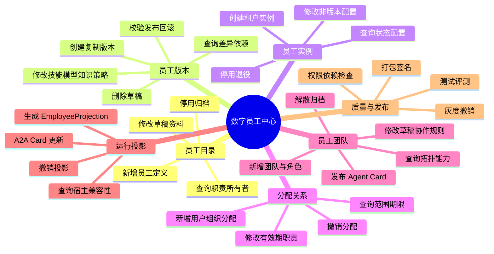
```mermaid
mindmap
  root((数字员工中心))
    员工目录
      新增员工定义
      查询职责所有者
      修改草稿资料
      停用归档
    员工版本
      创建复制版本
      查询差异依赖
      修改技能模型知识策略
      删除草稿
      校验发布回滚
    员工实例
      创建租户实例
      查询状态配置
      修改非版本配置
      停用退役
    分配关系
      新增用户组织分配
      查询范围期限
      修改有效期职责
      撤销分配
    员工团队
      新增团队与角色
      查询拓扑能力
      修改草稿协作规则
      解散归档
      发布 Agent Card
    运行投影
      生成 EmployeeProjection
      查询宿主兼容性
      撤销投影
      A2A Card 更新
    质量与发布
      测试评测
      权限依赖检查
      打包签名
      灰度撤销
```

| 管理对象/功能 | C | R | U | D/退役 | 关键业务操作与规则 |
|---|---|---|---|---|---|
| EmployeeDefinition | 新建岗位模板或复制既有员工 | 查询身份、职责、所有者、版本和使用范围 | 修改未发布描述与分类 | 停用、归档 | 稳定 ID 跨宿主不变；不能绑定某个宿主私有聊天格式 |
| EmployeeVersion | 创建新版本并绑定技能、能力、模型、知识、记忆、输出和审批策略 | 查询差异、依赖、评测和兼容性 | 草稿可改；已发布版本不可变 | 删除无引用草稿、废弃或撤销版本 | 运行中的 Run 固定版本 Digest；升级不改变既有 Run |
| EmployeePackage/Release | 打包并提交评审 | 查询 Manifest、签名、SBOM、渠道和发布证据 | 发布事实不可修改 | 撤销、归档 | 权限清单、宿主要求、技能和服务依赖必须完整且可解析 |
| EmployeeInstance | 在租户创建员工实例 | 查询健康、活动版本、配置和运行量 | 修改允许的实例参数或切换批准版本 | 停用、退役 | 运行实例不保存长期业务会话；Run 属于任务运行中心 |
| EmployeeAssignment | 向用户、组织、岗位或应用分配员工 | 查询范围、来源、期限和状态 | 修改范围、有效期、默认关系 | 撤销、到期 | 分配只决定候选可见性，实际调用仍取双主体权限交集 |
| EmployeeTeam | 新建团队、成员角色和协作目标 | 查询拓扑、能力覆盖、委托规则和预算 | 修改未发布团队版本 | 解散、归档 | 团队定义不直接创建 SubRun；每次实际委托仍进入 Runtime |
| Capability/Skill/Service Binding | 为员工版本选择能力、技能和 MCP 服务 | 查询依赖、权限和兼容性 | 新版本中替换或调整策略 | 从草稿解绑；发布后废弃版本 | 不复制技能和服务定义；绑定固定 Release/Digest 或兼容范围 |
| Model/Knowledge/Memory Policy | 为员工版本创建策略组合 | 查询数据驻留、预算、知识范围和记忆规则 | 修改草稿策略 | 从草稿移除或废弃版本 | 正式推理需要 ModelReceipt；员工不能自行扩大知识和记忆范围 |
| EmployeeProjection | Bootstrap 按用户、租户、宿主和任务生成 | 查询投影版本、能力、限制和有效期 | 上游变化后生成新投影 | 撤销特定宿主/会话投影 | 只包含最小可见信息；带 audience、TTL 和 Digest |
| A2A AgentCard Projection | 从员工或团队批准版本生成 | 查询技能、端点、认证和兼容性 | 发布新投影版本 | 撤销或下线 | Agent Card 是运行投影，不是数字员工定义权威 |

### 6.6 本体中心

**产品职责：** 管理业务语义的定义、候选、校验、审批、发布和投影。本体涵盖概念、属性、Link、语义 Action、公理、约束、映射、来源和版本；知识图谱是投影，不是本体发布权威。

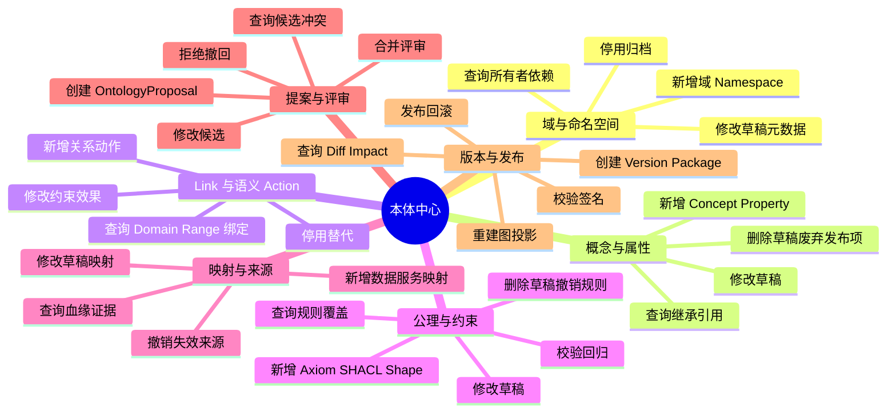
```mermaid
mindmap
  root((本体中心))
    域与命名空间
      新增域 Namespace
      查询所有者依赖
      修改草稿元数据
      停用归档
    概念与属性
      新增 Concept Property
      查询继承引用
      修改草稿
      删除草稿废弃发布项
    Link 与语义 Action
      新增关系动作
      查询 Domain Range 绑定
      修改约束效果
      停用替代
    公理与约束
      新增 Axiom SHACL Shape
      查询规则覆盖
      修改草稿
      删除草稿撤销规则
      校验回归
    映射与来源
      新增数据服务映射
      查询血缘证据
      修改草稿映射
      撤销失效来源
    提案与评审
      创建 OntologyProposal
      查询候选冲突
      修改候选
      拒绝撤回
      合并评审
    版本与发布
      创建 Version Package
      查询 Diff Impact
      校验签名
      发布回滚
      重建图投影
```

| 管理对象/功能 | C | R | U | D/退役 | 关键业务操作与规则 |
|---|---|---|---|---|---|
| OntologyDomain/Namespace | 创建领域、命名空间和所有者 | 查询前缀、依赖、权限和发布版本 | 修改草稿元数据 | 停用、归档 | RID/IRI 必须全局或租户域内唯一，禁止未经映射重用语义 |
| Concept/Class | 在草稿版本新增概念 | 查询定义、继承、实例引用、来源和影响 | 修改草稿标签、定义和父类 | 删除未发布无引用概念；发布后废弃或替代 | breaking change 必须生成影响报告和迁移策略 |
| DataProperty | 新增属性、数据类型、基数和单位 | 查询所属概念、约束、映射和使用情况 | 修改草稿 | 删除草稿；发布后废弃 | 类型、单位、空值和基数变化需兼容性校验 |
| Link/ObjectProperty | 新增关系、方向、Domain、Range 和基数 | 查询反向关系、路径、规则和数据映射 | 修改草稿 | 删除草稿；发布后废弃或替代 | 关系不能只靠自然语言命名，必须有稳定 RID 和约束 |
| SemanticActionDefinition | 新增本体语义 Action | 查询输入、前置条件、效果、风险语义和 ActionBinding | 修改草稿语义 | 废弃、替代、归档 | 只定义“业务语义上可做什么”，不直接保存执行凭据或代码 |
| Axiom/Rule | 新增 subclass、equivalence、disjoint、domain/range 或有限规则 | 查询规则来源、覆盖和推理影响 | 修改草稿 | 删除草稿、撤销发布规则 | 目标只承诺 RDF/RDFS 和有限 OWL/Lite；不宣称完整 OWL DL |
| Constraint/SHACLShape | 新增实体、属性、关系和发布约束 | 查询适用目标、严重度、测试和失败历史 | 修改草稿 | 删除草稿、废弃版本 | SHACL 是发布强制闸门；失败不得发布正式版本 |
| OntologyMapping | 新增到数据字段、数据产品、MCP Capability 或外部词表的映射 | 查询方向、转换、授权和血缘 | 修改草稿 | 撤销失效映射 | 映射不能绕过源端权限；查询计划仍由数据与授权服务校验 |
| ProvenanceReference | 从对话、材料、数据或知识切片创建来源引用 | 查询 Digest、跨度、权限水位和撤回状态 | 追加风险标记，不能改写原来源 | 撤回传播到候选和维护提案 | 已发布历史保持不可变，但必须标记当前来源风险并触发修复 |
| OntologyProposal | 从人工、对话、材料或维护任务创建候选 | 查询差异、冲突、来源、评审和影响 | 在草稿阶段修改、合并、拆分 | 拒绝、撤回、归档 | 模型只能生成候选；提取、评审和发布职责分离 |
| OntologyVersion/Package | 从批准提案创建版本并打包签名 | 查询 Diff、依赖、SHACL、回归、签名和 Digest | 不修改；变更创建新版本 | 废弃、撤销、归档 | 每个 Digest 对应不可变包和图投影；旧 Run 保留原 Digest |
| OntologyRelease | 创建 STAGED 发布记录 | 查询状态、步骤、失败、当前/历史版本 | 只能通过状态命令推进 | FAILED 可恢复；ACTIVE 可回滚/废弃 | PostgreSQL Release Ledger 是唯一发布状态权威 |
| RDF/GraphProjection | 发布后创建 Jena Named Graph 投影 | SPARQL 查询、健康、同步和引用检查 | 通过新版本或恢复器重建 | 引用期结束后回收旧投影 | 投影可重建；`current` 只是便利别名，不能参与既有 Run 正确性 |

### 6.7 技能与能力中心

**产品职责：** 管理“平台或数字员工能够完成什么”以及“员工完成任务的方法资产”。Capability 是稳定能力契约，Skill 是对指令、输入输出、工具、知识和评测的版本化组合；Skill 不拥有服务和业务数据。

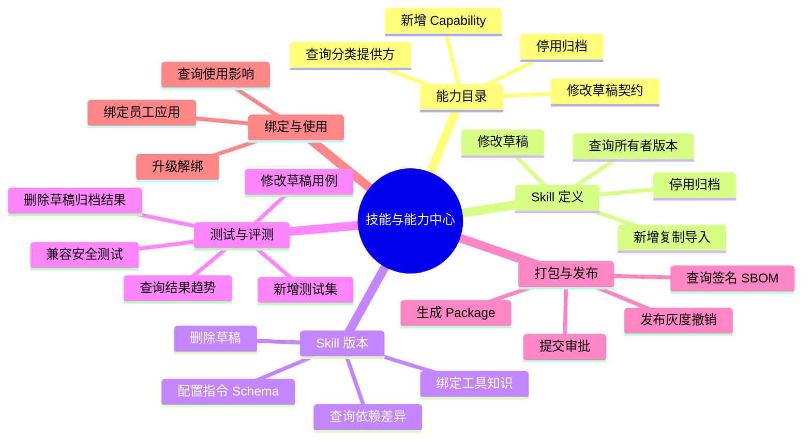
```mermaid
mindmap
  root((技能与能力中心))
    能力目录
      新增 Capability
      查询分类提供方
      修改草稿契约
      停用归档
    Skill 定义
      新增复制导入
      查询所有者版本
      修改草稿
      停用归档
    Skill 版本
      配置指令 Schema
      绑定工具知识
      查询依赖差异
      删除草稿
    测试与评测
      新增测试集
      查询结果趋势
      修改草稿用例
      删除草稿归档结果
      兼容安全测试
    打包与发布
      生成 Package
      查询签名 SBOM
      提交审批
      发布灰度撤销
    绑定与使用
      绑定员工应用
      查询使用影响
      升级解绑
```

| 管理对象/功能 | C | R | U | D/退役 | 关键业务操作与规则 |
|---|---|---|---|---|---|
| CapabilityDefinition | 新建稳定能力标识和契约 | 查询分类、输入输出、提供者和消费者 | 修改未发布契约 | 停用、归档 | 表达“能做什么”，不绑定单一 Skill、模型或服务实现 |
| SkillDefinition | 新建、复制、导入 Skill | 查询说明、所有者、版本、依赖和使用情况 | 修改草稿元数据 | 停用、归档 | Skill 身份与宿主插件身份分开，允许跨宿主投影 |
| SkillVersion | 创建版本并配置指令、Schema、能力、工具、知识和策略 | 查询差异、依赖、权限、兼容性和评测 | 修改草稿 | 删除无引用草稿；废弃发布版本 | 发布后不可变；不保存服务密钥、用户 token 或未治理知识副本 |
| SkillInput/OutputSchema | 创建或引用 Schema | 查询字段、示例、兼容性和 Artifact 映射 | 修改草稿 | 删除草稿、废弃版本 | 输出正式产物时必须引用产物中心的 Artifact Schema |
| SkillDependencyBinding | 绑定 Capability、MCP Tool、知识、本体、模型和其他 Skill | 查询固定版本、权限和循环依赖 | 草稿中修改 | 草稿解绑、发布版本废弃 | 禁止循环依赖、隐式扩权和未声明外部网络访问 |
| SkillTestSuite | 新建黄金样本、契约、安全和回归测试 | 查询覆盖率、样本来源和历史结果 | 修改未发布用例 | 删除草稿、归档旧套件 | 测试数据必须有权限、脱敏和保留策略 |
| SkillEvaluationRun | 对固定版本、模型和测试集创建 | 查询准确性、证据、成本、延迟和失败 | 追加复核结论 | 不可删除；按策略封存 | 评测不自动修改 Skill；结果进入发布准入证据 |
| SkillPackage/Release | 打包、签名、提交审批 | 查询 Manifest、签名、SBOM、兼容矩阵和渠道 | 发布事实不可改 | 撤销、废弃、归档 | 只使用批准许可证和依赖；可执行资产需额外沙箱 Gate |
| SkillConsumerBinding | 向员工版本、团队或应用绑定 Skill Release | 查询消费者、版本范围和影响 | 新版本中升级或调整范围 | 解绑草稿或废弃消费者版本 | 运行中 Run 固定实际 Skill Digest，不能被后台热替换 |

### 6.8 MCP 服务中心

**产品职责：** 管理 AI 可发现、可调用的 MCP 服务、工具、资源、提示资产、鉴权绑定、路由、兼容和健康。AI 看到的是按用户、员工、租户和任务过滤后的能力目录，不是底层服务网络。

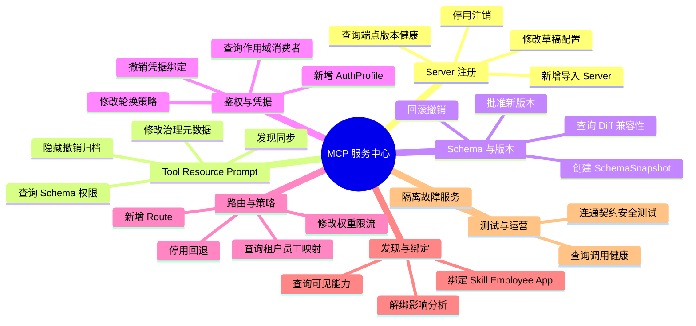
```mermaid
mindmap
  root((MCP 服务中心))
    Server 注册
      新增导入 Server
      查询端点版本健康
      修改草稿配置
      停用注销
    Tool Resource Prompt
      发现同步
      查询 Schema 权限
      修改治理元数据
      隐藏撤销归档
    Schema 与版本
      创建 SchemaSnapshot
      查询 Diff 兼容性
      批准新版本
      回滚撤销
    鉴权与凭据
      新增 AuthProfile
      查询作用域消费者
      修改轮换策略
      撤销凭据绑定
    路由与策略
      新增 Route
      查询租户员工映射
      修改权重限流
      停用回退
    发现与绑定
      查询可见能力
      绑定 Skill Employee App
      解绑影响分析
    测试与运营
      连通契约安全测试
      查询调用健康
      隔离故障服务
```

| 管理对象/功能 | C | R | U | D/退役 | 关键业务操作与规则 |
|---|---|---|---|---|---|
| MCPServerDefinition | 注册 URL、stdio service principal 或导入 Manifest | 查询所有者、协议、版本、端点、权限和消费者 | 修改草稿治理信息 | 停用、注销、归档 | 生产优先 Streamable HTTP；stdio 受保护工具默认禁用，除非显式服务主体 |
| MCPServerInstance | 在租户环境创建服务实例 | 查询版本、配置、健康、容量和最近调用 | 修改允许配置、扩缩或切换批准版本 | 停止、退役 | 实例不拥有 Tool 治理元数据；运行凭据通过 Secret Reference 获取 |
| ToolDefinition | 从 Server 发现或人工登记工具 | 查询名称、描述、输入输出 Schema、风险、权限和版本 | 修改治理标签、风险候选和展示说明 | 隐藏、停用、撤销 | Server 返回 Schema 是输入证据，平台审批后的 Catalog 才能向员工可见 |
| ResourceDefinition | 发现或登记 Resource 与模板 URI | 查询 MIME、Schema、权限、缓存和引用 | 修改治理元数据 | 隐藏、停用、归档 | 大对象返回受权 resource link，不把二进制内容塞入工具描述 |
| PromptDefinition | 发现或登记 Prompt 资产 | 查询参数、版本、来源和消费者 | 修改草稿或治理说明 | 停用、归档 | Prompt 不是权限策略，也不能包含长期秘密 |
| SchemaSnapshot | 同步 Server 能力时创建不可变快照 | 查询 Diff、breaking change 和兼容结果 | 不修改；生成新快照 | 按保留期归档 | 运行和 Skill 绑定固定已批准快照或明确兼容范围 |
| AuthProfile/CredentialBinding | 创建 OAuth、mTLS、service principal 等认证配置与秘密引用 | 查询 audience、scope、租户、消费者和轮换状态 | 修改轮换、TTL 和绑定范围 | 撤销、删除秘密引用 | 不在产品数据库保存明文秘密；工具调用仍做最终资源授权 |
| MCPRoute | 创建租户、员工、能力到实例的路由 | 查询权重、回退、限流、区域和健康条件 | 修改草稿/灰度配置 | 停用、回滚 | 路由不能改变 Tool Schema、风险和权限语义 |
| CapabilityCatalogProjection | 按 Bootstrap 上下文动态生成 | 查询当前可见 Tool/Resource/Prompt 和原因 | 上游变化后重新生成 | 撤销或过期 | 客户端同名参数不能覆盖令牌 Claim；不可见能力不泄露元数据 |
| ConsumerBinding | 将 Tool/Resource 绑定到 Skill、员工、Action 或应用 | 查询消费者、所需 scope 和影响 | 草稿中升级或调整约束 | 解绑草稿；发布后创建新版本 | 绑定不直接授予用户权限，最终调用取双主体交集 |
| MCPCompatibilityTest | 为固定 Server/Host/Gateway 版本创建测试运行 | 查询双向、流式、OAuth、错误和降级结果 | 追加复核 | 不可删除；归档 | 未通过的能力标记 NOT_SUPPORTED/NOT_IN_RUNTIME，不能伪装可用 |

### 6.9 Action 与工作流中心

**产品职责：** 管理“如何把语义 Action 安全执行”为产品能力。Ontology SemanticAction 定义业务含义；ActionDefinition 定义执行契约；ActionBinding 选择受治理实现；Workflow 编排多个 Action 的条件、审批、等待、重试和补偿。

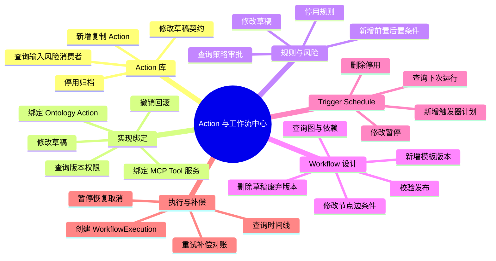
```mermaid
mindmap
  root((Action 与工作流中心))
    Action 库
      新增复制 Action
      查询输入风险消费者
      修改草稿契约
      停用归档
    实现绑定
      绑定 Ontology Action
      绑定 MCP Tool 服务
      查询版本权限
      修改草稿
      撤销回滚
    规则与风险
      新增前置后置条件
      查询策略审批
      修改草稿
      停用规则
    Workflow 设计
      新增模板版本
      查询图与依赖
      修改节点边条件
      删除草稿废弃版本
      校验发布
    Trigger Schedule
      新增触发器计划
      查询下次运行
      修改暂停
      删除停用
    执行与补偿
      创建 WorkflowExecution
      查询时间线
      暂停恢复取消
      重试补偿对账
```

| 管理对象/功能 | C | R | U | D/退役 | 关键业务操作与规则 |
|---|---|---|---|---|---|
| ActionDefinition | 新建、复制或从语义 Action 生成草稿 | 查询用途、输入输出、风险、所有者、版本和消费者 | 修改草稿契约 | 停用、废弃、归档 | 定义可执行业务动作，不保存具体用户 Approval 或运行状态 |
| ActionVersion | 创建版本并固定 Schema、前置条件、效果、幂等和补偿契约 | 查询 Diff、测试、权限和兼容性 | 修改草稿 | 删除草稿；撤销发布版本 | 发布后不可变；正式执行必须固定 ActionVersion Digest |
| OntologyActionBinding | 将 SemanticActionDefinition 映射到 ActionVersion | 查询语义、前置条件和兼容范围 | 修改草稿映射 | 解绑、废弃 | 本体语义变化必须触发影响分析，不能自动替换执行契约 |
| ActionImplementationBinding | 绑定 MCP Tool、领域服务或受治理 Workflow | 查询实现版本、路由、凭据类型、幂等和健康 | 新版本中调整 | 撤销、回滚 | 不能绑定未批准 Tool Schema、常驻用户凭据或跨租户实例 |
| ActionRiskPolicy | 创建风险计算、Approval 和职责分离规则 | 查询适用动作、版本和命中解释 | 修改草稿 | 停用、归档 | 模型只能提出风险候选；服务端策略决定 R1-R4，降低风险需明确策略证据 |
| Pre/PostCondition | 创建数据、本体、权限和业务条件 | 查询表达式、来源、覆盖和失败历史 | 修改草稿 | 删除草稿、废弃版本 | 执行前重新读取当前业务条件；不能只依赖生成计划时的快照 |
| CompensationDefinition | 创建反向动作、Saga 或人工对账规则 | 查询适用失败、限制和验证结果 | 修改草稿 | 停用、归档 | 不可逆动作必须明确标记，不允许伪造可补偿性 |
| WorkflowDefinition/Version | 新建模板、复制版本、导入受支持定义 | 查询节点、边、条件、依赖、Diff 和历史 | 修改草稿图 | 删除草稿、废弃或撤销版本 | 普通短请求不强制进入 Temporal；仅可靠等待、重试和补偿使用持久流程 |
| WorkflowNode/Edge | 在草稿 Workflow 新增 Action、审批、等待、分支和人工任务 | 查询输入输出、条件和映射 | 修改草稿 | 删除草稿节点/边 | 发布校验不可达节点、循环、权限提升、缺失补偿和非确定性逻辑 |
| Trigger/Schedule | 创建事件、时间、API 或人工触发器 | 查询状态、过滤、下次触发和执行历史 | 修改、暂停 | 停用、删除未引用触发器 | 事件身份、tenant、Run 关联和权限水位必须验证，字段不能自证身份 |
| WorkflowExecution | 对固定版本和 Run 创建 | 查询状态、等待、Activity、信号、重试和补偿 | 只通过暂停、恢复、取消、信号命令推进 | 终止、封存；不可删除 | Temporal 只拥有 WorkflowExecution；Employee Runtime 拥有顶层 EmployeeRun |
| ActivityLedger/Inbox | 副作用前创建幂等台账；回调/信号进入 Inbox | 查询幂等键、因果链、授权和结果 | 追加尝试和结果 | 按保留策略封存 | Replay 不得重复未受保护副作用；每次 Activity 重新校验授权、Approval 和 Lease |

### 6.10 数据与知识中心

**产品职责：** 统一治理业务数据、分析数据、ETL/ELT 管道、文档知识、索引、知识图谱投影、联邦查询、数据质量和血缘。它提供经授权的数据与证据，不决定业务动作是否允许，也不成为本体定义权威。

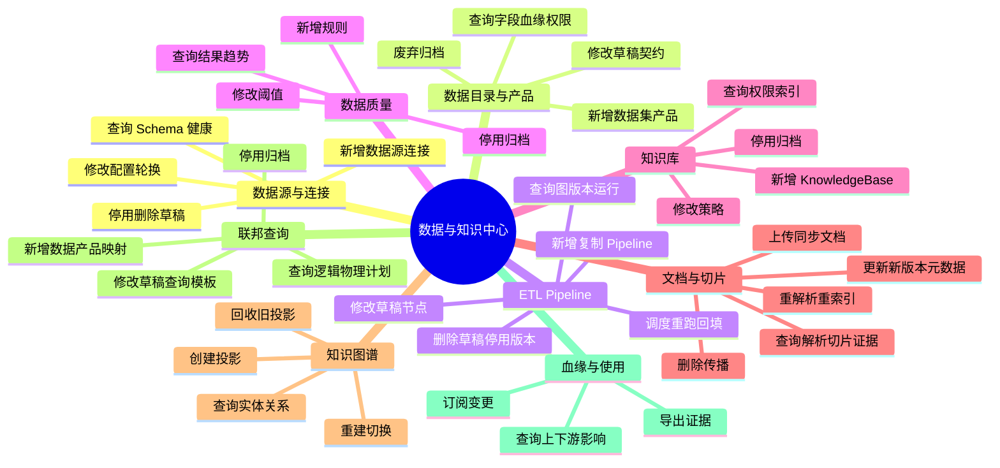
```mermaid
mindmap
  root((数据与知识中心))
    数据源与连接
      新增数据源连接
      查询 Schema 健康
      修改配置轮换
      停用删除草稿
    数据目录与产品
      新增数据集产品
      查询字段血缘权限
      修改草稿契约
      废弃归档
    ETL Pipeline
      新增复制 Pipeline
      查询图版本运行
      修改草稿节点
      删除草稿停用版本
      调度重跑回填
    数据质量
      新增规则
      查询结果趋势
      修改阈值
      停用归档
    知识库
      新增 KnowledgeBase
      查询权限索引
      修改策略
      停用归档
    文档与切片
      上传同步文档
      查询解析切片证据
      更新新版本元数据
      删除传播
      重解析重索引
    知识图谱
      创建投影
      查询实体关系
      重建切换
      回收旧投影
    联邦查询
      新增数据产品映射
      查询逻辑物理计划
      修改草稿查询模板
      停用归档
    血缘与使用
      查询上下游影响
      订阅变更
      导出证据
```

| 管理对象/功能 | C | R | U | D/退役 | 关键业务操作与规则 |
|---|---|---|---|---|---|
| DataSourceDefinition | 注册数据库、API、文件、对象存储或外部 Catalog | 查询所有者、分类、区域、Schema 和消费者 | 修改草稿治理元数据 | 停用、归档 | 不保存明文凭据；跨租户和跨区域必须明确授权和数据驻留 |
| DataConnection | 为租户环境创建连接与 Secret Reference | 查询健康、权限、轮换和最近使用 | 修改连接参数、轮换秘密引用 | 关闭、删除无引用连接 | 源端账号采用最小权限；连接成功不代表数据已获业务授权 |
| DataAsset/Dataset | 从源发现或人工登记表、视图、文件集合 | 查询 Schema、字段、分类、质量、血缘和访问策略 | 修改治理描述、标签和负责人 | 废弃、归档 | 物理 Schema 变化创建新快照并通知消费者 |
| DataProduct | 将数据集、用途、SLA、授权和语义契约产品化 | 查询版本、消费者、质量和策略 | 修改草稿契约 | 停用、废弃、归档 | 本体规划器和员工只能使用已批准数据产品，不直接枚举底层任意表 |
| Field/SemanticMapping | 将字段映射到本体 Property、Concept、单位和分类 | 查询映射、转换、来源和影响 | 修改草稿 | 撤销、替代 | 映射不能替代源端 ACL；查询仍逐字段、用途和连接授权 |
| PipelineDefinition/Version | 新建、复制或导入 ETL/ELT Pipeline | 查询节点、依赖、版本、调度、运行和血缘 | 修改草稿节点与参数 Schema | 删除草稿；停用、废弃版本 | 发布前校验循环、凭据、Schema、资源、重试、幂等和回滚 |
| PipelineRun | 手动、计划或事件创建 | 查询进度、输入水位、输出快照、质量和错误 | 仅通过暂停、恢复、取消、重试和回填命令 | 封存；不可删除审计事实 | 重跑固定代码和输入水位；部分成功必须可识别和对账 |
| DataQualityRule/Result | 新增完整性、唯一性、及时性、分布和语义规则 | 查询规则、覆盖、结果、趋势和阻断记录 | 修改草稿或创建新版本 | 停用、归档 | 质量失败按规则阻断发布、降级或标记风险，不能静默放行 |
| KnowledgeBase | 新建领域知识库并设置所有者、ACL、索引和保留策略 | 查询文档、索引、权限、使用量和健康 | 修改允许配置或创建策略版本 | 停用、归档 | RAGFlow 负责内部处理；平台拥有业务 ACL、来源和使用契约 |
| GovernedSourceDocument | 上传、同步或从受权来源创建固定版本 | 查询 Digest、ACL、分类、解析、引用和保留状态 | 元数据更正或上传新版本 | 删除请求、来源撤回、法律冻结 | 原文版本不可改；恶意文件、提示注入和跨租户对象键必须拒绝 |
| KnowledgeChunk/IndexSnapshot | 解析和切片任务生成 | 查询来源跨度、解析器、Embedding、索引版本和权限水位 | 通过重解析/重索引生成新快照 | 来源删除时传播清理 | 禁止整文 fallback 或 mock 结果冒充成功；每个结论可回到来源跨度 |
| KnowledgeGraphProjection | 从批准本体、数据和知识构建可重建投影 | 查询实体、关系、来源、版本和健康 | 通过增量/全量重建生成新投影 | 回收无引用旧投影 | 图谱保存关系投影，不拥有 OntologyDefinition 或业务事实写入权威 |
| FederatedQueryTemplate | 新建受治理逻辑查询模板 | 查询用途、数据产品、字段、连接和成本 | 修改草稿 | 停用、归档 | Ontology Planner 只生成候选逻辑计划；实际查询逐项授权并记录计划 Digest |
| QueryExecution/Evidence | 对固定数据水位和授权创建分析执行 | 查询逻辑/物理计划、快照、结果 Digest 和成本 | 不修改；重跑生成新执行 | 按保留策略封存 | Trino/分析路径只读；业务变更必须走业务 MCP 或领域服务 |
| Lineage/Impact View | 由数据、管道、知识、本体和应用关系生成 | 查询上下游、版本、负责人和风险 | 增加人工说明或确认 | 不直接删除派生关系 | 变更、删除、撤销和升级前必须展示受影响员工、应用、报告和任务 |

### 6.11 记忆中心

**产品职责：** 管理用户、数字员工和团队的经验记忆候选、审核、晋升、作用域、冲突、撤销和删除传播。记忆不等于聊天记录、企业知识库、用户偏好或 Run 状态；MemoryCore 只是可替换实现。

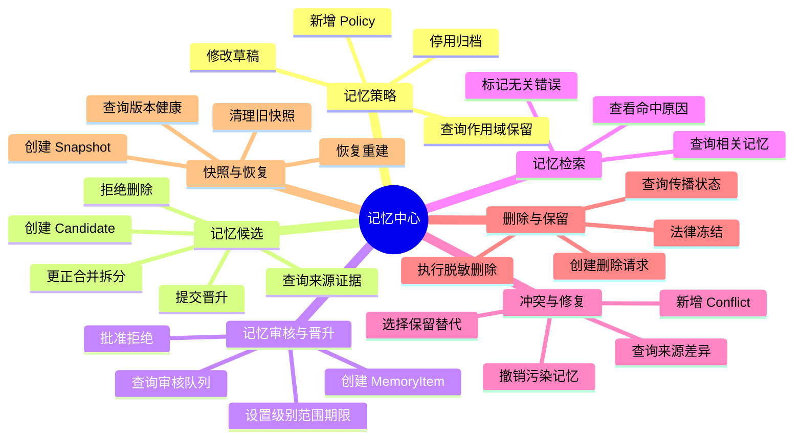
```mermaid
mindmap
  root((记忆中心))
    记忆策略
      新增 Policy
      查询作用域保留
      修改草稿
      停用归档
    记忆候选
      创建 Candidate
      查询来源证据
      更正合并拆分
      拒绝删除
      提交晋升
    记忆审核与晋升
      查询审核队列
      批准拒绝
      设置级别范围期限
      创建 MemoryItem
    记忆检索
      查询相关记忆
      查看命中原因
      标记无关错误
    冲突与修复
      新增 Conflict
      查询来源差异
      选择保留替代
      撤销污染记忆
    删除与保留
      创建删除请求
      查询传播状态
      执行脱敏删除
      法律冻结
    快照与恢复
      创建 Snapshot
      查询版本健康
      恢复重建
      清理旧快照
```

| 管理对象/功能 | C | R | U | D/退役 | 关键业务操作与规则 |
|---|---|---|---|---|---|
| MemoryPolicy | 新建用户、员工、团队或场景策略 | 查询作用域、来源、晋升、保留、敏感和删除规则 | 修改草稿 | 停用、归档 | 不得放宽身份权限、本体或知识 ACL；员工版本只引用批准策略 |
| MemoryCandidate | 模型、宿主、用户或服务基于 Run/Artifact 创建 | 查询来源、证据、作用域、敏感级别和候选原因 | 审核前更正、合并、拆分或补证据 | 拒绝、撤回、删除 | 候选默认不参与长期检索；不能保存无来源推断为事实 |
| MemoryReview | 为候选创建自动策略或人工审核 | 查询审核人、规则、意见和状态 | 补充说明、转交或请求更多证据 | 取消、过期 | 高敏、冲突或跨作用域晋升必须人工确认和职责分离 |
| MemoryItem | 审核通过后创建不可变记忆版本 | 查询内容、来源、适用范围、有效期、命中和消费者 | 更正产生新版本并关联旧项 | 撤销、过期、合规删除 | 明确 L0-L3/作用域；企业知识删除不能留下无来源记忆副本 |
| MemoryCollection/Scope | 创建个人、员工、团队、应用或领域集合 | 查询所有者、成员、策略和授权 | 修改草稿集合规则 | 停用、归档 | 跨员工共享需显式团队/应用作用域，不能因同租户自动共享 |
| MemoryRetrievalRecord | 每次检索创建命中记录 | 查询查询 Digest、命中、过滤、权限和使用结果 | 追加用户反馈 | 按策略封存 | 记录使用事实但不暴露私有思维链；运行固定实际使用记忆 Digest |
| MemoryConflict | 用户、审核器或一致性检查创建 | 查询冲突项、来源、时间和影响 | 标记首选、替代、并存或需复核 | 解决后归档 | 冲突未解决时降低置信或阻断高风险使用，不能静默覆盖 |
| MemoryCorrection/Revocation | 对错误、过时或污染记忆创建 | 查询传播范围和受影响 Run/Artifact | 追加修复进度 | 完成后封存 | 撤销传播到索引、缓存和未来检索；历史使用事实保留风险标记 |
| MemoryDeletionRequest | 用户、管理员或保留策略创建 | 查询身份验证、范围、法律冻结和传播状态 | 缩小范围或补充验证 | 取消未开始请求 | 删除传播到 MemoryCore、索引、缓存和副本；保留最小不可变审计证明 |
| MemorySnapshot/Restore | 按策略创建加密快照 | 查询版本、Digest、环境和恢复验证 | 不修改快照 | 过期清理、法律冻结 | 恢复后重新验证 ACL、来源引用、撤销水位和删除墓碑 |

### 6.12 组织、身份与权限中心

**产品职责：** 管理人类用户、组织岗位、动态角色、权限、关系、策略、服务主体、身份联合、授权委托和访问复核。Supabase Auth 是连接型部署的人类身份权威，Keycloak 负责信任代理和运行令牌；OpenFGA/OPA/RLS 承担关系、策略和数据层判定。

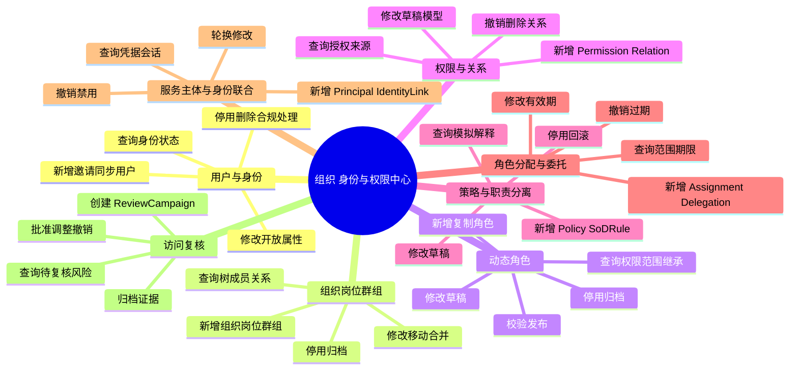
```mermaid
mindmap
  root((组织 身份与权限中心))
    用户与身份
      新增邀请同步用户
      查询身份状态
      修改开放属性
      停用删除合规处理
    组织岗位群组
      新增组织岗位群组
      查询树成员关系
      修改移动合并
      停用归档
    动态角色
      新增复制角色
      查询权限范围继承
      修改草稿
      停用归档
      校验发布
    权限与关系
      新增 Permission Relation
      查询授权来源
      修改草稿模型
      撤销删除关系
    策略与职责分离
      新增 Policy SoDRule
      查询模拟解释
      修改草稿
      停用回滚
    角色分配与委托
      新增 Assignment Delegation
      查询范围期限
      修改有效期
      撤销过期
    服务主体与身份联合
      新增 Principal IdentityLink
      查询凭据会话
      轮换修改
      撤销禁用
    访问复核
      创建 ReviewCampaign
      查询待复核风险
      批准调整撤销
      归档证据
```

| 管理对象/功能 | C | R | U | D/退役 | 关键业务操作与规则 |
|---|---|---|---|---|---|
| HumanUser | 邀请、SCIM/HR 同步或批准自助注册 | 查询身份、状态、组织、岗位、认证方式和风险 | 修改开放属性、状态和身份链接 | 停用、合规删除或匿名化 | 用户主键稳定；身份删除不篡改既有审批、执行和审计责任链 |
| OrganizationUnit | 创建组织节点 | 查询组织树、负责人、成员和资源关系 | 重命名、移动、合并 | 停用、归档 | 组织变更触发角色、关系、员工分配和审批影响分析 |
| Position/Group | 新增岗位、职位或群组 | 查询成员、职责、继承和使用 | 修改草稿或成员关系 | 停用、归档 | 岗位是业务关系，不应直接写死底层权限列表 |
| DynamicRole | 新建、复制内置模板或从权限包创建 | 查询权限、数据范围、继承、成员、依赖和风险 | 修改未发布角色草稿 | 停用、归档 | 发布前校验越权授权、循环继承、职责冲突和孤儿权限 |
| PermissionDefinition | 注册资源类型、动作和作用域 | 查询消费者、策略和版本 | 修改草稿或创建新版本 | 废弃、归档 | 权限语义稳定、可解释；前端按钮权限不得成为唯一控制 |
| PermissionPackage | 组合一组权限和默认范围 | 查询内容、版本、角色和应用依赖 | 修改草稿 | 停用、废弃 | 应用可请求权限包，但不能自动批准或扩大安装管理员权限 |
| RoleAssignment | 将角色分配给用户、组、岗位、服务主体 | 查询来源、范围、期限、审批和实际生效关系 | 修改范围、期限或条件 | 撤销、到期 | 分配者只能授予自己可委托的权限；高风险分配需要审批和职责分离 |
| RelationshipTuple | 创建 owner、member、approver、assigned 等关系 | 查询对象图、来源和授权解释 | 以新增/删除关系变更，不原地改语义 | 删除、到期、撤销 | 跨租户关系禁止；变更更新权限水位并使旧投影失效 |
| PolicyDefinition/Version | 新建 OPA/业务策略和版本 | 查询适用资源、输入、决定、解释和测试 | 修改草稿 | 停用、回滚、归档 | 策略发布需测试、模拟、影响分析和回滚；deny 优先于 allow |
| SoDRule | 新增职责冲突和双人审批规则 | 查询冲突组合、例外和命中 | 修改草稿 | 停用、归档 | 创建角色、分配、审批和发布时同步检查，例外必须限时并审计 |
| DelegationGrant | 用户或管理员创建临时委托 | 查询委托人、受托人、范围、期限和使用 | 缩小范围或提前到期 | 撤销、过期 | 不允许转委托未拥有权限；审批职责继承按策略明确 |
| ServicePrincipal | 为服务、Worker、Connector 或插件创建主体 | 查询用途、scope、凭据、环境和最近使用 | 轮换凭据、缩小 scope | 禁用、撤销、归档 | 不能替代 authorizing human/employee 双主体；秘密存 OpenBao 引用 |
| IdentityLink/Session | 建立 Supabase、企业 IdP、Keycloak 或离线身份映射 | 查询 issuer、subject、会话、设备和风险 | 重新链接或刷新可信元数据 | 解除链接、撤销会话 | 预链接、防账号接管、PKCE、audience、nonce、JWKS 和撤销必须验证 |
| AccessReviewCampaign | 创建周期或事件触发复核 | 查询高权、闲置、冲突、过期和孤儿访问 | 调整范围、负责人和期限 | 关闭、归档 | 复核结论可保留、调整或撤销；不回应按策略自动升级或关闭访问 |

### 6.13 租户与配置中心

**产品职责：** 管理租户生命周期、功能开关、配置 Schema/值、字典、配额、预算、通知、品牌、本地化、保留和数据驻留默认规则。配置中心保存配置权威，不保存部署秘密明文和领域业务对象。

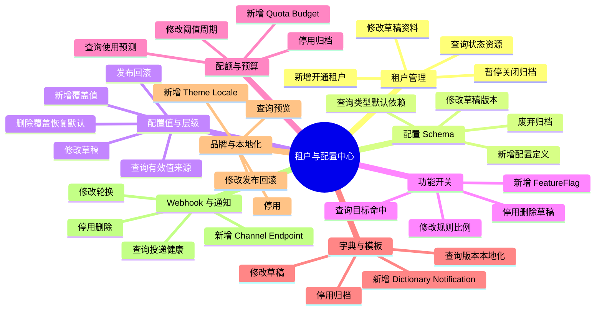
```mermaid
mindmap
  root((租户与配置中心))
    租户管理
      新增开通租户
      查询状态资源
      修改草稿资料
      暂停关闭归档
    配置 Schema
      新增配置定义
      查询类型默认依赖
      修改草稿版本
      废弃归档
    配置值与层级
      新增覆盖值
      查询有效值来源
      修改草稿
      删除覆盖恢复默认
      发布回滚
    功能开关
      新增 FeatureFlag
      查询目标命中
      修改规则比例
      停用删除草稿
    配额与预算
      新增 Quota Budget
      查询使用预测
      修改阈值周期
      停用归档
    字典与模板
      新增 Dictionary Notification
      查询版本本地化
      修改草稿
      停用归档
    品牌与本地化
      新增 Theme Locale
      查询预览
      修改发布回滚
      停用
    Webhook 与通知
      新增 Channel Endpoint
      查询投递健康
      修改轮换
      停用删除
```

| 管理对象/功能 | C | R | U | D/退役 | 关键业务操作与规则 |
|---|---|---|---|---|---|
| Tenant | 平台管理员创建、导入或批准开通 | 查询状态、套餐、区域、资源、管理员和应用 | 修改草稿资料和允许的运营信息 | 暂停、关闭、归档 | 关闭前完成数据导出、保留、法律冻结、身份撤销和资源回收计划 |
| TenantDomain/Brand | 新增域名、品牌和证书引用 | 查询验证、绑定、使用和到期 | 修改草稿或创建新版本 | 解绑、停用 | 域名和品牌不改变身份 issuer/audience 或租户隔离边界 |
| ConfigSchema | 新增类型化配置定义、默认值、校验和敏感标记 | 查询版本、消费者、覆盖层和兼容性 | 修改草稿 | 废弃、归档 | 敏感配置只保存 Secret Reference；Schema 变化需迁移和回滚策略 |
| ConfigValue/Override | 在平台、租户、环境、应用或用户允许层创建覆盖 | 查询有效值、来源、版本和发布时间 | 修改草稿覆盖 | 删除覆盖并恢复上层默认 | 覆盖层优先级固定；用户偏好不能覆盖企业安全配置 |
| ConfigRelease | 将一组配置值生成版本并发布 | 查询 Diff、审批、目标、灰度、结果和回滚点 | 发布记录不可修改 | 回滚、归档 | 发布采用预检、分批、观测和自动/人工回滚，失败保留旧有效配置 |
| FeatureFlag | 新增布尔、枚举或实验开关 | 查询规则、目标、命中、使用和风险 | 修改目标、比例和期限 | 停用、删除草稿 | Gate 未通过的生产能力不能仅靠开关启用；服务端再次校验能力状态 |
| Quota/Budget | 创建请求、模型、存储、任务、插件资源或成本限额 | 查询已用、剩余、预测、超限和豁免 | 修改未来周期阈值 | 停用、归档 | 超限行为明确为拒绝、排队、降级或审批，不允许无提示透支 |
| Dictionary/Taxonomy | 新增业务字典、分类和枚举版本 | 查询条目、映射、引用和本地化 | 修改草稿、创建新版本 | 停用条目、归档版本 | 被本体、Schema 或报告引用的代码值不可原地改语义 |
| NotificationTemplate | 新增邮件、短信、IM、站内通知模板 | 查询变量、语言、渠道、预览和使用 | 修改草稿 | 停用、归档 | 只负责通知文案，不替代应用中心正式 Artifact 输出模板 |
| NotificationChannel/Webhook | 创建渠道、端点和 Secret Reference | 查询事件、订阅、投递、重试和健康 | 修改过滤、限流、轮换 | 停用、删除无引用端点 | 签名、防重放、出站 allowlist、敏感字段过滤和 DLQ 必须配置 |
| Theme/Locale | 新增主题、Logo、字体、日期数字格式和语言包 | 查询预览、版本、应用和模板引用 | 修改草稿 | 停用、回滚、归档 | 主题影响呈现，不改变 Artifact 内容、字段权限和审计事实 |
| Retention/DataResidencyPolicy | 创建租户默认保留、区域和跨境规则 | 查询适用对象、例外、法律冻结和执行状态 | 修改未来策略 | 停用、归档 | 缩短保留期需影响分析；不能删除法律冻结或法定审计证据 |

### 6.14 宿主、环境与部署中心

**产品职责：** 管理 Codex、Claude Code、DSH、Hermes 等宿主的能力契约和稳定 Connector，以及租户运行环境、Connected Runtime、Disconnected Cell、制品、部署、升级、回滚、漂移和健康。它不拥有 BusinessSession、Run 或员工定义。

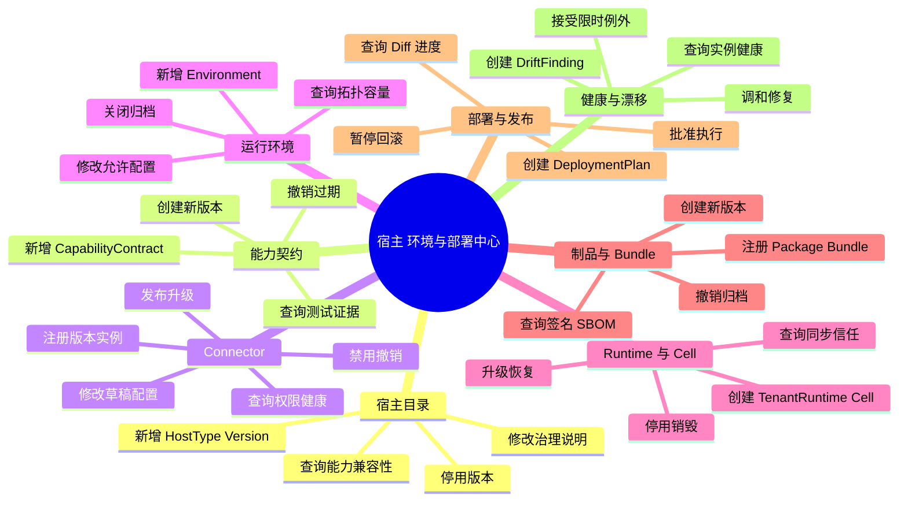
```mermaid
mindmap
  root((宿主 环境与部署中心))
    宿主目录
      新增 HostType Version
      查询能力兼容性
      修改治理说明
      停用版本
    能力契约
      新增 CapabilityContract
      查询测试证据
      创建新版本
      撤销过期
    Connector
      注册版本实例
      查询权限健康
      修改草稿配置
      禁用撤销
      发布升级
    运行环境
      新增 Environment
      查询拓扑容量
      修改允许配置
      关闭归档
    Runtime 与 Cell
      创建 TenantRuntime Cell
      查询同步信任
      升级恢复
      停用销毁
    制品与 Bundle
      注册 Package Bundle
      查询签名 SBOM
      创建新版本
      撤销归档
    部署与发布
      创建 DeploymentPlan
      查询 Diff 进度
      批准执行
      暂停回滚
    健康与漂移
      查询实例健康
      创建 DriftFinding
      调和修复
      接受限时例外
```

| 管理对象/功能 | C | R | U | D/退役 | 关键业务操作与规则 |
|---|---|---|---|---|---|
| HostType/HostVersion | 注册宿主类型和具体版本 | 查询扩展面、认证、限制、支持期限和消费者 | 修改治理说明 | 停用过期版本 | 不能凭“支持 MCP/插件”推断完整员工生命周期；逐版本实测 |
| HostCapabilityContract | 为宿主版本创建 Skills、MCP、A2A、MCP Apps、SubAgent、流式和 Artifact 能力契约 | 查询状态、测试证据、限制和 fallback | 新测试产生新契约版本 | 撤销、过期 | 能力状态使用 SUPPORTED、NOT_SUPPORTED、NOT_IN_RUNTIME，与生产 Gate 分开 |
| ConnectorDefinition/Version | 注册稳定 MetaPlatform Connector 和版本 | 查询权限清单、协议、宿主兼容、签名和 SBOM | 修改草稿或创建新版本 | 撤销、归档 | 每个宿主只需稳定 Connector，不为每名员工安装独立插件 |
| ConnectorInstance | 宿主/设备完成验证后注册 | 查询所属用户、宿主、版本、能力、心跳和投影 | 更新非敏感设备元数据或升级 | 禁用、撤销、过期 | Bootstrap 换票使用模型不可见通道、PKCE 与实例证明；不向模型暴露 bearer grant |
| RuntimeEnvironment | 创建 dev、test、staging、prod 或边缘环境 | 查询身份、区域、故障域、容量、网络和依赖 | 修改允许元数据和资源目标 | 关闭、归档 | 环境身份不可伪造；生产证据不得由单机模拟独立故障域 |
| TenantRuntime | 为租户创建独立运行面 | 查询组件版本、路由、策略、数据、健康和 Gate | 通过 Deployment 发布变更 | 停用、销毁前执行导出/保留 | 中央控制面不集中保存租户敏感业务数据；高频执行留在租户运行面 |
| DisconnectedCell | 创建离线部署计划和信任包 | 查询身份、时钟、离线期限、同步和冲突 | 通过批准 Bundle 升级 | 隔离、退役、销毁 | 必须有本地身份、策略、Secrets、OCI、GitOps、受保护时间源和重连演练 |
| PackageRegistryEntry | 注册镜像、员工包、技能包、本体包、应用包和 Bundle | 查询 Digest、签名、SBOM、许可证、引用和撤销 | 不修改制品；更新治理元数据需审计 | 撤销、隔离、按引用归档 | 生产部署只接受 Digest 固定且信任策略通过的制品 |
| DeploymentBundle | 组合固定组件/制品 Digest、配置、策略和迁移 | 查询依赖、环境兼容、Diff、签名和回滚 | 修改草稿 | 删除草稿、撤销发布 Bundle | 不包含明文秘密；引用环境 Secret/PKI 和批准配置版本 |
| DeploymentPlan | 选择环境和 Bundle 后生成 | 查询预检、变更、容量、迁移、风险和回滚 | 执行前调整目标和窗口 | 取消未执行计划 | 需审批、依赖 Gate 和维护窗口；影响业务的发布必须通知和可回退 |
| DeploymentExecution | 批准后创建执行 | 查询步骤、日志、健康、错误和证据 | 仅通过暂停、继续、取消、回滚命令 | 封存；不可删除 | 异常安全清理仅处理本次创建资源；失败保留旧活动版本 |
| DriftFinding/Reconciliation | 检测实际与声明状态差异时创建 | 查询严重度、资源、来源、历史和影响 | 认领、修复、接受限时例外 | 解决后归档 | 高风险漂移自动阻断后续发布；不得静默覆盖人工热修复而不留证据 |

### 6.15 运营、审计与质量中心

**产品职责：** 提供平台、租户、应用、员工、模型、服务、数据和工作流的可观测、审计、质量、成本、安全、事件、备份恢复和生产 Gate 证据。运维健康不替代业务验收、授权或恢复证据。

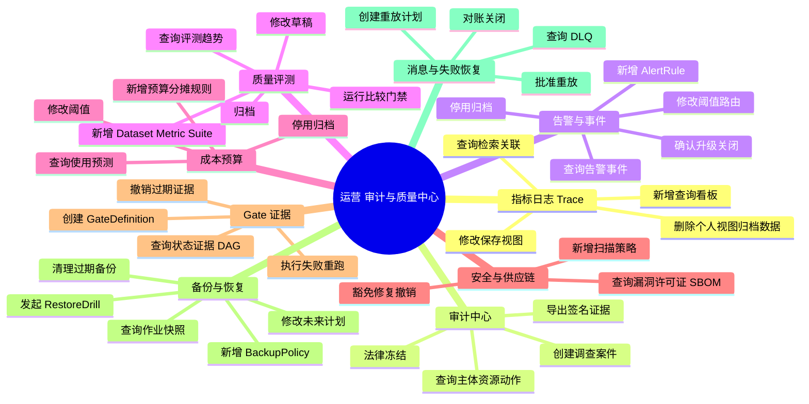
```mermaid
mindmap
  root((运营 审计与质量中心))
    指标日志 Trace
      新增查询看板
      查询检索关联
      修改保存视图
      删除个人视图归档数据
    审计中心
      查询主体资源动作
      导出签名证据
      创建调查案件
      法律冻结
    告警与事件
      新增 AlertRule
      查询告警事件
      修改阈值路由
      停用归档
      确认升级关闭
    质量评测
      新增 Dataset Metric Suite
      查询评测趋势
      修改草稿
      归档
      运行比较门禁
    成本预算
      新增预算分摊规则
      查询使用预测
      修改阈值
      停用归档
    安全与供应链
      新增扫描策略
      查询漏洞许可证 SBOM
      豁免修复撤销
    Gate 证据
      创建 GateDefinition
      查询状态证据 DAG
      执行失败重跑
      撤销过期证据
    备份与恢复
      新增 BackupPolicy
      查询作业快照
      修改未来计划
      清理过期备份
      发起 RestoreDrill
    消息与失败恢复
      查询 DLQ
      创建重放计划
      批准重放
      对账关闭
```

| 管理对象/功能 | C | R | U | D/退役 | 关键业务操作与规则 |
|---|---|---|---|---|---|
| Dashboard/SavedQuery | 新建个人、团队或平台看板 | 查询指标、日志、Trace、过滤和共享范围 | 修改布局、查询和刷新 | 删除个人草稿、归档共享看板 | 看板只读观测数据，不能直接修改业务状态 |
| Metric/SLODefinition | 新增业务、运行和体验指标或 SLO | 查询定义、来源、目标、燃尽和消费者 | 修改草稿或新版本 | 停用、归档 | SLO 与业务验收分开；健康检查不能证明数据、IAM 或恢复正确 |
| Log/Trace/SearchView | 系统采集；用户创建保存视图 | 按 tenant、user、employee、Run、SubRun、tool、workflow 关联查询 | 修改保存条件和脱敏视图 | 按保留策略清理 | 敏感内容默认脱敏；跨租户日志搜索拒绝；不采集私有思维链 |
| AuditEvent | 由关键读取、写入、授权、发布、审批、执行和运维动作追加 | 查询主体、资源、动作、决定、时间和证据链 | 不可修改 | 不可删除；签名归档和法律冻结 | 业务审计和技术日志分开；审计事件追加式、可验证、防篡改 |
| InvestigationCase | 审计员从事件创建调查 | 查询关联证据、负责人、状态和时间线 | 追加笔记、证据和结论 | 关闭、归档 | 调查访问本身审计；敏感证据按 need-to-know 控制 |
| AlertRule/Route | 新增阈值、异常、合规和业务告警 | 查询规则、目标、静默、命中和投递 | 修改草稿、阈值、路由和窗口 | 停用、归档 | 静默必须限时和留痕；严重安全/审计告警不能被普通租户管理员关闭 |
| Incident | 告警聚合或人工创建 | 查询严重度、影响、负责人、时间线和关联变更 | 确认、升级、协作、解决 | 关闭、归档 | 关联部署、Run、服务、数据水位和恢复证据；复盘产生跟踪项 |
| EvaluationDataset/Suite | 新建黄金数据集、指标、阈值和分组 | 查询来源、权限、版本、覆盖和消费者 | 修改草稿 | 停用、归档 | 样本版本和权限固定；不同法域/场景分组，禁止只报总体平均值 |
| EvaluationRun/Comparison | 对固定员工、Skill、模型、本体、应用或服务版本创建 | 查询质量、证据、成本、延迟、失败和趋势 | 追加人工复核 | 不可删除；归档 | 发布 Gate 只消费符合版本和环境要求的评测证据 |
| UsageCostRecord/Budget | 系统生成使用记录；管理员创建预算和分摊规则 | 查询模型、服务、员工、应用、租户和 Run 成本 | 修改未来预算、阈值和责任中心 | 停用、归档 | 超预算按配置拒绝、降级或审批；成本记录不泄露业务正文 |
| SecurityFinding/SBOM/License | 扫描器创建漏洞、秘密、签名、SBOM 和许可证结果 | 查询制品、严重度、影响、修复和例外 | 认领、修复、创建限时例外 | 关闭、撤销例外、归档 | 高危未修复或不兼容许可证阻断发布；例外需责任人、期限和补偿控制 |
| GateDefinition/Evidence | 新增 Gate、Schema、环境要求和依赖 DAG；Runner 生成证据 | 查询 PASSED、FAILED、NOT_EXERCISED、父 Gate 和证据 | Gate 定义变更创建新版本；证据不可改 | 撤销过期证据、归档 | 只有统一 live runner 可产生 PASSED；能力状态不能替代 Gate 状态 |
| BackupPolicy/BackupJob | 创建数据、对象、配置、事件和工作流备份策略；调度生成作业 | 查询快照、加密、保留、RPO/RTO 和校验 | 修改未来计划 | 清理过期无冻结备份 | 备份成功不等于可恢复；凭据、Catalog 和权限元数据纳入范围 |
| RestoreDrill | 对固定备份和独立目标环境创建演练 | 查询步骤、RPO/RTO、校验、失败和签字 | 追加对账和复核 | 不可删除；归档 | 生产 Gate 要求真实恢复和故障注入；单宿主模拟不能证明独立故障域 |
| DLQ/ReplayPlan | 从失败事件创建有界重放计划 | 查询事件、因果链、生产者、错误和影响 | 调整过滤、批次和窗口 | 取消、归档 | 重放需审批、授权、Run/Lease/幂等复核和业务对账，不能一键全量盲放 |

---

## 7. 应用装配模型

应用是平台资产的版本化装配单元，不是新的领域数据竖井。

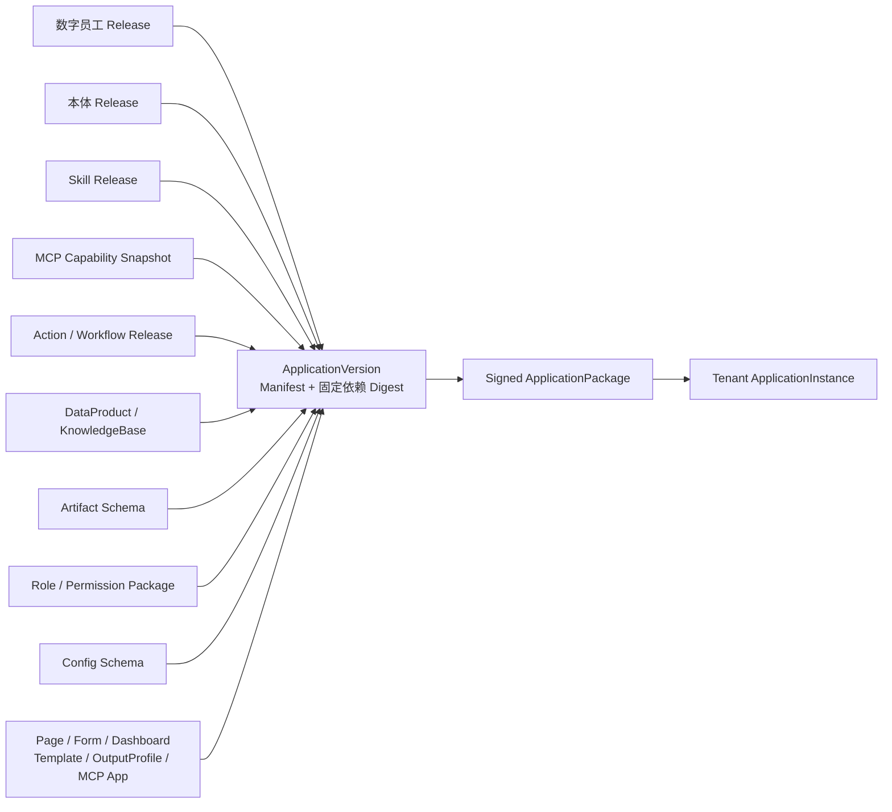
```mermaid
flowchart LR
  Employee[数字员工 Release]
  Ontology[本体 Release]
  Skill[Skill Release]
  MCP[MCP Capability Snapshot]
  Action[Action / Workflow Release]
  Data[DataProduct / KnowledgeBase]
  Schema[Artifact Schema]
  Role[Role / Permission Package]
  Config[Config Schema]

  App[ApplicationVersion\nManifest + 固定依赖 Digest]
  UX[Page / Form / Dashboard\nTemplate / OutputProfile / MCP App]
  Package[Signed ApplicationPackage]
  Instance[Tenant ApplicationInstance]

  Employee --> App
  Ontology --> App
  Skill --> App
  MCP --> App
  Action --> App
  Data --> App
  Schema --> App
  Role --> App
  Config --> App
  UX --> App
  App --> Package
  Package --> Instance
```

### 7.1 应用类型与开放顺序

| 应用/扩展类型 | 产品能力 | 开放策略 |
|---|---|---|
| 输出模板包 | Schema 绑定、Markdown/HTML/PDF/DOCX 模板、主题和多语言 | 首期开放 |
| 装配型业务应用 | 组合已有员工、本体、Skill、MCP、Action、数据、页面和角色模板 | 首期开放 |
| MCP App/UI 扩展 | 在支持宿主中显示受限交互界面 | 宿主兼容和沙箱验证后开放 |
| 可执行插件 | 渲染器、数据连接器、Workflow Node 或其他代码扩展 | 签名、SBOM、权限、隔离、资源、网络和撤销 Gate 通过后开放 |

### 7.2 应用安装生命周期

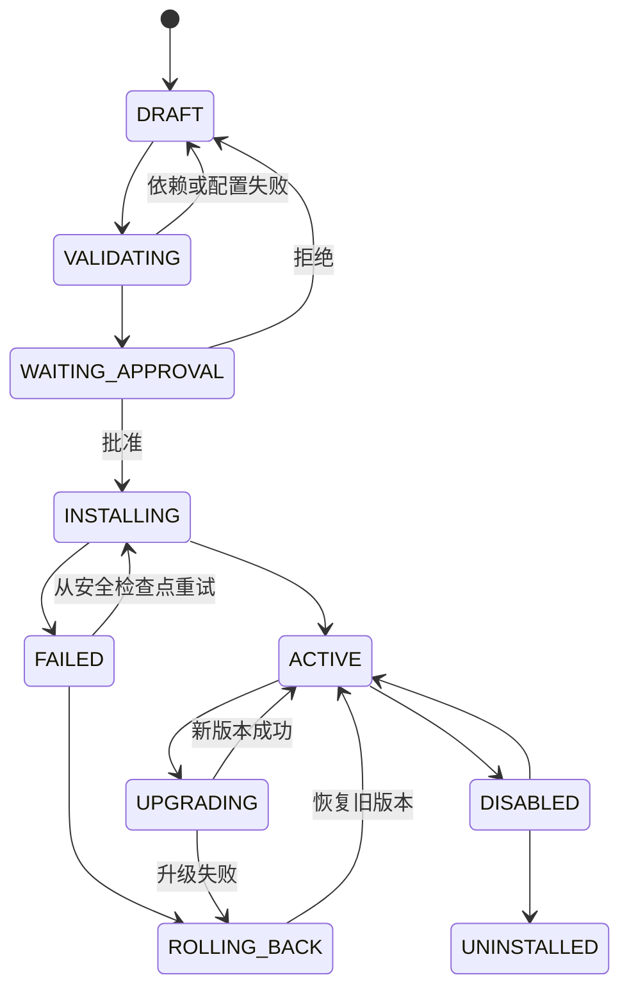
```mermaid
stateDiagram-v2
  [*] --> DRAFT
  DRAFT --> VALIDATING
  VALIDATING --> DRAFT: 依赖或配置失败
  VALIDATING --> WAITING_APPROVAL
  WAITING_APPROVAL --> DRAFT: 拒绝
  WAITING_APPROVAL --> INSTALLING: 批准
  INSTALLING --> ACTIVE
  INSTALLING --> FAILED
  FAILED --> INSTALLING: 从安全检查点重试
  FAILED --> ROLLING_BACK
  ACTIVE --> UPGRADING
  UPGRADING --> ACTIVE: 新版本成功
  UPGRADING --> ROLLING_BACK: 升级失败
  ROLLING_BACK --> ACTIVE: 恢复旧版本
  ACTIVE --> DISABLED
  DISABLED --> ACTIVE
  DISABLED --> UNINSTALLED
```

安装流程固定为：依赖解析 → 权限差异 → 管理员授权 → 配置校验 → 制品信任 → 环境准入 → 安装/迁移 → 健康与业务验证 → 激活。失败时旧活动版本继续服务；卸载只移除应用实例和派生配置，不删除仍被引用的业务数据、Artifact、Run 和审计。

## 8. 用户、宿主和数字员工运行主链

```mermaid
sequenceDiagram
  actor User as 用户
  participant Host as Codex/Claude/DSH/Hermes
  participant Connector as Host Connector
  participant IAM as 身份与权限中心
  participant Runtime as Employee Runtime
  participant App as 应用中心
  participant MCP as MCP/A2A Gateway
  participant Domain as 领域服务
  participant Artifact as 产物与审批中心

  User->>Host: 登录并发起业务任务
  Host->>Connector: Bootstrap
  Connector->>IAM: 验证 HumanUser、tenant、audience、scope
  IAM-->>Connector: 最小 UserContextProjection
  Connector->>Runtime: 请求员工与应用投影
  Runtime->>App: 解析已安装应用和固定依赖
  Runtime-->>Connector: EmployeeProjection + CapabilityCatalog + bootstrap_id
  Connector->>Runtime: 模型不可见通道换取短期 Runtime Token
  Runtime->>Runtime: 创建 BusinessSession / WorkItem / Run / Lease
  Host->>MCP: MCP 调能力或 A2A 委托员工
  MCP->>Runtime: 建立 SubRun 并校验权限衰减
  MCP->>Domain: 调用受治理服务
  Domain->>Artifact: 写 Evidence / Report / ActionPlan
  Artifact-->>Host: structuredContent + Artifact Link + 可选 MCP App
  User->>Artifact: 审批或决定
  Artifact->>Domain: 执行前复核授权、Approval、Lease 和幂等
  Domain->>Artifact: ExecutionReceipt
  Runtime-->>Connector: Run/SubRun 状态和结果投影
```

客户端可展示任务、SubAgent、状态、工具、证据、产物、成本和错误，不展示宿主或模型私有思维链。宿主断开后，平台继续保存 Run、SubRun、Workflow 和 Artifact；另一个受支持宿主可从同一 BusinessSession 和 WorkItem 继续。

## 9. 标准化输出与模板组合

标准化输出不是一个模板文件，而是四类权威对象的组合：

```mermaid
flowchart LR
  Schema[产物与审批中心\nArtifactSchema\n输出是什么]
  Template[应用中心\nTemplateVersion\n如何呈现]
  Theme[租户与配置中心\nTenantTheme / Locale\n品牌与格式]
  Preference[个人中心\nUserPreferenceSet\n用户希望怎么读]
  Profile[应用中心\nOutputProfile]
  Renderer[受治理 Renderer]
  Artifact[权威 JSON Artifact]
  Reps[Markdown / HTML / PDF / DOCX\nMCP structuredContent / App]

  Schema --> Profile
  Template --> Profile
  Theme --> Profile
  Preference --> Profile
  Profile --> Renderer
  Artifact --> Renderer
  Renderer --> Reps
```

| 资产 | 主权模块 | 核心规则 |
|---|---|---|
| ArtifactSchema | 产物与审批中心 | 定义权威结构、字段、兼容性和 Digest 语义 |
| TemplateVersion | 应用中心 | 定义 Markdown/HTML/PDF/DOCX 的布局和渲染规则 |
| OutputProfile | 应用中心 | 绑定 Schema、模板、主题、语言和允许的用户偏好范围 |
| TenantTheme/Locale | 租户与配置中心 | 提供品牌、字体、颜色、页眉页脚、日期数字和语言资源 |
| UserPreferenceSet | 个人中心 | 选择语言、详略、沟通方式和首选格式，不改变业务内容与权限 |
| ArtifactRepresentation | 产物与审批中心 | 保存派生文件引用、模板/主题版本、内容 Digest 和访问权限 |

JSON Artifact 始终是权威；Markdown、HTML、PDF、DOCX 和 MCP Apps 是表示。任何表示都必须引用同一 Artifact Digest、Schema 版本、Template 版本、Theme 版本和 Renderer 版本。模板或主题升级不得静默重写已签名历史报告；需要重渲染时创建新的 Representation。

## 10. 跨模块权威与依赖规则

| 业务问题 | 唯一权威模块 | 其他模块如何使用 |
|---|---|---|
| 我是谁、属于哪个组织、有什么权限 | 组织、身份与权限中心 | 个人中心展示最小投影；宿主获取带 TTL 的 UserContextProjection |
| 用户喜欢怎样沟通 | 个人中心 | 员工和应用读取有效偏好；不得覆盖企业策略 |
| 数字员工是什么、当前哪个版本 | 数字员工中心 | 应用装配 Release；Runtime 固定版本 Digest |
| 业务概念、关系、约束和语义动作 | 本体中心 | 数据映射、ActionBinding、应用和 Run 引用版本 Digest |
| 员工如何完成任务 | 技能与能力中心 | 员工版本绑定 Skill Release；Skill 引用 MCP/知识等依赖 |
| AI 可调用哪些服务 | MCP 服务中心 | 按用户、员工、租户、宿主和任务生成可见 Catalog |
| 一个动作如何安全执行 | Action 与工作流中心 | 本体提供语义；Artifact 提供 ActionPlan/Approval；Runtime 提供 Lease |
| 数据、文档、索引和图谱证据在哪里 | 数据与知识中心 | 本体、员工和报告引用固定数据/知识快照 |
| 可复用经验是什么 | 记忆中心 | 用户、员工和团队按策略检索；Run 固定实际命中 Digest |
| 业务结果、审批和副作用事实是什么 | 产物与审批中心 | 应用负责呈现；任务中心引用产物；运营中心审计 |
| 产品能力如何组合交付租户 | 应用中心 | 只装配各领域 Release 和 UI/模板资产，不复制权威 |
| 当前任务和委托执行到哪里 | 任务与运行中心 | 宿主、个人中心、工作流和运营中心读取投影 |
| 租户默认参数、配额和品牌是什么 | 租户与配置中心 | 应用、员工、服务和输出按层级解析有效配置 |
| 能力部署在哪里、版本和健康如何 | 宿主、环境与部署中心 | 应用安装和 Runtime 使用批准环境与 Bundle |
| 是否稳定、安全、合规、可恢复 | 运营、审计与质量中心 | 消费所有模块的观测和证据，不修改其业务权威事实 |

## 11. 跨模块失败处理

### 11.1 统一失败模型

所有异步操作必须返回 `operation_id`、对象、当前状态、当前步骤、进度、错误码、用户说明、技术详情引用、可重试性、补偿状态、关联 Run/Deployment 和审计链接。不得只显示“操作失败”。

| 失败类型 | 产品行为 |
|---|---|
| 输入或 Schema 校验失败 | 保留草稿，逐项标记字段和修复建议，不创建发布/执行事实 |
| 权限或职责冲突 | 拒绝操作，显示缺少的关系/审批而不泄露不可见资源详情 |
| 依赖缺失或版本不兼容 | 阻断发布/安装，展示依赖树、可选兼容版本和影响对象 |
| 已发布依赖被撤销 | 阻断新 Run；运行中任务按风险关闭、降级或等待人工处理 |
| MCP/模型/知识服务不可用 | 按批准 fallback 降级；无可信替代时显式失败，禁止 mock 冒充成功 |
| 应用安装或升级部分失败 | 进入 FAILED/ROLLING_BACK，从检查点恢复或回到旧活动版本 |
| Workflow/外部系统超时 | 有界重试、等待、补偿或人工对账；副作用台账防止重复执行 |
| 客户端断开 | Run、SubRun 和持久 Workflow 留在服务端；用户可从其他宿主继续 |
| 用户、员工或角色撤权 | 新调用立即拒绝；等待和副作用前重新判定；旧投影和 token 撤销 |
| 数据/知识/记忆来源删除 | 未发布候选撤销；已发布历史标记风险并生成修复任务；索引和副本传播删除 |
| 审计或证据写入失败 | 高风险写入失败关闭，不允许先执行再补审计；可逆低风险路径按策略排队 |

### 11.2 删除前影响检查

任何删除、停用、撤销、卸载和归档操作必须先生成 `ImpactReport`，至少列出：直接引用、间接依赖、活动 Run、已安装应用、租户、员工、Skill、Action、Workflow、模板、数据/知识、审批、Artifact、恢复和保留要求。用户确认的是固定 `ImpactReport.digest`；确认后依赖变化必须重新计算。

### 11.3 批量操作

批量操作对每个对象返回独立结果，禁止以整体“成功”掩盖部分失败。默认使用预检 → 固定对象集合 Digest → 执行 → 对账四阶段；涉及发布、权限、删除或外部副作用时需要审批、幂等和可恢复检查点。

## 12. 产品验收标准

### 12.1 模块完整性

- 一张平台总脑图和 15 张模块脑图与一级模块表一致。
- 每个一级模块至少有明确职责、权威对象、生命周期化 CRUD、角色、依赖和审计规则。
- 每个对象的新增、查询、修改、删除/停用/撤销/归档语义明确，不能以“管理”两个字替代功能定义。
- 发布、审批、执行、恢复等非 CRUD 业务操作具有独立状态和权限。

### 12.2 角色与租户

- 支持动态创建、复制、测试、发布、分配、停用和归档角色。
- 所有操作验证角色、关系、策略、数据范围、租户和资源状态。
- 跨租户对象 ID、搜索、导出、日志、模板、插件和缓存访问均被拒绝。
- 职责冲突、越权授权、循环继承、过期委托和孤儿高权角色可检测并处理。

### 12.3 生命周期和依赖

- 修改发布对象会创建新版本，既有 Run 和 Artifact 保持原 Digest。
- 删除或撤销前显示完整影响报告；被引用对象不会被物理删除。
- 发布、应用安装、插件启用、角色生效和部署均支持预检、审批、灰度、回滚和审计。
- 依赖撤销、版本不兼容和服务不可用时，产品明确阻断、降级或恢复路径。

### 12.4 宿主与运行

- 宿主能取得最小 UserContextProjection、EmployeeProjection 和 CapabilityCatalog。
- 客户端可以查看 Run/SubRun 状态、任务、工具、证据、产物和错误，但看不到私有思维链和秘密。
- 宿主 A 创建的业务任务可由宿主 B 从同一 BusinessSession/WorkItem 继续。
- 重复调用、并发确认、迟到 Lease、Workflow Replay 和事件重放不会产生重复业务效果。

### 12.5 标准输出和应用

- JSON Artifact 与 Markdown、HTML、PDF、DOCX 内容一致并可追溯到同一 Digest。
- 模板、主题和用户偏好变化不会改变权威 Artifact 或已签名历史表示。
- 应用安装显示依赖、权限、配置、版本、迁移和回滚计划。
- 模板包和装配型应用可独立发布；MCP Apps 有 fallback；可执行插件未通过安全 Gate 时不能进入生产。

### 12.6 数据、知识、本体和记忆

- 业务结论可追溯到数据快照、知识跨度、本体版本、模型回执、授权决定和 Run。
- 本体候选经来源、冲突、SHACL、影响和评审后才可发布。
- 知识图谱和 Jena 投影可从权威版本重建，不成为唯一事实源。
- 记忆候选未经确认/策略审核不进入长期记忆；冲突、撤销和删除能传播到索引与副本。

### 12.7 运营和恢复

- 关键读取、写入、授权、发布、审批、执行、删除和运维动作均产生审计。
- 指标健康不能替代真实登录、数据正确性、权限、备份恢复和业务验收。
- 每个生产 Gate 只有 `PASSED`、`FAILED`、`NOT_EXERCISED`，未执行不得记为通过。
- 备份必须通过真实恢复和对账；应用、数据、对象、事件、工作流、配置和信任材料均有恢复边界。

## 13. 后续规格拆分建议

本文件是全平台产品能力主规格，不应直接生成一个覆盖全部 15 模块的单体实施计划。书面评审通过后，应按以下顺序拆分独立产品规格和实施计划：

1. 个人中心 + 组织身份权限 + Bootstrap 用户上下文。
2. 任务运行中心 + 数字员工中心 + 宿主 Connector。
3. 产物审批中心 + 应用中心 + 标准输出模板。
4. 本体中心 + 技能能力中心 + MCP 服务中心。
5. Action 工作流中心 + 数据知识中心 + 记忆中心。
6. 租户配置 + 环境部署 + 运营审计质量。

每个子规格必须复用本文权威边界、对象生命周期和错误模型，不得复制用户、员工、Run、Artifact、角色、本体或应用状态。
